# Component Visual Gallery / 构件图像查看: obs-comp-cand-001556

English:
This page displays OBIMD subcharacter PNG assets extracted into this concrete
corpus object directory for human review.

简体中文：
本页展示抽取到当前具体 corpus 对象目录内的 OBIMD subcharacter PNG 资料，供人工复核使用。

Boundary / 边界：
dataset image candidate only; not a confirmed component form, not a component
assignment, and not a decipherment claim.
- not a confirmed component form
- not a component assignment
- not a decipherment claim

## Concrete Questions To Check / 具体待查问题

- Open 06_component-visual-index.csv and name the local image row.
- 打开 06_component-visual-index.csv，写明本地图像行。
- Open 09_component-visual-route-index.csv and name the source route row.
- 打开 09_component-visual-route-index.csv，写明来源路线行。
- Open 13_component-context-evidence-dossier.md for character context.
- 打开 13_component-context-evidence-dossier.md，核对单字与卜辞上下文。
- Record the missing image, near-shape, source, or context route.
- 记录缺失的图像、近形、来源或上下文路线。

## asset-017076

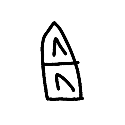

- source_zip_member: `Sub-character Images/f0j9ho8ua2/s2zwnqz3pp/27btpxjt4q.png`
- checksum_sha256: see `06_component-visual-index.csv`.
- review_status: `needs_human_visual_review`
- caution: source-marked review image only.

## asset-017077

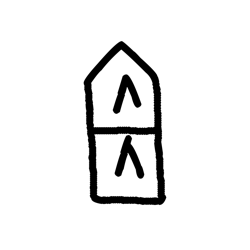

- source_zip_member: `Sub-character Images/f0j9ho8ua2/s2zwnqz3pp/2wl2x4j00u.png`
- checksum_sha256: see `06_component-visual-index.csv`.
- review_status: `needs_human_visual_review`
- caution: source-marked review image only.

## asset-017078

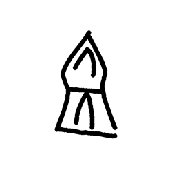

- source_zip_member: `Sub-character Images/f0j9ho8ua2/s2zwnqz3pp/2xsndff8fx.png`
- checksum_sha256: see `06_component-visual-index.csv`.
- review_status: `needs_human_visual_review`
- caution: source-marked review image only.

## asset-017079

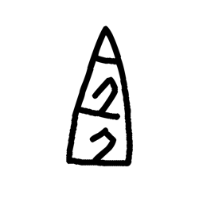

- source_zip_member: `Sub-character Images/f0j9ho8ua2/s2zwnqz3pp/3paslzd81g.png`
- checksum_sha256: see `06_component-visual-index.csv`.
- review_status: `needs_human_visual_review`
- caution: source-marked review image only.

## asset-017080

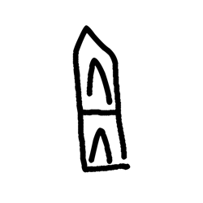

- source_zip_member: `Sub-character Images/f0j9ho8ua2/s2zwnqz3pp/48ufoegr97.png`
- checksum_sha256: see `06_component-visual-index.csv`.
- review_status: `needs_human_visual_review`
- caution: source-marked review image only.

## asset-017081

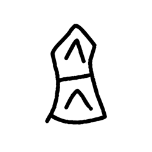

- source_zip_member: `Sub-character Images/f0j9ho8ua2/s2zwnqz3pp/4tg1zsx902.png`
- checksum_sha256: see `06_component-visual-index.csv`.
- review_status: `needs_human_visual_review`
- caution: source-marked review image only.

## asset-017082

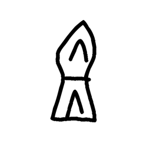

- source_zip_member: `Sub-character Images/f0j9ho8ua2/s2zwnqz3pp/5sbhj2bk9k.png`
- checksum_sha256: see `06_component-visual-index.csv`.
- review_status: `needs_human_visual_review`
- caution: source-marked review image only.

## asset-017083

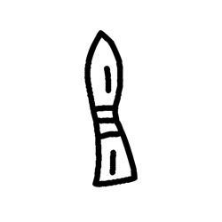

- source_zip_member: `Sub-character Images/f0j9ho8ua2/s2zwnqz3pp/8q8y956xp7.png`
- checksum_sha256: see `06_component-visual-index.csv`.
- review_status: `needs_human_visual_review`
- caution: source-marked review image only.

## asset-017084

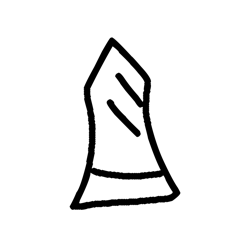

- source_zip_member: `Sub-character Images/f0j9ho8ua2/s2zwnqz3pp/9sv293ec1a.png`
- checksum_sha256: see `06_component-visual-index.csv`.
- review_status: `needs_human_visual_review`
- caution: source-marked review image only.

## asset-017085

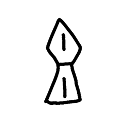

- source_zip_member: `Sub-character Images/f0j9ho8ua2/s2zwnqz3pp/aitg9469t7.png`
- checksum_sha256: see `06_component-visual-index.csv`.
- review_status: `needs_human_visual_review`
- caution: source-marked review image only.

## asset-017086

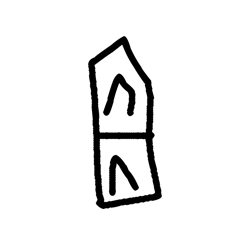

- source_zip_member: `Sub-character Images/f0j9ho8ua2/s2zwnqz3pp/dio4gms9d5.png`
- checksum_sha256: see `06_component-visual-index.csv`.
- review_status: `needs_human_visual_review`
- caution: source-marked review image only.

## asset-017087

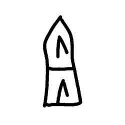

- source_zip_member: `Sub-character Images/f0j9ho8ua2/s2zwnqz3pp/eyzjcz3zww.png`
- checksum_sha256: see `06_component-visual-index.csv`.
- review_status: `needs_human_visual_review`
- caution: source-marked review image only.

## asset-017088

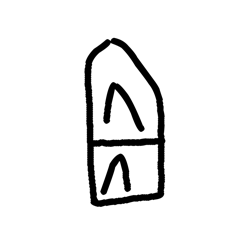

- source_zip_member: `Sub-character Images/f0j9ho8ua2/s2zwnqz3pp/ftjcxbrdje.png`
- checksum_sha256: see `06_component-visual-index.csv`.
- review_status: `needs_human_visual_review`
- caution: source-marked review image only.

## asset-017089

- source_zip_member: `Sub-character Images/f0j9ho8ua2/s2zwnqz3pp/h3g3byjha5.png`
- checksum_sha256: see `06_component-visual-index.csv`.
- review_status: `needs_human_visual_review`
- caution: source-marked review image only.

## asset-017090

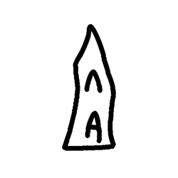

- source_zip_member: `Sub-character Images/f0j9ho8ua2/s2zwnqz3pp/il61fezzc7.png`
- checksum_sha256: see `06_component-visual-index.csv`.
- review_status: `needs_human_visual_review`
- caution: source-marked review image only.

## asset-017091

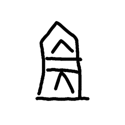

- source_zip_member: `Sub-character Images/f0j9ho8ua2/s2zwnqz3pp/jd7sut5rtz.png`
- checksum_sha256: see `06_component-visual-index.csv`.
- review_status: `needs_human_visual_review`
- caution: source-marked review image only.

## asset-017092

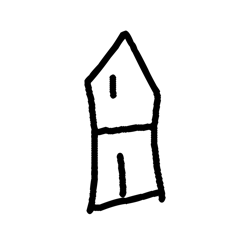

- source_zip_member: `Sub-character Images/f0j9ho8ua2/s2zwnqz3pp/lo1ajmonmm.png`
- checksum_sha256: see `06_component-visual-index.csv`.
- review_status: `needs_human_visual_review`
- caution: source-marked review image only.

## asset-017093

- source_zip_member: `Sub-character Images/f0j9ho8ua2/s2zwnqz3pp/muw2o20blk.png`
- checksum_sha256: see `06_component-visual-index.csv`.
- review_status: `needs_human_visual_review`
- caution: source-marked review image only.

## asset-017094

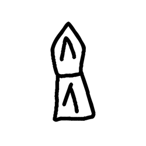

- source_zip_member: `Sub-character Images/f0j9ho8ua2/s2zwnqz3pp/n8ri3642qv.png`
- checksum_sha256: see `06_component-visual-index.csv`.
- review_status: `needs_human_visual_review`
- caution: source-marked review image only.

## asset-017095

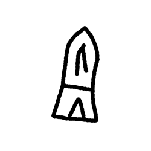

- source_zip_member: `Sub-character Images/f0j9ho8ua2/s2zwnqz3pp/nb4qmjfrk3.png`
- checksum_sha256: see `06_component-visual-index.csv`.
- review_status: `needs_human_visual_review`
- caution: source-marked review image only.

## asset-017096

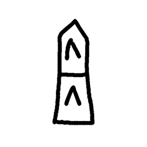

- source_zip_member: `Sub-character Images/f0j9ho8ua2/s2zwnqz3pp/q0mo830pek.png`
- checksum_sha256: see `06_component-visual-index.csv`.
- review_status: `needs_human_visual_review`
- caution: source-marked review image only.

## asset-017097

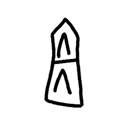

- source_zip_member: `Sub-character Images/f0j9ho8ua2/s2zwnqz3pp/qura8em1fc.png`
- checksum_sha256: see `06_component-visual-index.csv`.
- review_status: `needs_human_visual_review`
- caution: source-marked review image only.

## asset-017098

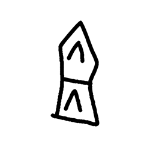

- source_zip_member: `Sub-character Images/f0j9ho8ua2/s2zwnqz3pp/r7mruslwfr.png`
- checksum_sha256: see `06_component-visual-index.csv`.
- review_status: `needs_human_visual_review`
- caution: source-marked review image only.

## asset-017099

- source_zip_member: `Sub-character Images/f0j9ho8ua2/s2zwnqz3pp/rb85n0ada7.png`
- checksum_sha256: see `06_component-visual-index.csv`.
- review_status: `needs_human_visual_review`
- caution: source-marked review image only.

## asset-017100

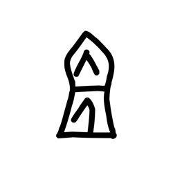

- source_zip_member: `Sub-character Images/f0j9ho8ua2/s2zwnqz3pp/s2zwnqz3pp.png`
- checksum_sha256: see `06_component-visual-index.csv`.
- review_status: `needs_human_visual_review`
- caution: source-marked review image only.

## asset-017101

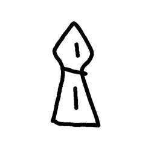

- source_zip_member: `Sub-character Images/f0j9ho8ua2/s2zwnqz3pp/u6n50d0tbr.png`
- checksum_sha256: see `06_component-visual-index.csv`.
- review_status: `needs_human_visual_review`
- caution: source-marked review image only.

## asset-017102

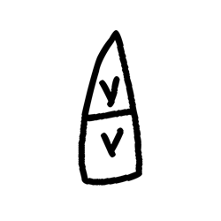

- source_zip_member: `Sub-character Images/f0j9ho8ua2/s2zwnqz3pp/zbwh1wdkvw.png`
- checksum_sha256: see `06_component-visual-index.csv`.
- review_status: `needs_human_visual_review`
- caution: source-marked review image only.

## asset-017103

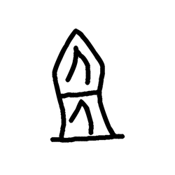

- source_zip_member: `Sub-character Images/f0j9ho8ua2/s2zwnqz3pp/zxbufcj8a4.png`
- checksum_sha256: see `06_component-visual-index.csv`.
- review_status: `needs_human_visual_review`
- caution: source-marked review image only.
