# Component Visual Gallery / 构件图像查看: obs-comp-cand-001572

English:
This page displays OBIMD subcharacter PNG assets extracted into this concrete
corpus object directory for human review.

简体中文：
本页展示抽取到当前具体 corpus 对象目录内的 OBIMD subcharacter PNG 资料，供人工复核使用。

Boundary / 边界：
dataset image candidate only; not a confirmed component form, not a component
assignment, and not a decipherment claim.
- not a confirmed component form
- not a component assignment
- not a decipherment claim

## Concrete Questions To Check / 具体待查问题

- Which local image should be opened first?
- 应先打开哪一张本地构件图像？
- Which source zip member anchors this image?
- 哪一个 source zip member 能定位这张图像？
- Which near-shape or variant comparison is still missing?
- 还缺哪些近形或异体比较？
- Which character or inscription context should be checked next?
- 下一步应核对哪些单字或卜辞上下文？
- What evidence is missing before a component assignment?
- 正式构件归属前还缺哪些证据？

## asset-017119

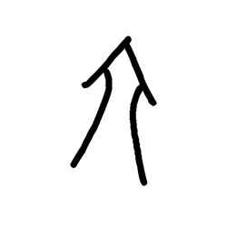

- source_zip_member: `Sub-character Images/phjj09b89l/phjj09b89l/2frnr5pp2z.png`
- checksum_sha256: see `06_component-visual-index.csv`.
- review_status: `needs_human_visual_review`
- caution: source-marked review image only.

## asset-017120

- source_zip_member: `Sub-character Images/phjj09b89l/phjj09b89l/4j9uo7vgc2.png`
- checksum_sha256: see `06_component-visual-index.csv`.
- review_status: `needs_human_visual_review`
- caution: source-marked review image only.

## asset-017121

- source_zip_member: `Sub-character Images/phjj09b89l/phjj09b89l/4ltltkit3d.png`
- checksum_sha256: see `06_component-visual-index.csv`.
- review_status: `needs_human_visual_review`
- caution: source-marked review image only.

## asset-017122

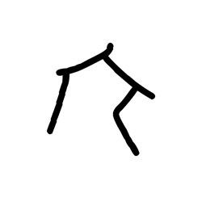

- source_zip_member: `Sub-character Images/phjj09b89l/phjj09b89l/52p8uehp5o.png`
- checksum_sha256: see `06_component-visual-index.csv`.
- review_status: `needs_human_visual_review`
- caution: source-marked review image only.

## asset-017123

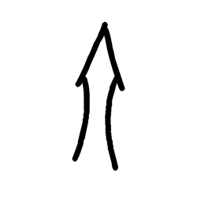

- source_zip_member: `Sub-character Images/phjj09b89l/phjj09b89l/5jiko3yzlf.png`
- checksum_sha256: see `06_component-visual-index.csv`.
- review_status: `needs_human_visual_review`
- caution: source-marked review image only.

## asset-017124

- source_zip_member: `Sub-character Images/phjj09b89l/phjj09b89l/7il4luctcv.png`
- checksum_sha256: see `06_component-visual-index.csv`.
- review_status: `needs_human_visual_review`
- caution: source-marked review image only.

## asset-017125

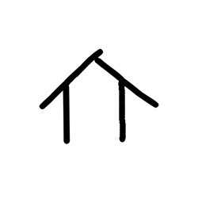

- source_zip_member: `Sub-character Images/phjj09b89l/phjj09b89l/7mxwgjav98.png`
- checksum_sha256: see `06_component-visual-index.csv`.
- review_status: `needs_human_visual_review`
- caution: source-marked review image only.

## asset-017126

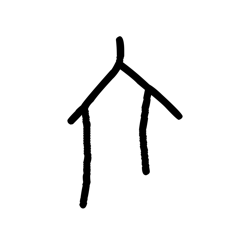

- source_zip_member: `Sub-character Images/phjj09b89l/phjj09b89l/8441fclhax.png`
- checksum_sha256: see `06_component-visual-index.csv`.
- review_status: `needs_human_visual_review`
- caution: source-marked review image only.

## asset-017127

- source_zip_member: `Sub-character Images/phjj09b89l/phjj09b89l/cgvwhip9dg.png`
- checksum_sha256: see `06_component-visual-index.csv`.
- review_status: `needs_human_visual_review`
- caution: source-marked review image only.

## asset-017128

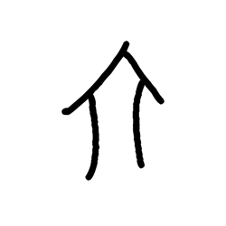

- source_zip_member: `Sub-character Images/phjj09b89l/phjj09b89l/diqa57sl87.png`
- checksum_sha256: see `06_component-visual-index.csv`.
- review_status: `needs_human_visual_review`
- caution: source-marked review image only.

## asset-017129

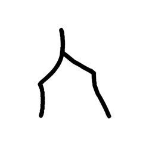

- source_zip_member: `Sub-character Images/phjj09b89l/phjj09b89l/dv3rrdmam9.png`
- checksum_sha256: see `06_component-visual-index.csv`.
- review_status: `needs_human_visual_review`
- caution: source-marked review image only.

## asset-017130

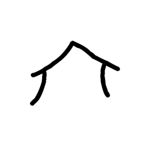

- source_zip_member: `Sub-character Images/phjj09b89l/phjj09b89l/ercgwa3luj.png`
- checksum_sha256: see `06_component-visual-index.csv`.
- review_status: `needs_human_visual_review`
- caution: source-marked review image only.

## asset-017131

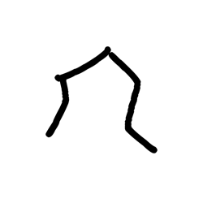

- source_zip_member: `Sub-character Images/phjj09b89l/phjj09b89l/esnrfakglp.png`
- checksum_sha256: see `06_component-visual-index.csv`.
- review_status: `needs_human_visual_review`
- caution: source-marked review image only.

## asset-017132

- source_zip_member: `Sub-character Images/phjj09b89l/phjj09b89l/flf9idb2c8.png`
- checksum_sha256: see `06_component-visual-index.csv`.
- review_status: `needs_human_visual_review`
- caution: source-marked review image only.

## asset-017133

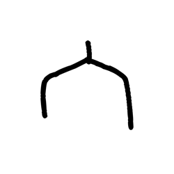

- source_zip_member: `Sub-character Images/phjj09b89l/phjj09b89l/fxzeyfxcu7.png`
- checksum_sha256: see `06_component-visual-index.csv`.
- review_status: `needs_human_visual_review`
- caution: source-marked review image only.

## asset-017134

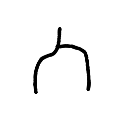

- source_zip_member: `Sub-character Images/phjj09b89l/phjj09b89l/i4omuq9lmi.png`
- checksum_sha256: see `06_component-visual-index.csv`.
- review_status: `needs_human_visual_review`
- caution: source-marked review image only.

## asset-017135

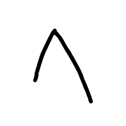

- source_zip_member: `Sub-character Images/phjj09b89l/phjj09b89l/i7upbzuhnr.png`
- checksum_sha256: see `06_component-visual-index.csv`.
- review_status: `needs_human_visual_review`
- caution: source-marked review image only.

## asset-017136

- source_zip_member: `Sub-character Images/phjj09b89l/phjj09b89l/kah38tt9bf.png`
- checksum_sha256: see `06_component-visual-index.csv`.
- review_status: `needs_human_visual_review`
- caution: source-marked review image only.

## asset-017137

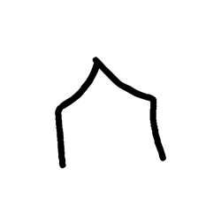

- source_zip_member: `Sub-character Images/phjj09b89l/phjj09b89l/kwgm7rx7rh.png`
- checksum_sha256: see `06_component-visual-index.csv`.
- review_status: `needs_human_visual_review`
- caution: source-marked review image only.

## asset-017138

- source_zip_member: `Sub-character Images/phjj09b89l/phjj09b89l/la0vg6ng7s.png`
- checksum_sha256: see `06_component-visual-index.csv`.
- review_status: `needs_human_visual_review`
- caution: source-marked review image only.

## asset-017139

- source_zip_member: `Sub-character Images/phjj09b89l/phjj09b89l/nugn5bly1n.png`
- checksum_sha256: see `06_component-visual-index.csv`.
- review_status: `needs_human_visual_review`
- caution: source-marked review image only.

## asset-017140

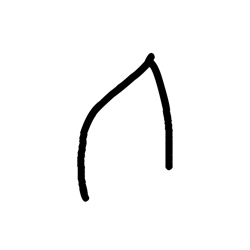

- source_zip_member: `Sub-character Images/phjj09b89l/phjj09b89l/pabtih4boq.png`
- checksum_sha256: see `06_component-visual-index.csv`.
- review_status: `needs_human_visual_review`
- caution: source-marked review image only.

## asset-017141

- source_zip_member: `Sub-character Images/phjj09b89l/phjj09b89l/phjj09b89l.png`
- checksum_sha256: see `06_component-visual-index.csv`.
- review_status: `needs_human_visual_review`
- caution: source-marked review image only.

## asset-017142

- source_zip_member: `Sub-character Images/phjj09b89l/phjj09b89l/pv1jwadmj8.png`
- checksum_sha256: see `06_component-visual-index.csv`.
- review_status: `needs_human_visual_review`
- caution: source-marked review image only.

## asset-017143

- source_zip_member: `Sub-character Images/phjj09b89l/phjj09b89l/q6ei2qwylj.png`
- checksum_sha256: see `06_component-visual-index.csv`.
- review_status: `needs_human_visual_review`
- caution: source-marked review image only.

## asset-017144

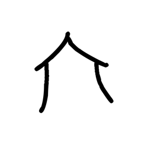

- source_zip_member: `Sub-character Images/phjj09b89l/phjj09b89l/qj6wdvvq3j.png`
- checksum_sha256: see `06_component-visual-index.csv`.
- review_status: `needs_human_visual_review`
- caution: source-marked review image only.

## asset-017145

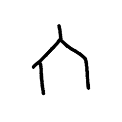

- source_zip_member: `Sub-character Images/phjj09b89l/phjj09b89l/qsfszjcpxw.png`
- checksum_sha256: see `06_component-visual-index.csv`.
- review_status: `needs_human_visual_review`
- caution: source-marked review image only.

## asset-017146

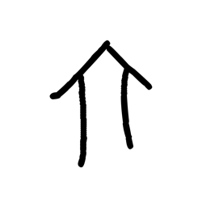

- source_zip_member: `Sub-character Images/phjj09b89l/phjj09b89l/qshowbtfws.png`
- checksum_sha256: see `06_component-visual-index.csv`.
- review_status: `needs_human_visual_review`
- caution: source-marked review image only.

## asset-017147

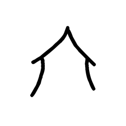

- source_zip_member: `Sub-character Images/phjj09b89l/phjj09b89l/r7drtkw8yx.png`
- checksum_sha256: see `06_component-visual-index.csv`.
- review_status: `needs_human_visual_review`
- caution: source-marked review image only.

## asset-017148

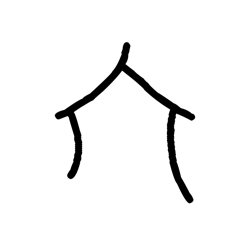

- source_zip_member: `Sub-character Images/phjj09b89l/phjj09b89l/togoygg2k5.png`
- checksum_sha256: see `06_component-visual-index.csv`.
- review_status: `needs_human_visual_review`
- caution: source-marked review image only.

## asset-017149

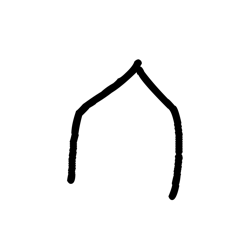

- source_zip_member: `Sub-character Images/phjj09b89l/phjj09b89l/vxxo0zgd35.png`
- checksum_sha256: see `06_component-visual-index.csv`.
- review_status: `needs_human_visual_review`
- caution: source-marked review image only.

## asset-017150

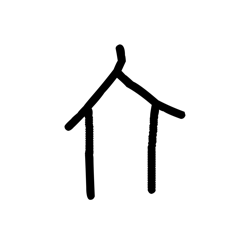

- source_zip_member: `Sub-character Images/phjj09b89l/phjj09b89l/wnqb9eke4q.png`
- checksum_sha256: see `06_component-visual-index.csv`.
- review_status: `needs_human_visual_review`
- caution: source-marked review image only.

## asset-017151

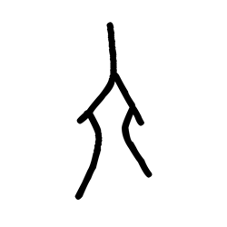

- source_zip_member: `Sub-character Images/phjj09b89l/phjj09b89l/wxcaznqg04.png`
- checksum_sha256: see `06_component-visual-index.csv`.
- review_status: `needs_human_visual_review`
- caution: source-marked review image only.

## asset-017152

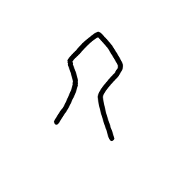

- source_zip_member: `Sub-character Images/phjj09b89l/phjj09b89l/y47bq3agkw.png`
- checksum_sha256: see `06_component-visual-index.csv`.
- review_status: `needs_human_visual_review`
- caution: source-marked review image only.

## asset-017153

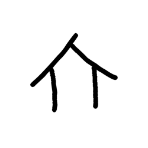

- source_zip_member: `Sub-character Images/phjj09b89l/phjj09b89l/z4hmlpm04q.png`
- checksum_sha256: see `06_component-visual-index.csv`.
- review_status: `needs_human_visual_review`
- caution: source-marked review image only.
