# Component Visual Gallery / 构件图像查看: obs-comp-cand-001586

English:
This page displays OBIMD subcharacter PNG assets extracted into this concrete
corpus object directory for human review.

简体中文：
本页展示抽取到当前具体 corpus 对象目录内的 OBIMD subcharacter PNG 资料，供人工复核使用。

Boundary / 边界：
dataset image candidate only; not a confirmed component form, not a component
assignment, and not a decipherment claim.
- not a confirmed component form
- not a component assignment
- not a decipherment claim

## Concrete Questions To Check / 具体待查问题

- Which local image should be opened first?
- 应先打开哪一张本地构件图像？
- Which source zip member anchors this image?
- 哪一个 source zip member 能定位这张图像？
- Which near-shape or variant comparison is still missing?
- 还缺哪些近形或异体比较？
- Which character or inscription context should be checked next?
- 下一步应核对哪些单字或卜辞上下文？
- What evidence is missing before a component assignment?
- 正式构件归属前还缺哪些证据？

## asset-017167

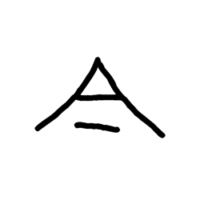

- source_zip_member: `Sub-character Images/ihsuhqgmdc/ihsuhqgmdc/02pwle9kwz.png`
- checksum_sha256: see `06_component-visual-index.csv`.
- review_status: `needs_human_visual_review`
- caution: source-marked review image only.

## asset-017168

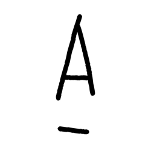

- source_zip_member: `Sub-character Images/ihsuhqgmdc/ihsuhqgmdc/1asph3hs3y.png`
- checksum_sha256: see `06_component-visual-index.csv`.
- review_status: `needs_human_visual_review`
- caution: source-marked review image only.

## asset-017169

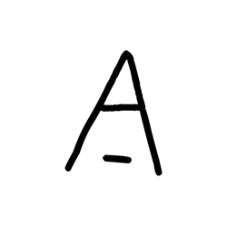

- source_zip_member: `Sub-character Images/ihsuhqgmdc/ihsuhqgmdc/29h3w4tddc.png`
- checksum_sha256: see `06_component-visual-index.csv`.
- review_status: `needs_human_visual_review`
- caution: source-marked review image only.

## asset-017170

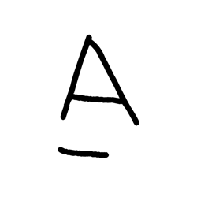

- source_zip_member: `Sub-character Images/ihsuhqgmdc/ihsuhqgmdc/2nkmzwe6vc.png`
- checksum_sha256: see `06_component-visual-index.csv`.
- review_status: `needs_human_visual_review`
- caution: source-marked review image only.

## asset-017171

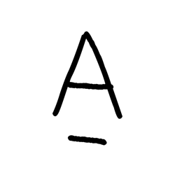

- source_zip_member: `Sub-character Images/ihsuhqgmdc/ihsuhqgmdc/2v55pauxux.png`
- checksum_sha256: see `06_component-visual-index.csv`.
- review_status: `needs_human_visual_review`
- caution: source-marked review image only.

## asset-017172

- source_zip_member: `Sub-character Images/ihsuhqgmdc/ihsuhqgmdc/33nghbj2hp.png`
- checksum_sha256: see `06_component-visual-index.csv`.
- review_status: `needs_human_visual_review`
- caution: source-marked review image only.

## asset-017173

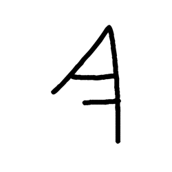

- source_zip_member: `Sub-character Images/ihsuhqgmdc/ihsuhqgmdc/4nx03rmk7f.png`
- checksum_sha256: see `06_component-visual-index.csv`.
- review_status: `needs_human_visual_review`
- caution: source-marked review image only.

## asset-017174

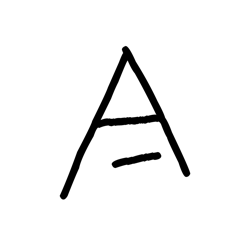

- source_zip_member: `Sub-character Images/ihsuhqgmdc/ihsuhqgmdc/50vd7wievb.png`
- checksum_sha256: see `06_component-visual-index.csv`.
- review_status: `needs_human_visual_review`
- caution: source-marked review image only.

## asset-017175

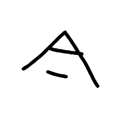

- source_zip_member: `Sub-character Images/ihsuhqgmdc/ihsuhqgmdc/52s046vz0o.png`
- checksum_sha256: see `06_component-visual-index.csv`.
- review_status: `needs_human_visual_review`
- caution: source-marked review image only.

## asset-017176

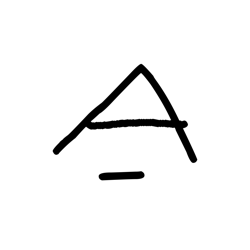

- source_zip_member: `Sub-character Images/ihsuhqgmdc/ihsuhqgmdc/5g1igeknv0.png`
- checksum_sha256: see `06_component-visual-index.csv`.
- review_status: `needs_human_visual_review`
- caution: source-marked review image only.

## asset-017177

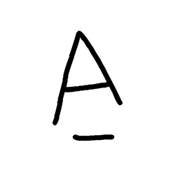

- source_zip_member: `Sub-character Images/ihsuhqgmdc/ihsuhqgmdc/5t4494rhwj.png`
- checksum_sha256: see `06_component-visual-index.csv`.
- review_status: `needs_human_visual_review`
- caution: source-marked review image only.

## asset-017178

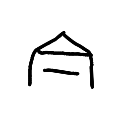

- source_zip_member: `Sub-character Images/ihsuhqgmdc/ihsuhqgmdc/6602b642e4.png`
- checksum_sha256: see `06_component-visual-index.csv`.
- review_status: `needs_human_visual_review`
- caution: source-marked review image only.

## asset-017179

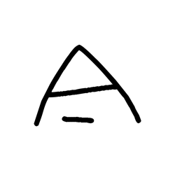

- source_zip_member: `Sub-character Images/ihsuhqgmdc/ihsuhqgmdc/6waqrzr5r9.png`
- checksum_sha256: see `06_component-visual-index.csv`.
- review_status: `needs_human_visual_review`
- caution: source-marked review image only.

## asset-017180

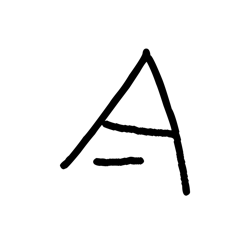

- source_zip_member: `Sub-character Images/ihsuhqgmdc/ihsuhqgmdc/801o7d5o8o.png`
- checksum_sha256: see `06_component-visual-index.csv`.
- review_status: `needs_human_visual_review`
- caution: source-marked review image only.

## asset-017181

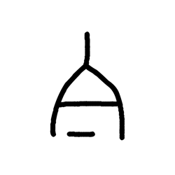

- source_zip_member: `Sub-character Images/ihsuhqgmdc/ihsuhqgmdc/9fappc48jo.png`
- checksum_sha256: see `06_component-visual-index.csv`.
- review_status: `needs_human_visual_review`
- caution: source-marked review image only.

## asset-017182

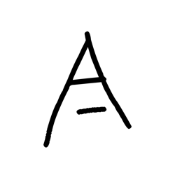

- source_zip_member: `Sub-character Images/ihsuhqgmdc/ihsuhqgmdc/9lo87i50bv.png`
- checksum_sha256: see `06_component-visual-index.csv`.
- review_status: `needs_human_visual_review`
- caution: source-marked review image only.

## asset-017183

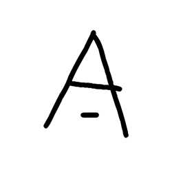

- source_zip_member: `Sub-character Images/ihsuhqgmdc/ihsuhqgmdc/ays1lw922q.png`
- checksum_sha256: see `06_component-visual-index.csv`.
- review_status: `needs_human_visual_review`
- caution: source-marked review image only.

## asset-017184

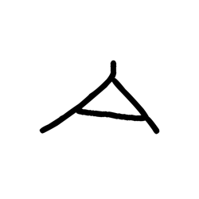

- source_zip_member: `Sub-character Images/ihsuhqgmdc/ihsuhqgmdc/d8nd1e5uop.png`
- checksum_sha256: see `06_component-visual-index.csv`.
- review_status: `needs_human_visual_review`
- caution: source-marked review image only.

## asset-017185

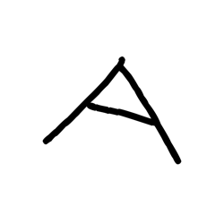

- source_zip_member: `Sub-character Images/ihsuhqgmdc/ihsuhqgmdc/dal3olkmt4.png`
- checksum_sha256: see `06_component-visual-index.csv`.
- review_status: `needs_human_visual_review`
- caution: source-marked review image only.

## asset-017186

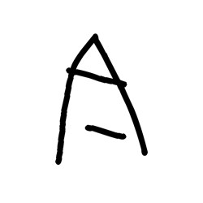

- source_zip_member: `Sub-character Images/ihsuhqgmdc/ihsuhqgmdc/f8s5bnwmcy.png`
- checksum_sha256: see `06_component-visual-index.csv`.
- review_status: `needs_human_visual_review`
- caution: source-marked review image only.

## asset-017187

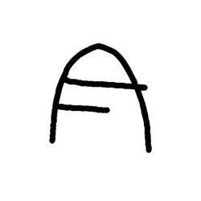

- source_zip_member: `Sub-character Images/ihsuhqgmdc/ihsuhqgmdc/gk7pys5j3o.png`
- checksum_sha256: see `06_component-visual-index.csv`.
- review_status: `needs_human_visual_review`
- caution: source-marked review image only.

## asset-017188

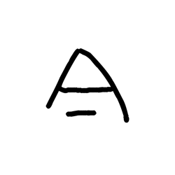

- source_zip_member: `Sub-character Images/ihsuhqgmdc/ihsuhqgmdc/he55zgoqg0.png`
- checksum_sha256: see `06_component-visual-index.csv`.
- review_status: `needs_human_visual_review`
- caution: source-marked review image only.

## asset-017189

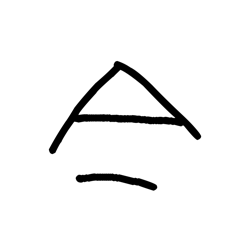

- source_zip_member: `Sub-character Images/ihsuhqgmdc/ihsuhqgmdc/hezbjhblbd.png`
- checksum_sha256: see `06_component-visual-index.csv`.
- review_status: `needs_human_visual_review`
- caution: source-marked review image only.

## asset-017190

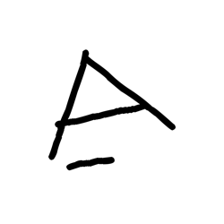

- source_zip_member: `Sub-character Images/ihsuhqgmdc/ihsuhqgmdc/hj2z475org.png`
- checksum_sha256: see `06_component-visual-index.csv`.
- review_status: `needs_human_visual_review`
- caution: source-marked review image only.

## asset-017191

- source_zip_member: `Sub-character Images/ihsuhqgmdc/ihsuhqgmdc/ihsuhqgmdc.png`
- checksum_sha256: see `06_component-visual-index.csv`.
- review_status: `needs_human_visual_review`
- caution: source-marked review image only.

## asset-017192

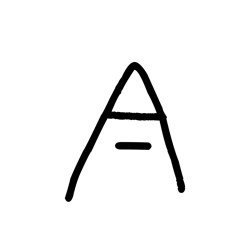

- source_zip_member: `Sub-character Images/ihsuhqgmdc/ihsuhqgmdc/j4o3s6r5q0.png`
- checksum_sha256: see `06_component-visual-index.csv`.
- review_status: `needs_human_visual_review`
- caution: source-marked review image only.

## asset-017193

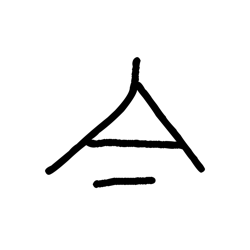

- source_zip_member: `Sub-character Images/ihsuhqgmdc/ihsuhqgmdc/jnucfy65rs.png`
- checksum_sha256: see `06_component-visual-index.csv`.
- review_status: `needs_human_visual_review`
- caution: source-marked review image only.

## asset-017194

- source_zip_member: `Sub-character Images/ihsuhqgmdc/ihsuhqgmdc/kmj277u4at.png`
- checksum_sha256: see `06_component-visual-index.csv`.
- review_status: `needs_human_visual_review`
- caution: source-marked review image only.

## asset-017195

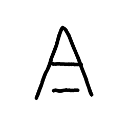

- source_zip_member: `Sub-character Images/ihsuhqgmdc/ihsuhqgmdc/ngbakwrv5g.png`
- checksum_sha256: see `06_component-visual-index.csv`.
- review_status: `needs_human_visual_review`
- caution: source-marked review image only.

## asset-017196

- source_zip_member: `Sub-character Images/ihsuhqgmdc/ihsuhqgmdc/ol6b2wnqa2.png`
- checksum_sha256: see `06_component-visual-index.csv`.
- review_status: `needs_human_visual_review`
- caution: source-marked review image only.

## asset-017197

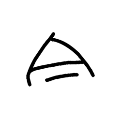

- source_zip_member: `Sub-character Images/ihsuhqgmdc/ihsuhqgmdc/ovcnk46orb.png`
- checksum_sha256: see `06_component-visual-index.csv`.
- review_status: `needs_human_visual_review`
- caution: source-marked review image only.

## asset-017198

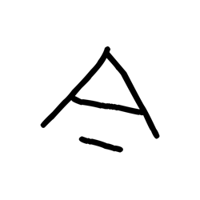

- source_zip_member: `Sub-character Images/ihsuhqgmdc/ihsuhqgmdc/paw5ttyz0g.png`
- checksum_sha256: see `06_component-visual-index.csv`.
- review_status: `needs_human_visual_review`
- caution: source-marked review image only.

## asset-017199

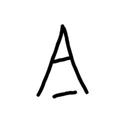

- source_zip_member: `Sub-character Images/ihsuhqgmdc/ihsuhqgmdc/pbiw9too7c.png`
- checksum_sha256: see `06_component-visual-index.csv`.
- review_status: `needs_human_visual_review`
- caution: source-marked review image only.

## asset-017200

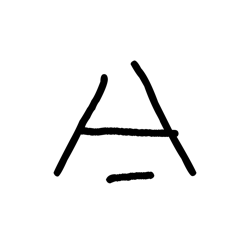

- source_zip_member: `Sub-character Images/ihsuhqgmdc/ihsuhqgmdc/pnnchsnr5c.png`
- checksum_sha256: see `06_component-visual-index.csv`.
- review_status: `needs_human_visual_review`
- caution: source-marked review image only.

## asset-017201

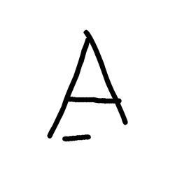

- source_zip_member: `Sub-character Images/ihsuhqgmdc/ihsuhqgmdc/ppyl6kd5jx.png`
- checksum_sha256: see `06_component-visual-index.csv`.
- review_status: `needs_human_visual_review`
- caution: source-marked review image only.

## asset-017202

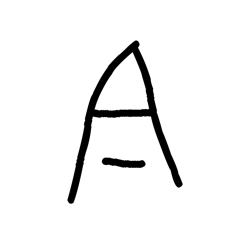

- source_zip_member: `Sub-character Images/ihsuhqgmdc/ihsuhqgmdc/ps758ly494.png`
- checksum_sha256: see `06_component-visual-index.csv`.
- review_status: `needs_human_visual_review`
- caution: source-marked review image only.

## asset-017203

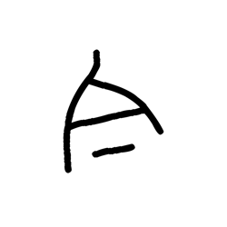

- source_zip_member: `Sub-character Images/ihsuhqgmdc/ihsuhqgmdc/qxdocya1sw.png`
- checksum_sha256: see `06_component-visual-index.csv`.
- review_status: `needs_human_visual_review`
- caution: source-marked review image only.

## asset-017204

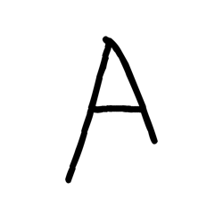

- source_zip_member: `Sub-character Images/ihsuhqgmdc/ihsuhqgmdc/sbyiqy5ts4.png`
- checksum_sha256: see `06_component-visual-index.csv`.
- review_status: `needs_human_visual_review`
- caution: source-marked review image only.

## asset-017205

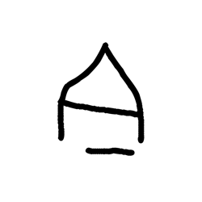

- source_zip_member: `Sub-character Images/ihsuhqgmdc/ihsuhqgmdc/szug4h6b9i.png`
- checksum_sha256: see `06_component-visual-index.csv`.
- review_status: `needs_human_visual_review`
- caution: source-marked review image only.

## asset-017206

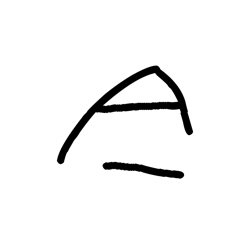

- source_zip_member: `Sub-character Images/ihsuhqgmdc/ihsuhqgmdc/vn8x5nulms.png`
- checksum_sha256: see `06_component-visual-index.csv`.
- review_status: `needs_human_visual_review`
- caution: source-marked review image only.

## asset-017207

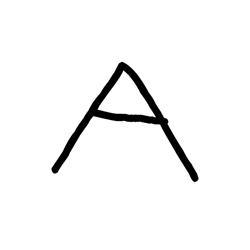

- source_zip_member: `Sub-character Images/ihsuhqgmdc/ihsuhqgmdc/vrernfgc9w.png`
- checksum_sha256: see `06_component-visual-index.csv`.
- review_status: `needs_human_visual_review`
- caution: source-marked review image only.

## asset-017208

- source_zip_member: `Sub-character Images/ihsuhqgmdc/ihsuhqgmdc/x6nvkh5f12.png`
- checksum_sha256: see `06_component-visual-index.csv`.
- review_status: `needs_human_visual_review`
- caution: source-marked review image only.

## asset-017209

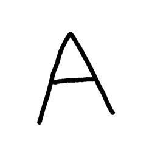

- source_zip_member: `Sub-character Images/ihsuhqgmdc/ihsuhqgmdc/xisyhig0wj.png`
- checksum_sha256: see `06_component-visual-index.csv`.
- review_status: `needs_human_visual_review`
- caution: source-marked review image only.

## asset-017210

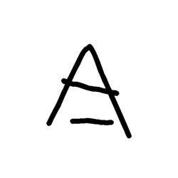

- source_zip_member: `Sub-character Images/ihsuhqgmdc/ihsuhqgmdc/yiq8o07g6e.png`
- checksum_sha256: see `06_component-visual-index.csv`.
- review_status: `needs_human_visual_review`
- caution: source-marked review image only.

## asset-017211

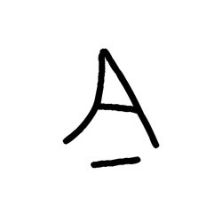

- source_zip_member: `Sub-character Images/ihsuhqgmdc/ihsuhqgmdc/yql49nm8mc.png`
- checksum_sha256: see `06_component-visual-index.csv`.
- review_status: `needs_human_visual_review`
- caution: source-marked review image only.

## asset-017212

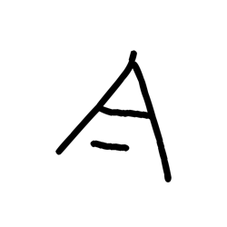

- source_zip_member: `Sub-character Images/ihsuhqgmdc/ihsuhqgmdc/zwjrzaf3lh.png`
- checksum_sha256: see `06_component-visual-index.csv`.
- review_status: `needs_human_visual_review`
- caution: source-marked review image only.
