# Component Visual Gallery / 构件图像查看: obs-comp-cand-001590

English:
This page displays OBIMD subcharacter PNG assets extracted into this concrete
corpus object directory for human review.

简体中文：
本页展示抽取到当前具体 corpus 对象目录内的 OBIMD subcharacter PNG 资料，供人工复核使用。

Boundary / 边界：
dataset image candidate only; not a confirmed component form, not a component
assignment, and not a decipherment claim.
- not a confirmed component form
- not a component assignment
- not a decipherment claim

## Concrete Questions To Check / 具体待查问题

- Which local image should be opened first?
- 应先打开哪一张本地构件图像？
- Which source zip member anchors this image?
- 哪一个 source zip member 能定位这张图像？
- Which near-shape or variant comparison is still missing?
- 还缺哪些近形或异体比较？
- Which character or inscription context should be checked next?
- 下一步应核对哪些单字或卜辞上下文？
- What evidence is missing before a component assignment?
- 正式构件归属前还缺哪些证据？

## asset-017215

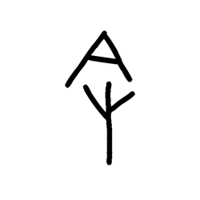

- source_zip_member: `Sub-character Images/ctejf56of8/ctejf56of8/0yd86t8rn6.png`
- checksum_sha256: see `06_component-visual-index.csv`.
- review_status: `needs_human_visual_review`
- caution: source-marked review image only.

## asset-017216

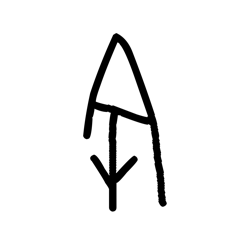

- source_zip_member: `Sub-character Images/ctejf56of8/ctejf56of8/1dupmsw3n1.png`
- checksum_sha256: see `06_component-visual-index.csv`.
- review_status: `needs_human_visual_review`
- caution: source-marked review image only.

## asset-017217

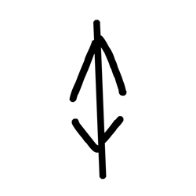

- source_zip_member: `Sub-character Images/ctejf56of8/ctejf56of8/1o02rp8ost.png`
- checksum_sha256: see `06_component-visual-index.csv`.
- review_status: `needs_human_visual_review`
- caution: source-marked review image only.

## asset-017218

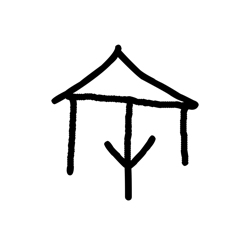

- source_zip_member: `Sub-character Images/ctejf56of8/ctejf56of8/2in7eojmxq.png`
- checksum_sha256: see `06_component-visual-index.csv`.
- review_status: `needs_human_visual_review`
- caution: source-marked review image only.

## asset-017219

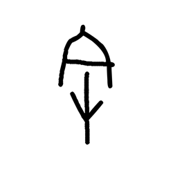

- source_zip_member: `Sub-character Images/ctejf56of8/ctejf56of8/2mypdcsn12.png`
- checksum_sha256: see `06_component-visual-index.csv`.
- review_status: `needs_human_visual_review`
- caution: source-marked review image only.

## asset-017220

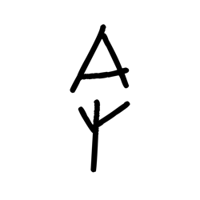

- source_zip_member: `Sub-character Images/ctejf56of8/ctejf56of8/3pfifpcels.png`
- checksum_sha256: see `06_component-visual-index.csv`.
- review_status: `needs_human_visual_review`
- caution: source-marked review image only.

## asset-017221

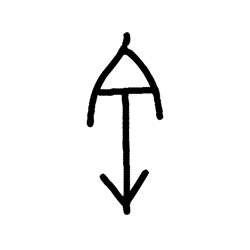

- source_zip_member: `Sub-character Images/ctejf56of8/ctejf56of8/44ly9zvkz8.png`
- checksum_sha256: see `06_component-visual-index.csv`.
- review_status: `needs_human_visual_review`
- caution: source-marked review image only.

## asset-017222

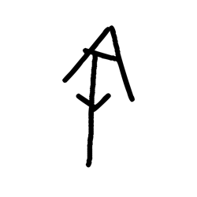

- source_zip_member: `Sub-character Images/ctejf56of8/ctejf56of8/4w9dyq2n06.png`
- checksum_sha256: see `06_component-visual-index.csv`.
- review_status: `needs_human_visual_review`
- caution: source-marked review image only.

## asset-017223

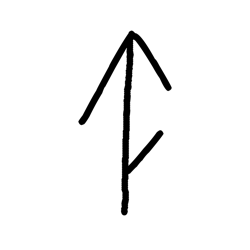

- source_zip_member: `Sub-character Images/ctejf56of8/ctejf56of8/5eu25bsger.png`
- checksum_sha256: see `06_component-visual-index.csv`.
- review_status: `needs_human_visual_review`
- caution: source-marked review image only.

## asset-017224

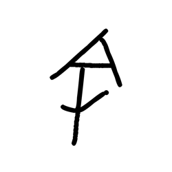

- source_zip_member: `Sub-character Images/ctejf56of8/ctejf56of8/6g7zoiwqlm.png`
- checksum_sha256: see `06_component-visual-index.csv`.
- review_status: `needs_human_visual_review`
- caution: source-marked review image only.

## asset-017225

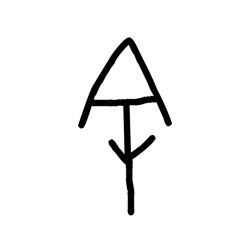

- source_zip_member: `Sub-character Images/ctejf56of8/ctejf56of8/8pa6gb69yb.png`
- checksum_sha256: see `06_component-visual-index.csv`.
- review_status: `needs_human_visual_review`
- caution: source-marked review image only.

## asset-017226

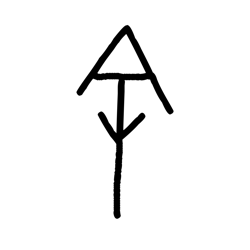

- source_zip_member: `Sub-character Images/ctejf56of8/ctejf56of8/8uetxlvu6n.png`
- checksum_sha256: see `06_component-visual-index.csv`.
- review_status: `needs_human_visual_review`
- caution: source-marked review image only.

## asset-017227

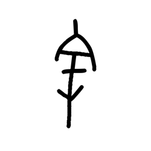

- source_zip_member: `Sub-character Images/ctejf56of8/ctejf56of8/9flbaqfige.png`
- checksum_sha256: see `06_component-visual-index.csv`.
- review_status: `needs_human_visual_review`
- caution: source-marked review image only.

## asset-017228

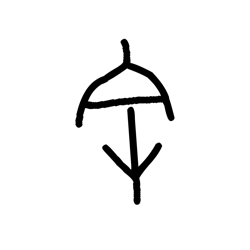

- source_zip_member: `Sub-character Images/ctejf56of8/ctejf56of8/9g7knh72ga.png`
- checksum_sha256: see `06_component-visual-index.csv`.
- review_status: `needs_human_visual_review`
- caution: source-marked review image only.

## asset-017229

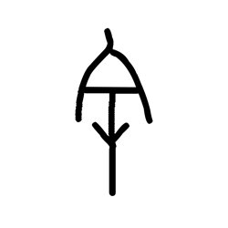

- source_zip_member: `Sub-character Images/ctejf56of8/ctejf56of8/9o74ji8ho2.png`
- checksum_sha256: see `06_component-visual-index.csv`.
- review_status: `needs_human_visual_review`
- caution: source-marked review image only.

## asset-017230

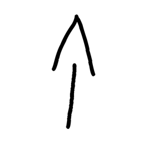

- source_zip_member: `Sub-character Images/ctejf56of8/ctejf56of8/9vmk32mih0.png`
- checksum_sha256: see `06_component-visual-index.csv`.
- review_status: `needs_human_visual_review`
- caution: source-marked review image only.

## asset-017231

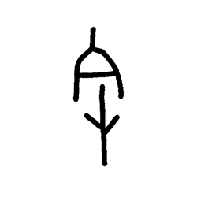

- source_zip_member: `Sub-character Images/ctejf56of8/ctejf56of8/b6l612jgjb.png`
- checksum_sha256: see `06_component-visual-index.csv`.
- review_status: `needs_human_visual_review`
- caution: source-marked review image only.

## asset-017232

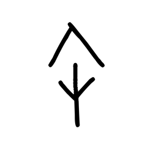

- source_zip_member: `Sub-character Images/ctejf56of8/ctejf56of8/bufgabdvqj.png`
- checksum_sha256: see `06_component-visual-index.csv`.
- review_status: `needs_human_visual_review`
- caution: source-marked review image only.

## asset-017233

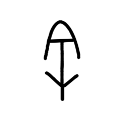

- source_zip_member: `Sub-character Images/ctejf56of8/ctejf56of8/c9icc358ho.png`
- checksum_sha256: see `06_component-visual-index.csv`.
- review_status: `needs_human_visual_review`
- caution: source-marked review image only.

## asset-017234

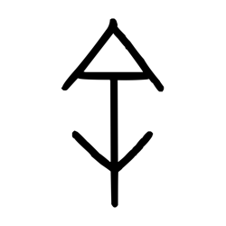

- source_zip_member: `Sub-character Images/ctejf56of8/ctejf56of8/ctejf56of8.png`
- checksum_sha256: see `06_component-visual-index.csv`.
- review_status: `needs_human_visual_review`
- caution: source-marked review image only.

## asset-017235

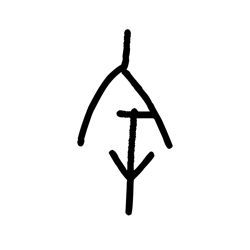

- source_zip_member: `Sub-character Images/ctejf56of8/ctejf56of8/dbp6n6hirt.png`
- checksum_sha256: see `06_component-visual-index.csv`.
- review_status: `needs_human_visual_review`
- caution: source-marked review image only.

## asset-017236

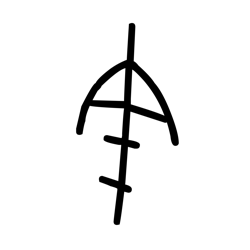

- source_zip_member: `Sub-character Images/ctejf56of8/ctejf56of8/ddjw5gazgn.png`
- checksum_sha256: see `06_component-visual-index.csv`.
- review_status: `needs_human_visual_review`
- caution: source-marked review image only.

## asset-017237

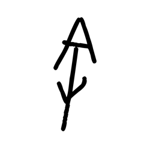

- source_zip_member: `Sub-character Images/ctejf56of8/ctejf56of8/eja06wttjv.png`
- checksum_sha256: see `06_component-visual-index.csv`.
- review_status: `needs_human_visual_review`
- caution: source-marked review image only.

## asset-017238

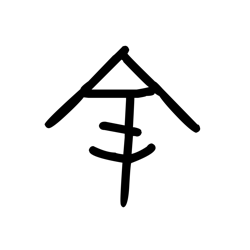

- source_zip_member: `Sub-character Images/ctejf56of8/ctejf56of8/eseapl14xf.png`
- checksum_sha256: see `06_component-visual-index.csv`.
- review_status: `needs_human_visual_review`
- caution: source-marked review image only.

## asset-017239

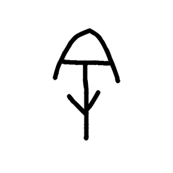

- source_zip_member: `Sub-character Images/ctejf56of8/ctejf56of8/etqbgjz2cn.png`
- checksum_sha256: see `06_component-visual-index.csv`.
- review_status: `needs_human_visual_review`
- caution: source-marked review image only.

## asset-017240

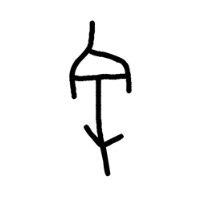

- source_zip_member: `Sub-character Images/ctejf56of8/ctejf56of8/ewngdm2ar2.png`
- checksum_sha256: see `06_component-visual-index.csv`.
- review_status: `needs_human_visual_review`
- caution: source-marked review image only.

## asset-017241

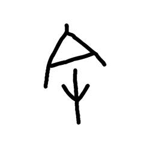

- source_zip_member: `Sub-character Images/ctejf56of8/ctejf56of8/ez2derklfr.png`
- checksum_sha256: see `06_component-visual-index.csv`.
- review_status: `needs_human_visual_review`
- caution: source-marked review image only.

## asset-017242

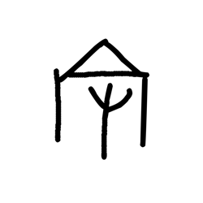

- source_zip_member: `Sub-character Images/ctejf56of8/ctejf56of8/h4pkj9kese.png`
- checksum_sha256: see `06_component-visual-index.csv`.
- review_status: `needs_human_visual_review`
- caution: source-marked review image only.

## asset-017243

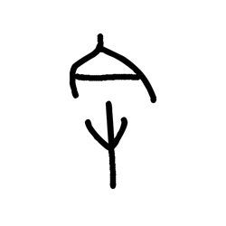

- source_zip_member: `Sub-character Images/ctejf56of8/ctejf56of8/hmf51bleb4.png`
- checksum_sha256: see `06_component-visual-index.csv`.
- review_status: `needs_human_visual_review`
- caution: source-marked review image only.

## asset-017244

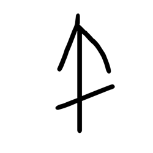

- source_zip_member: `Sub-character Images/ctejf56of8/ctejf56of8/hreiaxeshj.png`
- checksum_sha256: see `06_component-visual-index.csv`.
- review_status: `needs_human_visual_review`
- caution: source-marked review image only.

## asset-017245

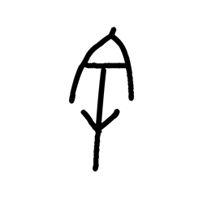

- source_zip_member: `Sub-character Images/ctejf56of8/ctejf56of8/hv4lzdi7tb.png`
- checksum_sha256: see `06_component-visual-index.csv`.
- review_status: `needs_human_visual_review`
- caution: source-marked review image only.

## asset-017246

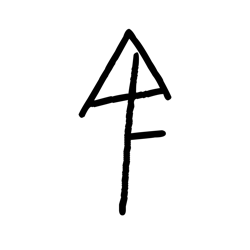

- source_zip_member: `Sub-character Images/ctejf56of8/ctejf56of8/i7mkggh25u.png`
- checksum_sha256: see `06_component-visual-index.csv`.
- review_status: `needs_human_visual_review`
- caution: source-marked review image only.

## asset-017247

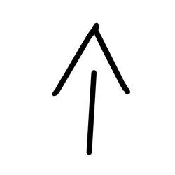

- source_zip_member: `Sub-character Images/ctejf56of8/ctejf56of8/ivtpk5k5cl.png`
- checksum_sha256: see `06_component-visual-index.csv`.
- review_status: `needs_human_visual_review`
- caution: source-marked review image only.

## asset-017248

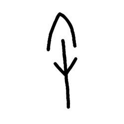

- source_zip_member: `Sub-character Images/ctejf56of8/ctejf56of8/jda8ha34pd.png`
- checksum_sha256: see `06_component-visual-index.csv`.
- review_status: `needs_human_visual_review`
- caution: source-marked review image only.

## asset-017249

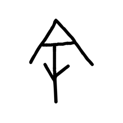

- source_zip_member: `Sub-character Images/ctejf56of8/ctejf56of8/jrrj1k5pr8.png`
- checksum_sha256: see `06_component-visual-index.csv`.
- review_status: `needs_human_visual_review`
- caution: source-marked review image only.

## asset-017250

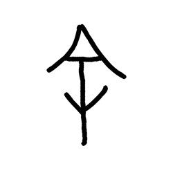

- source_zip_member: `Sub-character Images/ctejf56of8/ctejf56of8/kojm8e7jbc.png`
- checksum_sha256: see `06_component-visual-index.csv`.
- review_status: `needs_human_visual_review`
- caution: source-marked review image only.

## asset-017251

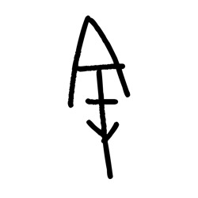

- source_zip_member: `Sub-character Images/ctejf56of8/ctejf56of8/opndme50nk.png`
- checksum_sha256: see `06_component-visual-index.csv`.
- review_status: `needs_human_visual_review`
- caution: source-marked review image only.

## asset-017252

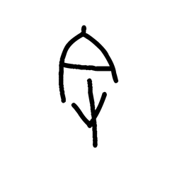

- source_zip_member: `Sub-character Images/ctejf56of8/ctejf56of8/pimq9u60ll.png`
- checksum_sha256: see `06_component-visual-index.csv`.
- review_status: `needs_human_visual_review`
- caution: source-marked review image only.

## asset-017253

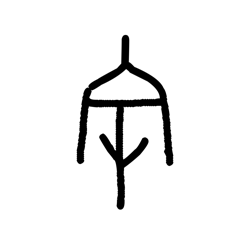

- source_zip_member: `Sub-character Images/ctejf56of8/ctejf56of8/pmwheehfcj.png`
- checksum_sha256: see `06_component-visual-index.csv`.
- review_status: `needs_human_visual_review`
- caution: source-marked review image only.

## asset-017254

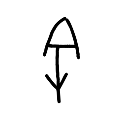

- source_zip_member: `Sub-character Images/ctejf56of8/ctejf56of8/rshrm6dl5j.png`
- checksum_sha256: see `06_component-visual-index.csv`.
- review_status: `needs_human_visual_review`
- caution: source-marked review image only.

## asset-017255

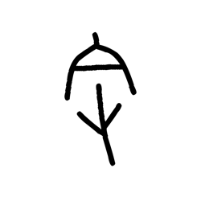

- source_zip_member: `Sub-character Images/ctejf56of8/ctejf56of8/s0bk94qsnh.png`
- checksum_sha256: see `06_component-visual-index.csv`.
- review_status: `needs_human_visual_review`
- caution: source-marked review image only.

## asset-017256

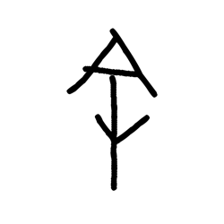

- source_zip_member: `Sub-character Images/ctejf56of8/ctejf56of8/t3hslgiad2.png`
- checksum_sha256: see `06_component-visual-index.csv`.
- review_status: `needs_human_visual_review`
- caution: source-marked review image only.

## asset-017257

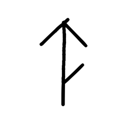

- source_zip_member: `Sub-character Images/ctejf56of8/ctejf56of8/to0fsk1mes.png`
- checksum_sha256: see `06_component-visual-index.csv`.
- review_status: `needs_human_visual_review`
- caution: source-marked review image only.

## asset-017258

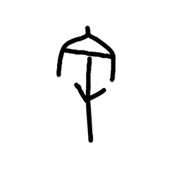

- source_zip_member: `Sub-character Images/ctejf56of8/ctejf56of8/u6oycmexv6.png`
- checksum_sha256: see `06_component-visual-index.csv`.
- review_status: `needs_human_visual_review`
- caution: source-marked review image only.

## asset-017259

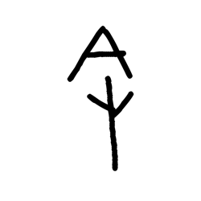

- source_zip_member: `Sub-character Images/ctejf56of8/ctejf56of8/voeeqg5xk6.png`
- checksum_sha256: see `06_component-visual-index.csv`.
- review_status: `needs_human_visual_review`
- caution: source-marked review image only.

## asset-017260

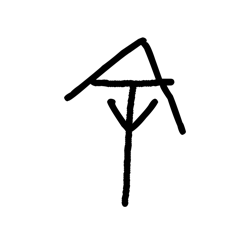

- source_zip_member: `Sub-character Images/ctejf56of8/ctejf56of8/w5m1agwu3o.png`
- checksum_sha256: see `06_component-visual-index.csv`.
- review_status: `needs_human_visual_review`
- caution: source-marked review image only.

## asset-017261

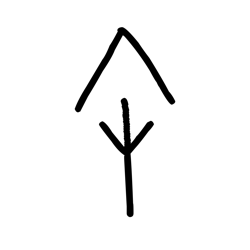

- source_zip_member: `Sub-character Images/ctejf56of8/ctejf56of8/wj9h5aar49.png`
- checksum_sha256: see `06_component-visual-index.csv`.
- review_status: `needs_human_visual_review`
- caution: source-marked review image only.

## asset-017262

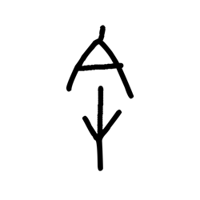

- source_zip_member: `Sub-character Images/ctejf56of8/ctejf56of8/wp82w3ut87.png`
- checksum_sha256: see `06_component-visual-index.csv`.
- review_status: `needs_human_visual_review`
- caution: source-marked review image only.

## asset-017263

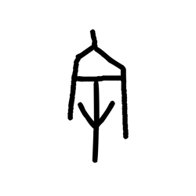

- source_zip_member: `Sub-character Images/ctejf56of8/ctejf56of8/xih35p5ghl.png`
- checksum_sha256: see `06_component-visual-index.csv`.
- review_status: `needs_human_visual_review`
- caution: source-marked review image only.

## asset-017264

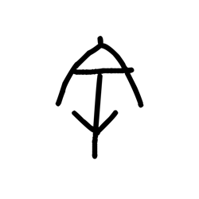

- source_zip_member: `Sub-character Images/ctejf56of8/ctejf56of8/yuxe2o3nnm.png`
- checksum_sha256: see `06_component-visual-index.csv`.
- review_status: `needs_human_visual_review`
- caution: source-marked review image only.

## asset-017265

- source_zip_member: `Sub-character Images/ctejf56of8/ctejf56of8/yvzi1nki2s.png`
- checksum_sha256: see `06_component-visual-index.csv`.
- review_status: `needs_human_visual_review`
- caution: source-marked review image only.

## asset-017266

- source_zip_member: `Sub-character Images/ctejf56of8/ctejf56of8/zcjzftw0bn.png`
- checksum_sha256: see `06_component-visual-index.csv`.
- review_status: `needs_human_visual_review`
- caution: source-marked review image only.
