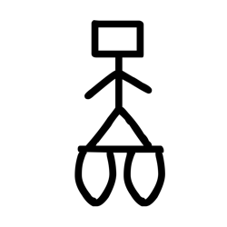

# Component Visual Gallery / 构件图像查看: obs-comp-cand-001631

English:
This page displays OBIMD subcharacter PNG assets extracted into this concrete corpus object directory for human review.

简体中文：
本页展示抽取到当前具体 corpus 对象目录内的 OBIMD subcharacter PNG 资料，供人工复核使用。

Boundary / 边界：dataset image candidate only; not a confirmed component form, component assignment, or decipherment claim.

## asset-017307

- source_zip_member: `Sub-character Images/bg0evhjvox/bg0evhjvox/bg0evhjvox.png`
- checksum_sha256: `7baa3c3c9dbc6b64763b7dee425f5e09a5a88b6cdb94af2499a8f39c12143faa`
- review_status: `needs_human_visual_review`
- caution: OBIMD subcharacter image is a source-marked review asset only; it is not a confirmed component form, component assignment, or decipherment conclusion.
