# Component Visual Gallery / 构件图像查看: obs-comp-cand-001669

English:
This page displays OBIMD subcharacter PNG assets extracted into this concrete
corpus object directory for human review.

简体中文：
本页展示抽取到当前具体 corpus 对象目录内的 OBIMD subcharacter PNG 资料，供人工复核使用。

Boundary / 边界：
dataset image candidate only; not a confirmed component form, not a component
assignment, and not a decipherment claim.
- not a confirmed component form
- not a component assignment
- not a decipherment claim

## Concrete Questions To Check / 具体待查问题

- Which local image should be opened first?
- 应先打开哪一张本地构件图像？
- Which source zip member anchors this image?
- 哪一个 source zip member 能定位这张图像？
- Which near-shape or variant comparison is still missing?
- 还缺哪些近形或异体比较？
- Which character or inscription context should be checked next?
- 下一步应核对哪些单字或卜辞上下文？
- What evidence is missing before a component assignment?
- 正式构件归属前还缺哪些证据？

## asset-017345

- source_zip_member: `Sub-character Images/cixqnyxp9v/cixqnyxp9v/03i22yzlrs.png`
- checksum_sha256: see `06_component-visual-index.csv`.
- review_status: `needs_human_visual_review`
- caution: source-marked review image only.

## asset-017346

- source_zip_member: `Sub-character Images/cixqnyxp9v/cixqnyxp9v/04h5ibnd17.png`
- checksum_sha256: see `06_component-visual-index.csv`.
- review_status: `needs_human_visual_review`
- caution: source-marked review image only.

## asset-017347

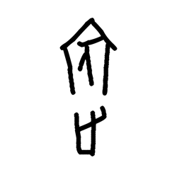

- source_zip_member: `Sub-character Images/cixqnyxp9v/cixqnyxp9v/0by6rs4xj4.png`
- checksum_sha256: see `06_component-visual-index.csv`.
- review_status: `needs_human_visual_review`
- caution: source-marked review image only.

## asset-017348

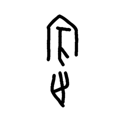

- source_zip_member: `Sub-character Images/cixqnyxp9v/cixqnyxp9v/0k5mk0cdmq.png`
- checksum_sha256: see `06_component-visual-index.csv`.
- review_status: `needs_human_visual_review`
- caution: source-marked review image only.

## asset-017349

- source_zip_member: `Sub-character Images/cixqnyxp9v/cixqnyxp9v/0mpgwekpux.png`
- checksum_sha256: see `06_component-visual-index.csv`.
- review_status: `needs_human_visual_review`
- caution: source-marked review image only.

## asset-017350

- source_zip_member: `Sub-character Images/cixqnyxp9v/cixqnyxp9v/0mt0x487u0.png`
- checksum_sha256: see `06_component-visual-index.csv`.
- review_status: `needs_human_visual_review`
- caution: source-marked review image only.

## asset-017351

- source_zip_member: `Sub-character Images/cixqnyxp9v/cixqnyxp9v/18btzp31yk.png`
- checksum_sha256: see `06_component-visual-index.csv`.
- review_status: `needs_human_visual_review`
- caution: source-marked review image only.

## asset-017352

- source_zip_member: `Sub-character Images/cixqnyxp9v/cixqnyxp9v/1ebt18ir76.png`
- checksum_sha256: see `06_component-visual-index.csv`.
- review_status: `needs_human_visual_review`
- caution: source-marked review image only.

## asset-017353

- source_zip_member: `Sub-character Images/cixqnyxp9v/cixqnyxp9v/1h62pqfjh6.png`
- checksum_sha256: see `06_component-visual-index.csv`.
- review_status: `needs_human_visual_review`
- caution: source-marked review image only.

## asset-017354

- source_zip_member: `Sub-character Images/cixqnyxp9v/cixqnyxp9v/1kmokjjaq4.png`
- checksum_sha256: see `06_component-visual-index.csv`.
- review_status: `needs_human_visual_review`
- caution: source-marked review image only.

## asset-017355

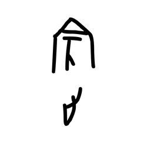

- source_zip_member: `Sub-character Images/cixqnyxp9v/cixqnyxp9v/1s778gw56u.png`
- checksum_sha256: see `06_component-visual-index.csv`.
- review_status: `needs_human_visual_review`
- caution: source-marked review image only.

## asset-017356

- source_zip_member: `Sub-character Images/cixqnyxp9v/cixqnyxp9v/1sa7twl5fz.png`
- checksum_sha256: see `06_component-visual-index.csv`.
- review_status: `needs_human_visual_review`
- caution: source-marked review image only.

## asset-017357

- source_zip_member: `Sub-character Images/cixqnyxp9v/cixqnyxp9v/1ssomlpfa7.png`
- checksum_sha256: see `06_component-visual-index.csv`.
- review_status: `needs_human_visual_review`
- caution: source-marked review image only.

## asset-017358

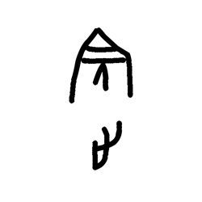

- source_zip_member: `Sub-character Images/cixqnyxp9v/cixqnyxp9v/2ixjodrvdy.png`
- checksum_sha256: see `06_component-visual-index.csv`.
- review_status: `needs_human_visual_review`
- caution: source-marked review image only.

## asset-017359

- source_zip_member: `Sub-character Images/cixqnyxp9v/cixqnyxp9v/2vh97tp75q.png`
- checksum_sha256: see `06_component-visual-index.csv`.
- review_status: `needs_human_visual_review`
- caution: source-marked review image only.

## asset-017360

- source_zip_member: `Sub-character Images/cixqnyxp9v/cixqnyxp9v/31nw1rc8l5.png`
- checksum_sha256: see `06_component-visual-index.csv`.
- review_status: `needs_human_visual_review`
- caution: source-marked review image only.

## asset-017361

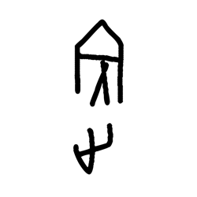

- source_zip_member: `Sub-character Images/cixqnyxp9v/cixqnyxp9v/346nu4hcx0.png`
- checksum_sha256: see `06_component-visual-index.csv`.
- review_status: `needs_human_visual_review`
- caution: source-marked review image only.

## asset-017362

- source_zip_member: `Sub-character Images/cixqnyxp9v/cixqnyxp9v/3d47w61da2.png`
- checksum_sha256: see `06_component-visual-index.csv`.
- review_status: `needs_human_visual_review`
- caution: source-marked review image only.

## asset-017363

- source_zip_member: `Sub-character Images/cixqnyxp9v/cixqnyxp9v/3nvr13dfq7.png`
- checksum_sha256: see `06_component-visual-index.csv`.
- review_status: `needs_human_visual_review`
- caution: source-marked review image only.

## asset-017364

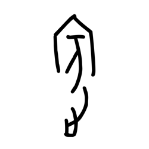

- source_zip_member: `Sub-character Images/cixqnyxp9v/cixqnyxp9v/3s2w15lfqz.png`
- checksum_sha256: see `06_component-visual-index.csv`.
- review_status: `needs_human_visual_review`
- caution: source-marked review image only.

## asset-017365

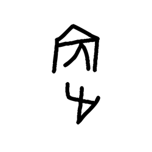

- source_zip_member: `Sub-character Images/cixqnyxp9v/cixqnyxp9v/40g7zr5qvi.png`
- checksum_sha256: see `06_component-visual-index.csv`.
- review_status: `needs_human_visual_review`
- caution: source-marked review image only.

## asset-017366

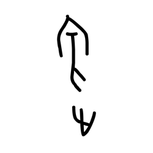

- source_zip_member: `Sub-character Images/cixqnyxp9v/cixqnyxp9v/4900xo3yhe.png`
- checksum_sha256: see `06_component-visual-index.csv`.
- review_status: `needs_human_visual_review`
- caution: source-marked review image only.

## asset-017367

- source_zip_member: `Sub-character Images/cixqnyxp9v/cixqnyxp9v/49ba4tr3r0.png`
- checksum_sha256: see `06_component-visual-index.csv`.
- review_status: `needs_human_visual_review`
- caution: source-marked review image only.

## asset-017368

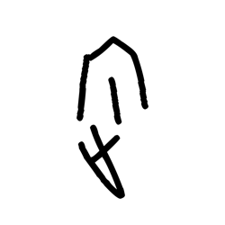

- source_zip_member: `Sub-character Images/cixqnyxp9v/cixqnyxp9v/4clg24djdk.png`
- checksum_sha256: see `06_component-visual-index.csv`.
- review_status: `needs_human_visual_review`
- caution: source-marked review image only.

## asset-017369

- source_zip_member: `Sub-character Images/cixqnyxp9v/cixqnyxp9v/4nqnxnpo4x.png`
- checksum_sha256: see `06_component-visual-index.csv`.
- review_status: `needs_human_visual_review`
- caution: source-marked review image only.

## asset-017370

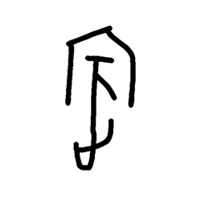

- source_zip_member: `Sub-character Images/cixqnyxp9v/cixqnyxp9v/4st7vt0lwx.png`
- checksum_sha256: see `06_component-visual-index.csv`.
- review_status: `needs_human_visual_review`
- caution: source-marked review image only.

## asset-017371

- source_zip_member: `Sub-character Images/cixqnyxp9v/cixqnyxp9v/4w0xh9exlr.png`
- checksum_sha256: see `06_component-visual-index.csv`.
- review_status: `needs_human_visual_review`
- caution: source-marked review image only.

## asset-017372

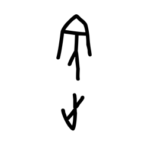

- source_zip_member: `Sub-character Images/cixqnyxp9v/cixqnyxp9v/57u9w0p7oo.png`
- checksum_sha256: see `06_component-visual-index.csv`.
- review_status: `needs_human_visual_review`
- caution: source-marked review image only.

## asset-017373

- source_zip_member: `Sub-character Images/cixqnyxp9v/cixqnyxp9v/58xovzfjj7.png`
- checksum_sha256: see `06_component-visual-index.csv`.
- review_status: `needs_human_visual_review`
- caution: source-marked review image only.

## asset-017374

- source_zip_member: `Sub-character Images/cixqnyxp9v/cixqnyxp9v/590iqz72rn.png`
- checksum_sha256: see `06_component-visual-index.csv`.
- review_status: `needs_human_visual_review`
- caution: source-marked review image only.

## asset-017375

- source_zip_member: `Sub-character Images/cixqnyxp9v/cixqnyxp9v/5oa00baaqc.png`
- checksum_sha256: see `06_component-visual-index.csv`.
- review_status: `needs_human_visual_review`
- caution: source-marked review image only.

## asset-017376

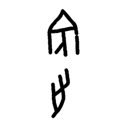

- source_zip_member: `Sub-character Images/cixqnyxp9v/cixqnyxp9v/5vtapkqhdq.png`
- checksum_sha256: see `06_component-visual-index.csv`.
- review_status: `needs_human_visual_review`
- caution: source-marked review image only.

## asset-017377

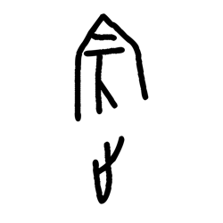

- source_zip_member: `Sub-character Images/cixqnyxp9v/cixqnyxp9v/5y3zfjcic5.png`
- checksum_sha256: see `06_component-visual-index.csv`.
- review_status: `needs_human_visual_review`
- caution: source-marked review image only.

## asset-017378

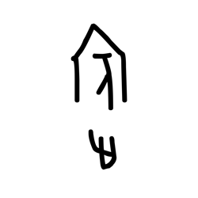

- source_zip_member: `Sub-character Images/cixqnyxp9v/cixqnyxp9v/683zy0zewm.png`
- checksum_sha256: see `06_component-visual-index.csv`.
- review_status: `needs_human_visual_review`
- caution: source-marked review image only.

## asset-017379

- source_zip_member: `Sub-character Images/cixqnyxp9v/cixqnyxp9v/69xghdu2t3.png`
- checksum_sha256: see `06_component-visual-index.csv`.
- review_status: `needs_human_visual_review`
- caution: source-marked review image only.

## asset-017380

- source_zip_member: `Sub-character Images/cixqnyxp9v/cixqnyxp9v/6a9429m59z.png`
- checksum_sha256: see `06_component-visual-index.csv`.
- review_status: `needs_human_visual_review`
- caution: source-marked review image only.

## asset-017381

- source_zip_member: `Sub-character Images/cixqnyxp9v/cixqnyxp9v/6ahyiaemco.png`
- checksum_sha256: see `06_component-visual-index.csv`.
- review_status: `needs_human_visual_review`
- caution: source-marked review image only.

## asset-017382

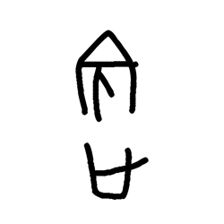

- source_zip_member: `Sub-character Images/cixqnyxp9v/cixqnyxp9v/6c99k0r77o.png`
- checksum_sha256: see `06_component-visual-index.csv`.
- review_status: `needs_human_visual_review`
- caution: source-marked review image only.

## asset-017383

- source_zip_member: `Sub-character Images/cixqnyxp9v/cixqnyxp9v/6d7sdbj85b.png`
- checksum_sha256: see `06_component-visual-index.csv`.
- review_status: `needs_human_visual_review`
- caution: source-marked review image only.

## asset-017384

- source_zip_member: `Sub-character Images/cixqnyxp9v/cixqnyxp9v/6eg3nspj5j.png`
- checksum_sha256: see `06_component-visual-index.csv`.
- review_status: `needs_human_visual_review`
- caution: source-marked review image only.

## asset-017385

- source_zip_member: `Sub-character Images/cixqnyxp9v/cixqnyxp9v/6ez9qqwyzu.png`
- checksum_sha256: see `06_component-visual-index.csv`.
- review_status: `needs_human_visual_review`
- caution: source-marked review image only.

## asset-017386

- source_zip_member: `Sub-character Images/cixqnyxp9v/cixqnyxp9v/6ic4boe41f.png`
- checksum_sha256: see `06_component-visual-index.csv`.
- review_status: `needs_human_visual_review`
- caution: source-marked review image only.

## asset-017387

- source_zip_member: `Sub-character Images/cixqnyxp9v/cixqnyxp9v/6l8rw3r6de.png`
- checksum_sha256: see `06_component-visual-index.csv`.
- review_status: `needs_human_visual_review`
- caution: source-marked review image only.

## asset-017388

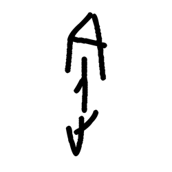

- source_zip_member: `Sub-character Images/cixqnyxp9v/cixqnyxp9v/7fubusep01.png`
- checksum_sha256: see `06_component-visual-index.csv`.
- review_status: `needs_human_visual_review`
- caution: source-marked review image only.

## asset-017389

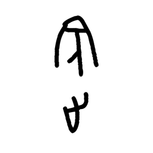

- source_zip_member: `Sub-character Images/cixqnyxp9v/cixqnyxp9v/7gxlyh0n9f.png`
- checksum_sha256: see `06_component-visual-index.csv`.
- review_status: `needs_human_visual_review`
- caution: source-marked review image only.

## asset-017390

- source_zip_member: `Sub-character Images/cixqnyxp9v/cixqnyxp9v/7zd50327lu.png`
- checksum_sha256: see `06_component-visual-index.csv`.
- review_status: `needs_human_visual_review`
- caution: source-marked review image only.

## asset-017391

- source_zip_member: `Sub-character Images/cixqnyxp9v/cixqnyxp9v/8a19mgrvoi.png`
- checksum_sha256: see `06_component-visual-index.csv`.
- review_status: `needs_human_visual_review`
- caution: source-marked review image only.

## asset-017392

- source_zip_member: `Sub-character Images/cixqnyxp9v/cixqnyxp9v/8go7huxz32.png`
- checksum_sha256: see `06_component-visual-index.csv`.
- review_status: `needs_human_visual_review`
- caution: source-marked review image only.

## asset-017393

- source_zip_member: `Sub-character Images/cixqnyxp9v/cixqnyxp9v/8gpu1tc03p.png`
- checksum_sha256: see `06_component-visual-index.csv`.
- review_status: `needs_human_visual_review`
- caution: source-marked review image only.

## asset-017394

- source_zip_member: `Sub-character Images/cixqnyxp9v/cixqnyxp9v/8gujze7yni.png`
- checksum_sha256: see `06_component-visual-index.csv`.
- review_status: `needs_human_visual_review`
- caution: source-marked review image only.

## asset-017395

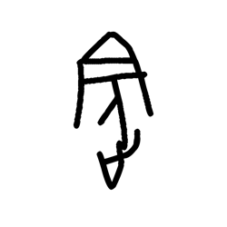

- source_zip_member: `Sub-character Images/cixqnyxp9v/cixqnyxp9v/8gxr3yqpti.png`
- checksum_sha256: see `06_component-visual-index.csv`.
- review_status: `needs_human_visual_review`
- caution: source-marked review image only.

## asset-017396

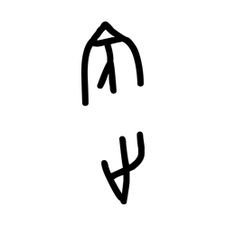

- source_zip_member: `Sub-character Images/cixqnyxp9v/cixqnyxp9v/8uqbr5oar0.png`
- checksum_sha256: see `06_component-visual-index.csv`.
- review_status: `needs_human_visual_review`
- caution: source-marked review image only.

## asset-017397

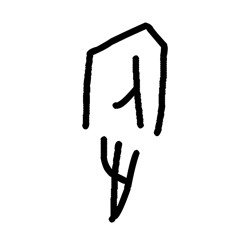

- source_zip_member: `Sub-character Images/cixqnyxp9v/cixqnyxp9v/8wr6dtpevw.png`
- checksum_sha256: see `06_component-visual-index.csv`.
- review_status: `needs_human_visual_review`
- caution: source-marked review image only.

## asset-017398

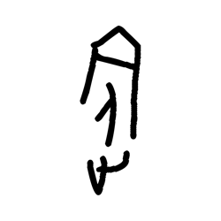

- source_zip_member: `Sub-character Images/cixqnyxp9v/cixqnyxp9v/99accpzw6i.png`
- checksum_sha256: see `06_component-visual-index.csv`.
- review_status: `needs_human_visual_review`
- caution: source-marked review image only.

## asset-017399

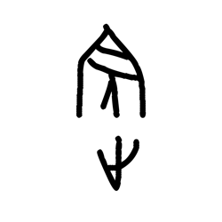

- source_zip_member: `Sub-character Images/cixqnyxp9v/cixqnyxp9v/9o1e6zc4j8.png`
- checksum_sha256: see `06_component-visual-index.csv`.
- review_status: `needs_human_visual_review`
- caution: source-marked review image only.

## asset-017400

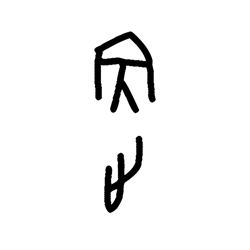

- source_zip_member: `Sub-character Images/cixqnyxp9v/cixqnyxp9v/9uv615mwlt.png`
- checksum_sha256: see `06_component-visual-index.csv`.
- review_status: `needs_human_visual_review`
- caution: source-marked review image only.

## asset-017401

- source_zip_member: `Sub-character Images/cixqnyxp9v/cixqnyxp9v/9zhu5z3pzz.png`
- checksum_sha256: see `06_component-visual-index.csv`.
- review_status: `needs_human_visual_review`
- caution: source-marked review image only.

## asset-017402

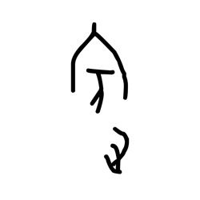

- source_zip_member: `Sub-character Images/cixqnyxp9v/cixqnyxp9v/9zscpxydbe.png`
- checksum_sha256: see `06_component-visual-index.csv`.
- review_status: `needs_human_visual_review`
- caution: source-marked review image only.

## asset-017403

- source_zip_member: `Sub-character Images/cixqnyxp9v/cixqnyxp9v/alqsjd5jv1.png`
- checksum_sha256: see `06_component-visual-index.csv`.
- review_status: `needs_human_visual_review`
- caution: source-marked review image only.

## asset-017404

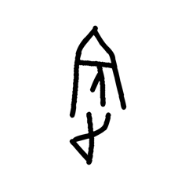

- source_zip_member: `Sub-character Images/cixqnyxp9v/cixqnyxp9v/apf8qngnpi.png`
- checksum_sha256: see `06_component-visual-index.csv`.
- review_status: `needs_human_visual_review`
- caution: source-marked review image only.

## asset-017405

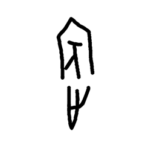

- source_zip_member: `Sub-character Images/cixqnyxp9v/cixqnyxp9v/apysmw50qf.png`
- checksum_sha256: see `06_component-visual-index.csv`.
- review_status: `needs_human_visual_review`
- caution: source-marked review image only.

## asset-017406

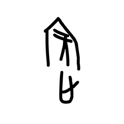

- source_zip_member: `Sub-character Images/cixqnyxp9v/cixqnyxp9v/askau9pvol.png`
- checksum_sha256: see `06_component-visual-index.csv`.
- review_status: `needs_human_visual_review`
- caution: source-marked review image only.

## asset-017407

- source_zip_member: `Sub-character Images/cixqnyxp9v/cixqnyxp9v/azs9og188q.png`
- checksum_sha256: see `06_component-visual-index.csv`.
- review_status: `needs_human_visual_review`
- caution: source-marked review image only.

## asset-017408

- source_zip_member: `Sub-character Images/cixqnyxp9v/cixqnyxp9v/b2jtjobm9u.png`
- checksum_sha256: see `06_component-visual-index.csv`.
- review_status: `needs_human_visual_review`
- caution: source-marked review image only.

## asset-017409

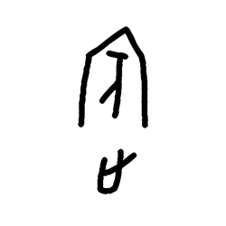

- source_zip_member: `Sub-character Images/cixqnyxp9v/cixqnyxp9v/b4mkk5f7l9.png`
- checksum_sha256: see `06_component-visual-index.csv`.
- review_status: `needs_human_visual_review`
- caution: source-marked review image only.

## asset-017410

- source_zip_member: `Sub-character Images/cixqnyxp9v/cixqnyxp9v/b5obgjv2yn.png`
- checksum_sha256: see `06_component-visual-index.csv`.
- review_status: `needs_human_visual_review`
- caution: source-marked review image only.

## asset-017411

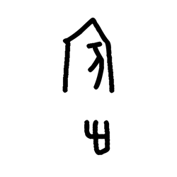

- source_zip_member: `Sub-character Images/cixqnyxp9v/cixqnyxp9v/b9naqjg7q3.png`
- checksum_sha256: see `06_component-visual-index.csv`.
- review_status: `needs_human_visual_review`
- caution: source-marked review image only.

## asset-017412

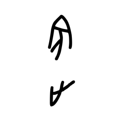

- source_zip_member: `Sub-character Images/cixqnyxp9v/cixqnyxp9v/bok5ammbs2.png`
- checksum_sha256: see `06_component-visual-index.csv`.
- review_status: `needs_human_visual_review`
- caution: source-marked review image only.

## asset-017413

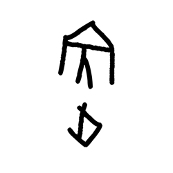

- source_zip_member: `Sub-character Images/cixqnyxp9v/cixqnyxp9v/bw7j0i4kis.png`
- checksum_sha256: see `06_component-visual-index.csv`.
- review_status: `needs_human_visual_review`
- caution: source-marked review image only.

## asset-017414

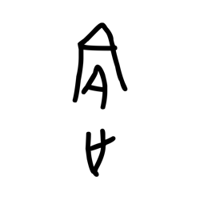

- source_zip_member: `Sub-character Images/cixqnyxp9v/cixqnyxp9v/c1wg0h5rdi.png`
- checksum_sha256: see `06_component-visual-index.csv`.
- review_status: `needs_human_visual_review`
- caution: source-marked review image only.

## asset-017415

- source_zip_member: `Sub-character Images/cixqnyxp9v/cixqnyxp9v/c3h1l9iryj.png`
- checksum_sha256: see `06_component-visual-index.csv`.
- review_status: `needs_human_visual_review`
- caution: source-marked review image only.

## asset-017416

- source_zip_member: `Sub-character Images/cixqnyxp9v/cixqnyxp9v/c9vyxirfdb.png`
- checksum_sha256: see `06_component-visual-index.csv`.
- review_status: `needs_human_visual_review`
- caution: source-marked review image only.

## asset-017417

- source_zip_member: `Sub-character Images/cixqnyxp9v/cixqnyxp9v/cguwpxqak0.png`
- checksum_sha256: see `06_component-visual-index.csv`.
- review_status: `needs_human_visual_review`
- caution: source-marked review image only.

## asset-017418

- source_zip_member: `Sub-character Images/cixqnyxp9v/cixqnyxp9v/cixqnyxp9v.png`
- checksum_sha256: see `06_component-visual-index.csv`.
- review_status: `needs_human_visual_review`
- caution: source-marked review image only.

## asset-017419

- source_zip_member: `Sub-character Images/cixqnyxp9v/cixqnyxp9v/cjcfbnzor8.png`
- checksum_sha256: see `06_component-visual-index.csv`.
- review_status: `needs_human_visual_review`
- caution: source-marked review image only.

## asset-017420

- source_zip_member: `Sub-character Images/cixqnyxp9v/cixqnyxp9v/cqxc70jpyi.png`
- checksum_sha256: see `06_component-visual-index.csv`.
- review_status: `needs_human_visual_review`
- caution: source-marked review image only.

## asset-017421

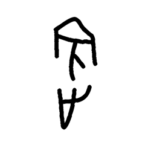

- source_zip_member: `Sub-character Images/cixqnyxp9v/cixqnyxp9v/crj8hukwdb.png`
- checksum_sha256: see `06_component-visual-index.csv`.
- review_status: `needs_human_visual_review`
- caution: source-marked review image only.

## asset-017422

- source_zip_member: `Sub-character Images/cixqnyxp9v/cixqnyxp9v/ctvuy3kl7c.png`
- checksum_sha256: see `06_component-visual-index.csv`.
- review_status: `needs_human_visual_review`
- caution: source-marked review image only.

## asset-017423

- source_zip_member: `Sub-character Images/cixqnyxp9v/cixqnyxp9v/cunyt3hc3v.png`
- checksum_sha256: see `06_component-visual-index.csv`.
- review_status: `needs_human_visual_review`
- caution: source-marked review image only.

## asset-017424

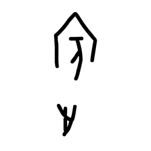

- source_zip_member: `Sub-character Images/cixqnyxp9v/cixqnyxp9v/cyt9c5vana.png`
- checksum_sha256: see `06_component-visual-index.csv`.
- review_status: `needs_human_visual_review`
- caution: source-marked review image only.

## asset-017425

- source_zip_member: `Sub-character Images/cixqnyxp9v/cixqnyxp9v/d03h78y8us.png`
- checksum_sha256: see `06_component-visual-index.csv`.
- review_status: `needs_human_visual_review`
- caution: source-marked review image only.

## asset-017426

- source_zip_member: `Sub-character Images/cixqnyxp9v/cixqnyxp9v/da57u6skq6.png`
- checksum_sha256: see `06_component-visual-index.csv`.
- review_status: `needs_human_visual_review`
- caution: source-marked review image only.

## asset-017427

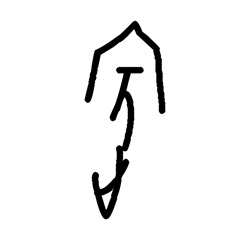

- source_zip_member: `Sub-character Images/cixqnyxp9v/cixqnyxp9v/db16y9t23g.png`
- checksum_sha256: see `06_component-visual-index.csv`.
- review_status: `needs_human_visual_review`
- caution: source-marked review image only.

## asset-017428

- source_zip_member: `Sub-character Images/cixqnyxp9v/cixqnyxp9v/dhoa9p5p5u.png`
- checksum_sha256: see `06_component-visual-index.csv`.
- review_status: `needs_human_visual_review`
- caution: source-marked review image only.

## asset-017429

- source_zip_member: `Sub-character Images/cixqnyxp9v/cixqnyxp9v/diqr0l1gsi.png`
- checksum_sha256: see `06_component-visual-index.csv`.
- review_status: `needs_human_visual_review`
- caution: source-marked review image only.

## asset-017430

- source_zip_member: `Sub-character Images/cixqnyxp9v/cixqnyxp9v/dktkduw5bo.png`
- checksum_sha256: see `06_component-visual-index.csv`.
- review_status: `needs_human_visual_review`
- caution: source-marked review image only.

## asset-017431

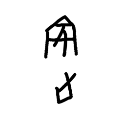

- source_zip_member: `Sub-character Images/cixqnyxp9v/cixqnyxp9v/dluon8zugb.png`
- checksum_sha256: see `06_component-visual-index.csv`.
- review_status: `needs_human_visual_review`
- caution: source-marked review image only.

## asset-017432

- source_zip_member: `Sub-character Images/cixqnyxp9v/cixqnyxp9v/dnvta877vz.png`
- checksum_sha256: see `06_component-visual-index.csv`.
- review_status: `needs_human_visual_review`
- caution: source-marked review image only.

## asset-017433

- source_zip_member: `Sub-character Images/cixqnyxp9v/cixqnyxp9v/e1kvqkzos9.png`
- checksum_sha256: see `06_component-visual-index.csv`.
- review_status: `needs_human_visual_review`
- caution: source-marked review image only.

## asset-017434

- source_zip_member: `Sub-character Images/cixqnyxp9v/cixqnyxp9v/ed619wdl28.png`
- checksum_sha256: see `06_component-visual-index.csv`.
- review_status: `needs_human_visual_review`
- caution: source-marked review image only.

## asset-017435

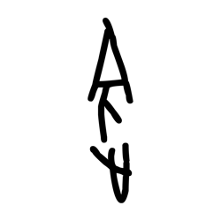

- source_zip_member: `Sub-character Images/cixqnyxp9v/cixqnyxp9v/enx1vb31jb.png`
- checksum_sha256: see `06_component-visual-index.csv`.
- review_status: `needs_human_visual_review`
- caution: source-marked review image only.

## asset-017436

- source_zip_member: `Sub-character Images/cixqnyxp9v/cixqnyxp9v/epf96yigi3.png`
- checksum_sha256: see `06_component-visual-index.csv`.
- review_status: `needs_human_visual_review`
- caution: source-marked review image only.

## asset-017437

- source_zip_member: `Sub-character Images/cixqnyxp9v/cixqnyxp9v/evkcuz6069.png`
- checksum_sha256: see `06_component-visual-index.csv`.
- review_status: `needs_human_visual_review`
- caution: source-marked review image only.

## asset-017438

- source_zip_member: `Sub-character Images/cixqnyxp9v/cixqnyxp9v/eytbod0kn0.png`
- checksum_sha256: see `06_component-visual-index.csv`.
- review_status: `needs_human_visual_review`
- caution: source-marked review image only.

## asset-017439

- source_zip_member: `Sub-character Images/cixqnyxp9v/cixqnyxp9v/f699nwiiun.png`
- checksum_sha256: see `06_component-visual-index.csv`.
- review_status: `needs_human_visual_review`
- caution: source-marked review image only.

## asset-017440

- source_zip_member: `Sub-character Images/cixqnyxp9v/cixqnyxp9v/fa8x37kfg2.png`
- checksum_sha256: see `06_component-visual-index.csv`.
- review_status: `needs_human_visual_review`
- caution: source-marked review image only.

## asset-017441

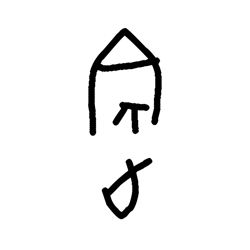

- source_zip_member: `Sub-character Images/cixqnyxp9v/cixqnyxp9v/fbik7pzm2n.png`
- checksum_sha256: see `06_component-visual-index.csv`.
- review_status: `needs_human_visual_review`
- caution: source-marked review image only.

## asset-017442

- source_zip_member: `Sub-character Images/cixqnyxp9v/cixqnyxp9v/flpfhmeyon.png`
- checksum_sha256: see `06_component-visual-index.csv`.
- review_status: `needs_human_visual_review`
- caution: source-marked review image only.

## asset-017443

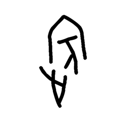

- source_zip_member: `Sub-character Images/cixqnyxp9v/cixqnyxp9v/fnylmnul67.png`
- checksum_sha256: see `06_component-visual-index.csv`.
- review_status: `needs_human_visual_review`
- caution: source-marked review image only.

## asset-017444

- source_zip_member: `Sub-character Images/cixqnyxp9v/cixqnyxp9v/fq3o5w1w7o.png`
- checksum_sha256: see `06_component-visual-index.csv`.
- review_status: `needs_human_visual_review`
- caution: source-marked review image only.

## asset-017445

- source_zip_member: `Sub-character Images/cixqnyxp9v/cixqnyxp9v/fwadwef5f9.png`
- checksum_sha256: see `06_component-visual-index.csv`.
- review_status: `needs_human_visual_review`
- caution: source-marked review image only.

## asset-017446

- source_zip_member: `Sub-character Images/cixqnyxp9v/cixqnyxp9v/g73h2p46tc.png`
- checksum_sha256: see `06_component-visual-index.csv`.
- review_status: `needs_human_visual_review`
- caution: source-marked review image only.

## asset-017447

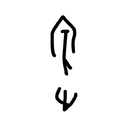

- source_zip_member: `Sub-character Images/cixqnyxp9v/cixqnyxp9v/g9761fk3pw.png`
- checksum_sha256: see `06_component-visual-index.csv`.
- review_status: `needs_human_visual_review`
- caution: source-marked review image only.

## asset-017448

- source_zip_member: `Sub-character Images/cixqnyxp9v/cixqnyxp9v/gdgdnq7gy6.png`
- checksum_sha256: see `06_component-visual-index.csv`.
- review_status: `needs_human_visual_review`
- caution: source-marked review image only.

## asset-017449

- source_zip_member: `Sub-character Images/cixqnyxp9v/cixqnyxp9v/geyt5d84dc.png`
- checksum_sha256: see `06_component-visual-index.csv`.
- review_status: `needs_human_visual_review`
- caution: source-marked review image only.

## asset-017450

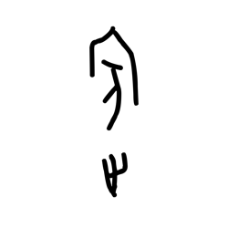

- source_zip_member: `Sub-character Images/cixqnyxp9v/cixqnyxp9v/gizo6zqskz.png`
- checksum_sha256: see `06_component-visual-index.csv`.
- review_status: `needs_human_visual_review`
- caution: source-marked review image only.

## asset-017451

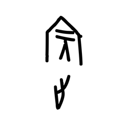

- source_zip_member: `Sub-character Images/cixqnyxp9v/cixqnyxp9v/gpwfl7u9ux.png`
- checksum_sha256: see `06_component-visual-index.csv`.
- review_status: `needs_human_visual_review`
- caution: source-marked review image only.

## asset-017452

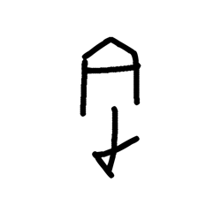

- source_zip_member: `Sub-character Images/cixqnyxp9v/cixqnyxp9v/h2igm8u2zb.png`
- checksum_sha256: see `06_component-visual-index.csv`.
- review_status: `needs_human_visual_review`
- caution: source-marked review image only.

## asset-017453

- source_zip_member: `Sub-character Images/cixqnyxp9v/cixqnyxp9v/hk94fwqrqi.png`
- checksum_sha256: see `06_component-visual-index.csv`.
- review_status: `needs_human_visual_review`
- caution: source-marked review image only.

## asset-017454

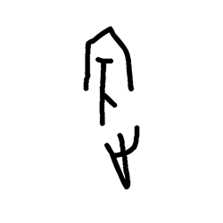

- source_zip_member: `Sub-character Images/cixqnyxp9v/cixqnyxp9v/htyqf0j2ie.png`
- checksum_sha256: see `06_component-visual-index.csv`.
- review_status: `needs_human_visual_review`
- caution: source-marked review image only.

## asset-017455

- source_zip_member: `Sub-character Images/cixqnyxp9v/cixqnyxp9v/i0mfb1fw4j.png`
- checksum_sha256: see `06_component-visual-index.csv`.
- review_status: `needs_human_visual_review`
- caution: source-marked review image only.

## asset-017456

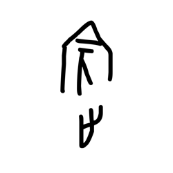

- source_zip_member: `Sub-character Images/cixqnyxp9v/cixqnyxp9v/i5so2it0er.png`
- checksum_sha256: see `06_component-visual-index.csv`.
- review_status: `needs_human_visual_review`
- caution: source-marked review image only.

## asset-017457

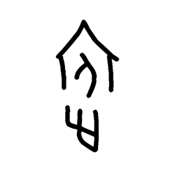

- source_zip_member: `Sub-character Images/cixqnyxp9v/cixqnyxp9v/iyo3ztyo44.png`
- checksum_sha256: see `06_component-visual-index.csv`.
- review_status: `needs_human_visual_review`
- caution: source-marked review image only.

## asset-017458

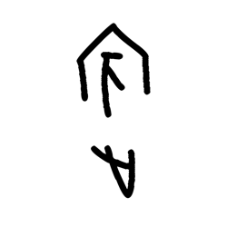

- source_zip_member: `Sub-character Images/cixqnyxp9v/cixqnyxp9v/j2caiccr7s.png`
- checksum_sha256: see `06_component-visual-index.csv`.
- review_status: `needs_human_visual_review`
- caution: source-marked review image only.

## asset-017459

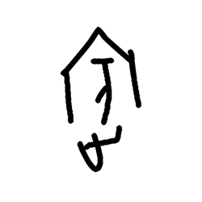

- source_zip_member: `Sub-character Images/cixqnyxp9v/cixqnyxp9v/j2y7oufs9g.png`
- checksum_sha256: see `06_component-visual-index.csv`.
- review_status: `needs_human_visual_review`
- caution: source-marked review image only.

## asset-017460

- source_zip_member: `Sub-character Images/cixqnyxp9v/cixqnyxp9v/jfj3g0d8g2.png`
- checksum_sha256: see `06_component-visual-index.csv`.
- review_status: `needs_human_visual_review`
- caution: source-marked review image only.

## asset-017461

- source_zip_member: `Sub-character Images/cixqnyxp9v/cixqnyxp9v/jjz9zfdy8t.png`
- checksum_sha256: see `06_component-visual-index.csv`.
- review_status: `needs_human_visual_review`
- caution: source-marked review image only.

## asset-017462

- source_zip_member: `Sub-character Images/cixqnyxp9v/cixqnyxp9v/k59go4xbj5.png`
- checksum_sha256: see `06_component-visual-index.csv`.
- review_status: `needs_human_visual_review`
- caution: source-marked review image only.

## asset-017463

- source_zip_member: `Sub-character Images/cixqnyxp9v/cixqnyxp9v/kd5ckoopch.png`
- checksum_sha256: see `06_component-visual-index.csv`.
- review_status: `needs_human_visual_review`
- caution: source-marked review image only.

## asset-017464

- source_zip_member: `Sub-character Images/cixqnyxp9v/cixqnyxp9v/kezri4eok8.png`
- checksum_sha256: see `06_component-visual-index.csv`.
- review_status: `needs_human_visual_review`
- caution: source-marked review image only.

## asset-017465

- source_zip_member: `Sub-character Images/cixqnyxp9v/cixqnyxp9v/kjerafl9rn.png`
- checksum_sha256: see `06_component-visual-index.csv`.
- review_status: `needs_human_visual_review`
- caution: source-marked review image only.

## asset-017466

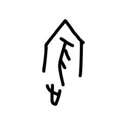

- source_zip_member: `Sub-character Images/cixqnyxp9v/cixqnyxp9v/kldp60yvmq.png`
- checksum_sha256: see `06_component-visual-index.csv`.
- review_status: `needs_human_visual_review`
- caution: source-marked review image only.

## asset-017467

- source_zip_member: `Sub-character Images/cixqnyxp9v/cixqnyxp9v/klvmfu7wgi.png`
- checksum_sha256: see `06_component-visual-index.csv`.
- review_status: `needs_human_visual_review`
- caution: source-marked review image only.

## asset-017468

- source_zip_member: `Sub-character Images/cixqnyxp9v/cixqnyxp9v/l09wiwvvjj.png`
- checksum_sha256: see `06_component-visual-index.csv`.
- review_status: `needs_human_visual_review`
- caution: source-marked review image only.

## asset-017469

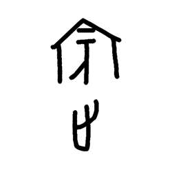

- source_zip_member: `Sub-character Images/cixqnyxp9v/cixqnyxp9v/l4wg1drg37.png`
- checksum_sha256: see `06_component-visual-index.csv`.
- review_status: `needs_human_visual_review`
- caution: source-marked review image only.

## asset-017470

- source_zip_member: `Sub-character Images/cixqnyxp9v/cixqnyxp9v/l5qevy6tt8.png`
- checksum_sha256: see `06_component-visual-index.csv`.
- review_status: `needs_human_visual_review`
- caution: source-marked review image only.

## asset-017471

- source_zip_member: `Sub-character Images/cixqnyxp9v/cixqnyxp9v/l7qqjwwxpw.png`
- checksum_sha256: see `06_component-visual-index.csv`.
- review_status: `needs_human_visual_review`
- caution: source-marked review image only.

## asset-017472

- source_zip_member: `Sub-character Images/cixqnyxp9v/cixqnyxp9v/l9luuunadq.png`
- checksum_sha256: see `06_component-visual-index.csv`.
- review_status: `needs_human_visual_review`
- caution: source-marked review image only.

## asset-017473

- source_zip_member: `Sub-character Images/cixqnyxp9v/cixqnyxp9v/laqla0o6yx.png`
- checksum_sha256: see `06_component-visual-index.csv`.
- review_status: `needs_human_visual_review`
- caution: source-marked review image only.

## asset-017474

- source_zip_member: `Sub-character Images/cixqnyxp9v/cixqnyxp9v/lay8xlnhbc.png`
- checksum_sha256: see `06_component-visual-index.csv`.
- review_status: `needs_human_visual_review`
- caution: source-marked review image only.

## asset-017475

- source_zip_member: `Sub-character Images/cixqnyxp9v/cixqnyxp9v/lfmugsf9ir.png`
- checksum_sha256: see `06_component-visual-index.csv`.
- review_status: `needs_human_visual_review`
- caution: source-marked review image only.

## asset-017476

- source_zip_member: `Sub-character Images/cixqnyxp9v/cixqnyxp9v/lkno3gfd7h.png`
- checksum_sha256: see `06_component-visual-index.csv`.
- review_status: `needs_human_visual_review`
- caution: source-marked review image only.

## asset-017477

- source_zip_member: `Sub-character Images/cixqnyxp9v/cixqnyxp9v/lmzleabgn3.png`
- checksum_sha256: see `06_component-visual-index.csv`.
- review_status: `needs_human_visual_review`
- caution: source-marked review image only.

## asset-017478

- source_zip_member: `Sub-character Images/cixqnyxp9v/cixqnyxp9v/lped7s2dqc.png`
- checksum_sha256: see `06_component-visual-index.csv`.
- review_status: `needs_human_visual_review`
- caution: source-marked review image only.

## asset-017479

- source_zip_member: `Sub-character Images/cixqnyxp9v/cixqnyxp9v/lsdy8ynp44.png`
- checksum_sha256: see `06_component-visual-index.csv`.
- review_status: `needs_human_visual_review`
- caution: source-marked review image only.

## asset-017480

- source_zip_member: `Sub-character Images/cixqnyxp9v/cixqnyxp9v/luo45r2g8m.png`
- checksum_sha256: see `06_component-visual-index.csv`.
- review_status: `needs_human_visual_review`
- caution: source-marked review image only.

## asset-017481

- source_zip_member: `Sub-character Images/cixqnyxp9v/cixqnyxp9v/mu4h071zw5.png`
- checksum_sha256: see `06_component-visual-index.csv`.
- review_status: `needs_human_visual_review`
- caution: source-marked review image only.

## asset-017482

- source_zip_member: `Sub-character Images/cixqnyxp9v/cixqnyxp9v/n3xski61id.png`
- checksum_sha256: see `06_component-visual-index.csv`.
- review_status: `needs_human_visual_review`
- caution: source-marked review image only.

## asset-017483

- source_zip_member: `Sub-character Images/cixqnyxp9v/cixqnyxp9v/n6mw3bqh71.png`
- checksum_sha256: see `06_component-visual-index.csv`.
- review_status: `needs_human_visual_review`
- caution: source-marked review image only.

## asset-017484

- source_zip_member: `Sub-character Images/cixqnyxp9v/cixqnyxp9v/n7yqrvf1lu.png`
- checksum_sha256: see `06_component-visual-index.csv`.
- review_status: `needs_human_visual_review`
- caution: source-marked review image only.

## asset-017485

- source_zip_member: `Sub-character Images/cixqnyxp9v/cixqnyxp9v/nfzuzoq21l.png`
- checksum_sha256: see `06_component-visual-index.csv`.
- review_status: `needs_human_visual_review`
- caution: source-marked review image only.

## asset-017486

- source_zip_member: `Sub-character Images/cixqnyxp9v/cixqnyxp9v/ng42imh9f1.png`
- checksum_sha256: see `06_component-visual-index.csv`.
- review_status: `needs_human_visual_review`
- caution: source-marked review image only.

## asset-017487

- source_zip_member: `Sub-character Images/cixqnyxp9v/cixqnyxp9v/nisre0ooo3.png`
- checksum_sha256: see `06_component-visual-index.csv`.
- review_status: `needs_human_visual_review`
- caution: source-marked review image only.

## asset-017488

- source_zip_member: `Sub-character Images/cixqnyxp9v/cixqnyxp9v/nxajsqdpyx.png`
- checksum_sha256: see `06_component-visual-index.csv`.
- review_status: `needs_human_visual_review`
- caution: source-marked review image only.

## asset-017489

- source_zip_member: `Sub-character Images/cixqnyxp9v/cixqnyxp9v/o4hu1ens7r.png`
- checksum_sha256: see `06_component-visual-index.csv`.
- review_status: `needs_human_visual_review`
- caution: source-marked review image only.

## asset-017490

- source_zip_member: `Sub-character Images/cixqnyxp9v/cixqnyxp9v/ob89714kn9.png`
- checksum_sha256: see `06_component-visual-index.csv`.
- review_status: `needs_human_visual_review`
- caution: source-marked review image only.

## asset-017491

- source_zip_member: `Sub-character Images/cixqnyxp9v/cixqnyxp9v/olbtzvk3j9.png`
- checksum_sha256: see `06_component-visual-index.csv`.
- review_status: `needs_human_visual_review`
- caution: source-marked review image only.

## asset-017492

- source_zip_member: `Sub-character Images/cixqnyxp9v/cixqnyxp9v/p67kil7xtp.png`
- checksum_sha256: see `06_component-visual-index.csv`.
- review_status: `needs_human_visual_review`
- caution: source-marked review image only.

## asset-017493

- source_zip_member: `Sub-character Images/cixqnyxp9v/cixqnyxp9v/p6jbsry8cj.png`
- checksum_sha256: see `06_component-visual-index.csv`.
- review_status: `needs_human_visual_review`
- caution: source-marked review image only.

## asset-017494

- source_zip_member: `Sub-character Images/cixqnyxp9v/cixqnyxp9v/p6o8vljhrx.png`
- checksum_sha256: see `06_component-visual-index.csv`.
- review_status: `needs_human_visual_review`
- caution: source-marked review image only.

## asset-017495

- source_zip_member: `Sub-character Images/cixqnyxp9v/cixqnyxp9v/pbp292akb5.png`
- checksum_sha256: see `06_component-visual-index.csv`.
- review_status: `needs_human_visual_review`
- caution: source-marked review image only.

## asset-017496

- source_zip_member: `Sub-character Images/cixqnyxp9v/cixqnyxp9v/pe4sl9wtde.png`
- checksum_sha256: see `06_component-visual-index.csv`.
- review_status: `needs_human_visual_review`
- caution: source-marked review image only.

## asset-017497

- source_zip_member: `Sub-character Images/cixqnyxp9v/cixqnyxp9v/pi4wxku13z.png`
- checksum_sha256: see `06_component-visual-index.csv`.
- review_status: `needs_human_visual_review`
- caution: source-marked review image only.

## asset-017498

- source_zip_member: `Sub-character Images/cixqnyxp9v/cixqnyxp9v/pvhr13lf9a.png`
- checksum_sha256: see `06_component-visual-index.csv`.
- review_status: `needs_human_visual_review`
- caution: source-marked review image only.

## asset-017499

- source_zip_member: `Sub-character Images/cixqnyxp9v/cixqnyxp9v/pww4v26x4e.png`
- checksum_sha256: see `06_component-visual-index.csv`.
- review_status: `needs_human_visual_review`
- caution: source-marked review image only.

## asset-017500

- source_zip_member: `Sub-character Images/cixqnyxp9v/cixqnyxp9v/qd2tlshsd0.png`
- checksum_sha256: see `06_component-visual-index.csv`.
- review_status: `needs_human_visual_review`
- caution: source-marked review image only.

## asset-017501

- source_zip_member: `Sub-character Images/cixqnyxp9v/cixqnyxp9v/qjluo2ur8p.png`
- checksum_sha256: see `06_component-visual-index.csv`.
- review_status: `needs_human_visual_review`
- caution: source-marked review image only.

## asset-017502

- source_zip_member: `Sub-character Images/cixqnyxp9v/cixqnyxp9v/qs5dkwn8qv.png`
- checksum_sha256: see `06_component-visual-index.csv`.
- review_status: `needs_human_visual_review`
- caution: source-marked review image only.

## asset-017503

- source_zip_member: `Sub-character Images/cixqnyxp9v/cixqnyxp9v/r1wqngsj86.png`
- checksum_sha256: see `06_component-visual-index.csv`.
- review_status: `needs_human_visual_review`
- caution: source-marked review image only.

## asset-017504

- source_zip_member: `Sub-character Images/cixqnyxp9v/cixqnyxp9v/r3aef4o08m.png`
- checksum_sha256: see `06_component-visual-index.csv`.
- review_status: `needs_human_visual_review`
- caution: source-marked review image only.

## asset-017505

- source_zip_member: `Sub-character Images/cixqnyxp9v/cixqnyxp9v/rm38m1glt8.png`
- checksum_sha256: see `06_component-visual-index.csv`.
- review_status: `needs_human_visual_review`
- caution: source-marked review image only.

## asset-017506

- source_zip_member: `Sub-character Images/cixqnyxp9v/cixqnyxp9v/rudooztvby.png`
- checksum_sha256: see `06_component-visual-index.csv`.
- review_status: `needs_human_visual_review`
- caution: source-marked review image only.

## asset-017507

- source_zip_member: `Sub-character Images/cixqnyxp9v/cixqnyxp9v/rvq59yslw1.png`
- checksum_sha256: see `06_component-visual-index.csv`.
- review_status: `needs_human_visual_review`
- caution: source-marked review image only.

## asset-017508

- source_zip_member: `Sub-character Images/cixqnyxp9v/cixqnyxp9v/sims7kjq6o.png`
- checksum_sha256: see `06_component-visual-index.csv`.
- review_status: `needs_human_visual_review`
- caution: source-marked review image only.

## asset-017509

- source_zip_member: `Sub-character Images/cixqnyxp9v/cixqnyxp9v/sjsa2nc8xl.png`
- checksum_sha256: see `06_component-visual-index.csv`.
- review_status: `needs_human_visual_review`
- caution: source-marked review image only.

## asset-017510

- source_zip_member: `Sub-character Images/cixqnyxp9v/cixqnyxp9v/ss8q1idz6f.png`
- checksum_sha256: see `06_component-visual-index.csv`.
- review_status: `needs_human_visual_review`
- caution: source-marked review image only.

## asset-017511

- source_zip_member: `Sub-character Images/cixqnyxp9v/cixqnyxp9v/swfs3tq1hw.png`
- checksum_sha256: see `06_component-visual-index.csv`.
- review_status: `needs_human_visual_review`
- caution: source-marked review image only.

## asset-017512

- source_zip_member: `Sub-character Images/cixqnyxp9v/cixqnyxp9v/sxvxcnje8r.png`
- checksum_sha256: see `06_component-visual-index.csv`.
- review_status: `needs_human_visual_review`
- caution: source-marked review image only.

## asset-017513

- source_zip_member: `Sub-character Images/cixqnyxp9v/cixqnyxp9v/ta2e8y6qyi.png`
- checksum_sha256: see `06_component-visual-index.csv`.
- review_status: `needs_human_visual_review`
- caution: source-marked review image only.

## asset-017514

- source_zip_member: `Sub-character Images/cixqnyxp9v/cixqnyxp9v/tdoleebh3b.png`
- checksum_sha256: see `06_component-visual-index.csv`.
- review_status: `needs_human_visual_review`
- caution: source-marked review image only.

## asset-017515

- source_zip_member: `Sub-character Images/cixqnyxp9v/cixqnyxp9v/tszw816bsl.png`
- checksum_sha256: see `06_component-visual-index.csv`.
- review_status: `needs_human_visual_review`
- caution: source-marked review image only.

## asset-017516

- source_zip_member: `Sub-character Images/cixqnyxp9v/cixqnyxp9v/tu6efmwjo1.png`
- checksum_sha256: see `06_component-visual-index.csv`.
- review_status: `needs_human_visual_review`
- caution: source-marked review image only.

## asset-017517

- source_zip_member: `Sub-character Images/cixqnyxp9v/cixqnyxp9v/tv8hvlnx3j.png`
- checksum_sha256: see `06_component-visual-index.csv`.
- review_status: `needs_human_visual_review`
- caution: source-marked review image only.

## asset-017518

- source_zip_member: `Sub-character Images/cixqnyxp9v/cixqnyxp9v/tybeq9ql7c.png`
- checksum_sha256: see `06_component-visual-index.csv`.
- review_status: `needs_human_visual_review`
- caution: source-marked review image only.

## asset-017519

- source_zip_member: `Sub-character Images/cixqnyxp9v/cixqnyxp9v/u40i0tycha.png`
- checksum_sha256: see `06_component-visual-index.csv`.
- review_status: `needs_human_visual_review`
- caution: source-marked review image only.

## asset-017520

- source_zip_member: `Sub-character Images/cixqnyxp9v/cixqnyxp9v/u9da0fa2dn.png`
- checksum_sha256: see `06_component-visual-index.csv`.
- review_status: `needs_human_visual_review`
- caution: source-marked review image only.

## asset-017521

- source_zip_member: `Sub-character Images/cixqnyxp9v/cixqnyxp9v/uej71ifz7r.png`
- checksum_sha256: see `06_component-visual-index.csv`.
- review_status: `needs_human_visual_review`
- caution: source-marked review image only.

## asset-017522

- source_zip_member: `Sub-character Images/cixqnyxp9v/cixqnyxp9v/um6r9izigx.png`
- checksum_sha256: see `06_component-visual-index.csv`.
- review_status: `needs_human_visual_review`
- caution: source-marked review image only.

## asset-017523

- source_zip_member: `Sub-character Images/cixqnyxp9v/cixqnyxp9v/v01sevaejc.png`
- checksum_sha256: see `06_component-visual-index.csv`.
- review_status: `needs_human_visual_review`
- caution: source-marked review image only.

## asset-017524

- source_zip_member: `Sub-character Images/cixqnyxp9v/cixqnyxp9v/vchtbs4kgu.png`
- checksum_sha256: see `06_component-visual-index.csv`.
- review_status: `needs_human_visual_review`
- caution: source-marked review image only.

## asset-017525

- source_zip_member: `Sub-character Images/cixqnyxp9v/cixqnyxp9v/w8xazsnpfu.png`
- checksum_sha256: see `06_component-visual-index.csv`.
- review_status: `needs_human_visual_review`
- caution: source-marked review image only.

## asset-017526

- source_zip_member: `Sub-character Images/cixqnyxp9v/cixqnyxp9v/wes6jgvkvc.png`
- checksum_sha256: see `06_component-visual-index.csv`.
- review_status: `needs_human_visual_review`
- caution: source-marked review image only.

## asset-017527

- source_zip_member: `Sub-character Images/cixqnyxp9v/cixqnyxp9v/x0m37jyfne.png`
- checksum_sha256: see `06_component-visual-index.csv`.
- review_status: `needs_human_visual_review`
- caution: source-marked review image only.

## asset-017528

- source_zip_member: `Sub-character Images/cixqnyxp9v/cixqnyxp9v/x7cfgzenri.png`
- checksum_sha256: see `06_component-visual-index.csv`.
- review_status: `needs_human_visual_review`
- caution: source-marked review image only.

## asset-017529

- source_zip_member: `Sub-character Images/cixqnyxp9v/cixqnyxp9v/ya8wsh64pk.png`
- checksum_sha256: see `06_component-visual-index.csv`.
- review_status: `needs_human_visual_review`
- caution: source-marked review image only.

## asset-017530

- source_zip_member: `Sub-character Images/cixqnyxp9v/cixqnyxp9v/yaazwaw2po.png`
- checksum_sha256: see `06_component-visual-index.csv`.
- review_status: `needs_human_visual_review`
- caution: source-marked review image only.

## asset-017531

- source_zip_member: `Sub-character Images/cixqnyxp9v/cixqnyxp9v/yalswvbjqa.png`
- checksum_sha256: see `06_component-visual-index.csv`.
- review_status: `needs_human_visual_review`
- caution: source-marked review image only.

## asset-017532

- source_zip_member: `Sub-character Images/cixqnyxp9v/cixqnyxp9v/yohtnha26w.png`
- checksum_sha256: see `06_component-visual-index.csv`.
- review_status: `needs_human_visual_review`
- caution: source-marked review image only.

## asset-017533

- source_zip_member: `Sub-character Images/cixqnyxp9v/cixqnyxp9v/yuu8vudm4l.png`
- checksum_sha256: see `06_component-visual-index.csv`.
- review_status: `needs_human_visual_review`
- caution: source-marked review image only.

## asset-017534

- source_zip_member: `Sub-character Images/cixqnyxp9v/cixqnyxp9v/z5g8vgj3qm.png`
- checksum_sha256: see `06_component-visual-index.csv`.
- review_status: `needs_human_visual_review`
- caution: source-marked review image only.

## asset-017535

- source_zip_member: `Sub-character Images/cixqnyxp9v/cixqnyxp9v/z7wzf2r2x2.png`
- checksum_sha256: see `06_component-visual-index.csv`.
- review_status: `needs_human_visual_review`
- caution: source-marked review image only.

## asset-017536

- source_zip_member: `Sub-character Images/cixqnyxp9v/cixqnyxp9v/zf12i2g2vw.png`
- checksum_sha256: see `06_component-visual-index.csv`.
- review_status: `needs_human_visual_review`
- caution: source-marked review image only.

## asset-017537

- source_zip_member: `Sub-character Images/cixqnyxp9v/cixqnyxp9v/zjnsjj3lhv.png`
- checksum_sha256: see `06_component-visual-index.csv`.
- review_status: `needs_human_visual_review`
- caution: source-marked review image only.

## asset-017538

- source_zip_member: `Sub-character Images/cixqnyxp9v/cixqnyxp9v/zx3uhkkynn.png`
- checksum_sha256: see `06_component-visual-index.csv`.
- review_status: `needs_human_visual_review`
- caution: source-marked review image only.
