# Component Visual Gallery / 构件图像查看: obs-comp-cand-001670

English:
This page displays OBIMD subcharacter PNG assets extracted into this concrete corpus object directory for human review.

简体中文：
本页展示抽取到当前具体 corpus 对象目录内的 OBIMD subcharacter PNG 资料，供人工复核使用。

Boundary / 边界：dataset image candidate only; not a confirmed component form, component assignment, or decipherment claim.

## asset-017539

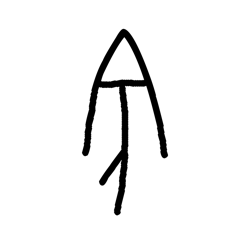

- source_zip_member: `Sub-character Images/cixqnyxp9v/ki5ox0jyx5/1ebg3i36cb.png`
- checksum_sha256: `d4eb0d0e21397b2b7b005903057b28073e4d21eec5cbc3c0738ed3fdeeb918c0`
- review_status: `needs_human_visual_review`
- caution: OBIMD subcharacter image is a source-marked review asset only; it is not a confirmed component form, component assignment, or decipherment conclusion.

## asset-017540

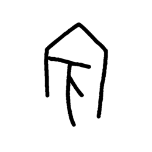

- source_zip_member: `Sub-character Images/cixqnyxp9v/ki5ox0jyx5/1mhd924vcm.png`
- checksum_sha256: `67db8411c241d803ff0756ca17fb9b7eb7476a6d60c39bcddfacd55f2ddee2a6`
- review_status: `needs_human_visual_review`
- caution: OBIMD subcharacter image is a source-marked review asset only; it is not a confirmed component form, component assignment, or decipherment conclusion.

## asset-017541

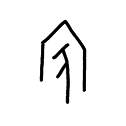

- source_zip_member: `Sub-character Images/cixqnyxp9v/ki5ox0jyx5/1n4t9yp62t.png`
- checksum_sha256: `79b891a003f4a9cae79d05bb7a0dce8ba970ae1908a718301c41f24f8ece24e8`
- review_status: `needs_human_visual_review`
- caution: OBIMD subcharacter image is a source-marked review asset only; it is not a confirmed component form, component assignment, or decipherment conclusion.

## asset-017542

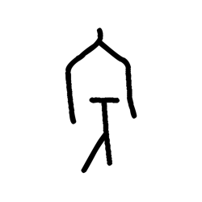

- source_zip_member: `Sub-character Images/cixqnyxp9v/ki5ox0jyx5/1nox9d4u4s.png`
- checksum_sha256: `fd91126d1e85d9201727392defe3de33fe75286b3213dc7f86afb0b7da9aee62`
- review_status: `needs_human_visual_review`
- caution: OBIMD subcharacter image is a source-marked review asset only; it is not a confirmed component form, component assignment, or decipherment conclusion.

## asset-017543

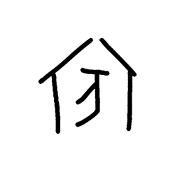

- source_zip_member: `Sub-character Images/cixqnyxp9v/ki5ox0jyx5/2dhnr3ds72.png`
- checksum_sha256: `1584644d0a2443c5e32ea6c553f87015c3fcef459df21c6cecb41d1a6cc99d0b`
- review_status: `needs_human_visual_review`
- caution: OBIMD subcharacter image is a source-marked review asset only; it is not a confirmed component form, component assignment, or decipherment conclusion.

## asset-017544

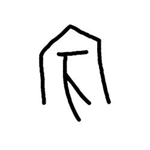

- source_zip_member: `Sub-character Images/cixqnyxp9v/ki5ox0jyx5/3fg07vqun7.png`
- checksum_sha256: `d4dd77fe5679881fece63618e04e12080ee8298976f15c041b171079ca61b2e9`
- review_status: `needs_human_visual_review`
- caution: OBIMD subcharacter image is a source-marked review asset only; it is not a confirmed component form, component assignment, or decipherment conclusion.

## asset-017545

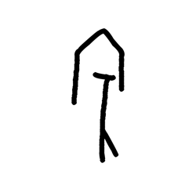

- source_zip_member: `Sub-character Images/cixqnyxp9v/ki5ox0jyx5/59nmyc1rx1.png`
- checksum_sha256: `cce6d752138adb697d2cb4d67496e3eef28058257b8cafb0720792dcff901f36`
- review_status: `needs_human_visual_review`
- caution: OBIMD subcharacter image is a source-marked review asset only; it is not a confirmed component form, component assignment, or decipherment conclusion.

## asset-017546

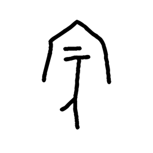

- source_zip_member: `Sub-character Images/cixqnyxp9v/ki5ox0jyx5/5b3jusle03.png`
- checksum_sha256: `7020bbaae631425f86b3a11c9d41a8e09ce27efe5fc5b955275ddc2da5f1221d`
- review_status: `needs_human_visual_review`
- caution: OBIMD subcharacter image is a source-marked review asset only; it is not a confirmed component form, component assignment, or decipherment conclusion.

## asset-017547

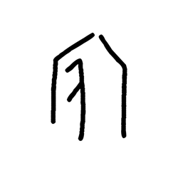

- source_zip_member: `Sub-character Images/cixqnyxp9v/ki5ox0jyx5/5bknghfn0h.png`
- checksum_sha256: `d8500310be3fcdc2d553834ab0f000564b9a677333cc42977c994bd6077d7817`
- review_status: `needs_human_visual_review`
- caution: OBIMD subcharacter image is a source-marked review asset only; it is not a confirmed component form, component assignment, or decipherment conclusion.

## asset-017548

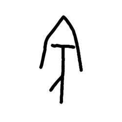

- source_zip_member: `Sub-character Images/cixqnyxp9v/ki5ox0jyx5/6al0d6iogn.png`
- checksum_sha256: `89a409e324cca1db67f7e35c4586952f6b78e7be3b98a014bd2cec1c76c3b6b3`
- review_status: `needs_human_visual_review`
- caution: OBIMD subcharacter image is a source-marked review asset only; it is not a confirmed component form, component assignment, or decipherment conclusion.

## asset-017549

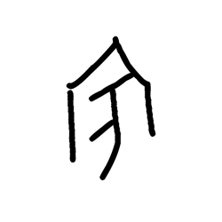

- source_zip_member: `Sub-character Images/cixqnyxp9v/ki5ox0jyx5/6rn3ghrtz4.png`
- checksum_sha256: `3910931ca93986fab56afc32b0e98002587c675964d3080f218426b5671b5b13`
- review_status: `needs_human_visual_review`
- caution: OBIMD subcharacter image is a source-marked review asset only; it is not a confirmed component form, component assignment, or decipherment conclusion.

## asset-017550

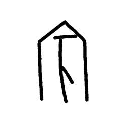

- source_zip_member: `Sub-character Images/cixqnyxp9v/ki5ox0jyx5/6weex10smz.png`
- checksum_sha256: `e3c642f15d92b983c4f3162a01f20578e94b9931fd270001028cf842cddca25b`
- review_status: `needs_human_visual_review`
- caution: OBIMD subcharacter image is a source-marked review asset only; it is not a confirmed component form, component assignment, or decipherment conclusion.

## asset-017551

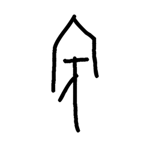

- source_zip_member: `Sub-character Images/cixqnyxp9v/ki5ox0jyx5/76vvojduid.png`
- checksum_sha256: `b4944cd81a5bf712d191697d41f28d3fccf50d4933e6427952f85b9c7fc1903e`
- review_status: `needs_human_visual_review`
- caution: OBIMD subcharacter image is a source-marked review asset only; it is not a confirmed component form, component assignment, or decipherment conclusion.

## asset-017552

- source_zip_member: `Sub-character Images/cixqnyxp9v/ki5ox0jyx5/9qr3z2i5a6.png`
- checksum_sha256: `fac223f66e04080d7fd4d13dc0c53dab3a18539f19f402e751072ecc8e146758`
- review_status: `needs_human_visual_review`
- caution: OBIMD subcharacter image is a source-marked review asset only; it is not a confirmed component form, component assignment, or decipherment conclusion.

## asset-017553

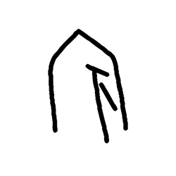

- source_zip_member: `Sub-character Images/cixqnyxp9v/ki5ox0jyx5/a2lq6anmdg.png`
- checksum_sha256: `fb9037932da67e1b13061c03ee873f98fb1ccf124c23244e67ca83879fd043fe`
- review_status: `needs_human_visual_review`
- caution: OBIMD subcharacter image is a source-marked review asset only; it is not a confirmed component form, component assignment, or decipherment conclusion.

## asset-017554

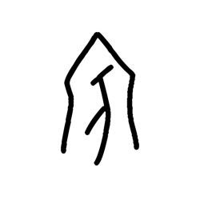

- source_zip_member: `Sub-character Images/cixqnyxp9v/ki5ox0jyx5/aqyl0xhtn8.png`
- checksum_sha256: `52fdf47d7eb663aa0af2667648c66d75501db6273f09fc487594592c984c7cea`
- review_status: `needs_human_visual_review`
- caution: OBIMD subcharacter image is a source-marked review asset only; it is not a confirmed component form, component assignment, or decipherment conclusion.

## asset-017555

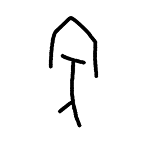

- source_zip_member: `Sub-character Images/cixqnyxp9v/ki5ox0jyx5/bpm8fvg1h0.png`
- checksum_sha256: `419d1618f0bbbc6b3a8ebf53b3253e19f215f23ccafefec01bfe941f4a5e6520`
- review_status: `needs_human_visual_review`
- caution: OBIMD subcharacter image is a source-marked review asset only; it is not a confirmed component form, component assignment, or decipherment conclusion.

## asset-017556

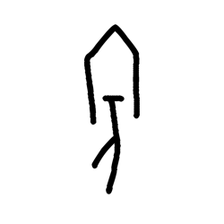

- source_zip_member: `Sub-character Images/cixqnyxp9v/ki5ox0jyx5/c2rlv3oru0.png`
- checksum_sha256: `a1a7dcf702515fe6c363779f2a44c11fc5034a8275c543df1d3d96e96d2b2c1b`
- review_status: `needs_human_visual_review`
- caution: OBIMD subcharacter image is a source-marked review asset only; it is not a confirmed component form, component assignment, or decipherment conclusion.

## asset-017557

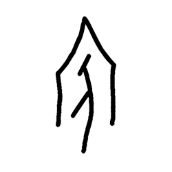

- source_zip_member: `Sub-character Images/cixqnyxp9v/ki5ox0jyx5/fgfhrcglqo.png`
- checksum_sha256: `1975b22d827be0fbe53f7ac92212ff325efa56c6abd31a60bd4268462df96e8c`
- review_status: `needs_human_visual_review`
- caution: OBIMD subcharacter image is a source-marked review asset only; it is not a confirmed component form, component assignment, or decipherment conclusion.

## asset-017558

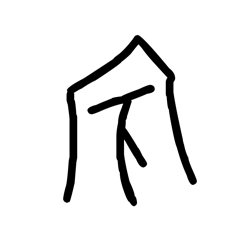

- source_zip_member: `Sub-character Images/cixqnyxp9v/ki5ox0jyx5/froi8qgkf5.png`
- checksum_sha256: `96778b669eb8917d06b3237a9e3e877b3a87f2bbe07773a55d31cda105e3653c`
- review_status: `needs_human_visual_review`
- caution: OBIMD subcharacter image is a source-marked review asset only; it is not a confirmed component form, component assignment, or decipherment conclusion.

## asset-017559

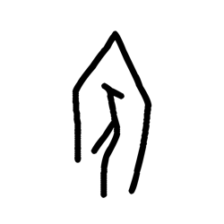

- source_zip_member: `Sub-character Images/cixqnyxp9v/ki5ox0jyx5/hmtsb0iz8o.png`
- checksum_sha256: `bb7ccb7d5082f06891995180fb2ef54a5cd4ff56bc5630e5b39ee27aabc397ed`
- review_status: `needs_human_visual_review`
- caution: OBIMD subcharacter image is a source-marked review asset only; it is not a confirmed component form, component assignment, or decipherment conclusion.

## asset-017560

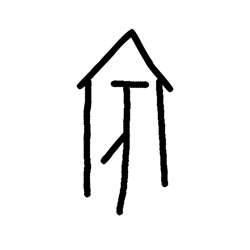

- source_zip_member: `Sub-character Images/cixqnyxp9v/ki5ox0jyx5/i4hx8jn8hz.png`
- checksum_sha256: `9cad424b46dba1a83f1fee9193a4e141e0e4b34be4e98c7553abc1a53e3543ec`
- review_status: `needs_human_visual_review`
- caution: OBIMD subcharacter image is a source-marked review asset only; it is not a confirmed component form, component assignment, or decipherment conclusion.

## asset-017561

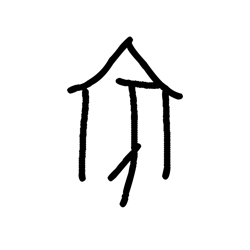

- source_zip_member: `Sub-character Images/cixqnyxp9v/ki5ox0jyx5/ikjmuyyecr.png`
- checksum_sha256: `643488128960b243add6da422391ee1d229b00917b5075a363f14765a0a09872`
- review_status: `needs_human_visual_review`
- caution: OBIMD subcharacter image is a source-marked review asset only; it is not a confirmed component form, component assignment, or decipherment conclusion.

## asset-017562

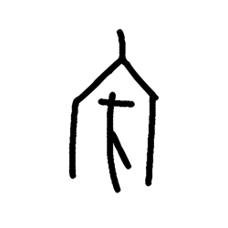

- source_zip_member: `Sub-character Images/cixqnyxp9v/ki5ox0jyx5/ivb3hiodrf.png`
- checksum_sha256: `9ac37a7fcc525b859f4a809d182100ab74bf70e4132faeb7f66f65644a0a9f25`
- review_status: `needs_human_visual_review`
- caution: OBIMD subcharacter image is a source-marked review asset only; it is not a confirmed component form, component assignment, or decipherment conclusion.

## asset-017563

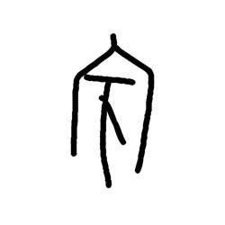

- source_zip_member: `Sub-character Images/cixqnyxp9v/ki5ox0jyx5/j1xajjl0ex.png`
- checksum_sha256: `0fdbb5f0aec41a8f6950c8e47dc10c11d0e09f385b22b432e18b28b9cf4e7dd1`
- review_status: `needs_human_visual_review`
- caution: OBIMD subcharacter image is a source-marked review asset only; it is not a confirmed component form, component assignment, or decipherment conclusion.

## asset-017564

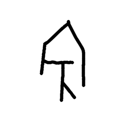

- source_zip_member: `Sub-character Images/cixqnyxp9v/ki5ox0jyx5/j8rqhwxbov.png`
- checksum_sha256: `23c2dacd56ab6829bfaf38f0ca132d5f5737a7eea3c6a6effe7bec409593448b`
- review_status: `needs_human_visual_review`
- caution: OBIMD subcharacter image is a source-marked review asset only; it is not a confirmed component form, component assignment, or decipherment conclusion.

## asset-017565

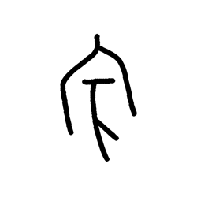

- source_zip_member: `Sub-character Images/cixqnyxp9v/ki5ox0jyx5/jjbfmsdrv5.png`
- checksum_sha256: `3490d0e06df2cd70868b6485a7d79c902cb18faeb6effcfebb2eee35b70992d6`
- review_status: `needs_human_visual_review`
- caution: OBIMD subcharacter image is a source-marked review asset only; it is not a confirmed component form, component assignment, or decipherment conclusion.

## asset-017566

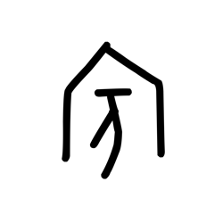

- source_zip_member: `Sub-character Images/cixqnyxp9v/ki5ox0jyx5/ki5ox0jyx5.png`
- checksum_sha256: `45591982b996dc2e63696b683c88c8bf5bd5752ee1a9499e79f26165a8ccceca`
- review_status: `needs_human_visual_review`
- caution: OBIMD subcharacter image is a source-marked review asset only; it is not a confirmed component form, component assignment, or decipherment conclusion.

## asset-017567

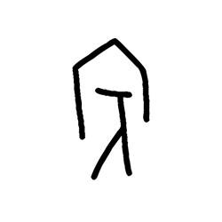

- source_zip_member: `Sub-character Images/cixqnyxp9v/ki5ox0jyx5/kijky480mp.png`
- checksum_sha256: `216dba9d85235f563f29c281374c59bb9e609d025ac505daad68796d40a1b279`
- review_status: `needs_human_visual_review`
- caution: OBIMD subcharacter image is a source-marked review asset only; it is not a confirmed component form, component assignment, or decipherment conclusion.

## asset-017568

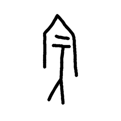

- source_zip_member: `Sub-character Images/cixqnyxp9v/ki5ox0jyx5/l5ejlx5m88.png`
- checksum_sha256: `b1cda6357f58135dea106d1ac0f6200383d90732517c8c17c376cef75545fe91`
- review_status: `needs_human_visual_review`
- caution: OBIMD subcharacter image is a source-marked review asset only; it is not a confirmed component form, component assignment, or decipherment conclusion.

## asset-017569

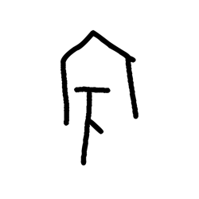

- source_zip_member: `Sub-character Images/cixqnyxp9v/ki5ox0jyx5/ljw81wmxqh.png`
- checksum_sha256: `3460184b56248a438942ced0256fb2591ca14bffe56b50ab37d06459ae34f72a`
- review_status: `needs_human_visual_review`
- caution: OBIMD subcharacter image is a source-marked review asset only; it is not a confirmed component form, component assignment, or decipherment conclusion.

## asset-017570

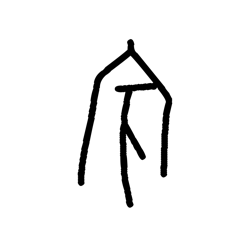

- source_zip_member: `Sub-character Images/cixqnyxp9v/ki5ox0jyx5/nk0oa18bcb.png`
- checksum_sha256: `ac7feb6acda62ae44d2d96fdc7ebf372cc59fa43a7748cbcb3f5dfda208663fc`
- review_status: `needs_human_visual_review`
- caution: OBIMD subcharacter image is a source-marked review asset only; it is not a confirmed component form, component assignment, or decipherment conclusion.

## asset-017571

- source_zip_member: `Sub-character Images/cixqnyxp9v/ki5ox0jyx5/nkg9ln0n8u.png`
- checksum_sha256: `01ce3374d465fde5dc8b70aea3a1fdefb3157871c79074f8b2c1b2a8bd183039`
- review_status: `needs_human_visual_review`
- caution: OBIMD subcharacter image is a source-marked review asset only; it is not a confirmed component form, component assignment, or decipherment conclusion.

## asset-017572

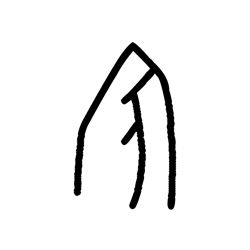

- source_zip_member: `Sub-character Images/cixqnyxp9v/ki5ox0jyx5/of72sbakc1.png`
- checksum_sha256: `bb0b614e499f807c2c187de6e6df08e8af4c937d981c0769d9da1b0ba008135d`
- review_status: `needs_human_visual_review`
- caution: OBIMD subcharacter image is a source-marked review asset only; it is not a confirmed component form, component assignment, or decipherment conclusion.

## asset-017573

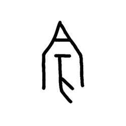

- source_zip_member: `Sub-character Images/cixqnyxp9v/ki5ox0jyx5/oojijtth3a.png`
- checksum_sha256: `623bcdf43cd00026ce1749e6a6311caf1015a690bdcdbf2576d8a0886738b2e8`
- review_status: `needs_human_visual_review`
- caution: OBIMD subcharacter image is a source-marked review asset only; it is not a confirmed component form, component assignment, or decipherment conclusion.

## asset-017574

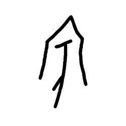

- source_zip_member: `Sub-character Images/cixqnyxp9v/ki5ox0jyx5/opf6bp1f2b.png`
- checksum_sha256: `fdb0f28369a3a7def356914af8d4d46690b11fc948b6a253af2f04dee1b9be2b`
- review_status: `needs_human_visual_review`
- caution: OBIMD subcharacter image is a source-marked review asset only; it is not a confirmed component form, component assignment, or decipherment conclusion.

## asset-017575

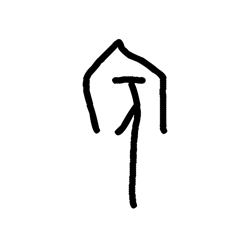

- source_zip_member: `Sub-character Images/cixqnyxp9v/ki5ox0jyx5/sbi4wnqjzo.png`
- checksum_sha256: `2d4dafb69056ec8fd173f269309ec52e1367ac41af9f80ee9d542c9d4f462549`
- review_status: `needs_human_visual_review`
- caution: OBIMD subcharacter image is a source-marked review asset only; it is not a confirmed component form, component assignment, or decipherment conclusion.

## asset-017576

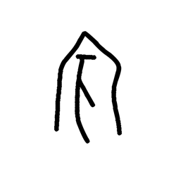

- source_zip_member: `Sub-character Images/cixqnyxp9v/ki5ox0jyx5/svjq4f2w74.png`
- checksum_sha256: `cc0a3b5d2ab367a529ac50b9400b25a3b92030cefe29e395ae531d5ee9e43d71`
- review_status: `needs_human_visual_review`
- caution: OBIMD subcharacter image is a source-marked review asset only; it is not a confirmed component form, component assignment, or decipherment conclusion.

## asset-017577

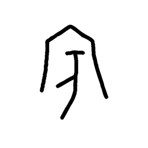

- source_zip_member: `Sub-character Images/cixqnyxp9v/ki5ox0jyx5/t242jj922f.png`
- checksum_sha256: `101687e923f917b272afe0f08dbff2dde8e4a52c68b7389bdbfdf19cfdbecc59`
- review_status: `needs_human_visual_review`
- caution: OBIMD subcharacter image is a source-marked review asset only; it is not a confirmed component form, component assignment, or decipherment conclusion.

## asset-017578

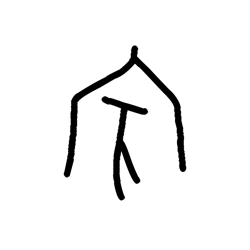

- source_zip_member: `Sub-character Images/cixqnyxp9v/ki5ox0jyx5/tq9mxj89sd.png`
- checksum_sha256: `f31a7c80253de0ad2fe8ca7e17d0419ce4c357a17f2f2a3de03bc1ef6d3d856f`
- review_status: `needs_human_visual_review`
- caution: OBIMD subcharacter image is a source-marked review asset only; it is not a confirmed component form, component assignment, or decipherment conclusion.

## asset-017579

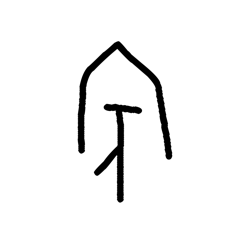

- source_zip_member: `Sub-character Images/cixqnyxp9v/ki5ox0jyx5/twong451pr.png`
- checksum_sha256: `a756c73d6f9a8ee45b0b70d40938a8f8df999f3a3809267954eaba782834c7c7`
- review_status: `needs_human_visual_review`
- caution: OBIMD subcharacter image is a source-marked review asset only; it is not a confirmed component form, component assignment, or decipherment conclusion.

## asset-017580

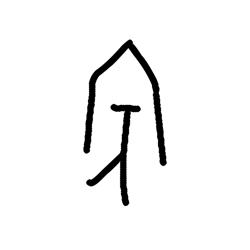

- source_zip_member: `Sub-character Images/cixqnyxp9v/ki5ox0jyx5/v9lzscidqu.png`
- checksum_sha256: `95cf9a535d7535434a0047cb8e05b2facabdc56c91a9453577abbc93f0d8da06`
- review_status: `needs_human_visual_review`
- caution: OBIMD subcharacter image is a source-marked review asset only; it is not a confirmed component form, component assignment, or decipherment conclusion.

## asset-017581

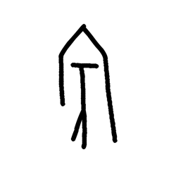

- source_zip_member: `Sub-character Images/cixqnyxp9v/ki5ox0jyx5/vnb3a9w8h7.png`
- checksum_sha256: `7660c83adc5dd39195da034df0ab37cd588fb9be560f477fad927b023241862c`
- review_status: `needs_human_visual_review`
- caution: OBIMD subcharacter image is a source-marked review asset only; it is not a confirmed component form, component assignment, or decipherment conclusion.

## asset-017582

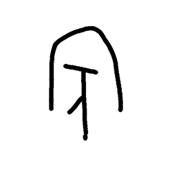

- source_zip_member: `Sub-character Images/cixqnyxp9v/ki5ox0jyx5/w3cdwc9rui.png`
- checksum_sha256: `45491870e49dfd55fdede2625dc9d89891e51f8a26866ebb0145913fa32a2824`
- review_status: `needs_human_visual_review`
- caution: OBIMD subcharacter image is a source-marked review asset only; it is not a confirmed component form, component assignment, or decipherment conclusion.

## asset-017583

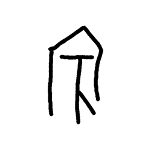

- source_zip_member: `Sub-character Images/cixqnyxp9v/ki5ox0jyx5/we81gt54kv.png`
- checksum_sha256: `5b3962ad91fa13c2e81de9c2601f942ab81e532f0dca42dd4fb91ed06f0b47ba`
- review_status: `needs_human_visual_review`
- caution: OBIMD subcharacter image is a source-marked review asset only; it is not a confirmed component form, component assignment, or decipherment conclusion.

## asset-017584

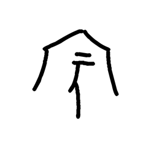

- source_zip_member: `Sub-character Images/cixqnyxp9v/ki5ox0jyx5/xan419tmzb.png`
- checksum_sha256: `c86361f1906ec4c94b7c0b6aa7dd7248cd9849cfa1457f5880b844c39111f1c2`
- review_status: `needs_human_visual_review`
- caution: OBIMD subcharacter image is a source-marked review asset only; it is not a confirmed component form, component assignment, or decipherment conclusion.

## asset-017585

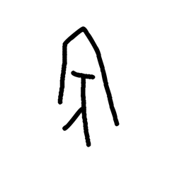

- source_zip_member: `Sub-character Images/cixqnyxp9v/ki5ox0jyx5/y50t77nsop.png`
- checksum_sha256: `74e46f53bec9840a483fcb5981cd7512b1bca8bfade2f8d46fb3d3585ed612e9`
- review_status: `needs_human_visual_review`
- caution: OBIMD subcharacter image is a source-marked review asset only; it is not a confirmed component form, component assignment, or decipherment conclusion.

## asset-017586

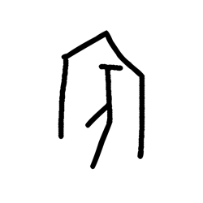

- source_zip_member: `Sub-character Images/cixqnyxp9v/ki5ox0jyx5/ybpio3rp3a.png`
- checksum_sha256: `068e3adc11f0a1167f95ffa4a227d9b732af685dc0a8de2b12e69f98009a1be0`
- review_status: `needs_human_visual_review`
- caution: OBIMD subcharacter image is a source-marked review asset only; it is not a confirmed component form, component assignment, or decipherment conclusion.
