# Component Visual Gallery / 构件图像查看: obs-comp-cand-001704

English:
This page displays OBIMD subcharacter PNG assets extracted into this concrete
corpus object directory for human review.

简体中文：
本页展示抽取到当前具体 corpus 对象目录内的 OBIMD subcharacter PNG 资料，供人工复核使用。

Boundary / 边界：
dataset image candidate only; not a confirmed component form, not a component
assignment, and not a decipherment claim.
- not a confirmed component form
- not a component assignment
- not a decipherment claim

## Concrete Questions To Check / 具体待查问题

- Which local image should be opened first?
- 应先打开哪一张本地构件图像？
- Which source zip member anchors this image?
- 哪一个 source zip member 能定位这张图像？
- Which near-shape or variant comparison is still missing?
- 还缺哪些近形或异体比较？
- Which character or inscription context should be checked next?
- 下一步应核对哪些单字或卜辞上下文？
- What evidence is missing before a component assignment?
- 正式构件归属前还缺哪些证据？

## asset-017620

- source_zip_member: `Sub-character Images/w4mg32kjp4/w4mg32kjp4/0pwzin7zqq.png`
- checksum_sha256: see `06_component-visual-index.csv`.
- review_status: `needs_human_visual_review`
- caution: source-marked review image only.

## asset-017621

- source_zip_member: `Sub-character Images/w4mg32kjp4/w4mg32kjp4/199ex2b68c.png`
- checksum_sha256: see `06_component-visual-index.csv`.
- review_status: `needs_human_visual_review`
- caution: source-marked review image only.

## asset-017622

- source_zip_member: `Sub-character Images/w4mg32kjp4/w4mg32kjp4/1euxfbdp59.png`
- checksum_sha256: see `06_component-visual-index.csv`.
- review_status: `needs_human_visual_review`
- caution: source-marked review image only.

## asset-017623

- source_zip_member: `Sub-character Images/w4mg32kjp4/w4mg32kjp4/1mjth1eflz.png`
- checksum_sha256: see `06_component-visual-index.csv`.
- review_status: `needs_human_visual_review`
- caution: source-marked review image only.

## asset-017624

- source_zip_member: `Sub-character Images/w4mg32kjp4/w4mg32kjp4/1ocuzeplyv.png`
- checksum_sha256: see `06_component-visual-index.csv`.
- review_status: `needs_human_visual_review`
- caution: source-marked review image only.

## asset-017625

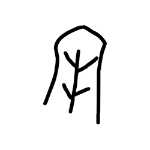

- source_zip_member: `Sub-character Images/w4mg32kjp4/w4mg32kjp4/1s09wf2n76.png`
- checksum_sha256: see `06_component-visual-index.csv`.
- review_status: `needs_human_visual_review`
- caution: source-marked review image only.

## asset-017626

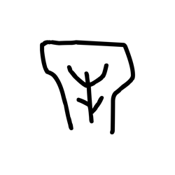

- source_zip_member: `Sub-character Images/w4mg32kjp4/w4mg32kjp4/264nhv1qof.png`
- checksum_sha256: see `06_component-visual-index.csv`.
- review_status: `needs_human_visual_review`
- caution: source-marked review image only.

## asset-017627

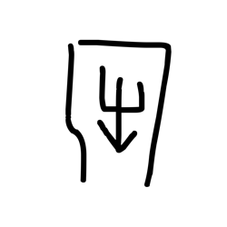

- source_zip_member: `Sub-character Images/w4mg32kjp4/w4mg32kjp4/2cs278pc6d.png`
- checksum_sha256: see `06_component-visual-index.csv`.
- review_status: `needs_human_visual_review`
- caution: source-marked review image only.

## asset-017628

- source_zip_member: `Sub-character Images/w4mg32kjp4/w4mg32kjp4/2y9wvqw5tt.png`
- checksum_sha256: see `06_component-visual-index.csv`.
- review_status: `needs_human_visual_review`
- caution: source-marked review image only.

## asset-017629

- source_zip_member: `Sub-character Images/w4mg32kjp4/w4mg32kjp4/2znw78bxj5.png`
- checksum_sha256: see `06_component-visual-index.csv`.
- review_status: `needs_human_visual_review`
- caution: source-marked review image only.

## asset-017630

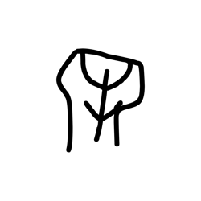

- source_zip_member: `Sub-character Images/w4mg32kjp4/w4mg32kjp4/33mcegli4x.png`
- checksum_sha256: see `06_component-visual-index.csv`.
- review_status: `needs_human_visual_review`
- caution: source-marked review image only.

## asset-017631

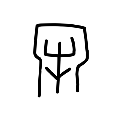

- source_zip_member: `Sub-character Images/w4mg32kjp4/w4mg32kjp4/38cmqi13d6.png`
- checksum_sha256: see `06_component-visual-index.csv`.
- review_status: `needs_human_visual_review`
- caution: source-marked review image only.

## asset-017632

- source_zip_member: `Sub-character Images/w4mg32kjp4/w4mg32kjp4/3hmfxta1wm.png`
- checksum_sha256: see `06_component-visual-index.csv`.
- review_status: `needs_human_visual_review`
- caution: source-marked review image only.

## asset-017633

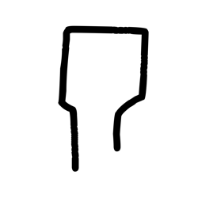

- source_zip_member: `Sub-character Images/w4mg32kjp4/w4mg32kjp4/3z6z0sv4bo.png`
- checksum_sha256: see `06_component-visual-index.csv`.
- review_status: `needs_human_visual_review`
- caution: source-marked review image only.

## asset-017634

- source_zip_member: `Sub-character Images/w4mg32kjp4/w4mg32kjp4/3zc7gafz2l.png`
- checksum_sha256: see `06_component-visual-index.csv`.
- review_status: `needs_human_visual_review`
- caution: source-marked review image only.

## asset-017635

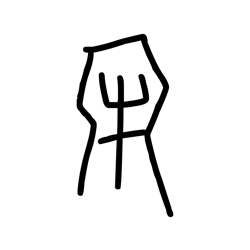

- source_zip_member: `Sub-character Images/w4mg32kjp4/w4mg32kjp4/46js14kpo1.png`
- checksum_sha256: see `06_component-visual-index.csv`.
- review_status: `needs_human_visual_review`
- caution: source-marked review image only.

## asset-017636

- source_zip_member: `Sub-character Images/w4mg32kjp4/w4mg32kjp4/4e9dlx6d3n.png`
- checksum_sha256: see `06_component-visual-index.csv`.
- review_status: `needs_human_visual_review`
- caution: source-marked review image only.

## asset-017637

- source_zip_member: `Sub-character Images/w4mg32kjp4/w4mg32kjp4/4m4bkn7214.png`
- checksum_sha256: see `06_component-visual-index.csv`.
- review_status: `needs_human_visual_review`
- caution: source-marked review image only.

## asset-017638

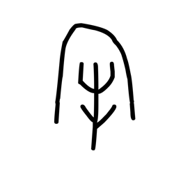

- source_zip_member: `Sub-character Images/w4mg32kjp4/w4mg32kjp4/4x4cnyxuwj.png`
- checksum_sha256: see `06_component-visual-index.csv`.
- review_status: `needs_human_visual_review`
- caution: source-marked review image only.

## asset-017639

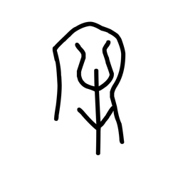

- source_zip_member: `Sub-character Images/w4mg32kjp4/w4mg32kjp4/5e16gtu1q8.png`
- checksum_sha256: see `06_component-visual-index.csv`.
- review_status: `needs_human_visual_review`
- caution: source-marked review image only.

## asset-017640

- source_zip_member: `Sub-character Images/w4mg32kjp4/w4mg32kjp4/6c9omx4vke.png`
- checksum_sha256: see `06_component-visual-index.csv`.
- review_status: `needs_human_visual_review`
- caution: source-marked review image only.

## asset-017641

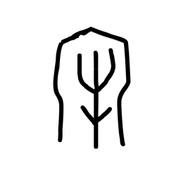

- source_zip_member: `Sub-character Images/w4mg32kjp4/w4mg32kjp4/72wzwjjjsj.png`
- checksum_sha256: see `06_component-visual-index.csv`.
- review_status: `needs_human_visual_review`
- caution: source-marked review image only.

## asset-017642

- source_zip_member: `Sub-character Images/w4mg32kjp4/w4mg32kjp4/7gure6z41j.png`
- checksum_sha256: see `06_component-visual-index.csv`.
- review_status: `needs_human_visual_review`
- caution: source-marked review image only.

## asset-017643

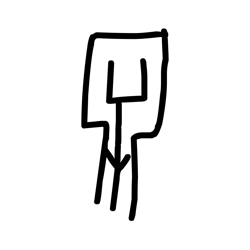

- source_zip_member: `Sub-character Images/w4mg32kjp4/w4mg32kjp4/7jt7jbe0zu.png`
- checksum_sha256: see `06_component-visual-index.csv`.
- review_status: `needs_human_visual_review`
- caution: source-marked review image only.

## asset-017644

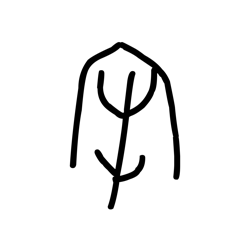

- source_zip_member: `Sub-character Images/w4mg32kjp4/w4mg32kjp4/7motprpgnm.png`
- checksum_sha256: see `06_component-visual-index.csv`.
- review_status: `needs_human_visual_review`
- caution: source-marked review image only.

## asset-017645

- source_zip_member: `Sub-character Images/w4mg32kjp4/w4mg32kjp4/7tdajstifk.png`
- checksum_sha256: see `06_component-visual-index.csv`.
- review_status: `needs_human_visual_review`
- caution: source-marked review image only.

## asset-017646

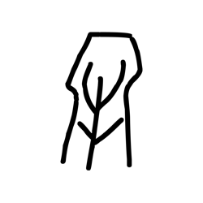

- source_zip_member: `Sub-character Images/w4mg32kjp4/w4mg32kjp4/7uil2nsi41.png`
- checksum_sha256: see `06_component-visual-index.csv`.
- review_status: `needs_human_visual_review`
- caution: source-marked review image only.

## asset-017647

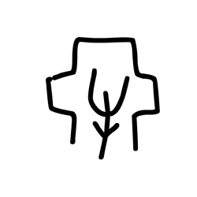

- source_zip_member: `Sub-character Images/w4mg32kjp4/w4mg32kjp4/8yum3eh1fi.png`
- checksum_sha256: see `06_component-visual-index.csv`.
- review_status: `needs_human_visual_review`
- caution: source-marked review image only.

## asset-017648

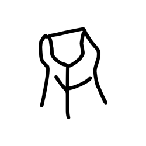

- source_zip_member: `Sub-character Images/w4mg32kjp4/w4mg32kjp4/95y7pm8fhc.png`
- checksum_sha256: see `06_component-visual-index.csv`.
- review_status: `needs_human_visual_review`
- caution: source-marked review image only.

## asset-017649

- source_zip_member: `Sub-character Images/w4mg32kjp4/w4mg32kjp4/9qcjxhagz3.png`
- checksum_sha256: see `06_component-visual-index.csv`.
- review_status: `needs_human_visual_review`
- caution: source-marked review image only.

## asset-017650

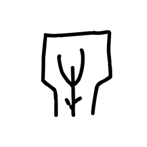

- source_zip_member: `Sub-character Images/w4mg32kjp4/w4mg32kjp4/9un4om3e4v.png`
- checksum_sha256: see `06_component-visual-index.csv`.
- review_status: `needs_human_visual_review`
- caution: source-marked review image only.

## asset-017651

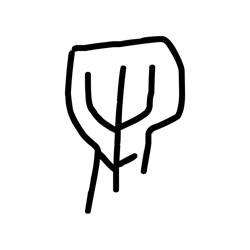

- source_zip_member: `Sub-character Images/w4mg32kjp4/w4mg32kjp4/agfs9578u8.png`
- checksum_sha256: see `06_component-visual-index.csv`.
- review_status: `needs_human_visual_review`
- caution: source-marked review image only.

## asset-017652

- source_zip_member: `Sub-character Images/w4mg32kjp4/w4mg32kjp4/amjaaxwhjj.png`
- checksum_sha256: see `06_component-visual-index.csv`.
- review_status: `needs_human_visual_review`
- caution: source-marked review image only.

## asset-017653

- source_zip_member: `Sub-character Images/w4mg32kjp4/w4mg32kjp4/amywp4xrwl.png`
- checksum_sha256: see `06_component-visual-index.csv`.
- review_status: `needs_human_visual_review`
- caution: source-marked review image only.

## asset-017654

- source_zip_member: `Sub-character Images/w4mg32kjp4/w4mg32kjp4/b34k6f7onw.png`
- checksum_sha256: see `06_component-visual-index.csv`.
- review_status: `needs_human_visual_review`
- caution: source-marked review image only.

## asset-017655

- source_zip_member: `Sub-character Images/w4mg32kjp4/w4mg32kjp4/boig6bnv0u.png`
- checksum_sha256: see `06_component-visual-index.csv`.
- review_status: `needs_human_visual_review`
- caution: source-marked review image only.

## asset-017656

- source_zip_member: `Sub-character Images/w4mg32kjp4/w4mg32kjp4/bpwghaw9bc.png`
- checksum_sha256: see `06_component-visual-index.csv`.
- review_status: `needs_human_visual_review`
- caution: source-marked review image only.

## asset-017657

- source_zip_member: `Sub-character Images/w4mg32kjp4/w4mg32kjp4/bwh7j9kctf.png`
- checksum_sha256: see `06_component-visual-index.csv`.
- review_status: `needs_human_visual_review`
- caution: source-marked review image only.

## asset-017658

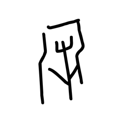

- source_zip_member: `Sub-character Images/w4mg32kjp4/w4mg32kjp4/byapn7ky1x.png`
- checksum_sha256: see `06_component-visual-index.csv`.
- review_status: `needs_human_visual_review`
- caution: source-marked review image only.

## asset-017659

- source_zip_member: `Sub-character Images/w4mg32kjp4/w4mg32kjp4/ce8jgtrdw4.png`
- checksum_sha256: see `06_component-visual-index.csv`.
- review_status: `needs_human_visual_review`
- caution: source-marked review image only.

## asset-017660

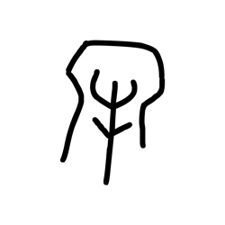

- source_zip_member: `Sub-character Images/w4mg32kjp4/w4mg32kjp4/ck88zhe7wf.png`
- checksum_sha256: see `06_component-visual-index.csv`.
- review_status: `needs_human_visual_review`
- caution: source-marked review image only.

## asset-017661

- source_zip_member: `Sub-character Images/w4mg32kjp4/w4mg32kjp4/cmo1c2566r.png`
- checksum_sha256: see `06_component-visual-index.csv`.
- review_status: `needs_human_visual_review`
- caution: source-marked review image only.

## asset-017662

- source_zip_member: `Sub-character Images/w4mg32kjp4/w4mg32kjp4/cttz36iz9m.png`
- checksum_sha256: see `06_component-visual-index.csv`.
- review_status: `needs_human_visual_review`
- caution: source-marked review image only.

## asset-017663

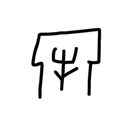

- source_zip_member: `Sub-character Images/w4mg32kjp4/w4mg32kjp4/cv85debrn1.png`
- checksum_sha256: see `06_component-visual-index.csv`.
- review_status: `needs_human_visual_review`
- caution: source-marked review image only.

## asset-017664

- source_zip_member: `Sub-character Images/w4mg32kjp4/w4mg32kjp4/d1f78wmspr.png`
- checksum_sha256: see `06_component-visual-index.csv`.
- review_status: `needs_human_visual_review`
- caution: source-marked review image only.

## asset-017665

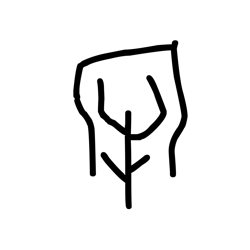

- source_zip_member: `Sub-character Images/w4mg32kjp4/w4mg32kjp4/dd0ak2jqqb.png`
- checksum_sha256: see `06_component-visual-index.csv`.
- review_status: `needs_human_visual_review`
- caution: source-marked review image only.

## asset-017666

- source_zip_member: `Sub-character Images/w4mg32kjp4/w4mg32kjp4/dkmtcu6wcu.png`
- checksum_sha256: see `06_component-visual-index.csv`.
- review_status: `needs_human_visual_review`
- caution: source-marked review image only.

## asset-017667

- source_zip_member: `Sub-character Images/w4mg32kjp4/w4mg32kjp4/e35vs3scx1.png`
- checksum_sha256: see `06_component-visual-index.csv`.
- review_status: `needs_human_visual_review`
- caution: source-marked review image only.

## asset-017668

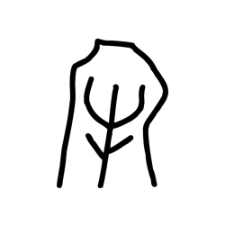

- source_zip_member: `Sub-character Images/w4mg32kjp4/w4mg32kjp4/e5bwutjmfs.png`
- checksum_sha256: see `06_component-visual-index.csv`.
- review_status: `needs_human_visual_review`
- caution: source-marked review image only.

## asset-017669

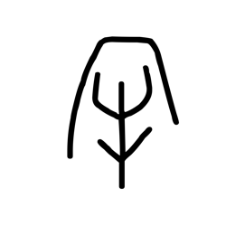

- source_zip_member: `Sub-character Images/w4mg32kjp4/w4mg32kjp4/eagwim74y5.png`
- checksum_sha256: see `06_component-visual-index.csv`.
- review_status: `needs_human_visual_review`
- caution: source-marked review image only.

## asset-017670

- source_zip_member: `Sub-character Images/w4mg32kjp4/w4mg32kjp4/eo4osdghdi.png`
- checksum_sha256: see `06_component-visual-index.csv`.
- review_status: `needs_human_visual_review`
- caution: source-marked review image only.

## asset-017671

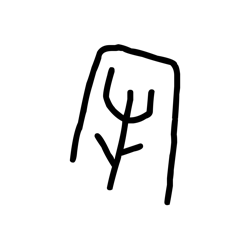

- source_zip_member: `Sub-character Images/w4mg32kjp4/w4mg32kjp4/fpke7tz2zh.png`
- checksum_sha256: see `06_component-visual-index.csv`.
- review_status: `needs_human_visual_review`
- caution: source-marked review image only.

## asset-017672

- source_zip_member: `Sub-character Images/w4mg32kjp4/w4mg32kjp4/fuiblxuglw.png`
- checksum_sha256: see `06_component-visual-index.csv`.
- review_status: `needs_human_visual_review`
- caution: source-marked review image only.

## asset-017673

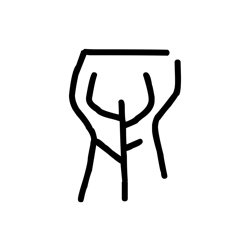

- source_zip_member: `Sub-character Images/w4mg32kjp4/w4mg32kjp4/g0j1qwgule.png`
- checksum_sha256: see `06_component-visual-index.csv`.
- review_status: `needs_human_visual_review`
- caution: source-marked review image only.

## asset-017674

- source_zip_member: `Sub-character Images/w4mg32kjp4/w4mg32kjp4/g1ndmb0cbc.png`
- checksum_sha256: see `06_component-visual-index.csv`.
- review_status: `needs_human_visual_review`
- caution: source-marked review image only.

## asset-017675

- source_zip_member: `Sub-character Images/w4mg32kjp4/w4mg32kjp4/gl5ka6urrv.png`
- checksum_sha256: see `06_component-visual-index.csv`.
- review_status: `needs_human_visual_review`
- caution: source-marked review image only.

## asset-017676

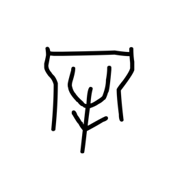

- source_zip_member: `Sub-character Images/w4mg32kjp4/w4mg32kjp4/gs69w8nlaf.png`
- checksum_sha256: see `06_component-visual-index.csv`.
- review_status: `needs_human_visual_review`
- caution: source-marked review image only.

## asset-017677

- source_zip_member: `Sub-character Images/w4mg32kjp4/w4mg32kjp4/gv2ias04gb.png`
- checksum_sha256: see `06_component-visual-index.csv`.
- review_status: `needs_human_visual_review`
- caution: source-marked review image only.

## asset-017678

- source_zip_member: `Sub-character Images/w4mg32kjp4/w4mg32kjp4/h0gdx45mrr.png`
- checksum_sha256: see `06_component-visual-index.csv`.
- review_status: `needs_human_visual_review`
- caution: source-marked review image only.

## asset-017679

- source_zip_member: `Sub-character Images/w4mg32kjp4/w4mg32kjp4/h22stdn7kq.png`
- checksum_sha256: see `06_component-visual-index.csv`.
- review_status: `needs_human_visual_review`
- caution: source-marked review image only.

## asset-017680

- source_zip_member: `Sub-character Images/w4mg32kjp4/w4mg32kjp4/hm1la7oraj.png`
- checksum_sha256: see `06_component-visual-index.csv`.
- review_status: `needs_human_visual_review`
- caution: source-marked review image only.

## asset-017681

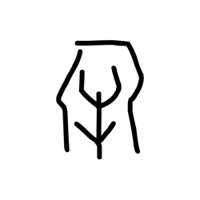

- source_zip_member: `Sub-character Images/w4mg32kjp4/w4mg32kjp4/hzcugj4jue.png`
- checksum_sha256: see `06_component-visual-index.csv`.
- review_status: `needs_human_visual_review`
- caution: source-marked review image only.

## asset-017682

- source_zip_member: `Sub-character Images/w4mg32kjp4/w4mg32kjp4/i2qmcwaz3p.png`
- checksum_sha256: see `06_component-visual-index.csv`.
- review_status: `needs_human_visual_review`
- caution: source-marked review image only.

## asset-017683

- source_zip_member: `Sub-character Images/w4mg32kjp4/w4mg32kjp4/jcoir1x3bp.png`
- checksum_sha256: see `06_component-visual-index.csv`.
- review_status: `needs_human_visual_review`
- caution: source-marked review image only.

## asset-017684

- source_zip_member: `Sub-character Images/w4mg32kjp4/w4mg32kjp4/jr7c03febo.png`
- checksum_sha256: see `06_component-visual-index.csv`.
- review_status: `needs_human_visual_review`
- caution: source-marked review image only.

## asset-017685

- source_zip_member: `Sub-character Images/w4mg32kjp4/w4mg32kjp4/k1ouukevn7.png`
- checksum_sha256: see `06_component-visual-index.csv`.
- review_status: `needs_human_visual_review`
- caution: source-marked review image only.

## asset-017686

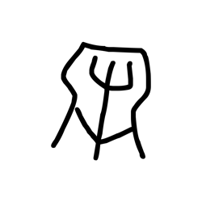

- source_zip_member: `Sub-character Images/w4mg32kjp4/w4mg32kjp4/k4xw8m84mu.png`
- checksum_sha256: see `06_component-visual-index.csv`.
- review_status: `needs_human_visual_review`
- caution: source-marked review image only.

## asset-017687

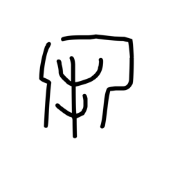

- source_zip_member: `Sub-character Images/w4mg32kjp4/w4mg32kjp4/l7munvkm77.png`
- checksum_sha256: see `06_component-visual-index.csv`.
- review_status: `needs_human_visual_review`
- caution: source-marked review image only.

## asset-017688

- source_zip_member: `Sub-character Images/w4mg32kjp4/w4mg32kjp4/lnm7a5sdel.png`
- checksum_sha256: see `06_component-visual-index.csv`.
- review_status: `needs_human_visual_review`
- caution: source-marked review image only.

## asset-017689

- source_zip_member: `Sub-character Images/w4mg32kjp4/w4mg32kjp4/m55u5zcjf5.png`
- checksum_sha256: see `06_component-visual-index.csv`.
- review_status: `needs_human_visual_review`
- caution: source-marked review image only.

## asset-017690

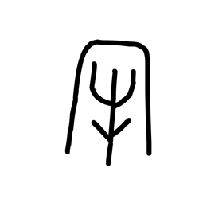

- source_zip_member: `Sub-character Images/w4mg32kjp4/w4mg32kjp4/mhrgltrcox.png`
- checksum_sha256: see `06_component-visual-index.csv`.
- review_status: `needs_human_visual_review`
- caution: source-marked review image only.

## asset-017691

- source_zip_member: `Sub-character Images/w4mg32kjp4/w4mg32kjp4/mus67rtm5l.png`
- checksum_sha256: see `06_component-visual-index.csv`.
- review_status: `needs_human_visual_review`
- caution: source-marked review image only.

## asset-017692

- source_zip_member: `Sub-character Images/w4mg32kjp4/w4mg32kjp4/nmz2xyyex9.png`
- checksum_sha256: see `06_component-visual-index.csv`.
- review_status: `needs_human_visual_review`
- caution: source-marked review image only.

## asset-017693

- source_zip_member: `Sub-character Images/w4mg32kjp4/w4mg32kjp4/oelx19gem7.png`
- checksum_sha256: see `06_component-visual-index.csv`.
- review_status: `needs_human_visual_review`
- caution: source-marked review image only.

## asset-017694

- source_zip_member: `Sub-character Images/w4mg32kjp4/w4mg32kjp4/opzqrmfh8t.png`
- checksum_sha256: see `06_component-visual-index.csv`.
- review_status: `needs_human_visual_review`
- caution: source-marked review image only.

## asset-017695

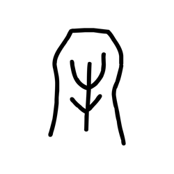

- source_zip_member: `Sub-character Images/w4mg32kjp4/w4mg32kjp4/ot0ep4g528.png`
- checksum_sha256: see `06_component-visual-index.csv`.
- review_status: `needs_human_visual_review`
- caution: source-marked review image only.

## asset-017696

- source_zip_member: `Sub-character Images/w4mg32kjp4/w4mg32kjp4/p76diyyevq.png`
- checksum_sha256: see `06_component-visual-index.csv`.
- review_status: `needs_human_visual_review`
- caution: source-marked review image only.

## asset-017697

- source_zip_member: `Sub-character Images/w4mg32kjp4/w4mg32kjp4/pfinqbjcdm.png`
- checksum_sha256: see `06_component-visual-index.csv`.
- review_status: `needs_human_visual_review`
- caution: source-marked review image only.

## asset-017698

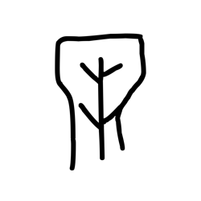

- source_zip_member: `Sub-character Images/w4mg32kjp4/w4mg32kjp4/pq6ljz33e3.png`
- checksum_sha256: see `06_component-visual-index.csv`.
- review_status: `needs_human_visual_review`
- caution: source-marked review image only.

## asset-017699

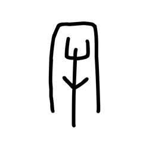

- source_zip_member: `Sub-character Images/w4mg32kjp4/w4mg32kjp4/pv46ji91fq.png`
- checksum_sha256: see `06_component-visual-index.csv`.
- review_status: `needs_human_visual_review`
- caution: source-marked review image only.

## asset-017700

- source_zip_member: `Sub-character Images/w4mg32kjp4/w4mg32kjp4/q4f05du1ia.png`
- checksum_sha256: see `06_component-visual-index.csv`.
- review_status: `needs_human_visual_review`
- caution: source-marked review image only.

## asset-017701

- source_zip_member: `Sub-character Images/w4mg32kjp4/w4mg32kjp4/qbax3ru4dg.png`
- checksum_sha256: see `06_component-visual-index.csv`.
- review_status: `needs_human_visual_review`
- caution: source-marked review image only.

## asset-017702

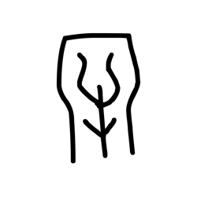

- source_zip_member: `Sub-character Images/w4mg32kjp4/w4mg32kjp4/qe6crnrjzq.png`
- checksum_sha256: see `06_component-visual-index.csv`.
- review_status: `needs_human_visual_review`
- caution: source-marked review image only.

## asset-017703

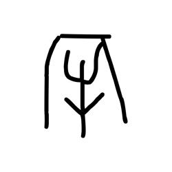

- source_zip_member: `Sub-character Images/w4mg32kjp4/w4mg32kjp4/qejur3fsbr.png`
- checksum_sha256: see `06_component-visual-index.csv`.
- review_status: `needs_human_visual_review`
- caution: source-marked review image only.

## asset-017704

- source_zip_member: `Sub-character Images/w4mg32kjp4/w4mg32kjp4/qyvl4w0bx9.png`
- checksum_sha256: see `06_component-visual-index.csv`.
- review_status: `needs_human_visual_review`
- caution: source-marked review image only.

## asset-017705

- source_zip_member: `Sub-character Images/w4mg32kjp4/w4mg32kjp4/rarl2tprqa.png`
- checksum_sha256: see `06_component-visual-index.csv`.
- review_status: `needs_human_visual_review`
- caution: source-marked review image only.

## asset-017706

- source_zip_member: `Sub-character Images/w4mg32kjp4/w4mg32kjp4/rrbbrp5nax.png`
- checksum_sha256: see `06_component-visual-index.csv`.
- review_status: `needs_human_visual_review`
- caution: source-marked review image only.

## asset-017707

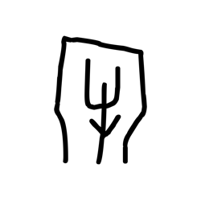

- source_zip_member: `Sub-character Images/w4mg32kjp4/w4mg32kjp4/ru4dkgs65p.png`
- checksum_sha256: see `06_component-visual-index.csv`.
- review_status: `needs_human_visual_review`
- caution: source-marked review image only.

## asset-017708

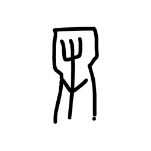

- source_zip_member: `Sub-character Images/w4mg32kjp4/w4mg32kjp4/rz015exkrr.png`
- checksum_sha256: see `06_component-visual-index.csv`.
- review_status: `needs_human_visual_review`
- caution: source-marked review image only.

## asset-017709

- source_zip_member: `Sub-character Images/w4mg32kjp4/w4mg32kjp4/s15ienkf2h.png`
- checksum_sha256: see `06_component-visual-index.csv`.
- review_status: `needs_human_visual_review`
- caution: source-marked review image only.

## asset-017710

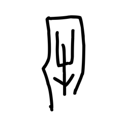

- source_zip_member: `Sub-character Images/w4mg32kjp4/w4mg32kjp4/s47p9zjebe.png`
- checksum_sha256: see `06_component-visual-index.csv`.
- review_status: `needs_human_visual_review`
- caution: source-marked review image only.

## asset-017711

- source_zip_member: `Sub-character Images/w4mg32kjp4/w4mg32kjp4/scy38k7z59.png`
- checksum_sha256: see `06_component-visual-index.csv`.
- review_status: `needs_human_visual_review`
- caution: source-marked review image only.

## asset-017712

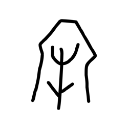

- source_zip_member: `Sub-character Images/w4mg32kjp4/w4mg32kjp4/sdva0udnpz.png`
- checksum_sha256: see `06_component-visual-index.csv`.
- review_status: `needs_human_visual_review`
- caution: source-marked review image only.

## asset-017713

- source_zip_member: `Sub-character Images/w4mg32kjp4/w4mg32kjp4/st7okray5y.png`
- checksum_sha256: see `06_component-visual-index.csv`.
- review_status: `needs_human_visual_review`
- caution: source-marked review image only.

## asset-017714

- source_zip_member: `Sub-character Images/w4mg32kjp4/w4mg32kjp4/t1u05ssix7.png`
- checksum_sha256: see `06_component-visual-index.csv`.
- review_status: `needs_human_visual_review`
- caution: source-marked review image only.

## asset-017715

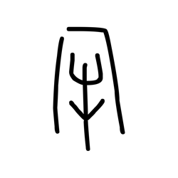

- source_zip_member: `Sub-character Images/w4mg32kjp4/w4mg32kjp4/t6dmk209ok.png`
- checksum_sha256: see `06_component-visual-index.csv`.
- review_status: `needs_human_visual_review`
- caution: source-marked review image only.

## asset-017716

- source_zip_member: `Sub-character Images/w4mg32kjp4/w4mg32kjp4/tai5rd46tr.png`
- checksum_sha256: see `06_component-visual-index.csv`.
- review_status: `needs_human_visual_review`
- caution: source-marked review image only.

## asset-017717

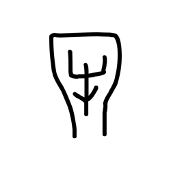

- source_zip_member: `Sub-character Images/w4mg32kjp4/w4mg32kjp4/u2zl7fsx7q.png`
- checksum_sha256: see `06_component-visual-index.csv`.
- review_status: `needs_human_visual_review`
- caution: source-marked review image only.

## asset-017718

- source_zip_member: `Sub-character Images/w4mg32kjp4/w4mg32kjp4/u4kmbbr5e5.png`
- checksum_sha256: see `06_component-visual-index.csv`.
- review_status: `needs_human_visual_review`
- caution: source-marked review image only.

## asset-017719

- source_zip_member: `Sub-character Images/w4mg32kjp4/w4mg32kjp4/uf05n4011i.png`
- checksum_sha256: see `06_component-visual-index.csv`.
- review_status: `needs_human_visual_review`
- caution: source-marked review image only.

## asset-017720

- source_zip_member: `Sub-character Images/w4mg32kjp4/w4mg32kjp4/uiw233pavo.png`
- checksum_sha256: see `06_component-visual-index.csv`.
- review_status: `needs_human_visual_review`
- caution: source-marked review image only.

## asset-017721

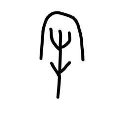

- source_zip_member: `Sub-character Images/w4mg32kjp4/w4mg32kjp4/uow6g5j5mi.png`
- checksum_sha256: see `06_component-visual-index.csv`.
- review_status: `needs_human_visual_review`
- caution: source-marked review image only.

## asset-017722

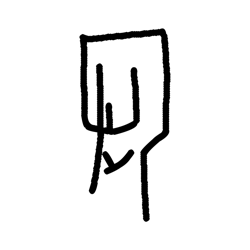

- source_zip_member: `Sub-character Images/w4mg32kjp4/w4mg32kjp4/uqf5frbcll.png`
- checksum_sha256: see `06_component-visual-index.csv`.
- review_status: `needs_human_visual_review`
- caution: source-marked review image only.

## asset-017723

- source_zip_member: `Sub-character Images/w4mg32kjp4/w4mg32kjp4/urou1v5epi.png`
- checksum_sha256: see `06_component-visual-index.csv`.
- review_status: `needs_human_visual_review`
- caution: source-marked review image only.

## asset-017724

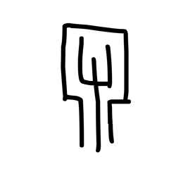

- source_zip_member: `Sub-character Images/w4mg32kjp4/w4mg32kjp4/v02yotldhx.png`
- checksum_sha256: see `06_component-visual-index.csv`.
- review_status: `needs_human_visual_review`
- caution: source-marked review image only.

## asset-017725

- source_zip_member: `Sub-character Images/w4mg32kjp4/w4mg32kjp4/vflqsreslv.png`
- checksum_sha256: see `06_component-visual-index.csv`.
- review_status: `needs_human_visual_review`
- caution: source-marked review image only.

## asset-017726

- source_zip_member: `Sub-character Images/w4mg32kjp4/w4mg32kjp4/vk27z6fgv3.png`
- checksum_sha256: see `06_component-visual-index.csv`.
- review_status: `needs_human_visual_review`
- caution: source-marked review image only.

## asset-017727

- source_zip_member: `Sub-character Images/w4mg32kjp4/w4mg32kjp4/vq0h3zp28x.png`
- checksum_sha256: see `06_component-visual-index.csv`.
- review_status: `needs_human_visual_review`
- caution: source-marked review image only.

## asset-017728

- source_zip_member: `Sub-character Images/w4mg32kjp4/w4mg32kjp4/w4mg32kjp4.png`
- checksum_sha256: see `06_component-visual-index.csv`.
- review_status: `needs_human_visual_review`
- caution: source-marked review image only.

## asset-017729

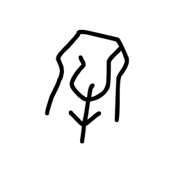

- source_zip_member: `Sub-character Images/w4mg32kjp4/w4mg32kjp4/w9mbzmc9i0.png`
- checksum_sha256: see `06_component-visual-index.csv`.
- review_status: `needs_human_visual_review`
- caution: source-marked review image only.

## asset-017730

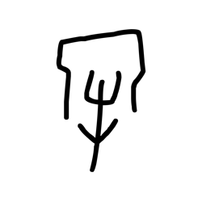

- source_zip_member: `Sub-character Images/w4mg32kjp4/w4mg32kjp4/wa5fh7kg9y.png`
- checksum_sha256: see `06_component-visual-index.csv`.
- review_status: `needs_human_visual_review`
- caution: source-marked review image only.

## asset-017731

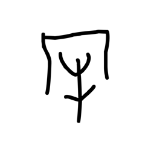

- source_zip_member: `Sub-character Images/w4mg32kjp4/w4mg32kjp4/wkzkioa89a.png`
- checksum_sha256: see `06_component-visual-index.csv`.
- review_status: `needs_human_visual_review`
- caution: source-marked review image only.

## asset-017732

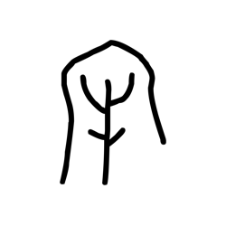

- source_zip_member: `Sub-character Images/w4mg32kjp4/w4mg32kjp4/x3sx4kscu1.png`
- checksum_sha256: see `06_component-visual-index.csv`.
- review_status: `needs_human_visual_review`
- caution: source-marked review image only.

## asset-017733

- source_zip_member: `Sub-character Images/w4mg32kjp4/w4mg32kjp4/x3xll6g5fz.png`
- checksum_sha256: see `06_component-visual-index.csv`.
- review_status: `needs_human_visual_review`
- caution: source-marked review image only.

## asset-017734

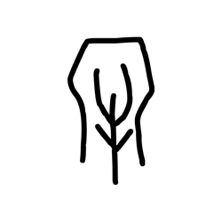

- source_zip_member: `Sub-character Images/w4mg32kjp4/w4mg32kjp4/xdafs2y6md.png`
- checksum_sha256: see `06_component-visual-index.csv`.
- review_status: `needs_human_visual_review`
- caution: source-marked review image only.

## asset-017735

- source_zip_member: `Sub-character Images/w4mg32kjp4/w4mg32kjp4/y0yyjinyn7.png`
- checksum_sha256: see `06_component-visual-index.csv`.
- review_status: `needs_human_visual_review`
- caution: source-marked review image only.

## asset-017736

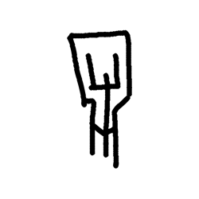

- source_zip_member: `Sub-character Images/w4mg32kjp4/w4mg32kjp4/yehfepnlkz.png`
- checksum_sha256: see `06_component-visual-index.csv`.
- review_status: `needs_human_visual_review`
- caution: source-marked review image only.

## asset-017737

- source_zip_member: `Sub-character Images/w4mg32kjp4/w4mg32kjp4/ygnd3fjs9s.png`
- checksum_sha256: see `06_component-visual-index.csv`.
- review_status: `needs_human_visual_review`
- caution: source-marked review image only.

## asset-017738

- source_zip_member: `Sub-character Images/w4mg32kjp4/w4mg32kjp4/yjwb1bdoqi.png`
- checksum_sha256: see `06_component-visual-index.csv`.
- review_status: `needs_human_visual_review`
- caution: source-marked review image only.

## asset-017739

- source_zip_member: `Sub-character Images/w4mg32kjp4/w4mg32kjp4/ys0tx2l6nl.png`
- checksum_sha256: see `06_component-visual-index.csv`.
- review_status: `needs_human_visual_review`
- caution: source-marked review image only.

## asset-017740

- source_zip_member: `Sub-character Images/w4mg32kjp4/w4mg32kjp4/yujlqelmyx.png`
- checksum_sha256: see `06_component-visual-index.csv`.
- review_status: `needs_human_visual_review`
- caution: source-marked review image only.

## asset-017741

- source_zip_member: `Sub-character Images/w4mg32kjp4/w4mg32kjp4/zclzcx3ost.png`
- checksum_sha256: see `06_component-visual-index.csv`.
- review_status: `needs_human_visual_review`
- caution: source-marked review image only.

## asset-017742

- source_zip_member: `Sub-character Images/w4mg32kjp4/w4mg32kjp4/zgdb2x17yd.png`
- checksum_sha256: see `06_component-visual-index.csv`.
- review_status: `needs_human_visual_review`
- caution: source-marked review image only.

## asset-017743

- source_zip_member: `Sub-character Images/w4mg32kjp4/w4mg32kjp4/zn5y4sck4e.png`
- checksum_sha256: see `06_component-visual-index.csv`.
- review_status: `needs_human_visual_review`
- caution: source-marked review image only.

## asset-017744

- source_zip_member: `Sub-character Images/w4mg32kjp4/w4mg32kjp4/ztt0pje3nd.png`
- checksum_sha256: see `06_component-visual-index.csv`.
- review_status: `needs_human_visual_review`
- caution: source-marked review image only.

## asset-017745

- source_zip_member: `Sub-character Images/w4mg32kjp4/w4mg32kjp4/zvab75vtgm.png`
- checksum_sha256: see `06_component-visual-index.csv`.
- review_status: `needs_human_visual_review`
- caution: source-marked review image only.

## asset-017746

- source_zip_member: `Sub-character Images/w4mg32kjp4/w4mg32kjp4/zvth3cwmpr.png`
- checksum_sha256: see `06_component-visual-index.csv`.
- review_status: `needs_human_visual_review`
- caution: source-marked review image only.
