# Component Visual Gallery / 构件图像查看: obs-comp-cand-001706

English:
This page displays OBIMD subcharacter PNG assets extracted into this concrete
corpus object directory for human review.

简体中文：
本页展示抽取到当前具体 corpus 对象目录内的 OBIMD subcharacter PNG 资料，供人工复核使用。

Boundary / 边界：
dataset image candidate only; not a confirmed component form, not a component
assignment, and not a decipherment claim.
- not a confirmed component form
- not a component assignment
- not a decipherment claim

## Concrete Questions To Check / 具体待查问题

- Open 06_component-visual-index.csv and name the local image row.
- 打开 06_component-visual-index.csv，写明本地图像行。
- Open 09_component-visual-route-index.csv and name the source route row.
- 打开 09_component-visual-route-index.csv，写明来源路线行。
- Open 13_component-context-evidence-dossier.md for character context.
- 打开 13_component-context-evidence-dossier.md，核对单字与卜辞上下文。
- Record the missing image, near-shape, source, or context route.
- 记录缺失的图像、近形、来源或上下文路线。

## asset-017748

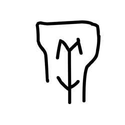

- source_zip_member: `Sub-character Images/w4mg32kjp4/ehm4tsgy3j/1e9kfzdcfk.png`
- checksum_sha256: see `06_component-visual-index.csv`.
- review_status: `needs_human_visual_review`
- caution: source-marked review image only.

## asset-017749

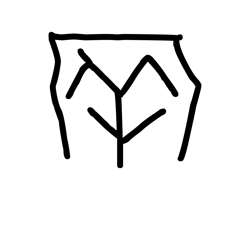

- source_zip_member: `Sub-character Images/w4mg32kjp4/ehm4tsgy3j/25ggulmu8s.png`
- checksum_sha256: see `06_component-visual-index.csv`.
- review_status: `needs_human_visual_review`
- caution: source-marked review image only.

## asset-017750

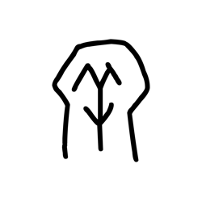

- source_zip_member: `Sub-character Images/w4mg32kjp4/ehm4tsgy3j/2zv9uljx2c.png`
- checksum_sha256: see `06_component-visual-index.csv`.
- review_status: `needs_human_visual_review`
- caution: source-marked review image only.

## asset-017751

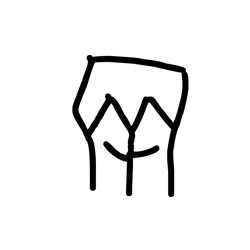

- source_zip_member: `Sub-character Images/w4mg32kjp4/ehm4tsgy3j/3q66dldw5h.png`
- checksum_sha256: see `06_component-visual-index.csv`.
- review_status: `needs_human_visual_review`
- caution: source-marked review image only.

## asset-017752

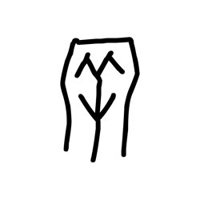

- source_zip_member: `Sub-character Images/w4mg32kjp4/ehm4tsgy3j/3tklc02tei.png`
- checksum_sha256: see `06_component-visual-index.csv`.
- review_status: `needs_human_visual_review`
- caution: source-marked review image only.

## asset-017753

- source_zip_member: `Sub-character Images/w4mg32kjp4/ehm4tsgy3j/4mlk2yh20i.png`
- checksum_sha256: see `06_component-visual-index.csv`.
- review_status: `needs_human_visual_review`
- caution: source-marked review image only.

## asset-017754

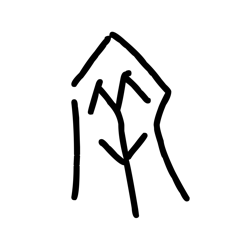

- source_zip_member: `Sub-character Images/w4mg32kjp4/ehm4tsgy3j/4o8rmaq1z9.png`
- checksum_sha256: see `06_component-visual-index.csv`.
- review_status: `needs_human_visual_review`
- caution: source-marked review image only.

## asset-017755

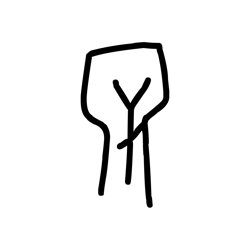

- source_zip_member: `Sub-character Images/w4mg32kjp4/ehm4tsgy3j/4phwk88m41.png`
- checksum_sha256: see `06_component-visual-index.csv`.
- review_status: `needs_human_visual_review`
- caution: source-marked review image only.

## asset-017756

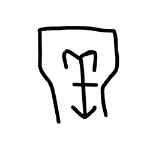

- source_zip_member: `Sub-character Images/w4mg32kjp4/ehm4tsgy3j/5cgfsqge25.png`
- checksum_sha256: see `06_component-visual-index.csv`.
- review_status: `needs_human_visual_review`
- caution: source-marked review image only.

## asset-017757

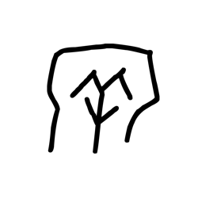

- source_zip_member: `Sub-character Images/w4mg32kjp4/ehm4tsgy3j/5ltd9qsme6.png`
- checksum_sha256: see `06_component-visual-index.csv`.
- review_status: `needs_human_visual_review`
- caution: source-marked review image only.

## asset-017758

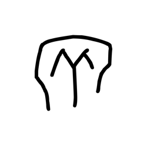

- source_zip_member: `Sub-character Images/w4mg32kjp4/ehm4tsgy3j/5qpi65r0k3.png`
- checksum_sha256: see `06_component-visual-index.csv`.
- review_status: `needs_human_visual_review`
- caution: source-marked review image only.

## asset-017759

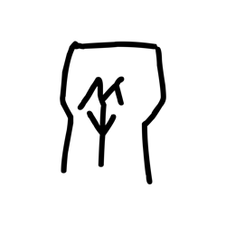

- source_zip_member: `Sub-character Images/w4mg32kjp4/ehm4tsgy3j/646i9stycx.png`
- checksum_sha256: see `06_component-visual-index.csv`.
- review_status: `needs_human_visual_review`
- caution: source-marked review image only.

## asset-017760

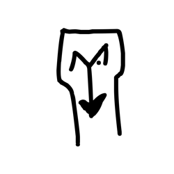

- source_zip_member: `Sub-character Images/w4mg32kjp4/ehm4tsgy3j/65x8y114q2.png`
- checksum_sha256: see `06_component-visual-index.csv`.
- review_status: `needs_human_visual_review`
- caution: source-marked review image only.

## asset-017761

- source_zip_member: `Sub-character Images/w4mg32kjp4/ehm4tsgy3j/6lih2hariy.png`
- checksum_sha256: see `06_component-visual-index.csv`.
- review_status: `needs_human_visual_review`
- caution: source-marked review image only.

## asset-017762

- source_zip_member: `Sub-character Images/w4mg32kjp4/ehm4tsgy3j/8gux6pqyiw.png`
- checksum_sha256: see `06_component-visual-index.csv`.
- review_status: `needs_human_visual_review`
- caution: source-marked review image only.

## asset-017763

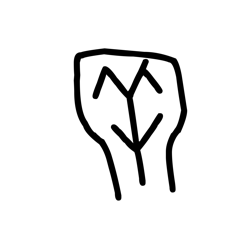

- source_zip_member: `Sub-character Images/w4mg32kjp4/ehm4tsgy3j/8q4cbo706c.png`
- checksum_sha256: see `06_component-visual-index.csv`.
- review_status: `needs_human_visual_review`
- caution: source-marked review image only.

## asset-017764

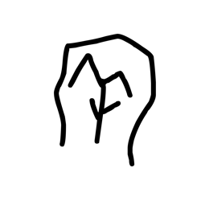

- source_zip_member: `Sub-character Images/w4mg32kjp4/ehm4tsgy3j/8zqctt4p34.png`
- checksum_sha256: see `06_component-visual-index.csv`.
- review_status: `needs_human_visual_review`
- caution: source-marked review image only.

## asset-017765

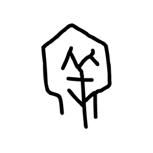

- source_zip_member: `Sub-character Images/w4mg32kjp4/ehm4tsgy3j/9clw6jw5qz.png`
- checksum_sha256: see `06_component-visual-index.csv`.
- review_status: `needs_human_visual_review`
- caution: source-marked review image only.

## asset-017766

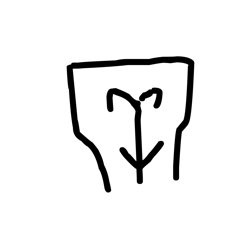

- source_zip_member: `Sub-character Images/w4mg32kjp4/ehm4tsgy3j/9laew63ach.png`
- checksum_sha256: see `06_component-visual-index.csv`.
- review_status: `needs_human_visual_review`
- caution: source-marked review image only.

## asset-017767

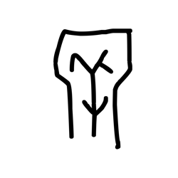

- source_zip_member: `Sub-character Images/w4mg32kjp4/ehm4tsgy3j/9oda6pdfsr.png`
- checksum_sha256: see `06_component-visual-index.csv`.
- review_status: `needs_human_visual_review`
- caution: source-marked review image only.

## asset-017768

- source_zip_member: `Sub-character Images/w4mg32kjp4/ehm4tsgy3j/a605e4bukn.png`
- checksum_sha256: see `06_component-visual-index.csv`.
- review_status: `needs_human_visual_review`
- caution: source-marked review image only.

## asset-017769

- source_zip_member: `Sub-character Images/w4mg32kjp4/ehm4tsgy3j/a7aqupuaqj.png`
- checksum_sha256: see `06_component-visual-index.csv`.
- review_status: `needs_human_visual_review`
- caution: source-marked review image only.

## asset-017770

- source_zip_member: `Sub-character Images/w4mg32kjp4/ehm4tsgy3j/al46jmt2dn.png`
- checksum_sha256: see `06_component-visual-index.csv`.
- review_status: `needs_human_visual_review`
- caution: source-marked review image only.

## asset-017771

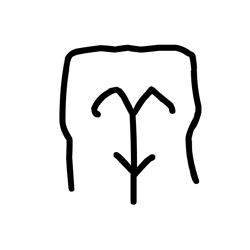

- source_zip_member: `Sub-character Images/w4mg32kjp4/ehm4tsgy3j/am7zvt551s.png`
- checksum_sha256: see `06_component-visual-index.csv`.
- review_status: `needs_human_visual_review`
- caution: source-marked review image only.

## asset-017772

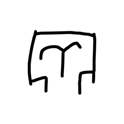

- source_zip_member: `Sub-character Images/w4mg32kjp4/ehm4tsgy3j/aykmfoxfgr.png`
- checksum_sha256: see `06_component-visual-index.csv`.
- review_status: `needs_human_visual_review`
- caution: source-marked review image only.

## asset-017773

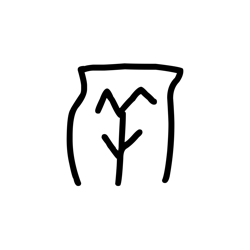

- source_zip_member: `Sub-character Images/w4mg32kjp4/ehm4tsgy3j/b7lp5lennp.png`
- checksum_sha256: see `06_component-visual-index.csv`.
- review_status: `needs_human_visual_review`
- caution: source-marked review image only.

## asset-017774

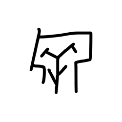

- source_zip_member: `Sub-character Images/w4mg32kjp4/ehm4tsgy3j/br1ffg59sk.png`
- checksum_sha256: see `06_component-visual-index.csv`.
- review_status: `needs_human_visual_review`
- caution: source-marked review image only.

## asset-017775

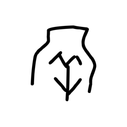

- source_zip_member: `Sub-character Images/w4mg32kjp4/ehm4tsgy3j/bu6wydyw5p.png`
- checksum_sha256: see `06_component-visual-index.csv`.
- review_status: `needs_human_visual_review`
- caution: source-marked review image only.

## asset-017776

- source_zip_member: `Sub-character Images/w4mg32kjp4/ehm4tsgy3j/c1um8fcwe6.png`
- checksum_sha256: see `06_component-visual-index.csv`.
- review_status: `needs_human_visual_review`
- caution: source-marked review image only.

## asset-017777

- source_zip_member: `Sub-character Images/w4mg32kjp4/ehm4tsgy3j/c2baxxpk9t.png`
- checksum_sha256: see `06_component-visual-index.csv`.
- review_status: `needs_human_visual_review`
- caution: source-marked review image only.

## asset-017778

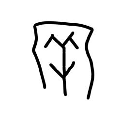

- source_zip_member: `Sub-character Images/w4mg32kjp4/ehm4tsgy3j/chascbbmfm.png`
- checksum_sha256: see `06_component-visual-index.csv`.
- review_status: `needs_human_visual_review`
- caution: source-marked review image only.

## asset-017779

- source_zip_member: `Sub-character Images/w4mg32kjp4/ehm4tsgy3j/d69ulltns6.png`
- checksum_sha256: see `06_component-visual-index.csv`.
- review_status: `needs_human_visual_review`
- caution: source-marked review image only.

## asset-017780

- source_zip_member: `Sub-character Images/w4mg32kjp4/ehm4tsgy3j/dbwfdp3zil.png`
- checksum_sha256: see `06_component-visual-index.csv`.
- review_status: `needs_human_visual_review`
- caution: source-marked review image only.

## asset-017781

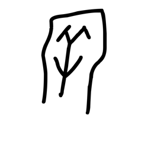

- source_zip_member: `Sub-character Images/w4mg32kjp4/ehm4tsgy3j/ef14zdvdvq.png`
- checksum_sha256: see `06_component-visual-index.csv`.
- review_status: `needs_human_visual_review`
- caution: source-marked review image only.

## asset-017782

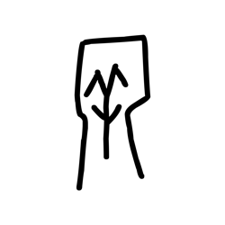

- source_zip_member: `Sub-character Images/w4mg32kjp4/ehm4tsgy3j/ef40cela9s.png`
- checksum_sha256: see `06_component-visual-index.csv`.
- review_status: `needs_human_visual_review`
- caution: source-marked review image only.

## asset-017783

- source_zip_member: `Sub-character Images/w4mg32kjp4/ehm4tsgy3j/ehm4tsgy3j.png`
- checksum_sha256: see `06_component-visual-index.csv`.
- review_status: `needs_human_visual_review`
- caution: source-marked review image only.

## asset-017784

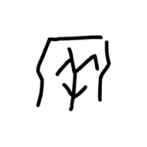

- source_zip_member: `Sub-character Images/w4mg32kjp4/ehm4tsgy3j/ekawobaavk.png`
- checksum_sha256: see `06_component-visual-index.csv`.
- review_status: `needs_human_visual_review`
- caution: source-marked review image only.

## asset-017785

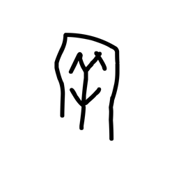

- source_zip_member: `Sub-character Images/w4mg32kjp4/ehm4tsgy3j/emm49eno0j.png`
- checksum_sha256: see `06_component-visual-index.csv`.
- review_status: `needs_human_visual_review`
- caution: source-marked review image only.

## asset-017786

- source_zip_member: `Sub-character Images/w4mg32kjp4/ehm4tsgy3j/evyoowlvln.png`
- checksum_sha256: see `06_component-visual-index.csv`.
- review_status: `needs_human_visual_review`
- caution: source-marked review image only.

## asset-017787

- source_zip_member: `Sub-character Images/w4mg32kjp4/ehm4tsgy3j/f4sb0pzcbb.png`
- checksum_sha256: see `06_component-visual-index.csv`.
- review_status: `needs_human_visual_review`
- caution: source-marked review image only.

## asset-017788

- source_zip_member: `Sub-character Images/w4mg32kjp4/ehm4tsgy3j/g1u9j6oc45.png`
- checksum_sha256: see `06_component-visual-index.csv`.
- review_status: `needs_human_visual_review`
- caution: source-marked review image only.

## asset-017789

- source_zip_member: `Sub-character Images/w4mg32kjp4/ehm4tsgy3j/gtsgxrur0v.png`
- checksum_sha256: see `06_component-visual-index.csv`.
- review_status: `needs_human_visual_review`
- caution: source-marked review image only.

## asset-017790

- source_zip_member: `Sub-character Images/w4mg32kjp4/ehm4tsgy3j/gumslnx13p.png`
- checksum_sha256: see `06_component-visual-index.csv`.
- review_status: `needs_human_visual_review`
- caution: source-marked review image only.

## asset-017791

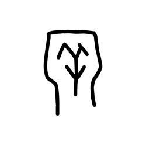

- source_zip_member: `Sub-character Images/w4mg32kjp4/ehm4tsgy3j/hdeei0y0m2.png`
- checksum_sha256: see `06_component-visual-index.csv`.
- review_status: `needs_human_visual_review`
- caution: source-marked review image only.

## asset-017792

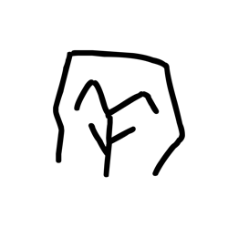

- source_zip_member: `Sub-character Images/w4mg32kjp4/ehm4tsgy3j/ic2sbu05zi.png`
- checksum_sha256: see `06_component-visual-index.csv`.
- review_status: `needs_human_visual_review`
- caution: source-marked review image only.

## asset-017793

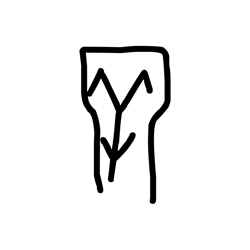

- source_zip_member: `Sub-character Images/w4mg32kjp4/ehm4tsgy3j/iix2ps6qpp.png`
- checksum_sha256: see `06_component-visual-index.csv`.
- review_status: `needs_human_visual_review`
- caution: source-marked review image only.

## asset-017794

- source_zip_member: `Sub-character Images/w4mg32kjp4/ehm4tsgy3j/io9apsic92.png`
- checksum_sha256: see `06_component-visual-index.csv`.
- review_status: `needs_human_visual_review`
- caution: source-marked review image only.

## asset-017795

- source_zip_member: `Sub-character Images/w4mg32kjp4/ehm4tsgy3j/iwp4u2j53n.png`
- checksum_sha256: see `06_component-visual-index.csv`.
- review_status: `needs_human_visual_review`
- caution: source-marked review image only.

## asset-017796

- source_zip_member: `Sub-character Images/w4mg32kjp4/ehm4tsgy3j/jeyh8dxn0o.png`
- checksum_sha256: see `06_component-visual-index.csv`.
- review_status: `needs_human_visual_review`
- caution: source-marked review image only.

## asset-017797

- source_zip_member: `Sub-character Images/w4mg32kjp4/ehm4tsgy3j/jggi4e6ilw.png`
- checksum_sha256: see `06_component-visual-index.csv`.
- review_status: `needs_human_visual_review`
- caution: source-marked review image only.

## asset-017798

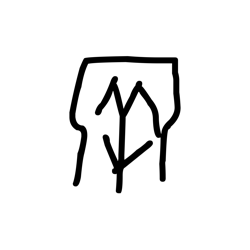

- source_zip_member: `Sub-character Images/w4mg32kjp4/ehm4tsgy3j/jq03v15q2e.png`
- checksum_sha256: see `06_component-visual-index.csv`.
- review_status: `needs_human_visual_review`
- caution: source-marked review image only.

## asset-017799

- source_zip_member: `Sub-character Images/w4mg32kjp4/ehm4tsgy3j/jrocb5wd2d.png`
- checksum_sha256: see `06_component-visual-index.csv`.
- review_status: `needs_human_visual_review`
- caution: source-marked review image only.

## asset-017800

- source_zip_member: `Sub-character Images/w4mg32kjp4/ehm4tsgy3j/k3s8t5zmcl.png`
- checksum_sha256: see `06_component-visual-index.csv`.
- review_status: `needs_human_visual_review`
- caution: source-marked review image only.

## asset-017801

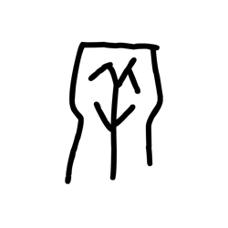

- source_zip_member: `Sub-character Images/w4mg32kjp4/ehm4tsgy3j/k783w8gegi.png`
- checksum_sha256: see `06_component-visual-index.csv`.
- review_status: `needs_human_visual_review`
- caution: source-marked review image only.

## asset-017802

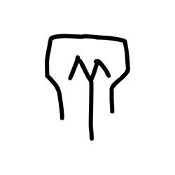

- source_zip_member: `Sub-character Images/w4mg32kjp4/ehm4tsgy3j/kfltopnz1o.png`
- checksum_sha256: see `06_component-visual-index.csv`.
- review_status: `needs_human_visual_review`
- caution: source-marked review image only.

## asset-017803

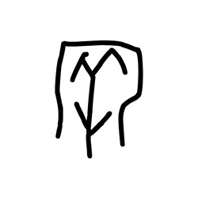

- source_zip_member: `Sub-character Images/w4mg32kjp4/ehm4tsgy3j/kwex6ohlmg.png`
- checksum_sha256: see `06_component-visual-index.csv`.
- review_status: `needs_human_visual_review`
- caution: source-marked review image only.

## asset-017804

- source_zip_member: `Sub-character Images/w4mg32kjp4/ehm4tsgy3j/kyt61h2mrw.png`
- checksum_sha256: see `06_component-visual-index.csv`.
- review_status: `needs_human_visual_review`
- caution: source-marked review image only.

## asset-017805

- source_zip_member: `Sub-character Images/w4mg32kjp4/ehm4tsgy3j/kzf9o2ek2h.png`
- checksum_sha256: see `06_component-visual-index.csv`.
- review_status: `needs_human_visual_review`
- caution: source-marked review image only.

## asset-017806

- source_zip_member: `Sub-character Images/w4mg32kjp4/ehm4tsgy3j/l3wr9orcrr.png`
- checksum_sha256: see `06_component-visual-index.csv`.
- review_status: `needs_human_visual_review`
- caution: source-marked review image only.

## asset-017807

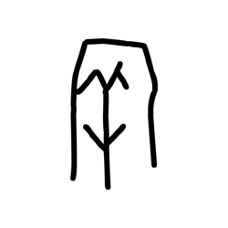

- source_zip_member: `Sub-character Images/w4mg32kjp4/ehm4tsgy3j/lbpirajs3q.png`
- checksum_sha256: see `06_component-visual-index.csv`.
- review_status: `needs_human_visual_review`
- caution: source-marked review image only.

## asset-017808

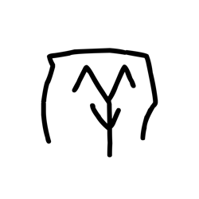

- source_zip_member: `Sub-character Images/w4mg32kjp4/ehm4tsgy3j/le5occ04dn.png`
- checksum_sha256: see `06_component-visual-index.csv`.
- review_status: `needs_human_visual_review`
- caution: source-marked review image only.

## asset-017809

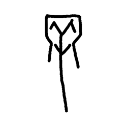

- source_zip_member: `Sub-character Images/w4mg32kjp4/ehm4tsgy3j/m93tn0jnob.png`
- checksum_sha256: see `06_component-visual-index.csv`.
- review_status: `needs_human_visual_review`
- caution: source-marked review image only.

## asset-017810

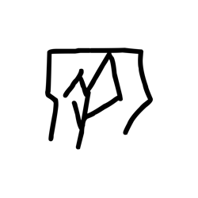

- source_zip_member: `Sub-character Images/w4mg32kjp4/ehm4tsgy3j/mrz1bel92p.png`
- checksum_sha256: see `06_component-visual-index.csv`.
- review_status: `needs_human_visual_review`
- caution: source-marked review image only.

## asset-017811

- source_zip_member: `Sub-character Images/w4mg32kjp4/ehm4tsgy3j/n3lg58xb76.png`
- checksum_sha256: see `06_component-visual-index.csv`.
- review_status: `needs_human_visual_review`
- caution: source-marked review image only.

## asset-017812

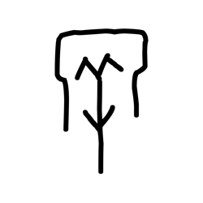

- source_zip_member: `Sub-character Images/w4mg32kjp4/ehm4tsgy3j/nrkk6s3hp5.png`
- checksum_sha256: see `06_component-visual-index.csv`.
- review_status: `needs_human_visual_review`
- caution: source-marked review image only.

## asset-017813

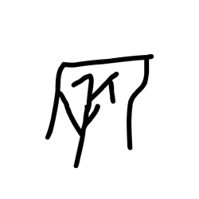

- source_zip_member: `Sub-character Images/w4mg32kjp4/ehm4tsgy3j/nvv9qkmbhb.png`
- checksum_sha256: see `06_component-visual-index.csv`.
- review_status: `needs_human_visual_review`
- caution: source-marked review image only.

## asset-017814

- source_zip_member: `Sub-character Images/w4mg32kjp4/ehm4tsgy3j/nx52h5q3pl.png`
- checksum_sha256: see `06_component-visual-index.csv`.
- review_status: `needs_human_visual_review`
- caution: source-marked review image only.

## asset-017815

- source_zip_member: `Sub-character Images/w4mg32kjp4/ehm4tsgy3j/nyrlc98bj0.png`
- checksum_sha256: see `06_component-visual-index.csv`.
- review_status: `needs_human_visual_review`
- caution: source-marked review image only.

## asset-017816

- source_zip_member: `Sub-character Images/w4mg32kjp4/ehm4tsgy3j/pjofropvqk.png`
- checksum_sha256: see `06_component-visual-index.csv`.
- review_status: `needs_human_visual_review`
- caution: source-marked review image only.

## asset-017817

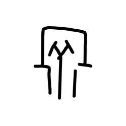

- source_zip_member: `Sub-character Images/w4mg32kjp4/ehm4tsgy3j/q7spizdzfy.png`
- checksum_sha256: see `06_component-visual-index.csv`.
- review_status: `needs_human_visual_review`
- caution: source-marked review image only.

## asset-017818

- source_zip_member: `Sub-character Images/w4mg32kjp4/ehm4tsgy3j/qbthpbx337.png`
- checksum_sha256: see `06_component-visual-index.csv`.
- review_status: `needs_human_visual_review`
- caution: source-marked review image only.

## asset-017819

- source_zip_member: `Sub-character Images/w4mg32kjp4/ehm4tsgy3j/qhmrwt4ipb.png`
- checksum_sha256: see `06_component-visual-index.csv`.
- review_status: `needs_human_visual_review`
- caution: source-marked review image only.

## asset-017820

- source_zip_member: `Sub-character Images/w4mg32kjp4/ehm4tsgy3j/qm08ymzu57.png`
- checksum_sha256: see `06_component-visual-index.csv`.
- review_status: `needs_human_visual_review`
- caution: source-marked review image only.

## asset-017821

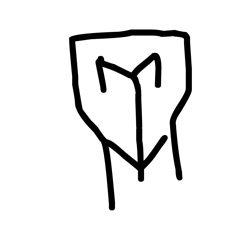

- source_zip_member: `Sub-character Images/w4mg32kjp4/ehm4tsgy3j/qu0hh93qsu.png`
- checksum_sha256: see `06_component-visual-index.csv`.
- review_status: `needs_human_visual_review`
- caution: source-marked review image only.

## asset-017822

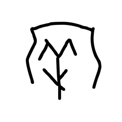

- source_zip_member: `Sub-character Images/w4mg32kjp4/ehm4tsgy3j/quwqru31n7.png`
- checksum_sha256: see `06_component-visual-index.csv`.
- review_status: `needs_human_visual_review`
- caution: source-marked review image only.

## asset-017823

- source_zip_member: `Sub-character Images/w4mg32kjp4/ehm4tsgy3j/rbnd3iaw0x.png`
- checksum_sha256: see `06_component-visual-index.csv`.
- review_status: `needs_human_visual_review`
- caution: source-marked review image only.

## asset-017824

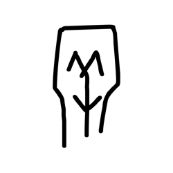

- source_zip_member: `Sub-character Images/w4mg32kjp4/ehm4tsgy3j/rp6z4cln4g.png`
- checksum_sha256: see `06_component-visual-index.csv`.
- review_status: `needs_human_visual_review`
- caution: source-marked review image only.

## asset-017825

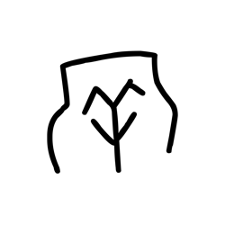

- source_zip_member: `Sub-character Images/w4mg32kjp4/ehm4tsgy3j/s5gukc37z9.png`
- checksum_sha256: see `06_component-visual-index.csv`.
- review_status: `needs_human_visual_review`
- caution: source-marked review image only.

## asset-017826

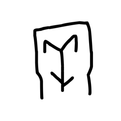

- source_zip_member: `Sub-character Images/w4mg32kjp4/ehm4tsgy3j/sjrgzayq7a.png`
- checksum_sha256: see `06_component-visual-index.csv`.
- review_status: `needs_human_visual_review`
- caution: source-marked review image only.

## asset-017827

- source_zip_member: `Sub-character Images/w4mg32kjp4/ehm4tsgy3j/smj8lfn19v.png`
- checksum_sha256: see `06_component-visual-index.csv`.
- review_status: `needs_human_visual_review`
- caution: source-marked review image only.

## asset-017828

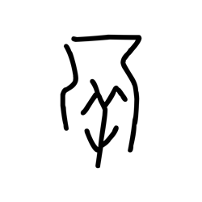

- source_zip_member: `Sub-character Images/w4mg32kjp4/ehm4tsgy3j/sv9iepra0w.png`
- checksum_sha256: see `06_component-visual-index.csv`.
- review_status: `needs_human_visual_review`
- caution: source-marked review image only.

## asset-017829

- source_zip_member: `Sub-character Images/w4mg32kjp4/ehm4tsgy3j/t17fqa9e5n.png`
- checksum_sha256: see `06_component-visual-index.csv`.
- review_status: `needs_human_visual_review`
- caution: source-marked review image only.

## asset-017830

- source_zip_member: `Sub-character Images/w4mg32kjp4/ehm4tsgy3j/tkhnhp63vp.png`
- checksum_sha256: see `06_component-visual-index.csv`.
- review_status: `needs_human_visual_review`
- caution: source-marked review image only.

## asset-017831

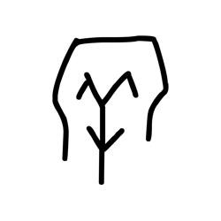

- source_zip_member: `Sub-character Images/w4mg32kjp4/ehm4tsgy3j/u3rp3d43n2.png`
- checksum_sha256: see `06_component-visual-index.csv`.
- review_status: `needs_human_visual_review`
- caution: source-marked review image only.

## asset-017832

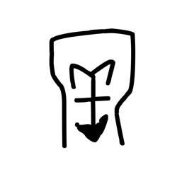

- source_zip_member: `Sub-character Images/w4mg32kjp4/ehm4tsgy3j/unxcp23b60.png`
- checksum_sha256: see `06_component-visual-index.csv`.
- review_status: `needs_human_visual_review`
- caution: source-marked review image only.

## asset-017833

- source_zip_member: `Sub-character Images/w4mg32kjp4/ehm4tsgy3j/uzwrench49.png`
- checksum_sha256: see `06_component-visual-index.csv`.
- review_status: `needs_human_visual_review`
- caution: source-marked review image only.

## asset-017834

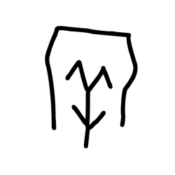

- source_zip_member: `Sub-character Images/w4mg32kjp4/ehm4tsgy3j/vmda3a1id3.png`
- checksum_sha256: see `06_component-visual-index.csv`.
- review_status: `needs_human_visual_review`
- caution: source-marked review image only.

## asset-017835

- source_zip_member: `Sub-character Images/w4mg32kjp4/ehm4tsgy3j/wc57htdbry.png`
- checksum_sha256: see `06_component-visual-index.csv`.
- review_status: `needs_human_visual_review`
- caution: source-marked review image only.

## asset-017836

- source_zip_member: `Sub-character Images/w4mg32kjp4/ehm4tsgy3j/werpylq30y.png`
- checksum_sha256: see `06_component-visual-index.csv`.
- review_status: `needs_human_visual_review`
- caution: source-marked review image only.

## asset-017837

- source_zip_member: `Sub-character Images/w4mg32kjp4/ehm4tsgy3j/wls58037oh.png`
- checksum_sha256: see `06_component-visual-index.csv`.
- review_status: `needs_human_visual_review`
- caution: source-marked review image only.

## asset-017838

- source_zip_member: `Sub-character Images/w4mg32kjp4/ehm4tsgy3j/x7br388zye.png`
- checksum_sha256: see `06_component-visual-index.csv`.
- review_status: `needs_human_visual_review`
- caution: source-marked review image only.

## asset-017839

- source_zip_member: `Sub-character Images/w4mg32kjp4/ehm4tsgy3j/ybo99wmp24.png`
- checksum_sha256: see `06_component-visual-index.csv`.
- review_status: `needs_human_visual_review`
- caution: source-marked review image only.

## asset-017840

- source_zip_member: `Sub-character Images/w4mg32kjp4/ehm4tsgy3j/yfzneudzzj.png`
- checksum_sha256: see `06_component-visual-index.csv`.
- review_status: `needs_human_visual_review`
- caution: source-marked review image only.

## asset-017841

- source_zip_member: `Sub-character Images/w4mg32kjp4/ehm4tsgy3j/yh45bxmldw.png`
- checksum_sha256: see `06_component-visual-index.csv`.
- review_status: `needs_human_visual_review`
- caution: source-marked review image only.

## asset-017842

- source_zip_member: `Sub-character Images/w4mg32kjp4/ehm4tsgy3j/z0gmrfkc3r.png`
- checksum_sha256: see `06_component-visual-index.csv`.
- review_status: `needs_human_visual_review`
- caution: source-marked review image only.

## asset-017843

- source_zip_member: `Sub-character Images/w4mg32kjp4/ehm4tsgy3j/zfc7nbcdyb.png`
- checksum_sha256: see `06_component-visual-index.csv`.
- review_status: `needs_human_visual_review`
- caution: source-marked review image only.

## asset-017844

- source_zip_member: `Sub-character Images/w4mg32kjp4/ehm4tsgy3j/ztke27dy7b.png`
- checksum_sha256: see `06_component-visual-index.csv`.
- review_status: `needs_human_visual_review`
- caution: source-marked review image only.
