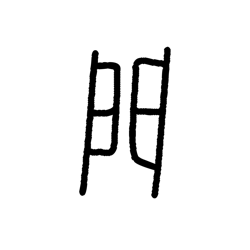
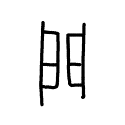
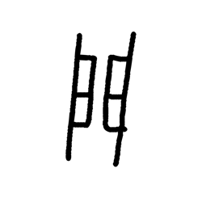
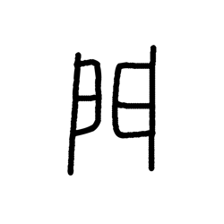
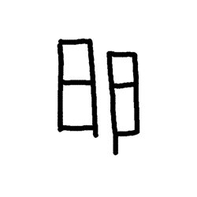

# Component Visual Gallery / 构件图像查看: obs-comp-cand-001718

English:
This page displays OBIMD subcharacter PNG assets extracted into this concrete
corpus object directory for human review.

简体中文：
本页展示抽取到当前具体 corpus 对象目录内的 OBIMD subcharacter PNG 资料，供人工复核使用。

Boundary / 边界：
dataset image candidate only; not a confirmed component form, not a component
assignment, and not a decipherment claim.
- not a confirmed component form
- not a component assignment
- not a decipherment claim

## Concrete Questions To Check / 具体待查问题

- Which local image should be opened first?
- 应先打开哪一张本地构件图像？
- Which source zip member anchors this image?
- 哪一个 source zip member 能定位这张图像？
- Which near-shape or variant comparison is still missing?
- 还缺哪些近形或异体比较？
- Which character or inscription context should be checked next?
- 下一步应核对哪些单字或卜辞上下文？
- What evidence is missing before a component assignment?
- 正式构件归属前还缺哪些证据？

## asset-017863

- source_zip_member: `Sub-character Images/du93rs9pec/du93rs9pec/042nknc5no.png`
- checksum_sha256: see `06_component-visual-index.csv`.
- review_status: `needs_human_visual_review`
- caution: source-marked review image only.

## asset-017864

- source_zip_member: `Sub-character Images/du93rs9pec/du93rs9pec/1uwzj0vjnu.png`
- checksum_sha256: see `06_component-visual-index.csv`.
- review_status: `needs_human_visual_review`
- caution: source-marked review image only.

## asset-017865

- source_zip_member: `Sub-character Images/du93rs9pec/du93rs9pec/259xdoirn9.png`
- checksum_sha256: see `06_component-visual-index.csv`.
- review_status: `needs_human_visual_review`
- caution: source-marked review image only.

## asset-017866

- source_zip_member: `Sub-character Images/du93rs9pec/du93rs9pec/295z2hpthv.png`
- checksum_sha256: see `06_component-visual-index.csv`.
- review_status: `needs_human_visual_review`
- caution: source-marked review image only.

## asset-017867

- source_zip_member: `Sub-character Images/du93rs9pec/du93rs9pec/29rp9hr3eg.png`
- checksum_sha256: see `06_component-visual-index.csv`.
- review_status: `needs_human_visual_review`
- caution: source-marked review image only.

## asset-017868

- source_zip_member: `Sub-character Images/du93rs9pec/du93rs9pec/351foo972s.png`
- checksum_sha256: see `06_component-visual-index.csv`.
- review_status: `needs_human_visual_review`
- caution: source-marked review image only.

## asset-017869

- source_zip_member: `Sub-character Images/du93rs9pec/du93rs9pec/4e6g2o0e1q.png`
- checksum_sha256: see `06_component-visual-index.csv`.
- review_status: `needs_human_visual_review`
- caution: source-marked review image only.

## asset-017870

- source_zip_member: `Sub-character Images/du93rs9pec/du93rs9pec/7fm2zth4ik.png`
- checksum_sha256: see `06_component-visual-index.csv`.
- review_status: `needs_human_visual_review`
- caution: source-marked review image only.

## asset-017871

- source_zip_member: `Sub-character Images/du93rs9pec/du93rs9pec/8o73psk99o.png`
- checksum_sha256: see `06_component-visual-index.csv`.
- review_status: `needs_human_visual_review`
- caution: source-marked review image only.

## asset-017872

- source_zip_member: `Sub-character Images/du93rs9pec/du93rs9pec/9p9q4mfi4y.png`
- checksum_sha256: see `06_component-visual-index.csv`.
- review_status: `needs_human_visual_review`
- caution: source-marked review image only.

## asset-017873

- source_zip_member: `Sub-character Images/du93rs9pec/du93rs9pec/b0z6ktwyei.png`
- checksum_sha256: see `06_component-visual-index.csv`.
- review_status: `needs_human_visual_review`
- caution: source-marked review image only.

## asset-017874

- source_zip_member: `Sub-character Images/du93rs9pec/du93rs9pec/bh1i5atuk7.png`
- checksum_sha256: see `06_component-visual-index.csv`.
- review_status: `needs_human_visual_review`
- caution: source-marked review image only.

## asset-017875

- source_zip_member: `Sub-character Images/du93rs9pec/du93rs9pec/bjwgqqkcwh.png`
- checksum_sha256: see `06_component-visual-index.csv`.
- review_status: `needs_human_visual_review`
- caution: source-marked review image only.

## asset-017876

- source_zip_member: `Sub-character Images/du93rs9pec/du93rs9pec/bqp6bnf491.png`
- checksum_sha256: see `06_component-visual-index.csv`.
- review_status: `needs_human_visual_review`
- caution: source-marked review image only.

## asset-017877

- source_zip_member: `Sub-character Images/du93rs9pec/du93rs9pec/d6jt5ifbhw.png`
- checksum_sha256: see `06_component-visual-index.csv`.
- review_status: `needs_human_visual_review`
- caution: source-marked review image only.

## asset-017878

- source_zip_member: `Sub-character Images/du93rs9pec/du93rs9pec/du93rs9pec.png`
- checksum_sha256: see `06_component-visual-index.csv`.
- review_status: `needs_human_visual_review`
- caution: source-marked review image only.

## asset-017879

- source_zip_member: `Sub-character Images/du93rs9pec/du93rs9pec/gb29wigjjo.png`
- checksum_sha256: see `06_component-visual-index.csv`.
- review_status: `needs_human_visual_review`
- caution: source-marked review image only.

## asset-017880

- source_zip_member: `Sub-character Images/du93rs9pec/du93rs9pec/ggv7q6bueh.png`
- checksum_sha256: see `06_component-visual-index.csv`.
- review_status: `needs_human_visual_review`
- caution: source-marked review image only.

## asset-017881

- source_zip_member: `Sub-character Images/du93rs9pec/du93rs9pec/gtq1x1rtu5.png`
- checksum_sha256: see `06_component-visual-index.csv`.
- review_status: `needs_human_visual_review`
- caution: source-marked review image only.

## asset-017882

- source_zip_member: `Sub-character Images/du93rs9pec/du93rs9pec/gxwplzcj6q.png`
- checksum_sha256: see `06_component-visual-index.csv`.
- review_status: `needs_human_visual_review`
- caution: source-marked review image only.

## asset-017883

- source_zip_member: `Sub-character Images/du93rs9pec/du93rs9pec/h90pb56455.png`
- checksum_sha256: see `06_component-visual-index.csv`.
- review_status: `needs_human_visual_review`
- caution: source-marked review image only.

## asset-017884

- source_zip_member: `Sub-character Images/du93rs9pec/du93rs9pec/hi6p1m2zmn.png`
- checksum_sha256: see `06_component-visual-index.csv`.
- review_status: `needs_human_visual_review`
- caution: source-marked review image only.

## asset-017885

- source_zip_member: `Sub-character Images/du93rs9pec/du93rs9pec/inhzso8npq.png`
- checksum_sha256: see `06_component-visual-index.csv`.
- review_status: `needs_human_visual_review`
- caution: source-marked review image only.

## asset-017886

- source_zip_member: `Sub-character Images/du93rs9pec/du93rs9pec/ir5nwz1inl.png`
- checksum_sha256: see `06_component-visual-index.csv`.
- review_status: `needs_human_visual_review`
- caution: source-marked review image only.

## asset-017887

- source_zip_member: `Sub-character Images/du93rs9pec/du93rs9pec/k0lh3b19b2.png`
- checksum_sha256: see `06_component-visual-index.csv`.
- review_status: `needs_human_visual_review`
- caution: source-marked review image only.

## asset-017888

- source_zip_member: `Sub-character Images/du93rs9pec/du93rs9pec/l80p3sk9wh.png`
- checksum_sha256: see `06_component-visual-index.csv`.
- review_status: `needs_human_visual_review`
- caution: source-marked review image only.

## asset-017889

- source_zip_member: `Sub-character Images/du93rs9pec/du93rs9pec/mfzz2wr4jv.png`
- checksum_sha256: see `06_component-visual-index.csv`.
- review_status: `needs_human_visual_review`
- caution: source-marked review image only.

## asset-017890

- source_zip_member: `Sub-character Images/du93rs9pec/du93rs9pec/nuv1xvtlnl.png`
- checksum_sha256: see `06_component-visual-index.csv`.
- review_status: `needs_human_visual_review`
- caution: source-marked review image only.

## asset-017891

- source_zip_member: `Sub-character Images/du93rs9pec/du93rs9pec/nv2xdoy8rp.png`
- checksum_sha256: see `06_component-visual-index.csv`.
- review_status: `needs_human_visual_review`
- caution: source-marked review image only.

## asset-017892

- source_zip_member: `Sub-character Images/du93rs9pec/du93rs9pec/ny6bm24fqn.png`
- checksum_sha256: see `06_component-visual-index.csv`.
- review_status: `needs_human_visual_review`
- caution: source-marked review image only.

## asset-017893

- source_zip_member: `Sub-character Images/du93rs9pec/du93rs9pec/qrri20vx95.png`
- checksum_sha256: see `06_component-visual-index.csv`.
- review_status: `needs_human_visual_review`
- caution: source-marked review image only.

## asset-017894

- source_zip_member: `Sub-character Images/du93rs9pec/du93rs9pec/qx2bv6zlyk.png`
- checksum_sha256: see `06_component-visual-index.csv`.
- review_status: `needs_human_visual_review`
- caution: source-marked review image only.

## asset-017895

- source_zip_member: `Sub-character Images/du93rs9pec/du93rs9pec/spgjnvdrn2.png`
- checksum_sha256: see `06_component-visual-index.csv`.
- review_status: `needs_human_visual_review`
- caution: source-marked review image only.

## asset-017896

- source_zip_member: `Sub-character Images/du93rs9pec/du93rs9pec/vgi0us0t1o.png`
- checksum_sha256: see `06_component-visual-index.csv`.
- review_status: `needs_human_visual_review`
- caution: source-marked review image only.

## asset-017897

- source_zip_member: `Sub-character Images/du93rs9pec/du93rs9pec/w6tffiqyhi.png`
- checksum_sha256: see `06_component-visual-index.csv`.
- review_status: `needs_human_visual_review`
- caution: source-marked review image only.
