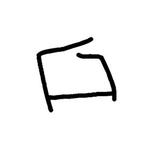
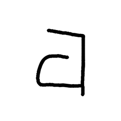
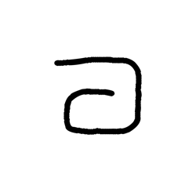

# Component Visual Gallery / 构件图像查看: obs-comp-cand-001726

English:
This page displays OBIMD subcharacter PNG assets extracted into this concrete corpus object directory for human review.

简体中文：
本页展示抽取到当前具体 corpus 对象目录内的 OBIMD subcharacter PNG 资料，供人工复核使用。

Boundary / 边界：dataset image candidate only; not a confirmed component form, component assignment, or decipherment claim.

## asset-017905

- source_zip_member: `Sub-character Images/kkt3pdctdg/kkt3pdctdg/00eyzc9ief.png`
- checksum_sha256: `adb962e8f3c4bafaefb7926e7983d5478a21cc902e763965f015bcb178b40459`
- review_status: `needs_human_visual_review`
- caution: OBIMD subcharacter image is a source-marked review asset only; it is not a confirmed component form, component assignment, or decipherment conclusion.

## asset-017906

- source_zip_member: `Sub-character Images/kkt3pdctdg/kkt3pdctdg/4o8o7gkl75.png`
- checksum_sha256: `0963d677a1ac5a9977ac05cab46b45c39268e9a136a6e1fbeb7e081b83194101`
- review_status: `needs_human_visual_review`
- caution: OBIMD subcharacter image is a source-marked review asset only; it is not a confirmed component form, component assignment, or decipherment conclusion.

## asset-017907

- source_zip_member: `Sub-character Images/kkt3pdctdg/kkt3pdctdg/677jpj0km9.png`
- checksum_sha256: `f7384867a7c4677bde1b7af6acbd2adb93696c072b1b7307cd2bd1475076bfec`
- review_status: `needs_human_visual_review`
- caution: OBIMD subcharacter image is a source-marked review asset only; it is not a confirmed component form, component assignment, or decipherment conclusion.

## asset-017908

- source_zip_member: `Sub-character Images/kkt3pdctdg/kkt3pdctdg/6ok3cjpeay.png`
- checksum_sha256: `be98f9b3fdebe50454d87709e4a7b7b6201eeaf8db2c162260a9bd73ace9be63`
- review_status: `needs_human_visual_review`
- caution: OBIMD subcharacter image is a source-marked review asset only; it is not a confirmed component form, component assignment, or decipherment conclusion.

## asset-017909

- source_zip_member: `Sub-character Images/kkt3pdctdg/kkt3pdctdg/71x0sex9id.png`
- checksum_sha256: `a074b1a4b4ac993e71fe4128432b09aee505686fc56977ffdd032622ac13555f`
- review_status: `needs_human_visual_review`
- caution: OBIMD subcharacter image is a source-marked review asset only; it is not a confirmed component form, component assignment, or decipherment conclusion.

## asset-017910

- source_zip_member: `Sub-character Images/kkt3pdctdg/kkt3pdctdg/kkt3pdctdg.png`
- checksum_sha256: `7ee8d1e02e56a61d7b49789f68c64f9ffc8b10eca6da33ea1c475ec9fd96157e`
- review_status: `needs_human_visual_review`
- caution: OBIMD subcharacter image is a source-marked review asset only; it is not a confirmed component form, component assignment, or decipherment conclusion.

## asset-017911

- source_zip_member: `Sub-character Images/kkt3pdctdg/kkt3pdctdg/zq4tdt25fo.png`
- checksum_sha256: `94c957ac712a140b0936e48c8f7b637b5e8c5017bd33483fd3aad01afed8f2fc`
- review_status: `needs_human_visual_review`
- caution: OBIMD subcharacter image is a source-marked review asset only; it is not a confirmed component form, component assignment, or decipherment conclusion.
