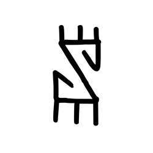

# Component Visual Gallery / 构件图像查看: obs-comp-cand-001729

English:
This page displays OBIMD subcharacter PNG assets extracted into this concrete corpus object directory for human review.

简体中文：
本页展示抽取到当前具体 corpus 对象目录内的 OBIMD subcharacter PNG 资料，供人工复核使用。

Boundary / 边界：dataset image candidate only; not a confirmed component form, component assignment, or decipherment claim.

## asset-017914

- source_zip_member: `Sub-character Images/xeawj1t30j/vgeul8n9jc/vgeul8n9jc.png`
- checksum_sha256: `32ede51b109e207db00710cd6514764af7a3a2cac9162e65eebff926828b61ee`
- review_status: `needs_human_visual_review`
- caution: OBIMD subcharacter image is a source-marked review asset only; it is not a confirmed component form, component assignment, or decipherment conclusion.
