# Component Visual Gallery / 构件图像查看: obs-comp-cand-001732

English:
This page displays OBIMD subcharacter PNG assets extracted into this concrete
corpus object directory for human review.

简体中文：
本页展示抽取到当前具体 corpus 对象目录内的 OBIMD subcharacter PNG 资料，供人工复核使用。

Boundary / 边界：
dataset image candidate only; not a confirmed component form, not a component
assignment, and not a decipherment claim.
- not a confirmed component form
- not a component assignment
- not a decipherment claim

## Concrete Questions To Check / 具体待查问题

- Open 06_component-visual-index.csv and name the local image row.
- 打开 06_component-visual-index.csv，写明本地图像行。
- Open 09_component-visual-route-index.csv and name the source route row.
- 打开 09_component-visual-route-index.csv，写明来源路线行。
- Open 13_component-context-evidence-dossier.md for character context.
- 打开 13_component-context-evidence-dossier.md，核对单字与卜辞上下文。
- Record the missing image, near-shape, source, or context route.
- 记录缺失的图像、近形、来源或上下文路线。

## asset-017917

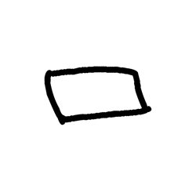

- source_zip_member: `Sub-character Images/l7cyvm7kbt/l7cyvm7kbt/308alvh4ph.png`
- checksum_sha256: see `06_component-visual-index.csv`.
- review_status: `needs_human_visual_review`
- caution: source-marked review image only.

## asset-017918

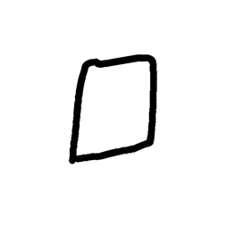

- source_zip_member: `Sub-character Images/l7cyvm7kbt/l7cyvm7kbt/3zc7vc4m4u.png`
- checksum_sha256: see `06_component-visual-index.csv`.
- review_status: `needs_human_visual_review`
- caution: source-marked review image only.

## asset-017919

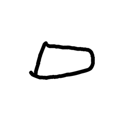

- source_zip_member: `Sub-character Images/l7cyvm7kbt/l7cyvm7kbt/69ymgzepg5.png`
- checksum_sha256: see `06_component-visual-index.csv`.
- review_status: `needs_human_visual_review`
- caution: source-marked review image only.

## asset-017920

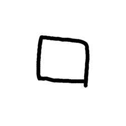

- source_zip_member: `Sub-character Images/l7cyvm7kbt/l7cyvm7kbt/6a0uony11c.png`
- checksum_sha256: see `06_component-visual-index.csv`.
- review_status: `needs_human_visual_review`
- caution: source-marked review image only.

## asset-017921

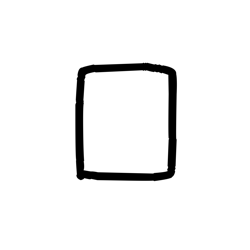

- source_zip_member: `Sub-character Images/l7cyvm7kbt/l7cyvm7kbt/8m88v5cb24.png`
- checksum_sha256: see `06_component-visual-index.csv`.
- review_status: `needs_human_visual_review`
- caution: source-marked review image only.

## asset-017922

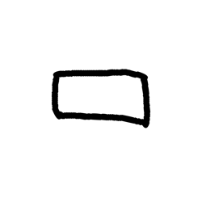

- source_zip_member: `Sub-character Images/l7cyvm7kbt/l7cyvm7kbt/cidb4v7muy.png`
- checksum_sha256: see `06_component-visual-index.csv`.
- review_status: `needs_human_visual_review`
- caution: source-marked review image only.

## asset-017923

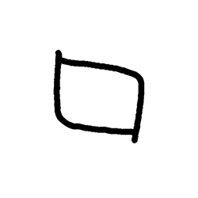

- source_zip_member: `Sub-character Images/l7cyvm7kbt/l7cyvm7kbt/j2l298ts55.png`
- checksum_sha256: see `06_component-visual-index.csv`.
- review_status: `needs_human_visual_review`
- caution: source-marked review image only.

## asset-017924

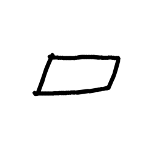

- source_zip_member: `Sub-character Images/l7cyvm7kbt/l7cyvm7kbt/k3rpp2io66.png`
- checksum_sha256: see `06_component-visual-index.csv`.
- review_status: `needs_human_visual_review`
- caution: source-marked review image only.

## asset-017925

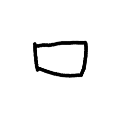

- source_zip_member: `Sub-character Images/l7cyvm7kbt/l7cyvm7kbt/k4elsh2cww.png`
- checksum_sha256: see `06_component-visual-index.csv`.
- review_status: `needs_human_visual_review`
- caution: source-marked review image only.

## asset-017926

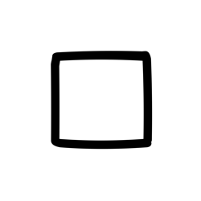

- source_zip_member: `Sub-character Images/l7cyvm7kbt/l7cyvm7kbt/l7cyvm7kbt.png`
- checksum_sha256: see `06_component-visual-index.csv`.
- review_status: `needs_human_visual_review`
- caution: source-marked review image only.

## asset-017927

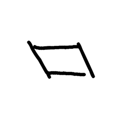

- source_zip_member: `Sub-character Images/l7cyvm7kbt/l7cyvm7kbt/us1b43n2mt.png`
- checksum_sha256: see `06_component-visual-index.csv`.
- review_status: `needs_human_visual_review`
- caution: source-marked review image only.
