# Component Visual Gallery / 构件图像查看: obs-comp-cand-001778

English:
This page displays OBIMD subcharacter PNG assets extracted into this concrete corpus object directory for human review.

简体中文：
本页展示抽取到当前具体 corpus 对象目录内的 OBIMD subcharacter PNG 资料，供人工复核使用。

Boundary / 边界：dataset image candidate only; not a confirmed component form, component assignment, or decipherment claim.

## asset-017979

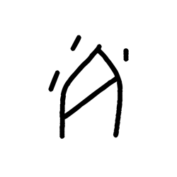

- source_zip_member: `Sub-character Images/zxrxdzrytu/zxrxdzrytu/2rosze4pmd.png`
- checksum_sha256: `ea66006758554cdaf03b177bbd5308485b2c06df93c875fa803f4801ffb0748c`
- review_status: `needs_human_visual_review`
- caution: OBIMD subcharacter image is a source-marked review asset only; it is not a confirmed component form, component assignment, or decipherment conclusion.

## asset-017980

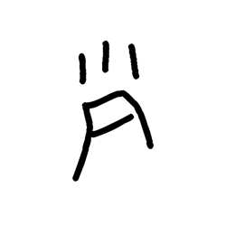

- source_zip_member: `Sub-character Images/zxrxdzrytu/zxrxdzrytu/5f1nezo4mw.png`
- checksum_sha256: `01bdf4b763b05e83815101e4051a2b1f911c02824c45b0f3fb3e2c9507c0e523`
- review_status: `needs_human_visual_review`
- caution: OBIMD subcharacter image is a source-marked review asset only; it is not a confirmed component form, component assignment, or decipherment conclusion.

## asset-017981

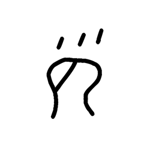

- source_zip_member: `Sub-character Images/zxrxdzrytu/zxrxdzrytu/5sy94fw5d4.png`
- checksum_sha256: `f43275468caa523a91cfae1d2e0a76549dbab14a2bd733fd19d268ec7bac8895`
- review_status: `needs_human_visual_review`
- caution: OBIMD subcharacter image is a source-marked review asset only; it is not a confirmed component form, component assignment, or decipherment conclusion.

## asset-017982

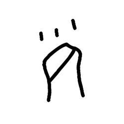

- source_zip_member: `Sub-character Images/zxrxdzrytu/zxrxdzrytu/6lk97nabjd.png`
- checksum_sha256: `0f1a5c40f743053328f941f10e34c3bc726e39eb9f573614e54ab681c0447ba8`
- review_status: `needs_human_visual_review`
- caution: OBIMD subcharacter image is a source-marked review asset only; it is not a confirmed component form, component assignment, or decipherment conclusion.

## asset-017983

- source_zip_member: `Sub-character Images/zxrxdzrytu/zxrxdzrytu/7de43hnee2.png`
- checksum_sha256: `099a0bc8ae38da9db8382df1d1eb088c4dd7b230d6f78c4c0c59f7a8c9bebc0b`
- review_status: `needs_human_visual_review`
- caution: OBIMD subcharacter image is a source-marked review asset only; it is not a confirmed component form, component assignment, or decipherment conclusion.

## asset-017984

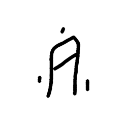

- source_zip_member: `Sub-character Images/zxrxdzrytu/zxrxdzrytu/8tj3eo5328.png`
- checksum_sha256: `f2f4cfe915b07878738cf3c9361d7ae9d6a70303a004812e8540443a57b0d867`
- review_status: `needs_human_visual_review`
- caution: OBIMD subcharacter image is a source-marked review asset only; it is not a confirmed component form, component assignment, or decipherment conclusion.

## asset-017985

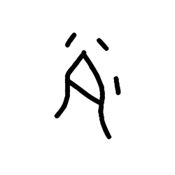

- source_zip_member: `Sub-character Images/zxrxdzrytu/zxrxdzrytu/9hegitkgzs.png`
- checksum_sha256: `65a1a3ec368e08aba35ddde89f3e6958a0a3afebfc57bd311bc97216b34c2c46`
- review_status: `needs_human_visual_review`
- caution: OBIMD subcharacter image is a source-marked review asset only; it is not a confirmed component form, component assignment, or decipherment conclusion.

## asset-017986

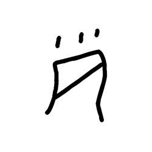

- source_zip_member: `Sub-character Images/zxrxdzrytu/zxrxdzrytu/cyz8g1put4.png`
- checksum_sha256: `38908ec778e6a7eab3870fb10a0caafdbf6402f2766bd5fb9916fe238a97c803`
- review_status: `needs_human_visual_review`
- caution: OBIMD subcharacter image is a source-marked review asset only; it is not a confirmed component form, component assignment, or decipherment conclusion.

## asset-017987

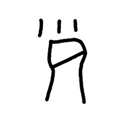

- source_zip_member: `Sub-character Images/zxrxdzrytu/zxrxdzrytu/izdhkbcv1u.png`
- checksum_sha256: `a17475c939c13d199339ed4bf3a5e033c5061aa1869d47786bc35ed9af328b0e`
- review_status: `needs_human_visual_review`
- caution: OBIMD subcharacter image is a source-marked review asset only; it is not a confirmed component form, component assignment, or decipherment conclusion.

## asset-017988

- source_zip_member: `Sub-character Images/zxrxdzrytu/zxrxdzrytu/jrpvnqsyqv.png`
- checksum_sha256: `0c63d9f6131121855d6b09b87daf83c45973b8fa3b4124e2a20c9f47083879c7`
- review_status: `needs_human_visual_review`
- caution: OBIMD subcharacter image is a source-marked review asset only; it is not a confirmed component form, component assignment, or decipherment conclusion.

## asset-017989

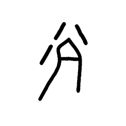

- source_zip_member: `Sub-character Images/zxrxdzrytu/zxrxdzrytu/kvgnzcgbsg.png`
- checksum_sha256: `0a4d06023950adf8c07a0b65c2ebfe911a8909971b9940f75a4476fa2185a78e`
- review_status: `needs_human_visual_review`
- caution: OBIMD subcharacter image is a source-marked review asset only; it is not a confirmed component form, component assignment, or decipherment conclusion.

## asset-017990

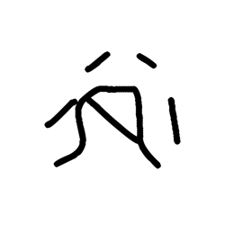

- source_zip_member: `Sub-character Images/zxrxdzrytu/zxrxdzrytu/nbq8n92p86.png`
- checksum_sha256: `e760275ee2c9b9c86e7f335128d091e44d6641a3a425015659b8b0b3a00372a5`
- review_status: `needs_human_visual_review`
- caution: OBIMD subcharacter image is a source-marked review asset only; it is not a confirmed component form, component assignment, or decipherment conclusion.

## asset-017991

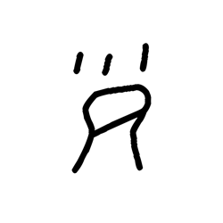

- source_zip_member: `Sub-character Images/zxrxdzrytu/zxrxdzrytu/nczojgo7o6.png`
- checksum_sha256: `edc1da2925237aeb5dea733077a2468adea8948347380e803068d5f66a0c4abe`
- review_status: `needs_human_visual_review`
- caution: OBIMD subcharacter image is a source-marked review asset only; it is not a confirmed component form, component assignment, or decipherment conclusion.

## asset-017992

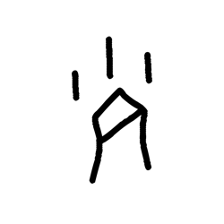

- source_zip_member: `Sub-character Images/zxrxdzrytu/zxrxdzrytu/nicqwe6l11.png`
- checksum_sha256: `5eb0a26c1009b557b2c0906af9fe2631f408de2027679cc46c236bee7f24d26d`
- review_status: `needs_human_visual_review`
- caution: OBIMD subcharacter image is a source-marked review asset only; it is not a confirmed component form, component assignment, or decipherment conclusion.

## asset-017993

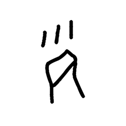

- source_zip_member: `Sub-character Images/zxrxdzrytu/zxrxdzrytu/pofx0ho69d.png`
- checksum_sha256: `d7350ddc6aa4ec80679aacbe4b4fda7248e0acdabbebda62500ace40caf39fc1`
- review_status: `needs_human_visual_review`
- caution: OBIMD subcharacter image is a source-marked review asset only; it is not a confirmed component form, component assignment, or decipherment conclusion.

## asset-017994

- source_zip_member: `Sub-character Images/zxrxdzrytu/zxrxdzrytu/rtgrp7jw3h.png`
- checksum_sha256: `25a33dc88bff539ba3512b6ea194ac980a088b9ef7fb35ad7b5cba95ecfa2e8a`
- review_status: `needs_human_visual_review`
- caution: OBIMD subcharacter image is a source-marked review asset only; it is not a confirmed component form, component assignment, or decipherment conclusion.

## asset-017995

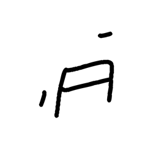

- source_zip_member: `Sub-character Images/zxrxdzrytu/zxrxdzrytu/up72weppyg.png`
- checksum_sha256: `758df4d346d9ef81b8f9539d0b1b65762fb18b7dcd05d8b36723bade0d862710`
- review_status: `needs_human_visual_review`
- caution: OBIMD subcharacter image is a source-marked review asset only; it is not a confirmed component form, component assignment, or decipherment conclusion.

## asset-017996

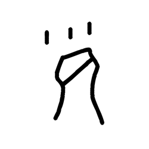

- source_zip_member: `Sub-character Images/zxrxdzrytu/zxrxdzrytu/v11u07xlk7.png`
- checksum_sha256: `832bdfd10bf83a1db8072081d08d6962f757f5c05c3e844b4cd12ce9ce4be305`
- review_status: `needs_human_visual_review`
- caution: OBIMD subcharacter image is a source-marked review asset only; it is not a confirmed component form, component assignment, or decipherment conclusion.

## asset-017997

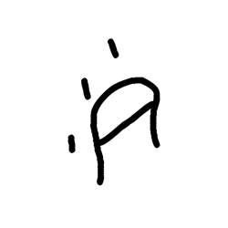

- source_zip_member: `Sub-character Images/zxrxdzrytu/zxrxdzrytu/yhc2mgyn17.png`
- checksum_sha256: `675e098de743baaf8281f78432146336baca79bd6177c8139ed81c8f55e3a887`
- review_status: `needs_human_visual_review`
- caution: OBIMD subcharacter image is a source-marked review asset only; it is not a confirmed component form, component assignment, or decipherment conclusion.

## asset-017998

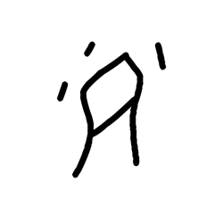

- source_zip_member: `Sub-character Images/zxrxdzrytu/zxrxdzrytu/zsly992rnh.png`
- checksum_sha256: `90e59d2702feee99defd29e465aaefea81e00dd47beaa63a879aab7e94a3a917`
- review_status: `needs_human_visual_review`
- caution: OBIMD subcharacter image is a source-marked review asset only; it is not a confirmed component form, component assignment, or decipherment conclusion.

## asset-017999

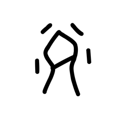

- source_zip_member: `Sub-character Images/zxrxdzrytu/zxrxdzrytu/zxrxdzrytu.png`
- checksum_sha256: `38e3a9a54b70e3f05a03d574b8f4817570e26f75f86d1f6989889c957af3606a`
- review_status: `needs_human_visual_review`
- caution: OBIMD subcharacter image is a source-marked review asset only; it is not a confirmed component form, component assignment, or decipherment conclusion.
