# Component Visual Gallery / 构件图像查看: obs-comp-cand-001818

English:
This page displays OBIMD subcharacter PNG assets extracted into this concrete
corpus object directory for human review.

简体中文：
本页展示抽取到当前具体 corpus 对象目录内的 OBIMD subcharacter PNG 资料，供人工复核使用。

Boundary / 边界：
dataset image candidate only; not a confirmed component form, not a component
assignment, and not a decipherment claim.
- not a confirmed component form
- not a component assignment
- not a decipherment claim

## Concrete Questions To Check / 具体待查问题

- Which local image should be opened first?
- 应先打开哪一张本地构件图像？
- Which source zip member anchors this image?
- 哪一个 source zip member 能定位这张图像？
- Which near-shape or variant comparison is still missing?
- 还缺哪些近形或异体比较？
- Which character or inscription context should be checked next?
- 下一步应核对哪些单字或卜辞上下文？
- What evidence is missing before a component assignment?
- 正式构件归属前还缺哪些证据？

## asset-018039

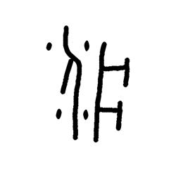

- source_zip_member: `Sub-character Images/qmspt85dhp/qmspt85dhp/03ewn7k71x.png`
- checksum_sha256: see `06_component-visual-index.csv`.
- review_status: `needs_human_visual_review`
- caution: source-marked review image only.

## asset-018040

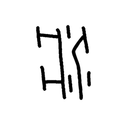

- source_zip_member: `Sub-character Images/qmspt85dhp/qmspt85dhp/0jiu163rf6.png`
- checksum_sha256: see `06_component-visual-index.csv`.
- review_status: `needs_human_visual_review`
- caution: source-marked review image only.

## asset-018041

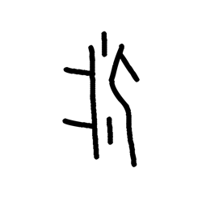

- source_zip_member: `Sub-character Images/qmspt85dhp/qmspt85dhp/16rp6l3wdt.png`
- checksum_sha256: see `06_component-visual-index.csv`.
- review_status: `needs_human_visual_review`
- caution: source-marked review image only.

## asset-018042

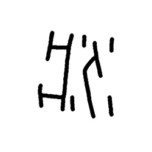

- source_zip_member: `Sub-character Images/qmspt85dhp/qmspt85dhp/2fz5gfha8s.png`
- checksum_sha256: see `06_component-visual-index.csv`.
- review_status: `needs_human_visual_review`
- caution: source-marked review image only.

## asset-018043

- source_zip_member: `Sub-character Images/qmspt85dhp/qmspt85dhp/2syb27qnjw.png`
- checksum_sha256: see `06_component-visual-index.csv`.
- review_status: `needs_human_visual_review`
- caution: source-marked review image only.

## asset-018044

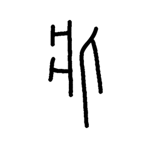

- source_zip_member: `Sub-character Images/qmspt85dhp/qmspt85dhp/37qam23z7o.png`
- checksum_sha256: see `06_component-visual-index.csv`.
- review_status: `needs_human_visual_review`
- caution: source-marked review image only.

## asset-018045

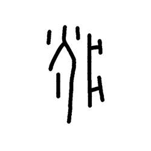

- source_zip_member: `Sub-character Images/qmspt85dhp/qmspt85dhp/3deo9lgdck.png`
- checksum_sha256: see `06_component-visual-index.csv`.
- review_status: `needs_human_visual_review`
- caution: source-marked review image only.

## asset-018046

- source_zip_member: `Sub-character Images/qmspt85dhp/qmspt85dhp/3gqdqkswzs.png`
- checksum_sha256: see `06_component-visual-index.csv`.
- review_status: `needs_human_visual_review`
- caution: source-marked review image only.

## asset-018047

- source_zip_member: `Sub-character Images/qmspt85dhp/qmspt85dhp/3vejv5wyyx.png`
- checksum_sha256: see `06_component-visual-index.csv`.
- review_status: `needs_human_visual_review`
- caution: source-marked review image only.

## asset-018048

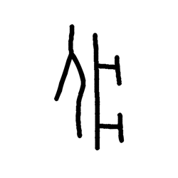

- source_zip_member: `Sub-character Images/qmspt85dhp/qmspt85dhp/3xjgurtmfx.png`
- checksum_sha256: see `06_component-visual-index.csv`.
- review_status: `needs_human_visual_review`
- caution: source-marked review image only.

## asset-018049

- source_zip_member: `Sub-character Images/qmspt85dhp/qmspt85dhp/4g75n9ybfo.png`
- checksum_sha256: see `06_component-visual-index.csv`.
- review_status: `needs_human_visual_review`
- caution: source-marked review image only.

## asset-018050

- source_zip_member: `Sub-character Images/qmspt85dhp/qmspt85dhp/4pu1q03cji.png`
- checksum_sha256: see `06_component-visual-index.csv`.
- review_status: `needs_human_visual_review`
- caution: source-marked review image only.

## asset-018051

- source_zip_member: `Sub-character Images/qmspt85dhp/qmspt85dhp/52wn1s3pjr.png`
- checksum_sha256: see `06_component-visual-index.csv`.
- review_status: `needs_human_visual_review`
- caution: source-marked review image only.

## asset-018052

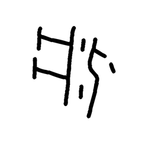

- source_zip_member: `Sub-character Images/qmspt85dhp/qmspt85dhp/55nw2f0xao.png`
- checksum_sha256: see `06_component-visual-index.csv`.
- review_status: `needs_human_visual_review`
- caution: source-marked review image only.

## asset-018053

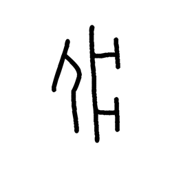

- source_zip_member: `Sub-character Images/qmspt85dhp/qmspt85dhp/5amug41nln.png`
- checksum_sha256: see `06_component-visual-index.csv`.
- review_status: `needs_human_visual_review`
- caution: source-marked review image only.

## asset-018054

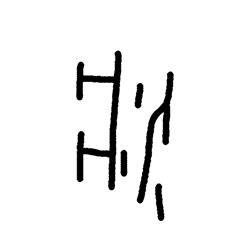

- source_zip_member: `Sub-character Images/qmspt85dhp/qmspt85dhp/5qb3jz0iwa.png`
- checksum_sha256: see `06_component-visual-index.csv`.
- review_status: `needs_human_visual_review`
- caution: source-marked review image only.

## asset-018055

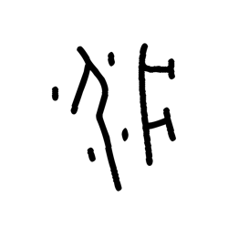

- source_zip_member: `Sub-character Images/qmspt85dhp/qmspt85dhp/6i1qe004fg.png`
- checksum_sha256: see `06_component-visual-index.csv`.
- review_status: `needs_human_visual_review`
- caution: source-marked review image only.

## asset-018056

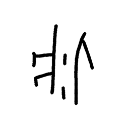

- source_zip_member: `Sub-character Images/qmspt85dhp/qmspt85dhp/6isi4ie84f.png`
- checksum_sha256: see `06_component-visual-index.csv`.
- review_status: `needs_human_visual_review`
- caution: source-marked review image only.

## asset-018057

- source_zip_member: `Sub-character Images/qmspt85dhp/qmspt85dhp/6wabw32e6u.png`
- checksum_sha256: see `06_component-visual-index.csv`.
- review_status: `needs_human_visual_review`
- caution: source-marked review image only.

## asset-018058

- source_zip_member: `Sub-character Images/qmspt85dhp/qmspt85dhp/7d8ra9dnq2.png`
- checksum_sha256: see `06_component-visual-index.csv`.
- review_status: `needs_human_visual_review`
- caution: source-marked review image only.

## asset-018059

- source_zip_member: `Sub-character Images/qmspt85dhp/qmspt85dhp/7n5zmclzqd.png`
- checksum_sha256: see `06_component-visual-index.csv`.
- review_status: `needs_human_visual_review`
- caution: source-marked review image only.

## asset-018060

- source_zip_member: `Sub-character Images/qmspt85dhp/qmspt85dhp/7ohy8n59oe.png`
- checksum_sha256: see `06_component-visual-index.csv`.
- review_status: `needs_human_visual_review`
- caution: source-marked review image only.

## asset-018061

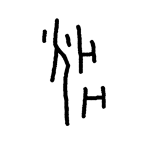

- source_zip_member: `Sub-character Images/qmspt85dhp/qmspt85dhp/7spwpxbbts.png`
- checksum_sha256: see `06_component-visual-index.csv`.
- review_status: `needs_human_visual_review`
- caution: source-marked review image only.

## asset-018062

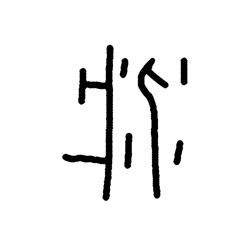

- source_zip_member: `Sub-character Images/qmspt85dhp/qmspt85dhp/7v7hbm02g2.png`
- checksum_sha256: see `06_component-visual-index.csv`.
- review_status: `needs_human_visual_review`
- caution: source-marked review image only.

## asset-018063

- source_zip_member: `Sub-character Images/qmspt85dhp/qmspt85dhp/88pa4xagga.png`
- checksum_sha256: see `06_component-visual-index.csv`.
- review_status: `needs_human_visual_review`
- caution: source-marked review image only.

## asset-018064

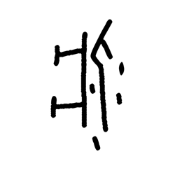

- source_zip_member: `Sub-character Images/qmspt85dhp/qmspt85dhp/89dsq67tle.png`
- checksum_sha256: see `06_component-visual-index.csv`.
- review_status: `needs_human_visual_review`
- caution: source-marked review image only.

## asset-018065

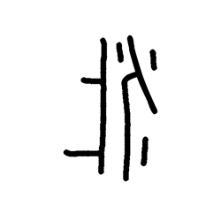

- source_zip_member: `Sub-character Images/qmspt85dhp/qmspt85dhp/8ftlbu5oos.png`
- checksum_sha256: see `06_component-visual-index.csv`.
- review_status: `needs_human_visual_review`
- caution: source-marked review image only.

## asset-018066

- source_zip_member: `Sub-character Images/qmspt85dhp/qmspt85dhp/8h4q1emny4.png`
- checksum_sha256: see `06_component-visual-index.csv`.
- review_status: `needs_human_visual_review`
- caution: source-marked review image only.

## asset-018067

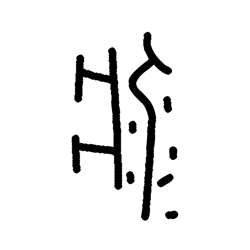

- source_zip_member: `Sub-character Images/qmspt85dhp/qmspt85dhp/8qfrzkgz89.png`
- checksum_sha256: see `06_component-visual-index.csv`.
- review_status: `needs_human_visual_review`
- caution: source-marked review image only.

## asset-018068

- source_zip_member: `Sub-character Images/qmspt85dhp/qmspt85dhp/9dq321xzuh.png`
- checksum_sha256: see `06_component-visual-index.csv`.
- review_status: `needs_human_visual_review`
- caution: source-marked review image only.

## asset-018069

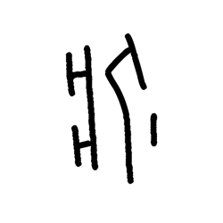

- source_zip_member: `Sub-character Images/qmspt85dhp/qmspt85dhp/9iye3wpj2l.png`
- checksum_sha256: see `06_component-visual-index.csv`.
- review_status: `needs_human_visual_review`
- caution: source-marked review image only.

## asset-018070

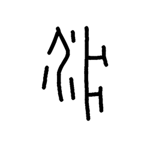

- source_zip_member: `Sub-character Images/qmspt85dhp/qmspt85dhp/9mw6h3kxsb.png`
- checksum_sha256: see `06_component-visual-index.csv`.
- review_status: `needs_human_visual_review`
- caution: source-marked review image only.

## asset-018071

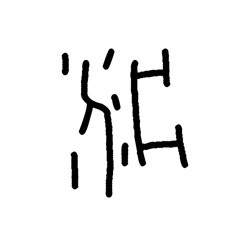

- source_zip_member: `Sub-character Images/qmspt85dhp/qmspt85dhp/9q8ibjyzh9.png`
- checksum_sha256: see `06_component-visual-index.csv`.
- review_status: `needs_human_visual_review`
- caution: source-marked review image only.

## asset-018072

- source_zip_member: `Sub-character Images/qmspt85dhp/qmspt85dhp/b0higlo7yh.png`
- checksum_sha256: see `06_component-visual-index.csv`.
- review_status: `needs_human_visual_review`
- caution: source-marked review image only.

## asset-018073

- source_zip_member: `Sub-character Images/qmspt85dhp/qmspt85dhp/bb047psvzc.png`
- checksum_sha256: see `06_component-visual-index.csv`.
- review_status: `needs_human_visual_review`
- caution: source-marked review image only.

## asset-018074

- source_zip_member: `Sub-character Images/qmspt85dhp/qmspt85dhp/bjnqlo8391.png`
- checksum_sha256: see `06_component-visual-index.csv`.
- review_status: `needs_human_visual_review`
- caution: source-marked review image only.

## asset-018075

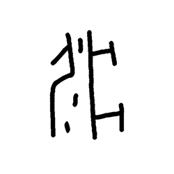

- source_zip_member: `Sub-character Images/qmspt85dhp/qmspt85dhp/c2332plkmu.png`
- checksum_sha256: see `06_component-visual-index.csv`.
- review_status: `needs_human_visual_review`
- caution: source-marked review image only.

## asset-018076

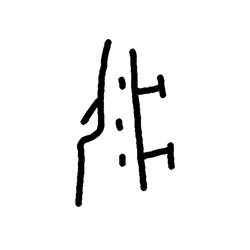

- source_zip_member: `Sub-character Images/qmspt85dhp/qmspt85dhp/ca0famlx0v.png`
- checksum_sha256: see `06_component-visual-index.csv`.
- review_status: `needs_human_visual_review`
- caution: source-marked review image only.

## asset-018077

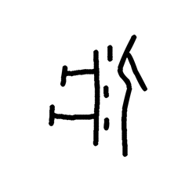

- source_zip_member: `Sub-character Images/qmspt85dhp/qmspt85dhp/cd094n3l2v.png`
- checksum_sha256: see `06_component-visual-index.csv`.
- review_status: `needs_human_visual_review`
- caution: source-marked review image only.

## asset-018078

- source_zip_member: `Sub-character Images/qmspt85dhp/qmspt85dhp/ckacgjbzwo.png`
- checksum_sha256: see `06_component-visual-index.csv`.
- review_status: `needs_human_visual_review`
- caution: source-marked review image only.

## asset-018079

- source_zip_member: `Sub-character Images/qmspt85dhp/qmspt85dhp/cqjinbq71w.png`
- checksum_sha256: see `06_component-visual-index.csv`.
- review_status: `needs_human_visual_review`
- caution: source-marked review image only.

## asset-018080

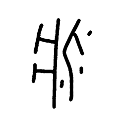

- source_zip_member: `Sub-character Images/qmspt85dhp/qmspt85dhp/crtwxywks2.png`
- checksum_sha256: see `06_component-visual-index.csv`.
- review_status: `needs_human_visual_review`
- caution: source-marked review image only.

## asset-018081

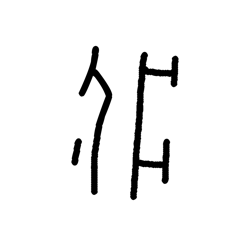

- source_zip_member: `Sub-character Images/qmspt85dhp/qmspt85dhp/cunwjke2aw.png`
- checksum_sha256: see `06_component-visual-index.csv`.
- review_status: `needs_human_visual_review`
- caution: source-marked review image only.

## asset-018082

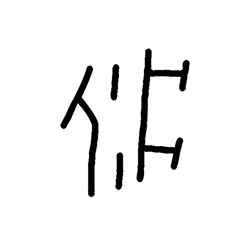

- source_zip_member: `Sub-character Images/qmspt85dhp/qmspt85dhp/dpte86wpwu.png`
- checksum_sha256: see `06_component-visual-index.csv`.
- review_status: `needs_human_visual_review`
- caution: source-marked review image only.

## asset-018083

- source_zip_member: `Sub-character Images/qmspt85dhp/qmspt85dhp/e78zyn8wb0.png`
- checksum_sha256: see `06_component-visual-index.csv`.
- review_status: `needs_human_visual_review`
- caution: source-marked review image only.

## asset-018084

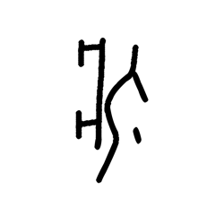

- source_zip_member: `Sub-character Images/qmspt85dhp/qmspt85dhp/e9sikx9e4z.png`
- checksum_sha256: see `06_component-visual-index.csv`.
- review_status: `needs_human_visual_review`
- caution: source-marked review image only.

## asset-018085

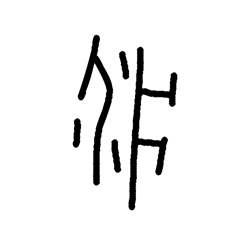

- source_zip_member: `Sub-character Images/qmspt85dhp/qmspt85dhp/ef1ja6p7tc.png`
- checksum_sha256: see `06_component-visual-index.csv`.
- review_status: `needs_human_visual_review`
- caution: source-marked review image only.

## asset-018086

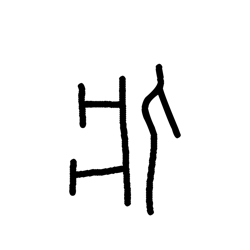

- source_zip_member: `Sub-character Images/qmspt85dhp/qmspt85dhp/ezlz773jxs.png`
- checksum_sha256: see `06_component-visual-index.csv`.
- review_status: `needs_human_visual_review`
- caution: source-marked review image only.

## asset-018087

- source_zip_member: `Sub-character Images/qmspt85dhp/qmspt85dhp/fs732ie47g.png`
- checksum_sha256: see `06_component-visual-index.csv`.
- review_status: `needs_human_visual_review`
- caution: source-marked review image only.

## asset-018088

- source_zip_member: `Sub-character Images/qmspt85dhp/qmspt85dhp/fvpuvf976a.png`
- checksum_sha256: see `06_component-visual-index.csv`.
- review_status: `needs_human_visual_review`
- caution: source-marked review image only.

## asset-018089

- source_zip_member: `Sub-character Images/qmspt85dhp/qmspt85dhp/fvzre7bmtd.png`
- checksum_sha256: see `06_component-visual-index.csv`.
- review_status: `needs_human_visual_review`
- caution: source-marked review image only.

## asset-018090

- source_zip_member: `Sub-character Images/qmspt85dhp/qmspt85dhp/g08f2c8gz5.png`
- checksum_sha256: see `06_component-visual-index.csv`.
- review_status: `needs_human_visual_review`
- caution: source-marked review image only.

## asset-018091

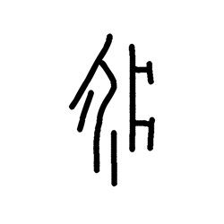

- source_zip_member: `Sub-character Images/qmspt85dhp/qmspt85dhp/g4k7ffrw1h.png`
- checksum_sha256: see `06_component-visual-index.csv`.
- review_status: `needs_human_visual_review`
- caution: source-marked review image only.

## asset-018092

- source_zip_member: `Sub-character Images/qmspt85dhp/qmspt85dhp/gpl1boeyj2.png`
- checksum_sha256: see `06_component-visual-index.csv`.
- review_status: `needs_human_visual_review`
- caution: source-marked review image only.

## asset-018093

- source_zip_member: `Sub-character Images/qmspt85dhp/qmspt85dhp/gvy1y386il.png`
- checksum_sha256: see `06_component-visual-index.csv`.
- review_status: `needs_human_visual_review`
- caution: source-marked review image only.

## asset-018094

- source_zip_member: `Sub-character Images/qmspt85dhp/qmspt85dhp/h426sqxff2.png`
- checksum_sha256: see `06_component-visual-index.csv`.
- review_status: `needs_human_visual_review`
- caution: source-marked review image only.

## asset-018095

- source_zip_member: `Sub-character Images/qmspt85dhp/qmspt85dhp/h44j5z54k2.png`
- checksum_sha256: see `06_component-visual-index.csv`.
- review_status: `needs_human_visual_review`
- caution: source-marked review image only.

## asset-018096

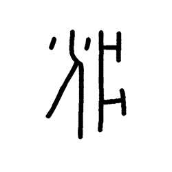

- source_zip_member: `Sub-character Images/qmspt85dhp/qmspt85dhp/hc8l8jry4c.png`
- checksum_sha256: see `06_component-visual-index.csv`.
- review_status: `needs_human_visual_review`
- caution: source-marked review image only.

## asset-018097

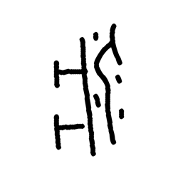

- source_zip_member: `Sub-character Images/qmspt85dhp/qmspt85dhp/hi7hdv8hc8.png`
- checksum_sha256: see `06_component-visual-index.csv`.
- review_status: `needs_human_visual_review`
- caution: source-marked review image only.

## asset-018098

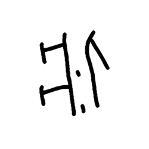

- source_zip_member: `Sub-character Images/qmspt85dhp/qmspt85dhp/i1nj1zj86b.png`
- checksum_sha256: see `06_component-visual-index.csv`.
- review_status: `needs_human_visual_review`
- caution: source-marked review image only.

## asset-018099

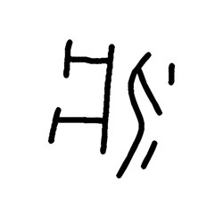

- source_zip_member: `Sub-character Images/qmspt85dhp/qmspt85dhp/ig8wfsujrg.png`
- checksum_sha256: see `06_component-visual-index.csv`.
- review_status: `needs_human_visual_review`
- caution: source-marked review image only.

## asset-018100

- source_zip_member: `Sub-character Images/qmspt85dhp/qmspt85dhp/iiqtdsmmrc.png`
- checksum_sha256: see `06_component-visual-index.csv`.
- review_status: `needs_human_visual_review`
- caution: source-marked review image only.

## asset-018101

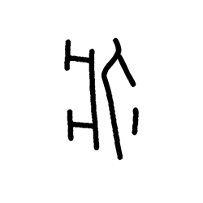

- source_zip_member: `Sub-character Images/qmspt85dhp/qmspt85dhp/isbiavchvl.png`
- checksum_sha256: see `06_component-visual-index.csv`.
- review_status: `needs_human_visual_review`
- caution: source-marked review image only.

## asset-018102

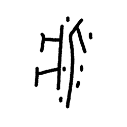

- source_zip_member: `Sub-character Images/qmspt85dhp/qmspt85dhp/isnewn42l5.png`
- checksum_sha256: see `06_component-visual-index.csv`.
- review_status: `needs_human_visual_review`
- caution: source-marked review image only.

## asset-018103

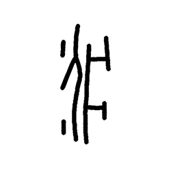

- source_zip_member: `Sub-character Images/qmspt85dhp/qmspt85dhp/ityvld3bwn.png`
- checksum_sha256: see `06_component-visual-index.csv`.
- review_status: `needs_human_visual_review`
- caution: source-marked review image only.

## asset-018104

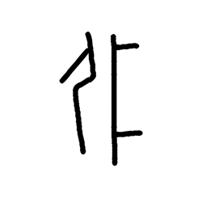

- source_zip_member: `Sub-character Images/qmspt85dhp/qmspt85dhp/juor1p3ceo.png`
- checksum_sha256: see `06_component-visual-index.csv`.
- review_status: `needs_human_visual_review`
- caution: source-marked review image only.

## asset-018105

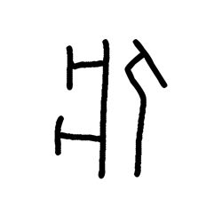

- source_zip_member: `Sub-character Images/qmspt85dhp/qmspt85dhp/kbww5w54v7.png`
- checksum_sha256: see `06_component-visual-index.csv`.
- review_status: `needs_human_visual_review`
- caution: source-marked review image only.

## asset-018106

- source_zip_member: `Sub-character Images/qmspt85dhp/qmspt85dhp/l4q48hnjhq.png`
- checksum_sha256: see `06_component-visual-index.csv`.
- review_status: `needs_human_visual_review`
- caution: source-marked review image only.

## asset-018107

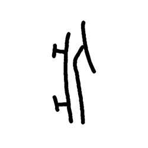

- source_zip_member: `Sub-character Images/qmspt85dhp/qmspt85dhp/l7gpnfhffd.png`
- checksum_sha256: see `06_component-visual-index.csv`.
- review_status: `needs_human_visual_review`
- caution: source-marked review image only.

## asset-018108

- source_zip_member: `Sub-character Images/qmspt85dhp/qmspt85dhp/lmco3y56md.png`
- checksum_sha256: see `06_component-visual-index.csv`.
- review_status: `needs_human_visual_review`
- caution: source-marked review image only.

## asset-018109

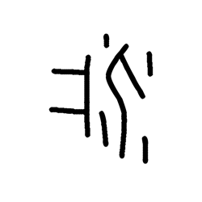

- source_zip_member: `Sub-character Images/qmspt85dhp/qmspt85dhp/lpu4urj4ja.png`
- checksum_sha256: see `06_component-visual-index.csv`.
- review_status: `needs_human_visual_review`
- caution: source-marked review image only.

## asset-018110

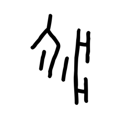

- source_zip_member: `Sub-character Images/qmspt85dhp/qmspt85dhp/lqtouf0k6o.png`
- checksum_sha256: see `06_component-visual-index.csv`.
- review_status: `needs_human_visual_review`
- caution: source-marked review image only.

## asset-018111

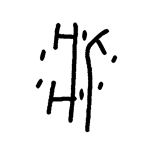

- source_zip_member: `Sub-character Images/qmspt85dhp/qmspt85dhp/lr9zqpm1sl.png`
- checksum_sha256: see `06_component-visual-index.csv`.
- review_status: `needs_human_visual_review`
- caution: source-marked review image only.

## asset-018112

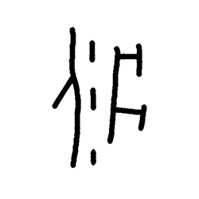

- source_zip_member: `Sub-character Images/qmspt85dhp/qmspt85dhp/ly20au64pw.png`
- checksum_sha256: see `06_component-visual-index.csv`.
- review_status: `needs_human_visual_review`
- caution: source-marked review image only.

## asset-018113

- source_zip_member: `Sub-character Images/qmspt85dhp/qmspt85dhp/m3yjvcvfj5.png`
- checksum_sha256: see `06_component-visual-index.csv`.
- review_status: `needs_human_visual_review`
- caution: source-marked review image only.

## asset-018114

- source_zip_member: `Sub-character Images/qmspt85dhp/qmspt85dhp/mbobe0dpd6.png`
- checksum_sha256: see `06_component-visual-index.csv`.
- review_status: `needs_human_visual_review`
- caution: source-marked review image only.

## asset-018115

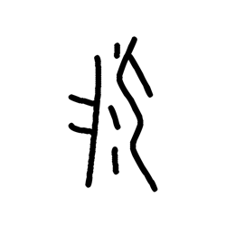

- source_zip_member: `Sub-character Images/qmspt85dhp/qmspt85dhp/mzav6wqpap.png`
- checksum_sha256: see `06_component-visual-index.csv`.
- review_status: `needs_human_visual_review`
- caution: source-marked review image only.

## asset-018116

- source_zip_member: `Sub-character Images/qmspt85dhp/qmspt85dhp/ntky4kngn9.png`
- checksum_sha256: see `06_component-visual-index.csv`.
- review_status: `needs_human_visual_review`
- caution: source-marked review image only.

## asset-018117

- source_zip_member: `Sub-character Images/qmspt85dhp/qmspt85dhp/nwn8as27t2.png`
- checksum_sha256: see `06_component-visual-index.csv`.
- review_status: `needs_human_visual_review`
- caution: source-marked review image only.

## asset-018118

- source_zip_member: `Sub-character Images/qmspt85dhp/qmspt85dhp/olby5hfps5.png`
- checksum_sha256: see `06_component-visual-index.csv`.
- review_status: `needs_human_visual_review`
- caution: source-marked review image only.

## asset-018119

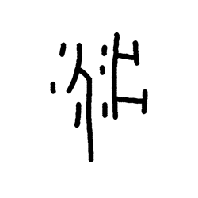

- source_zip_member: `Sub-character Images/qmspt85dhp/qmspt85dhp/p3oeg9dvva.png`
- checksum_sha256: see `06_component-visual-index.csv`.
- review_status: `needs_human_visual_review`
- caution: source-marked review image only.

## asset-018120

- source_zip_member: `Sub-character Images/qmspt85dhp/qmspt85dhp/pc1yrm95uw.png`
- checksum_sha256: see `06_component-visual-index.csv`.
- review_status: `needs_human_visual_review`
- caution: source-marked review image only.

## asset-018121

- source_zip_member: `Sub-character Images/qmspt85dhp/qmspt85dhp/pfwjzjj7lt.png`
- checksum_sha256: see `06_component-visual-index.csv`.
- review_status: `needs_human_visual_review`
- caution: source-marked review image only.

## asset-018122

- source_zip_member: `Sub-character Images/qmspt85dhp/qmspt85dhp/pzfje057xe.png`
- checksum_sha256: see `06_component-visual-index.csv`.
- review_status: `needs_human_visual_review`
- caution: source-marked review image only.

## asset-018123

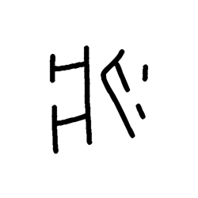

- source_zip_member: `Sub-character Images/qmspt85dhp/qmspt85dhp/q20zds8d51.png`
- checksum_sha256: see `06_component-visual-index.csv`.
- review_status: `needs_human_visual_review`
- caution: source-marked review image only.

## asset-018124

- source_zip_member: `Sub-character Images/qmspt85dhp/qmspt85dhp/qbc7mucd2d.png`
- checksum_sha256: see `06_component-visual-index.csv`.
- review_status: `needs_human_visual_review`
- caution: source-marked review image only.

## asset-018125

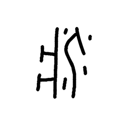

- source_zip_member: `Sub-character Images/qmspt85dhp/qmspt85dhp/qdfhplu7gq.png`
- checksum_sha256: see `06_component-visual-index.csv`.
- review_status: `needs_human_visual_review`
- caution: source-marked review image only.

## asset-018126

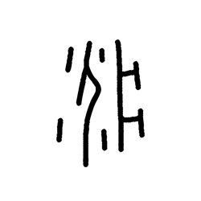

- source_zip_member: `Sub-character Images/qmspt85dhp/qmspt85dhp/qk1l8ycgfg.png`
- checksum_sha256: see `06_component-visual-index.csv`.
- review_status: `needs_human_visual_review`
- caution: source-marked review image only.

## asset-018127

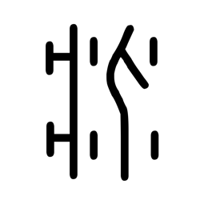

- source_zip_member: `Sub-character Images/qmspt85dhp/qmspt85dhp/qmspt85dhp.png`
- checksum_sha256: see `06_component-visual-index.csv`.
- review_status: `needs_human_visual_review`
- caution: source-marked review image only.

## asset-018128

- source_zip_member: `Sub-character Images/qmspt85dhp/qmspt85dhp/qpy03dwags.png`
- checksum_sha256: see `06_component-visual-index.csv`.
- review_status: `needs_human_visual_review`
- caution: source-marked review image only.

## asset-018129

- source_zip_member: `Sub-character Images/qmspt85dhp/qmspt85dhp/qum1v22g3f.png`
- checksum_sha256: see `06_component-visual-index.csv`.
- review_status: `needs_human_visual_review`
- caution: source-marked review image only.

## asset-018130

- source_zip_member: `Sub-character Images/qmspt85dhp/qmspt85dhp/slw1uhkhei.png`
- checksum_sha256: see `06_component-visual-index.csv`.
- review_status: `needs_human_visual_review`
- caution: source-marked review image only.

## asset-018131

- source_zip_member: `Sub-character Images/qmspt85dhp/qmspt85dhp/ss9amvste2.png`
- checksum_sha256: see `06_component-visual-index.csv`.
- review_status: `needs_human_visual_review`
- caution: source-marked review image only.

## asset-018132

- source_zip_member: `Sub-character Images/qmspt85dhp/qmspt85dhp/tqoq2y24tz.png`
- checksum_sha256: see `06_component-visual-index.csv`.
- review_status: `needs_human_visual_review`
- caution: source-marked review image only.

## asset-018133

- source_zip_member: `Sub-character Images/qmspt85dhp/qmspt85dhp/u4434b7lmh.png`
- checksum_sha256: see `06_component-visual-index.csv`.
- review_status: `needs_human_visual_review`
- caution: source-marked review image only.

## asset-018134

- source_zip_member: `Sub-character Images/qmspt85dhp/qmspt85dhp/ugmudn66uo.png`
- checksum_sha256: see `06_component-visual-index.csv`.
- review_status: `needs_human_visual_review`
- caution: source-marked review image only.

## asset-018135

- source_zip_member: `Sub-character Images/qmspt85dhp/qmspt85dhp/v8qrmxnzzr.png`
- checksum_sha256: see `06_component-visual-index.csv`.
- review_status: `needs_human_visual_review`
- caution: source-marked review image only.

## asset-018136

- source_zip_member: `Sub-character Images/qmspt85dhp/qmspt85dhp/vf7l00pewh.png`
- checksum_sha256: see `06_component-visual-index.csv`.
- review_status: `needs_human_visual_review`
- caution: source-marked review image only.

## asset-018137

- source_zip_member: `Sub-character Images/qmspt85dhp/qmspt85dhp/vvkai6zbfu.png`
- checksum_sha256: see `06_component-visual-index.csv`.
- review_status: `needs_human_visual_review`
- caution: source-marked review image only.

## asset-018138

- source_zip_member: `Sub-character Images/qmspt85dhp/qmspt85dhp/vzfar1pt09.png`
- checksum_sha256: see `06_component-visual-index.csv`.
- review_status: `needs_human_visual_review`
- caution: source-marked review image only.

## asset-018139

- source_zip_member: `Sub-character Images/qmspt85dhp/qmspt85dhp/wauunbzqfo.png`
- checksum_sha256: see `06_component-visual-index.csv`.
- review_status: `needs_human_visual_review`
- caution: source-marked review image only.

## asset-018140

- source_zip_member: `Sub-character Images/qmspt85dhp/qmspt85dhp/wdj21u4drj.png`
- checksum_sha256: see `06_component-visual-index.csv`.
- review_status: `needs_human_visual_review`
- caution: source-marked review image only.

## asset-018141

- source_zip_member: `Sub-character Images/qmspt85dhp/qmspt85dhp/wlkeuan1ij.png`
- checksum_sha256: see `06_component-visual-index.csv`.
- review_status: `needs_human_visual_review`
- caution: source-marked review image only.

## asset-018142

- source_zip_member: `Sub-character Images/qmspt85dhp/qmspt85dhp/wwrhjdzrn9.png`
- checksum_sha256: see `06_component-visual-index.csv`.
- review_status: `needs_human_visual_review`
- caution: source-marked review image only.

## asset-018143

- source_zip_member: `Sub-character Images/qmspt85dhp/qmspt85dhp/xizkt7qkgv.png`
- checksum_sha256: see `06_component-visual-index.csv`.
- review_status: `needs_human_visual_review`
- caution: source-marked review image only.

## asset-018144

- source_zip_member: `Sub-character Images/qmspt85dhp/qmspt85dhp/zeoaxk2f1q.png`
- checksum_sha256: see `06_component-visual-index.csv`.
- review_status: `needs_human_visual_review`
- caution: source-marked review image only.
