# Component Visual Gallery / 构件图像查看: obs-comp-cand-001837

English:
This page displays OBIMD subcharacter PNG assets extracted into this concrete
corpus object directory for human review.

简体中文：
本页展示抽取到当前具体 corpus 对象目录内的 OBIMD subcharacter PNG 资料，供人工复核使用。

Boundary / 边界：
dataset image candidate only; not a confirmed component form, not a component
assignment, and not a decipherment claim.
- not a confirmed component form
- not a component assignment
- not a decipherment claim

## Concrete Questions To Check / 具体待查问题

- Open 06_component-visual-index.csv and name the local image row.
- 打开 06_component-visual-index.csv，写明本地图像行。
- Open 09_component-visual-route-index.csv and name the source route row.
- 打开 09_component-visual-route-index.csv，写明来源路线行。
- Open 13_component-context-evidence-dossier.md for character context.
- 打开 13_component-context-evidence-dossier.md，核对单字与卜辞上下文。
- Record the missing image, near-shape, source, or context route.
- 记录缺失的图像、近形、来源或上下文路线。

## asset-018163

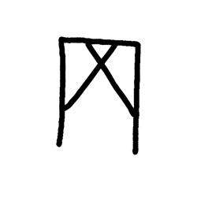

- source_zip_member: `Sub-character Images/lp8x647qo2/lp8x647qo2/05mqsb5ieu.png`
- checksum_sha256: see `06_component-visual-index.csv`.
- review_status: `needs_human_visual_review`
- caution: source-marked review image only.

## asset-018164

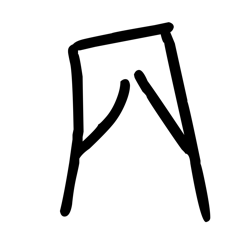

- source_zip_member: `Sub-character Images/lp8x647qo2/lp8x647qo2/1tamchlwdw.png`
- checksum_sha256: see `06_component-visual-index.csv`.
- review_status: `needs_human_visual_review`
- caution: source-marked review image only.

## asset-018165

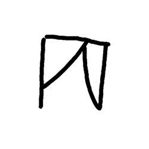

- source_zip_member: `Sub-character Images/lp8x647qo2/lp8x647qo2/2ce833qr72.png`
- checksum_sha256: see `06_component-visual-index.csv`.
- review_status: `needs_human_visual_review`
- caution: source-marked review image only.

## asset-018166

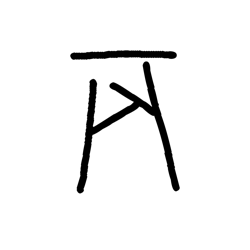

- source_zip_member: `Sub-character Images/lp8x647qo2/lp8x647qo2/2hlddwvshf.png`
- checksum_sha256: see `06_component-visual-index.csv`.
- review_status: `needs_human_visual_review`
- caution: source-marked review image only.

## asset-018167

- source_zip_member: `Sub-character Images/lp8x647qo2/lp8x647qo2/2pnszpo8kd.png`
- checksum_sha256: see `06_component-visual-index.csv`.
- review_status: `needs_human_visual_review`
- caution: source-marked review image only.

## asset-018168

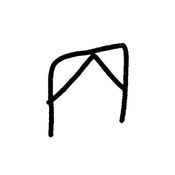

- source_zip_member: `Sub-character Images/lp8x647qo2/lp8x647qo2/2tz999v2pz.png`
- checksum_sha256: see `06_component-visual-index.csv`.
- review_status: `needs_human_visual_review`
- caution: source-marked review image only.

## asset-018169

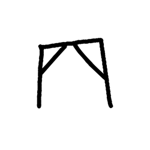

- source_zip_member: `Sub-character Images/lp8x647qo2/lp8x647qo2/3r4vizenez.png`
- checksum_sha256: see `06_component-visual-index.csv`.
- review_status: `needs_human_visual_review`
- caution: source-marked review image only.

## asset-018170

- source_zip_member: `Sub-character Images/lp8x647qo2/lp8x647qo2/452r0vketk.png`
- checksum_sha256: see `06_component-visual-index.csv`.
- review_status: `needs_human_visual_review`
- caution: source-marked review image only.

## asset-018171

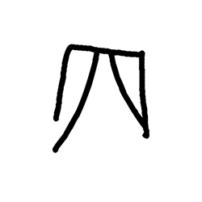

- source_zip_member: `Sub-character Images/lp8x647qo2/lp8x647qo2/4ac8gpau8v.png`
- checksum_sha256: see `06_component-visual-index.csv`.
- review_status: `needs_human_visual_review`
- caution: source-marked review image only.

## asset-018172

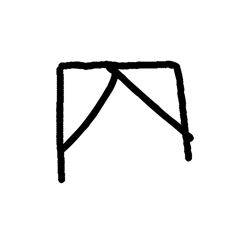

- source_zip_member: `Sub-character Images/lp8x647qo2/lp8x647qo2/4u4fc3aqlx.png`
- checksum_sha256: see `06_component-visual-index.csv`.
- review_status: `needs_human_visual_review`
- caution: source-marked review image only.

## asset-018173

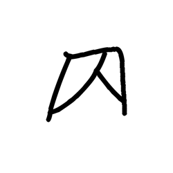

- source_zip_member: `Sub-character Images/lp8x647qo2/lp8x647qo2/5bnsncj5o0.png`
- checksum_sha256: see `06_component-visual-index.csv`.
- review_status: `needs_human_visual_review`
- caution: source-marked review image only.

## asset-018174

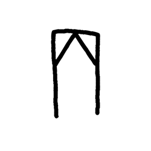

- source_zip_member: `Sub-character Images/lp8x647qo2/lp8x647qo2/6u9ie3v27a.png`
- checksum_sha256: see `06_component-visual-index.csv`.
- review_status: `needs_human_visual_review`
- caution: source-marked review image only.

## asset-018175

- source_zip_member: `Sub-character Images/lp8x647qo2/lp8x647qo2/6vscpspmk4.png`
- checksum_sha256: see `06_component-visual-index.csv`.
- review_status: `needs_human_visual_review`
- caution: source-marked review image only.

## asset-018176

- source_zip_member: `Sub-character Images/lp8x647qo2/lp8x647qo2/7jqe0knar6.png`
- checksum_sha256: see `06_component-visual-index.csv`.
- review_status: `needs_human_visual_review`
- caution: source-marked review image only.

## asset-018177

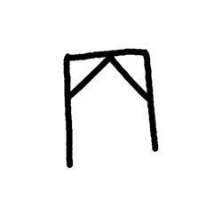

- source_zip_member: `Sub-character Images/lp8x647qo2/lp8x647qo2/7szkv7cb99.png`
- checksum_sha256: see `06_component-visual-index.csv`.
- review_status: `needs_human_visual_review`
- caution: source-marked review image only.

## asset-018178

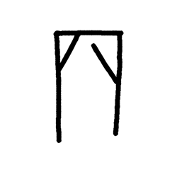

- source_zip_member: `Sub-character Images/lp8x647qo2/lp8x647qo2/80v1lqmdlm.png`
- checksum_sha256: see `06_component-visual-index.csv`.
- review_status: `needs_human_visual_review`
- caution: source-marked review image only.

## asset-018179

- source_zip_member: `Sub-character Images/lp8x647qo2/lp8x647qo2/bgjf0uyxym.png`
- checksum_sha256: see `06_component-visual-index.csv`.
- review_status: `needs_human_visual_review`
- caution: source-marked review image only.

## asset-018180

- source_zip_member: `Sub-character Images/lp8x647qo2/lp8x647qo2/buvjucw4gu.png`
- checksum_sha256: see `06_component-visual-index.csv`.
- review_status: `needs_human_visual_review`
- caution: source-marked review image only.

## asset-018181

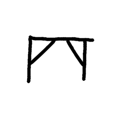

- source_zip_member: `Sub-character Images/lp8x647qo2/lp8x647qo2/dg9db6lvsr.png`
- checksum_sha256: see `06_component-visual-index.csv`.
- review_status: `needs_human_visual_review`
- caution: source-marked review image only.

## asset-018182

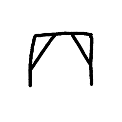

- source_zip_member: `Sub-character Images/lp8x647qo2/lp8x647qo2/dq13bsqjwl.png`
- checksum_sha256: see `06_component-visual-index.csv`.
- review_status: `needs_human_visual_review`
- caution: source-marked review image only.

## asset-018183

- source_zip_member: `Sub-character Images/lp8x647qo2/lp8x647qo2/e1556lmuup.png`
- checksum_sha256: see `06_component-visual-index.csv`.
- review_status: `needs_human_visual_review`
- caution: source-marked review image only.

## asset-018184

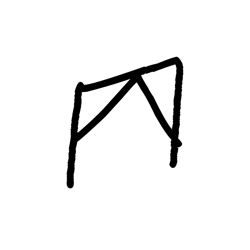

- source_zip_member: `Sub-character Images/lp8x647qo2/lp8x647qo2/e7dir4l4dw.png`
- checksum_sha256: see `06_component-visual-index.csv`.
- review_status: `needs_human_visual_review`
- caution: source-marked review image only.

## asset-018185

- source_zip_member: `Sub-character Images/lp8x647qo2/lp8x647qo2/es6xwpn23b.png`
- checksum_sha256: see `06_component-visual-index.csv`.
- review_status: `needs_human_visual_review`
- caution: source-marked review image only.

## asset-018186

- source_zip_member: `Sub-character Images/lp8x647qo2/lp8x647qo2/i1wcwmk4mh.png`
- checksum_sha256: see `06_component-visual-index.csv`.
- review_status: `needs_human_visual_review`
- caution: source-marked review image only.

## asset-018187

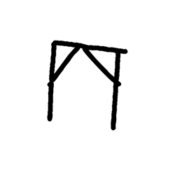

- source_zip_member: `Sub-character Images/lp8x647qo2/lp8x647qo2/iknoour2dy.png`
- checksum_sha256: see `06_component-visual-index.csv`.
- review_status: `needs_human_visual_review`
- caution: source-marked review image only.

## asset-018188

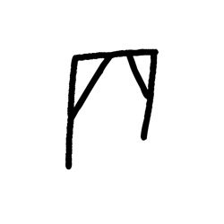

- source_zip_member: `Sub-character Images/lp8x647qo2/lp8x647qo2/isnmzodm0e.png`
- checksum_sha256: see `06_component-visual-index.csv`.
- review_status: `needs_human_visual_review`
- caution: source-marked review image only.

## asset-018189

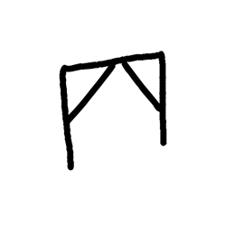

- source_zip_member: `Sub-character Images/lp8x647qo2/lp8x647qo2/nme7fpb4yk.png`
- checksum_sha256: see `06_component-visual-index.csv`.
- review_status: `needs_human_visual_review`
- caution: source-marked review image only.

## asset-018190

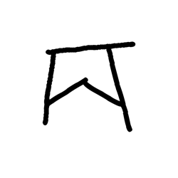

- source_zip_member: `Sub-character Images/lp8x647qo2/lp8x647qo2/os0yoxjam9.png`
- checksum_sha256: see `06_component-visual-index.csv`.
- review_status: `needs_human_visual_review`
- caution: source-marked review image only.

## asset-018191

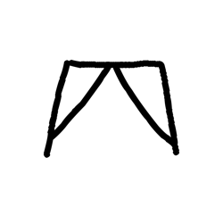

- source_zip_member: `Sub-character Images/lp8x647qo2/lp8x647qo2/qnlpqvv58x.png`
- checksum_sha256: see `06_component-visual-index.csv`.
- review_status: `needs_human_visual_review`
- caution: source-marked review image only.

## asset-018192

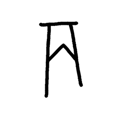

- source_zip_member: `Sub-character Images/lp8x647qo2/lp8x647qo2/rkrs3uyve3.png`
- checksum_sha256: see `06_component-visual-index.csv`.
- review_status: `needs_human_visual_review`
- caution: source-marked review image only.

## asset-018193

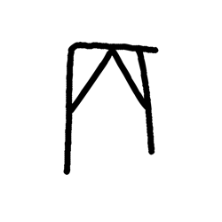

- source_zip_member: `Sub-character Images/lp8x647qo2/lp8x647qo2/traf8ebedw.png`
- checksum_sha256: see `06_component-visual-index.csv`.
- review_status: `needs_human_visual_review`
- caution: source-marked review image only.

## asset-018194

- source_zip_member: `Sub-character Images/lp8x647qo2/lp8x647qo2/tv9rawdiy0.png`
- checksum_sha256: see `06_component-visual-index.csv`.
- review_status: `needs_human_visual_review`
- caution: source-marked review image only.

## asset-018195

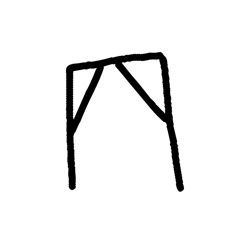

- source_zip_member: `Sub-character Images/lp8x647qo2/lp8x647qo2/u3atgpux9k.png`
- checksum_sha256: see `06_component-visual-index.csv`.
- review_status: `needs_human_visual_review`
- caution: source-marked review image only.

## asset-018196

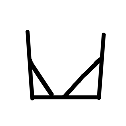

- source_zip_member: `Sub-character Images/lp8x647qo2/lp8x647qo2/u8iosxd2l6.png`
- checksum_sha256: see `06_component-visual-index.csv`.
- review_status: `needs_human_visual_review`
- caution: source-marked review image only.

## asset-018197

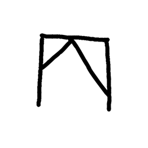

- source_zip_member: `Sub-character Images/lp8x647qo2/lp8x647qo2/ug2m09jkv6.png`
- checksum_sha256: see `06_component-visual-index.csv`.
- review_status: `needs_human_visual_review`
- caution: source-marked review image only.

## asset-018198

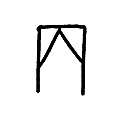

- source_zip_member: `Sub-character Images/lp8x647qo2/lp8x647qo2/yj4h4n9r4m.png`
- checksum_sha256: see `06_component-visual-index.csv`.
- review_status: `needs_human_visual_review`
- caution: source-marked review image only.
