# Component Visual Gallery / 构件图像查看: obs-comp-cand-001849

English:
This page displays OBIMD subcharacter PNG assets extracted into this concrete
corpus object directory for human review.

简体中文：
本页展示抽取到当前具体 corpus 对象目录内的 OBIMD subcharacter PNG 资料，供人工复核使用。

Boundary / 边界：
dataset image candidate only; not a confirmed component form, not a component
assignment, and not a decipherment claim.
- not a confirmed component form
- not a component assignment
- not a decipherment claim

## Concrete Questions To Check / 具体待查问题

- Which local image should be opened first?
- 应先打开哪一张本地构件图像？
- Which source zip member anchors this image?
- 哪一个 source zip member 能定位这张图像？
- Which near-shape or variant comparison is still missing?
- 还缺哪些近形或异体比较？
- Which character or inscription context should be checked next?
- 下一步应核对哪些单字或卜辞上下文？
- What evidence is missing before a component assignment?
- 正式构件归属前还缺哪些证据？

## asset-018210

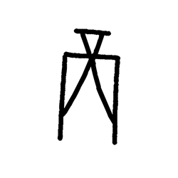

- source_zip_member: `Sub-character Images/mgs4xhu5g3/7rrg9g19pp/2djat6w4dx.png`
- checksum_sha256: see `06_component-visual-index.csv`.
- review_status: `needs_human_visual_review`
- caution: source-marked review image only.

## asset-018211

- source_zip_member: `Sub-character Images/mgs4xhu5g3/7rrg9g19pp/2q96z4zna4.png`
- checksum_sha256: see `06_component-visual-index.csv`.
- review_status: `needs_human_visual_review`
- caution: source-marked review image only.

## asset-018212

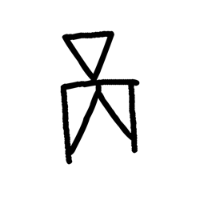

- source_zip_member: `Sub-character Images/mgs4xhu5g3/7rrg9g19pp/2y3r413wjm.png`
- checksum_sha256: see `06_component-visual-index.csv`.
- review_status: `needs_human_visual_review`
- caution: source-marked review image only.

## asset-018213

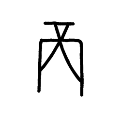

- source_zip_member: `Sub-character Images/mgs4xhu5g3/7rrg9g19pp/2yug19nbj3.png`
- checksum_sha256: see `06_component-visual-index.csv`.
- review_status: `needs_human_visual_review`
- caution: source-marked review image only.

## asset-018214

- source_zip_member: `Sub-character Images/mgs4xhu5g3/7rrg9g19pp/64cky5vs4s.png`
- checksum_sha256: see `06_component-visual-index.csv`.
- review_status: `needs_human_visual_review`
- caution: source-marked review image only.

## asset-018215

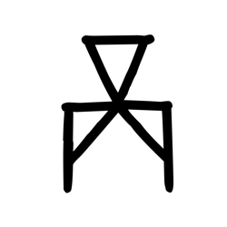

- source_zip_member: `Sub-character Images/mgs4xhu5g3/7rrg9g19pp/7rrg9g19pp.png`
- checksum_sha256: see `06_component-visual-index.csv`.
- review_status: `needs_human_visual_review`
- caution: source-marked review image only.

## asset-018216

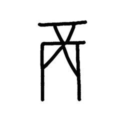

- source_zip_member: `Sub-character Images/mgs4xhu5g3/7rrg9g19pp/arqqqebkzk.png`
- checksum_sha256: see `06_component-visual-index.csv`.
- review_status: `needs_human_visual_review`
- caution: source-marked review image only.

## asset-018217

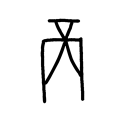

- source_zip_member: `Sub-character Images/mgs4xhu5g3/7rrg9g19pp/azi00y7578.png`
- checksum_sha256: see `06_component-visual-index.csv`.
- review_status: `needs_human_visual_review`
- caution: source-marked review image only.

## asset-018218

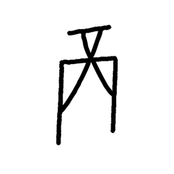

- source_zip_member: `Sub-character Images/mgs4xhu5g3/7rrg9g19pp/c9ky3wb1h5.png`
- checksum_sha256: see `06_component-visual-index.csv`.
- review_status: `needs_human_visual_review`
- caution: source-marked review image only.

## asset-018219

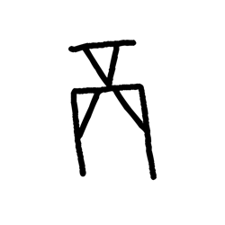

- source_zip_member: `Sub-character Images/mgs4xhu5g3/7rrg9g19pp/d14cmqdrw5.png`
- checksum_sha256: see `06_component-visual-index.csv`.
- review_status: `needs_human_visual_review`
- caution: source-marked review image only.

## asset-018220

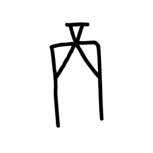

- source_zip_member: `Sub-character Images/mgs4xhu5g3/7rrg9g19pp/fhtjbwry6k.png`
- checksum_sha256: see `06_component-visual-index.csv`.
- review_status: `needs_human_visual_review`
- caution: source-marked review image only.

## asset-018221

- source_zip_member: `Sub-character Images/mgs4xhu5g3/7rrg9g19pp/g96mrn3khe.png`
- checksum_sha256: see `06_component-visual-index.csv`.
- review_status: `needs_human_visual_review`
- caution: source-marked review image only.

## asset-018222

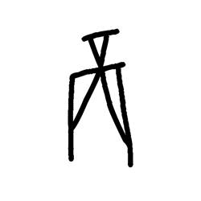

- source_zip_member: `Sub-character Images/mgs4xhu5g3/7rrg9g19pp/l4xmrt7lwx.png`
- checksum_sha256: see `06_component-visual-index.csv`.
- review_status: `needs_human_visual_review`
- caution: source-marked review image only.

## asset-018223

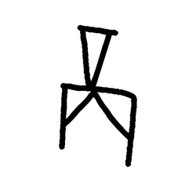

- source_zip_member: `Sub-character Images/mgs4xhu5g3/7rrg9g19pp/njl0l01fxx.png`
- checksum_sha256: see `06_component-visual-index.csv`.
- review_status: `needs_human_visual_review`
- caution: source-marked review image only.

## asset-018224

- source_zip_member: `Sub-character Images/mgs4xhu5g3/7rrg9g19pp/o68dm3noad.png`
- checksum_sha256: see `06_component-visual-index.csv`.
- review_status: `needs_human_visual_review`
- caution: source-marked review image only.

## asset-018225

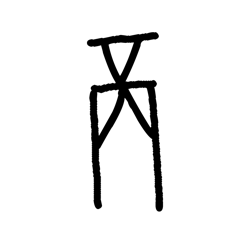

- source_zip_member: `Sub-character Images/mgs4xhu5g3/7rrg9g19pp/qkt24ht7mh.png`
- checksum_sha256: see `06_component-visual-index.csv`.
- review_status: `needs_human_visual_review`
- caution: source-marked review image only.

## asset-018226

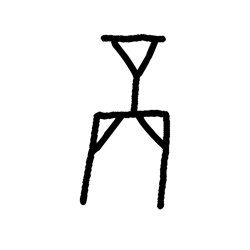

- source_zip_member: `Sub-character Images/mgs4xhu5g3/7rrg9g19pp/xc3pzdl33x.png`
- checksum_sha256: see `06_component-visual-index.csv`.
- review_status: `needs_human_visual_review`
- caution: source-marked review image only.

## asset-018227

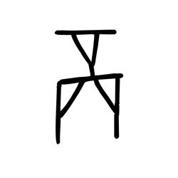

- source_zip_member: `Sub-character Images/mgs4xhu5g3/7rrg9g19pp/y24xjveo8l.png`
- checksum_sha256: see `06_component-visual-index.csv`.
- review_status: `needs_human_visual_review`
- caution: source-marked review image only.

## asset-018228

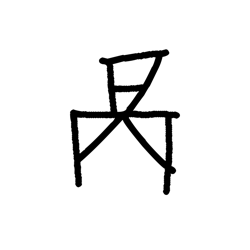

- source_zip_member: `Sub-character Images/mgs4xhu5g3/7rrg9g19pp/ypo9ptml68.png`
- checksum_sha256: see `06_component-visual-index.csv`.
- review_status: `needs_human_visual_review`
- caution: source-marked review image only.
