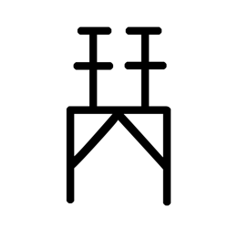

# Component Visual Gallery / 构件图像查看: obs-comp-cand-001852

English:
This page displays OBIMD subcharacter PNG assets extracted into this concrete corpus object directory for human review.

简体中文：
本页展示抽取到当前具体 corpus 对象目录内的 OBIMD subcharacter PNG 资料，供人工复核使用。

Boundary / 边界：dataset image candidate only; not a confirmed component form, component assignment, or decipherment claim.

## asset-018231

- source_zip_member: `Sub-character Images/mgs4xhu5g3/spuy28vjb7/spuy28vjb7.png`
- checksum_sha256: `e69333f32993204fd363935c9f34bbda11ef2c4f04e9283a4bf6f546e3658587`
- review_status: `needs_human_visual_review`
- caution: OBIMD subcharacter image is a source-marked review asset only; it is not a confirmed component form, component assignment, or decipherment conclusion.
