# Component Visual Gallery / 构件图像查看: obs-comp-cand-001893

English:
This page displays OBIMD subcharacter PNG assets extracted into this concrete
corpus object directory for human review.

简体中文：
本页展示抽取到当前具体 corpus 对象目录内的 OBIMD subcharacter PNG 资料，供人工复核使用。

Boundary / 边界：
dataset image candidate only; not a confirmed component form, not a component
assignment, and not a decipherment claim.
- not a confirmed component form
- not a component assignment
- not a decipherment claim

## Concrete Questions To Check / 具体待查问题

- Which local image should be opened first?
- 应先打开哪一张本地构件图像？
- Which source zip member anchors this image?
- 哪一个 source zip member 能定位这张图像？
- Which near-shape or variant comparison is still missing?
- 还缺哪些近形或异体比较？
- Which character or inscription context should be checked next?
- 下一步应核对哪些单字或卜辞上下文？
- What evidence is missing before a component assignment?
- 正式构件归属前还缺哪些证据？

## asset-018272

- source_zip_member: `Sub-character Images/7f1o1pqd9w/7f1o1pqd9w/13tv8xdvfi.png`
- checksum_sha256: see `06_component-visual-index.csv`.
- review_status: `needs_human_visual_review`
- caution: source-marked review image only.

## asset-018273

- source_zip_member: `Sub-character Images/7f1o1pqd9w/7f1o1pqd9w/47d1a2irwm.png`
- checksum_sha256: see `06_component-visual-index.csv`.
- review_status: `needs_human_visual_review`
- caution: source-marked review image only.

## asset-018274

- source_zip_member: `Sub-character Images/7f1o1pqd9w/7f1o1pqd9w/4a549ln7gh.png`
- checksum_sha256: see `06_component-visual-index.csv`.
- review_status: `needs_human_visual_review`
- caution: source-marked review image only.

## asset-018275

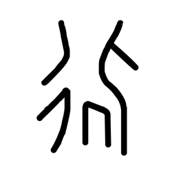

- source_zip_member: `Sub-character Images/7f1o1pqd9w/7f1o1pqd9w/7f1o1pqd9w.png`
- checksum_sha256: see `06_component-visual-index.csv`.
- review_status: `needs_human_visual_review`
- caution: source-marked review image only.

## asset-018276

- source_zip_member: `Sub-character Images/7f1o1pqd9w/7f1o1pqd9w/7n33mcg8r1.png`
- checksum_sha256: see `06_component-visual-index.csv`.
- review_status: `needs_human_visual_review`
- caution: source-marked review image only.

## asset-018277

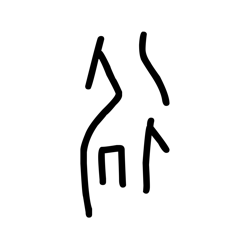

- source_zip_member: `Sub-character Images/7f1o1pqd9w/7f1o1pqd9w/8s4qw3850f.png`
- checksum_sha256: see `06_component-visual-index.csv`.
- review_status: `needs_human_visual_review`
- caution: source-marked review image only.

## asset-018278

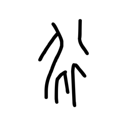

- source_zip_member: `Sub-character Images/7f1o1pqd9w/7f1o1pqd9w/9xob2r16ra.png`
- checksum_sha256: see `06_component-visual-index.csv`.
- review_status: `needs_human_visual_review`
- caution: source-marked review image only.

## asset-018279

- source_zip_member: `Sub-character Images/7f1o1pqd9w/7f1o1pqd9w/awwkleqjnx.png`
- checksum_sha256: see `06_component-visual-index.csv`.
- review_status: `needs_human_visual_review`
- caution: source-marked review image only.

## asset-018280

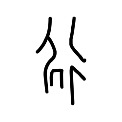

- source_zip_member: `Sub-character Images/7f1o1pqd9w/7f1o1pqd9w/eo7j4ekd7j.png`
- checksum_sha256: see `06_component-visual-index.csv`.
- review_status: `needs_human_visual_review`
- caution: source-marked review image only.

## asset-018281

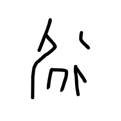

- source_zip_member: `Sub-character Images/7f1o1pqd9w/7f1o1pqd9w/fqof0toro6.png`
- checksum_sha256: see `06_component-visual-index.csv`.
- review_status: `needs_human_visual_review`
- caution: source-marked review image only.

## asset-018282

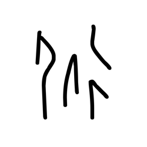

- source_zip_member: `Sub-character Images/7f1o1pqd9w/7f1o1pqd9w/h2ujjur5ol.png`
- checksum_sha256: see `06_component-visual-index.csv`.
- review_status: `needs_human_visual_review`
- caution: source-marked review image only.

## asset-018283

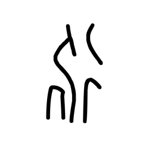

- source_zip_member: `Sub-character Images/7f1o1pqd9w/7f1o1pqd9w/inmq956uoo.png`
- checksum_sha256: see `06_component-visual-index.csv`.
- review_status: `needs_human_visual_review`
- caution: source-marked review image only.

## asset-018284

- source_zip_member: `Sub-character Images/7f1o1pqd9w/7f1o1pqd9w/iofhbqxf0s.png`
- checksum_sha256: see `06_component-visual-index.csv`.
- review_status: `needs_human_visual_review`
- caution: source-marked review image only.

## asset-018285

- source_zip_member: `Sub-character Images/7f1o1pqd9w/7f1o1pqd9w/ka96mbajwc.png`
- checksum_sha256: see `06_component-visual-index.csv`.
- review_status: `needs_human_visual_review`
- caution: source-marked review image only.

## asset-018286

- source_zip_member: `Sub-character Images/7f1o1pqd9w/7f1o1pqd9w/kig785jynv.png`
- checksum_sha256: see `06_component-visual-index.csv`.
- review_status: `needs_human_visual_review`
- caution: source-marked review image only.

## asset-018287

- source_zip_member: `Sub-character Images/7f1o1pqd9w/7f1o1pqd9w/ldvplnewl9.png`
- checksum_sha256: see `06_component-visual-index.csv`.
- review_status: `needs_human_visual_review`
- caution: source-marked review image only.

## asset-018288

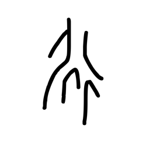

- source_zip_member: `Sub-character Images/7f1o1pqd9w/7f1o1pqd9w/lxtgnfz6t6.png`
- checksum_sha256: see `06_component-visual-index.csv`.
- review_status: `needs_human_visual_review`
- caution: source-marked review image only.

## asset-018289

- source_zip_member: `Sub-character Images/7f1o1pqd9w/7f1o1pqd9w/m9ilkx1zia.png`
- checksum_sha256: see `06_component-visual-index.csv`.
- review_status: `needs_human_visual_review`
- caution: source-marked review image only.

## asset-018290

- source_zip_member: `Sub-character Images/7f1o1pqd9w/7f1o1pqd9w/mppra2ywyp.png`
- checksum_sha256: see `06_component-visual-index.csv`.
- review_status: `needs_human_visual_review`
- caution: source-marked review image only.

## asset-018291

- source_zip_member: `Sub-character Images/7f1o1pqd9w/7f1o1pqd9w/ms1n9t1sui.png`
- checksum_sha256: see `06_component-visual-index.csv`.
- review_status: `needs_human_visual_review`
- caution: source-marked review image only.

## asset-018292

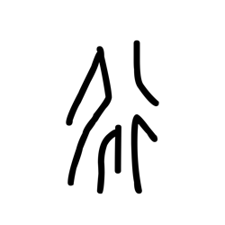

- source_zip_member: `Sub-character Images/7f1o1pqd9w/7f1o1pqd9w/n1jst3le9z.png`
- checksum_sha256: see `06_component-visual-index.csv`.
- review_status: `needs_human_visual_review`
- caution: source-marked review image only.

## asset-018293

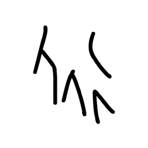

- source_zip_member: `Sub-character Images/7f1o1pqd9w/7f1o1pqd9w/nz2qujsti7.png`
- checksum_sha256: see `06_component-visual-index.csv`.
- review_status: `needs_human_visual_review`
- caution: source-marked review image only.

## asset-018294

- source_zip_member: `Sub-character Images/7f1o1pqd9w/7f1o1pqd9w/oozunpc4jl.png`
- checksum_sha256: see `06_component-visual-index.csv`.
- review_status: `needs_human_visual_review`
- caution: source-marked review image only.

## asset-018295

- source_zip_member: `Sub-character Images/7f1o1pqd9w/7f1o1pqd9w/pymrsyq03m.png`
- checksum_sha256: see `06_component-visual-index.csv`.
- review_status: `needs_human_visual_review`
- caution: source-marked review image only.

## asset-018296

- source_zip_member: `Sub-character Images/7f1o1pqd9w/7f1o1pqd9w/q2nkk5zswk.png`
- checksum_sha256: see `06_component-visual-index.csv`.
- review_status: `needs_human_visual_review`
- caution: source-marked review image only.

## asset-018297

- source_zip_member: `Sub-character Images/7f1o1pqd9w/7f1o1pqd9w/s15ru6ool4.png`
- checksum_sha256: see `06_component-visual-index.csv`.
- review_status: `needs_human_visual_review`
- caution: source-marked review image only.

## asset-018298

- source_zip_member: `Sub-character Images/7f1o1pqd9w/7f1o1pqd9w/sdmrar1ljd.png`
- checksum_sha256: see `06_component-visual-index.csv`.
- review_status: `needs_human_visual_review`
- caution: source-marked review image only.

## asset-018299

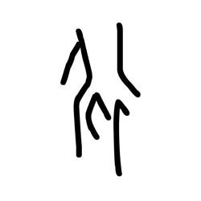

- source_zip_member: `Sub-character Images/7f1o1pqd9w/7f1o1pqd9w/sg095lnlec.png`
- checksum_sha256: see `06_component-visual-index.csv`.
- review_status: `needs_human_visual_review`
- caution: source-marked review image only.

## asset-018300

- source_zip_member: `Sub-character Images/7f1o1pqd9w/7f1o1pqd9w/tqmvacjedf.png`
- checksum_sha256: see `06_component-visual-index.csv`.
- review_status: `needs_human_visual_review`
- caution: source-marked review image only.

## asset-018301

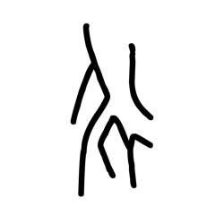

- source_zip_member: `Sub-character Images/7f1o1pqd9w/7f1o1pqd9w/vrrbwo1by9.png`
- checksum_sha256: see `06_component-visual-index.csv`.
- review_status: `needs_human_visual_review`
- caution: source-marked review image only.

## asset-018302

- source_zip_member: `Sub-character Images/7f1o1pqd9w/7f1o1pqd9w/x7zi7si9s7.png`
- checksum_sha256: see `06_component-visual-index.csv`.
- review_status: `needs_human_visual_review`
- caution: source-marked review image only.

## asset-018303

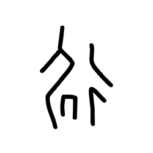

- source_zip_member: `Sub-character Images/7f1o1pqd9w/7f1o1pqd9w/yzimrhmtws.png`
- checksum_sha256: see `06_component-visual-index.csv`.
- review_status: `needs_human_visual_review`
- caution: source-marked review image only.
