# Component Visual Gallery / 构件图像查看: obs-comp-cand-001929

English:
This page displays OBIMD subcharacter PNG assets extracted into this concrete
corpus object directory for human review.

简体中文：
本页展示抽取到当前具体 corpus 对象目录内的 OBIMD subcharacter PNG 资料，供人工复核使用。

Boundary / 边界：
dataset image candidate only; not a confirmed component form, not a component
assignment, and not a decipherment claim.
- not a confirmed component form
- not a component assignment
- not a decipherment claim

## Concrete Questions To Check / 具体待查问题

- Which local image should be opened first?
- 应先打开哪一张本地构件图像？
- Which source zip member anchors this image?
- 哪一个 source zip member 能定位这张图像？
- Which near-shape or variant comparison is still missing?
- 还缺哪些近形或异体比较？
- Which character or inscription context should be checked next?
- 下一步应核对哪些单字或卜辞上下文？
- What evidence is missing before a component assignment?
- 正式构件归属前还缺哪些证据？

## asset-018339

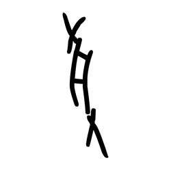

- source_zip_member: `Sub-character Images/52a130pcmy/52a130pcmy/059q2v1s77.png`
- checksum_sha256: see `06_component-visual-index.csv`.
- review_status: `needs_human_visual_review`
- caution: source-marked review image only.

## asset-018340

- source_zip_member: `Sub-character Images/52a130pcmy/52a130pcmy/06tumekzdb.png`
- checksum_sha256: see `06_component-visual-index.csv`.
- review_status: `needs_human_visual_review`
- caution: source-marked review image only.

## asset-018341

- source_zip_member: `Sub-character Images/52a130pcmy/52a130pcmy/09x1s56e4s.png`
- checksum_sha256: see `06_component-visual-index.csv`.
- review_status: `needs_human_visual_review`
- caution: source-marked review image only.

## asset-018342

- source_zip_member: `Sub-character Images/52a130pcmy/52a130pcmy/0ctc4q0ynv.png`
- checksum_sha256: see `06_component-visual-index.csv`.
- review_status: `needs_human_visual_review`
- caution: source-marked review image only.

## asset-018343

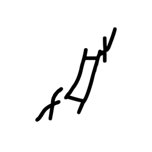

- source_zip_member: `Sub-character Images/52a130pcmy/52a130pcmy/0d3sm1w2ms.png`
- checksum_sha256: see `06_component-visual-index.csv`.
- review_status: `needs_human_visual_review`
- caution: source-marked review image only.

## asset-018344

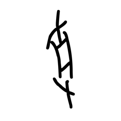

- source_zip_member: `Sub-character Images/52a130pcmy/52a130pcmy/0iyr3ssfgz.png`
- checksum_sha256: see `06_component-visual-index.csv`.
- review_status: `needs_human_visual_review`
- caution: source-marked review image only.

## asset-018345

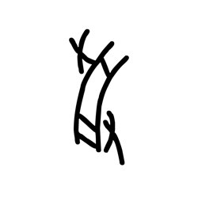

- source_zip_member: `Sub-character Images/52a130pcmy/52a130pcmy/0jlum3ppgu.png`
- checksum_sha256: see `06_component-visual-index.csv`.
- review_status: `needs_human_visual_review`
- caution: source-marked review image only.

## asset-018346

- source_zip_member: `Sub-character Images/52a130pcmy/52a130pcmy/0kjxeb0iiu.png`
- checksum_sha256: see `06_component-visual-index.csv`.
- review_status: `needs_human_visual_review`
- caution: source-marked review image only.

## asset-018347

- source_zip_member: `Sub-character Images/52a130pcmy/52a130pcmy/0mwwg0jf5b.png`
- checksum_sha256: see `06_component-visual-index.csv`.
- review_status: `needs_human_visual_review`
- caution: source-marked review image only.

## asset-018348

- source_zip_member: `Sub-character Images/52a130pcmy/52a130pcmy/0o9ak7f4nc.png`
- checksum_sha256: see `06_component-visual-index.csv`.
- review_status: `needs_human_visual_review`
- caution: source-marked review image only.

## asset-018349

- source_zip_member: `Sub-character Images/52a130pcmy/52a130pcmy/0omv3q4kqg.png`
- checksum_sha256: see `06_component-visual-index.csv`.
- review_status: `needs_human_visual_review`
- caution: source-marked review image only.

## asset-018350

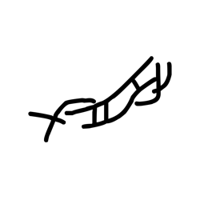

- source_zip_member: `Sub-character Images/52a130pcmy/52a130pcmy/0x3afq9wpg.png`
- checksum_sha256: see `06_component-visual-index.csv`.
- review_status: `needs_human_visual_review`
- caution: source-marked review image only.

## asset-018351

- source_zip_member: `Sub-character Images/52a130pcmy/52a130pcmy/0xhxy84o9s.png`
- checksum_sha256: see `06_component-visual-index.csv`.
- review_status: `needs_human_visual_review`
- caution: source-marked review image only.

## asset-018352

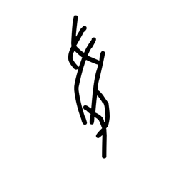

- source_zip_member: `Sub-character Images/52a130pcmy/52a130pcmy/0yk1pbkfgw.png`
- checksum_sha256: see `06_component-visual-index.csv`.
- review_status: `needs_human_visual_review`
- caution: source-marked review image only.

## asset-018353

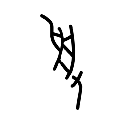

- source_zip_member: `Sub-character Images/52a130pcmy/52a130pcmy/13pv4v73kh.png`
- checksum_sha256: see `06_component-visual-index.csv`.
- review_status: `needs_human_visual_review`
- caution: source-marked review image only.

## asset-018354

- source_zip_member: `Sub-character Images/52a130pcmy/52a130pcmy/1bk2wnmec1.png`
- checksum_sha256: see `06_component-visual-index.csv`.
- review_status: `needs_human_visual_review`
- caution: source-marked review image only.

## asset-018355

- source_zip_member: `Sub-character Images/52a130pcmy/52a130pcmy/1dbw1d0z3f.png`
- checksum_sha256: see `06_component-visual-index.csv`.
- review_status: `needs_human_visual_review`
- caution: source-marked review image only.

## asset-018356

- source_zip_member: `Sub-character Images/52a130pcmy/52a130pcmy/1jjvyko4s9.png`
- checksum_sha256: see `06_component-visual-index.csv`.
- review_status: `needs_human_visual_review`
- caution: source-marked review image only.

## asset-018357

- source_zip_member: `Sub-character Images/52a130pcmy/52a130pcmy/1wzezat80f.png`
- checksum_sha256: see `06_component-visual-index.csv`.
- review_status: `needs_human_visual_review`
- caution: source-marked review image only.

## asset-018358

- source_zip_member: `Sub-character Images/52a130pcmy/52a130pcmy/1ynhornk52.png`
- checksum_sha256: see `06_component-visual-index.csv`.
- review_status: `needs_human_visual_review`
- caution: source-marked review image only.

## asset-018359

- source_zip_member: `Sub-character Images/52a130pcmy/52a130pcmy/1z5f7k6ud2.png`
- checksum_sha256: see `06_component-visual-index.csv`.
- review_status: `needs_human_visual_review`
- caution: source-marked review image only.

## asset-018360

- source_zip_member: `Sub-character Images/52a130pcmy/52a130pcmy/1zwj80krpo.png`
- checksum_sha256: see `06_component-visual-index.csv`.
- review_status: `needs_human_visual_review`
- caution: source-marked review image only.

## asset-018361

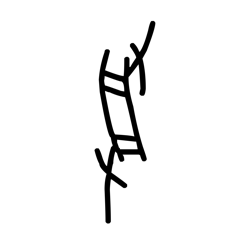

- source_zip_member: `Sub-character Images/52a130pcmy/52a130pcmy/22j6nf4fk6.png`
- checksum_sha256: see `06_component-visual-index.csv`.
- review_status: `needs_human_visual_review`
- caution: source-marked review image only.

## asset-018362

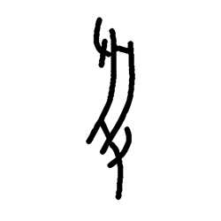

- source_zip_member: `Sub-character Images/52a130pcmy/52a130pcmy/265x31iv03.png`
- checksum_sha256: see `06_component-visual-index.csv`.
- review_status: `needs_human_visual_review`
- caution: source-marked review image only.

## asset-018363

- source_zip_member: `Sub-character Images/52a130pcmy/52a130pcmy/27jpdnyahl.png`
- checksum_sha256: see `06_component-visual-index.csv`.
- review_status: `needs_human_visual_review`
- caution: source-marked review image only.

## asset-018364

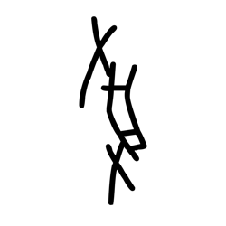

- source_zip_member: `Sub-character Images/52a130pcmy/52a130pcmy/2bh5p4zis2.png`
- checksum_sha256: see `06_component-visual-index.csv`.
- review_status: `needs_human_visual_review`
- caution: source-marked review image only.

## asset-018365

- source_zip_member: `Sub-character Images/52a130pcmy/52a130pcmy/2fjh5nlunv.png`
- checksum_sha256: see `06_component-visual-index.csv`.
- review_status: `needs_human_visual_review`
- caution: source-marked review image only.

## asset-018366

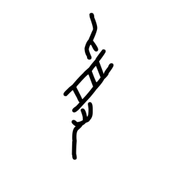

- source_zip_member: `Sub-character Images/52a130pcmy/52a130pcmy/2fxcp8jnhi.png`
- checksum_sha256: see `06_component-visual-index.csv`.
- review_status: `needs_human_visual_review`
- caution: source-marked review image only.

## asset-018367

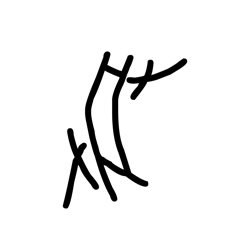

- source_zip_member: `Sub-character Images/52a130pcmy/52a130pcmy/2fy6oqjgt5.png`
- checksum_sha256: see `06_component-visual-index.csv`.
- review_status: `needs_human_visual_review`
- caution: source-marked review image only.

## asset-018368

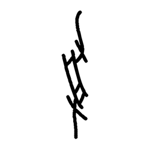

- source_zip_member: `Sub-character Images/52a130pcmy/52a130pcmy/2gzfwgrp3g.png`
- checksum_sha256: see `06_component-visual-index.csv`.
- review_status: `needs_human_visual_review`
- caution: source-marked review image only.

## asset-018369

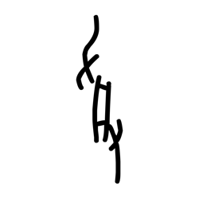

- source_zip_member: `Sub-character Images/52a130pcmy/52a130pcmy/2lc2yxaztn.png`
- checksum_sha256: see `06_component-visual-index.csv`.
- review_status: `needs_human_visual_review`
- caution: source-marked review image only.

## asset-018370

- source_zip_member: `Sub-character Images/52a130pcmy/52a130pcmy/2mpjbt3yxc.png`
- checksum_sha256: see `06_component-visual-index.csv`.
- review_status: `needs_human_visual_review`
- caution: source-marked review image only.

## asset-018371

- source_zip_member: `Sub-character Images/52a130pcmy/52a130pcmy/2p6cwriz95.png`
- checksum_sha256: see `06_component-visual-index.csv`.
- review_status: `needs_human_visual_review`
- caution: source-marked review image only.

## asset-018372

- source_zip_member: `Sub-character Images/52a130pcmy/52a130pcmy/2sgzz7rv1s.png`
- checksum_sha256: see `06_component-visual-index.csv`.
- review_status: `needs_human_visual_review`
- caution: source-marked review image only.

## asset-018373

- source_zip_member: `Sub-character Images/52a130pcmy/52a130pcmy/2utb26ngyb.png`
- checksum_sha256: see `06_component-visual-index.csv`.
- review_status: `needs_human_visual_review`
- caution: source-marked review image only.

## asset-018374

- source_zip_member: `Sub-character Images/52a130pcmy/52a130pcmy/2uv7w0jxp5.png`
- checksum_sha256: see `06_component-visual-index.csv`.
- review_status: `needs_human_visual_review`
- caution: source-marked review image only.

## asset-018375

- source_zip_member: `Sub-character Images/52a130pcmy/52a130pcmy/2ywrpzwm5m.png`
- checksum_sha256: see `06_component-visual-index.csv`.
- review_status: `needs_human_visual_review`
- caution: source-marked review image only.

## asset-018376

- source_zip_member: `Sub-character Images/52a130pcmy/52a130pcmy/34s9kcrx18.png`
- checksum_sha256: see `06_component-visual-index.csv`.
- review_status: `needs_human_visual_review`
- caution: source-marked review image only.

## asset-018377

- source_zip_member: `Sub-character Images/52a130pcmy/52a130pcmy/3761vfnlq9.png`
- checksum_sha256: see `06_component-visual-index.csv`.
- review_status: `needs_human_visual_review`
- caution: source-marked review image only.

## asset-018378

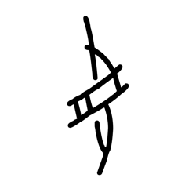

- source_zip_member: `Sub-character Images/52a130pcmy/52a130pcmy/38qbu785nu.png`
- checksum_sha256: see `06_component-visual-index.csv`.
- review_status: `needs_human_visual_review`
- caution: source-marked review image only.

## asset-018379

- source_zip_member: `Sub-character Images/52a130pcmy/52a130pcmy/3g5k5lylci.png`
- checksum_sha256: see `06_component-visual-index.csv`.
- review_status: `needs_human_visual_review`
- caution: source-marked review image only.

## asset-018380

- source_zip_member: `Sub-character Images/52a130pcmy/52a130pcmy/3gfyn3u05z.png`
- checksum_sha256: see `06_component-visual-index.csv`.
- review_status: `needs_human_visual_review`
- caution: source-marked review image only.

## asset-018381

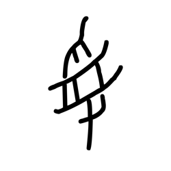

- source_zip_member: `Sub-character Images/52a130pcmy/52a130pcmy/3kdz6nrrg7.png`
- checksum_sha256: see `06_component-visual-index.csv`.
- review_status: `needs_human_visual_review`
- caution: source-marked review image only.

## asset-018382

- source_zip_member: `Sub-character Images/52a130pcmy/52a130pcmy/3mew9n97l7.png`
- checksum_sha256: see `06_component-visual-index.csv`.
- review_status: `needs_human_visual_review`
- caution: source-marked review image only.

## asset-018383

- source_zip_member: `Sub-character Images/52a130pcmy/52a130pcmy/3st4h7n05c.png`
- checksum_sha256: see `06_component-visual-index.csv`.
- review_status: `needs_human_visual_review`
- caution: source-marked review image only.

## asset-018384

- source_zip_member: `Sub-character Images/52a130pcmy/52a130pcmy/3wit56hz7b.png`
- checksum_sha256: see `06_component-visual-index.csv`.
- review_status: `needs_human_visual_review`
- caution: source-marked review image only.

## asset-018385

- source_zip_member: `Sub-character Images/52a130pcmy/52a130pcmy/3zeiyn3akf.png`
- checksum_sha256: see `06_component-visual-index.csv`.
- review_status: `needs_human_visual_review`
- caution: source-marked review image only.

## asset-018386

- source_zip_member: `Sub-character Images/52a130pcmy/52a130pcmy/44ghmpfe1m.png`
- checksum_sha256: see `06_component-visual-index.csv`.
- review_status: `needs_human_visual_review`
- caution: source-marked review image only.

## asset-018387

- source_zip_member: `Sub-character Images/52a130pcmy/52a130pcmy/4g29f9le7l.png`
- checksum_sha256: see `06_component-visual-index.csv`.
- review_status: `needs_human_visual_review`
- caution: source-marked review image only.

## asset-018388

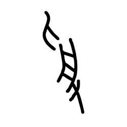

- source_zip_member: `Sub-character Images/52a130pcmy/52a130pcmy/4gxlla7ttq.png`
- checksum_sha256: see `06_component-visual-index.csv`.
- review_status: `needs_human_visual_review`
- caution: source-marked review image only.

## asset-018389

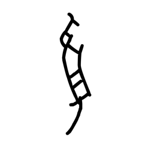

- source_zip_member: `Sub-character Images/52a130pcmy/52a130pcmy/4m92unfdjo.png`
- checksum_sha256: see `06_component-visual-index.csv`.
- review_status: `needs_human_visual_review`
- caution: source-marked review image only.

## asset-018390

- source_zip_member: `Sub-character Images/52a130pcmy/52a130pcmy/4o3ryisgfk.png`
- checksum_sha256: see `06_component-visual-index.csv`.
- review_status: `needs_human_visual_review`
- caution: source-marked review image only.

## asset-018391

- source_zip_member: `Sub-character Images/52a130pcmy/52a130pcmy/4vh8nishz3.png`
- checksum_sha256: see `06_component-visual-index.csv`.
- review_status: `needs_human_visual_review`
- caution: source-marked review image only.

## asset-018392

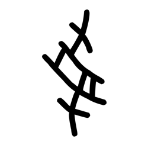

- source_zip_member: `Sub-character Images/52a130pcmy/52a130pcmy/52a130pcmy.png`
- checksum_sha256: see `06_component-visual-index.csv`.
- review_status: `needs_human_visual_review`
- caution: source-marked review image only.

## asset-018393

- source_zip_member: `Sub-character Images/52a130pcmy/52a130pcmy/5czmf6tuof.png`
- checksum_sha256: see `06_component-visual-index.csv`.
- review_status: `needs_human_visual_review`
- caution: source-marked review image only.

## asset-018394

- source_zip_member: `Sub-character Images/52a130pcmy/52a130pcmy/5et92adl4w.png`
- checksum_sha256: see `06_component-visual-index.csv`.
- review_status: `needs_human_visual_review`
- caution: source-marked review image only.

## asset-018395

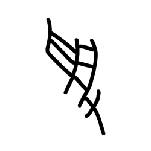

- source_zip_member: `Sub-character Images/52a130pcmy/52a130pcmy/5fh2825v00.png`
- checksum_sha256: see `06_component-visual-index.csv`.
- review_status: `needs_human_visual_review`
- caution: source-marked review image only.

## asset-018396

- source_zip_member: `Sub-character Images/52a130pcmy/52a130pcmy/5h8ptq4dcw.png`
- checksum_sha256: see `06_component-visual-index.csv`.
- review_status: `needs_human_visual_review`
- caution: source-marked review image only.

## asset-018397

- source_zip_member: `Sub-character Images/52a130pcmy/52a130pcmy/5i5q74djnb.png`
- checksum_sha256: see `06_component-visual-index.csv`.
- review_status: `needs_human_visual_review`
- caution: source-marked review image only.

## asset-018398

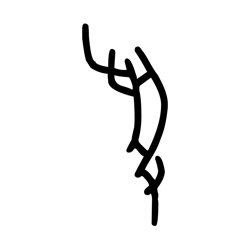

- source_zip_member: `Sub-character Images/52a130pcmy/52a130pcmy/5j36p3csfy.png`
- checksum_sha256: see `06_component-visual-index.csv`.
- review_status: `needs_human_visual_review`
- caution: source-marked review image only.

## asset-018399

- source_zip_member: `Sub-character Images/52a130pcmy/52a130pcmy/5mr83ogyl5.png`
- checksum_sha256: see `06_component-visual-index.csv`.
- review_status: `needs_human_visual_review`
- caution: source-marked review image only.

## asset-018400

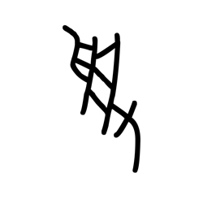

- source_zip_member: `Sub-character Images/52a130pcmy/52a130pcmy/5p8satu5wd.png`
- checksum_sha256: see `06_component-visual-index.csv`.
- review_status: `needs_human_visual_review`
- caution: source-marked review image only.

## asset-018401

- source_zip_member: `Sub-character Images/52a130pcmy/52a130pcmy/5pkfy905fc.png`
- checksum_sha256: see `06_component-visual-index.csv`.
- review_status: `needs_human_visual_review`
- caution: source-marked review image only.

## asset-018402

- source_zip_member: `Sub-character Images/52a130pcmy/52a130pcmy/5qi6p2oi3z.png`
- checksum_sha256: see `06_component-visual-index.csv`.
- review_status: `needs_human_visual_review`
- caution: source-marked review image only.

## asset-018403

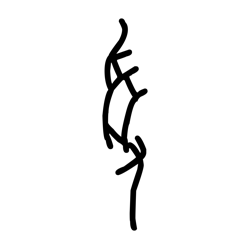

- source_zip_member: `Sub-character Images/52a130pcmy/52a130pcmy/5s001tendx.png`
- checksum_sha256: see `06_component-visual-index.csv`.
- review_status: `needs_human_visual_review`
- caution: source-marked review image only.

## asset-018404

- source_zip_member: `Sub-character Images/52a130pcmy/52a130pcmy/5s46jyg16y.png`
- checksum_sha256: see `06_component-visual-index.csv`.
- review_status: `needs_human_visual_review`
- caution: source-marked review image only.

## asset-018405

- source_zip_member: `Sub-character Images/52a130pcmy/52a130pcmy/5vk69z8cdt.png`
- checksum_sha256: see `06_component-visual-index.csv`.
- review_status: `needs_human_visual_review`
- caution: source-marked review image only.

## asset-018406

- source_zip_member: `Sub-character Images/52a130pcmy/52a130pcmy/614naxohem.png`
- checksum_sha256: see `06_component-visual-index.csv`.
- review_status: `needs_human_visual_review`
- caution: source-marked review image only.

## asset-018407

- source_zip_member: `Sub-character Images/52a130pcmy/52a130pcmy/62er4eg1ng.png`
- checksum_sha256: see `06_component-visual-index.csv`.
- review_status: `needs_human_visual_review`
- caution: source-marked review image only.

## asset-018408

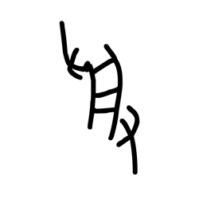

- source_zip_member: `Sub-character Images/52a130pcmy/52a130pcmy/6c8nopt7lm.png`
- checksum_sha256: see `06_component-visual-index.csv`.
- review_status: `needs_human_visual_review`
- caution: source-marked review image only.

## asset-018409

- source_zip_member: `Sub-character Images/52a130pcmy/52a130pcmy/6g0ccq7dpd.png`
- checksum_sha256: see `06_component-visual-index.csv`.
- review_status: `needs_human_visual_review`
- caution: source-marked review image only.

## asset-018410

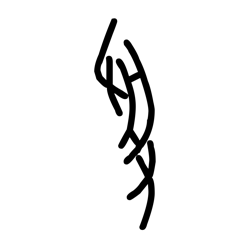

- source_zip_member: `Sub-character Images/52a130pcmy/52a130pcmy/6hhamrt8m5.png`
- checksum_sha256: see `06_component-visual-index.csv`.
- review_status: `needs_human_visual_review`
- caution: source-marked review image only.

## asset-018411

- source_zip_member: `Sub-character Images/52a130pcmy/52a130pcmy/6k21z2m736.png`
- checksum_sha256: see `06_component-visual-index.csv`.
- review_status: `needs_human_visual_review`
- caution: source-marked review image only.

## asset-018412

- source_zip_member: `Sub-character Images/52a130pcmy/52a130pcmy/6m8lc2tosj.png`
- checksum_sha256: see `06_component-visual-index.csv`.
- review_status: `needs_human_visual_review`
- caution: source-marked review image only.

## asset-018413

- source_zip_member: `Sub-character Images/52a130pcmy/52a130pcmy/6nv9nb161m.png`
- checksum_sha256: see `06_component-visual-index.csv`.
- review_status: `needs_human_visual_review`
- caution: source-marked review image only.

## asset-018414

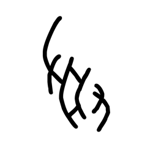

- source_zip_member: `Sub-character Images/52a130pcmy/52a130pcmy/6q8zt24ipv.png`
- checksum_sha256: see `06_component-visual-index.csv`.
- review_status: `needs_human_visual_review`
- caution: source-marked review image only.

## asset-018415

- source_zip_member: `Sub-character Images/52a130pcmy/52a130pcmy/6wdt73g3ng.png`
- checksum_sha256: see `06_component-visual-index.csv`.
- review_status: `needs_human_visual_review`
- caution: source-marked review image only.

## asset-018416

- source_zip_member: `Sub-character Images/52a130pcmy/52a130pcmy/6xw7ro7lyn.png`
- checksum_sha256: see `06_component-visual-index.csv`.
- review_status: `needs_human_visual_review`
- caution: source-marked review image only.

## asset-018417

- source_zip_member: `Sub-character Images/52a130pcmy/52a130pcmy/70z5p8w62w.png`
- checksum_sha256: see `06_component-visual-index.csv`.
- review_status: `needs_human_visual_review`
- caution: source-marked review image only.

## asset-018418

- source_zip_member: `Sub-character Images/52a130pcmy/52a130pcmy/72dbcsjx35.png`
- checksum_sha256: see `06_component-visual-index.csv`.
- review_status: `needs_human_visual_review`
- caution: source-marked review image only.

## asset-018419

- source_zip_member: `Sub-character Images/52a130pcmy/52a130pcmy/75jl9wcaho.png`
- checksum_sha256: see `06_component-visual-index.csv`.
- review_status: `needs_human_visual_review`
- caution: source-marked review image only.

## asset-018420

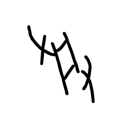

- source_zip_member: `Sub-character Images/52a130pcmy/52a130pcmy/7c89hpfxzy.png`
- checksum_sha256: see `06_component-visual-index.csv`.
- review_status: `needs_human_visual_review`
- caution: source-marked review image only.

## asset-018421

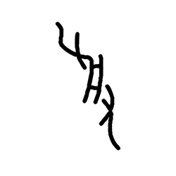

- source_zip_member: `Sub-character Images/52a130pcmy/52a130pcmy/7d366mufh8.png`
- checksum_sha256: see `06_component-visual-index.csv`.
- review_status: `needs_human_visual_review`
- caution: source-marked review image only.

## asset-018422

- source_zip_member: `Sub-character Images/52a130pcmy/52a130pcmy/7i4esawzwg.png`
- checksum_sha256: see `06_component-visual-index.csv`.
- review_status: `needs_human_visual_review`
- caution: source-marked review image only.

## asset-018423

- source_zip_member: `Sub-character Images/52a130pcmy/52a130pcmy/7imavpbaz5.png`
- checksum_sha256: see `06_component-visual-index.csv`.
- review_status: `needs_human_visual_review`
- caution: source-marked review image only.

## asset-018424

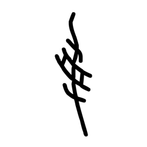

- source_zip_member: `Sub-character Images/52a130pcmy/52a130pcmy/7jyzvgim9s.png`
- checksum_sha256: see `06_component-visual-index.csv`.
- review_status: `needs_human_visual_review`
- caution: source-marked review image only.

## asset-018425

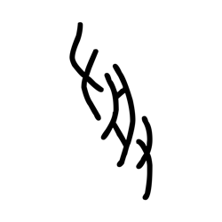

- source_zip_member: `Sub-character Images/52a130pcmy/52a130pcmy/7o8g4xvyxy.png`
- checksum_sha256: see `06_component-visual-index.csv`.
- review_status: `needs_human_visual_review`
- caution: source-marked review image only.

## asset-018426

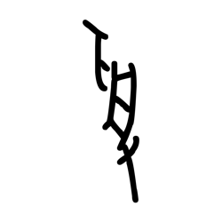

- source_zip_member: `Sub-character Images/52a130pcmy/52a130pcmy/7rf890cwod.png`
- checksum_sha256: see `06_component-visual-index.csv`.
- review_status: `needs_human_visual_review`
- caution: source-marked review image only.

## asset-018427

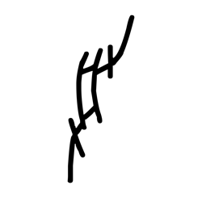

- source_zip_member: `Sub-character Images/52a130pcmy/52a130pcmy/7tiaer9pbf.png`
- checksum_sha256: see `06_component-visual-index.csv`.
- review_status: `needs_human_visual_review`
- caution: source-marked review image only.

## asset-018428

- source_zip_member: `Sub-character Images/52a130pcmy/52a130pcmy/7u0gr3x63h.png`
- checksum_sha256: see `06_component-visual-index.csv`.
- review_status: `needs_human_visual_review`
- caution: source-marked review image only.

## asset-018429

- source_zip_member: `Sub-character Images/52a130pcmy/52a130pcmy/80a6ccx06e.png`
- checksum_sha256: see `06_component-visual-index.csv`.
- review_status: `needs_human_visual_review`
- caution: source-marked review image only.

## asset-018430

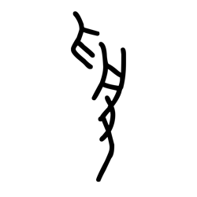

- source_zip_member: `Sub-character Images/52a130pcmy/52a130pcmy/80bh19jniq.png`
- checksum_sha256: see `06_component-visual-index.csv`.
- review_status: `needs_human_visual_review`
- caution: source-marked review image only.

## asset-018431

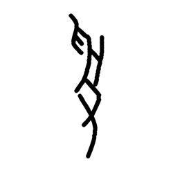

- source_zip_member: `Sub-character Images/52a130pcmy/52a130pcmy/89kuq1lee0.png`
- checksum_sha256: see `06_component-visual-index.csv`.
- review_status: `needs_human_visual_review`
- caution: source-marked review image only.

## asset-018432

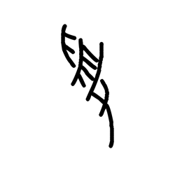

- source_zip_member: `Sub-character Images/52a130pcmy/52a130pcmy/8ex7bqdeao.png`
- checksum_sha256: see `06_component-visual-index.csv`.
- review_status: `needs_human_visual_review`
- caution: source-marked review image only.

## asset-018433

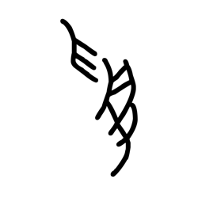

- source_zip_member: `Sub-character Images/52a130pcmy/52a130pcmy/8lymx2kw83.png`
- checksum_sha256: see `06_component-visual-index.csv`.
- review_status: `needs_human_visual_review`
- caution: source-marked review image only.

## asset-018434

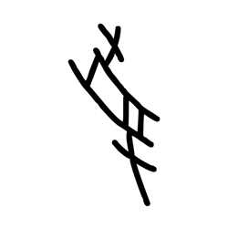

- source_zip_member: `Sub-character Images/52a130pcmy/52a130pcmy/8nalo57dgj.png`
- checksum_sha256: see `06_component-visual-index.csv`.
- review_status: `needs_human_visual_review`
- caution: source-marked review image only.

## asset-018435

- source_zip_member: `Sub-character Images/52a130pcmy/52a130pcmy/8xv0iva78k.png`
- checksum_sha256: see `06_component-visual-index.csv`.
- review_status: `needs_human_visual_review`
- caution: source-marked review image only.

## asset-018436

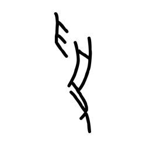

- source_zip_member: `Sub-character Images/52a130pcmy/52a130pcmy/8z07l0pw0o.png`
- checksum_sha256: see `06_component-visual-index.csv`.
- review_status: `needs_human_visual_review`
- caution: source-marked review image only.

## asset-018437

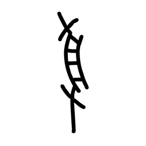

- source_zip_member: `Sub-character Images/52a130pcmy/52a130pcmy/8zbfjzsq94.png`
- checksum_sha256: see `06_component-visual-index.csv`.
- review_status: `needs_human_visual_review`
- caution: source-marked review image only.

## asset-018438

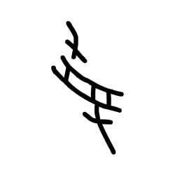

- source_zip_member: `Sub-character Images/52a130pcmy/52a130pcmy/928rsv6hz5.png`
- checksum_sha256: see `06_component-visual-index.csv`.
- review_status: `needs_human_visual_review`
- caution: source-marked review image only.

## asset-018439

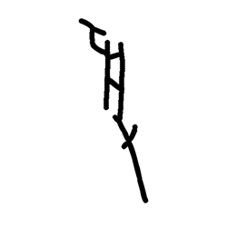

- source_zip_member: `Sub-character Images/52a130pcmy/52a130pcmy/93kzy5ntq0.png`
- checksum_sha256: see `06_component-visual-index.csv`.
- review_status: `needs_human_visual_review`
- caution: source-marked review image only.

## asset-018440

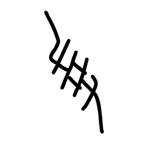

- source_zip_member: `Sub-character Images/52a130pcmy/52a130pcmy/97jnictw0c.png`
- checksum_sha256: see `06_component-visual-index.csv`.
- review_status: `needs_human_visual_review`
- caution: source-marked review image only.

## asset-018441

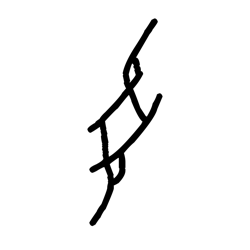

- source_zip_member: `Sub-character Images/52a130pcmy/52a130pcmy/9avda7u85h.png`
- checksum_sha256: see `06_component-visual-index.csv`.
- review_status: `needs_human_visual_review`
- caution: source-marked review image only.

## asset-018442

- source_zip_member: `Sub-character Images/52a130pcmy/52a130pcmy/9f1rfp9t4g.png`
- checksum_sha256: see `06_component-visual-index.csv`.
- review_status: `needs_human_visual_review`
- caution: source-marked review image only.

## asset-018443

- source_zip_member: `Sub-character Images/52a130pcmy/52a130pcmy/9gfiyqe30m.png`
- checksum_sha256: see `06_component-visual-index.csv`.
- review_status: `needs_human_visual_review`
- caution: source-marked review image only.

## asset-018444

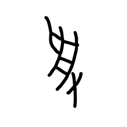

- source_zip_member: `Sub-character Images/52a130pcmy/52a130pcmy/9ja1am53wy.png`
- checksum_sha256: see `06_component-visual-index.csv`.
- review_status: `needs_human_visual_review`
- caution: source-marked review image only.

## asset-018445

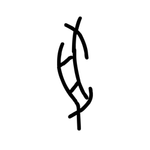

- source_zip_member: `Sub-character Images/52a130pcmy/52a130pcmy/9n8fssipmu.png`
- checksum_sha256: see `06_component-visual-index.csv`.
- review_status: `needs_human_visual_review`
- caution: source-marked review image only.

## asset-018446

- source_zip_member: `Sub-character Images/52a130pcmy/52a130pcmy/9wfksleaat.png`
- checksum_sha256: see `06_component-visual-index.csv`.
- review_status: `needs_human_visual_review`
- caution: source-marked review image only.

## asset-018447

- source_zip_member: `Sub-character Images/52a130pcmy/52a130pcmy/a38ufa7x7m.png`
- checksum_sha256: see `06_component-visual-index.csv`.
- review_status: `needs_human_visual_review`
- caution: source-marked review image only.

## asset-018448

- source_zip_member: `Sub-character Images/52a130pcmy/52a130pcmy/a9hqtfedc3.png`
- checksum_sha256: see `06_component-visual-index.csv`.
- review_status: `needs_human_visual_review`
- caution: source-marked review image only.

## asset-018449

- source_zip_member: `Sub-character Images/52a130pcmy/52a130pcmy/aeah5cs8k7.png`
- checksum_sha256: see `06_component-visual-index.csv`.
- review_status: `needs_human_visual_review`
- caution: source-marked review image only.

## asset-018450

- source_zip_member: `Sub-character Images/52a130pcmy/52a130pcmy/aerr9ouy9q.png`
- checksum_sha256: see `06_component-visual-index.csv`.
- review_status: `needs_human_visual_review`
- caution: source-marked review image only.

## asset-018451

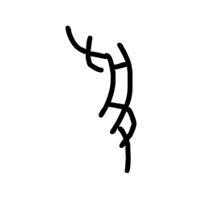

- source_zip_member: `Sub-character Images/52a130pcmy/52a130pcmy/akwpx0yi88.png`
- checksum_sha256: see `06_component-visual-index.csv`.
- review_status: `needs_human_visual_review`
- caution: source-marked review image only.

## asset-018452

- source_zip_member: `Sub-character Images/52a130pcmy/52a130pcmy/altlxwrc2z.png`
- checksum_sha256: see `06_component-visual-index.csv`.
- review_status: `needs_human_visual_review`
- caution: source-marked review image only.

## asset-018453

- source_zip_member: `Sub-character Images/52a130pcmy/52a130pcmy/anxh718w2b.png`
- checksum_sha256: see `06_component-visual-index.csv`.
- review_status: `needs_human_visual_review`
- caution: source-marked review image only.

## asset-018454

- source_zip_member: `Sub-character Images/52a130pcmy/52a130pcmy/as4xf2m45g.png`
- checksum_sha256: see `06_component-visual-index.csv`.
- review_status: `needs_human_visual_review`
- caution: source-marked review image only.

## asset-018455

- source_zip_member: `Sub-character Images/52a130pcmy/52a130pcmy/as94tkkbxz.png`
- checksum_sha256: see `06_component-visual-index.csv`.
- review_status: `needs_human_visual_review`
- caution: source-marked review image only.

## asset-018456

- source_zip_member: `Sub-character Images/52a130pcmy/52a130pcmy/av6jqxuh7o.png`
- checksum_sha256: see `06_component-visual-index.csv`.
- review_status: `needs_human_visual_review`
- caution: source-marked review image only.

## asset-018457

- source_zip_member: `Sub-character Images/52a130pcmy/52a130pcmy/avxnhse4k4.png`
- checksum_sha256: see `06_component-visual-index.csv`.
- review_status: `needs_human_visual_review`
- caution: source-marked review image only.

## asset-018458

- source_zip_member: `Sub-character Images/52a130pcmy/52a130pcmy/b5af0e61y8.png`
- checksum_sha256: see `06_component-visual-index.csv`.
- review_status: `needs_human_visual_review`
- caution: source-marked review image only.

## asset-018459

- source_zip_member: `Sub-character Images/52a130pcmy/52a130pcmy/ba8ctf8430.png`
- checksum_sha256: see `06_component-visual-index.csv`.
- review_status: `needs_human_visual_review`
- caution: source-marked review image only.

## asset-018460

- source_zip_member: `Sub-character Images/52a130pcmy/52a130pcmy/bcxt36dazo.png`
- checksum_sha256: see `06_component-visual-index.csv`.
- review_status: `needs_human_visual_review`
- caution: source-marked review image only.

## asset-018461

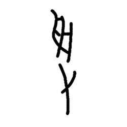

- source_zip_member: `Sub-character Images/52a130pcmy/52a130pcmy/bd6hu1zozj.png`
- checksum_sha256: see `06_component-visual-index.csv`.
- review_status: `needs_human_visual_review`
- caution: source-marked review image only.

## asset-018462

- source_zip_member: `Sub-character Images/52a130pcmy/52a130pcmy/bkgtczm8x6.png`
- checksum_sha256: see `06_component-visual-index.csv`.
- review_status: `needs_human_visual_review`
- caution: source-marked review image only.

## asset-018463

- source_zip_member: `Sub-character Images/52a130pcmy/52a130pcmy/bmunes25rp.png`
- checksum_sha256: see `06_component-visual-index.csv`.
- review_status: `needs_human_visual_review`
- caution: source-marked review image only.

## asset-018464

- source_zip_member: `Sub-character Images/52a130pcmy/52a130pcmy/bxl21kufuv.png`
- checksum_sha256: see `06_component-visual-index.csv`.
- review_status: `needs_human_visual_review`
- caution: source-marked review image only.

## asset-018465

- source_zip_member: `Sub-character Images/52a130pcmy/52a130pcmy/bzw5lugnbc.png`
- checksum_sha256: see `06_component-visual-index.csv`.
- review_status: `needs_human_visual_review`
- caution: source-marked review image only.

## asset-018466

- source_zip_member: `Sub-character Images/52a130pcmy/52a130pcmy/c3totm8q5r.png`
- checksum_sha256: see `06_component-visual-index.csv`.
- review_status: `needs_human_visual_review`
- caution: source-marked review image only.

## asset-018467

- source_zip_member: `Sub-character Images/52a130pcmy/52a130pcmy/c5643q0dnh.png`
- checksum_sha256: see `06_component-visual-index.csv`.
- review_status: `needs_human_visual_review`
- caution: source-marked review image only.

## asset-018468

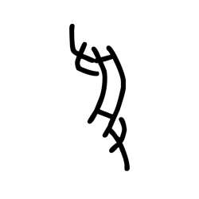

- source_zip_member: `Sub-character Images/52a130pcmy/52a130pcmy/c7l8j32r6o.png`
- checksum_sha256: see `06_component-visual-index.csv`.
- review_status: `needs_human_visual_review`
- caution: source-marked review image only.

## asset-018469

- source_zip_member: `Sub-character Images/52a130pcmy/52a130pcmy/c8b3g774z5.png`
- checksum_sha256: see `06_component-visual-index.csv`.
- review_status: `needs_human_visual_review`
- caution: source-marked review image only.

## asset-018470

- source_zip_member: `Sub-character Images/52a130pcmy/52a130pcmy/c8rl2gnzhe.png`
- checksum_sha256: see `06_component-visual-index.csv`.
- review_status: `needs_human_visual_review`
- caution: source-marked review image only.

## asset-018471

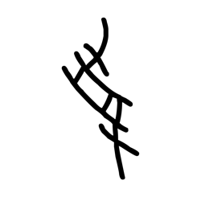

- source_zip_member: `Sub-character Images/52a130pcmy/52a130pcmy/c9kfeystwp.png`
- checksum_sha256: see `06_component-visual-index.csv`.
- review_status: `needs_human_visual_review`
- caution: source-marked review image only.

## asset-018472

- source_zip_member: `Sub-character Images/52a130pcmy/52a130pcmy/cfgv5l5vff.png`
- checksum_sha256: see `06_component-visual-index.csv`.
- review_status: `needs_human_visual_review`
- caution: source-marked review image only.

## asset-018473

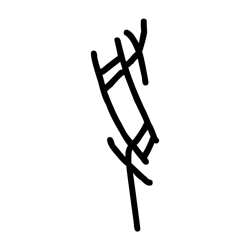

- source_zip_member: `Sub-character Images/52a130pcmy/52a130pcmy/cfzk5brux7.png`
- checksum_sha256: see `06_component-visual-index.csv`.
- review_status: `needs_human_visual_review`
- caution: source-marked review image only.

## asset-018474

- source_zip_member: `Sub-character Images/52a130pcmy/52a130pcmy/chfl0yuifk.png`
- checksum_sha256: see `06_component-visual-index.csv`.
- review_status: `needs_human_visual_review`
- caution: source-marked review image only.

## asset-018475

- source_zip_member: `Sub-character Images/52a130pcmy/52a130pcmy/cmhw7vuzdm.png`
- checksum_sha256: see `06_component-visual-index.csv`.
- review_status: `needs_human_visual_review`
- caution: source-marked review image only.

## asset-018476

- source_zip_member: `Sub-character Images/52a130pcmy/52a130pcmy/cppq9b4hes.png`
- checksum_sha256: see `06_component-visual-index.csv`.
- review_status: `needs_human_visual_review`
- caution: source-marked review image only.

## asset-018477

- source_zip_member: `Sub-character Images/52a130pcmy/52a130pcmy/cr9ibn7uza.png`
- checksum_sha256: see `06_component-visual-index.csv`.
- review_status: `needs_human_visual_review`
- caution: source-marked review image only.

## asset-018478

- source_zip_member: `Sub-character Images/52a130pcmy/52a130pcmy/ctwuomyv81.png`
- checksum_sha256: see `06_component-visual-index.csv`.
- review_status: `needs_human_visual_review`
- caution: source-marked review image only.

## asset-018479

- source_zip_member: `Sub-character Images/52a130pcmy/52a130pcmy/cwztr0yoqk.png`
- checksum_sha256: see `06_component-visual-index.csv`.
- review_status: `needs_human_visual_review`
- caution: source-marked review image only.

## asset-018480

- source_zip_member: `Sub-character Images/52a130pcmy/52a130pcmy/cyrv91108x.png`
- checksum_sha256: see `06_component-visual-index.csv`.
- review_status: `needs_human_visual_review`
- caution: source-marked review image only.

## asset-018481

- source_zip_member: `Sub-character Images/52a130pcmy/52a130pcmy/czwjem4l40.png`
- checksum_sha256: see `06_component-visual-index.csv`.
- review_status: `needs_human_visual_review`
- caution: source-marked review image only.

## asset-018482

- source_zip_member: `Sub-character Images/52a130pcmy/52a130pcmy/d0gk3za34p.png`
- checksum_sha256: see `06_component-visual-index.csv`.
- review_status: `needs_human_visual_review`
- caution: source-marked review image only.

## asset-018483

- source_zip_member: `Sub-character Images/52a130pcmy/52a130pcmy/d97ld4bz8i.png`
- checksum_sha256: see `06_component-visual-index.csv`.
- review_status: `needs_human_visual_review`
- caution: source-marked review image only.

## asset-018484

- source_zip_member: `Sub-character Images/52a130pcmy/52a130pcmy/de80s16v8y.png`
- checksum_sha256: see `06_component-visual-index.csv`.
- review_status: `needs_human_visual_review`
- caution: source-marked review image only.

## asset-018485

- source_zip_member: `Sub-character Images/52a130pcmy/52a130pcmy/dg5rtgghq7.png`
- checksum_sha256: see `06_component-visual-index.csv`.
- review_status: `needs_human_visual_review`
- caution: source-marked review image only.

## asset-018486

- source_zip_member: `Sub-character Images/52a130pcmy/52a130pcmy/dgzg9g5nak.png`
- checksum_sha256: see `06_component-visual-index.csv`.
- review_status: `needs_human_visual_review`
- caution: source-marked review image only.

## asset-018487

- source_zip_member: `Sub-character Images/52a130pcmy/52a130pcmy/dhaktzu2ks.png`
- checksum_sha256: see `06_component-visual-index.csv`.
- review_status: `needs_human_visual_review`
- caution: source-marked review image only.

## asset-018488

- source_zip_member: `Sub-character Images/52a130pcmy/52a130pcmy/di2qcypzsb.png`
- checksum_sha256: see `06_component-visual-index.csv`.
- review_status: `needs_human_visual_review`
- caution: source-marked review image only.

## asset-018489

- source_zip_member: `Sub-character Images/52a130pcmy/52a130pcmy/di55yxeey1.png`
- checksum_sha256: see `06_component-visual-index.csv`.
- review_status: `needs_human_visual_review`
- caution: source-marked review image only.

## asset-018490

- source_zip_member: `Sub-character Images/52a130pcmy/52a130pcmy/di6yoy6w9g.png`
- checksum_sha256: see `06_component-visual-index.csv`.
- review_status: `needs_human_visual_review`
- caution: source-marked review image only.

## asset-018491

- source_zip_member: `Sub-character Images/52a130pcmy/52a130pcmy/diumh6l5wp.png`
- checksum_sha256: see `06_component-visual-index.csv`.
- review_status: `needs_human_visual_review`
- caution: source-marked review image only.

## asset-018492

- source_zip_member: `Sub-character Images/52a130pcmy/52a130pcmy/djbe3kcgwg.png`
- checksum_sha256: see `06_component-visual-index.csv`.
- review_status: `needs_human_visual_review`
- caution: source-marked review image only.

## asset-018493

- source_zip_member: `Sub-character Images/52a130pcmy/52a130pcmy/dsaom1fr9q.png`
- checksum_sha256: see `06_component-visual-index.csv`.
- review_status: `needs_human_visual_review`
- caution: source-marked review image only.

## asset-018494

- source_zip_member: `Sub-character Images/52a130pcmy/52a130pcmy/dwowh5k7yq.png`
- checksum_sha256: see `06_component-visual-index.csv`.
- review_status: `needs_human_visual_review`
- caution: source-marked review image only.

## asset-018495

- source_zip_member: `Sub-character Images/52a130pcmy/52a130pcmy/dwpe7uk3v4.png`
- checksum_sha256: see `06_component-visual-index.csv`.
- review_status: `needs_human_visual_review`
- caution: source-marked review image only.

## asset-018496

- source_zip_member: `Sub-character Images/52a130pcmy/52a130pcmy/e0390k2ulg.png`
- checksum_sha256: see `06_component-visual-index.csv`.
- review_status: `needs_human_visual_review`
- caution: source-marked review image only.

## asset-018497

- source_zip_member: `Sub-character Images/52a130pcmy/52a130pcmy/e8s7msbp9x.png`
- checksum_sha256: see `06_component-visual-index.csv`.
- review_status: `needs_human_visual_review`
- caution: source-marked review image only.

## asset-018498

- source_zip_member: `Sub-character Images/52a130pcmy/52a130pcmy/eb5e8oocc8.png`
- checksum_sha256: see `06_component-visual-index.csv`.
- review_status: `needs_human_visual_review`
- caution: source-marked review image only.

## asset-018499

- source_zip_member: `Sub-character Images/52a130pcmy/52a130pcmy/eebdd6bqtg.png`
- checksum_sha256: see `06_component-visual-index.csv`.
- review_status: `needs_human_visual_review`
- caution: source-marked review image only.

## asset-018500

- source_zip_member: `Sub-character Images/52a130pcmy/52a130pcmy/ekqt8s4e2s.png`
- checksum_sha256: see `06_component-visual-index.csv`.
- review_status: `needs_human_visual_review`
- caution: source-marked review image only.

## asset-018501

- source_zip_member: `Sub-character Images/52a130pcmy/52a130pcmy/emulxfdbmr.png`
- checksum_sha256: see `06_component-visual-index.csv`.
- review_status: `needs_human_visual_review`
- caution: source-marked review image only.

## asset-018502

- source_zip_member: `Sub-character Images/52a130pcmy/52a130pcmy/eogvrkglj2.png`
- checksum_sha256: see `06_component-visual-index.csv`.
- review_status: `needs_human_visual_review`
- caution: source-marked review image only.

## asset-018503

- source_zip_member: `Sub-character Images/52a130pcmy/52a130pcmy/epaphzdjkd.png`
- checksum_sha256: see `06_component-visual-index.csv`.
- review_status: `needs_human_visual_review`
- caution: source-marked review image only.

## asset-018504

- source_zip_member: `Sub-character Images/52a130pcmy/52a130pcmy/f4gj09hagk.png`
- checksum_sha256: see `06_component-visual-index.csv`.
- review_status: `needs_human_visual_review`
- caution: source-marked review image only.

## asset-018505

- source_zip_member: `Sub-character Images/52a130pcmy/52a130pcmy/f6gzynaok1.png`
- checksum_sha256: see `06_component-visual-index.csv`.
- review_status: `needs_human_visual_review`
- caution: source-marked review image only.

## asset-018506

- source_zip_member: `Sub-character Images/52a130pcmy/52a130pcmy/f7ew2bofbz.png`
- checksum_sha256: see `06_component-visual-index.csv`.
- review_status: `needs_human_visual_review`
- caution: source-marked review image only.

## asset-018507

- source_zip_member: `Sub-character Images/52a130pcmy/52a130pcmy/f7m39h3apl.png`
- checksum_sha256: see `06_component-visual-index.csv`.
- review_status: `needs_human_visual_review`
- caution: source-marked review image only.

## asset-018508

- source_zip_member: `Sub-character Images/52a130pcmy/52a130pcmy/f7vcoct0sr.png`
- checksum_sha256: see `06_component-visual-index.csv`.
- review_status: `needs_human_visual_review`
- caution: source-marked review image only.

## asset-018509

- source_zip_member: `Sub-character Images/52a130pcmy/52a130pcmy/fcuzpl0ts4.png`
- checksum_sha256: see `06_component-visual-index.csv`.
- review_status: `needs_human_visual_review`
- caution: source-marked review image only.

## asset-018510

- source_zip_member: `Sub-character Images/52a130pcmy/52a130pcmy/fe6dw1t2pl.png`
- checksum_sha256: see `06_component-visual-index.csv`.
- review_status: `needs_human_visual_review`
- caution: source-marked review image only.

## asset-018511

- source_zip_member: `Sub-character Images/52a130pcmy/52a130pcmy/fishq6p1yz.png`
- checksum_sha256: see `06_component-visual-index.csv`.
- review_status: `needs_human_visual_review`
- caution: source-marked review image only.

## asset-018512

- source_zip_member: `Sub-character Images/52a130pcmy/52a130pcmy/fiskqfrwym.png`
- checksum_sha256: see `06_component-visual-index.csv`.
- review_status: `needs_human_visual_review`
- caution: source-marked review image only.

## asset-018513

- source_zip_member: `Sub-character Images/52a130pcmy/52a130pcmy/fje7u399n6.png`
- checksum_sha256: see `06_component-visual-index.csv`.
- review_status: `needs_human_visual_review`
- caution: source-marked review image only.

## asset-018514

- source_zip_member: `Sub-character Images/52a130pcmy/52a130pcmy/fk6p6tiat1.png`
- checksum_sha256: see `06_component-visual-index.csv`.
- review_status: `needs_human_visual_review`
- caution: source-marked review image only.

## asset-018515

- source_zip_member: `Sub-character Images/52a130pcmy/52a130pcmy/fpsz6lbt6g.png`
- checksum_sha256: see `06_component-visual-index.csv`.
- review_status: `needs_human_visual_review`
- caution: source-marked review image only.

## asset-018516

- source_zip_member: `Sub-character Images/52a130pcmy/52a130pcmy/g4lcvdomn4.png`
- checksum_sha256: see `06_component-visual-index.csv`.
- review_status: `needs_human_visual_review`
- caution: source-marked review image only.

## asset-018517

- source_zip_member: `Sub-character Images/52a130pcmy/52a130pcmy/gd6py7gh0w.png`
- checksum_sha256: see `06_component-visual-index.csv`.
- review_status: `needs_human_visual_review`
- caution: source-marked review image only.

## asset-018518

- source_zip_member: `Sub-character Images/52a130pcmy/52a130pcmy/gdsbnjucxp.png`
- checksum_sha256: see `06_component-visual-index.csv`.
- review_status: `needs_human_visual_review`
- caution: source-marked review image only.

## asset-018519

- source_zip_member: `Sub-character Images/52a130pcmy/52a130pcmy/gq624m04mt.png`
- checksum_sha256: see `06_component-visual-index.csv`.
- review_status: `needs_human_visual_review`
- caution: source-marked review image only.

## asset-018520

- source_zip_member: `Sub-character Images/52a130pcmy/52a130pcmy/gwjy164i3y.png`
- checksum_sha256: see `06_component-visual-index.csv`.
- review_status: `needs_human_visual_review`
- caution: source-marked review image only.

## asset-018521

- source_zip_member: `Sub-character Images/52a130pcmy/52a130pcmy/gzor2bq4jd.png`
- checksum_sha256: see `06_component-visual-index.csv`.
- review_status: `needs_human_visual_review`
- caution: source-marked review image only.

## asset-018522

- source_zip_member: `Sub-character Images/52a130pcmy/52a130pcmy/h546lelpr3.png`
- checksum_sha256: see `06_component-visual-index.csv`.
- review_status: `needs_human_visual_review`
- caution: source-marked review image only.

## asset-018523

- source_zip_member: `Sub-character Images/52a130pcmy/52a130pcmy/h74rxrmmwc.png`
- checksum_sha256: see `06_component-visual-index.csv`.
- review_status: `needs_human_visual_review`
- caution: source-marked review image only.

## asset-018524

- source_zip_member: `Sub-character Images/52a130pcmy/52a130pcmy/hf1x5jzl1z.png`
- checksum_sha256: see `06_component-visual-index.csv`.
- review_status: `needs_human_visual_review`
- caution: source-marked review image only.

## asset-018525

- source_zip_member: `Sub-character Images/52a130pcmy/52a130pcmy/hfzrukkykf.png`
- checksum_sha256: see `06_component-visual-index.csv`.
- review_status: `needs_human_visual_review`
- caution: source-marked review image only.

## asset-018526

- source_zip_member: `Sub-character Images/52a130pcmy/52a130pcmy/hgom5ngvud.png`
- checksum_sha256: see `06_component-visual-index.csv`.
- review_status: `needs_human_visual_review`
- caution: source-marked review image only.

## asset-018527

- source_zip_member: `Sub-character Images/52a130pcmy/52a130pcmy/hjrtbn5xqy.png`
- checksum_sha256: see `06_component-visual-index.csv`.
- review_status: `needs_human_visual_review`
- caution: source-marked review image only.

## asset-018528

- source_zip_member: `Sub-character Images/52a130pcmy/52a130pcmy/hkfkr71mqw.png`
- checksum_sha256: see `06_component-visual-index.csv`.
- review_status: `needs_human_visual_review`
- caution: source-marked review image only.

## asset-018529

- source_zip_member: `Sub-character Images/52a130pcmy/52a130pcmy/hm3mlgc0im.png`
- checksum_sha256: see `06_component-visual-index.csv`.
- review_status: `needs_human_visual_review`
- caution: source-marked review image only.

## asset-018530

- source_zip_member: `Sub-character Images/52a130pcmy/52a130pcmy/hnj1p5qk0c.png`
- checksum_sha256: see `06_component-visual-index.csv`.
- review_status: `needs_human_visual_review`
- caution: source-marked review image only.

## asset-018531

- source_zip_member: `Sub-character Images/52a130pcmy/52a130pcmy/ho2xpor35j.png`
- checksum_sha256: see `06_component-visual-index.csv`.
- review_status: `needs_human_visual_review`
- caution: source-marked review image only.

## asset-018532

- source_zip_member: `Sub-character Images/52a130pcmy/52a130pcmy/hsa6k32w63.png`
- checksum_sha256: see `06_component-visual-index.csv`.
- review_status: `needs_human_visual_review`
- caution: source-marked review image only.

## asset-018533

- source_zip_member: `Sub-character Images/52a130pcmy/52a130pcmy/hxtlm26m3z.png`
- checksum_sha256: see `06_component-visual-index.csv`.
- review_status: `needs_human_visual_review`
- caution: source-marked review image only.

## asset-018534

- source_zip_member: `Sub-character Images/52a130pcmy/52a130pcmy/hy7q5bhy1k.png`
- checksum_sha256: see `06_component-visual-index.csv`.
- review_status: `needs_human_visual_review`
- caution: source-marked review image only.

## asset-018535

- source_zip_member: `Sub-character Images/52a130pcmy/52a130pcmy/hydec6x5jx.png`
- checksum_sha256: see `06_component-visual-index.csv`.
- review_status: `needs_human_visual_review`
- caution: source-marked review image only.

## asset-018536

- source_zip_member: `Sub-character Images/52a130pcmy/52a130pcmy/hylvc74nz1.png`
- checksum_sha256: see `06_component-visual-index.csv`.
- review_status: `needs_human_visual_review`
- caution: source-marked review image only.

## asset-018537

- source_zip_member: `Sub-character Images/52a130pcmy/52a130pcmy/i2nhcz241h.png`
- checksum_sha256: see `06_component-visual-index.csv`.
- review_status: `needs_human_visual_review`
- caution: source-marked review image only.

## asset-018538

- source_zip_member: `Sub-character Images/52a130pcmy/52a130pcmy/i4qryt29nt.png`
- checksum_sha256: see `06_component-visual-index.csv`.
- review_status: `needs_human_visual_review`
- caution: source-marked review image only.

## asset-018539

- source_zip_member: `Sub-character Images/52a130pcmy/52a130pcmy/i5uk1ebn9g.png`
- checksum_sha256: see `06_component-visual-index.csv`.
- review_status: `needs_human_visual_review`
- caution: source-marked review image only.

## asset-018540

- source_zip_member: `Sub-character Images/52a130pcmy/52a130pcmy/i6al1nc2c7.png`
- checksum_sha256: see `06_component-visual-index.csv`.
- review_status: `needs_human_visual_review`
- caution: source-marked review image only.

## asset-018541

- source_zip_member: `Sub-character Images/52a130pcmy/52a130pcmy/i8n3s2fagw.png`
- checksum_sha256: see `06_component-visual-index.csv`.
- review_status: `needs_human_visual_review`
- caution: source-marked review image only.

## asset-018542

- source_zip_member: `Sub-character Images/52a130pcmy/52a130pcmy/i8qw5bvv7b.png`
- checksum_sha256: see `06_component-visual-index.csv`.
- review_status: `needs_human_visual_review`
- caution: source-marked review image only.

## asset-018543

- source_zip_member: `Sub-character Images/52a130pcmy/52a130pcmy/i97x8yss4m.png`
- checksum_sha256: see `06_component-visual-index.csv`.
- review_status: `needs_human_visual_review`
- caution: source-marked review image only.

## asset-018544

- source_zip_member: `Sub-character Images/52a130pcmy/52a130pcmy/ib7cvz74ev.png`
- checksum_sha256: see `06_component-visual-index.csv`.
- review_status: `needs_human_visual_review`
- caution: source-marked review image only.

## asset-018545

- source_zip_member: `Sub-character Images/52a130pcmy/52a130pcmy/ifa66eiife.png`
- checksum_sha256: see `06_component-visual-index.csv`.
- review_status: `needs_human_visual_review`
- caution: source-marked review image only.

## asset-018546

- source_zip_member: `Sub-character Images/52a130pcmy/52a130pcmy/ijr8o6ctey.png`
- checksum_sha256: see `06_component-visual-index.csv`.
- review_status: `needs_human_visual_review`
- caution: source-marked review image only.

## asset-018547

- source_zip_member: `Sub-character Images/52a130pcmy/52a130pcmy/imnk191imk.png`
- checksum_sha256: see `06_component-visual-index.csv`.
- review_status: `needs_human_visual_review`
- caution: source-marked review image only.

## asset-018548

- source_zip_member: `Sub-character Images/52a130pcmy/52a130pcmy/inp0szldwb.png`
- checksum_sha256: see `06_component-visual-index.csv`.
- review_status: `needs_human_visual_review`
- caution: source-marked review image only.

## asset-018549

- source_zip_member: `Sub-character Images/52a130pcmy/52a130pcmy/j1ua9sft9z.png`
- checksum_sha256: see `06_component-visual-index.csv`.
- review_status: `needs_human_visual_review`
- caution: source-marked review image only.

## asset-018550

- source_zip_member: `Sub-character Images/52a130pcmy/52a130pcmy/j2lpyss3uk.png`
- checksum_sha256: see `06_component-visual-index.csv`.
- review_status: `needs_human_visual_review`
- caution: source-marked review image only.

## asset-018551

- source_zip_member: `Sub-character Images/52a130pcmy/52a130pcmy/j8vp69e9hg.png`
- checksum_sha256: see `06_component-visual-index.csv`.
- review_status: `needs_human_visual_review`
- caution: source-marked review image only.

## asset-018552

- source_zip_member: `Sub-character Images/52a130pcmy/52a130pcmy/jdj31c8nru.png`
- checksum_sha256: see `06_component-visual-index.csv`.
- review_status: `needs_human_visual_review`
- caution: source-marked review image only.

## asset-018553

- source_zip_member: `Sub-character Images/52a130pcmy/52a130pcmy/jin0vdbj60.png`
- checksum_sha256: see `06_component-visual-index.csv`.
- review_status: `needs_human_visual_review`
- caution: source-marked review image only.

## asset-018554

- source_zip_member: `Sub-character Images/52a130pcmy/52a130pcmy/jj7g6l6ipc.png`
- checksum_sha256: see `06_component-visual-index.csv`.
- review_status: `needs_human_visual_review`
- caution: source-marked review image only.

## asset-018555

- source_zip_member: `Sub-character Images/52a130pcmy/52a130pcmy/jjogevu7zh.png`
- checksum_sha256: see `06_component-visual-index.csv`.
- review_status: `needs_human_visual_review`
- caution: source-marked review image only.

## asset-018556

- source_zip_member: `Sub-character Images/52a130pcmy/52a130pcmy/jkqvnkuqt2.png`
- checksum_sha256: see `06_component-visual-index.csv`.
- review_status: `needs_human_visual_review`
- caution: source-marked review image only.

## asset-018557

- source_zip_member: `Sub-character Images/52a130pcmy/52a130pcmy/js2navjn5d.png`
- checksum_sha256: see `06_component-visual-index.csv`.
- review_status: `needs_human_visual_review`
- caution: source-marked review image only.

## asset-018558

- source_zip_member: `Sub-character Images/52a130pcmy/52a130pcmy/k1daxlb3if.png`
- checksum_sha256: see `06_component-visual-index.csv`.
- review_status: `needs_human_visual_review`
- caution: source-marked review image only.

## asset-018559

- source_zip_member: `Sub-character Images/52a130pcmy/52a130pcmy/k21xszwujo.png`
- checksum_sha256: see `06_component-visual-index.csv`.
- review_status: `needs_human_visual_review`
- caution: source-marked review image only.

## asset-018560

- source_zip_member: `Sub-character Images/52a130pcmy/52a130pcmy/k30vy11v7f.png`
- checksum_sha256: see `06_component-visual-index.csv`.
- review_status: `needs_human_visual_review`
- caution: source-marked review image only.

## asset-018561

- source_zip_member: `Sub-character Images/52a130pcmy/52a130pcmy/k7ofy41a70.png`
- checksum_sha256: see `06_component-visual-index.csv`.
- review_status: `needs_human_visual_review`
- caution: source-marked review image only.

## asset-018562

- source_zip_member: `Sub-character Images/52a130pcmy/52a130pcmy/kefcxuy8tw.png`
- checksum_sha256: see `06_component-visual-index.csv`.
- review_status: `needs_human_visual_review`
- caution: source-marked review image only.

## asset-018563

- source_zip_member: `Sub-character Images/52a130pcmy/52a130pcmy/kjkhk8m7sw.png`
- checksum_sha256: see `06_component-visual-index.csv`.
- review_status: `needs_human_visual_review`
- caution: source-marked review image only.

## asset-018564

- source_zip_member: `Sub-character Images/52a130pcmy/52a130pcmy/kllqxd3qtp.png`
- checksum_sha256: see `06_component-visual-index.csv`.
- review_status: `needs_human_visual_review`
- caution: source-marked review image only.

## asset-018565

- source_zip_member: `Sub-character Images/52a130pcmy/52a130pcmy/kp0uy5b49j.png`
- checksum_sha256: see `06_component-visual-index.csv`.
- review_status: `needs_human_visual_review`
- caution: source-marked review image only.

## asset-018566

- source_zip_member: `Sub-character Images/52a130pcmy/52a130pcmy/l1faj953qv.png`
- checksum_sha256: see `06_component-visual-index.csv`.
- review_status: `needs_human_visual_review`
- caution: source-marked review image only.

## asset-018567

- source_zip_member: `Sub-character Images/52a130pcmy/52a130pcmy/l4qg46lh4s.png`
- checksum_sha256: see `06_component-visual-index.csv`.
- review_status: `needs_human_visual_review`
- caution: source-marked review image only.

## asset-018568

- source_zip_member: `Sub-character Images/52a130pcmy/52a130pcmy/l6fqliqvpm.png`
- checksum_sha256: see `06_component-visual-index.csv`.
- review_status: `needs_human_visual_review`
- caution: source-marked review image only.

## asset-018569

- source_zip_member: `Sub-character Images/52a130pcmy/52a130pcmy/lilucbllga.png`
- checksum_sha256: see `06_component-visual-index.csv`.
- review_status: `needs_human_visual_review`
- caution: source-marked review image only.

## asset-018570

- source_zip_member: `Sub-character Images/52a130pcmy/52a130pcmy/lo9ymv62qp.png`
- checksum_sha256: see `06_component-visual-index.csv`.
- review_status: `needs_human_visual_review`
- caution: source-marked review image only.

## asset-018571

- source_zip_member: `Sub-character Images/52a130pcmy/52a130pcmy/logi38i5vi.png`
- checksum_sha256: see `06_component-visual-index.csv`.
- review_status: `needs_human_visual_review`
- caution: source-marked review image only.

## asset-018572

- source_zip_member: `Sub-character Images/52a130pcmy/52a130pcmy/m317i7qio7.png`
- checksum_sha256: see `06_component-visual-index.csv`.
- review_status: `needs_human_visual_review`
- caution: source-marked review image only.

## asset-018573

- source_zip_member: `Sub-character Images/52a130pcmy/52a130pcmy/mbihcukhcl.png`
- checksum_sha256: see `06_component-visual-index.csv`.
- review_status: `needs_human_visual_review`
- caution: source-marked review image only.

## asset-018574

- source_zip_member: `Sub-character Images/52a130pcmy/52a130pcmy/mcp65xnwca.png`
- checksum_sha256: see `06_component-visual-index.csv`.
- review_status: `needs_human_visual_review`
- caution: source-marked review image only.

## asset-018575

- source_zip_member: `Sub-character Images/52a130pcmy/52a130pcmy/mdktz5eny3.png`
- checksum_sha256: see `06_component-visual-index.csv`.
- review_status: `needs_human_visual_review`
- caution: source-marked review image only.

## asset-018576

- source_zip_member: `Sub-character Images/52a130pcmy/52a130pcmy/mdvx9qh4kw.png`
- checksum_sha256: see `06_component-visual-index.csv`.
- review_status: `needs_human_visual_review`
- caution: source-marked review image only.

## asset-018577

- source_zip_member: `Sub-character Images/52a130pcmy/52a130pcmy/mj8qitp0na.png`
- checksum_sha256: see `06_component-visual-index.csv`.
- review_status: `needs_human_visual_review`
- caution: source-marked review image only.

## asset-018578

- source_zip_member: `Sub-character Images/52a130pcmy/52a130pcmy/moisq6izws.png`
- checksum_sha256: see `06_component-visual-index.csv`.
- review_status: `needs_human_visual_review`
- caution: source-marked review image only.

## asset-018579

- source_zip_member: `Sub-character Images/52a130pcmy/52a130pcmy/mvt1jjckt2.png`
- checksum_sha256: see `06_component-visual-index.csv`.
- review_status: `needs_human_visual_review`
- caution: source-marked review image only.

## asset-018580

- source_zip_member: `Sub-character Images/52a130pcmy/52a130pcmy/n535id80yv.png`
- checksum_sha256: see `06_component-visual-index.csv`.
- review_status: `needs_human_visual_review`
- caution: source-marked review image only.

## asset-018581

- source_zip_member: `Sub-character Images/52a130pcmy/52a130pcmy/nlo6ckii34.png`
- checksum_sha256: see `06_component-visual-index.csv`.
- review_status: `needs_human_visual_review`
- caution: source-marked review image only.

## asset-018582

- source_zip_member: `Sub-character Images/52a130pcmy/52a130pcmy/nn4ijn3o2t.png`
- checksum_sha256: see `06_component-visual-index.csv`.
- review_status: `needs_human_visual_review`
- caution: source-marked review image only.

## asset-018583

- source_zip_member: `Sub-character Images/52a130pcmy/52a130pcmy/nreot9ukdj.png`
- checksum_sha256: see `06_component-visual-index.csv`.
- review_status: `needs_human_visual_review`
- caution: source-marked review image only.

## asset-018584

- source_zip_member: `Sub-character Images/52a130pcmy/52a130pcmy/nu6qp78awc.png`
- checksum_sha256: see `06_component-visual-index.csv`.
- review_status: `needs_human_visual_review`
- caution: source-marked review image only.

## asset-018585

- source_zip_member: `Sub-character Images/52a130pcmy/52a130pcmy/nxvzo9e4h6.png`
- checksum_sha256: see `06_component-visual-index.csv`.
- review_status: `needs_human_visual_review`
- caution: source-marked review image only.

## asset-018586

- source_zip_member: `Sub-character Images/52a130pcmy/52a130pcmy/nyjo0yhurk.png`
- checksum_sha256: see `06_component-visual-index.csv`.
- review_status: `needs_human_visual_review`
- caution: source-marked review image only.

## asset-018587

- source_zip_member: `Sub-character Images/52a130pcmy/52a130pcmy/nz5u6tunl3.png`
- checksum_sha256: see `06_component-visual-index.csv`.
- review_status: `needs_human_visual_review`
- caution: source-marked review image only.

## asset-018588

- source_zip_member: `Sub-character Images/52a130pcmy/52a130pcmy/o3acg6vtwy.png`
- checksum_sha256: see `06_component-visual-index.csv`.
- review_status: `needs_human_visual_review`
- caution: source-marked review image only.

## asset-018589

- source_zip_member: `Sub-character Images/52a130pcmy/52a130pcmy/o67p1byhqn.png`
- checksum_sha256: see `06_component-visual-index.csv`.
- review_status: `needs_human_visual_review`
- caution: source-marked review image only.

## asset-018590

- source_zip_member: `Sub-character Images/52a130pcmy/52a130pcmy/obs7vh19xd.png`
- checksum_sha256: see `06_component-visual-index.csv`.
- review_status: `needs_human_visual_review`
- caution: source-marked review image only.

## asset-018591

- source_zip_member: `Sub-character Images/52a130pcmy/52a130pcmy/ogxcsy4iil.png`
- checksum_sha256: see `06_component-visual-index.csv`.
- review_status: `needs_human_visual_review`
- caution: source-marked review image only.

## asset-018592

- source_zip_member: `Sub-character Images/52a130pcmy/52a130pcmy/okewj51cja.png`
- checksum_sha256: see `06_component-visual-index.csv`.
- review_status: `needs_human_visual_review`
- caution: source-marked review image only.

## asset-018593

- source_zip_member: `Sub-character Images/52a130pcmy/52a130pcmy/olxudjp5hs.png`
- checksum_sha256: see `06_component-visual-index.csv`.
- review_status: `needs_human_visual_review`
- caution: source-marked review image only.

## asset-018594

- source_zip_member: `Sub-character Images/52a130pcmy/52a130pcmy/or6nz158bw.png`
- checksum_sha256: see `06_component-visual-index.csv`.
- review_status: `needs_human_visual_review`
- caution: source-marked review image only.

## asset-018595

- source_zip_member: `Sub-character Images/52a130pcmy/52a130pcmy/ou0wr3j6cn.png`
- checksum_sha256: see `06_component-visual-index.csv`.
- review_status: `needs_human_visual_review`
- caution: source-marked review image only.

## asset-018596

- source_zip_member: `Sub-character Images/52a130pcmy/52a130pcmy/ovmz43kdrp.png`
- checksum_sha256: see `06_component-visual-index.csv`.
- review_status: `needs_human_visual_review`
- caution: source-marked review image only.

## asset-018597

- source_zip_member: `Sub-character Images/52a130pcmy/52a130pcmy/oy9pnar6so.png`
- checksum_sha256: see `06_component-visual-index.csv`.
- review_status: `needs_human_visual_review`
- caution: source-marked review image only.

## asset-018598

- source_zip_member: `Sub-character Images/52a130pcmy/52a130pcmy/p0aj42wwpl.png`
- checksum_sha256: see `06_component-visual-index.csv`.
- review_status: `needs_human_visual_review`
- caution: source-marked review image only.

## asset-018599

- source_zip_member: `Sub-character Images/52a130pcmy/52a130pcmy/p0xaogtb56.png`
- checksum_sha256: see `06_component-visual-index.csv`.
- review_status: `needs_human_visual_review`
- caution: source-marked review image only.

## asset-018600

- source_zip_member: `Sub-character Images/52a130pcmy/52a130pcmy/p86uaxvig2.png`
- checksum_sha256: see `06_component-visual-index.csv`.
- review_status: `needs_human_visual_review`
- caution: source-marked review image only.

## asset-018601

- source_zip_member: `Sub-character Images/52a130pcmy/52a130pcmy/pehfug8wiz.png`
- checksum_sha256: see `06_component-visual-index.csv`.
- review_status: `needs_human_visual_review`
- caution: source-marked review image only.

## asset-018602

- source_zip_member: `Sub-character Images/52a130pcmy/52a130pcmy/pfz8i48spo.png`
- checksum_sha256: see `06_component-visual-index.csv`.
- review_status: `needs_human_visual_review`
- caution: source-marked review image only.

## asset-018603

- source_zip_member: `Sub-character Images/52a130pcmy/52a130pcmy/pql2yj5agh.png`
- checksum_sha256: see `06_component-visual-index.csv`.
- review_status: `needs_human_visual_review`
- caution: source-marked review image only.

## asset-018604

- source_zip_member: `Sub-character Images/52a130pcmy/52a130pcmy/pr66wddijn.png`
- checksum_sha256: see `06_component-visual-index.csv`.
- review_status: `needs_human_visual_review`
- caution: source-marked review image only.

## asset-018605

- source_zip_member: `Sub-character Images/52a130pcmy/52a130pcmy/ptv2kmcsx9.png`
- checksum_sha256: see `06_component-visual-index.csv`.
- review_status: `needs_human_visual_review`
- caution: source-marked review image only.

## asset-018606

- source_zip_member: `Sub-character Images/52a130pcmy/52a130pcmy/puxyeo7bap.png`
- checksum_sha256: see `06_component-visual-index.csv`.
- review_status: `needs_human_visual_review`
- caution: source-marked review image only.

## asset-018607

- source_zip_member: `Sub-character Images/52a130pcmy/52a130pcmy/q2kcove129.png`
- checksum_sha256: see `06_component-visual-index.csv`.
- review_status: `needs_human_visual_review`
- caution: source-marked review image only.

## asset-018608

- source_zip_member: `Sub-character Images/52a130pcmy/52a130pcmy/q774ac1z3b.png`
- checksum_sha256: see `06_component-visual-index.csv`.
- review_status: `needs_human_visual_review`
- caution: source-marked review image only.

## asset-018609

- source_zip_member: `Sub-character Images/52a130pcmy/52a130pcmy/q7lu5iibza.png`
- checksum_sha256: see `06_component-visual-index.csv`.
- review_status: `needs_human_visual_review`
- caution: source-marked review image only.

## asset-018610

- source_zip_member: `Sub-character Images/52a130pcmy/52a130pcmy/q7wj0h7sc3.png`
- checksum_sha256: see `06_component-visual-index.csv`.
- review_status: `needs_human_visual_review`
- caution: source-marked review image only.

## asset-018611

- source_zip_member: `Sub-character Images/52a130pcmy/52a130pcmy/qfptvizv49.png`
- checksum_sha256: see `06_component-visual-index.csv`.
- review_status: `needs_human_visual_review`
- caution: source-marked review image only.

## asset-018612

- source_zip_member: `Sub-character Images/52a130pcmy/52a130pcmy/qh1ivxm46i.png`
- checksum_sha256: see `06_component-visual-index.csv`.
- review_status: `needs_human_visual_review`
- caution: source-marked review image only.

## asset-018613

- source_zip_member: `Sub-character Images/52a130pcmy/52a130pcmy/qh2v5d90jo.png`
- checksum_sha256: see `06_component-visual-index.csv`.
- review_status: `needs_human_visual_review`
- caution: source-marked review image only.

## asset-018614

- source_zip_member: `Sub-character Images/52a130pcmy/52a130pcmy/qkiowbes61.png`
- checksum_sha256: see `06_component-visual-index.csv`.
- review_status: `needs_human_visual_review`
- caution: source-marked review image only.

## asset-018615

- source_zip_member: `Sub-character Images/52a130pcmy/52a130pcmy/qo0rw2inxy.png`
- checksum_sha256: see `06_component-visual-index.csv`.
- review_status: `needs_human_visual_review`
- caution: source-marked review image only.

## asset-018616

- source_zip_member: `Sub-character Images/52a130pcmy/52a130pcmy/qsullb401t.png`
- checksum_sha256: see `06_component-visual-index.csv`.
- review_status: `needs_human_visual_review`
- caution: source-marked review image only.

## asset-018617

- source_zip_member: `Sub-character Images/52a130pcmy/52a130pcmy/qvcfktmad1.png`
- checksum_sha256: see `06_component-visual-index.csv`.
- review_status: `needs_human_visual_review`
- caution: source-marked review image only.

## asset-018618

- source_zip_member: `Sub-character Images/52a130pcmy/52a130pcmy/qyw02k6iqh.png`
- checksum_sha256: see `06_component-visual-index.csv`.
- review_status: `needs_human_visual_review`
- caution: source-marked review image only.

## asset-018619

- source_zip_member: `Sub-character Images/52a130pcmy/52a130pcmy/raqz4uawtc.png`
- checksum_sha256: see `06_component-visual-index.csv`.
- review_status: `needs_human_visual_review`
- caution: source-marked review image only.

## asset-018620

- source_zip_member: `Sub-character Images/52a130pcmy/52a130pcmy/rejnqhmyyj.png`
- checksum_sha256: see `06_component-visual-index.csv`.
- review_status: `needs_human_visual_review`
- caution: source-marked review image only.

## asset-018621

- source_zip_member: `Sub-character Images/52a130pcmy/52a130pcmy/rg2w2riafa.png`
- checksum_sha256: see `06_component-visual-index.csv`.
- review_status: `needs_human_visual_review`
- caution: source-marked review image only.

## asset-018622

- source_zip_member: `Sub-character Images/52a130pcmy/52a130pcmy/ri45lvi666.png`
- checksum_sha256: see `06_component-visual-index.csv`.
- review_status: `needs_human_visual_review`
- caution: source-marked review image only.

## asset-018623

- source_zip_member: `Sub-character Images/52a130pcmy/52a130pcmy/rjs0temf17.png`
- checksum_sha256: see `06_component-visual-index.csv`.
- review_status: `needs_human_visual_review`
- caution: source-marked review image only.

## asset-018624

- source_zip_member: `Sub-character Images/52a130pcmy/52a130pcmy/rrbzhrupp4.png`
- checksum_sha256: see `06_component-visual-index.csv`.
- review_status: `needs_human_visual_review`
- caution: source-marked review image only.

## asset-018625

- source_zip_member: `Sub-character Images/52a130pcmy/52a130pcmy/rtjy0zk27f.png`
- checksum_sha256: see `06_component-visual-index.csv`.
- review_status: `needs_human_visual_review`
- caution: source-marked review image only.

## asset-018626

- source_zip_member: `Sub-character Images/52a130pcmy/52a130pcmy/rtlbfq95bu.png`
- checksum_sha256: see `06_component-visual-index.csv`.
- review_status: `needs_human_visual_review`
- caution: source-marked review image only.

## asset-018627

- source_zip_member: `Sub-character Images/52a130pcmy/52a130pcmy/ru496npk8w.png`
- checksum_sha256: see `06_component-visual-index.csv`.
- review_status: `needs_human_visual_review`
- caution: source-marked review image only.

## asset-018628

- source_zip_member: `Sub-character Images/52a130pcmy/52a130pcmy/ry95p79g1b.png`
- checksum_sha256: see `06_component-visual-index.csv`.
- review_status: `needs_human_visual_review`
- caution: source-marked review image only.

## asset-018629

- source_zip_member: `Sub-character Images/52a130pcmy/52a130pcmy/s49hctspwu.png`
- checksum_sha256: see `06_component-visual-index.csv`.
- review_status: `needs_human_visual_review`
- caution: source-marked review image only.

## asset-018630

- source_zip_member: `Sub-character Images/52a130pcmy/52a130pcmy/s5dv51ds2q.png`
- checksum_sha256: see `06_component-visual-index.csv`.
- review_status: `needs_human_visual_review`
- caution: source-marked review image only.

## asset-018631

- source_zip_member: `Sub-character Images/52a130pcmy/52a130pcmy/s7ta9l5ht0.png`
- checksum_sha256: see `06_component-visual-index.csv`.
- review_status: `needs_human_visual_review`
- caution: source-marked review image only.

## asset-018632

- source_zip_member: `Sub-character Images/52a130pcmy/52a130pcmy/sjugbawiit.png`
- checksum_sha256: see `06_component-visual-index.csv`.
- review_status: `needs_human_visual_review`
- caution: source-marked review image only.

## asset-018633

- source_zip_member: `Sub-character Images/52a130pcmy/52a130pcmy/sq7v8r1k1p.png`
- checksum_sha256: see `06_component-visual-index.csv`.
- review_status: `needs_human_visual_review`
- caution: source-marked review image only.

## asset-018634

- source_zip_member: `Sub-character Images/52a130pcmy/52a130pcmy/sx81d36tbl.png`
- checksum_sha256: see `06_component-visual-index.csv`.
- review_status: `needs_human_visual_review`
- caution: source-marked review image only.

## asset-018635

- source_zip_member: `Sub-character Images/52a130pcmy/52a130pcmy/sxs2gjq00g.png`
- checksum_sha256: see `06_component-visual-index.csv`.
- review_status: `needs_human_visual_review`
- caution: source-marked review image only.

## asset-018636

- source_zip_member: `Sub-character Images/52a130pcmy/52a130pcmy/t2chcf68el.png`
- checksum_sha256: see `06_component-visual-index.csv`.
- review_status: `needs_human_visual_review`
- caution: source-marked review image only.

## asset-018637

- source_zip_member: `Sub-character Images/52a130pcmy/52a130pcmy/t4cfhivyeg.png`
- checksum_sha256: see `06_component-visual-index.csv`.
- review_status: `needs_human_visual_review`
- caution: source-marked review image only.

## asset-018638

- source_zip_member: `Sub-character Images/52a130pcmy/52a130pcmy/t59dvzcggd.png`
- checksum_sha256: see `06_component-visual-index.csv`.
- review_status: `needs_human_visual_review`
- caution: source-marked review image only.

## asset-018639

- source_zip_member: `Sub-character Images/52a130pcmy/52a130pcmy/t5k83g5bsv.png`
- checksum_sha256: see `06_component-visual-index.csv`.
- review_status: `needs_human_visual_review`
- caution: source-marked review image only.

## asset-018640

- source_zip_member: `Sub-character Images/52a130pcmy/52a130pcmy/tc11jshqse.png`
- checksum_sha256: see `06_component-visual-index.csv`.
- review_status: `needs_human_visual_review`
- caution: source-marked review image only.

## asset-018641

- source_zip_member: `Sub-character Images/52a130pcmy/52a130pcmy/tep72st6w6.png`
- checksum_sha256: see `06_component-visual-index.csv`.
- review_status: `needs_human_visual_review`
- caution: source-marked review image only.

## asset-018642

- source_zip_member: `Sub-character Images/52a130pcmy/52a130pcmy/thnh8pfknm.png`
- checksum_sha256: see `06_component-visual-index.csv`.
- review_status: `needs_human_visual_review`
- caution: source-marked review image only.

## asset-018643

- source_zip_member: `Sub-character Images/52a130pcmy/52a130pcmy/tj5av61aco.png`
- checksum_sha256: see `06_component-visual-index.csv`.
- review_status: `needs_human_visual_review`
- caution: source-marked review image only.

## asset-018644

- source_zip_member: `Sub-character Images/52a130pcmy/52a130pcmy/tjbzb0utz5.png`
- checksum_sha256: see `06_component-visual-index.csv`.
- review_status: `needs_human_visual_review`
- caution: source-marked review image only.

## asset-018645

- source_zip_member: `Sub-character Images/52a130pcmy/52a130pcmy/tkkzqdeuaq.png`
- checksum_sha256: see `06_component-visual-index.csv`.
- review_status: `needs_human_visual_review`
- caution: source-marked review image only.

## asset-018646

- source_zip_member: `Sub-character Images/52a130pcmy/52a130pcmy/tlbf0ytns2.png`
- checksum_sha256: see `06_component-visual-index.csv`.
- review_status: `needs_human_visual_review`
- caution: source-marked review image only.

## asset-018647

- source_zip_member: `Sub-character Images/52a130pcmy/52a130pcmy/txxfgvwvdw.png`
- checksum_sha256: see `06_component-visual-index.csv`.
- review_status: `needs_human_visual_review`
- caution: source-marked review image only.

## asset-018648

- source_zip_member: `Sub-character Images/52a130pcmy/52a130pcmy/tz9doyr8ng.png`
- checksum_sha256: see `06_component-visual-index.csv`.
- review_status: `needs_human_visual_review`
- caution: source-marked review image only.

## asset-018649

- source_zip_member: `Sub-character Images/52a130pcmy/52a130pcmy/tzy675onit.png`
- checksum_sha256: see `06_component-visual-index.csv`.
- review_status: `needs_human_visual_review`
- caution: source-marked review image only.

## asset-018650

- source_zip_member: `Sub-character Images/52a130pcmy/52a130pcmy/ul8jlcqbvl.png`
- checksum_sha256: see `06_component-visual-index.csv`.
- review_status: `needs_human_visual_review`
- caution: source-marked review image only.

## asset-018651

- source_zip_member: `Sub-character Images/52a130pcmy/52a130pcmy/ulsiukt3t4.png`
- checksum_sha256: see `06_component-visual-index.csv`.
- review_status: `needs_human_visual_review`
- caution: source-marked review image only.

## asset-018652

- source_zip_member: `Sub-character Images/52a130pcmy/52a130pcmy/um151yorgq.png`
- checksum_sha256: see `06_component-visual-index.csv`.
- review_status: `needs_human_visual_review`
- caution: source-marked review image only.

## asset-018653

- source_zip_member: `Sub-character Images/52a130pcmy/52a130pcmy/up9raxunp9.png`
- checksum_sha256: see `06_component-visual-index.csv`.
- review_status: `needs_human_visual_review`
- caution: source-marked review image only.

## asset-018654

- source_zip_member: `Sub-character Images/52a130pcmy/52a130pcmy/uviuw4xijw.png`
- checksum_sha256: see `06_component-visual-index.csv`.
- review_status: `needs_human_visual_review`
- caution: source-marked review image only.

## asset-018655

- source_zip_member: `Sub-character Images/52a130pcmy/52a130pcmy/uzibdffps2.png`
- checksum_sha256: see `06_component-visual-index.csv`.
- review_status: `needs_human_visual_review`
- caution: source-marked review image only.

## asset-018656

- source_zip_member: `Sub-character Images/52a130pcmy/52a130pcmy/uzojzsf8av.png`
- checksum_sha256: see `06_component-visual-index.csv`.
- review_status: `needs_human_visual_review`
- caution: source-marked review image only.

## asset-018657

- source_zip_member: `Sub-character Images/52a130pcmy/52a130pcmy/v0yhvez1k5.png`
- checksum_sha256: see `06_component-visual-index.csv`.
- review_status: `needs_human_visual_review`
- caution: source-marked review image only.

## asset-018658

- source_zip_member: `Sub-character Images/52a130pcmy/52a130pcmy/v10xjxypk0.png`
- checksum_sha256: see `06_component-visual-index.csv`.
- review_status: `needs_human_visual_review`
- caution: source-marked review image only.

## asset-018659

- source_zip_member: `Sub-character Images/52a130pcmy/52a130pcmy/v18a934rq0.png`
- checksum_sha256: see `06_component-visual-index.csv`.
- review_status: `needs_human_visual_review`
- caution: source-marked review image only.

## asset-018660

- source_zip_member: `Sub-character Images/52a130pcmy/52a130pcmy/v4j934d1ba.png`
- checksum_sha256: see `06_component-visual-index.csv`.
- review_status: `needs_human_visual_review`
- caution: source-marked review image only.

## asset-018661

- source_zip_member: `Sub-character Images/52a130pcmy/52a130pcmy/v651us4a8k.png`
- checksum_sha256: see `06_component-visual-index.csv`.
- review_status: `needs_human_visual_review`
- caution: source-marked review image only.

## asset-018662

- source_zip_member: `Sub-character Images/52a130pcmy/52a130pcmy/vawaat6l2y.png`
- checksum_sha256: see `06_component-visual-index.csv`.
- review_status: `needs_human_visual_review`
- caution: source-marked review image only.

## asset-018663

- source_zip_member: `Sub-character Images/52a130pcmy/52a130pcmy/vfazfi98kw.png`
- checksum_sha256: see `06_component-visual-index.csv`.
- review_status: `needs_human_visual_review`
- caution: source-marked review image only.

## asset-018664

- source_zip_member: `Sub-character Images/52a130pcmy/52a130pcmy/vovjp8wxt7.png`
- checksum_sha256: see `06_component-visual-index.csv`.
- review_status: `needs_human_visual_review`
- caution: source-marked review image only.

## asset-018665

- source_zip_member: `Sub-character Images/52a130pcmy/52a130pcmy/vq2wii3y5t.png`
- checksum_sha256: see `06_component-visual-index.csv`.
- review_status: `needs_human_visual_review`
- caution: source-marked review image only.

## asset-018666

- source_zip_member: `Sub-character Images/52a130pcmy/52a130pcmy/vqvw9kd3w7.png`
- checksum_sha256: see `06_component-visual-index.csv`.
- review_status: `needs_human_visual_review`
- caution: source-marked review image only.

## asset-018667

- source_zip_member: `Sub-character Images/52a130pcmy/52a130pcmy/vse5mzvli0.png`
- checksum_sha256: see `06_component-visual-index.csv`.
- review_status: `needs_human_visual_review`
- caution: source-marked review image only.

## asset-018668

- source_zip_member: `Sub-character Images/52a130pcmy/52a130pcmy/vsfecmvh9u.png`
- checksum_sha256: see `06_component-visual-index.csv`.
- review_status: `needs_human_visual_review`
- caution: source-marked review image only.

## asset-018669

- source_zip_member: `Sub-character Images/52a130pcmy/52a130pcmy/w14n5jghvk.png`
- checksum_sha256: see `06_component-visual-index.csv`.
- review_status: `needs_human_visual_review`
- caution: source-marked review image only.

## asset-018670

- source_zip_member: `Sub-character Images/52a130pcmy/52a130pcmy/w1tepl43co.png`
- checksum_sha256: see `06_component-visual-index.csv`.
- review_status: `needs_human_visual_review`
- caution: source-marked review image only.

## asset-018671

- source_zip_member: `Sub-character Images/52a130pcmy/52a130pcmy/w99liix87g.png`
- checksum_sha256: see `06_component-visual-index.csv`.
- review_status: `needs_human_visual_review`
- caution: source-marked review image only.

## asset-018672

- source_zip_member: `Sub-character Images/52a130pcmy/52a130pcmy/wc6n06t2bl.png`
- checksum_sha256: see `06_component-visual-index.csv`.
- review_status: `needs_human_visual_review`
- caution: source-marked review image only.

## asset-018673

- source_zip_member: `Sub-character Images/52a130pcmy/52a130pcmy/wk4l61pj53.png`
- checksum_sha256: see `06_component-visual-index.csv`.
- review_status: `needs_human_visual_review`
- caution: source-marked review image only.

## asset-018674

- source_zip_member: `Sub-character Images/52a130pcmy/52a130pcmy/wlh9em4sng.png`
- checksum_sha256: see `06_component-visual-index.csv`.
- review_status: `needs_human_visual_review`
- caution: source-marked review image only.

## asset-018675

- source_zip_member: `Sub-character Images/52a130pcmy/52a130pcmy/wlirjtyp87.png`
- checksum_sha256: see `06_component-visual-index.csv`.
- review_status: `needs_human_visual_review`
- caution: source-marked review image only.

## asset-018676

- source_zip_member: `Sub-character Images/52a130pcmy/52a130pcmy/wlub79j0jq.png`
- checksum_sha256: see `06_component-visual-index.csv`.
- review_status: `needs_human_visual_review`
- caution: source-marked review image only.

## asset-018677

- source_zip_member: `Sub-character Images/52a130pcmy/52a130pcmy/wp83xidhnv.png`
- checksum_sha256: see `06_component-visual-index.csv`.
- review_status: `needs_human_visual_review`
- caution: source-marked review image only.

## asset-018678

- source_zip_member: `Sub-character Images/52a130pcmy/52a130pcmy/x1rps48x7s.png`
- checksum_sha256: see `06_component-visual-index.csv`.
- review_status: `needs_human_visual_review`
- caution: source-marked review image only.

## asset-018679

- source_zip_member: `Sub-character Images/52a130pcmy/52a130pcmy/x3pcgqvaqs.png`
- checksum_sha256: see `06_component-visual-index.csv`.
- review_status: `needs_human_visual_review`
- caution: source-marked review image only.

## asset-018680

- source_zip_member: `Sub-character Images/52a130pcmy/52a130pcmy/xgqo8o7upj.png`
- checksum_sha256: see `06_component-visual-index.csv`.
- review_status: `needs_human_visual_review`
- caution: source-marked review image only.

## asset-018681

- source_zip_member: `Sub-character Images/52a130pcmy/52a130pcmy/xlpcg6j2ct.png`
- checksum_sha256: see `06_component-visual-index.csv`.
- review_status: `needs_human_visual_review`
- caution: source-marked review image only.

## asset-018682

- source_zip_member: `Sub-character Images/52a130pcmy/52a130pcmy/xm396oxjhn.png`
- checksum_sha256: see `06_component-visual-index.csv`.
- review_status: `needs_human_visual_review`
- caution: source-marked review image only.

## asset-018683

- source_zip_member: `Sub-character Images/52a130pcmy/52a130pcmy/xs4r3h8lqg.png`
- checksum_sha256: see `06_component-visual-index.csv`.
- review_status: `needs_human_visual_review`
- caution: source-marked review image only.

## asset-018684

- source_zip_member: `Sub-character Images/52a130pcmy/52a130pcmy/xsrokq1d7d.png`
- checksum_sha256: see `06_component-visual-index.csv`.
- review_status: `needs_human_visual_review`
- caution: source-marked review image only.

## asset-018685

- source_zip_member: `Sub-character Images/52a130pcmy/52a130pcmy/xsyw4aawan.png`
- checksum_sha256: see `06_component-visual-index.csv`.
- review_status: `needs_human_visual_review`
- caution: source-marked review image only.

## asset-018686

- source_zip_member: `Sub-character Images/52a130pcmy/52a130pcmy/xuwqpbbm4y.png`
- checksum_sha256: see `06_component-visual-index.csv`.
- review_status: `needs_human_visual_review`
- caution: source-marked review image only.

## asset-018687

- source_zip_member: `Sub-character Images/52a130pcmy/52a130pcmy/xznl5nht8e.png`
- checksum_sha256: see `06_component-visual-index.csv`.
- review_status: `needs_human_visual_review`
- caution: source-marked review image only.

## asset-018688

- source_zip_member: `Sub-character Images/52a130pcmy/52a130pcmy/y17otcd774.png`
- checksum_sha256: see `06_component-visual-index.csv`.
- review_status: `needs_human_visual_review`
- caution: source-marked review image only.

## asset-018689

- source_zip_member: `Sub-character Images/52a130pcmy/52a130pcmy/y1l3kuv9l6.png`
- checksum_sha256: see `06_component-visual-index.csv`.
- review_status: `needs_human_visual_review`
- caution: source-marked review image only.

## asset-018690

- source_zip_member: `Sub-character Images/52a130pcmy/52a130pcmy/y1t59izuc1.png`
- checksum_sha256: see `06_component-visual-index.csv`.
- review_status: `needs_human_visual_review`
- caution: source-marked review image only.

## asset-018691

- source_zip_member: `Sub-character Images/52a130pcmy/52a130pcmy/y5dktrnit1.png`
- checksum_sha256: see `06_component-visual-index.csv`.
- review_status: `needs_human_visual_review`
- caution: source-marked review image only.

## asset-018692

- source_zip_member: `Sub-character Images/52a130pcmy/52a130pcmy/y5x0c76pfh.png`
- checksum_sha256: see `06_component-visual-index.csv`.
- review_status: `needs_human_visual_review`
- caution: source-marked review image only.

## asset-018693

- source_zip_member: `Sub-character Images/52a130pcmy/52a130pcmy/y6ewvoj2ud.png`
- checksum_sha256: see `06_component-visual-index.csv`.
- review_status: `needs_human_visual_review`
- caution: source-marked review image only.

## asset-018694

- source_zip_member: `Sub-character Images/52a130pcmy/52a130pcmy/y6lpypda7n.png`
- checksum_sha256: see `06_component-visual-index.csv`.
- review_status: `needs_human_visual_review`
- caution: source-marked review image only.

## asset-018695

- source_zip_member: `Sub-character Images/52a130pcmy/52a130pcmy/y8n0buwrfh.png`
- checksum_sha256: see `06_component-visual-index.csv`.
- review_status: `needs_human_visual_review`
- caution: source-marked review image only.

## asset-018696

- source_zip_member: `Sub-character Images/52a130pcmy/52a130pcmy/ybwnzebmhi.png`
- checksum_sha256: see `06_component-visual-index.csv`.
- review_status: `needs_human_visual_review`
- caution: source-marked review image only.

## asset-018697

- source_zip_member: `Sub-character Images/52a130pcmy/52a130pcmy/yfa0e98gp5.png`
- checksum_sha256: see `06_component-visual-index.csv`.
- review_status: `needs_human_visual_review`
- caution: source-marked review image only.

## asset-018698

- source_zip_member: `Sub-character Images/52a130pcmy/52a130pcmy/yflv5nuz82.png`
- checksum_sha256: see `06_component-visual-index.csv`.
- review_status: `needs_human_visual_review`
- caution: source-marked review image only.

## asset-018699

- source_zip_member: `Sub-character Images/52a130pcmy/52a130pcmy/ypd6gey0c6.png`
- checksum_sha256: see `06_component-visual-index.csv`.
- review_status: `needs_human_visual_review`
- caution: source-marked review image only.

## asset-018700

- source_zip_member: `Sub-character Images/52a130pcmy/52a130pcmy/ytyj7zi66o.png`
- checksum_sha256: see `06_component-visual-index.csv`.
- review_status: `needs_human_visual_review`
- caution: source-marked review image only.

## asset-018701

- source_zip_member: `Sub-character Images/52a130pcmy/52a130pcmy/yw58nxgggt.png`
- checksum_sha256: see `06_component-visual-index.csv`.
- review_status: `needs_human_visual_review`
- caution: source-marked review image only.

## asset-018702

- source_zip_member: `Sub-character Images/52a130pcmy/52a130pcmy/ywmlk5rkfs.png`
- checksum_sha256: see `06_component-visual-index.csv`.
- review_status: `needs_human_visual_review`
- caution: source-marked review image only.

## asset-018703

- source_zip_member: `Sub-character Images/52a130pcmy/52a130pcmy/yxrxtmyo9x.png`
- checksum_sha256: see `06_component-visual-index.csv`.
- review_status: `needs_human_visual_review`
- caution: source-marked review image only.

## asset-018704

- source_zip_member: `Sub-character Images/52a130pcmy/52a130pcmy/z2kmqomu27.png`
- checksum_sha256: see `06_component-visual-index.csv`.
- review_status: `needs_human_visual_review`
- caution: source-marked review image only.

## asset-018705

- source_zip_member: `Sub-character Images/52a130pcmy/52a130pcmy/z34v6c0sdv.png`
- checksum_sha256: see `06_component-visual-index.csv`.
- review_status: `needs_human_visual_review`
- caution: source-marked review image only.

## asset-018706

- source_zip_member: `Sub-character Images/52a130pcmy/52a130pcmy/z6s2o10jm9.png`
- checksum_sha256: see `06_component-visual-index.csv`.
- review_status: `needs_human_visual_review`
- caution: source-marked review image only.

## asset-018707

- source_zip_member: `Sub-character Images/52a130pcmy/52a130pcmy/z85vozpkd0.png`
- checksum_sha256: see `06_component-visual-index.csv`.
- review_status: `needs_human_visual_review`
- caution: source-marked review image only.

## asset-018708

- source_zip_member: `Sub-character Images/52a130pcmy/52a130pcmy/zafkbf0nj9.png`
- checksum_sha256: see `06_component-visual-index.csv`.
- review_status: `needs_human_visual_review`
- caution: source-marked review image only.

## asset-018709

- source_zip_member: `Sub-character Images/52a130pcmy/52a130pcmy/zi18ieoold.png`
- checksum_sha256: see `06_component-visual-index.csv`.
- review_status: `needs_human_visual_review`
- caution: source-marked review image only.

## asset-018710

- source_zip_member: `Sub-character Images/52a130pcmy/52a130pcmy/zj5fu7l4kr.png`
- checksum_sha256: see `06_component-visual-index.csv`.
- review_status: `needs_human_visual_review`
- caution: source-marked review image only.

## asset-018711

- source_zip_member: `Sub-character Images/52a130pcmy/52a130pcmy/zjs0h5y716.png`
- checksum_sha256: see `06_component-visual-index.csv`.
- review_status: `needs_human_visual_review`
- caution: source-marked review image only.

## asset-018712

- source_zip_member: `Sub-character Images/52a130pcmy/52a130pcmy/zmj8wdjyla.png`
- checksum_sha256: see `06_component-visual-index.csv`.
- review_status: `needs_human_visual_review`
- caution: source-marked review image only.

## asset-018713

- source_zip_member: `Sub-character Images/52a130pcmy/52a130pcmy/zsvetxnlku.png`
- checksum_sha256: see `06_component-visual-index.csv`.
- review_status: `needs_human_visual_review`
- caution: source-marked review image only.

## asset-018714

- source_zip_member: `Sub-character Images/52a130pcmy/52a130pcmy/ztldnw32pl.png`
- checksum_sha256: see `06_component-visual-index.csv`.
- review_status: `needs_human_visual_review`
- caution: source-marked review image only.

## asset-018715

- source_zip_member: `Sub-character Images/52a130pcmy/52a130pcmy/zx5e9cig2p.png`
- checksum_sha256: see `06_component-visual-index.csv`.
- review_status: `needs_human_visual_review`
- caution: source-marked review image only.
