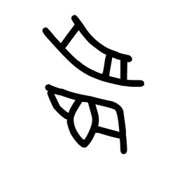

# Component Visual Gallery / 构件图像查看: obs-comp-cand-001932

English:
This page displays OBIMD subcharacter PNG assets extracted into this concrete corpus object directory for human review.

简体中文：
本页展示抽取到当前具体 corpus 对象目录内的 OBIMD subcharacter PNG 资料，供人工复核使用。

Boundary / 边界：dataset image candidate only; not a confirmed component form, component assignment, or decipherment claim.

## asset-018718

- source_zip_member: `Sub-character Images/un7wnrhutk/un7wnrhutk/un7wnrhutk.png`
- checksum_sha256: `010dd1ffc477df1c052033da5e86461c3d6427733b4d922bf962deee10ae4237`
- review_status: `needs_human_visual_review`
- caution: OBIMD subcharacter image is a source-marked review asset only; it is not a confirmed component form, component assignment, or decipherment conclusion.
