# Component Visual Gallery / 构件图像查看: obs-comp-cand-001942

English:
This page displays OBIMD subcharacter PNG assets extracted into this concrete corpus object directory for human review.

简体中文：
本页展示抽取到当前具体 corpus 对象目录内的 OBIMD subcharacter PNG 资料，供人工复核使用。

Boundary / 边界：dataset image candidate only; not a confirmed component form, component assignment, or decipherment claim.

## asset-018728

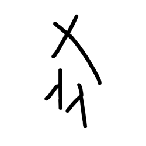

- source_zip_member: `Sub-character Images/41cgu5ewmd/g6g2sgdmcc/1va8ix542i.png`
- checksum_sha256: `672569924813d018c5be2fc03f42eb1f9198f73637db679857d3a82de2040139`
- review_status: `needs_human_visual_review`
- caution: OBIMD subcharacter image is a source-marked review asset only; it is not a confirmed component form, component assignment, or decipherment conclusion.

## asset-018729

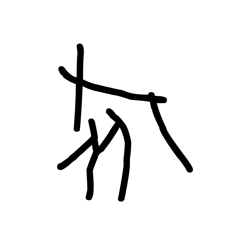

- source_zip_member: `Sub-character Images/41cgu5ewmd/g6g2sgdmcc/2226qg50o3.png`
- checksum_sha256: `2e0f5a8b2ee58c7b6b06ec10f456907392e5eb7836db0afb6856bc1c2f1ffb34`
- review_status: `needs_human_visual_review`
- caution: OBIMD subcharacter image is a source-marked review asset only; it is not a confirmed component form, component assignment, or decipherment conclusion.

## asset-018730

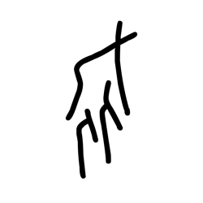

- source_zip_member: `Sub-character Images/41cgu5ewmd/g6g2sgdmcc/3f71sf170w.png`
- checksum_sha256: `0a98e8fbf96eebc08c5b8b0b9869aafabfe6313ce09da39263c0bc8232f65529`
- review_status: `needs_human_visual_review`
- caution: OBIMD subcharacter image is a source-marked review asset only; it is not a confirmed component form, component assignment, or decipherment conclusion.

## asset-018731

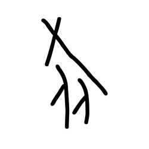

- source_zip_member: `Sub-character Images/41cgu5ewmd/g6g2sgdmcc/4yga9q3kb0.png`
- checksum_sha256: `5901a60dd6e651169268abf7fab5e1a90d1317d84e2619a228dc35ad839fa3c9`
- review_status: `needs_human_visual_review`
- caution: OBIMD subcharacter image is a source-marked review asset only; it is not a confirmed component form, component assignment, or decipherment conclusion.

## asset-018732

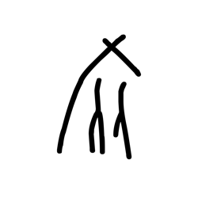

- source_zip_member: `Sub-character Images/41cgu5ewmd/g6g2sgdmcc/5gptxle9i4.png`
- checksum_sha256: `00d5e3d97ddf46042248c3e0a5488d1f7ab0e78e78637d15915c6bfc166c47ba`
- review_status: `needs_human_visual_review`
- caution: OBIMD subcharacter image is a source-marked review asset only; it is not a confirmed component form, component assignment, or decipherment conclusion.

## asset-018733

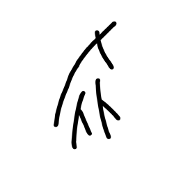

- source_zip_member: `Sub-character Images/41cgu5ewmd/g6g2sgdmcc/69yfure6pl.png`
- checksum_sha256: `06bf183471b0b90544b92785f6b83e37f728c9486f8b8251ac62f3005cc29588`
- review_status: `needs_human_visual_review`
- caution: OBIMD subcharacter image is a source-marked review asset only; it is not a confirmed component form, component assignment, or decipherment conclusion.

## asset-018734

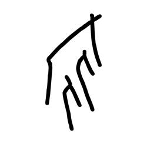

- source_zip_member: `Sub-character Images/41cgu5ewmd/g6g2sgdmcc/6et2oopk70.png`
- checksum_sha256: `2279143a69c4201897699af0ad50653c448da430d8b09597719040ee6f09aa41`
- review_status: `needs_human_visual_review`
- caution: OBIMD subcharacter image is a source-marked review asset only; it is not a confirmed component form, component assignment, or decipherment conclusion.

## asset-018735

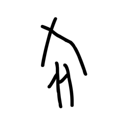

- source_zip_member: `Sub-character Images/41cgu5ewmd/g6g2sgdmcc/7cgl9rl09l.png`
- checksum_sha256: `8ce096ae5ef6b83dc97148e9f922e25edc1f3c6384d3c53331d43464af8c2b56`
- review_status: `needs_human_visual_review`
- caution: OBIMD subcharacter image is a source-marked review asset only; it is not a confirmed component form, component assignment, or decipherment conclusion.

## asset-018736

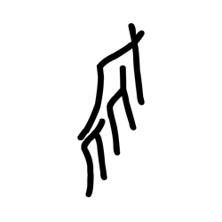

- source_zip_member: `Sub-character Images/41cgu5ewmd/g6g2sgdmcc/9u43mdtk30.png`
- checksum_sha256: `4a4bcc4ae9c1e73ab7d31bd867bce7db3d56767460c262389450813a2646742d`
- review_status: `needs_human_visual_review`
- caution: OBIMD subcharacter image is a source-marked review asset only; it is not a confirmed component form, component assignment, or decipherment conclusion.

## asset-018737

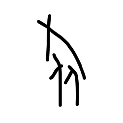

- source_zip_member: `Sub-character Images/41cgu5ewmd/g6g2sgdmcc/aw8aeyyehi.png`
- checksum_sha256: `3cf356aa245bf200e9d2af725ab3e7b1c458b33b3f0f455c1d85a52ba71d7326`
- review_status: `needs_human_visual_review`
- caution: OBIMD subcharacter image is a source-marked review asset only; it is not a confirmed component form, component assignment, or decipherment conclusion.

## asset-018738

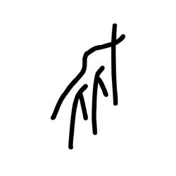

- source_zip_member: `Sub-character Images/41cgu5ewmd/g6g2sgdmcc/e3xc1zwncq.png`
- checksum_sha256: `3c21a54d143c8db86afa89f5985a15ccdba41ccc0fb3b49df19448f441e3e4b8`
- review_status: `needs_human_visual_review`
- caution: OBIMD subcharacter image is a source-marked review asset only; it is not a confirmed component form, component assignment, or decipherment conclusion.

## asset-018739

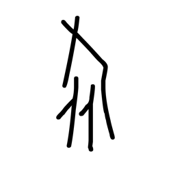

- source_zip_member: `Sub-character Images/41cgu5ewmd/g6g2sgdmcc/g6g2sgdmcc.png`
- checksum_sha256: `e03552cdbc87ca4350084c92df241091301910d057ac04ccf44d3a85d9ef5125`
- review_status: `needs_human_visual_review`
- caution: OBIMD subcharacter image is a source-marked review asset only; it is not a confirmed component form, component assignment, or decipherment conclusion.

## asset-018740

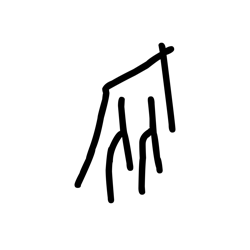

- source_zip_member: `Sub-character Images/41cgu5ewmd/g6g2sgdmcc/h34s8uya4n.png`
- checksum_sha256: `4e708dd36873f1aba7c35fa78b647f94b14b2e49b27742839843a60d03ba605b`
- review_status: `needs_human_visual_review`
- caution: OBIMD subcharacter image is a source-marked review asset only; it is not a confirmed component form, component assignment, or decipherment conclusion.

## asset-018741

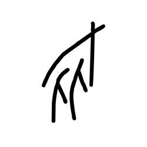

- source_zip_member: `Sub-character Images/41cgu5ewmd/g6g2sgdmcc/kvufn53w7k.png`
- checksum_sha256: `033626e039501bfd560743726bb71f2cb3d9883f429d04474585babed95978bf`
- review_status: `needs_human_visual_review`
- caution: OBIMD subcharacter image is a source-marked review asset only; it is not a confirmed component form, component assignment, or decipherment conclusion.

## asset-018742

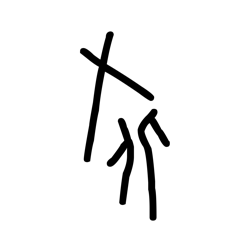

- source_zip_member: `Sub-character Images/41cgu5ewmd/g6g2sgdmcc/llstyfxwsf.png`
- checksum_sha256: `528284955e8d3d4470bf3c68f42734e6631991da172834550f925326866d423c`
- review_status: `needs_human_visual_review`
- caution: OBIMD subcharacter image is a source-marked review asset only; it is not a confirmed component form, component assignment, or decipherment conclusion.

## asset-018743

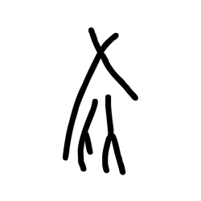

- source_zip_member: `Sub-character Images/41cgu5ewmd/g6g2sgdmcc/ltfqgbtu3d.png`
- checksum_sha256: `a368e26099b323e887d73206b1631315ae7a38cf96b6ed564620363bb5435456`
- review_status: `needs_human_visual_review`
- caution: OBIMD subcharacter image is a source-marked review asset only; it is not a confirmed component form, component assignment, or decipherment conclusion.

## asset-018744

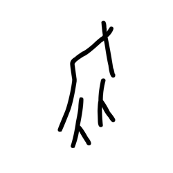

- source_zip_member: `Sub-character Images/41cgu5ewmd/g6g2sgdmcc/nvq2ocbkze.png`
- checksum_sha256: `04bafe9cbd2749ab87af64af0d09035f9cbcded1c73512f3195673b54407b631`
- review_status: `needs_human_visual_review`
- caution: OBIMD subcharacter image is a source-marked review asset only; it is not a confirmed component form, component assignment, or decipherment conclusion.

## asset-018745

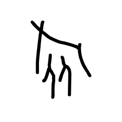

- source_zip_member: `Sub-character Images/41cgu5ewmd/g6g2sgdmcc/p2r7wjp404.png`
- checksum_sha256: `b32762c9f1392e2ff34542879f7da4b54368d3c5e863ce4f14e7abea743d03fb`
- review_status: `needs_human_visual_review`
- caution: OBIMD subcharacter image is a source-marked review asset only; it is not a confirmed component form, component assignment, or decipherment conclusion.

## asset-018746

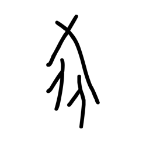

- source_zip_member: `Sub-character Images/41cgu5ewmd/g6g2sgdmcc/pi0bfpd0b7.png`
- checksum_sha256: `33be5415c303af369e51090624852665d30d5e4b23c09a99954bcf354cc40b6f`
- review_status: `needs_human_visual_review`
- caution: OBIMD subcharacter image is a source-marked review asset only; it is not a confirmed component form, component assignment, or decipherment conclusion.

## asset-018747

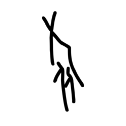

- source_zip_member: `Sub-character Images/41cgu5ewmd/g6g2sgdmcc/pmwpck3q9w.png`
- checksum_sha256: `e8d0239ffab50460b868cec98926eb5b5783247e233359fd2afca8e64c41c745`
- review_status: `needs_human_visual_review`
- caution: OBIMD subcharacter image is a source-marked review asset only; it is not a confirmed component form, component assignment, or decipherment conclusion.

## asset-018748

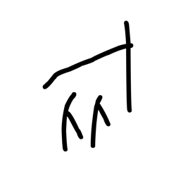

- source_zip_member: `Sub-character Images/41cgu5ewmd/g6g2sgdmcc/tmbn7pduh8.png`
- checksum_sha256: `22b4474be7c3db01f5e7d799995c7659d7484c7f71888c91a626589e2ff67389`
- review_status: `needs_human_visual_review`
- caution: OBIMD subcharacter image is a source-marked review asset only; it is not a confirmed component form, component assignment, or decipherment conclusion.

## asset-018749

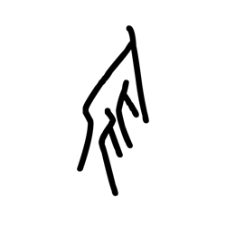

- source_zip_member: `Sub-character Images/41cgu5ewmd/g6g2sgdmcc/u5ax9nmw20.png`
- checksum_sha256: `8306842b1ee04d933d71795402f27a36ba70758ff6481d1f88355bd177fea539`
- review_status: `needs_human_visual_review`
- caution: OBIMD subcharacter image is a source-marked review asset only; it is not a confirmed component form, component assignment, or decipherment conclusion.

## asset-018750

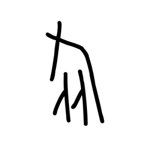

- source_zip_member: `Sub-character Images/41cgu5ewmd/g6g2sgdmcc/v5l6qkbok3.png`
- checksum_sha256: `8c93af2e5dce65b5047630542141fa571c3ffe5a11c201b9a0f50141f9023728`
- review_status: `needs_human_visual_review`
- caution: OBIMD subcharacter image is a source-marked review asset only; it is not a confirmed component form, component assignment, or decipherment conclusion.

## asset-018751

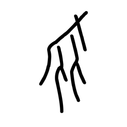

- source_zip_member: `Sub-character Images/41cgu5ewmd/g6g2sgdmcc/ygyzji4u9j.png`
- checksum_sha256: `0735f2b8abd5b3bfe27056113dd74c819ded217f8ef90f59c8f3fe7579bbcf4e`
- review_status: `needs_human_visual_review`
- caution: OBIMD subcharacter image is a source-marked review asset only; it is not a confirmed component form, component assignment, or decipherment conclusion.

## asset-018752

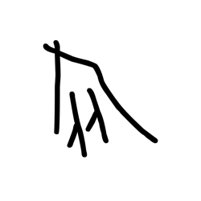

- source_zip_member: `Sub-character Images/41cgu5ewmd/g6g2sgdmcc/zuqa61dtzc.png`
- checksum_sha256: `a6dbe2b9dadb02e55e9412dc2ffafb09c90e0cbefa401d3cf900955e468f40ed`
- review_status: `needs_human_visual_review`
- caution: OBIMD subcharacter image is a source-marked review asset only; it is not a confirmed component form, component assignment, or decipherment conclusion.
