# Component Visual Gallery / 构件图像查看: obs-comp-cand-001963

English:
This page displays OBIMD subcharacter PNG assets extracted into this concrete
corpus object directory for human review.

简体中文：
本页展示抽取到当前具体 corpus 对象目录内的 OBIMD subcharacter PNG 资料，供人工复核使用。

Boundary / 边界：
dataset image candidate only; not a confirmed component form, not a component
assignment, and not a decipherment claim.
- not a confirmed component form
- not a component assignment
- not a decipherment claim

## Concrete Questions To Check / 具体待查问题

- Open 06_component-visual-index.csv and name the local image row.
- 打开 06_component-visual-index.csv，写明本地图像行。
- Open 09_component-visual-route-index.csv and name the source route row.
- 打开 09_component-visual-route-index.csv，写明来源路线行。
- Open 13_component-context-evidence-dossier.md for character context.
- 打开 13_component-context-evidence-dossier.md，核对单字与卜辞上下文。
- Record the missing image, near-shape, source, or context route.
- 记录缺失的图像、近形、来源或上下文路线。

## asset-018773

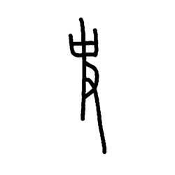

- source_zip_member: `Sub-character Images/h3nw474wwr/h3nw474wwr/01k3arwkvr.png`
- checksum_sha256: see `06_component-visual-index.csv`.
- review_status: `needs_human_visual_review`
- caution: source-marked review image only.

## asset-018774

- source_zip_member: `Sub-character Images/h3nw474wwr/h3nw474wwr/054b5k6esj.png`
- checksum_sha256: see `06_component-visual-index.csv`.
- review_status: `needs_human_visual_review`
- caution: source-marked review image only.

## asset-018775

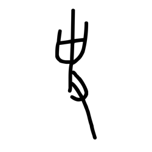

- source_zip_member: `Sub-character Images/h3nw474wwr/h3nw474wwr/125n963zex.png`
- checksum_sha256: see `06_component-visual-index.csv`.
- review_status: `needs_human_visual_review`
- caution: source-marked review image only.

## asset-018776

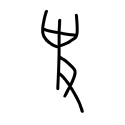

- source_zip_member: `Sub-character Images/h3nw474wwr/h3nw474wwr/15h5b6mcmn.png`
- checksum_sha256: see `06_component-visual-index.csv`.
- review_status: `needs_human_visual_review`
- caution: source-marked review image only.

## asset-018777

- source_zip_member: `Sub-character Images/h3nw474wwr/h3nw474wwr/1cqcx2h17h.png`
- checksum_sha256: see `06_component-visual-index.csv`.
- review_status: `needs_human_visual_review`
- caution: source-marked review image only.

## asset-018778

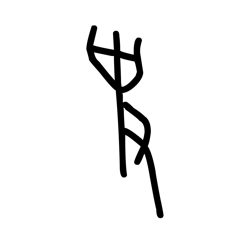

- source_zip_member: `Sub-character Images/h3nw474wwr/h3nw474wwr/220v5kju3x.png`
- checksum_sha256: see `06_component-visual-index.csv`.
- review_status: `needs_human_visual_review`
- caution: source-marked review image only.

## asset-018779

- source_zip_member: `Sub-character Images/h3nw474wwr/h3nw474wwr/2428627eb9.png`
- checksum_sha256: see `06_component-visual-index.csv`.
- review_status: `needs_human_visual_review`
- caution: source-marked review image only.

## asset-018780

- source_zip_member: `Sub-character Images/h3nw474wwr/h3nw474wwr/313scljz8t.png`
- checksum_sha256: see `06_component-visual-index.csv`.
- review_status: `needs_human_visual_review`
- caution: source-marked review image only.

## asset-018781

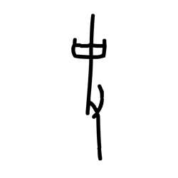

- source_zip_member: `Sub-character Images/h3nw474wwr/h3nw474wwr/31mup1hdho.png`
- checksum_sha256: see `06_component-visual-index.csv`.
- review_status: `needs_human_visual_review`
- caution: source-marked review image only.

## asset-018782

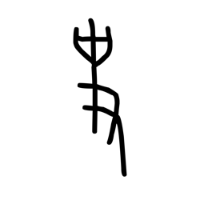

- source_zip_member: `Sub-character Images/h3nw474wwr/h3nw474wwr/43n6113dek.png`
- checksum_sha256: see `06_component-visual-index.csv`.
- review_status: `needs_human_visual_review`
- caution: source-marked review image only.

## asset-018783

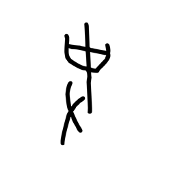

- source_zip_member: `Sub-character Images/h3nw474wwr/h3nw474wwr/4yzkz86t8u.png`
- checksum_sha256: see `06_component-visual-index.csv`.
- review_status: `needs_human_visual_review`
- caution: source-marked review image only.

## asset-018784

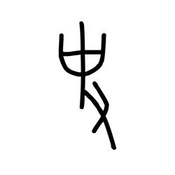

- source_zip_member: `Sub-character Images/h3nw474wwr/h3nw474wwr/52kzjje531.png`
- checksum_sha256: see `06_component-visual-index.csv`.
- review_status: `needs_human_visual_review`
- caution: source-marked review image only.

## asset-018785

- source_zip_member: `Sub-character Images/h3nw474wwr/h3nw474wwr/55kfw15kzf.png`
- checksum_sha256: see `06_component-visual-index.csv`.
- review_status: `needs_human_visual_review`
- caution: source-marked review image only.

## asset-018786

- source_zip_member: `Sub-character Images/h3nw474wwr/h3nw474wwr/5vp4uwlq3e.png`
- checksum_sha256: see `06_component-visual-index.csv`.
- review_status: `needs_human_visual_review`
- caution: source-marked review image only.

## asset-018787

- source_zip_member: `Sub-character Images/h3nw474wwr/h3nw474wwr/65snua9mbs.png`
- checksum_sha256: see `06_component-visual-index.csv`.
- review_status: `needs_human_visual_review`
- caution: source-marked review image only.

## asset-018788

- source_zip_member: `Sub-character Images/h3nw474wwr/h3nw474wwr/7cil88kdcg.png`
- checksum_sha256: see `06_component-visual-index.csv`.
- review_status: `needs_human_visual_review`
- caution: source-marked review image only.

## asset-018789

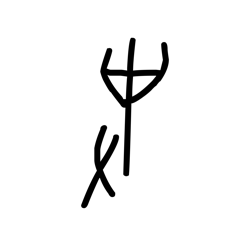

- source_zip_member: `Sub-character Images/h3nw474wwr/h3nw474wwr/7i4otm3nfu.png`
- checksum_sha256: see `06_component-visual-index.csv`.
- review_status: `needs_human_visual_review`
- caution: source-marked review image only.

## asset-018790

- source_zip_member: `Sub-character Images/h3nw474wwr/h3nw474wwr/7u2haex6zm.png`
- checksum_sha256: see `06_component-visual-index.csv`.
- review_status: `needs_human_visual_review`
- caution: source-marked review image only.

## asset-018791

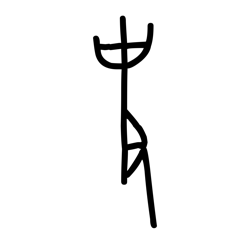

- source_zip_member: `Sub-character Images/h3nw474wwr/h3nw474wwr/80v0jrmbyy.png`
- checksum_sha256: see `06_component-visual-index.csv`.
- review_status: `needs_human_visual_review`
- caution: source-marked review image only.

## asset-018792

- source_zip_member: `Sub-character Images/h3nw474wwr/h3nw474wwr/83eynxnzuw.png`
- checksum_sha256: see `06_component-visual-index.csv`.
- review_status: `needs_human_visual_review`
- caution: source-marked review image only.

## asset-018793

- source_zip_member: `Sub-character Images/h3nw474wwr/h3nw474wwr/8dsh91y1xx.png`
- checksum_sha256: see `06_component-visual-index.csv`.
- review_status: `needs_human_visual_review`
- caution: source-marked review image only.

## asset-018794

- source_zip_member: `Sub-character Images/h3nw474wwr/h3nw474wwr/8hofeoy4cy.png`
- checksum_sha256: see `06_component-visual-index.csv`.
- review_status: `needs_human_visual_review`
- caution: source-marked review image only.

## asset-018795

- source_zip_member: `Sub-character Images/h3nw474wwr/h3nw474wwr/8vgp9j116o.png`
- checksum_sha256: see `06_component-visual-index.csv`.
- review_status: `needs_human_visual_review`
- caution: source-marked review image only.

## asset-018796

- source_zip_member: `Sub-character Images/h3nw474wwr/h3nw474wwr/924mpud8z2.png`
- checksum_sha256: see `06_component-visual-index.csv`.
- review_status: `needs_human_visual_review`
- caution: source-marked review image only.

## asset-018797

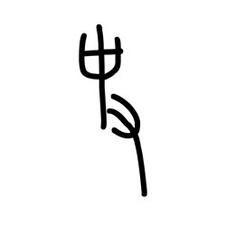

- source_zip_member: `Sub-character Images/h3nw474wwr/h3nw474wwr/9gz4pta8g8.png`
- checksum_sha256: see `06_component-visual-index.csv`.
- review_status: `needs_human_visual_review`
- caution: source-marked review image only.

## asset-018798

- source_zip_member: `Sub-character Images/h3nw474wwr/h3nw474wwr/9ncbl6qlcs.png`
- checksum_sha256: see `06_component-visual-index.csv`.
- review_status: `needs_human_visual_review`
- caution: source-marked review image only.

## asset-018799

- source_zip_member: `Sub-character Images/h3nw474wwr/h3nw474wwr/alg37m67rl.png`
- checksum_sha256: see `06_component-visual-index.csv`.
- review_status: `needs_human_visual_review`
- caution: source-marked review image only.

## asset-018800

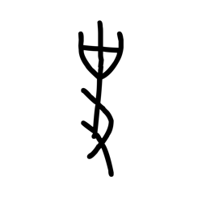

- source_zip_member: `Sub-character Images/h3nw474wwr/h3nw474wwr/asa9itcscq.png`
- checksum_sha256: see `06_component-visual-index.csv`.
- review_status: `needs_human_visual_review`
- caution: source-marked review image only.

## asset-018801

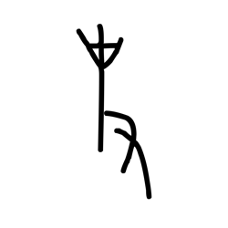

- source_zip_member: `Sub-character Images/h3nw474wwr/h3nw474wwr/atz5w4b2o3.png`
- checksum_sha256: see `06_component-visual-index.csv`.
- review_status: `needs_human_visual_review`
- caution: source-marked review image only.

## asset-018802

- source_zip_member: `Sub-character Images/h3nw474wwr/h3nw474wwr/bvwouzh9dr.png`
- checksum_sha256: see `06_component-visual-index.csv`.
- review_status: `needs_human_visual_review`
- caution: source-marked review image only.

## asset-018803

- source_zip_member: `Sub-character Images/h3nw474wwr/h3nw474wwr/c9jovweb0i.png`
- checksum_sha256: see `06_component-visual-index.csv`.
- review_status: `needs_human_visual_review`
- caution: source-marked review image only.

## asset-018804

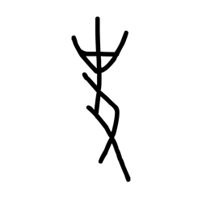

- source_zip_member: `Sub-character Images/h3nw474wwr/h3nw474wwr/cjvt3w1pbs.png`
- checksum_sha256: see `06_component-visual-index.csv`.
- review_status: `needs_human_visual_review`
- caution: source-marked review image only.

## asset-018805

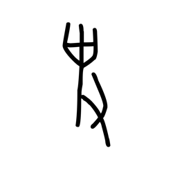

- source_zip_member: `Sub-character Images/h3nw474wwr/h3nw474wwr/clgli34jwh.png`
- checksum_sha256: see `06_component-visual-index.csv`.
- review_status: `needs_human_visual_review`
- caution: source-marked review image only.

## asset-018806

- source_zip_member: `Sub-character Images/h3nw474wwr/h3nw474wwr/d8tzx78j7g.png`
- checksum_sha256: see `06_component-visual-index.csv`.
- review_status: `needs_human_visual_review`
- caution: source-marked review image only.

## asset-018807

- source_zip_member: `Sub-character Images/h3nw474wwr/h3nw474wwr/dd65lqfoge.png`
- checksum_sha256: see `06_component-visual-index.csv`.
- review_status: `needs_human_visual_review`
- caution: source-marked review image only.

## asset-018808

- source_zip_member: `Sub-character Images/h3nw474wwr/h3nw474wwr/de3rfatbw0.png`
- checksum_sha256: see `06_component-visual-index.csv`.
- review_status: `needs_human_visual_review`
- caution: source-marked review image only.

## asset-018809

- source_zip_member: `Sub-character Images/h3nw474wwr/h3nw474wwr/dfrm8riyw4.png`
- checksum_sha256: see `06_component-visual-index.csv`.
- review_status: `needs_human_visual_review`
- caution: source-marked review image only.

## asset-018810

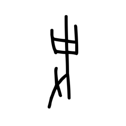

- source_zip_member: `Sub-character Images/h3nw474wwr/h3nw474wwr/di0q7sxkkp.png`
- checksum_sha256: see `06_component-visual-index.csv`.
- review_status: `needs_human_visual_review`
- caution: source-marked review image only.

## asset-018811

- source_zip_member: `Sub-character Images/h3nw474wwr/h3nw474wwr/e4i8ye3p3w.png`
- checksum_sha256: see `06_component-visual-index.csv`.
- review_status: `needs_human_visual_review`
- caution: source-marked review image only.

## asset-018812

- source_zip_member: `Sub-character Images/h3nw474wwr/h3nw474wwr/e7yn22m7yw.png`
- checksum_sha256: see `06_component-visual-index.csv`.
- review_status: `needs_human_visual_review`
- caution: source-marked review image only.

## asset-018813

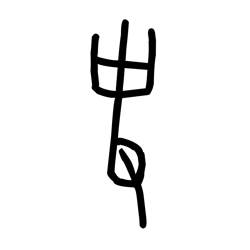

- source_zip_member: `Sub-character Images/h3nw474wwr/h3nw474wwr/eey4h0ypdn.png`
- checksum_sha256: see `06_component-visual-index.csv`.
- review_status: `needs_human_visual_review`
- caution: source-marked review image only.

## asset-018814

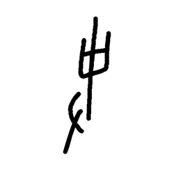

- source_zip_member: `Sub-character Images/h3nw474wwr/h3nw474wwr/f0a6teiotf.png`
- checksum_sha256: see `06_component-visual-index.csv`.
- review_status: `needs_human_visual_review`
- caution: source-marked review image only.

## asset-018815

- source_zip_member: `Sub-character Images/h3nw474wwr/h3nw474wwr/f4syauw3wv.png`
- checksum_sha256: see `06_component-visual-index.csv`.
- review_status: `needs_human_visual_review`
- caution: source-marked review image only.

## asset-018816

- source_zip_member: `Sub-character Images/h3nw474wwr/h3nw474wwr/gbuobnx0fg.png`
- checksum_sha256: see `06_component-visual-index.csv`.
- review_status: `needs_human_visual_review`
- caution: source-marked review image only.

## asset-018817

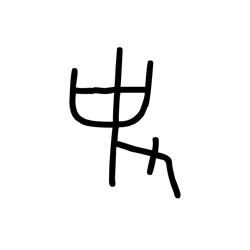

- source_zip_member: `Sub-character Images/h3nw474wwr/h3nw474wwr/ghvuxlw0ai.png`
- checksum_sha256: see `06_component-visual-index.csv`.
- review_status: `needs_human_visual_review`
- caution: source-marked review image only.

## asset-018818

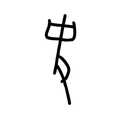

- source_zip_member: `Sub-character Images/h3nw474wwr/h3nw474wwr/gynpepv8fy.png`
- checksum_sha256: see `06_component-visual-index.csv`.
- review_status: `needs_human_visual_review`
- caution: source-marked review image only.

## asset-018819

- source_zip_member: `Sub-character Images/h3nw474wwr/h3nw474wwr/h3nw474wwr.png`
- checksum_sha256: see `06_component-visual-index.csv`.
- review_status: `needs_human_visual_review`
- caution: source-marked review image only.

## asset-018820

- source_zip_member: `Sub-character Images/h3nw474wwr/h3nw474wwr/iq1qqa1qls.png`
- checksum_sha256: see `06_component-visual-index.csv`.
- review_status: `needs_human_visual_review`
- caution: source-marked review image only.

## asset-018821

- source_zip_member: `Sub-character Images/h3nw474wwr/h3nw474wwr/ja9286lzzq.png`
- checksum_sha256: see `06_component-visual-index.csv`.
- review_status: `needs_human_visual_review`
- caution: source-marked review image only.

## asset-018822

- source_zip_member: `Sub-character Images/h3nw474wwr/h3nw474wwr/jislchpfbm.png`
- checksum_sha256: see `06_component-visual-index.csv`.
- review_status: `needs_human_visual_review`
- caution: source-marked review image only.

## asset-018823

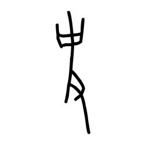

- source_zip_member: `Sub-character Images/h3nw474wwr/h3nw474wwr/jq8ceku0wc.png`
- checksum_sha256: see `06_component-visual-index.csv`.
- review_status: `needs_human_visual_review`
- caution: source-marked review image only.

## asset-018824

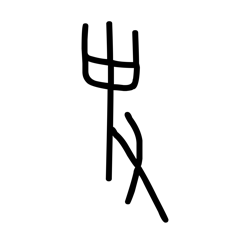

- source_zip_member: `Sub-character Images/h3nw474wwr/h3nw474wwr/jx4ha23tva.png`
- checksum_sha256: see `06_component-visual-index.csv`.
- review_status: `needs_human_visual_review`
- caution: source-marked review image only.

## asset-018825

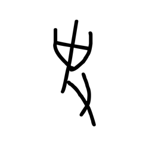

- source_zip_member: `Sub-character Images/h3nw474wwr/h3nw474wwr/k6mkgotqhk.png`
- checksum_sha256: see `06_component-visual-index.csv`.
- review_status: `needs_human_visual_review`
- caution: source-marked review image only.

## asset-018826

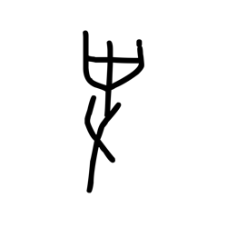

- source_zip_member: `Sub-character Images/h3nw474wwr/h3nw474wwr/km6tsg52dc.png`
- checksum_sha256: see `06_component-visual-index.csv`.
- review_status: `needs_human_visual_review`
- caution: source-marked review image only.

## asset-018827

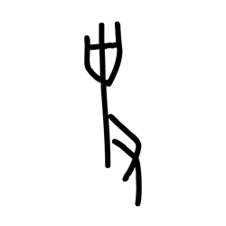

- source_zip_member: `Sub-character Images/h3nw474wwr/h3nw474wwr/kukd22v8cn.png`
- checksum_sha256: see `06_component-visual-index.csv`.
- review_status: `needs_human_visual_review`
- caution: source-marked review image only.

## asset-018828

- source_zip_member: `Sub-character Images/h3nw474wwr/h3nw474wwr/kvw20gnnxr.png`
- checksum_sha256: see `06_component-visual-index.csv`.
- review_status: `needs_human_visual_review`
- caution: source-marked review image only.

## asset-018829

- source_zip_member: `Sub-character Images/h3nw474wwr/h3nw474wwr/l6mflp75k6.png`
- checksum_sha256: see `06_component-visual-index.csv`.
- review_status: `needs_human_visual_review`
- caution: source-marked review image only.

## asset-018830

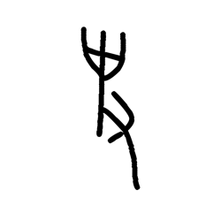

- source_zip_member: `Sub-character Images/h3nw474wwr/h3nw474wwr/mmaa7c957b.png`
- checksum_sha256: see `06_component-visual-index.csv`.
- review_status: `needs_human_visual_review`
- caution: source-marked review image only.

## asset-018831

- source_zip_member: `Sub-character Images/h3nw474wwr/h3nw474wwr/mta9kvwceq.png`
- checksum_sha256: see `06_component-visual-index.csv`.
- review_status: `needs_human_visual_review`
- caution: source-marked review image only.

## asset-018832

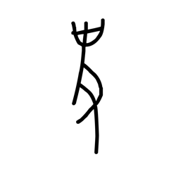

- source_zip_member: `Sub-character Images/h3nw474wwr/h3nw474wwr/mw5u1nvjtr.png`
- checksum_sha256: see `06_component-visual-index.csv`.
- review_status: `needs_human_visual_review`
- caution: source-marked review image only.

## asset-018833

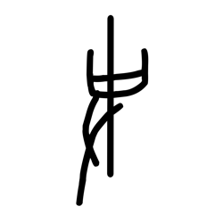

- source_zip_member: `Sub-character Images/h3nw474wwr/h3nw474wwr/o4ce4xfzvj.png`
- checksum_sha256: see `06_component-visual-index.csv`.
- review_status: `needs_human_visual_review`
- caution: source-marked review image only.

## asset-018834

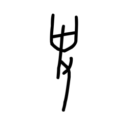

- source_zip_member: `Sub-character Images/h3nw474wwr/h3nw474wwr/o4s0d47b67.png`
- checksum_sha256: see `06_component-visual-index.csv`.
- review_status: `needs_human_visual_review`
- caution: source-marked review image only.

## asset-018835

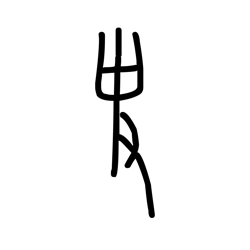

- source_zip_member: `Sub-character Images/h3nw474wwr/h3nw474wwr/ort0fw6upa.png`
- checksum_sha256: see `06_component-visual-index.csv`.
- review_status: `needs_human_visual_review`
- caution: source-marked review image only.

## asset-018836

- source_zip_member: `Sub-character Images/h3nw474wwr/h3nw474wwr/ovf1xuawbn.png`
- checksum_sha256: see `06_component-visual-index.csv`.
- review_status: `needs_human_visual_review`
- caution: source-marked review image only.

## asset-018837

- source_zip_member: `Sub-character Images/h3nw474wwr/h3nw474wwr/p8cxl6aw36.png`
- checksum_sha256: see `06_component-visual-index.csv`.
- review_status: `needs_human_visual_review`
- caution: source-marked review image only.

## asset-018838

- source_zip_member: `Sub-character Images/h3nw474wwr/h3nw474wwr/pl1vk00f0z.png`
- checksum_sha256: see `06_component-visual-index.csv`.
- review_status: `needs_human_visual_review`
- caution: source-marked review image only.

## asset-018839

- source_zip_member: `Sub-character Images/h3nw474wwr/h3nw474wwr/q7m8zyg6cq.png`
- checksum_sha256: see `06_component-visual-index.csv`.
- review_status: `needs_human_visual_review`
- caution: source-marked review image only.

## asset-018840

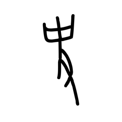

- source_zip_member: `Sub-character Images/h3nw474wwr/h3nw474wwr/qr5swh7b2u.png`
- checksum_sha256: see `06_component-visual-index.csv`.
- review_status: `needs_human_visual_review`
- caution: source-marked review image only.

## asset-018841

- source_zip_member: `Sub-character Images/h3nw474wwr/h3nw474wwr/r10i2oeq4b.png`
- checksum_sha256: see `06_component-visual-index.csv`.
- review_status: `needs_human_visual_review`
- caution: source-marked review image only.

## asset-018842

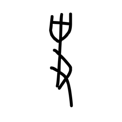

- source_zip_member: `Sub-character Images/h3nw474wwr/h3nw474wwr/rmxmhic4ub.png`
- checksum_sha256: see `06_component-visual-index.csv`.
- review_status: `needs_human_visual_review`
- caution: source-marked review image only.

## asset-018843

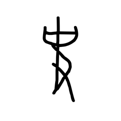

- source_zip_member: `Sub-character Images/h3nw474wwr/h3nw474wwr/rnqxz78rdr.png`
- checksum_sha256: see `06_component-visual-index.csv`.
- review_status: `needs_human_visual_review`
- caution: source-marked review image only.

## asset-018844

- source_zip_member: `Sub-character Images/h3nw474wwr/h3nw474wwr/sc9uxsyvbb.png`
- checksum_sha256: see `06_component-visual-index.csv`.
- review_status: `needs_human_visual_review`
- caution: source-marked review image only.

## asset-018845

- source_zip_member: `Sub-character Images/h3nw474wwr/h3nw474wwr/t4mergkowr.png`
- checksum_sha256: see `06_component-visual-index.csv`.
- review_status: `needs_human_visual_review`
- caution: source-marked review image only.

## asset-018846

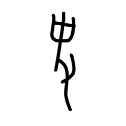

- source_zip_member: `Sub-character Images/h3nw474wwr/h3nw474wwr/thysz9ogy2.png`
- checksum_sha256: see `06_component-visual-index.csv`.
- review_status: `needs_human_visual_review`
- caution: source-marked review image only.

## asset-018847

- source_zip_member: `Sub-character Images/h3nw474wwr/h3nw474wwr/twgqcr8kik.png`
- checksum_sha256: see `06_component-visual-index.csv`.
- review_status: `needs_human_visual_review`
- caution: source-marked review image only.

## asset-018848

- source_zip_member: `Sub-character Images/h3nw474wwr/h3nw474wwr/umipohoi7n.png`
- checksum_sha256: see `06_component-visual-index.csv`.
- review_status: `needs_human_visual_review`
- caution: source-marked review image only.

## asset-018849

- source_zip_member: `Sub-character Images/h3nw474wwr/h3nw474wwr/v9cfnciest.png`
- checksum_sha256: see `06_component-visual-index.csv`.
- review_status: `needs_human_visual_review`
- caution: source-marked review image only.

## asset-018850

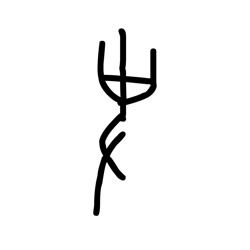

- source_zip_member: `Sub-character Images/h3nw474wwr/h3nw474wwr/vihacslv6c.png`
- checksum_sha256: see `06_component-visual-index.csv`.
- review_status: `needs_human_visual_review`
- caution: source-marked review image only.

## asset-018851

- source_zip_member: `Sub-character Images/h3nw474wwr/h3nw474wwr/vkr2csyl03.png`
- checksum_sha256: see `06_component-visual-index.csv`.
- review_status: `needs_human_visual_review`
- caution: source-marked review image only.

## asset-018852

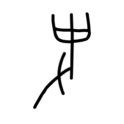

- source_zip_member: `Sub-character Images/h3nw474wwr/h3nw474wwr/xa223xkw4l.png`
- checksum_sha256: see `06_component-visual-index.csv`.
- review_status: `needs_human_visual_review`
- caution: source-marked review image only.

## asset-018853

- source_zip_member: `Sub-character Images/h3nw474wwr/h3nw474wwr/xc696k9ggh.png`
- checksum_sha256: see `06_component-visual-index.csv`.
- review_status: `needs_human_visual_review`
- caution: source-marked review image only.

## asset-018854

- source_zip_member: `Sub-character Images/h3nw474wwr/h3nw474wwr/xdcl8s1zg4.png`
- checksum_sha256: see `06_component-visual-index.csv`.
- review_status: `needs_human_visual_review`
- caution: source-marked review image only.

## asset-018855

- source_zip_member: `Sub-character Images/h3nw474wwr/h3nw474wwr/xn6qd52koa.png`
- checksum_sha256: see `06_component-visual-index.csv`.
- review_status: `needs_human_visual_review`
- caution: source-marked review image only.

## asset-018856

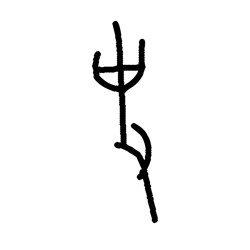

- source_zip_member: `Sub-character Images/h3nw474wwr/h3nw474wwr/xrqm57ujgi.png`
- checksum_sha256: see `06_component-visual-index.csv`.
- review_status: `needs_human_visual_review`
- caution: source-marked review image only.

## asset-018857

- source_zip_member: `Sub-character Images/h3nw474wwr/h3nw474wwr/xvzd3my67m.png`
- checksum_sha256: see `06_component-visual-index.csv`.
- review_status: `needs_human_visual_review`
- caution: source-marked review image only.

## asset-018858

- source_zip_member: `Sub-character Images/h3nw474wwr/h3nw474wwr/y1bo0ltb06.png`
- checksum_sha256: see `06_component-visual-index.csv`.
- review_status: `needs_human_visual_review`
- caution: source-marked review image only.

## asset-018859

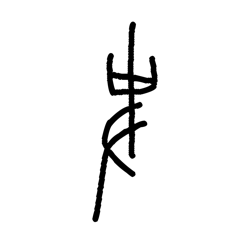

- source_zip_member: `Sub-character Images/h3nw474wwr/h3nw474wwr/yfsrg409ly.png`
- checksum_sha256: see `06_component-visual-index.csv`.
- review_status: `needs_human_visual_review`
- caution: source-marked review image only.

## asset-018860

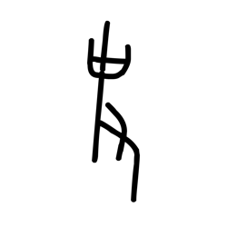

- source_zip_member: `Sub-character Images/h3nw474wwr/h3nw474wwr/yjlhge393o.png`
- checksum_sha256: see `06_component-visual-index.csv`.
- review_status: `needs_human_visual_review`
- caution: source-marked review image only.

## asset-018861

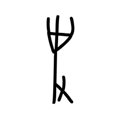

- source_zip_member: `Sub-character Images/h3nw474wwr/h3nw474wwr/yq1094ejb7.png`
- checksum_sha256: see `06_component-visual-index.csv`.
- review_status: `needs_human_visual_review`
- caution: source-marked review image only.

## asset-018862

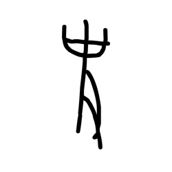

- source_zip_member: `Sub-character Images/h3nw474wwr/h3nw474wwr/yyslb0ls48.png`
- checksum_sha256: see `06_component-visual-index.csv`.
- review_status: `needs_human_visual_review`
- caution: source-marked review image only.

## asset-018863

- source_zip_member: `Sub-character Images/h3nw474wwr/h3nw474wwr/zabsss5ovo.png`
- checksum_sha256: see `06_component-visual-index.csv`.
- review_status: `needs_human_visual_review`
- caution: source-marked review image only.

## asset-018864

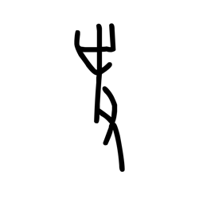

- source_zip_member: `Sub-character Images/h3nw474wwr/h3nw474wwr/ze023ygn8f.png`
- checksum_sha256: see `06_component-visual-index.csv`.
- review_status: `needs_human_visual_review`
- caution: source-marked review image only.

## asset-018865

- source_zip_member: `Sub-character Images/h3nw474wwr/h3nw474wwr/zlsw8pczlr.png`
- checksum_sha256: see `06_component-visual-index.csv`.
- review_status: `needs_human_visual_review`
- caution: source-marked review image only.

## asset-018866

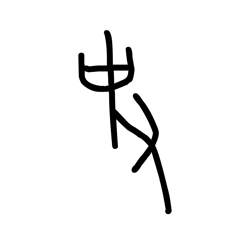

- source_zip_member: `Sub-character Images/h3nw474wwr/h3nw474wwr/zlwdu275mm.png`
- checksum_sha256: see `06_component-visual-index.csv`.
- review_status: `needs_human_visual_review`
- caution: source-marked review image only.
