# Component Visual Gallery / 构件图像查看: obs-comp-cand-001964

English:
This page displays OBIMD subcharacter PNG assets extracted into this concrete corpus object directory for human review.

简体中文：
本页展示抽取到当前具体 corpus 对象目录内的 OBIMD subcharacter PNG 资料，供人工复核使用。

Boundary / 边界：dataset image candidate only; not a confirmed component form, component assignment, or decipherment claim.

## asset-018867

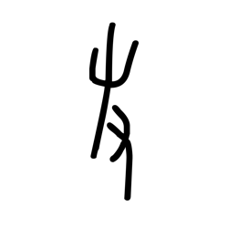

- source_zip_member: `Sub-character Images/h3nw474wwr/zfhqq2e4uc/3oby180lz1.png`
- checksum_sha256: `8212042b5d0159616f9a8b75207c8322312723d93880091139869768f15f1ca7`
- review_status: `needs_human_visual_review`
- caution: OBIMD subcharacter image is a source-marked review asset only; it is not a confirmed component form, component assignment, or decipherment conclusion.

## asset-018868

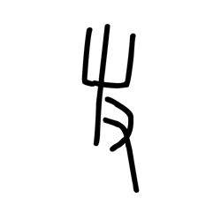

- source_zip_member: `Sub-character Images/h3nw474wwr/zfhqq2e4uc/5zwmg49kfg.png`
- checksum_sha256: `3b28eec4b9104b0fc0de424a29491f46ee4ca967f68221399e4173b8827f67ad`
- review_status: `needs_human_visual_review`
- caution: OBIMD subcharacter image is a source-marked review asset only; it is not a confirmed component form, component assignment, or decipherment conclusion.

## asset-018869

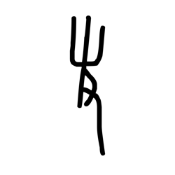

- source_zip_member: `Sub-character Images/h3nw474wwr/zfhqq2e4uc/7w58doilw3.png`
- checksum_sha256: `109b109c016282abacc21103e105dc423591691a4f5ffe167e0f1b97822e82f3`
- review_status: `needs_human_visual_review`
- caution: OBIMD subcharacter image is a source-marked review asset only; it is not a confirmed component form, component assignment, or decipherment conclusion.

## asset-018870

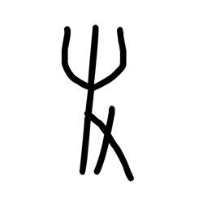

- source_zip_member: `Sub-character Images/h3nw474wwr/zfhqq2e4uc/agid5boj2d.png`
- checksum_sha256: `f5e030dc7fbc8872a2d7b20c3b2d7816fdbaf460ec24ea73aaa22393eb494a10`
- review_status: `needs_human_visual_review`
- caution: OBIMD subcharacter image is a source-marked review asset only; it is not a confirmed component form, component assignment, or decipherment conclusion.

## asset-018871

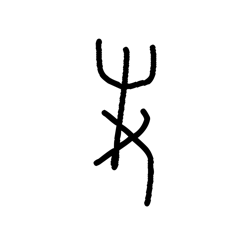

- source_zip_member: `Sub-character Images/h3nw474wwr/zfhqq2e4uc/hs52g5hl3n.png`
- checksum_sha256: `e026311d42a52f8c602c06c218898369353b894edbb3c4e2d3b84ac445b9d74d`
- review_status: `needs_human_visual_review`
- caution: OBIMD subcharacter image is a source-marked review asset only; it is not a confirmed component form, component assignment, or decipherment conclusion.

## asset-018872

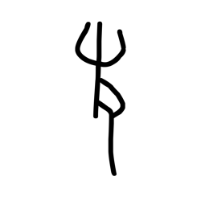

- source_zip_member: `Sub-character Images/h3nw474wwr/zfhqq2e4uc/kugtfwk8ch.png`
- checksum_sha256: `611c84d9acaf733e3e21d249accc6656ea70c1bb8e2e62b9a673f4382778cd92`
- review_status: `needs_human_visual_review`
- caution: OBIMD subcharacter image is a source-marked review asset only; it is not a confirmed component form, component assignment, or decipherment conclusion.

## asset-018873

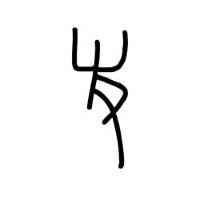

- source_zip_member: `Sub-character Images/h3nw474wwr/zfhqq2e4uc/lerjczsl3s.png`
- checksum_sha256: `64c04a34fd9d3eaa1b9c3691b2076bb1b4ab05dc0d669dcbec7a566b16850cf5`
- review_status: `needs_human_visual_review`
- caution: OBIMD subcharacter image is a source-marked review asset only; it is not a confirmed component form, component assignment, or decipherment conclusion.

## asset-018874

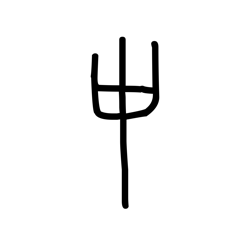

- source_zip_member: `Sub-character Images/h3nw474wwr/zfhqq2e4uc/nave1t25xm.png`
- checksum_sha256: `6ec73b3422bc9b7b2d597af2535500fe1d97f704c4b368c0f17d9ed5c04cac9f`
- review_status: `needs_human_visual_review`
- caution: OBIMD subcharacter image is a source-marked review asset only; it is not a confirmed component form, component assignment, or decipherment conclusion.

## asset-018875

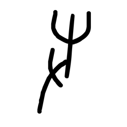

- source_zip_member: `Sub-character Images/h3nw474wwr/zfhqq2e4uc/qgaj9am7kn.png`
- checksum_sha256: `ef27d1882803427e04dbc8b4a26cfd1bebaf7e0e501ba35e1e943259b6202d9a`
- review_status: `needs_human_visual_review`
- caution: OBIMD subcharacter image is a source-marked review asset only; it is not a confirmed component form, component assignment, or decipherment conclusion.

## asset-018876

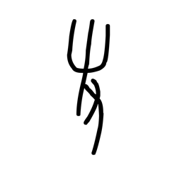

- source_zip_member: `Sub-character Images/h3nw474wwr/zfhqq2e4uc/qs00ex9o9m.png`
- checksum_sha256: `fe22c2472dfd98a6acceefcca0687715f6f341b5edd2beb1e1b91d5cfc56c460`
- review_status: `needs_human_visual_review`
- caution: OBIMD subcharacter image is a source-marked review asset only; it is not a confirmed component form, component assignment, or decipherment conclusion.

## asset-018877

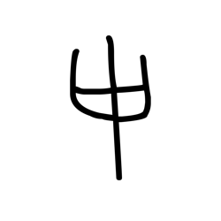

- source_zip_member: `Sub-character Images/h3nw474wwr/zfhqq2e4uc/rkos6h4jyy.png`
- checksum_sha256: `924fb4d80e75ce4cf33fd549a1c5af3e8df9bb53268dd61a400862eb91c774aa`
- review_status: `needs_human_visual_review`
- caution: OBIMD subcharacter image is a source-marked review asset only; it is not a confirmed component form, component assignment, or decipherment conclusion.

## asset-018878

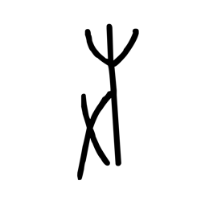

- source_zip_member: `Sub-character Images/h3nw474wwr/zfhqq2e4uc/ufhvuksbum.png`
- checksum_sha256: `60617b96c74cdde9be51d532d28fd92b4e33abe72e162b326ca057bfe2104b33`
- review_status: `needs_human_visual_review`
- caution: OBIMD subcharacter image is a source-marked review asset only; it is not a confirmed component form, component assignment, or decipherment conclusion.

## asset-018879

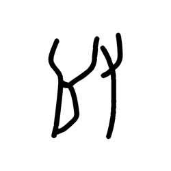

- source_zip_member: `Sub-character Images/h3nw474wwr/zfhqq2e4uc/uga9tmhe6s.png`
- checksum_sha256: `9e701696f260e0dabd79927eece4f611bd7c078a5aeeee13ea1ea9e7796c6d63`
- review_status: `needs_human_visual_review`
- caution: OBIMD subcharacter image is a source-marked review asset only; it is not a confirmed component form, component assignment, or decipherment conclusion.

## asset-018880

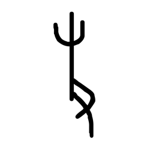

- source_zip_member: `Sub-character Images/h3nw474wwr/zfhqq2e4uc/v4o4yjnp98.png`
- checksum_sha256: `96e32fa4175d03a9ec3f9d5bc8815ee47b3729ad0debde2cba929be6e2541d0c`
- review_status: `needs_human_visual_review`
- caution: OBIMD subcharacter image is a source-marked review asset only; it is not a confirmed component form, component assignment, or decipherment conclusion.

## asset-018881

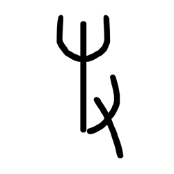

- source_zip_member: `Sub-character Images/h3nw474wwr/zfhqq2e4uc/zfhqq2e4uc.png`
- checksum_sha256: `615ef8c3960356992d0bed63a2eb98fe30b14847bd4a14b9ffdd2febcbe079fe`
- review_status: `needs_human_visual_review`
- caution: OBIMD subcharacter image is a source-marked review asset only; it is not a confirmed component form, component assignment, or decipherment conclusion.
