# Component Visual Gallery / 构件图像查看: obs-comp-cand-001968

English:
This page displays OBIMD subcharacter PNG assets extracted into this concrete corpus object directory for human review.

简体中文：
本页展示抽取到当前具体 corpus 对象目录内的 OBIMD subcharacter PNG 资料，供人工复核使用。

Boundary / 边界：dataset image candidate only; not a confirmed component form, component assignment, or decipherment claim.

## asset-018885

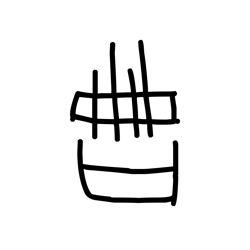

- source_zip_member: `Sub-character Images/h82z1bo3i3/h82z1bo3i3/11936zq9ne.png`
- checksum_sha256: `25e9910b983956e0d365daa2f1d285988f18e99106f078abf30eb2ba7d18133f`
- review_status: `needs_human_visual_review`
- caution: OBIMD subcharacter image is a source-marked review asset only; it is not a confirmed component form, component assignment, or decipherment conclusion.

## asset-018886

- source_zip_member: `Sub-character Images/h82z1bo3i3/h82z1bo3i3/127l8u7ybf.png`
- checksum_sha256: `4d50197a76fd6ca37cee7dac3b3f0c5098443d5d20f795efe42c510bf09cd0b6`
- review_status: `needs_human_visual_review`
- caution: OBIMD subcharacter image is a source-marked review asset only; it is not a confirmed component form, component assignment, or decipherment conclusion.

## asset-018887

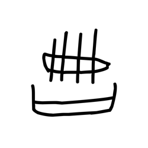

- source_zip_member: `Sub-character Images/h82z1bo3i3/h82z1bo3i3/1aililt73c.png`
- checksum_sha256: `2d167db76f99f07d5c7cadbcb73d8c07436cdbe56c7714aea516dff8c7e04679`
- review_status: `needs_human_visual_review`
- caution: OBIMD subcharacter image is a source-marked review asset only; it is not a confirmed component form, component assignment, or decipherment conclusion.

## asset-018888

- source_zip_member: `Sub-character Images/h82z1bo3i3/h82z1bo3i3/1c6yvm8bas.png`
- checksum_sha256: `4b90d15f04661f1665555f8f6c9bbcb6798507522a4ac0315b9ff934ff68a227`
- review_status: `needs_human_visual_review`
- caution: OBIMD subcharacter image is a source-marked review asset only; it is not a confirmed component form, component assignment, or decipherment conclusion.

## asset-018889

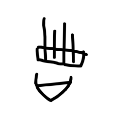

- source_zip_member: `Sub-character Images/h82z1bo3i3/h82z1bo3i3/25tx5zpt1h.png`
- checksum_sha256: `9bc3a6c02a1064a4d6608b64279eac7a064eef1c71bc6174a5b6d6ffb46bfaf8`
- review_status: `needs_human_visual_review`
- caution: OBIMD subcharacter image is a source-marked review asset only; it is not a confirmed component form, component assignment, or decipherment conclusion.

## asset-018890

- source_zip_member: `Sub-character Images/h82z1bo3i3/h82z1bo3i3/2g4d0ecsqn.png`
- checksum_sha256: `96bdc393233c02908fafb0d571b09cc38f07b3d408f22b1e4c567fe6eefdc811`
- review_status: `needs_human_visual_review`
- caution: OBIMD subcharacter image is a source-marked review asset only; it is not a confirmed component form, component assignment, or decipherment conclusion.

## asset-018891

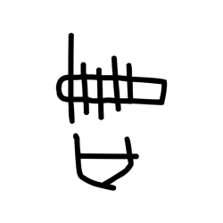

- source_zip_member: `Sub-character Images/h82z1bo3i3/h82z1bo3i3/2isty0bymq.png`
- checksum_sha256: `c5a24de8c4d3d92dcc9b20ae8ebdf2a19a343175021c4923e538fea8d28734b5`
- review_status: `needs_human_visual_review`
- caution: OBIMD subcharacter image is a source-marked review asset only; it is not a confirmed component form, component assignment, or decipherment conclusion.

## asset-018892

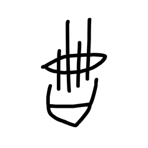

- source_zip_member: `Sub-character Images/h82z1bo3i3/h82z1bo3i3/4zmrjbygkv.png`
- checksum_sha256: `32afe89c85d9fb41b04a7cd4b1d3ec7485bcd0d079b0e20de12152cea3877fa5`
- review_status: `needs_human_visual_review`
- caution: OBIMD subcharacter image is a source-marked review asset only; it is not a confirmed component form, component assignment, or decipherment conclusion.

## asset-018893

- source_zip_member: `Sub-character Images/h82z1bo3i3/h82z1bo3i3/54m1noip2u.png`
- checksum_sha256: `4593ca49cfc2aa5cc808574812cbccbc3844b1be6473a68421043fc5c3db747f`
- review_status: `needs_human_visual_review`
- caution: OBIMD subcharacter image is a source-marked review asset only; it is not a confirmed component form, component assignment, or decipherment conclusion.

## asset-018894

- source_zip_member: `Sub-character Images/h82z1bo3i3/h82z1bo3i3/5cdp252y3a.png`
- checksum_sha256: `6646c286caf8a1526cc6b7ca8ac1d640695f490067679813313ad18b21985822`
- review_status: `needs_human_visual_review`
- caution: OBIMD subcharacter image is a source-marked review asset only; it is not a confirmed component form, component assignment, or decipherment conclusion.

## asset-018895

- source_zip_member: `Sub-character Images/h82z1bo3i3/h82z1bo3i3/5udt308ogg.png`
- checksum_sha256: `d17c7d66d2b1c2981a05422d8d61af0566420e5e610ba6df34bfec5c561ccaaf`
- review_status: `needs_human_visual_review`
- caution: OBIMD subcharacter image is a source-marked review asset only; it is not a confirmed component form, component assignment, or decipherment conclusion.

## asset-018896

- source_zip_member: `Sub-character Images/h82z1bo3i3/h82z1bo3i3/68bu5jsq1u.png`
- checksum_sha256: `755a269988416e24dd185d6a3316d17b207fb231ef3663e9df8969e0adce8384`
- review_status: `needs_human_visual_review`
- caution: OBIMD subcharacter image is a source-marked review asset only; it is not a confirmed component form, component assignment, or decipherment conclusion.

## asset-018897

- source_zip_member: `Sub-character Images/h82z1bo3i3/h82z1bo3i3/68ikvemer9.png`
- checksum_sha256: `4cf27bfa1900241b3f70b902ce9f490b7f12120a1a19ffda19dfc6adfb05d7fc`
- review_status: `needs_human_visual_review`
- caution: OBIMD subcharacter image is a source-marked review asset only; it is not a confirmed component form, component assignment, or decipherment conclusion.

## asset-018898

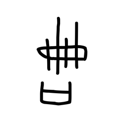

- source_zip_member: `Sub-character Images/h82z1bo3i3/h82z1bo3i3/6f11ypsp7g.png`
- checksum_sha256: `24dbde02376829631b270c090352961bc6bc947f5b633890db09e4dbd5fbf71e`
- review_status: `needs_human_visual_review`
- caution: OBIMD subcharacter image is a source-marked review asset only; it is not a confirmed component form, component assignment, or decipherment conclusion.

## asset-018899

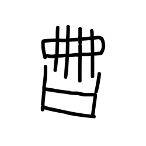

- source_zip_member: `Sub-character Images/h82z1bo3i3/h82z1bo3i3/6gz8xesfvb.png`
- checksum_sha256: `6f38fad8c0c27decdd7e8c35448805522194a0970a6c0679fa6075ec7966d463`
- review_status: `needs_human_visual_review`
- caution: OBIMD subcharacter image is a source-marked review asset only; it is not a confirmed component form, component assignment, or decipherment conclusion.

## asset-018900

- source_zip_member: `Sub-character Images/h82z1bo3i3/h82z1bo3i3/6lchhovelc.png`
- checksum_sha256: `1aa0c5c8b1f7fd51eb9df63a98abbc48ffb545144364c82314c997f53fbff49c`
- review_status: `needs_human_visual_review`
- caution: OBIMD subcharacter image is a source-marked review asset only; it is not a confirmed component form, component assignment, or decipherment conclusion.

## asset-018901

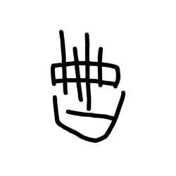

- source_zip_member: `Sub-character Images/h82z1bo3i3/h82z1bo3i3/8emhoi0ljo.png`
- checksum_sha256: `15c7e8b3c82af0ba555144e1290a6dcb0da4e93b0806c69e5a0407c6a8e171a3`
- review_status: `needs_human_visual_review`
- caution: OBIMD subcharacter image is a source-marked review asset only; it is not a confirmed component form, component assignment, or decipherment conclusion.

## asset-018902

- source_zip_member: `Sub-character Images/h82z1bo3i3/h82z1bo3i3/90xzj3m02z.png`
- checksum_sha256: `f3f0de0ed35e7aecd1e0216fb8f4a8894e001a9ab92486217ce8c0957ffd11d0`
- review_status: `needs_human_visual_review`
- caution: OBIMD subcharacter image is a source-marked review asset only; it is not a confirmed component form, component assignment, or decipherment conclusion.

## asset-018903

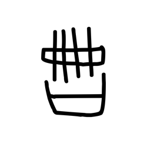

- source_zip_member: `Sub-character Images/h82z1bo3i3/h82z1bo3i3/92y1ptit1r.png`
- checksum_sha256: `deeeb73502ce9531235cdf47f9ca4503c87dccb8d71ed7f0911897ee5af0bf74`
- review_status: `needs_human_visual_review`
- caution: OBIMD subcharacter image is a source-marked review asset only; it is not a confirmed component form, component assignment, or decipherment conclusion.

## asset-018904

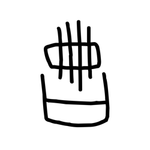

- source_zip_member: `Sub-character Images/h82z1bo3i3/h82z1bo3i3/9at752lzjm.png`
- checksum_sha256: `543d6650d5328c7a70af07e3bbd7333da47d934322d13d5a4f3c9d45959e1918`
- review_status: `needs_human_visual_review`
- caution: OBIMD subcharacter image is a source-marked review asset only; it is not a confirmed component form, component assignment, or decipherment conclusion.

## asset-018905

- source_zip_member: `Sub-character Images/h82z1bo3i3/h82z1bo3i3/a93dihv8jk.png`
- checksum_sha256: `47259e4ca69b5e69ea33afd0d3219be8d743ec81644ff0e6cd35eba870d157ab`
- review_status: `needs_human_visual_review`
- caution: OBIMD subcharacter image is a source-marked review asset only; it is not a confirmed component form, component assignment, or decipherment conclusion.

## asset-018906

- source_zip_member: `Sub-character Images/h82z1bo3i3/h82z1bo3i3/aa76hslkys.png`
- checksum_sha256: `909a93dd57b62589dfeb3c9fb0514a27271f8eafc334630f7eaa70d3949241c2`
- review_status: `needs_human_visual_review`
- caution: OBIMD subcharacter image is a source-marked review asset only; it is not a confirmed component form, component assignment, or decipherment conclusion.

## asset-018907

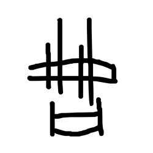

- source_zip_member: `Sub-character Images/h82z1bo3i3/h82z1bo3i3/al3r2huh0u.png`
- checksum_sha256: `e5322cb241a3ab679caf0051e867961b9f7605352c6d5ca9e7153e0d2c0a305c`
- review_status: `needs_human_visual_review`
- caution: OBIMD subcharacter image is a source-marked review asset only; it is not a confirmed component form, component assignment, or decipherment conclusion.

## asset-018908

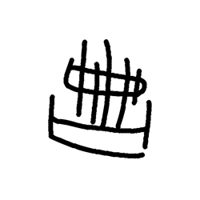

- source_zip_member: `Sub-character Images/h82z1bo3i3/h82z1bo3i3/byyg8swc2q.png`
- checksum_sha256: `5f9a088852fb0d87a0d5105eb62169afb4a613058f3c126e8cce400031cd4d99`
- review_status: `needs_human_visual_review`
- caution: OBIMD subcharacter image is a source-marked review asset only; it is not a confirmed component form, component assignment, or decipherment conclusion.

## asset-018909

- source_zip_member: `Sub-character Images/h82z1bo3i3/h82z1bo3i3/c3veuub408.png`
- checksum_sha256: `9707d22e46bb3e0fb3648bdce9583b0345273b3cdb7293855619633d4faba49d`
- review_status: `needs_human_visual_review`
- caution: OBIMD subcharacter image is a source-marked review asset only; it is not a confirmed component form, component assignment, or decipherment conclusion.

## asset-018910

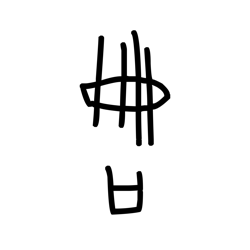

- source_zip_member: `Sub-character Images/h82z1bo3i3/h82z1bo3i3/ccpv05bl4w.png`
- checksum_sha256: `6e3ab1ee9c24d7b0d873ed1d255a03c49ea437d8bd48a64760934b77a9fa417f`
- review_status: `needs_human_visual_review`
- caution: OBIMD subcharacter image is a source-marked review asset only; it is not a confirmed component form, component assignment, or decipherment conclusion.

## asset-018911

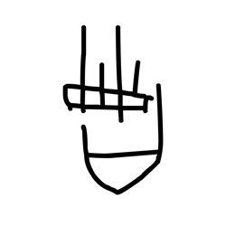

- source_zip_member: `Sub-character Images/h82z1bo3i3/h82z1bo3i3/ckaxue1erx.png`
- checksum_sha256: `231e45b34bfef5c6105e9e064ba2779a3dbe4dbfa06ae3bdaf0d4403405eee80`
- review_status: `needs_human_visual_review`
- caution: OBIMD subcharacter image is a source-marked review asset only; it is not a confirmed component form, component assignment, or decipherment conclusion.

## asset-018912

- source_zip_member: `Sub-character Images/h82z1bo3i3/h82z1bo3i3/cxiuf4drdt.png`
- checksum_sha256: `1fd64659241e76a5634c9d4012a187b0a427e12756df3dfb97999292e558d109`
- review_status: `needs_human_visual_review`
- caution: OBIMD subcharacter image is a source-marked review asset only; it is not a confirmed component form, component assignment, or decipherment conclusion.

## asset-018913

- source_zip_member: `Sub-character Images/h82z1bo3i3/h82z1bo3i3/dd5l4lu2oj.png`
- checksum_sha256: `7f455c4dea3abfcca8bedd3e913defcb9d980bf7fccf5b0ec92eb439aae3d014`
- review_status: `needs_human_visual_review`
- caution: OBIMD subcharacter image is a source-marked review asset only; it is not a confirmed component form, component assignment, or decipherment conclusion.

## asset-018914

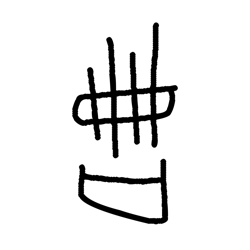

- source_zip_member: `Sub-character Images/h82z1bo3i3/h82z1bo3i3/e8j2zoip1f.png`
- checksum_sha256: `6ef341d9835a27c1285e984cc62e75a7e9cd6e8a351cb69db083442697709f33`
- review_status: `needs_human_visual_review`
- caution: OBIMD subcharacter image is a source-marked review asset only; it is not a confirmed component form, component assignment, or decipherment conclusion.

## asset-018915

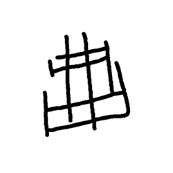

- source_zip_member: `Sub-character Images/h82z1bo3i3/h82z1bo3i3/f4jmmc80b4.png`
- checksum_sha256: `b57332e08fd3f0b0f1773f4639b9b90bef08cedfdcce58104d10b8d2c6d532cc`
- review_status: `needs_human_visual_review`
- caution: OBIMD subcharacter image is a source-marked review asset only; it is not a confirmed component form, component assignment, or decipherment conclusion.

## asset-018916

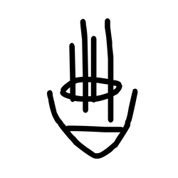

- source_zip_member: `Sub-character Images/h82z1bo3i3/h82z1bo3i3/gkdc101ca9.png`
- checksum_sha256: `3905340de20182c731eeb8d2f1a3073d017da1a28f1a51cff15e6bcae781a8dd`
- review_status: `needs_human_visual_review`
- caution: OBIMD subcharacter image is a source-marked review asset only; it is not a confirmed component form, component assignment, or decipherment conclusion.

## asset-018917

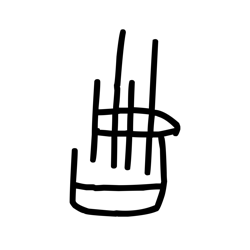

- source_zip_member: `Sub-character Images/h82z1bo3i3/h82z1bo3i3/gu3ogq3go3.png`
- checksum_sha256: `96b3eaa72e75d0eb7ba66049dd26d8314214aeb044c1488370f8390a9640c4d5`
- review_status: `needs_human_visual_review`
- caution: OBIMD subcharacter image is a source-marked review asset only; it is not a confirmed component form, component assignment, or decipherment conclusion.

## asset-018918

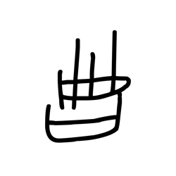

- source_zip_member: `Sub-character Images/h82z1bo3i3/h82z1bo3i3/h55bj5lou7.png`
- checksum_sha256: `b560ffcc280622c3bcc5ee2dccceeb97f527e8a0646dde92e07760f991c41c0e`
- review_status: `needs_human_visual_review`
- caution: OBIMD subcharacter image is a source-marked review asset only; it is not a confirmed component form, component assignment, or decipherment conclusion.

## asset-018919

- source_zip_member: `Sub-character Images/h82z1bo3i3/h82z1bo3i3/h82z1bo3i3.png`
- checksum_sha256: `6e075ecc226a13696004136cd8f0e9e95b4177a34921722b2b08335fa7b196c9`
- review_status: `needs_human_visual_review`
- caution: OBIMD subcharacter image is a source-marked review asset only; it is not a confirmed component form, component assignment, or decipherment conclusion.

## asset-018920

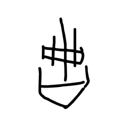

- source_zip_member: `Sub-character Images/h82z1bo3i3/h82z1bo3i3/iatk14tcu3.png`
- checksum_sha256: `d99201130477dfd33a36430d57cf6d5da529fc9068cf3becd9bfaa83246ac55e`
- review_status: `needs_human_visual_review`
- caution: OBIMD subcharacter image is a source-marked review asset only; it is not a confirmed component form, component assignment, or decipherment conclusion.

## asset-018921

- source_zip_member: `Sub-character Images/h82z1bo3i3/h82z1bo3i3/ih3cyfkrkm.png`
- checksum_sha256: `cfad34ccd96decc7ca8a9d06c00548c6126f1aac4de95c7a67f484798ceb05a6`
- review_status: `needs_human_visual_review`
- caution: OBIMD subcharacter image is a source-marked review asset only; it is not a confirmed component form, component assignment, or decipherment conclusion.

## asset-018922

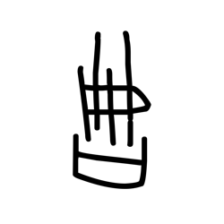

- source_zip_member: `Sub-character Images/h82z1bo3i3/h82z1bo3i3/isapv3i3n6.png`
- checksum_sha256: `69b9a98c8267864a354d7959c589c848cbd9d39004cca31e734d6594efd7b002`
- review_status: `needs_human_visual_review`
- caution: OBIMD subcharacter image is a source-marked review asset only; it is not a confirmed component form, component assignment, or decipherment conclusion.

## asset-018923

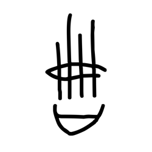

- source_zip_member: `Sub-character Images/h82z1bo3i3/h82z1bo3i3/jp86dlnr29.png`
- checksum_sha256: `3da514a36f1c97e2cd2a5ef365b810c1e9102054cbf7ac4f4774902b17740994`
- review_status: `needs_human_visual_review`
- caution: OBIMD subcharacter image is a source-marked review asset only; it is not a confirmed component form, component assignment, or decipherment conclusion.

## asset-018924

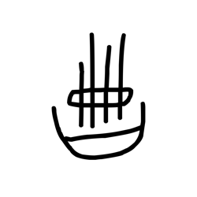

- source_zip_member: `Sub-character Images/h82z1bo3i3/h82z1bo3i3/jpbcf2vqre.png`
- checksum_sha256: `33c6f80ecd3fdba92d70a133c6efa445dab6c7b0e1376ccbdd367ec459d8fe20`
- review_status: `needs_human_visual_review`
- caution: OBIMD subcharacter image is a source-marked review asset only; it is not a confirmed component form, component assignment, or decipherment conclusion.

## asset-018925

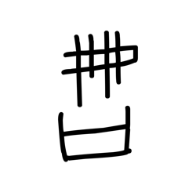

- source_zip_member: `Sub-character Images/h82z1bo3i3/h82z1bo3i3/k80sh2ul91.png`
- checksum_sha256: `27e4e163d67368738dc099cc83173d27ef444d1a41143cfee44e7e87b9862eab`
- review_status: `needs_human_visual_review`
- caution: OBIMD subcharacter image is a source-marked review asset only; it is not a confirmed component form, component assignment, or decipherment conclusion.

## asset-018926

- source_zip_member: `Sub-character Images/h82z1bo3i3/h82z1bo3i3/k8x2vb0dbm.png`
- checksum_sha256: `24b156a16ada3a7aae893ff1a27ccb6ca1e70f344331ef497b9c3d31d20b872a`
- review_status: `needs_human_visual_review`
- caution: OBIMD subcharacter image is a source-marked review asset only; it is not a confirmed component form, component assignment, or decipherment conclusion.

## asset-018927

- source_zip_member: `Sub-character Images/h82z1bo3i3/h82z1bo3i3/kee5p1j27o.png`
- checksum_sha256: `149c99279df2123e7bdbc21c66c74797f963772c3841fb5fc8f8a6b2127152d0`
- review_status: `needs_human_visual_review`
- caution: OBIMD subcharacter image is a source-marked review asset only; it is not a confirmed component form, component assignment, or decipherment conclusion.

## asset-018928

- source_zip_member: `Sub-character Images/h82z1bo3i3/h82z1bo3i3/krkub2yu0t.png`
- checksum_sha256: `942068b99ff6b490ebda78467a0c6c6bc3bcb97c41a7992a1bc48c2f23551884`
- review_status: `needs_human_visual_review`
- caution: OBIMD subcharacter image is a source-marked review asset only; it is not a confirmed component form, component assignment, or decipherment conclusion.

## asset-018929

- source_zip_member: `Sub-character Images/h82z1bo3i3/h82z1bo3i3/lesjvzo02y.png`
- checksum_sha256: `f131fe57940a3ad7b10b55cb0ea6c019a1a04473509774582591ec33e88ab8ac`
- review_status: `needs_human_visual_review`
- caution: OBIMD subcharacter image is a source-marked review asset only; it is not a confirmed component form, component assignment, or decipherment conclusion.

## asset-018930

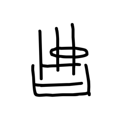

- source_zip_member: `Sub-character Images/h82z1bo3i3/h82z1bo3i3/loh5e6l6zq.png`
- checksum_sha256: `d0caaa326d9b176f8fb9293261cf4c380067df156bb03ea435dd81bb8bc4042c`
- review_status: `needs_human_visual_review`
- caution: OBIMD subcharacter image is a source-marked review asset only; it is not a confirmed component form, component assignment, or decipherment conclusion.

## asset-018931

- source_zip_member: `Sub-character Images/h82z1bo3i3/h82z1bo3i3/mxzvh6pkyt.png`
- checksum_sha256: `8df99fb4fc6c635e25a23c2a884b6174121a617eacccd42fc1512e4584b3444c`
- review_status: `needs_human_visual_review`
- caution: OBIMD subcharacter image is a source-marked review asset only; it is not a confirmed component form, component assignment, or decipherment conclusion.

## asset-018932

- source_zip_member: `Sub-character Images/h82z1bo3i3/h82z1bo3i3/ndkaazmab8.png`
- checksum_sha256: `00b886802ae0e5fbcbc3265ea0057809a4ecea36cbc6ab2d57b61414672813c0`
- review_status: `needs_human_visual_review`
- caution: OBIMD subcharacter image is a source-marked review asset only; it is not a confirmed component form, component assignment, or decipherment conclusion.

## asset-018933

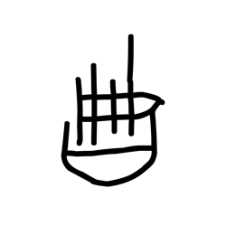

- source_zip_member: `Sub-character Images/h82z1bo3i3/h82z1bo3i3/oonu1gcy9b.png`
- checksum_sha256: `c71ceecfc717d551c9a42c9f719907f86b347c2e3e99cd53c4c7d699c1e8d43e`
- review_status: `needs_human_visual_review`
- caution: OBIMD subcharacter image is a source-marked review asset only; it is not a confirmed component form, component assignment, or decipherment conclusion.

## asset-018934

- source_zip_member: `Sub-character Images/h82z1bo3i3/h82z1bo3i3/oygc2dozk9.png`
- checksum_sha256: `fa4802fd0d0bad83158be4237a228dce556481aa08703d28b6be7ecb9d06bb46`
- review_status: `needs_human_visual_review`
- caution: OBIMD subcharacter image is a source-marked review asset only; it is not a confirmed component form, component assignment, or decipherment conclusion.

## asset-018935

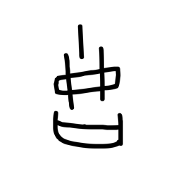

- source_zip_member: `Sub-character Images/h82z1bo3i3/h82z1bo3i3/pmiryyqevc.png`
- checksum_sha256: `16ed63387db37e8bd690f2f4c97bd2f12cc4a726ef8164ebfb06162a4e6e3ae5`
- review_status: `needs_human_visual_review`
- caution: OBIMD subcharacter image is a source-marked review asset only; it is not a confirmed component form, component assignment, or decipherment conclusion.

## asset-018936

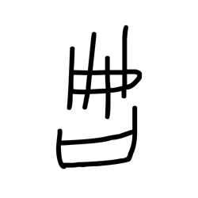

- source_zip_member: `Sub-character Images/h82z1bo3i3/h82z1bo3i3/riemaai6yb.png`
- checksum_sha256: `0b2e595b4cdd9db4b3aa066814ec5bbfe00a85eeeecc79f6c7488485461520cb`
- review_status: `needs_human_visual_review`
- caution: OBIMD subcharacter image is a source-marked review asset only; it is not a confirmed component form, component assignment, or decipherment conclusion.

## asset-018937

- source_zip_member: `Sub-character Images/h82z1bo3i3/h82z1bo3i3/rt6z3lpkmr.png`
- checksum_sha256: `8a6984e13c3cfd373d000fbdfb163d8948562d71ace643afb810fc1b5115534c`
- review_status: `needs_human_visual_review`
- caution: OBIMD subcharacter image is a source-marked review asset only; it is not a confirmed component form, component assignment, or decipherment conclusion.

## asset-018938

- source_zip_member: `Sub-character Images/h82z1bo3i3/h82z1bo3i3/s6dki5dxra.png`
- checksum_sha256: `0f3dd42020ffe1e1e9140a740535ffa2d5edb40b91d15d5575d958ffc1f075bb`
- review_status: `needs_human_visual_review`
- caution: OBIMD subcharacter image is a source-marked review asset only; it is not a confirmed component form, component assignment, or decipherment conclusion.

## asset-018939

- source_zip_member: `Sub-character Images/h82z1bo3i3/h82z1bo3i3/thawauugb6.png`
- checksum_sha256: `75a4e46522ee899fc571d0a158ed930083d5d80b0c12529422b776b92d5a1ae9`
- review_status: `needs_human_visual_review`
- caution: OBIMD subcharacter image is a source-marked review asset only; it is not a confirmed component form, component assignment, or decipherment conclusion.

## asset-018940

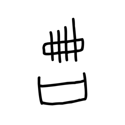

- source_zip_member: `Sub-character Images/h82z1bo3i3/h82z1bo3i3/u63iiq90cu.png`
- checksum_sha256: `2bd1cf41b639d3d90c828cd745e32e77491dba25abec2e8831f88b7a29fa9aa1`
- review_status: `needs_human_visual_review`
- caution: OBIMD subcharacter image is a source-marked review asset only; it is not a confirmed component form, component assignment, or decipherment conclusion.

## asset-018941

- source_zip_member: `Sub-character Images/h82z1bo3i3/h82z1bo3i3/um6lha0dcv.png`
- checksum_sha256: `6f838e27b80f0e7d49470871634ccdfc9c6bbfa33d5b63582af12d26b7110a19`
- review_status: `needs_human_visual_review`
- caution: OBIMD subcharacter image is a source-marked review asset only; it is not a confirmed component form, component assignment, or decipherment conclusion.

## asset-018942

- source_zip_member: `Sub-character Images/h82z1bo3i3/h82z1bo3i3/uzvsd5t2gg.png`
- checksum_sha256: `21ed90d7a949325bf0c57ae5518f2b79902b7a11e7e8758c409c2b62635080cf`
- review_status: `needs_human_visual_review`
- caution: OBIMD subcharacter image is a source-marked review asset only; it is not a confirmed component form, component assignment, or decipherment conclusion.

## asset-018943

- source_zip_member: `Sub-character Images/h82z1bo3i3/h82z1bo3i3/v5zybbrmhh.png`
- checksum_sha256: `7df1fd665c966e2f103095f4b9738b6171c4879f5c085392a1f1826b95603470`
- review_status: `needs_human_visual_review`
- caution: OBIMD subcharacter image is a source-marked review asset only; it is not a confirmed component form, component assignment, or decipherment conclusion.

## asset-018944

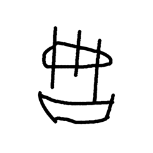

- source_zip_member: `Sub-character Images/h82z1bo3i3/h82z1bo3i3/vfh72f2f2o.png`
- checksum_sha256: `71e722dbb8f411f4a8bd372c33bdd5445f630e9f62e99fcd4f94e7c4f6838cdc`
- review_status: `needs_human_visual_review`
- caution: OBIMD subcharacter image is a source-marked review asset only; it is not a confirmed component form, component assignment, or decipherment conclusion.

## asset-018945

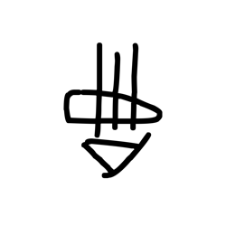

- source_zip_member: `Sub-character Images/h82z1bo3i3/h82z1bo3i3/vk4s1uxjr9.png`
- checksum_sha256: `799bf061087dfe99009958207491933de50ed79e7aa637d1c9c55191e312d228`
- review_status: `needs_human_visual_review`
- caution: OBIMD subcharacter image is a source-marked review asset only; it is not a confirmed component form, component assignment, or decipherment conclusion.

## asset-018946

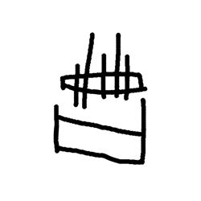

- source_zip_member: `Sub-character Images/h82z1bo3i3/h82z1bo3i3/vwse4zlw9q.png`
- checksum_sha256: `8529746136350d05387f1e528be150cae3a7ce37eaa9951fa3c9485140491afb`
- review_status: `needs_human_visual_review`
- caution: OBIMD subcharacter image is a source-marked review asset only; it is not a confirmed component form, component assignment, or decipherment conclusion.

## asset-018947

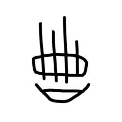

- source_zip_member: `Sub-character Images/h82z1bo3i3/h82z1bo3i3/w20zmaeq7p.png`
- checksum_sha256: `7533e9c0ada0b47bf2247702ea463b3b2a0a5afbc4baba5859e564291a9b65ff`
- review_status: `needs_human_visual_review`
- caution: OBIMD subcharacter image is a source-marked review asset only; it is not a confirmed component form, component assignment, or decipherment conclusion.

## asset-018948

- source_zip_member: `Sub-character Images/h82z1bo3i3/h82z1bo3i3/w3hl3v14j5.png`
- checksum_sha256: `ae6f126cc50d3f70f22aebd8c82c1a3632adb368e13d83e15c7ad64b049b088b`
- review_status: `needs_human_visual_review`
- caution: OBIMD subcharacter image is a source-marked review asset only; it is not a confirmed component form, component assignment, or decipherment conclusion.

## asset-018949

- source_zip_member: `Sub-character Images/h82z1bo3i3/h82z1bo3i3/wafeaoe07q.png`
- checksum_sha256: `12417041c906705a4c8b6aec5bffe05f5bc24842aecd09432aa24f5cdd15cddd`
- review_status: `needs_human_visual_review`
- caution: OBIMD subcharacter image is a source-marked review asset only; it is not a confirmed component form, component assignment, or decipherment conclusion.

## asset-018950

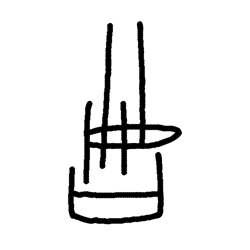

- source_zip_member: `Sub-character Images/h82z1bo3i3/h82z1bo3i3/wfijszg0r3.png`
- checksum_sha256: `12ff2077225028c2e032ca4dc442afea30a8a260655b3a56fbc2855c26ab9c95`
- review_status: `needs_human_visual_review`
- caution: OBIMD subcharacter image is a source-marked review asset only; it is not a confirmed component form, component assignment, or decipherment conclusion.

## asset-018951

- source_zip_member: `Sub-character Images/h82z1bo3i3/h82z1bo3i3/whqg6x2jl4.png`
- checksum_sha256: `7c119b877607a001cf861813a230dcfe6a0b9e8885559c532e1a50885f805647`
- review_status: `needs_human_visual_review`
- caution: OBIMD subcharacter image is a source-marked review asset only; it is not a confirmed component form, component assignment, or decipherment conclusion.

## asset-018952

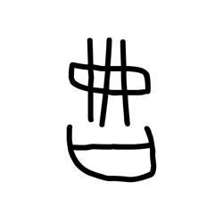

- source_zip_member: `Sub-character Images/h82z1bo3i3/h82z1bo3i3/x0mv33zgxm.png`
- checksum_sha256: `439e56128ea6a6745e948bd42b1b9d73ac1d4e87c4205932fd1d10a9a9a66979`
- review_status: `needs_human_visual_review`
- caution: OBIMD subcharacter image is a source-marked review asset only; it is not a confirmed component form, component assignment, or decipherment conclusion.

## asset-018953

- source_zip_member: `Sub-character Images/h82z1bo3i3/h82z1bo3i3/x63regwam1.png`
- checksum_sha256: `1be382ec65877de9bd42f31589ea330075cd7b461752e8973a4563050b8d892a`
- review_status: `needs_human_visual_review`
- caution: OBIMD subcharacter image is a source-marked review asset only; it is not a confirmed component form, component assignment, or decipherment conclusion.

## asset-018954

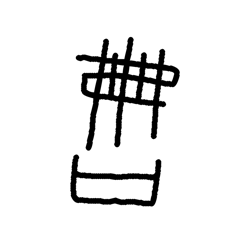

- source_zip_member: `Sub-character Images/h82z1bo3i3/h82z1bo3i3/xcg7g9xk5u.png`
- checksum_sha256: `0e338ca0505ff43ea3644dc723fa7982526e635b4f207606730feedfde2421c7`
- review_status: `needs_human_visual_review`
- caution: OBIMD subcharacter image is a source-marked review asset only; it is not a confirmed component form, component assignment, or decipherment conclusion.

## asset-018955

- source_zip_member: `Sub-character Images/h82z1bo3i3/h82z1bo3i3/xdpaco6j7k.png`
- checksum_sha256: `7d538c15b4c75da4c17b13b307848509eb5b94e848422248130a14b88dfcff4b`
- review_status: `needs_human_visual_review`
- caution: OBIMD subcharacter image is a source-marked review asset only; it is not a confirmed component form, component assignment, or decipherment conclusion.

## asset-018956

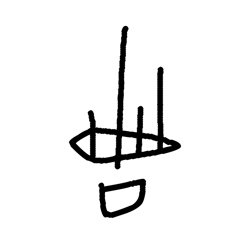

- source_zip_member: `Sub-character Images/h82z1bo3i3/h82z1bo3i3/y4ouhcij5o.png`
- checksum_sha256: `e92b7bf3a1bd1b00bdfa0021249464cc0207419a6c0b1de3a7713a6c52bb6a03`
- review_status: `needs_human_visual_review`
- caution: OBIMD subcharacter image is a source-marked review asset only; it is not a confirmed component form, component assignment, or decipherment conclusion.

## asset-018957

- source_zip_member: `Sub-character Images/h82z1bo3i3/h82z1bo3i3/y7cz740a3n.png`
- checksum_sha256: `c33b52a11cea7096afaaaa291c49dfd12833d49f37c19fa3bd92352beb45dabe`
- review_status: `needs_human_visual_review`
- caution: OBIMD subcharacter image is a source-marked review asset only; it is not a confirmed component form, component assignment, or decipherment conclusion.

## asset-018958

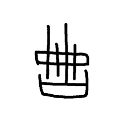

- source_zip_member: `Sub-character Images/h82z1bo3i3/h82z1bo3i3/znwk2izoww.png`
- checksum_sha256: `3b8446a0fde325276b13aafc5c6bd7ae47c30b42828e1e29fc01745eb6c8080f`
- review_status: `needs_human_visual_review`
- caution: OBIMD subcharacter image is a source-marked review asset only; it is not a confirmed component form, component assignment, or decipherment conclusion.

## asset-018959

- source_zip_member: `Sub-character Images/h82z1bo3i3/h82z1bo3i3/zqczwl1qyz.png`
- checksum_sha256: `216f1b2afa0c615ef210acab1f5f5731ba8775c23c3437f9446a7dbfd8cb0cc7`
- review_status: `needs_human_visual_review`
- caution: OBIMD subcharacter image is a source-marked review asset only; it is not a confirmed component form, component assignment, or decipherment conclusion.

## asset-018960

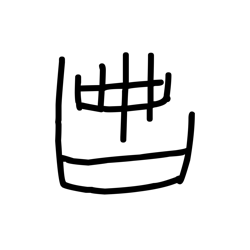

- source_zip_member: `Sub-character Images/h82z1bo3i3/h82z1bo3i3/zquymwqcbg.png`
- checksum_sha256: `1e2d5b3b6fb2f471958f061599dc5948af3e1245d7b3567520f147ee4ae09250`
- review_status: `needs_human_visual_review`
- caution: OBIMD subcharacter image is a source-marked review asset only; it is not a confirmed component form, component assignment, or decipherment conclusion.
