# Component Visual Gallery / 构件图像查看: obs-comp-cand-001998

English:
This page displays OBIMD subcharacter PNG assets extracted into this concrete corpus object directory for human review.

简体中文：
本页展示抽取到当前具体 corpus 对象目录内的 OBIMD subcharacter PNG 资料，供人工复核使用。

Boundary / 边界：dataset image candidate only; not a confirmed component form, component assignment, or decipherment claim.

## asset-018990

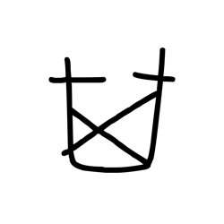

- source_zip_member: `Sub-character Images/qmvfvw99v9/qmvfvw99v9/0fq8iv2doh.png`
- checksum_sha256: `64e3f07cbe80b968bb5745ebcd48d6d80d7af9a59a222b145259cf872c490f4a`
- review_status: `needs_human_visual_review`
- caution: OBIMD subcharacter image is a source-marked review asset only; it is not a confirmed component form, component assignment, or decipherment conclusion.

## asset-018991

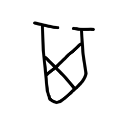

- source_zip_member: `Sub-character Images/qmvfvw99v9/qmvfvw99v9/0if39o2lpd.png`
- checksum_sha256: `9fc3a3fa936d20b015e84ef4a4c669a12d82a7f85313488fab8c56675f77156f`
- review_status: `needs_human_visual_review`
- caution: OBIMD subcharacter image is a source-marked review asset only; it is not a confirmed component form, component assignment, or decipherment conclusion.

## asset-018992

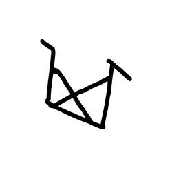

- source_zip_member: `Sub-character Images/qmvfvw99v9/qmvfvw99v9/0s8eccz2o5.png`
- checksum_sha256: `6b7f295051212fdf245b5c92dc2abade56905ffbb204c7e4dfc8cf3f53da574e`
- review_status: `needs_human_visual_review`
- caution: OBIMD subcharacter image is a source-marked review asset only; it is not a confirmed component form, component assignment, or decipherment conclusion.

## asset-018993

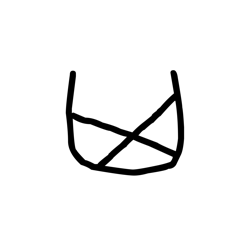

- source_zip_member: `Sub-character Images/qmvfvw99v9/qmvfvw99v9/0z7sxp74dm.png`
- checksum_sha256: `7b13546d7af11fcc0c43208af9c18cb50a69f2e31d5cac662d421db740a97d6d`
- review_status: `needs_human_visual_review`
- caution: OBIMD subcharacter image is a source-marked review asset only; it is not a confirmed component form, component assignment, or decipherment conclusion.

## asset-018994

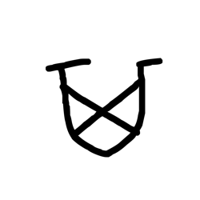

- source_zip_member: `Sub-character Images/qmvfvw99v9/qmvfvw99v9/1yywiowsut.png`
- checksum_sha256: `c2055ee787e31240626d7baaa497a8dac4277d78cbf45dd378b46d7b7b8c14ef`
- review_status: `needs_human_visual_review`
- caution: OBIMD subcharacter image is a source-marked review asset only; it is not a confirmed component form, component assignment, or decipherment conclusion.

## asset-018995

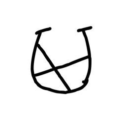

- source_zip_member: `Sub-character Images/qmvfvw99v9/qmvfvw99v9/23gf0j1jjx.png`
- checksum_sha256: `4ea393cba988aa687c480d64a322d1fbaab3ac758e6e0fba424b679f0128646f`
- review_status: `needs_human_visual_review`
- caution: OBIMD subcharacter image is a source-marked review asset only; it is not a confirmed component form, component assignment, or decipherment conclusion.

## asset-018996

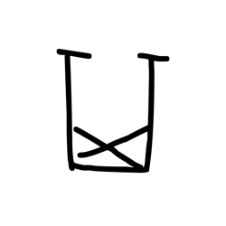

- source_zip_member: `Sub-character Images/qmvfvw99v9/qmvfvw99v9/2b4nzn3vbv.png`
- checksum_sha256: `15d9c79ab2f45a0ad31efa925cdd6267298a33f048753c9f03e9f15697ac798e`
- review_status: `needs_human_visual_review`
- caution: OBIMD subcharacter image is a source-marked review asset only; it is not a confirmed component form, component assignment, or decipherment conclusion.

## asset-018997

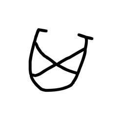

- source_zip_member: `Sub-character Images/qmvfvw99v9/qmvfvw99v9/2c2uxet856.png`
- checksum_sha256: `ddcc8b2e13df13dcfc2812af4ddb48bb9b80cb49626bc7d2663b00647932bce4`
- review_status: `needs_human_visual_review`
- caution: OBIMD subcharacter image is a source-marked review asset only; it is not a confirmed component form, component assignment, or decipherment conclusion.

## asset-018998

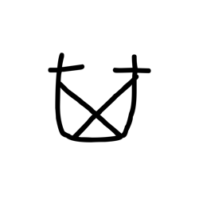

- source_zip_member: `Sub-character Images/qmvfvw99v9/qmvfvw99v9/2h6p8a0xfv.png`
- checksum_sha256: `10c54cba1c33de6ad4494a26b7bc6c2e7a4a06818cd20c40c4fcf37f9eee33e2`
- review_status: `needs_human_visual_review`
- caution: OBIMD subcharacter image is a source-marked review asset only; it is not a confirmed component form, component assignment, or decipherment conclusion.

## asset-018999

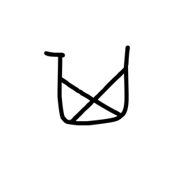

- source_zip_member: `Sub-character Images/qmvfvw99v9/qmvfvw99v9/2nj8dane6v.png`
- checksum_sha256: `0d6a0568dc3783b8df0fcdd2590c8054222a41236ee9e4e8a919a32dfa78f03f`
- review_status: `needs_human_visual_review`
- caution: OBIMD subcharacter image is a source-marked review asset only; it is not a confirmed component form, component assignment, or decipherment conclusion.

## asset-019000

- source_zip_member: `Sub-character Images/qmvfvw99v9/qmvfvw99v9/2tmafpq2hk.png`
- checksum_sha256: `c6157c6a9af667c0bd2e5a65b389192a18d5533ab84fe1ecdf796358f1bb2f97`
- review_status: `needs_human_visual_review`
- caution: OBIMD subcharacter image is a source-marked review asset only; it is not a confirmed component form, component assignment, or decipherment conclusion.

## asset-019001

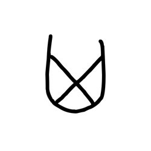

- source_zip_member: `Sub-character Images/qmvfvw99v9/qmvfvw99v9/2zysdd10df.png`
- checksum_sha256: `0e63ca170738a710457b0202183a10d47f67a79a40f424fb56abe6e9caa3844c`
- review_status: `needs_human_visual_review`
- caution: OBIMD subcharacter image is a source-marked review asset only; it is not a confirmed component form, component assignment, or decipherment conclusion.

## asset-019002

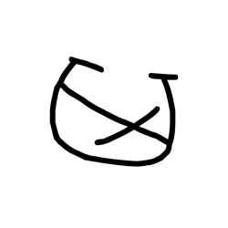

- source_zip_member: `Sub-character Images/qmvfvw99v9/qmvfvw99v9/39xsrbhipi.png`
- checksum_sha256: `c5781c5f254a25a1d09ec95da0ed04a09e682d866db3ba24bf0a034a44053331`
- review_status: `needs_human_visual_review`
- caution: OBIMD subcharacter image is a source-marked review asset only; it is not a confirmed component form, component assignment, or decipherment conclusion.

## asset-019003

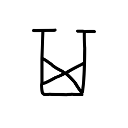

- source_zip_member: `Sub-character Images/qmvfvw99v9/qmvfvw99v9/3bh83nsp3x.png`
- checksum_sha256: `4d646c4760cd0b5c95d28ac0971002b929a32bdb61d4b81f7e622a69fed84293`
- review_status: `needs_human_visual_review`
- caution: OBIMD subcharacter image is a source-marked review asset only; it is not a confirmed component form, component assignment, or decipherment conclusion.

## asset-019004

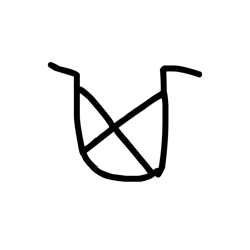

- source_zip_member: `Sub-character Images/qmvfvw99v9/qmvfvw99v9/3h9vpnm4k9.png`
- checksum_sha256: `ebb07059e6795e9c928b30e26d70e13bca61f7f83a0e0c724fbc796034971b58`
- review_status: `needs_human_visual_review`
- caution: OBIMD subcharacter image is a source-marked review asset only; it is not a confirmed component form, component assignment, or decipherment conclusion.

## asset-019005

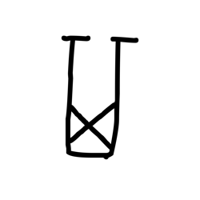

- source_zip_member: `Sub-character Images/qmvfvw99v9/qmvfvw99v9/3nxg5yj8th.png`
- checksum_sha256: `ad707f5b1e12bf0c986bf739da352b2e6b382c49062a53b2c087b7c82241eb59`
- review_status: `needs_human_visual_review`
- caution: OBIMD subcharacter image is a source-marked review asset only; it is not a confirmed component form, component assignment, or decipherment conclusion.

## asset-019006

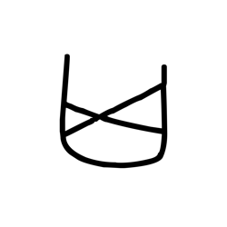

- source_zip_member: `Sub-character Images/qmvfvw99v9/qmvfvw99v9/3u7ri9ulfe.png`
- checksum_sha256: `22175b3d7eba41356afbd9aebd5fd0fffe1a6ad19b40b870a19b58ca3d261712`
- review_status: `needs_human_visual_review`
- caution: OBIMD subcharacter image is a source-marked review asset only; it is not a confirmed component form, component assignment, or decipherment conclusion.

## asset-019007

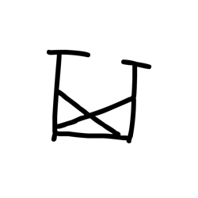

- source_zip_member: `Sub-character Images/qmvfvw99v9/qmvfvw99v9/4g88pkf6ab.png`
- checksum_sha256: `f57b6e0168079f39bca2f60ff222adebf54c2b04fa319fd4429eda29e86599c7`
- review_status: `needs_human_visual_review`
- caution: OBIMD subcharacter image is a source-marked review asset only; it is not a confirmed component form, component assignment, or decipherment conclusion.

## asset-019008

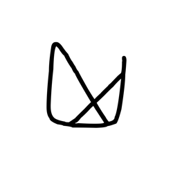

- source_zip_member: `Sub-character Images/qmvfvw99v9/qmvfvw99v9/4oi6cvia23.png`
- checksum_sha256: `842186f13f9705c8fd2143adb231b1b2693df606752f25feaa7714b1dc0df686`
- review_status: `needs_human_visual_review`
- caution: OBIMD subcharacter image is a source-marked review asset only; it is not a confirmed component form, component assignment, or decipherment conclusion.

## asset-019009

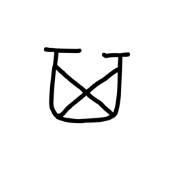

- source_zip_member: `Sub-character Images/qmvfvw99v9/qmvfvw99v9/53racizhcf.png`
- checksum_sha256: `922d85491229ad413e30711301d9be339e14b710628f64b5ae0ae0971b24c55f`
- review_status: `needs_human_visual_review`
- caution: OBIMD subcharacter image is a source-marked review asset only; it is not a confirmed component form, component assignment, or decipherment conclusion.

## asset-019010

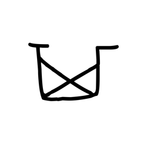

- source_zip_member: `Sub-character Images/qmvfvw99v9/qmvfvw99v9/5i42cc3rcq.png`
- checksum_sha256: `fa8b40f8cbce1d207f40f6a9ef75477862a3b3a02240c1f6bd60ff1f98c70a7c`
- review_status: `needs_human_visual_review`
- caution: OBIMD subcharacter image is a source-marked review asset only; it is not a confirmed component form, component assignment, or decipherment conclusion.

## asset-019011

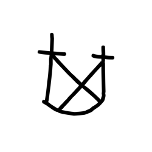

- source_zip_member: `Sub-character Images/qmvfvw99v9/qmvfvw99v9/5qicpds1xg.png`
- checksum_sha256: `09a383be4b2c50af59af8ad5a171fd45552f0305a53f51c59b00cf990cf74b53`
- review_status: `needs_human_visual_review`
- caution: OBIMD subcharacter image is a source-marked review asset only; it is not a confirmed component form, component assignment, or decipherment conclusion.

## asset-019012

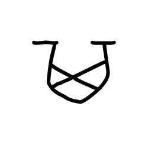

- source_zip_member: `Sub-character Images/qmvfvw99v9/qmvfvw99v9/6ggkijz3bb.png`
- checksum_sha256: `73eb76a8610f9bc9abfbe723cc3e6d42dddeca3ef971d518124e9ebe16841583`
- review_status: `needs_human_visual_review`
- caution: OBIMD subcharacter image is a source-marked review asset only; it is not a confirmed component form, component assignment, or decipherment conclusion.

## asset-019013

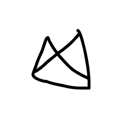

- source_zip_member: `Sub-character Images/qmvfvw99v9/qmvfvw99v9/6jk1vvc1ph.png`
- checksum_sha256: `57d086c328b273cad830f872f0a13a57a6d9dc47a4bc4ad0d31bf719da0ee976`
- review_status: `needs_human_visual_review`
- caution: OBIMD subcharacter image is a source-marked review asset only; it is not a confirmed component form, component assignment, or decipherment conclusion.

## asset-019014

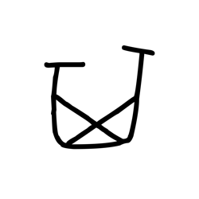

- source_zip_member: `Sub-character Images/qmvfvw99v9/qmvfvw99v9/6kk6lmpnoq.png`
- checksum_sha256: `e2d07b4ab25348d894759daeba67ffcb738fcbe87fcb5192dae68b338a19650f`
- review_status: `needs_human_visual_review`
- caution: OBIMD subcharacter image is a source-marked review asset only; it is not a confirmed component form, component assignment, or decipherment conclusion.

## asset-019015

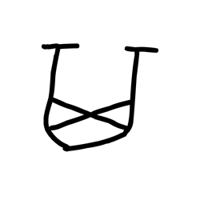

- source_zip_member: `Sub-character Images/qmvfvw99v9/qmvfvw99v9/7qpgmpqw52.png`
- checksum_sha256: `43681c4695c466b81362af58a5de549e87c7d69895607996331515c27eca43d5`
- review_status: `needs_human_visual_review`
- caution: OBIMD subcharacter image is a source-marked review asset only; it is not a confirmed component form, component assignment, or decipherment conclusion.

## asset-019016

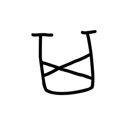

- source_zip_member: `Sub-character Images/qmvfvw99v9/qmvfvw99v9/7vw3t71sft.png`
- checksum_sha256: `313569470521565a99799c9c2dd7642bd6a3ca431c1d0321bac701fe9ff54634`
- review_status: `needs_human_visual_review`
- caution: OBIMD subcharacter image is a source-marked review asset only; it is not a confirmed component form, component assignment, or decipherment conclusion.

## asset-019017

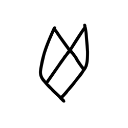

- source_zip_member: `Sub-character Images/qmvfvw99v9/qmvfvw99v9/8hcw8cbve4.png`
- checksum_sha256: `570cf041217dc04663b956759d6f8ca6c0fc72d8c0510ce80a46dc1a4de931d7`
- review_status: `needs_human_visual_review`
- caution: OBIMD subcharacter image is a source-marked review asset only; it is not a confirmed component form, component assignment, or decipherment conclusion.

## asset-019018

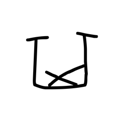

- source_zip_member: `Sub-character Images/qmvfvw99v9/qmvfvw99v9/90xdns44qt.png`
- checksum_sha256: `03e8dda86a514f909094290782aef729647be39f7f42569e3b36ae63a808a2cc`
- review_status: `needs_human_visual_review`
- caution: OBIMD subcharacter image is a source-marked review asset only; it is not a confirmed component form, component assignment, or decipherment conclusion.

## asset-019019

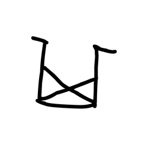

- source_zip_member: `Sub-character Images/qmvfvw99v9/qmvfvw99v9/96g45i4vyv.png`
- checksum_sha256: `61b3931a8c1eaa05d4ff18593ed238ccf4e626544763ba5e436430a92c658982`
- review_status: `needs_human_visual_review`
- caution: OBIMD subcharacter image is a source-marked review asset only; it is not a confirmed component form, component assignment, or decipherment conclusion.

## asset-019020

- source_zip_member: `Sub-character Images/qmvfvw99v9/qmvfvw99v9/99hknslyf0.png`
- checksum_sha256: `a8157b849b52e012252dd0b232dd7ed0c8110bf662b55893e7905cd660e07a88`
- review_status: `needs_human_visual_review`
- caution: OBIMD subcharacter image is a source-marked review asset only; it is not a confirmed component form, component assignment, or decipherment conclusion.

## asset-019021

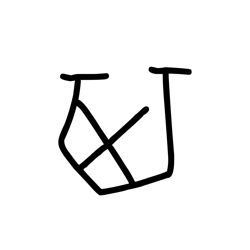

- source_zip_member: `Sub-character Images/qmvfvw99v9/qmvfvw99v9/9jkzsns82z.png`
- checksum_sha256: `095f3f3c9069cc5bb386bd15790fbba6cbbba92dabba56591c3e9b8467aeb454`
- review_status: `needs_human_visual_review`
- caution: OBIMD subcharacter image is a source-marked review asset only; it is not a confirmed component form, component assignment, or decipherment conclusion.

## asset-019022

- source_zip_member: `Sub-character Images/qmvfvw99v9/qmvfvw99v9/aio8sgfbqh.png`
- checksum_sha256: `c5c9122dfd45461d4894cae343696c82da72d8d7b373d9e293c4b0e9322e627b`
- review_status: `needs_human_visual_review`
- caution: OBIMD subcharacter image is a source-marked review asset only; it is not a confirmed component form, component assignment, or decipherment conclusion.

## asset-019023

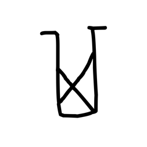

- source_zip_member: `Sub-character Images/qmvfvw99v9/qmvfvw99v9/apql5cv1qg.png`
- checksum_sha256: `ea18975ae63c49610002baef70fb60182c6dfa276448bf7f581d613dc7e7fd25`
- review_status: `needs_human_visual_review`
- caution: OBIMD subcharacter image is a source-marked review asset only; it is not a confirmed component form, component assignment, or decipherment conclusion.

## asset-019024

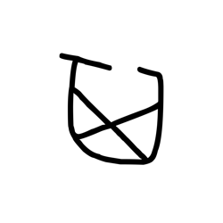

- source_zip_member: `Sub-character Images/qmvfvw99v9/qmvfvw99v9/asljenamb0.png`
- checksum_sha256: `41299db8bc42ef1d6e9bad1c09935841e4f8f1d39f843b45bd3cdbc16350b300`
- review_status: `needs_human_visual_review`
- caution: OBIMD subcharacter image is a source-marked review asset only; it is not a confirmed component form, component assignment, or decipherment conclusion.

## asset-019025

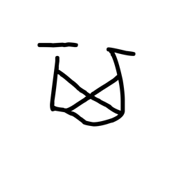

- source_zip_member: `Sub-character Images/qmvfvw99v9/qmvfvw99v9/b94pk62qan.png`
- checksum_sha256: `934bf12831f451c596c64a0b440d26d7d7b1eac78addd2796650584babcd3fbd`
- review_status: `needs_human_visual_review`
- caution: OBIMD subcharacter image is a source-marked review asset only; it is not a confirmed component form, component assignment, or decipherment conclusion.

## asset-019026

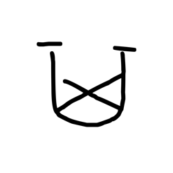

- source_zip_member: `Sub-character Images/qmvfvw99v9/qmvfvw99v9/bbp9od4jjp.png`
- checksum_sha256: `3697f270c4f1ad4fadc7f46f7266aee21b8c0c40e097a02e33c8d42bf0219c9d`
- review_status: `needs_human_visual_review`
- caution: OBIMD subcharacter image is a source-marked review asset only; it is not a confirmed component form, component assignment, or decipherment conclusion.

## asset-019027

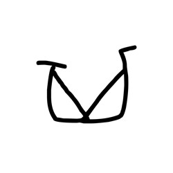

- source_zip_member: `Sub-character Images/qmvfvw99v9/qmvfvw99v9/bc55fs6u6b.png`
- checksum_sha256: `681a0aad51316faff7556baed13a2843b81cd05d626f0a9babc44ee27d687a33`
- review_status: `needs_human_visual_review`
- caution: OBIMD subcharacter image is a source-marked review asset only; it is not a confirmed component form, component assignment, or decipherment conclusion.

## asset-019028

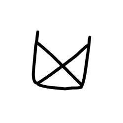

- source_zip_member: `Sub-character Images/qmvfvw99v9/qmvfvw99v9/bjdts09rgd.png`
- checksum_sha256: `ddd3b88a5a907ef27803cda75159523da9dec668240c72732afb4dbcd8ebc8ae`
- review_status: `needs_human_visual_review`
- caution: OBIMD subcharacter image is a source-marked review asset only; it is not a confirmed component form, component assignment, or decipherment conclusion.

## asset-019029

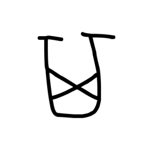

- source_zip_member: `Sub-character Images/qmvfvw99v9/qmvfvw99v9/bmxdebvu6m.png`
- checksum_sha256: `f041546aa6ea00e4b695bbbb547d41744275e07f7ab3a30779cfb326eede4230`
- review_status: `needs_human_visual_review`
- caution: OBIMD subcharacter image is a source-marked review asset only; it is not a confirmed component form, component assignment, or decipherment conclusion.

## asset-019030

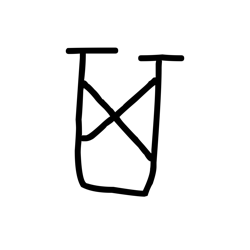

- source_zip_member: `Sub-character Images/qmvfvw99v9/qmvfvw99v9/bpfp2yy834.png`
- checksum_sha256: `cb2c94c8e2d0e2850234b2ab1385698420cf61d97549990f85814b20a9593cc9`
- review_status: `needs_human_visual_review`
- caution: OBIMD subcharacter image is a source-marked review asset only; it is not a confirmed component form, component assignment, or decipherment conclusion.

## asset-019031

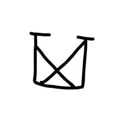

- source_zip_member: `Sub-character Images/qmvfvw99v9/qmvfvw99v9/c8ne2467xh.png`
- checksum_sha256: `b469bb39cd272f14fc85acecdb816f05b8f64bfe07290ae29eeb93c2e7afc149`
- review_status: `needs_human_visual_review`
- caution: OBIMD subcharacter image is a source-marked review asset only; it is not a confirmed component form, component assignment, or decipherment conclusion.

## asset-019032

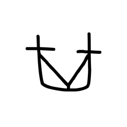

- source_zip_member: `Sub-character Images/qmvfvw99v9/qmvfvw99v9/c9pt5vxqcy.png`
- checksum_sha256: `8d8dd64ad294b346b3a614f418334501c807a0f190167391a783acb891fb2478`
- review_status: `needs_human_visual_review`
- caution: OBIMD subcharacter image is a source-marked review asset only; it is not a confirmed component form, component assignment, or decipherment conclusion.

## asset-019033

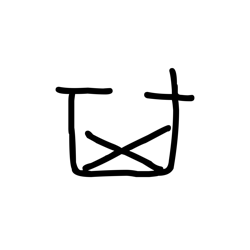

- source_zip_member: `Sub-character Images/qmvfvw99v9/qmvfvw99v9/cb5fk8nnvc.png`
- checksum_sha256: `0c83eda57f165ef085958b5bd310da3d5ede3f65504f01b6cda227fd2f4bba79`
- review_status: `needs_human_visual_review`
- caution: OBIMD subcharacter image is a source-marked review asset only; it is not a confirmed component form, component assignment, or decipherment conclusion.

## asset-019034

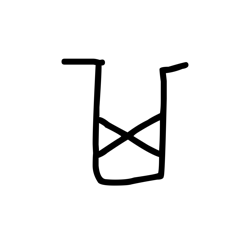

- source_zip_member: `Sub-character Images/qmvfvw99v9/qmvfvw99v9/chj18o3dj2.png`
- checksum_sha256: `6129f60055af6ff83614e3108155f9055ecc2ca3501ef76834c42470a7ad206e`
- review_status: `needs_human_visual_review`
- caution: OBIMD subcharacter image is a source-marked review asset only; it is not a confirmed component form, component assignment, or decipherment conclusion.

## asset-019035

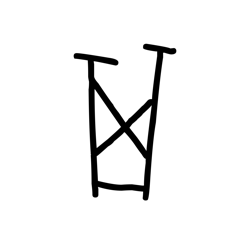

- source_zip_member: `Sub-character Images/qmvfvw99v9/qmvfvw99v9/cjwadmvtki.png`
- checksum_sha256: `700b630e3a37e15fec13fb0cd7d7709b78863059dcfe5b76b2fc783210aea118`
- review_status: `needs_human_visual_review`
- caution: OBIMD subcharacter image is a source-marked review asset only; it is not a confirmed component form, component assignment, or decipherment conclusion.

## asset-019036

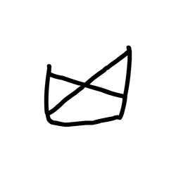

- source_zip_member: `Sub-character Images/qmvfvw99v9/qmvfvw99v9/cusotbbfz5.png`
- checksum_sha256: `3c3b41e024a8d706d9c3b9ef63f30eecae4116c72320dd32826e85a311d0dc27`
- review_status: `needs_human_visual_review`
- caution: OBIMD subcharacter image is a source-marked review asset only; it is not a confirmed component form, component assignment, or decipherment conclusion.

## asset-019037

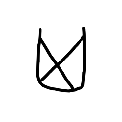

- source_zip_member: `Sub-character Images/qmvfvw99v9/qmvfvw99v9/cy6x0oz38n.png`
- checksum_sha256: `55026ce397d5cc16e7063ef9e4583c76fc0af132e6db2d30276d1b7333fdb884`
- review_status: `needs_human_visual_review`
- caution: OBIMD subcharacter image is a source-marked review asset only; it is not a confirmed component form, component assignment, or decipherment conclusion.

## asset-019038

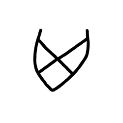

- source_zip_member: `Sub-character Images/qmvfvw99v9/qmvfvw99v9/czj9rb424p.png`
- checksum_sha256: `8c1a99d0647c3a463ac646a66495a054fccabd95f8bf0e04302ffcbfc2fb20bf`
- review_status: `needs_human_visual_review`
- caution: OBIMD subcharacter image is a source-marked review asset only; it is not a confirmed component form, component assignment, or decipherment conclusion.

## asset-019039

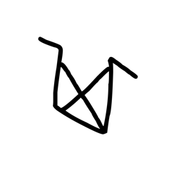

- source_zip_member: `Sub-character Images/qmvfvw99v9/qmvfvw99v9/dued44nazg.png`
- checksum_sha256: `67702f4f3c696052a382fced2c843b397b23162e0e4f84b44998a3142387ac18`
- review_status: `needs_human_visual_review`
- caution: OBIMD subcharacter image is a source-marked review asset only; it is not a confirmed component form, component assignment, or decipherment conclusion.

## asset-019040

- source_zip_member: `Sub-character Images/qmvfvw99v9/qmvfvw99v9/e420y3xsb5.png`
- checksum_sha256: `7c22f697f2b7377f8ffcee0fdf85e13e544b8e55565f98436ff7f9ac96ff3536`
- review_status: `needs_human_visual_review`
- caution: OBIMD subcharacter image is a source-marked review asset only; it is not a confirmed component form, component assignment, or decipherment conclusion.

## asset-019041

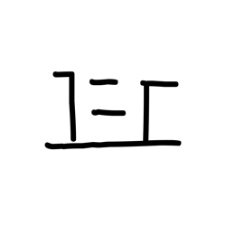

- source_zip_member: `Sub-character Images/qmvfvw99v9/qmvfvw99v9/eia6nq92s8.png`
- checksum_sha256: `a80394f9e1ff3a60b2ea747d10260a41367c3479de161005870e83fdb09c59fa`
- review_status: `needs_human_visual_review`
- caution: OBIMD subcharacter image is a source-marked review asset only; it is not a confirmed component form, component assignment, or decipherment conclusion.

## asset-019042

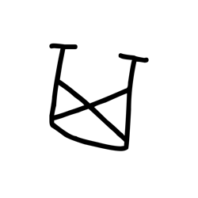

- source_zip_member: `Sub-character Images/qmvfvw99v9/qmvfvw99v9/eio81cj9qb.png`
- checksum_sha256: `16a6555a765657ca78447173fb69613e634cfe574b407293fc7ddb40db0a8eea`
- review_status: `needs_human_visual_review`
- caution: OBIMD subcharacter image is a source-marked review asset only; it is not a confirmed component form, component assignment, or decipherment conclusion.

## asset-019043

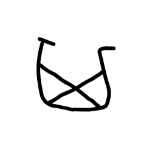

- source_zip_member: `Sub-character Images/qmvfvw99v9/qmvfvw99v9/ep3bcdob1q.png`
- checksum_sha256: `4d709a2d1146ba312636c9b38f97da69d5c8f13536664d9e24f6b41d05236f8f`
- review_status: `needs_human_visual_review`
- caution: OBIMD subcharacter image is a source-marked review asset only; it is not a confirmed component form, component assignment, or decipherment conclusion.

## asset-019044

- source_zip_member: `Sub-character Images/qmvfvw99v9/qmvfvw99v9/eqj5m8vd4m.png`
- checksum_sha256: `964dcc242b8dd0596b957b2083d71a4e33389ce48e8df08f855f6bd0ccd7478d`
- review_status: `needs_human_visual_review`
- caution: OBIMD subcharacter image is a source-marked review asset only; it is not a confirmed component form, component assignment, or decipherment conclusion.

## asset-019045

- source_zip_member: `Sub-character Images/qmvfvw99v9/qmvfvw99v9/eql0mx1o07.png`
- checksum_sha256: `4c869b657048067adcfc58a3018f3a309d809e7b337224a4993a1e29a7e1469c`
- review_status: `needs_human_visual_review`
- caution: OBIMD subcharacter image is a source-marked review asset only; it is not a confirmed component form, component assignment, or decipherment conclusion.

## asset-019046

- source_zip_member: `Sub-character Images/qmvfvw99v9/qmvfvw99v9/estwoj82h9.png`
- checksum_sha256: `aebd4af4ca590d0d62c6515ff3442f1f846cfd72a248fcbf2c09a14989e76ed9`
- review_status: `needs_human_visual_review`
- caution: OBIMD subcharacter image is a source-marked review asset only; it is not a confirmed component form, component assignment, or decipherment conclusion.

## asset-019047

- source_zip_member: `Sub-character Images/qmvfvw99v9/qmvfvw99v9/f2zs27bbqa.png`
- checksum_sha256: `4b41a5ac4f2fb4e362717d3e1ac937b5470a0d9760bfde10ab66bc2d9f37c656`
- review_status: `needs_human_visual_review`
- caution: OBIMD subcharacter image is a source-marked review asset only; it is not a confirmed component form, component assignment, or decipherment conclusion.

## asset-019048

- source_zip_member: `Sub-character Images/qmvfvw99v9/qmvfvw99v9/fie2sbx2gs.png`
- checksum_sha256: `b675736c223135d4ed5a47ad190ac021d81b4d6088e06b5bd0eff8a1e98fb9ff`
- review_status: `needs_human_visual_review`
- caution: OBIMD subcharacter image is a source-marked review asset only; it is not a confirmed component form, component assignment, or decipherment conclusion.

## asset-019049

- source_zip_member: `Sub-character Images/qmvfvw99v9/qmvfvw99v9/g63consuqq.png`
- checksum_sha256: `3996eb89a18bc26dc0cb7794d8d1283bb392ed17e1a29cbb7f0ff0fd4643295f`
- review_status: `needs_human_visual_review`
- caution: OBIMD subcharacter image is a source-marked review asset only; it is not a confirmed component form, component assignment, or decipherment conclusion.

## asset-019050

- source_zip_member: `Sub-character Images/qmvfvw99v9/qmvfvw99v9/g6kglgmhix.png`
- checksum_sha256: `2f86599c831a43cf4cc7e2c56773ca3cd3484c9d8c58a273f28c91006df528d3`
- review_status: `needs_human_visual_review`
- caution: OBIMD subcharacter image is a source-marked review asset only; it is not a confirmed component form, component assignment, or decipherment conclusion.

## asset-019051

- source_zip_member: `Sub-character Images/qmvfvw99v9/qmvfvw99v9/ga18nduyv1.png`
- checksum_sha256: `3177375564f1cd61b713e029999bf85f06c9707815d23bec9b609b6b8e149b80`
- review_status: `needs_human_visual_review`
- caution: OBIMD subcharacter image is a source-marked review asset only; it is not a confirmed component form, component assignment, or decipherment conclusion.

## asset-019052

- source_zip_member: `Sub-character Images/qmvfvw99v9/qmvfvw99v9/gbrlueqdw0.png`
- checksum_sha256: `b4f36ee6b58a6552a2ea740d7c207aaaaca396ed1514a62851b2170cd470d0cd`
- review_status: `needs_human_visual_review`
- caution: OBIMD subcharacter image is a source-marked review asset only; it is not a confirmed component form, component assignment, or decipherment conclusion.

## asset-019053

- source_zip_member: `Sub-character Images/qmvfvw99v9/qmvfvw99v9/gpg7xvcdl8.png`
- checksum_sha256: `a4c01e6628fcd25548ae8ae9bca9544693c8a6c08a16baec0d389fb9a3734add`
- review_status: `needs_human_visual_review`
- caution: OBIMD subcharacter image is a source-marked review asset only; it is not a confirmed component form, component assignment, or decipherment conclusion.

## asset-019054

- source_zip_member: `Sub-character Images/qmvfvw99v9/qmvfvw99v9/grr1uq6bpu.png`
- checksum_sha256: `91ce60559a09a0405a2785edec46a343b020f5a6245614d4c8b91d88bc7886a1`
- review_status: `needs_human_visual_review`
- caution: OBIMD subcharacter image is a source-marked review asset only; it is not a confirmed component form, component assignment, or decipherment conclusion.

## asset-019055

- source_zip_member: `Sub-character Images/qmvfvw99v9/qmvfvw99v9/gvfhkwaakp.png`
- checksum_sha256: `8f4bcbf7f045ef0f5c3e4dee49425878da952cb02aaf25b9ff406e0ee8eb09ec`
- review_status: `needs_human_visual_review`
- caution: OBIMD subcharacter image is a source-marked review asset only; it is not a confirmed component form, component assignment, or decipherment conclusion.

## asset-019056

- source_zip_member: `Sub-character Images/qmvfvw99v9/qmvfvw99v9/i55fr495m1.png`
- checksum_sha256: `08c52e81724d029d52da5215d7fcea683ffc3c049cb4032cd921f68e5c7623b4`
- review_status: `needs_human_visual_review`
- caution: OBIMD subcharacter image is a source-marked review asset only; it is not a confirmed component form, component assignment, or decipherment conclusion.

## asset-019057

- source_zip_member: `Sub-character Images/qmvfvw99v9/qmvfvw99v9/i79aspm8ih.png`
- checksum_sha256: `9e0a9daffc79ec522760c0cd171bec15cf128e18e7059b76407eb83b2737ae14`
- review_status: `needs_human_visual_review`
- caution: OBIMD subcharacter image is a source-marked review asset only; it is not a confirmed component form, component assignment, or decipherment conclusion.

## asset-019058

- source_zip_member: `Sub-character Images/qmvfvw99v9/qmvfvw99v9/ic2dew136z.png`
- checksum_sha256: `94a40a50a3a3c6f7faa2ab3ac6262bd23da3ee7791fbe082063fac6b14b32fba`
- review_status: `needs_human_visual_review`
- caution: OBIMD subcharacter image is a source-marked review asset only; it is not a confirmed component form, component assignment, or decipherment conclusion.

## asset-019059

- source_zip_member: `Sub-character Images/qmvfvw99v9/qmvfvw99v9/ilkwwojhhp.png`
- checksum_sha256: `40cec1b50c7a8dcae615a2f279c9c1f48dfda476dfa469a866841cbc721d3391`
- review_status: `needs_human_visual_review`
- caution: OBIMD subcharacter image is a source-marked review asset only; it is not a confirmed component form, component assignment, or decipherment conclusion.

## asset-019060

- source_zip_member: `Sub-character Images/qmvfvw99v9/qmvfvw99v9/is6s44v6q0.png`
- checksum_sha256: `0a048e3b2cae0d66a0cac24d582dcd7cc6e75a9a2025f295abeb93fa8290a927`
- review_status: `needs_human_visual_review`
- caution: OBIMD subcharacter image is a source-marked review asset only; it is not a confirmed component form, component assignment, or decipherment conclusion.

## asset-019061

- source_zip_member: `Sub-character Images/qmvfvw99v9/qmvfvw99v9/j5actbedab.png`
- checksum_sha256: `a719dc2ec83dd91d44cdefc4b2c2d240d5849ee6be79b02f84c398140d9db852`
- review_status: `needs_human_visual_review`
- caution: OBIMD subcharacter image is a source-marked review asset only; it is not a confirmed component form, component assignment, or decipherment conclusion.

## asset-019062

- source_zip_member: `Sub-character Images/qmvfvw99v9/qmvfvw99v9/j5p1rraavv.png`
- checksum_sha256: `08bdc87f018a9279ecc8e77416509a11f1ba9dc03ce1f396db1105bd1ea026f2`
- review_status: `needs_human_visual_review`
- caution: OBIMD subcharacter image is a source-marked review asset only; it is not a confirmed component form, component assignment, or decipherment conclusion.

## asset-019063

- source_zip_member: `Sub-character Images/qmvfvw99v9/qmvfvw99v9/j7j7p8dkq6.png`
- checksum_sha256: `d65c3d9db31ef1d041059c3bbc4d7a4398ad02fcaa732131ce0b2cd27eceee0f`
- review_status: `needs_human_visual_review`
- caution: OBIMD subcharacter image is a source-marked review asset only; it is not a confirmed component form, component assignment, or decipherment conclusion.

## asset-019064

- source_zip_member: `Sub-character Images/qmvfvw99v9/qmvfvw99v9/jbuw7zuf3g.png`
- checksum_sha256: `92a6870782ca90e8acf73e7780dff05493621d4c3613b22010cbee9700cd6221`
- review_status: `needs_human_visual_review`
- caution: OBIMD subcharacter image is a source-marked review asset only; it is not a confirmed component form, component assignment, or decipherment conclusion.

## asset-019065

- source_zip_member: `Sub-character Images/qmvfvw99v9/qmvfvw99v9/jj36m1ts2p.png`
- checksum_sha256: `c7e2fb4f072079fddc3239f269f62cf15c80a7b611cc40696aadc7402bbad5ec`
- review_status: `needs_human_visual_review`
- caution: OBIMD subcharacter image is a source-marked review asset only; it is not a confirmed component form, component assignment, or decipherment conclusion.

## asset-019066

- source_zip_member: `Sub-character Images/qmvfvw99v9/qmvfvw99v9/jj81kgqmei.png`
- checksum_sha256: `ddbe8a25816fb8535992d82c5d9a6916fea9749ddf79ddbc614c727f41600d68`
- review_status: `needs_human_visual_review`
- caution: OBIMD subcharacter image is a source-marked review asset only; it is not a confirmed component form, component assignment, or decipherment conclusion.

## asset-019067

- source_zip_member: `Sub-character Images/qmvfvw99v9/qmvfvw99v9/jrob23vs82.png`
- checksum_sha256: `1da03b9c2cf3b0528bb00d416e4a6d379262af0ab15abf0eb7611a59828550c9`
- review_status: `needs_human_visual_review`
- caution: OBIMD subcharacter image is a source-marked review asset only; it is not a confirmed component form, component assignment, or decipherment conclusion.

## asset-019068

- source_zip_member: `Sub-character Images/qmvfvw99v9/qmvfvw99v9/jwx2mupy0f.png`
- checksum_sha256: `f88c269136a93123ae4ba8994eda61e74ec5f55593bf1942f3eafa05bd9b837e`
- review_status: `needs_human_visual_review`
- caution: OBIMD subcharacter image is a source-marked review asset only; it is not a confirmed component form, component assignment, or decipherment conclusion.

## asset-019069

- source_zip_member: `Sub-character Images/qmvfvw99v9/qmvfvw99v9/kh973i644g.png`
- checksum_sha256: `13affaf7d481c9f62a321401a26dcde6e7e8ae6f2863297d73eb67e3bd5959eb`
- review_status: `needs_human_visual_review`
- caution: OBIMD subcharacter image is a source-marked review asset only; it is not a confirmed component form, component assignment, or decipherment conclusion.

## asset-019070

- source_zip_member: `Sub-character Images/qmvfvw99v9/qmvfvw99v9/kjm2sz2l73.png`
- checksum_sha256: `e5ac0b5fd5961ea5c3b1b49cfafcb99a43a3e4863973fc291d8593b7cb7f79d3`
- review_status: `needs_human_visual_review`
- caution: OBIMD subcharacter image is a source-marked review asset only; it is not a confirmed component form, component assignment, or decipherment conclusion.

## asset-019071

- source_zip_member: `Sub-character Images/qmvfvw99v9/qmvfvw99v9/kwk15hkyg8.png`
- checksum_sha256: `f3782fc924c693c50999c2d6dbf01d5722a3f732f71bf8f8686babe8ba3baf28`
- review_status: `needs_human_visual_review`
- caution: OBIMD subcharacter image is a source-marked review asset only; it is not a confirmed component form, component assignment, or decipherment conclusion.

## asset-019072

- source_zip_member: `Sub-character Images/qmvfvw99v9/qmvfvw99v9/l17ur56vg8.png`
- checksum_sha256: `a3c65760f855f3e48250877c0681a732c7cc6ee63d56a4772d0144ffaefa011b`
- review_status: `needs_human_visual_review`
- caution: OBIMD subcharacter image is a source-marked review asset only; it is not a confirmed component form, component assignment, or decipherment conclusion.

## asset-019073

- source_zip_member: `Sub-character Images/qmvfvw99v9/qmvfvw99v9/l5t16myzmx.png`
- checksum_sha256: `df665136ed2dde3d3492ec1747189169b36470ca3f32ece4aac5c16e94bb2831`
- review_status: `needs_human_visual_review`
- caution: OBIMD subcharacter image is a source-marked review asset only; it is not a confirmed component form, component assignment, or decipherment conclusion.

## asset-019074

- source_zip_member: `Sub-character Images/qmvfvw99v9/qmvfvw99v9/laq0g88klj.png`
- checksum_sha256: `7a71c80bdd3837ffa5d0d3e95c38e404abfdb3a0a0244919c01741726c5df35c`
- review_status: `needs_human_visual_review`
- caution: OBIMD subcharacter image is a source-marked review asset only; it is not a confirmed component form, component assignment, or decipherment conclusion.

## asset-019075

- source_zip_member: `Sub-character Images/qmvfvw99v9/qmvfvw99v9/lr44u6ue2r.png`
- checksum_sha256: `0ae88b6f8bb50bb359a3297f1cd29925ffa7f309a12aef06926eef825c861ae6`
- review_status: `needs_human_visual_review`
- caution: OBIMD subcharacter image is a source-marked review asset only; it is not a confirmed component form, component assignment, or decipherment conclusion.

## asset-019076

- source_zip_member: `Sub-character Images/qmvfvw99v9/qmvfvw99v9/lsuzy266c6.png`
- checksum_sha256: `e3511125f9e3768fe5f9e0db61645ff8fbbafb3d5112cf137a27ce7a0be9adb4`
- review_status: `needs_human_visual_review`
- caution: OBIMD subcharacter image is a source-marked review asset only; it is not a confirmed component form, component assignment, or decipherment conclusion.

## asset-019077

- source_zip_member: `Sub-character Images/qmvfvw99v9/qmvfvw99v9/lw8c3mv620.png`
- checksum_sha256: `5b7ef9a3425583f625ced9567a73312c207f65585ef7939cae20938fe95ae3ec`
- review_status: `needs_human_visual_review`
- caution: OBIMD subcharacter image is a source-marked review asset only; it is not a confirmed component form, component assignment, or decipherment conclusion.

## asset-019078

- source_zip_member: `Sub-character Images/qmvfvw99v9/qmvfvw99v9/miww7nrkuy.png`
- checksum_sha256: `764a3f58045ca64603acb1f0775b379612c159fca53dd1db5082a70aacd75b67`
- review_status: `needs_human_visual_review`
- caution: OBIMD subcharacter image is a source-marked review asset only; it is not a confirmed component form, component assignment, or decipherment conclusion.

## asset-019079

- source_zip_member: `Sub-character Images/qmvfvw99v9/qmvfvw99v9/mldnos0wkp.png`
- checksum_sha256: `89db1037b1903418da335bde0f03cba4d4487c6b5fcaf27e5890ef90fef8e349`
- review_status: `needs_human_visual_review`
- caution: OBIMD subcharacter image is a source-marked review asset only; it is not a confirmed component form, component assignment, or decipherment conclusion.

## asset-019080

- source_zip_member: `Sub-character Images/qmvfvw99v9/qmvfvw99v9/mr1yx75dd3.png`
- checksum_sha256: `0d70af6f9677970ab00b371860c7ab41bb36283973cecd23a3d6a3dcfbd4fb4e`
- review_status: `needs_human_visual_review`
- caution: OBIMD subcharacter image is a source-marked review asset only; it is not a confirmed component form, component assignment, or decipherment conclusion.

## asset-019081

- source_zip_member: `Sub-character Images/qmvfvw99v9/qmvfvw99v9/myohhbzgz1.png`
- checksum_sha256: `6bf48d442a30269339054efd84624778c8bdb70318f3d7dcf85e070f0a81af81`
- review_status: `needs_human_visual_review`
- caution: OBIMD subcharacter image is a source-marked review asset only; it is not a confirmed component form, component assignment, or decipherment conclusion.

## asset-019082

- source_zip_member: `Sub-character Images/qmvfvw99v9/qmvfvw99v9/nn9s1wgyzk.png`
- checksum_sha256: `616495df14720780f61b5975b590427418cba6c15ac6cbcfdfd2bfe6a7e0506d`
- review_status: `needs_human_visual_review`
- caution: OBIMD subcharacter image is a source-marked review asset only; it is not a confirmed component form, component assignment, or decipherment conclusion.

## asset-019083

- source_zip_member: `Sub-character Images/qmvfvw99v9/qmvfvw99v9/nr9am79iis.png`
- checksum_sha256: `132f671c1dcdeb8b390e5fc2270c3945490e01b3d90ac6d30487ee7917797268`
- review_status: `needs_human_visual_review`
- caution: OBIMD subcharacter image is a source-marked review asset only; it is not a confirmed component form, component assignment, or decipherment conclusion.

## asset-019084

- source_zip_member: `Sub-character Images/qmvfvw99v9/qmvfvw99v9/nt1mbcfc40.png`
- checksum_sha256: `4acd31a2035edf941a7c8872ce05e739655e13fe928f7bcc754304ecc4714817`
- review_status: `needs_human_visual_review`
- caution: OBIMD subcharacter image is a source-marked review asset only; it is not a confirmed component form, component assignment, or decipherment conclusion.

## asset-019085

- source_zip_member: `Sub-character Images/qmvfvw99v9/qmvfvw99v9/o6exf344vx.png`
- checksum_sha256: `419b8af9fac5a827aad73c0e470959c2b2df1144b90f3b54851b84e262dfd526`
- review_status: `needs_human_visual_review`
- caution: OBIMD subcharacter image is a source-marked review asset only; it is not a confirmed component form, component assignment, or decipherment conclusion.

## asset-019086

- source_zip_member: `Sub-character Images/qmvfvw99v9/qmvfvw99v9/ocs27r7kgk.png`
- checksum_sha256: `c6845d35c83305f85ab407906e4b17e6a495cf244bf179bda5cfb7ca0ce21ce2`
- review_status: `needs_human_visual_review`
- caution: OBIMD subcharacter image is a source-marked review asset only; it is not a confirmed component form, component assignment, or decipherment conclusion.

## asset-019087

- source_zip_member: `Sub-character Images/qmvfvw99v9/qmvfvw99v9/otfne544yu.png`
- checksum_sha256: `b859da4603b47c0f89fe6d792733a16e6f1968dd53d04aff100bae820a87a582`
- review_status: `needs_human_visual_review`
- caution: OBIMD subcharacter image is a source-marked review asset only; it is not a confirmed component form, component assignment, or decipherment conclusion.

## asset-019088

- source_zip_member: `Sub-character Images/qmvfvw99v9/qmvfvw99v9/ouwrn8nsbo.png`
- checksum_sha256: `a5ec147f24e86f2a26008d116d75c78444561b279a19a5741b20ce87d711e160`
- review_status: `needs_human_visual_review`
- caution: OBIMD subcharacter image is a source-marked review asset only; it is not a confirmed component form, component assignment, or decipherment conclusion.

## asset-019089

- source_zip_member: `Sub-character Images/qmvfvw99v9/qmvfvw99v9/p4g1hot6qw.png`
- checksum_sha256: `d44d6a0c89cd4a212dd7e355f6e0ae586f803aae929c33bdab02c4bc60d346bd`
- review_status: `needs_human_visual_review`
- caution: OBIMD subcharacter image is a source-marked review asset only; it is not a confirmed component form, component assignment, or decipherment conclusion.

## asset-019090

- source_zip_member: `Sub-character Images/qmvfvw99v9/qmvfvw99v9/pa0loovzra.png`
- checksum_sha256: `5588787cda7662d7ade4e294d2b2db8f49fd3039437eb8481391cc1d8d468d77`
- review_status: `needs_human_visual_review`
- caution: OBIMD subcharacter image is a source-marked review asset only; it is not a confirmed component form, component assignment, or decipherment conclusion.

## asset-019091

- source_zip_member: `Sub-character Images/qmvfvw99v9/qmvfvw99v9/pb8vl5kkyt.png`
- checksum_sha256: `a53401c7c6e8b182598170f5bb27cb183e617e0c178ba346fbe539f85435f019`
- review_status: `needs_human_visual_review`
- caution: OBIMD subcharacter image is a source-marked review asset only; it is not a confirmed component form, component assignment, or decipherment conclusion.

## asset-019092

- source_zip_member: `Sub-character Images/qmvfvw99v9/qmvfvw99v9/pf74pl4rb7.png`
- checksum_sha256: `dde0e6b7cbec239624f31ad5d5c3c3228e61187563a6cd47ab1baf12302af0b7`
- review_status: `needs_human_visual_review`
- caution: OBIMD subcharacter image is a source-marked review asset only; it is not a confirmed component form, component assignment, or decipherment conclusion.

## asset-019093

- source_zip_member: `Sub-character Images/qmvfvw99v9/qmvfvw99v9/pgzhnyjr5c.png`
- checksum_sha256: `a41bd5002aaa1ccba48979944f39ffba9f81756c39a0e7d88130fcb6c0b00aa9`
- review_status: `needs_human_visual_review`
- caution: OBIMD subcharacter image is a source-marked review asset only; it is not a confirmed component form, component assignment, or decipherment conclusion.

## asset-019094

- source_zip_member: `Sub-character Images/qmvfvw99v9/qmvfvw99v9/ptqy3u7fae.png`
- checksum_sha256: `99c2669bae00d5f05c1eb4b73b8f1a1c1dd8f14ec8c4d5e8930db5e2bc499998`
- review_status: `needs_human_visual_review`
- caution: OBIMD subcharacter image is a source-marked review asset only; it is not a confirmed component form, component assignment, or decipherment conclusion.

## asset-019095

- source_zip_member: `Sub-character Images/qmvfvw99v9/qmvfvw99v9/q1irqtnaiy.png`
- checksum_sha256: `57e78b31762ba77691d21ed5920f52aa8842ba925b42b7466a8fe0586d5b22ae`
- review_status: `needs_human_visual_review`
- caution: OBIMD subcharacter image is a source-marked review asset only; it is not a confirmed component form, component assignment, or decipherment conclusion.

## asset-019096

- source_zip_member: `Sub-character Images/qmvfvw99v9/qmvfvw99v9/qb8tmeabsn.png`
- checksum_sha256: `468c420fbea8e2524fe1f286bf1ce0b504368d231bedd4ae9a614c59d17414d4`
- review_status: `needs_human_visual_review`
- caution: OBIMD subcharacter image is a source-marked review asset only; it is not a confirmed component form, component assignment, or decipherment conclusion.

## asset-019097

- source_zip_member: `Sub-character Images/qmvfvw99v9/qmvfvw99v9/qdz6kh8jqz.png`
- checksum_sha256: `917f236eea45ac536c5c58289c69115e7ea2fc148fbcf748e1bbac4df2a37117`
- review_status: `needs_human_visual_review`
- caution: OBIMD subcharacter image is a source-marked review asset only; it is not a confirmed component form, component assignment, or decipherment conclusion.

## asset-019098

- source_zip_member: `Sub-character Images/qmvfvw99v9/qmvfvw99v9/qmvfvw99v9.png`
- checksum_sha256: `51b9800aae79f037d9578f44c74f14303d8ee46e4a6d24da3f06b65be21a6d6e`
- review_status: `needs_human_visual_review`
- caution: OBIMD subcharacter image is a source-marked review asset only; it is not a confirmed component form, component assignment, or decipherment conclusion.

## asset-019099

- source_zip_member: `Sub-character Images/qmvfvw99v9/qmvfvw99v9/qq46perx6u.png`
- checksum_sha256: `9054beff645de45f1eaf0cfeca9a90ea3cff69ad8f87fcb0817f9b3211c36ae9`
- review_status: `needs_human_visual_review`
- caution: OBIMD subcharacter image is a source-marked review asset only; it is not a confirmed component form, component assignment, or decipherment conclusion.

## asset-019100

- source_zip_member: `Sub-character Images/qmvfvw99v9/qmvfvw99v9/qtxgwrwm2b.png`
- checksum_sha256: `e83904ff79e71b90761fb5e2465fc60284c38bf8868e027b9a578e93f393c988`
- review_status: `needs_human_visual_review`
- caution: OBIMD subcharacter image is a source-marked review asset only; it is not a confirmed component form, component assignment, or decipherment conclusion.

## asset-019101

- source_zip_member: `Sub-character Images/qmvfvw99v9/qmvfvw99v9/qwlcsvfn4j.png`
- checksum_sha256: `e56f6ba34493ff1fe4d121f7f11181a48a1ddf371922eb3d63bcc5d583664815`
- review_status: `needs_human_visual_review`
- caution: OBIMD subcharacter image is a source-marked review asset only; it is not a confirmed component form, component assignment, or decipherment conclusion.

## asset-019102

- source_zip_member: `Sub-character Images/qmvfvw99v9/qmvfvw99v9/qx8m1djkv7.png`
- checksum_sha256: `fc0c13d65fd59c2a617f2df4990e66bc5a2c1d9f1f543ca916cc2b52a4cc8ca4`
- review_status: `needs_human_visual_review`
- caution: OBIMD subcharacter image is a source-marked review asset only; it is not a confirmed component form, component assignment, or decipherment conclusion.

## asset-019103

- source_zip_member: `Sub-character Images/qmvfvw99v9/qmvfvw99v9/svadxj6r6o.png`
- checksum_sha256: `614d7e25361477f9780c16302455ad1fa3cf277b4183807fa54b0b9ad3c215a1`
- review_status: `needs_human_visual_review`
- caution: OBIMD subcharacter image is a source-marked review asset only; it is not a confirmed component form, component assignment, or decipherment conclusion.

## asset-019104

- source_zip_member: `Sub-character Images/qmvfvw99v9/qmvfvw99v9/syi2xs4d43.png`
- checksum_sha256: `f16a8003387a6e92d8ba2e3c0c93d808eb470f3d8117d79c58464bef99596d33`
- review_status: `needs_human_visual_review`
- caution: OBIMD subcharacter image is a source-marked review asset only; it is not a confirmed component form, component assignment, or decipherment conclusion.

## asset-019105

- source_zip_member: `Sub-character Images/qmvfvw99v9/qmvfvw99v9/tenzwmutp9.png`
- checksum_sha256: `f03399342cac5c6e7b4dc48a7072ac8866e5a4c2b959fef73da4db67f14e3a67`
- review_status: `needs_human_visual_review`
- caution: OBIMD subcharacter image is a source-marked review asset only; it is not a confirmed component form, component assignment, or decipherment conclusion.

## asset-019106

- source_zip_member: `Sub-character Images/qmvfvw99v9/qmvfvw99v9/tlcau0s3i3.png`
- checksum_sha256: `1c84cae986a258ffcb0544e011a8ac046032fd37b60da3731205862dd00d6cf6`
- review_status: `needs_human_visual_review`
- caution: OBIMD subcharacter image is a source-marked review asset only; it is not a confirmed component form, component assignment, or decipherment conclusion.

## asset-019107

- source_zip_member: `Sub-character Images/qmvfvw99v9/qmvfvw99v9/tsrp0g566x.png`
- checksum_sha256: `5c29db9a88107287cf6b21bfc5aff196b3598b7f63033a9fa0136ffb7ec21fb9`
- review_status: `needs_human_visual_review`
- caution: OBIMD subcharacter image is a source-marked review asset only; it is not a confirmed component form, component assignment, or decipherment conclusion.

## asset-019108

- source_zip_member: `Sub-character Images/qmvfvw99v9/qmvfvw99v9/u2h7l9l1nh.png`
- checksum_sha256: `971cdd437f67e29664fc75ec4a01a15155d2544b4abaf3e971c2124d9bfafe91`
- review_status: `needs_human_visual_review`
- caution: OBIMD subcharacter image is a source-marked review asset only; it is not a confirmed component form, component assignment, or decipherment conclusion.

## asset-019109

- source_zip_member: `Sub-character Images/qmvfvw99v9/qmvfvw99v9/u924dhhdxu.png`
- checksum_sha256: `b992de61596467596aae1bc2c32d6ef6ab06746aaa90c09b5bf783a0e7471fa7`
- review_status: `needs_human_visual_review`
- caution: OBIMD subcharacter image is a source-marked review asset only; it is not a confirmed component form, component assignment, or decipherment conclusion.

## asset-019110

- source_zip_member: `Sub-character Images/qmvfvw99v9/qmvfvw99v9/ud40y8bded.png`
- checksum_sha256: `6bc42cb8778b5ac1f89484a5c84c5d6400a45630a4dfea20f6248f32eaa60f5e`
- review_status: `needs_human_visual_review`
- caution: OBIMD subcharacter image is a source-marked review asset only; it is not a confirmed component form, component assignment, or decipherment conclusion.

## asset-019111

- source_zip_member: `Sub-character Images/qmvfvw99v9/qmvfvw99v9/uvlkvekp8d.png`
- checksum_sha256: `e6bcc203defba838f4edd5ee59d8482e9eb21b1f1db6f81ed0f1da5c285dfb55`
- review_status: `needs_human_visual_review`
- caution: OBIMD subcharacter image is a source-marked review asset only; it is not a confirmed component form, component assignment, or decipherment conclusion.

## asset-019112

- source_zip_member: `Sub-character Images/qmvfvw99v9/qmvfvw99v9/v3dr2hmzej.png`
- checksum_sha256: `c8af59d980d348fa87080f1ce2301a019f11a173fc393df1702bfb83ee987b97`
- review_status: `needs_human_visual_review`
- caution: OBIMD subcharacter image is a source-marked review asset only; it is not a confirmed component form, component assignment, or decipherment conclusion.

## asset-019113

- source_zip_member: `Sub-character Images/qmvfvw99v9/qmvfvw99v9/v74ts65pf7.png`
- checksum_sha256: `ab51a9788d6eb0b64ca16cbf4bd1790e3f940b54507584d84a1914473ffeba33`
- review_status: `needs_human_visual_review`
- caution: OBIMD subcharacter image is a source-marked review asset only; it is not a confirmed component form, component assignment, or decipherment conclusion.

## asset-019114

- source_zip_member: `Sub-character Images/qmvfvw99v9/qmvfvw99v9/vckrrs8z6d.png`
- checksum_sha256: `362f8a584160588497ea222f7e7db26e1bbb69bc4d5bad89c2e3a24aae7a618b`
- review_status: `needs_human_visual_review`
- caution: OBIMD subcharacter image is a source-marked review asset only; it is not a confirmed component form, component assignment, or decipherment conclusion.

## asset-019115

- source_zip_member: `Sub-character Images/qmvfvw99v9/qmvfvw99v9/vvwxiqnu7l.png`
- checksum_sha256: `edf5b514baf030309729b31e10abf23acb7d617126012122b78da1eab162ff4c`
- review_status: `needs_human_visual_review`
- caution: OBIMD subcharacter image is a source-marked review asset only; it is not a confirmed component form, component assignment, or decipherment conclusion.

## asset-019116

- source_zip_member: `Sub-character Images/qmvfvw99v9/qmvfvw99v9/vwj0m0mcem.png`
- checksum_sha256: `6465eba03e8a41437e6923192e81ecb974c4806af3caacf6f7b8c6bd79a65852`
- review_status: `needs_human_visual_review`
- caution: OBIMD subcharacter image is a source-marked review asset only; it is not a confirmed component form, component assignment, or decipherment conclusion.

## asset-019117

- source_zip_member: `Sub-character Images/qmvfvw99v9/qmvfvw99v9/vz1rzmpoy8.png`
- checksum_sha256: `4469b233a1ba05e211518da37090f732a4e9736f443081b00d9f39921f89aab9`
- review_status: `needs_human_visual_review`
- caution: OBIMD subcharacter image is a source-marked review asset only; it is not a confirmed component form, component assignment, or decipherment conclusion.

## asset-019118

- source_zip_member: `Sub-character Images/qmvfvw99v9/qmvfvw99v9/wercs734hc.png`
- checksum_sha256: `faae48654cf74c8d4462df950b73d671b2cb3639e2aa557e8d6385eec2de76cb`
- review_status: `needs_human_visual_review`
- caution: OBIMD subcharacter image is a source-marked review asset only; it is not a confirmed component form, component assignment, or decipherment conclusion.

## asset-019119

- source_zip_member: `Sub-character Images/qmvfvw99v9/qmvfvw99v9/wjgkl07pvw.png`
- checksum_sha256: `02428add8d57396293549b1b6cf18d552eacc5efc3f3aa1896e93edc09b23d39`
- review_status: `needs_human_visual_review`
- caution: OBIMD subcharacter image is a source-marked review asset only; it is not a confirmed component form, component assignment, or decipherment conclusion.

## asset-019120

- source_zip_member: `Sub-character Images/qmvfvw99v9/qmvfvw99v9/wn6turf8ds.png`
- checksum_sha256: `f40a4bef98b1b06d381a7db238bceebe5fc47c790ef8d73ed6e708b51ae2766d`
- review_status: `needs_human_visual_review`
- caution: OBIMD subcharacter image is a source-marked review asset only; it is not a confirmed component form, component assignment, or decipherment conclusion.

## asset-019121

- source_zip_member: `Sub-character Images/qmvfvw99v9/qmvfvw99v9/wt8jaxryfy.png`
- checksum_sha256: `cb993037c0c56a4ab50fcd12ff5d0a683ed10a7ecd9b7df4696d5b4171997c28`
- review_status: `needs_human_visual_review`
- caution: OBIMD subcharacter image is a source-marked review asset only; it is not a confirmed component form, component assignment, or decipherment conclusion.

## asset-019122

- source_zip_member: `Sub-character Images/qmvfvw99v9/qmvfvw99v9/wwl5mo0j2d.png`
- checksum_sha256: `b52bf3fb1e323f953fb7306bffe4c8983a01e5126b906a3c9058ebf0723f43e9`
- review_status: `needs_human_visual_review`
- caution: OBIMD subcharacter image is a source-marked review asset only; it is not a confirmed component form, component assignment, or decipherment conclusion.

## asset-019123

- source_zip_member: `Sub-character Images/qmvfvw99v9/qmvfvw99v9/xcdjmdl9f3.png`
- checksum_sha256: `1f6958ecbae5e94df3bf44569019afb2a7e1b8c96cc47f6feca59b8ef9067ff1`
- review_status: `needs_human_visual_review`
- caution: OBIMD subcharacter image is a source-marked review asset only; it is not a confirmed component form, component assignment, or decipherment conclusion.

## asset-019124

- source_zip_member: `Sub-character Images/qmvfvw99v9/qmvfvw99v9/xeq0x8i4m7.png`
- checksum_sha256: `e8455544f5bf6f26980847cc16fb3e5bb352102f75905bf9ea4020cbe71b0a5d`
- review_status: `needs_human_visual_review`
- caution: OBIMD subcharacter image is a source-marked review asset only; it is not a confirmed component form, component assignment, or decipherment conclusion.

## asset-019125

- source_zip_member: `Sub-character Images/qmvfvw99v9/qmvfvw99v9/xj1jtbscns.png`
- checksum_sha256: `7d51247157e9436395bf1f64d007d77882a7388c539511c1c4e44b9a7b7f32f6`
- review_status: `needs_human_visual_review`
- caution: OBIMD subcharacter image is a source-marked review asset only; it is not a confirmed component form, component assignment, or decipherment conclusion.

## asset-019126

- source_zip_member: `Sub-character Images/qmvfvw99v9/qmvfvw99v9/xmlvo2p5tv.png`
- checksum_sha256: `7ffeccfc141a011f2f550b59dbb81acccbd5749bd9a481164e22f8ab3802b206`
- review_status: `needs_human_visual_review`
- caution: OBIMD subcharacter image is a source-marked review asset only; it is not a confirmed component form, component assignment, or decipherment conclusion.

## asset-019127

- source_zip_member: `Sub-character Images/qmvfvw99v9/qmvfvw99v9/xp3rb5w87f.png`
- checksum_sha256: `bfb9100c1728aaa72b20b6760472dea9919e2014f48bc500562ff937d34e89a0`
- review_status: `needs_human_visual_review`
- caution: OBIMD subcharacter image is a source-marked review asset only; it is not a confirmed component form, component assignment, or decipherment conclusion.

## asset-019128

- source_zip_member: `Sub-character Images/qmvfvw99v9/qmvfvw99v9/xwmspyfz6g.png`
- checksum_sha256: `bb64172726040f6f644a09f685bbfcea8cd849a5ac1019c9091fe2f2534b9e9c`
- review_status: `needs_human_visual_review`
- caution: OBIMD subcharacter image is a source-marked review asset only; it is not a confirmed component form, component assignment, or decipherment conclusion.

## asset-019129

- source_zip_member: `Sub-character Images/qmvfvw99v9/qmvfvw99v9/xwukwhht9a.png`
- checksum_sha256: `ea0a546b3edad22b6dcf26e78cbdd29aad50f8149660bd7b3973f8b64de3ca27`
- review_status: `needs_human_visual_review`
- caution: OBIMD subcharacter image is a source-marked review asset only; it is not a confirmed component form, component assignment, or decipherment conclusion.

## asset-019130

- source_zip_member: `Sub-character Images/qmvfvw99v9/qmvfvw99v9/xxt837twfm.png`
- checksum_sha256: `8edfa2d8edc10672fe0abbbae45f6725643b5da7356a35543211af6f8d656961`
- review_status: `needs_human_visual_review`
- caution: OBIMD subcharacter image is a source-marked review asset only; it is not a confirmed component form, component assignment, or decipherment conclusion.

## asset-019131

- source_zip_member: `Sub-character Images/qmvfvw99v9/qmvfvw99v9/y6xlq91azl.png`
- checksum_sha256: `703301b2e7db176c1074883ef61f630f11f2319b037c669782259cd68676e177`
- review_status: `needs_human_visual_review`
- caution: OBIMD subcharacter image is a source-marked review asset only; it is not a confirmed component form, component assignment, or decipherment conclusion.

## asset-019132

- source_zip_member: `Sub-character Images/qmvfvw99v9/qmvfvw99v9/y97ld3qls3.png`
- checksum_sha256: `cceb748d51fc1949d8ed26993b2fdbf7d5577a483afacbd7ec0ae590d4b27109`
- review_status: `needs_human_visual_review`
- caution: OBIMD subcharacter image is a source-marked review asset only; it is not a confirmed component form, component assignment, or decipherment conclusion.

## asset-019133

- source_zip_member: `Sub-character Images/qmvfvw99v9/qmvfvw99v9/yybaj7b4g8.png`
- checksum_sha256: `2a18e0ec7a1fca17e56cf8c9863ba5e6ab42d343543f002392c6e44b3d528693`
- review_status: `needs_human_visual_review`
- caution: OBIMD subcharacter image is a source-marked review asset only; it is not a confirmed component form, component assignment, or decipherment conclusion.

## asset-019134

- source_zip_member: `Sub-character Images/qmvfvw99v9/qmvfvw99v9/zck2olhvu6.png`
- checksum_sha256: `d04b2611b066daabc79f100a8adcbbf097fbba234a70308f1b072d25b3a8b8d4`
- review_status: `needs_human_visual_review`
- caution: OBIMD subcharacter image is a source-marked review asset only; it is not a confirmed component form, component assignment, or decipherment conclusion.

## asset-019135

- source_zip_member: `Sub-character Images/qmvfvw99v9/qmvfvw99v9/zs9dtcxlc9.png`
- checksum_sha256: `0128b77a3d642c4db339d62ea2789862bca4e2d751f2ebbfe6da71db5ebcb85a`
- review_status: `needs_human_visual_review`
- caution: OBIMD subcharacter image is a source-marked review asset only; it is not a confirmed component form, component assignment, or decipherment conclusion.

## asset-019136

- source_zip_member: `Sub-character Images/qmvfvw99v9/qmvfvw99v9/ztwih7s2ps.png`
- checksum_sha256: `0d2462c51f35a8ae43c26f2223c24a3d7a4aca27163f724300ec69dcb7719030`
- review_status: `needs_human_visual_review`
- caution: OBIMD subcharacter image is a source-marked review asset only; it is not a confirmed component form, component assignment, or decipherment conclusion.
