# Component Visual Gallery / 构件图像查看: obs-comp-cand-001999

English:
This page displays OBIMD subcharacter PNG assets extracted into this concrete
corpus object directory for human review.

简体中文：
本页展示抽取到当前具体 corpus 对象目录内的 OBIMD subcharacter PNG 资料，供人工复核使用。

Boundary / 边界：
dataset image candidate only; not a confirmed component form, not a component
assignment, and not a decipherment claim.
- not a confirmed component form
- not a component assignment
- not a decipherment claim

## Concrete Questions To Check / 具体待查问题

- Open 06_component-visual-index.csv and name the local image row.
- 打开 06_component-visual-index.csv，写明本地图像行。
- Open 09_component-visual-route-index.csv and name the source route row.
- 打开 09_component-visual-route-index.csv，写明来源路线行。
- Open 13_component-context-evidence-dossier.md for character context.
- 打开 13_component-context-evidence-dossier.md，核对单字与卜辞上下文。
- Record the missing image, near-shape, source, or context route.
- 记录缺失的图像、近形、来源或上下文路线。

## asset-019137

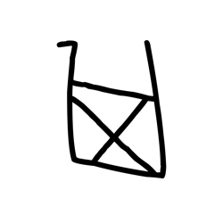

- source_zip_member: `Sub-character Images/qmvfvw99v9/2r7lrqai1j/0rarlseeh2.png`
- checksum_sha256: see `06_component-visual-index.csv`.
- review_status: `needs_human_visual_review`
- caution: source-marked review image only.

## asset-019138

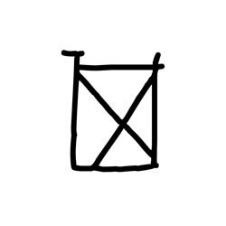

- source_zip_member: `Sub-character Images/qmvfvw99v9/2r7lrqai1j/0tzw4ugpj2.png`
- checksum_sha256: see `06_component-visual-index.csv`.
- review_status: `needs_human_visual_review`
- caution: source-marked review image only.

## asset-019139

- source_zip_member: `Sub-character Images/qmvfvw99v9/2r7lrqai1j/1154wpnb7r.png`
- checksum_sha256: see `06_component-visual-index.csv`.
- review_status: `needs_human_visual_review`
- caution: source-marked review image only.

## asset-019140

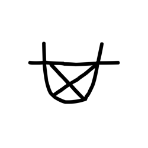

- source_zip_member: `Sub-character Images/qmvfvw99v9/2r7lrqai1j/2el91tdnk1.png`
- checksum_sha256: see `06_component-visual-index.csv`.
- review_status: `needs_human_visual_review`
- caution: source-marked review image only.

## asset-019141

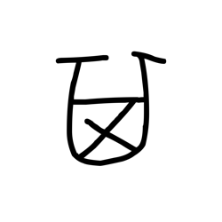

- source_zip_member: `Sub-character Images/qmvfvw99v9/2r7lrqai1j/2r7lrqai1j.png`
- checksum_sha256: see `06_component-visual-index.csv`.
- review_status: `needs_human_visual_review`
- caution: source-marked review image only.

## asset-019142

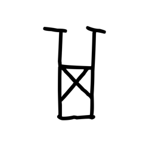

- source_zip_member: `Sub-character Images/qmvfvw99v9/2r7lrqai1j/2v9kg8sy3u.png`
- checksum_sha256: see `06_component-visual-index.csv`.
- review_status: `needs_human_visual_review`
- caution: source-marked review image only.

## asset-019143

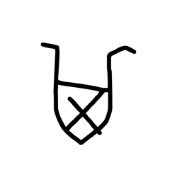

- source_zip_member: `Sub-character Images/qmvfvw99v9/2r7lrqai1j/2vvta2fm08.png`
- checksum_sha256: see `06_component-visual-index.csv`.
- review_status: `needs_human_visual_review`
- caution: source-marked review image only.

## asset-019144

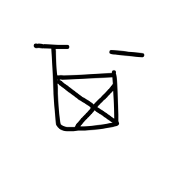

- source_zip_member: `Sub-character Images/qmvfvw99v9/2r7lrqai1j/3fk7y6i7rq.png`
- checksum_sha256: see `06_component-visual-index.csv`.
- review_status: `needs_human_visual_review`
- caution: source-marked review image only.

## asset-019145

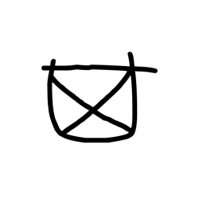

- source_zip_member: `Sub-character Images/qmvfvw99v9/2r7lrqai1j/3qhjuih4ui.png`
- checksum_sha256: see `06_component-visual-index.csv`.
- review_status: `needs_human_visual_review`
- caution: source-marked review image only.

## asset-019146

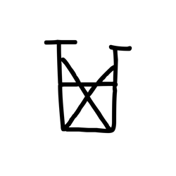

- source_zip_member: `Sub-character Images/qmvfvw99v9/2r7lrqai1j/4sc7j4c5yg.png`
- checksum_sha256: see `06_component-visual-index.csv`.
- review_status: `needs_human_visual_review`
- caution: source-marked review image only.

## asset-019147

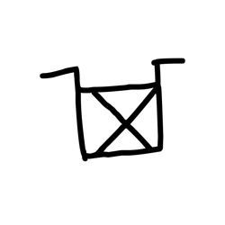

- source_zip_member: `Sub-character Images/qmvfvw99v9/2r7lrqai1j/5369joekkp.png`
- checksum_sha256: see `06_component-visual-index.csv`.
- review_status: `needs_human_visual_review`
- caution: source-marked review image only.

## asset-019148

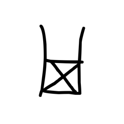

- source_zip_member: `Sub-character Images/qmvfvw99v9/2r7lrqai1j/56hh5hsgr3.png`
- checksum_sha256: see `06_component-visual-index.csv`.
- review_status: `needs_human_visual_review`
- caution: source-marked review image only.

## asset-019149

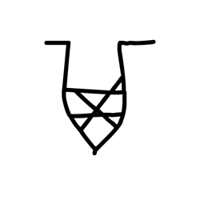

- source_zip_member: `Sub-character Images/qmvfvw99v9/2r7lrqai1j/5dptjwmn3d.png`
- checksum_sha256: see `06_component-visual-index.csv`.
- review_status: `needs_human_visual_review`
- caution: source-marked review image only.

## asset-019150

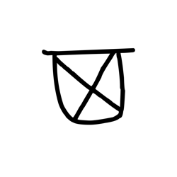

- source_zip_member: `Sub-character Images/qmvfvw99v9/2r7lrqai1j/5du93rj3gb.png`
- checksum_sha256: see `06_component-visual-index.csv`.
- review_status: `needs_human_visual_review`
- caution: source-marked review image only.

## asset-019151

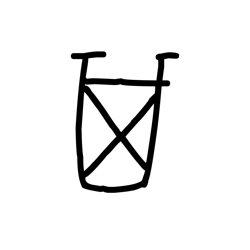

- source_zip_member: `Sub-character Images/qmvfvw99v9/2r7lrqai1j/7esor2yr1b.png`
- checksum_sha256: see `06_component-visual-index.csv`.
- review_status: `needs_human_visual_review`
- caution: source-marked review image only.

## asset-019152

- source_zip_member: `Sub-character Images/qmvfvw99v9/2r7lrqai1j/7js6j2yswt.png`
- checksum_sha256: see `06_component-visual-index.csv`.
- review_status: `needs_human_visual_review`
- caution: source-marked review image only.

## asset-019153

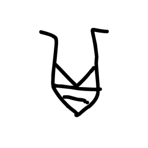

- source_zip_member: `Sub-character Images/qmvfvw99v9/2r7lrqai1j/7oclbcnrll.png`
- checksum_sha256: see `06_component-visual-index.csv`.
- review_status: `needs_human_visual_review`
- caution: source-marked review image only.

## asset-019154

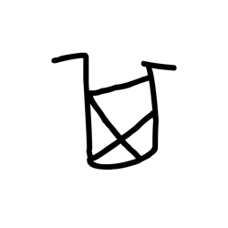

- source_zip_member: `Sub-character Images/qmvfvw99v9/2r7lrqai1j/7odf8chaa0.png`
- checksum_sha256: see `06_component-visual-index.csv`.
- review_status: `needs_human_visual_review`
- caution: source-marked review image only.

## asset-019155

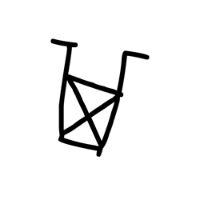

- source_zip_member: `Sub-character Images/qmvfvw99v9/2r7lrqai1j/80em483dk4.png`
- checksum_sha256: see `06_component-visual-index.csv`.
- review_status: `needs_human_visual_review`
- caution: source-marked review image only.

## asset-019156

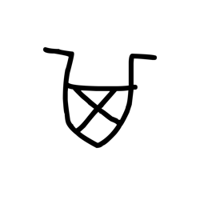

- source_zip_member: `Sub-character Images/qmvfvw99v9/2r7lrqai1j/886iy7agpe.png`
- checksum_sha256: see `06_component-visual-index.csv`.
- review_status: `needs_human_visual_review`
- caution: source-marked review image only.

## asset-019157

- source_zip_member: `Sub-character Images/qmvfvw99v9/2r7lrqai1j/8ktrlua4kh.png`
- checksum_sha256: see `06_component-visual-index.csv`.
- review_status: `needs_human_visual_review`
- caution: source-marked review image only.

## asset-019158

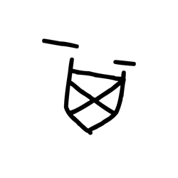

- source_zip_member: `Sub-character Images/qmvfvw99v9/2r7lrqai1j/8vt86a38lj.png`
- checksum_sha256: see `06_component-visual-index.csv`.
- review_status: `needs_human_visual_review`
- caution: source-marked review image only.

## asset-019159

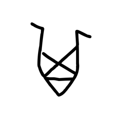

- source_zip_member: `Sub-character Images/qmvfvw99v9/2r7lrqai1j/a1odm0kwlq.png`
- checksum_sha256: see `06_component-visual-index.csv`.
- review_status: `needs_human_visual_review`
- caution: source-marked review image only.

## asset-019160

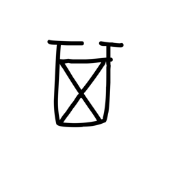

- source_zip_member: `Sub-character Images/qmvfvw99v9/2r7lrqai1j/ce8ttw24ko.png`
- checksum_sha256: see `06_component-visual-index.csv`.
- review_status: `needs_human_visual_review`
- caution: source-marked review image only.

## asset-019161

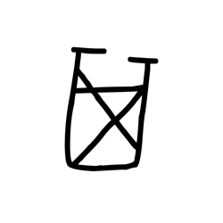

- source_zip_member: `Sub-character Images/qmvfvw99v9/2r7lrqai1j/cktgycwqdi.png`
- checksum_sha256: see `06_component-visual-index.csv`.
- review_status: `needs_human_visual_review`
- caution: source-marked review image only.

## asset-019162

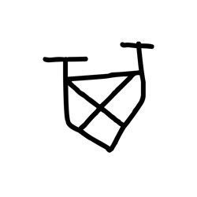

- source_zip_member: `Sub-character Images/qmvfvw99v9/2r7lrqai1j/ctejuy8vxl.png`
- checksum_sha256: see `06_component-visual-index.csv`.
- review_status: `needs_human_visual_review`
- caution: source-marked review image only.

## asset-019163

- source_zip_member: `Sub-character Images/qmvfvw99v9/2r7lrqai1j/dny3c6o7qp.png`
- checksum_sha256: see `06_component-visual-index.csv`.
- review_status: `needs_human_visual_review`
- caution: source-marked review image only.

## asset-019164

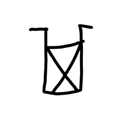

- source_zip_member: `Sub-character Images/qmvfvw99v9/2r7lrqai1j/ejuyq0krzh.png`
- checksum_sha256: see `06_component-visual-index.csv`.
- review_status: `needs_human_visual_review`
- caution: source-marked review image only.

## asset-019165

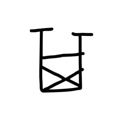

- source_zip_member: `Sub-character Images/qmvfvw99v9/2r7lrqai1j/en3w9p8a1f.png`
- checksum_sha256: see `06_component-visual-index.csv`.
- review_status: `needs_human_visual_review`
- caution: source-marked review image only.

## asset-019166

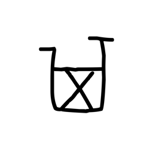

- source_zip_member: `Sub-character Images/qmvfvw99v9/2r7lrqai1j/eq51qy01ne.png`
- checksum_sha256: see `06_component-visual-index.csv`.
- review_status: `needs_human_visual_review`
- caution: source-marked review image only.

## asset-019167

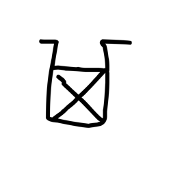

- source_zip_member: `Sub-character Images/qmvfvw99v9/2r7lrqai1j/ezffxve60t.png`
- checksum_sha256: see `06_component-visual-index.csv`.
- review_status: `needs_human_visual_review`
- caution: source-marked review image only.

## asset-019168

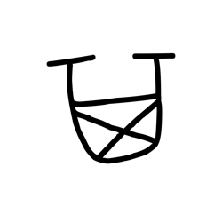

- source_zip_member: `Sub-character Images/qmvfvw99v9/2r7lrqai1j/f2en8at32f.png`
- checksum_sha256: see `06_component-visual-index.csv`.
- review_status: `needs_human_visual_review`
- caution: source-marked review image only.

## asset-019169

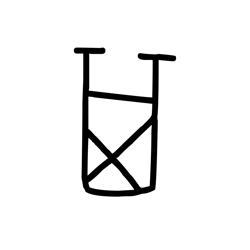

- source_zip_member: `Sub-character Images/qmvfvw99v9/2r7lrqai1j/fbmv8r4zat.png`
- checksum_sha256: see `06_component-visual-index.csv`.
- review_status: `needs_human_visual_review`
- caution: source-marked review image only.

## asset-019170

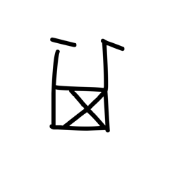

- source_zip_member: `Sub-character Images/qmvfvw99v9/2r7lrqai1j/fz0s65fdty.png`
- checksum_sha256: see `06_component-visual-index.csv`.
- review_status: `needs_human_visual_review`
- caution: source-marked review image only.

## asset-019171

- source_zip_member: `Sub-character Images/qmvfvw99v9/2r7lrqai1j/ghn277mygq.png`
- checksum_sha256: see `06_component-visual-index.csv`.
- review_status: `needs_human_visual_review`
- caution: source-marked review image only.

## asset-019172

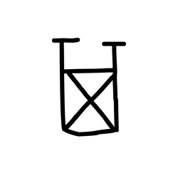

- source_zip_member: `Sub-character Images/qmvfvw99v9/2r7lrqai1j/gmdvwmjjh2.png`
- checksum_sha256: see `06_component-visual-index.csv`.
- review_status: `needs_human_visual_review`
- caution: source-marked review image only.

## asset-019173

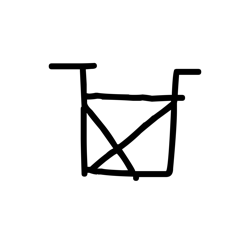

- source_zip_member: `Sub-character Images/qmvfvw99v9/2r7lrqai1j/gmtq9bt1tv.png`
- checksum_sha256: see `06_component-visual-index.csv`.
- review_status: `needs_human_visual_review`
- caution: source-marked review image only.

## asset-019174

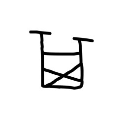

- source_zip_member: `Sub-character Images/qmvfvw99v9/2r7lrqai1j/gsab6uvcqv.png`
- checksum_sha256: see `06_component-visual-index.csv`.
- review_status: `needs_human_visual_review`
- caution: source-marked review image only.

## asset-019175

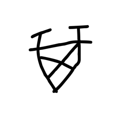

- source_zip_member: `Sub-character Images/qmvfvw99v9/2r7lrqai1j/gu3j2mhojm.png`
- checksum_sha256: see `06_component-visual-index.csv`.
- review_status: `needs_human_visual_review`
- caution: source-marked review image only.

## asset-019176

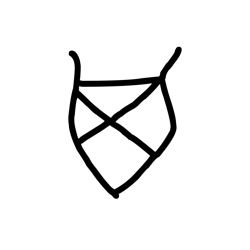

- source_zip_member: `Sub-character Images/qmvfvw99v9/2r7lrqai1j/guvyybouq3.png`
- checksum_sha256: see `06_component-visual-index.csv`.
- review_status: `needs_human_visual_review`
- caution: source-marked review image only.

## asset-019177

- source_zip_member: `Sub-character Images/qmvfvw99v9/2r7lrqai1j/h8l0ksl5og.png`
- checksum_sha256: see `06_component-visual-index.csv`.
- review_status: `needs_human_visual_review`
- caution: source-marked review image only.

## asset-019178

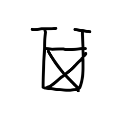

- source_zip_member: `Sub-character Images/qmvfvw99v9/2r7lrqai1j/h9767b8hbz.png`
- checksum_sha256: see `06_component-visual-index.csv`.
- review_status: `needs_human_visual_review`
- caution: source-marked review image only.

## asset-019179

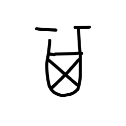

- source_zip_member: `Sub-character Images/qmvfvw99v9/2r7lrqai1j/h993r657tk.png`
- checksum_sha256: see `06_component-visual-index.csv`.
- review_status: `needs_human_visual_review`
- caution: source-marked review image only.

## asset-019180

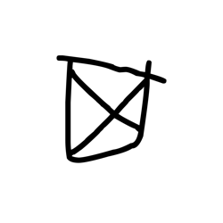

- source_zip_member: `Sub-character Images/qmvfvw99v9/2r7lrqai1j/hf1o3it89b.png`
- checksum_sha256: see `06_component-visual-index.csv`.
- review_status: `needs_human_visual_review`
- caution: source-marked review image only.

## asset-019181

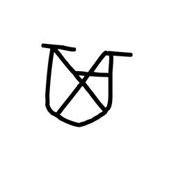

- source_zip_member: `Sub-character Images/qmvfvw99v9/2r7lrqai1j/hplyojxpac.png`
- checksum_sha256: see `06_component-visual-index.csv`.
- review_status: `needs_human_visual_review`
- caution: source-marked review image only.

## asset-019182

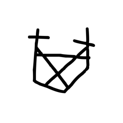

- source_zip_member: `Sub-character Images/qmvfvw99v9/2r7lrqai1j/hxixptkd9p.png`
- checksum_sha256: see `06_component-visual-index.csv`.
- review_status: `needs_human_visual_review`
- caution: source-marked review image only.

## asset-019183

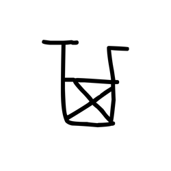

- source_zip_member: `Sub-character Images/qmvfvw99v9/2r7lrqai1j/ibn24pw26m.png`
- checksum_sha256: see `06_component-visual-index.csv`.
- review_status: `needs_human_visual_review`
- caution: source-marked review image only.

## asset-019184

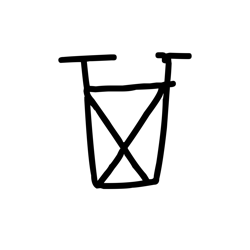

- source_zip_member: `Sub-character Images/qmvfvw99v9/2r7lrqai1j/ifak6oxcom.png`
- checksum_sha256: see `06_component-visual-index.csv`.
- review_status: `needs_human_visual_review`
- caution: source-marked review image only.

## asset-019185

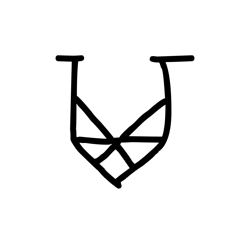

- source_zip_member: `Sub-character Images/qmvfvw99v9/2r7lrqai1j/in3lv1uk9c.png`
- checksum_sha256: see `06_component-visual-index.csv`.
- review_status: `needs_human_visual_review`
- caution: source-marked review image only.

## asset-019186

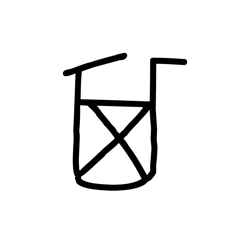

- source_zip_member: `Sub-character Images/qmvfvw99v9/2r7lrqai1j/jkz5dujh2l.png`
- checksum_sha256: see `06_component-visual-index.csv`.
- review_status: `needs_human_visual_review`
- caution: source-marked review image only.

## asset-019187

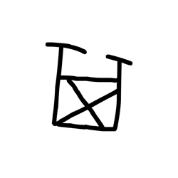

- source_zip_member: `Sub-character Images/qmvfvw99v9/2r7lrqai1j/jrw4kluylv.png`
- checksum_sha256: see `06_component-visual-index.csv`.
- review_status: `needs_human_visual_review`
- caution: source-marked review image only.

## asset-019188

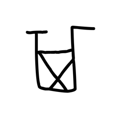

- source_zip_member: `Sub-character Images/qmvfvw99v9/2r7lrqai1j/kan3zjqk0f.png`
- checksum_sha256: see `06_component-visual-index.csv`.
- review_status: `needs_human_visual_review`
- caution: source-marked review image only.

## asset-019189

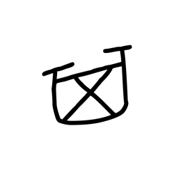

- source_zip_member: `Sub-character Images/qmvfvw99v9/2r7lrqai1j/kvk1hllk51.png`
- checksum_sha256: see `06_component-visual-index.csv`.
- review_status: `needs_human_visual_review`
- caution: source-marked review image only.

## asset-019190

- source_zip_member: `Sub-character Images/qmvfvw99v9/2r7lrqai1j/ls4k5986y0.png`
- checksum_sha256: see `06_component-visual-index.csv`.
- review_status: `needs_human_visual_review`
- caution: source-marked review image only.

## asset-019191

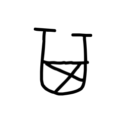

- source_zip_member: `Sub-character Images/qmvfvw99v9/2r7lrqai1j/mm5lkvo7si.png`
- checksum_sha256: see `06_component-visual-index.csv`.
- review_status: `needs_human_visual_review`
- caution: source-marked review image only.

## asset-019192

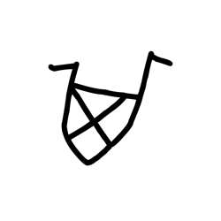

- source_zip_member: `Sub-character Images/qmvfvw99v9/2r7lrqai1j/ncizip39jm.png`
- checksum_sha256: see `06_component-visual-index.csv`.
- review_status: `needs_human_visual_review`
- caution: source-marked review image only.

## asset-019193

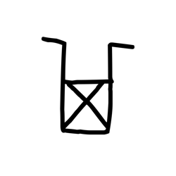

- source_zip_member: `Sub-character Images/qmvfvw99v9/2r7lrqai1j/nsdouzox37.png`
- checksum_sha256: see `06_component-visual-index.csv`.
- review_status: `needs_human_visual_review`
- caution: source-marked review image only.

## asset-019194

- source_zip_member: `Sub-character Images/qmvfvw99v9/2r7lrqai1j/p78e54ggvh.png`
- checksum_sha256: see `06_component-visual-index.csv`.
- review_status: `needs_human_visual_review`
- caution: source-marked review image only.

## asset-019195

- source_zip_member: `Sub-character Images/qmvfvw99v9/2r7lrqai1j/pg6ufeqtu1.png`
- checksum_sha256: see `06_component-visual-index.csv`.
- review_status: `needs_human_visual_review`
- caution: source-marked review image only.

## asset-019196

- source_zip_member: `Sub-character Images/qmvfvw99v9/2r7lrqai1j/ph825nr98i.png`
- checksum_sha256: see `06_component-visual-index.csv`.
- review_status: `needs_human_visual_review`
- caution: source-marked review image only.

## asset-019197

- source_zip_member: `Sub-character Images/qmvfvw99v9/2r7lrqai1j/psfp6y4yfa.png`
- checksum_sha256: see `06_component-visual-index.csv`.
- review_status: `needs_human_visual_review`
- caution: source-marked review image only.

## asset-019198

- source_zip_member: `Sub-character Images/qmvfvw99v9/2r7lrqai1j/pv5vlz05ud.png`
- checksum_sha256: see `06_component-visual-index.csv`.
- review_status: `needs_human_visual_review`
- caution: source-marked review image only.

## asset-019199

- source_zip_member: `Sub-character Images/qmvfvw99v9/2r7lrqai1j/q9at55ui7b.png`
- checksum_sha256: see `06_component-visual-index.csv`.
- review_status: `needs_human_visual_review`
- caution: source-marked review image only.

## asset-019200

- source_zip_member: `Sub-character Images/qmvfvw99v9/2r7lrqai1j/qbfa8y9few.png`
- checksum_sha256: see `06_component-visual-index.csv`.
- review_status: `needs_human_visual_review`
- caution: source-marked review image only.

## asset-019201

- source_zip_member: `Sub-character Images/qmvfvw99v9/2r7lrqai1j/qbzyfj8t6v.png`
- checksum_sha256: see `06_component-visual-index.csv`.
- review_status: `needs_human_visual_review`
- caution: source-marked review image only.

## asset-019202

- source_zip_member: `Sub-character Images/qmvfvw99v9/2r7lrqai1j/rbrv6cxu4h.png`
- checksum_sha256: see `06_component-visual-index.csv`.
- review_status: `needs_human_visual_review`
- caution: source-marked review image only.

## asset-019203

- source_zip_member: `Sub-character Images/qmvfvw99v9/2r7lrqai1j/tsbb8qcq84.png`
- checksum_sha256: see `06_component-visual-index.csv`.
- review_status: `needs_human_visual_review`
- caution: source-marked review image only.

## asset-019204

- source_zip_member: `Sub-character Images/qmvfvw99v9/2r7lrqai1j/u8121mzx4r.png`
- checksum_sha256: see `06_component-visual-index.csv`.
- review_status: `needs_human_visual_review`
- caution: source-marked review image only.

## asset-019205

- source_zip_member: `Sub-character Images/qmvfvw99v9/2r7lrqai1j/udjwc7gltc.png`
- checksum_sha256: see `06_component-visual-index.csv`.
- review_status: `needs_human_visual_review`
- caution: source-marked review image only.

## asset-019206

- source_zip_member: `Sub-character Images/qmvfvw99v9/2r7lrqai1j/urak8nodgl.png`
- checksum_sha256: see `06_component-visual-index.csv`.
- review_status: `needs_human_visual_review`
- caution: source-marked review image only.

## asset-019207

- source_zip_member: `Sub-character Images/qmvfvw99v9/2r7lrqai1j/vgcm33tksn.png`
- checksum_sha256: see `06_component-visual-index.csv`.
- review_status: `needs_human_visual_review`
- caution: source-marked review image only.

## asset-019208

- source_zip_member: `Sub-character Images/qmvfvw99v9/2r7lrqai1j/vp18ch319a.png`
- checksum_sha256: see `06_component-visual-index.csv`.
- review_status: `needs_human_visual_review`
- caution: source-marked review image only.

## asset-019209

- source_zip_member: `Sub-character Images/qmvfvw99v9/2r7lrqai1j/vpk2e9ccqw.png`
- checksum_sha256: see `06_component-visual-index.csv`.
- review_status: `needs_human_visual_review`
- caution: source-marked review image only.

## asset-019210

- source_zip_member: `Sub-character Images/qmvfvw99v9/2r7lrqai1j/w72g652r1k.png`
- checksum_sha256: see `06_component-visual-index.csv`.
- review_status: `needs_human_visual_review`
- caution: source-marked review image only.

## asset-019211

- source_zip_member: `Sub-character Images/qmvfvw99v9/2r7lrqai1j/w91v3jb2gu.png`
- checksum_sha256: see `06_component-visual-index.csv`.
- review_status: `needs_human_visual_review`
- caution: source-marked review image only.

## asset-019212

- source_zip_member: `Sub-character Images/qmvfvw99v9/2r7lrqai1j/wcs9ppnu4t.png`
- checksum_sha256: see `06_component-visual-index.csv`.
- review_status: `needs_human_visual_review`
- caution: source-marked review image only.

## asset-019213

- source_zip_member: `Sub-character Images/qmvfvw99v9/2r7lrqai1j/wq41p3vu02.png`
- checksum_sha256: see `06_component-visual-index.csv`.
- review_status: `needs_human_visual_review`
- caution: source-marked review image only.

## asset-019214

- source_zip_member: `Sub-character Images/qmvfvw99v9/2r7lrqai1j/wr52qneerb.png`
- checksum_sha256: see `06_component-visual-index.csv`.
- review_status: `needs_human_visual_review`
- caution: source-marked review image only.

## asset-019215

- source_zip_member: `Sub-character Images/qmvfvw99v9/2r7lrqai1j/wsuw9zyotk.png`
- checksum_sha256: see `06_component-visual-index.csv`.
- review_status: `needs_human_visual_review`
- caution: source-marked review image only.

## asset-019216

- source_zip_member: `Sub-character Images/qmvfvw99v9/2r7lrqai1j/x1twttgtk3.png`
- checksum_sha256: see `06_component-visual-index.csv`.
- review_status: `needs_human_visual_review`
- caution: source-marked review image only.

## asset-019217

- source_zip_member: `Sub-character Images/qmvfvw99v9/2r7lrqai1j/xhj10f8ish.png`
- checksum_sha256: see `06_component-visual-index.csv`.
- review_status: `needs_human_visual_review`
- caution: source-marked review image only.

## asset-019218

- source_zip_member: `Sub-character Images/qmvfvw99v9/2r7lrqai1j/xm9pmo6cu2.png`
- checksum_sha256: see `06_component-visual-index.csv`.
- review_status: `needs_human_visual_review`
- caution: source-marked review image only.

## asset-019219

- source_zip_member: `Sub-character Images/qmvfvw99v9/2r7lrqai1j/yh38z3kqp0.png`
- checksum_sha256: see `06_component-visual-index.csv`.
- review_status: `needs_human_visual_review`
- caution: source-marked review image only.
