# Component Visual Gallery / 构件图像查看: obs-comp-cand-002004

English:
This page displays OBIMD subcharacter PNG assets extracted into this concrete corpus object directory for human review.

简体中文：
本页展示抽取到当前具体 corpus 对象目录内的 OBIMD subcharacter PNG 资料，供人工复核使用。

Boundary / 边界：dataset image candidate only; not a confirmed component form, component assignment, or decipherment claim.

## asset-019224

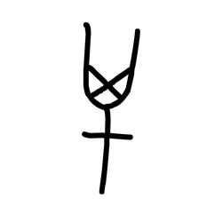

- source_zip_member: `Sub-character Images/67yxx2eqp0/67yxx2eqp0/087rgcptm3.png`
- checksum_sha256: `2f10f0e8b3edd55ac416fee60b5a42a2325e0c44c3689b708c62d9e4575cb60d`
- review_status: `needs_human_visual_review`
- caution: OBIMD subcharacter image is a source-marked review asset only; it is not a confirmed component form, component assignment, or decipherment conclusion.

## asset-019225

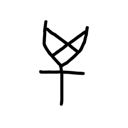

- source_zip_member: `Sub-character Images/67yxx2eqp0/67yxx2eqp0/0gc5v6ctfh.png`
- checksum_sha256: `2365c2cd8f0b2f922e4df0eb73ea3ff0a803aa32624db3995d798f15ae407b9a`
- review_status: `needs_human_visual_review`
- caution: OBIMD subcharacter image is a source-marked review asset only; it is not a confirmed component form, component assignment, or decipherment conclusion.

## asset-019226

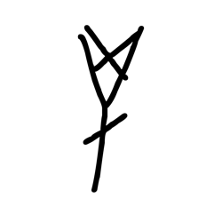

- source_zip_member: `Sub-character Images/67yxx2eqp0/67yxx2eqp0/12nao0ik9a.png`
- checksum_sha256: `09099d65d61ee4f2f9ead2c731ce4db65c34103e6614fc5fcb8822bfa22848d2`
- review_status: `needs_human_visual_review`
- caution: OBIMD subcharacter image is a source-marked review asset only; it is not a confirmed component form, component assignment, or decipherment conclusion.

## asset-019227

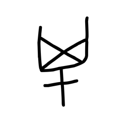

- source_zip_member: `Sub-character Images/67yxx2eqp0/67yxx2eqp0/1cukovn0ux.png`
- checksum_sha256: `b86d1f7700be8b9a6cda093b5f055574acd81ac6e8e6c288b95a760a602fed34`
- review_status: `needs_human_visual_review`
- caution: OBIMD subcharacter image is a source-marked review asset only; it is not a confirmed component form, component assignment, or decipherment conclusion.

## asset-019228

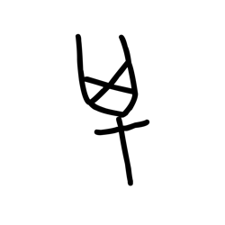

- source_zip_member: `Sub-character Images/67yxx2eqp0/67yxx2eqp0/1egip63vs7.png`
- checksum_sha256: `a078e4774fb97856a14457ab8d05b8313a72f24419e905c0d3ee914b2cd63983`
- review_status: `needs_human_visual_review`
- caution: OBIMD subcharacter image is a source-marked review asset only; it is not a confirmed component form, component assignment, or decipherment conclusion.

## asset-019229

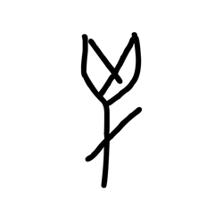

- source_zip_member: `Sub-character Images/67yxx2eqp0/67yxx2eqp0/1gbt7jlwrw.png`
- checksum_sha256: `a4adc619ff3d9d1e6651aa24de2cd9a42b5fcbd4dc8599268078074fc595980b`
- review_status: `needs_human_visual_review`
- caution: OBIMD subcharacter image is a source-marked review asset only; it is not a confirmed component form, component assignment, or decipherment conclusion.

## asset-019230

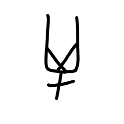

- source_zip_member: `Sub-character Images/67yxx2eqp0/67yxx2eqp0/2od27dxf06.png`
- checksum_sha256: `3bfb5ac6a505410382dd9f95b91f37a368e0988ed012fcec0687979a9492e460`
- review_status: `needs_human_visual_review`
- caution: OBIMD subcharacter image is a source-marked review asset only; it is not a confirmed component form, component assignment, or decipherment conclusion.

## asset-019231

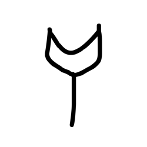

- source_zip_member: `Sub-character Images/67yxx2eqp0/67yxx2eqp0/2pb3z24iba.png`
- checksum_sha256: `85de0512cc15b95639a29aee87f901dcee1a745140eb2a90cb89707884a9c0a9`
- review_status: `needs_human_visual_review`
- caution: OBIMD subcharacter image is a source-marked review asset only; it is not a confirmed component form, component assignment, or decipherment conclusion.

## asset-019232

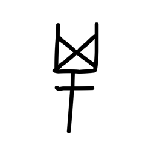

- source_zip_member: `Sub-character Images/67yxx2eqp0/67yxx2eqp0/3bhndgxa1z.png`
- checksum_sha256: `72261a9634890fcc3640b018bb963a09b914a09a0043df0d8a2e23c538ca17d5`
- review_status: `needs_human_visual_review`
- caution: OBIMD subcharacter image is a source-marked review asset only; it is not a confirmed component form, component assignment, or decipherment conclusion.

## asset-019233

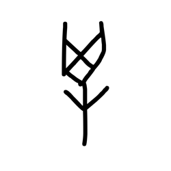

- source_zip_member: `Sub-character Images/67yxx2eqp0/67yxx2eqp0/3n9w6ku0rk.png`
- checksum_sha256: `aa3b23ea23579fea7c2771aa23fb9db10d8ad6c83b51770f8062db12023135db`
- review_status: `needs_human_visual_review`
- caution: OBIMD subcharacter image is a source-marked review asset only; it is not a confirmed component form, component assignment, or decipherment conclusion.

## asset-019234

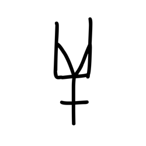

- source_zip_member: `Sub-character Images/67yxx2eqp0/67yxx2eqp0/4mc61uvz1i.png`
- checksum_sha256: `085190e7693d30cabd123b2c559a1f25a897f1c087ef1e7602133d769612e571`
- review_status: `needs_human_visual_review`
- caution: OBIMD subcharacter image is a source-marked review asset only; it is not a confirmed component form, component assignment, or decipherment conclusion.

## asset-019235

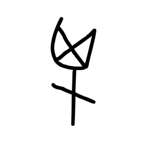

- source_zip_member: `Sub-character Images/67yxx2eqp0/67yxx2eqp0/5m1psaasih.png`
- checksum_sha256: `f26e4ffc1671204d9834b1dc874b15cda3b03ebf159234514e31830bae9d4bed`
- review_status: `needs_human_visual_review`
- caution: OBIMD subcharacter image is a source-marked review asset only; it is not a confirmed component form, component assignment, or decipherment conclusion.

## asset-019236

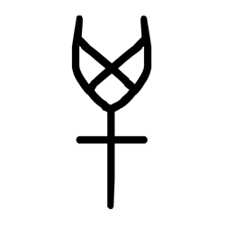

- source_zip_member: `Sub-character Images/67yxx2eqp0/67yxx2eqp0/67yxx2eqp0.png`
- checksum_sha256: `b8943a2e53b7d5e6ee10b36be953b95526843edbc349887c0b2c2a1d3e85854e`
- review_status: `needs_human_visual_review`
- caution: OBIMD subcharacter image is a source-marked review asset only; it is not a confirmed component form, component assignment, or decipherment conclusion.

## asset-019237

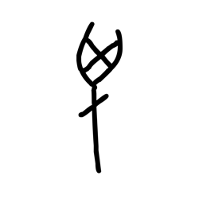

- source_zip_member: `Sub-character Images/67yxx2eqp0/67yxx2eqp0/7uq89burvq.png`
- checksum_sha256: `28daa7b8fd0715986f9f400dbe5d50c73f102e994863ca7512d2fb43932ff862`
- review_status: `needs_human_visual_review`
- caution: OBIMD subcharacter image is a source-marked review asset only; it is not a confirmed component form, component assignment, or decipherment conclusion.

## asset-019238

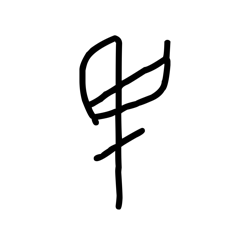

- source_zip_member: `Sub-character Images/67yxx2eqp0/67yxx2eqp0/7xomeplnyb.png`
- checksum_sha256: `943c82d001dd06a56cd4c9fed9b3c530bbe9d47ccfdb8833950e2bf273a18659`
- review_status: `needs_human_visual_review`
- caution: OBIMD subcharacter image is a source-marked review asset only; it is not a confirmed component form, component assignment, or decipherment conclusion.

## asset-019239

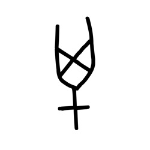

- source_zip_member: `Sub-character Images/67yxx2eqp0/67yxx2eqp0/84mykp2r8x.png`
- checksum_sha256: `b27db7599fad2dff0b3529a64b3b2ede270eb249ac563357b31a9709fcf874f2`
- review_status: `needs_human_visual_review`
- caution: OBIMD subcharacter image is a source-marked review asset only; it is not a confirmed component form, component assignment, or decipherment conclusion.

## asset-019240

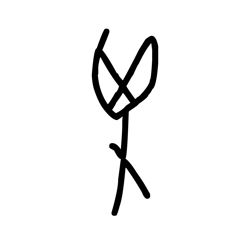

- source_zip_member: `Sub-character Images/67yxx2eqp0/67yxx2eqp0/8n9uq3ebb3.png`
- checksum_sha256: `fcbcd436868165ab2bbb95d86a5de1dcc06162a1f5dbaaaae60900139405e62a`
- review_status: `needs_human_visual_review`
- caution: OBIMD subcharacter image is a source-marked review asset only; it is not a confirmed component form, component assignment, or decipherment conclusion.

## asset-019241

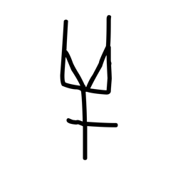

- source_zip_member: `Sub-character Images/67yxx2eqp0/67yxx2eqp0/9k6vtln7fh.png`
- checksum_sha256: `9b02c14bf660ca9fbb90fe3f77ceee11eb03e6ba9d29d1f548f18221ad412e58`
- review_status: `needs_human_visual_review`
- caution: OBIMD subcharacter image is a source-marked review asset only; it is not a confirmed component form, component assignment, or decipherment conclusion.

## asset-019242

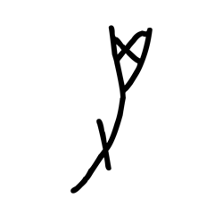

- source_zip_member: `Sub-character Images/67yxx2eqp0/67yxx2eqp0/9pze6x815p.png`
- checksum_sha256: `4da648002c1628e4cca74f2fdeb1d85ec556e89b75b24b7a5395dd3275c2b3bd`
- review_status: `needs_human_visual_review`
- caution: OBIMD subcharacter image is a source-marked review asset only; it is not a confirmed component form, component assignment, or decipherment conclusion.

## asset-019243

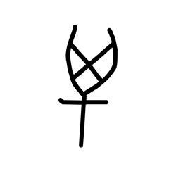

- source_zip_member: `Sub-character Images/67yxx2eqp0/67yxx2eqp0/aipjeocqv3.png`
- checksum_sha256: `49f236c36b1fec95d456bf87b1392ae2f30747a5952f749677092a606c8ad5a3`
- review_status: `needs_human_visual_review`
- caution: OBIMD subcharacter image is a source-marked review asset only; it is not a confirmed component form, component assignment, or decipherment conclusion.

## asset-019244

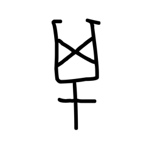

- source_zip_member: `Sub-character Images/67yxx2eqp0/67yxx2eqp0/au99tmfldf.png`
- checksum_sha256: `d9b8cfd121ef561ce7ed3b2702cbd79c54b0e72cf869d4df2c22d67861fa8d46`
- review_status: `needs_human_visual_review`
- caution: OBIMD subcharacter image is a source-marked review asset only; it is not a confirmed component form, component assignment, or decipherment conclusion.

## asset-019245

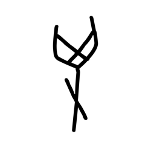

- source_zip_member: `Sub-character Images/67yxx2eqp0/67yxx2eqp0/avenyfxu2o.png`
- checksum_sha256: `a6fd92994ea58822c28ce1cbc7c84f49a146c9129c042eb20e2ff733bcf85401`
- review_status: `needs_human_visual_review`
- caution: OBIMD subcharacter image is a source-marked review asset only; it is not a confirmed component form, component assignment, or decipherment conclusion.

## asset-019246

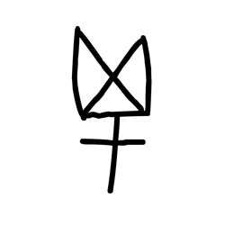

- source_zip_member: `Sub-character Images/67yxx2eqp0/67yxx2eqp0/axlme7awpr.png`
- checksum_sha256: `4ce452e29d8cecba427f0a38c85b4cfa211a0821ba54b02723c2865de725f70f`
- review_status: `needs_human_visual_review`
- caution: OBIMD subcharacter image is a source-marked review asset only; it is not a confirmed component form, component assignment, or decipherment conclusion.

## asset-019247

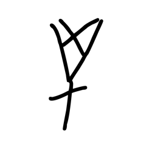

- source_zip_member: `Sub-character Images/67yxx2eqp0/67yxx2eqp0/cvvc5x001c.png`
- checksum_sha256: `2d585af886fd9597c59cabcc3e24d3649d4f0858847f1d2c24f9c5080655192e`
- review_status: `needs_human_visual_review`
- caution: OBIMD subcharacter image is a source-marked review asset only; it is not a confirmed component form, component assignment, or decipherment conclusion.

## asset-019248

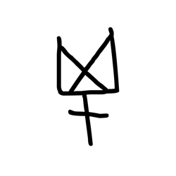

- source_zip_member: `Sub-character Images/67yxx2eqp0/67yxx2eqp0/d04vj7evea.png`
- checksum_sha256: `d1f0492070a25120e5c8c76fe667bf14d905efe82161bb8faf4e4453279111fe`
- review_status: `needs_human_visual_review`
- caution: OBIMD subcharacter image is a source-marked review asset only; it is not a confirmed component form, component assignment, or decipherment conclusion.

## asset-019249

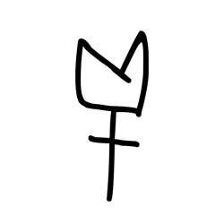

- source_zip_member: `Sub-character Images/67yxx2eqp0/67yxx2eqp0/d72huokowb.png`
- checksum_sha256: `57733cd192ac8d49a487850b9b907c275a661eb1f127da22a2bd2d7f20958710`
- review_status: `needs_human_visual_review`
- caution: OBIMD subcharacter image is a source-marked review asset only; it is not a confirmed component form, component assignment, or decipherment conclusion.

## asset-019250

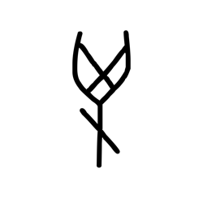

- source_zip_member: `Sub-character Images/67yxx2eqp0/67yxx2eqp0/dw4s0zdy5j.png`
- checksum_sha256: `b53dd4f13bdf1d0d59dcf989a992f87aae53e073a1582d467dc6c9aba08039cc`
- review_status: `needs_human_visual_review`
- caution: OBIMD subcharacter image is a source-marked review asset only; it is not a confirmed component form, component assignment, or decipherment conclusion.

## asset-019251

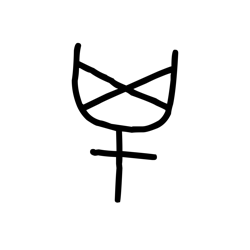

- source_zip_member: `Sub-character Images/67yxx2eqp0/67yxx2eqp0/ed5t8jv6uh.png`
- checksum_sha256: `2bfe90fb0755d50ec9df1afab57f37a14305898ca07b5c502d34821f50f34c1e`
- review_status: `needs_human_visual_review`
- caution: OBIMD subcharacter image is a source-marked review asset only; it is not a confirmed component form, component assignment, or decipherment conclusion.

## asset-019252

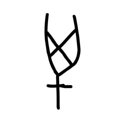

- source_zip_member: `Sub-character Images/67yxx2eqp0/67yxx2eqp0/f3ewyj0d5p.png`
- checksum_sha256: `4c2fd0df761975b948079f25707b45ac1b6e8a932c2ecafeb225f1c4c351adef`
- review_status: `needs_human_visual_review`
- caution: OBIMD subcharacter image is a source-marked review asset only; it is not a confirmed component form, component assignment, or decipherment conclusion.

## asset-019253

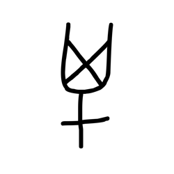

- source_zip_member: `Sub-character Images/67yxx2eqp0/67yxx2eqp0/fgashfbqqk.png`
- checksum_sha256: `46ef371188c13b95b483ef5d3b10f23cce6345cb019419aabb88797eef455443`
- review_status: `needs_human_visual_review`
- caution: OBIMD subcharacter image is a source-marked review asset only; it is not a confirmed component form, component assignment, or decipherment conclusion.

## asset-019254

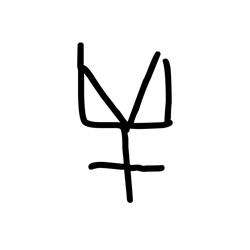

- source_zip_member: `Sub-character Images/67yxx2eqp0/67yxx2eqp0/h2j9spgwjt.png`
- checksum_sha256: `5ebd853e9f08243bf75b3be19e27bc3552b561c640cb4a87b1b14823bde65545`
- review_status: `needs_human_visual_review`
- caution: OBIMD subcharacter image is a source-marked review asset only; it is not a confirmed component form, component assignment, or decipherment conclusion.

## asset-019255

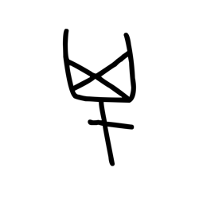

- source_zip_member: `Sub-character Images/67yxx2eqp0/67yxx2eqp0/hjssng06c2.png`
- checksum_sha256: `7258cc2dc38d4370487cdd6bc4e2c73707db5f0784118dfaf59457f67637741d`
- review_status: `needs_human_visual_review`
- caution: OBIMD subcharacter image is a source-marked review asset only; it is not a confirmed component form, component assignment, or decipherment conclusion.

## asset-019256

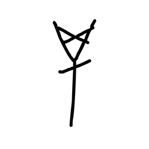

- source_zip_member: `Sub-character Images/67yxx2eqp0/67yxx2eqp0/ht5hxbfme5.png`
- checksum_sha256: `119ba6ca9fb236f3e845c300decaec6ab41afda9aa796dd4fdc0d4c162224806`
- review_status: `needs_human_visual_review`
- caution: OBIMD subcharacter image is a source-marked review asset only; it is not a confirmed component form, component assignment, or decipherment conclusion.

## asset-019257

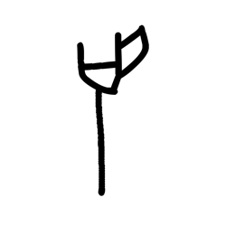

- source_zip_member: `Sub-character Images/67yxx2eqp0/67yxx2eqp0/kn8dpveu9d.png`
- checksum_sha256: `29ed8082efbdc4e87e3b76b4b535f19f7b64fd9b2f65aa61b929fd6f037d31ec`
- review_status: `needs_human_visual_review`
- caution: OBIMD subcharacter image is a source-marked review asset only; it is not a confirmed component form, component assignment, or decipherment conclusion.

## asset-019258

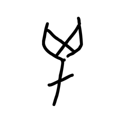

- source_zip_member: `Sub-character Images/67yxx2eqp0/67yxx2eqp0/kovxt8tobj.png`
- checksum_sha256: `940d6c8973a0a14fedac03983106403df0c97c9c1dc34b39019d20023734baee`
- review_status: `needs_human_visual_review`
- caution: OBIMD subcharacter image is a source-marked review asset only; it is not a confirmed component form, component assignment, or decipherment conclusion.

## asset-019259

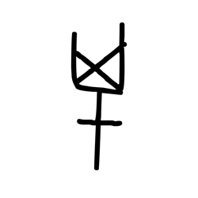

- source_zip_member: `Sub-character Images/67yxx2eqp0/67yxx2eqp0/l45dzjccng.png`
- checksum_sha256: `29d0eb2d210cc0443f7b5da1c61e7f5a10030eb4c26b1ca9ce4762e45f8c4e9f`
- review_status: `needs_human_visual_review`
- caution: OBIMD subcharacter image is a source-marked review asset only; it is not a confirmed component form, component assignment, or decipherment conclusion.

## asset-019260

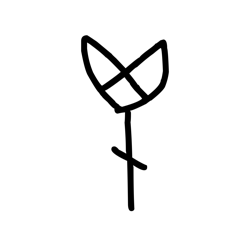

- source_zip_member: `Sub-character Images/67yxx2eqp0/67yxx2eqp0/lc8ccpdjdb.png`
- checksum_sha256: `2f570b6ccd63022734cfd67d6a10875e3f2b3d032601dd8307806683c74eab6d`
- review_status: `needs_human_visual_review`
- caution: OBIMD subcharacter image is a source-marked review asset only; it is not a confirmed component form, component assignment, or decipherment conclusion.

## asset-019261

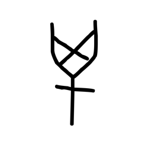

- source_zip_member: `Sub-character Images/67yxx2eqp0/67yxx2eqp0/mvc25e8zzj.png`
- checksum_sha256: `24a57a6dd1b7cced20547622cd28381aad09e356915caf410f6cb3fd1a47906d`
- review_status: `needs_human_visual_review`
- caution: OBIMD subcharacter image is a source-marked review asset only; it is not a confirmed component form, component assignment, or decipherment conclusion.

## asset-019262

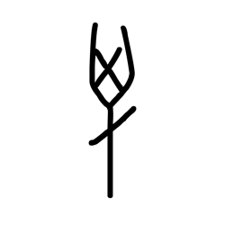

- source_zip_member: `Sub-character Images/67yxx2eqp0/67yxx2eqp0/n2fyn5kox3.png`
- checksum_sha256: `7b11a0f6c1939d17ab6df9e3a0036ef0e715a20e46e1ae9a9fa42c0eadeab057`
- review_status: `needs_human_visual_review`
- caution: OBIMD subcharacter image is a source-marked review asset only; it is not a confirmed component form, component assignment, or decipherment conclusion.

## asset-019263

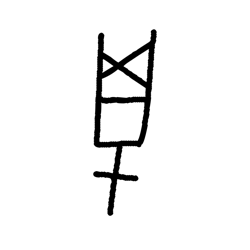

- source_zip_member: `Sub-character Images/67yxx2eqp0/67yxx2eqp0/nmhfwq0ylc.png`
- checksum_sha256: `ab6d837b02b87ade7f51b78a08860dfd734c1608488a796570ab796adcd86d45`
- review_status: `needs_human_visual_review`
- caution: OBIMD subcharacter image is a source-marked review asset only; it is not a confirmed component form, component assignment, or decipherment conclusion.

## asset-019264

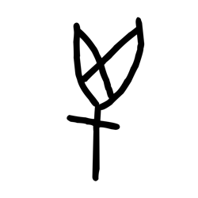

- source_zip_member: `Sub-character Images/67yxx2eqp0/67yxx2eqp0/nyf3hlsgzq.png`
- checksum_sha256: `5cbd90dc72778c700d2891ea828fd41eb72f4346be1826f296c9007eae0f906f`
- review_status: `needs_human_visual_review`
- caution: OBIMD subcharacter image is a source-marked review asset only; it is not a confirmed component form, component assignment, or decipherment conclusion.

## asset-019265

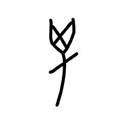

- source_zip_member: `Sub-character Images/67yxx2eqp0/67yxx2eqp0/o8xw86hpm2.png`
- checksum_sha256: `ae8631ed3e96ac039f9ab1050383447d40609a970f7910dbfe8e8961a586f4fe`
- review_status: `needs_human_visual_review`
- caution: OBIMD subcharacter image is a source-marked review asset only; it is not a confirmed component form, component assignment, or decipherment conclusion.

## asset-019266

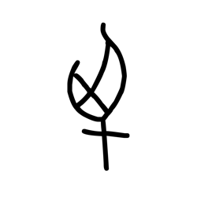

- source_zip_member: `Sub-character Images/67yxx2eqp0/67yxx2eqp0/oir5inaau4.png`
- checksum_sha256: `d6f69a584115aab523a057bb76bdc071ce20c7281a30c6b3abd08bc02cac6687`
- review_status: `needs_human_visual_review`
- caution: OBIMD subcharacter image is a source-marked review asset only; it is not a confirmed component form, component assignment, or decipherment conclusion.

## asset-019267

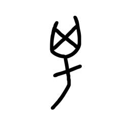

- source_zip_member: `Sub-character Images/67yxx2eqp0/67yxx2eqp0/oys69lzb3y.png`
- checksum_sha256: `a6f0a62afc468cc41956e3791b29bfccb1c2081c42ae65df71a07a5d389dcafd`
- review_status: `needs_human_visual_review`
- caution: OBIMD subcharacter image is a source-marked review asset only; it is not a confirmed component form, component assignment, or decipherment conclusion.

## asset-019268

- source_zip_member: `Sub-character Images/67yxx2eqp0/67yxx2eqp0/p2cbwyyrao.png`
- checksum_sha256: `c95d6ecb9ade12a3c51f433913bda59130d54961ab838d7ff734b2abed85fc2c`
- review_status: `needs_human_visual_review`
- caution: OBIMD subcharacter image is a source-marked review asset only; it is not a confirmed component form, component assignment, or decipherment conclusion.

## asset-019269

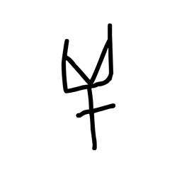

- source_zip_member: `Sub-character Images/67yxx2eqp0/67yxx2eqp0/p4r33mkgt5.png`
- checksum_sha256: `1f619b94b7c8240ab3f24ba1254d57840bf1386213ee4b04a1659ed43c5aad5e`
- review_status: `needs_human_visual_review`
- caution: OBIMD subcharacter image is a source-marked review asset only; it is not a confirmed component form, component assignment, or decipherment conclusion.

## asset-019270

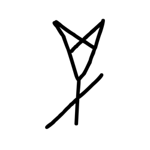

- source_zip_member: `Sub-character Images/67yxx2eqp0/67yxx2eqp0/przckbd3xr.png`
- checksum_sha256: `9ed73672d2c52f97e28d92d16547c9d35781112d7a76e4208a325e1e8ed73335`
- review_status: `needs_human_visual_review`
- caution: OBIMD subcharacter image is a source-marked review asset only; it is not a confirmed component form, component assignment, or decipherment conclusion.

## asset-019271

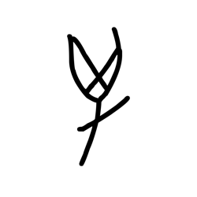

- source_zip_member: `Sub-character Images/67yxx2eqp0/67yxx2eqp0/pxmop1v2ky.png`
- checksum_sha256: `41ae78d42ac511bcffd021476957734307f7e96abfee0deb20381487e9545a15`
- review_status: `needs_human_visual_review`
- caution: OBIMD subcharacter image is a source-marked review asset only; it is not a confirmed component form, component assignment, or decipherment conclusion.

## asset-019272

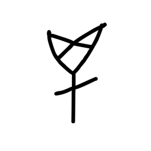

- source_zip_member: `Sub-character Images/67yxx2eqp0/67yxx2eqp0/sait6v450s.png`
- checksum_sha256: `1ef012a4befb84dd1c93adb6460b9f02570504cdd1674f0bc7e3bac0c4311bbf`
- review_status: `needs_human_visual_review`
- caution: OBIMD subcharacter image is a source-marked review asset only; it is not a confirmed component form, component assignment, or decipherment conclusion.

## asset-019273

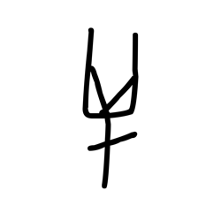

- source_zip_member: `Sub-character Images/67yxx2eqp0/67yxx2eqp0/t6nxw449ss.png`
- checksum_sha256: `056c9b6e66f15e49f0ab0e8e998045a5ac5cc4a98ab8c0e73134ed908b737cf0`
- review_status: `needs_human_visual_review`
- caution: OBIMD subcharacter image is a source-marked review asset only; it is not a confirmed component form, component assignment, or decipherment conclusion.

## asset-019274

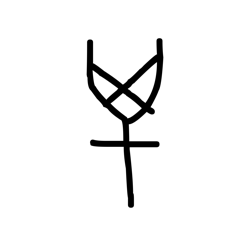

- source_zip_member: `Sub-character Images/67yxx2eqp0/67yxx2eqp0/tgma3jflnl.png`
- checksum_sha256: `fa54aaf21ed536e689969eb67067bfcbf0e12d956351b4134d724448a9916620`
- review_status: `needs_human_visual_review`
- caution: OBIMD subcharacter image is a source-marked review asset only; it is not a confirmed component form, component assignment, or decipherment conclusion.

## asset-019275

- source_zip_member: `Sub-character Images/67yxx2eqp0/67yxx2eqp0/tsyos9qavb.png`
- checksum_sha256: `39cf0441ac25188753547ec85553c8396ba71cb6e0d7bea4c7ae44af7d6e3552`
- review_status: `needs_human_visual_review`
- caution: OBIMD subcharacter image is a source-marked review asset only; it is not a confirmed component form, component assignment, or decipherment conclusion.

## asset-019276

- source_zip_member: `Sub-character Images/67yxx2eqp0/67yxx2eqp0/vw0paib6ua.png`
- checksum_sha256: `f4fac0d938293a73c25e34a733f3ecf47ead410d5840d1c97e6637f765d900f7`
- review_status: `needs_human_visual_review`
- caution: OBIMD subcharacter image is a source-marked review asset only; it is not a confirmed component form, component assignment, or decipherment conclusion.

## asset-019277

- source_zip_member: `Sub-character Images/67yxx2eqp0/67yxx2eqp0/wcyybe27a4.png`
- checksum_sha256: `61229d44eb8a6ab8853e14693553b89cc41a1e576a8f8372d82d696bc68c4ba5`
- review_status: `needs_human_visual_review`
- caution: OBIMD subcharacter image is a source-marked review asset only; it is not a confirmed component form, component assignment, or decipherment conclusion.

## asset-019278

- source_zip_member: `Sub-character Images/67yxx2eqp0/67yxx2eqp0/wzfhz3l4x3.png`
- checksum_sha256: `b9ecf8e003c56fa1c683e529637f6ae6a35c68a59cf1083dbb9978504ef179ae`
- review_status: `needs_human_visual_review`
- caution: OBIMD subcharacter image is a source-marked review asset only; it is not a confirmed component form, component assignment, or decipherment conclusion.

## asset-019279

- source_zip_member: `Sub-character Images/67yxx2eqp0/67yxx2eqp0/x4qws2203e.png`
- checksum_sha256: `9ddc935223f7ba106191b55d86ebdf922f2736538e534c54722006044705e723`
- review_status: `needs_human_visual_review`
- caution: OBIMD subcharacter image is a source-marked review asset only; it is not a confirmed component form, component assignment, or decipherment conclusion.

## asset-019280

- source_zip_member: `Sub-character Images/67yxx2eqp0/67yxx2eqp0/x6b7mieubm.png`
- checksum_sha256: `4d772805f2f2a8f5b98b6cc55a683eec1450ea5228d741318fb16b7bcf95c51b`
- review_status: `needs_human_visual_review`
- caution: OBIMD subcharacter image is a source-marked review asset only; it is not a confirmed component form, component assignment, or decipherment conclusion.

## asset-019281

- source_zip_member: `Sub-character Images/67yxx2eqp0/67yxx2eqp0/y0w05f4zec.png`
- checksum_sha256: `d5c196ecd8c0796700dabb26eb3088e57b6da4096236d2bf23fd2c5e9ea94770`
- review_status: `needs_human_visual_review`
- caution: OBIMD subcharacter image is a source-marked review asset only; it is not a confirmed component form, component assignment, or decipherment conclusion.

## asset-019282

- source_zip_member: `Sub-character Images/67yxx2eqp0/67yxx2eqp0/yjlricii4x.png`
- checksum_sha256: `505e301c3dba80a4e20d04926872875f59c339ab8a60baf8dcaec76a4b64a0e5`
- review_status: `needs_human_visual_review`
- caution: OBIMD subcharacter image is a source-marked review asset only; it is not a confirmed component form, component assignment, or decipherment conclusion.

## asset-019283

- source_zip_member: `Sub-character Images/67yxx2eqp0/67yxx2eqp0/yynfh62i8w.png`
- checksum_sha256: `4b1f2e5a8e9dafda2516c4deb75a42899531a1960381fb250c90ee42fd181662`
- review_status: `needs_human_visual_review`
- caution: OBIMD subcharacter image is a source-marked review asset only; it is not a confirmed component form, component assignment, or decipherment conclusion.

## asset-019284

- source_zip_member: `Sub-character Images/67yxx2eqp0/67yxx2eqp0/zsxwyqkak5.png`
- checksum_sha256: `bd85493e13109d146e4b574abff78c8aa0e28a4f313cd874b879fd9b577b6ebd`
- review_status: `needs_human_visual_review`
- caution: OBIMD subcharacter image is a source-marked review asset only; it is not a confirmed component form, component assignment, or decipherment conclusion.
