# Component Visual Gallery / 构件图像查看: obs-comp-cand-002009

English:
This page displays OBIMD subcharacter PNG assets extracted into this concrete
corpus object directory for human review.

简体中文：
本页展示抽取到当前具体 corpus 对象目录内的 OBIMD subcharacter PNG 资料，供人工复核使用。

Boundary / 边界：
dataset image candidate only; not a confirmed component form, not a component
assignment, and not a decipherment claim.
- not a confirmed component form
- not a component assignment
- not a decipherment claim

## Concrete Questions To Check / 具体待查问题

- Open 06_component-visual-index.csv and name the local image row.
- 打开 06_component-visual-index.csv，写明本地图像行。
- Open 09_component-visual-route-index.csv and name the source route row.
- 打开 09_component-visual-route-index.csv，写明来源路线行。
- Open 13_component-context-evidence-dossier.md for character context.
- 打开 13_component-context-evidence-dossier.md，核对单字与卜辞上下文。
- Record the missing image, near-shape, source, or context route.
- 记录缺失的图像、近形、来源或上下文路线。

## asset-019289

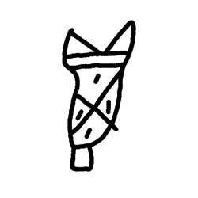

- source_zip_member: `Sub-character Images/l4lq5esn5g/ih9q27svl3/0yvhhhjjzb.png`
- checksum_sha256: see `06_component-visual-index.csv`.
- review_status: `needs_human_visual_review`
- caution: source-marked review image only.

## asset-019290

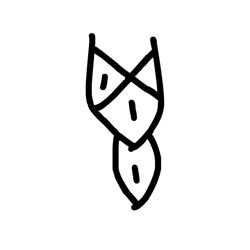

- source_zip_member: `Sub-character Images/l4lq5esn5g/ih9q27svl3/1sabspqhmt.png`
- checksum_sha256: see `06_component-visual-index.csv`.
- review_status: `needs_human_visual_review`
- caution: source-marked review image only.

## asset-019291

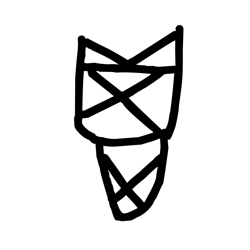

- source_zip_member: `Sub-character Images/l4lq5esn5g/ih9q27svl3/240szzkvex.png`
- checksum_sha256: see `06_component-visual-index.csv`.
- review_status: `needs_human_visual_review`
- caution: source-marked review image only.

## asset-019292

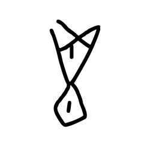

- source_zip_member: `Sub-character Images/l4lq5esn5g/ih9q27svl3/2z0tgp8w30.png`
- checksum_sha256: see `06_component-visual-index.csv`.
- review_status: `needs_human_visual_review`
- caution: source-marked review image only.

## asset-019293

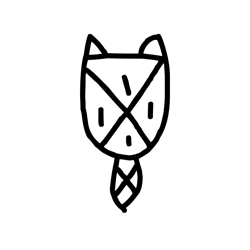

- source_zip_member: `Sub-character Images/l4lq5esn5g/ih9q27svl3/35jci4qnca.png`
- checksum_sha256: see `06_component-visual-index.csv`.
- review_status: `needs_human_visual_review`
- caution: source-marked review image only.

## asset-019294

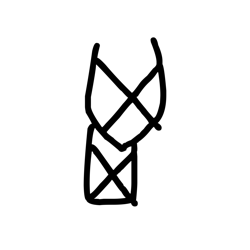

- source_zip_member: `Sub-character Images/l4lq5esn5g/ih9q27svl3/5xi2q6hfrk.png`
- checksum_sha256: see `06_component-visual-index.csv`.
- review_status: `needs_human_visual_review`
- caution: source-marked review image only.

## asset-019295

- source_zip_member: `Sub-character Images/l4lq5esn5g/ih9q27svl3/6agx6rm33a.png`
- checksum_sha256: see `06_component-visual-index.csv`.
- review_status: `needs_human_visual_review`
- caution: source-marked review image only.

## asset-019296

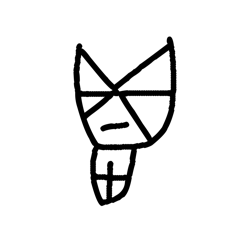

- source_zip_member: `Sub-character Images/l4lq5esn5g/ih9q27svl3/6imhtdijo3.png`
- checksum_sha256: see `06_component-visual-index.csv`.
- review_status: `needs_human_visual_review`
- caution: source-marked review image only.

## asset-019297

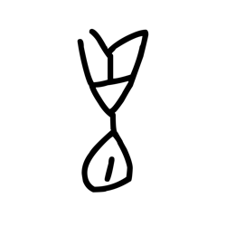

- source_zip_member: `Sub-character Images/l4lq5esn5g/ih9q27svl3/7o80zxpbal.png`
- checksum_sha256: see `06_component-visual-index.csv`.
- review_status: `needs_human_visual_review`
- caution: source-marked review image only.

## asset-019298

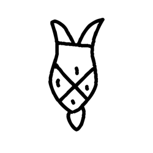

- source_zip_member: `Sub-character Images/l4lq5esn5g/ih9q27svl3/8ezo1uk0nu.png`
- checksum_sha256: see `06_component-visual-index.csv`.
- review_status: `needs_human_visual_review`
- caution: source-marked review image only.

## asset-019299

- source_zip_member: `Sub-character Images/l4lq5esn5g/ih9q27svl3/a0w7ec73og.png`
- checksum_sha256: see `06_component-visual-index.csv`.
- review_status: `needs_human_visual_review`
- caution: source-marked review image only.

## asset-019300

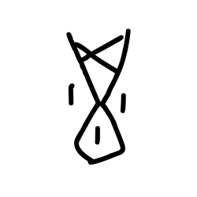

- source_zip_member: `Sub-character Images/l4lq5esn5g/ih9q27svl3/abqb28buu1.png`
- checksum_sha256: see `06_component-visual-index.csv`.
- review_status: `needs_human_visual_review`
- caution: source-marked review image only.

## asset-019301

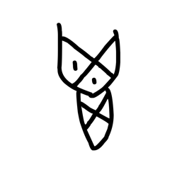

- source_zip_member: `Sub-character Images/l4lq5esn5g/ih9q27svl3/aksdlz44vx.png`
- checksum_sha256: see `06_component-visual-index.csv`.
- review_status: `needs_human_visual_review`
- caution: source-marked review image only.

## asset-019302

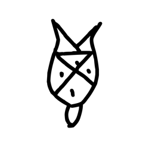

- source_zip_member: `Sub-character Images/l4lq5esn5g/ih9q27svl3/aois81it6x.png`
- checksum_sha256: see `06_component-visual-index.csv`.
- review_status: `needs_human_visual_review`
- caution: source-marked review image only.

## asset-019303

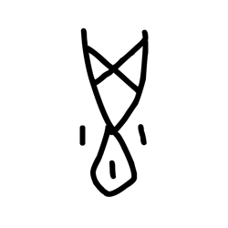

- source_zip_member: `Sub-character Images/l4lq5esn5g/ih9q27svl3/apcylmy9xr.png`
- checksum_sha256: see `06_component-visual-index.csv`.
- review_status: `needs_human_visual_review`
- caution: source-marked review image only.

## asset-019304

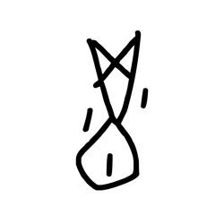

- source_zip_member: `Sub-character Images/l4lq5esn5g/ih9q27svl3/aygrg6yr2z.png`
- checksum_sha256: see `06_component-visual-index.csv`.
- review_status: `needs_human_visual_review`
- caution: source-marked review image only.

## asset-019305

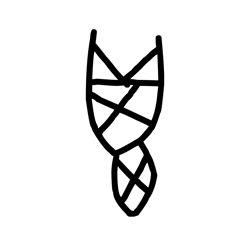

- source_zip_member: `Sub-character Images/l4lq5esn5g/ih9q27svl3/b11xdibu7y.png`
- checksum_sha256: see `06_component-visual-index.csv`.
- review_status: `needs_human_visual_review`
- caution: source-marked review image only.

## asset-019306

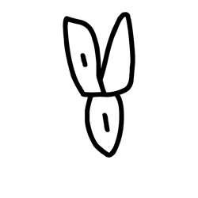

- source_zip_member: `Sub-character Images/l4lq5esn5g/ih9q27svl3/bfaefqlxqh.png`
- checksum_sha256: see `06_component-visual-index.csv`.
- review_status: `needs_human_visual_review`
- caution: source-marked review image only.

## asset-019307

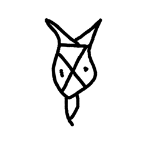

- source_zip_member: `Sub-character Images/l4lq5esn5g/ih9q27svl3/bk66ju89kg.png`
- checksum_sha256: see `06_component-visual-index.csv`.
- review_status: `needs_human_visual_review`
- caution: source-marked review image only.

## asset-019308

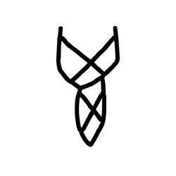

- source_zip_member: `Sub-character Images/l4lq5esn5g/ih9q27svl3/dep5a0xkh9.png`
- checksum_sha256: see `06_component-visual-index.csv`.
- review_status: `needs_human_visual_review`
- caution: source-marked review image only.

## asset-019309

- source_zip_member: `Sub-character Images/l4lq5esn5g/ih9q27svl3/h8k58o9fbc.png`
- checksum_sha256: see `06_component-visual-index.csv`.
- review_status: `needs_human_visual_review`
- caution: source-marked review image only.

## asset-019310

- source_zip_member: `Sub-character Images/l4lq5esn5g/ih9q27svl3/ih9q27svl3.png`
- checksum_sha256: see `06_component-visual-index.csv`.
- review_status: `needs_human_visual_review`
- caution: source-marked review image only.

## asset-019311

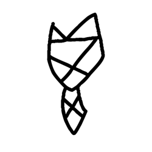

- source_zip_member: `Sub-character Images/l4lq5esn5g/ih9q27svl3/imsg7t8b9w.png`
- checksum_sha256: see `06_component-visual-index.csv`.
- review_status: `needs_human_visual_review`
- caution: source-marked review image only.

## asset-019312

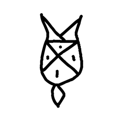

- source_zip_member: `Sub-character Images/l4lq5esn5g/ih9q27svl3/j4a528bsn8.png`
- checksum_sha256: see `06_component-visual-index.csv`.
- review_status: `needs_human_visual_review`
- caution: source-marked review image only.

## asset-019313

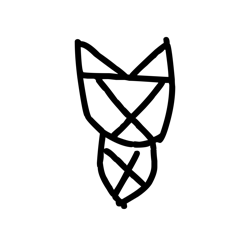

- source_zip_member: `Sub-character Images/l4lq5esn5g/ih9q27svl3/js4ci5nmd5.png`
- checksum_sha256: see `06_component-visual-index.csv`.
- review_status: `needs_human_visual_review`
- caution: source-marked review image only.

## asset-019314

- source_zip_member: `Sub-character Images/l4lq5esn5g/ih9q27svl3/ku2x6iz0by.png`
- checksum_sha256: see `06_component-visual-index.csv`.
- review_status: `needs_human_visual_review`
- caution: source-marked review image only.

## asset-019315

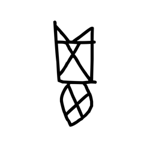

- source_zip_member: `Sub-character Images/l4lq5esn5g/ih9q27svl3/luxzdlb48k.png`
- checksum_sha256: see `06_component-visual-index.csv`.
- review_status: `needs_human_visual_review`
- caution: source-marked review image only.

## asset-019316

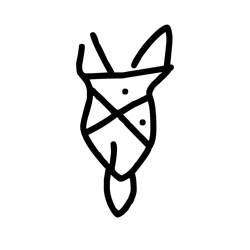

- source_zip_member: `Sub-character Images/l4lq5esn5g/ih9q27svl3/m6d42cwmuk.png`
- checksum_sha256: see `06_component-visual-index.csv`.
- review_status: `needs_human_visual_review`
- caution: source-marked review image only.

## asset-019317

- source_zip_member: `Sub-character Images/l4lq5esn5g/ih9q27svl3/ms6acpbm3x.png`
- checksum_sha256: see `06_component-visual-index.csv`.
- review_status: `needs_human_visual_review`
- caution: source-marked review image only.

## asset-019318

- source_zip_member: `Sub-character Images/l4lq5esn5g/ih9q27svl3/msailvkfpq.png`
- checksum_sha256: see `06_component-visual-index.csv`.
- review_status: `needs_human_visual_review`
- caution: source-marked review image only.

## asset-019319

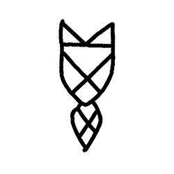

- source_zip_member: `Sub-character Images/l4lq5esn5g/ih9q27svl3/n1dgbnc2m9.png`
- checksum_sha256: see `06_component-visual-index.csv`.
- review_status: `needs_human_visual_review`
- caution: source-marked review image only.

## asset-019320

- source_zip_member: `Sub-character Images/l4lq5esn5g/ih9q27svl3/p0cuy5990a.png`
- checksum_sha256: see `06_component-visual-index.csv`.
- review_status: `needs_human_visual_review`
- caution: source-marked review image only.

## asset-019321

- source_zip_member: `Sub-character Images/l4lq5esn5g/ih9q27svl3/p0hkoxqzm4.png`
- checksum_sha256: see `06_component-visual-index.csv`.
- review_status: `needs_human_visual_review`
- caution: source-marked review image only.

## asset-019322

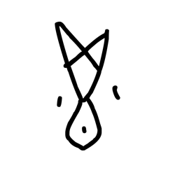

- source_zip_member: `Sub-character Images/l4lq5esn5g/ih9q27svl3/p5hfq9nr3h.png`
- checksum_sha256: see `06_component-visual-index.csv`.
- review_status: `needs_human_visual_review`
- caution: source-marked review image only.

## asset-019323

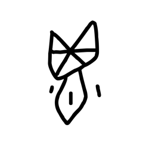

- source_zip_member: `Sub-character Images/l4lq5esn5g/ih9q27svl3/q1vx3xlefy.png`
- checksum_sha256: see `06_component-visual-index.csv`.
- review_status: `needs_human_visual_review`
- caution: source-marked review image only.

## asset-019324

- source_zip_member: `Sub-character Images/l4lq5esn5g/ih9q27svl3/q9g13yr5cc.png`
- checksum_sha256: see `06_component-visual-index.csv`.
- review_status: `needs_human_visual_review`
- caution: source-marked review image only.

## asset-019325

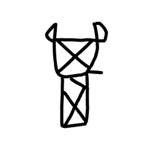

- source_zip_member: `Sub-character Images/l4lq5esn5g/ih9q27svl3/r7jxoxe7lf.png`
- checksum_sha256: see `06_component-visual-index.csv`.
- review_status: `needs_human_visual_review`
- caution: source-marked review image only.

## asset-019326

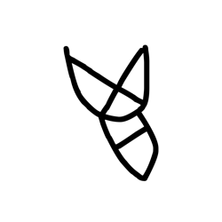

- source_zip_member: `Sub-character Images/l4lq5esn5g/ih9q27svl3/ru3psg3ll1.png`
- checksum_sha256: see `06_component-visual-index.csv`.
- review_status: `needs_human_visual_review`
- caution: source-marked review image only.

## asset-019327

- source_zip_member: `Sub-character Images/l4lq5esn5g/ih9q27svl3/s8sv8ufq9d.png`
- checksum_sha256: see `06_component-visual-index.csv`.
- review_status: `needs_human_visual_review`
- caution: source-marked review image only.

## asset-019328

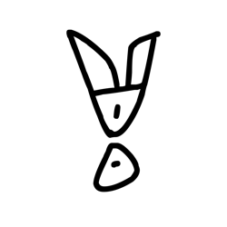

- source_zip_member: `Sub-character Images/l4lq5esn5g/ih9q27svl3/t6tg6pmoj5.png`
- checksum_sha256: see `06_component-visual-index.csv`.
- review_status: `needs_human_visual_review`
- caution: source-marked review image only.

## asset-019329

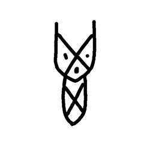

- source_zip_member: `Sub-character Images/l4lq5esn5g/ih9q27svl3/telhugam06.png`
- checksum_sha256: see `06_component-visual-index.csv`.
- review_status: `needs_human_visual_review`
- caution: source-marked review image only.

## asset-019330

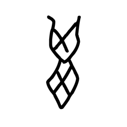

- source_zip_member: `Sub-character Images/l4lq5esn5g/ih9q27svl3/uthivq286n.png`
- checksum_sha256: see `06_component-visual-index.csv`.
- review_status: `needs_human_visual_review`
- caution: source-marked review image only.

## asset-019331

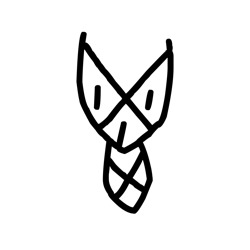

- source_zip_member: `Sub-character Images/l4lq5esn5g/ih9q27svl3/vau08wqvva.png`
- checksum_sha256: see `06_component-visual-index.csv`.
- review_status: `needs_human_visual_review`
- caution: source-marked review image only.

## asset-019332

- source_zip_member: `Sub-character Images/l4lq5esn5g/ih9q27svl3/ve7s2dk6em.png`
- checksum_sha256: see `06_component-visual-index.csv`.
- review_status: `needs_human_visual_review`
- caution: source-marked review image only.

## asset-019333

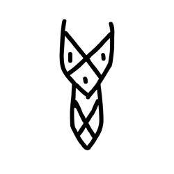

- source_zip_member: `Sub-character Images/l4lq5esn5g/ih9q27svl3/vvfsw0myt2.png`
- checksum_sha256: see `06_component-visual-index.csv`.
- review_status: `needs_human_visual_review`
- caution: source-marked review image only.

## asset-019334

- source_zip_member: `Sub-character Images/l4lq5esn5g/ih9q27svl3/xle0o4fqup.png`
- checksum_sha256: see `06_component-visual-index.csv`.
- review_status: `needs_human_visual_review`
- caution: source-marked review image only.

## asset-019335

- source_zip_member: `Sub-character Images/l4lq5esn5g/ih9q27svl3/xltm5sfblt.png`
- checksum_sha256: see `06_component-visual-index.csv`.
- review_status: `needs_human_visual_review`
- caution: source-marked review image only.

## asset-019336

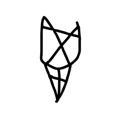

- source_zip_member: `Sub-character Images/l4lq5esn5g/ih9q27svl3/ykupuizt1m.png`
- checksum_sha256: see `06_component-visual-index.csv`.
- review_status: `needs_human_visual_review`
- caution: source-marked review image only.
