# Component Visual Gallery / 构件图像查看: obs-comp-cand-002045

English:
This page displays OBIMD subcharacter PNG assets extracted into this concrete
corpus object directory for human review.

简体中文：
本页展示抽取到当前具体 corpus 对象目录内的 OBIMD subcharacter PNG 资料，供人工复核使用。

Boundary / 边界：
dataset image candidate only; not a confirmed component form, not a component
assignment, and not a decipherment claim.
- not a confirmed component form
- not a component assignment
- not a decipherment claim

## Concrete Questions To Check / 具体待查问题

- Which local image should be opened first?
- 应先打开哪一张本地构件图像？
- Which source zip member anchors this image?
- 哪一个 source zip member 能定位这张图像？
- Which near-shape or variant comparison is still missing?
- 还缺哪些近形或异体比较？
- Which character or inscription context should be checked next?
- 下一步应核对哪些单字或卜辞上下文？
- What evidence is missing before a component assignment?
- 正式构件归属前还缺哪些证据？

## asset-019372

- source_zip_member: `Sub-character Images/sj4e2q73so/cwpk7ek70h/0mmlmof5px.png`
- checksum_sha256: see `06_component-visual-index.csv`.
- review_status: `needs_human_visual_review`
- caution: source-marked review image only.

## asset-019373

- source_zip_member: `Sub-character Images/sj4e2q73so/cwpk7ek70h/3a85sdupdm.png`
- checksum_sha256: see `06_component-visual-index.csv`.
- review_status: `needs_human_visual_review`
- caution: source-marked review image only.

## asset-019374

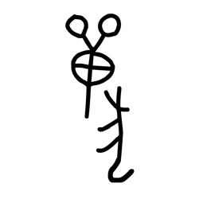

- source_zip_member: `Sub-character Images/sj4e2q73so/cwpk7ek70h/3mfo65893p.png`
- checksum_sha256: see `06_component-visual-index.csv`.
- review_status: `needs_human_visual_review`
- caution: source-marked review image only.

## asset-019375

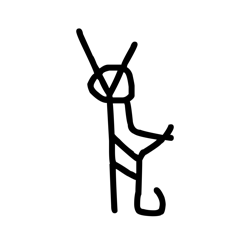

- source_zip_member: `Sub-character Images/sj4e2q73so/cwpk7ek70h/52xbp1m834.png`
- checksum_sha256: see `06_component-visual-index.csv`.
- review_status: `needs_human_visual_review`
- caution: source-marked review image only.

## asset-019376

- source_zip_member: `Sub-character Images/sj4e2q73so/cwpk7ek70h/6awjbx9e1o.png`
- checksum_sha256: see `06_component-visual-index.csv`.
- review_status: `needs_human_visual_review`
- caution: source-marked review image only.

## asset-019377

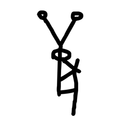

- source_zip_member: `Sub-character Images/sj4e2q73so/cwpk7ek70h/76qfq53wjv.png`
- checksum_sha256: see `06_component-visual-index.csv`.
- review_status: `needs_human_visual_review`
- caution: source-marked review image only.

## asset-019378

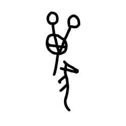

- source_zip_member: `Sub-character Images/sj4e2q73so/cwpk7ek70h/7a7ghbg6ns.png`
- checksum_sha256: see `06_component-visual-index.csv`.
- review_status: `needs_human_visual_review`
- caution: source-marked review image only.

## asset-019379

- source_zip_member: `Sub-character Images/sj4e2q73so/cwpk7ek70h/8h7554u30x.png`
- checksum_sha256: see `06_component-visual-index.csv`.
- review_status: `needs_human_visual_review`
- caution: source-marked review image only.

## asset-019380

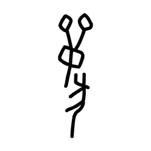

- source_zip_member: `Sub-character Images/sj4e2q73so/cwpk7ek70h/amarph25aj.png`
- checksum_sha256: see `06_component-visual-index.csv`.
- review_status: `needs_human_visual_review`
- caution: source-marked review image only.

## asset-019381

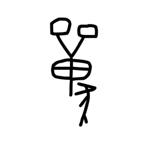

- source_zip_member: `Sub-character Images/sj4e2q73so/cwpk7ek70h/c3izi72fgj.png`
- checksum_sha256: see `06_component-visual-index.csv`.
- review_status: `needs_human_visual_review`
- caution: source-marked review image only.

## asset-019382

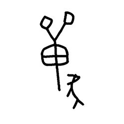

- source_zip_member: `Sub-character Images/sj4e2q73so/cwpk7ek70h/cu7zs90u2j.png`
- checksum_sha256: see `06_component-visual-index.csv`.
- review_status: `needs_human_visual_review`
- caution: source-marked review image only.

## asset-019383

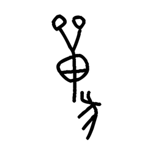

- source_zip_member: `Sub-character Images/sj4e2q73so/cwpk7ek70h/cuc5zkuycq.png`
- checksum_sha256: see `06_component-visual-index.csv`.
- review_status: `needs_human_visual_review`
- caution: source-marked review image only.

## asset-019384

- source_zip_member: `Sub-character Images/sj4e2q73so/cwpk7ek70h/cwpk7ek70h.png`
- checksum_sha256: see `06_component-visual-index.csv`.
- review_status: `needs_human_visual_review`
- caution: source-marked review image only.

## asset-019385

- source_zip_member: `Sub-character Images/sj4e2q73so/cwpk7ek70h/eu8f7v759x.png`
- checksum_sha256: see `06_component-visual-index.csv`.
- review_status: `needs_human_visual_review`
- caution: source-marked review image only.

## asset-019386

- source_zip_member: `Sub-character Images/sj4e2q73so/cwpk7ek70h/ey8a8grf03.png`
- checksum_sha256: see `06_component-visual-index.csv`.
- review_status: `needs_human_visual_review`
- caution: source-marked review image only.

## asset-019387

- source_zip_member: `Sub-character Images/sj4e2q73so/cwpk7ek70h/h3r7u77kfj.png`
- checksum_sha256: see `06_component-visual-index.csv`.
- review_status: `needs_human_visual_review`
- caution: source-marked review image only.

## asset-019388

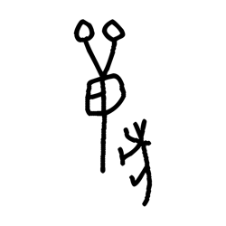

- source_zip_member: `Sub-character Images/sj4e2q73so/cwpk7ek70h/hl7rvmdh3q.png`
- checksum_sha256: see `06_component-visual-index.csv`.
- review_status: `needs_human_visual_review`
- caution: source-marked review image only.

## asset-019389

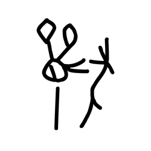

- source_zip_member: `Sub-character Images/sj4e2q73so/cwpk7ek70h/ilqy36fz1b.png`
- checksum_sha256: see `06_component-visual-index.csv`.
- review_status: `needs_human_visual_review`
- caution: source-marked review image only.

## asset-019390

- source_zip_member: `Sub-character Images/sj4e2q73so/cwpk7ek70h/jynogkq233.png`
- checksum_sha256: see `06_component-visual-index.csv`.
- review_status: `needs_human_visual_review`
- caution: source-marked review image only.

## asset-019391

- source_zip_member: `Sub-character Images/sj4e2q73so/cwpk7ek70h/kbc8tchqs2.png`
- checksum_sha256: see `06_component-visual-index.csv`.
- review_status: `needs_human_visual_review`
- caution: source-marked review image only.

## asset-019392

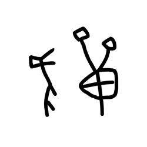

- source_zip_member: `Sub-character Images/sj4e2q73so/cwpk7ek70h/kf0hzra27j.png`
- checksum_sha256: see `06_component-visual-index.csv`.
- review_status: `needs_human_visual_review`
- caution: source-marked review image only.

## asset-019393

- source_zip_member: `Sub-character Images/sj4e2q73so/cwpk7ek70h/kfwunbqilg.png`
- checksum_sha256: see `06_component-visual-index.csv`.
- review_status: `needs_human_visual_review`
- caution: source-marked review image only.

## asset-019394

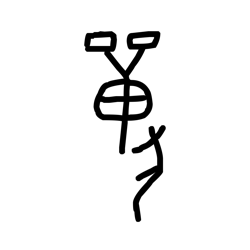

- source_zip_member: `Sub-character Images/sj4e2q73so/cwpk7ek70h/kgsag9gno7.png`
- checksum_sha256: see `06_component-visual-index.csv`.
- review_status: `needs_human_visual_review`
- caution: source-marked review image only.

## asset-019395

- source_zip_member: `Sub-character Images/sj4e2q73so/cwpk7ek70h/l0e7raeq60.png`
- checksum_sha256: see `06_component-visual-index.csv`.
- review_status: `needs_human_visual_review`
- caution: source-marked review image only.

## asset-019396

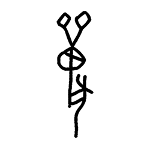

- source_zip_member: `Sub-character Images/sj4e2q73so/cwpk7ek70h/l4tmtc3ryw.png`
- checksum_sha256: see `06_component-visual-index.csv`.
- review_status: `needs_human_visual_review`
- caution: source-marked review image only.

## asset-019397

- source_zip_member: `Sub-character Images/sj4e2q73so/cwpk7ek70h/m1aqizie3d.png`
- checksum_sha256: see `06_component-visual-index.csv`.
- review_status: `needs_human_visual_review`
- caution: source-marked review image only.

## asset-019398

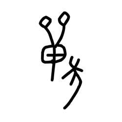

- source_zip_member: `Sub-character Images/sj4e2q73so/cwpk7ek70h/m4mrih71gc.png`
- checksum_sha256: see `06_component-visual-index.csv`.
- review_status: `needs_human_visual_review`
- caution: source-marked review image only.

## asset-019399

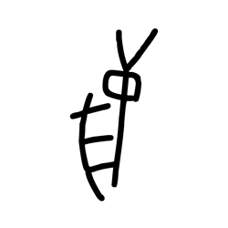

- source_zip_member: `Sub-character Images/sj4e2q73so/cwpk7ek70h/nw72zhurn0.png`
- checksum_sha256: see `06_component-visual-index.csv`.
- review_status: `needs_human_visual_review`
- caution: source-marked review image only.

## asset-019400

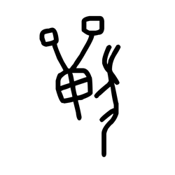

- source_zip_member: `Sub-character Images/sj4e2q73so/cwpk7ek70h/o5ppjrusgi.png`
- checksum_sha256: see `06_component-visual-index.csv`.
- review_status: `needs_human_visual_review`
- caution: source-marked review image only.

## asset-019401

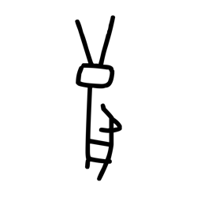

- source_zip_member: `Sub-character Images/sj4e2q73so/cwpk7ek70h/ozkzf6qo5s.png`
- checksum_sha256: see `06_component-visual-index.csv`.
- review_status: `needs_human_visual_review`
- caution: source-marked review image only.

## asset-019402

- source_zip_member: `Sub-character Images/sj4e2q73so/cwpk7ek70h/pppdp3bv6u.png`
- checksum_sha256: see `06_component-visual-index.csv`.
- review_status: `needs_human_visual_review`
- caution: source-marked review image only.

## asset-019403

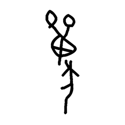

- source_zip_member: `Sub-character Images/sj4e2q73so/cwpk7ek70h/pr7fhfvtfs.png`
- checksum_sha256: see `06_component-visual-index.csv`.
- review_status: `needs_human_visual_review`
- caution: source-marked review image only.

## asset-019404

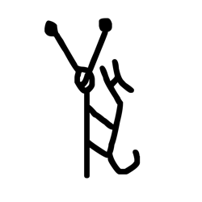

- source_zip_member: `Sub-character Images/sj4e2q73so/cwpk7ek70h/qiv3qsyehx.png`
- checksum_sha256: see `06_component-visual-index.csv`.
- review_status: `needs_human_visual_review`
- caution: source-marked review image only.

## asset-019405

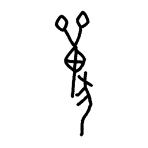

- source_zip_member: `Sub-character Images/sj4e2q73so/cwpk7ek70h/qmknba0xu2.png`
- checksum_sha256: see `06_component-visual-index.csv`.
- review_status: `needs_human_visual_review`
- caution: source-marked review image only.

## asset-019406

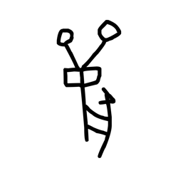

- source_zip_member: `Sub-character Images/sj4e2q73so/cwpk7ek70h/tcfhyifods.png`
- checksum_sha256: see `06_component-visual-index.csv`.
- review_status: `needs_human_visual_review`
- caution: source-marked review image only.

## asset-019407

- source_zip_member: `Sub-character Images/sj4e2q73so/cwpk7ek70h/tkc55m0j08.png`
- checksum_sha256: see `06_component-visual-index.csv`.
- review_status: `needs_human_visual_review`
- caution: source-marked review image only.

## asset-019408

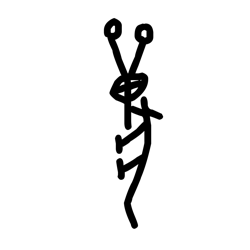

- source_zip_member: `Sub-character Images/sj4e2q73so/cwpk7ek70h/tpa9lesbff.png`
- checksum_sha256: see `06_component-visual-index.csv`.
- review_status: `needs_human_visual_review`
- caution: source-marked review image only.

## asset-019409

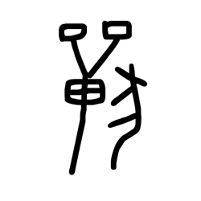

- source_zip_member: `Sub-character Images/sj4e2q73so/cwpk7ek70h/uak0lt9v1j.png`
- checksum_sha256: see `06_component-visual-index.csv`.
- review_status: `needs_human_visual_review`
- caution: source-marked review image only.

## asset-019410

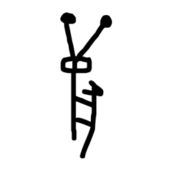

- source_zip_member: `Sub-character Images/sj4e2q73so/cwpk7ek70h/unws90mzwl.png`
- checksum_sha256: see `06_component-visual-index.csv`.
- review_status: `needs_human_visual_review`
- caution: source-marked review image only.

## asset-019411

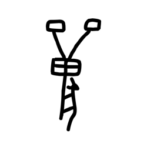

- source_zip_member: `Sub-character Images/sj4e2q73so/cwpk7ek70h/wreypepjbu.png`
- checksum_sha256: see `06_component-visual-index.csv`.
- review_status: `needs_human_visual_review`
- caution: source-marked review image only.

## asset-019412

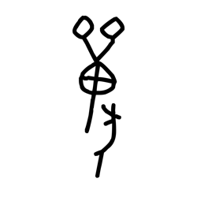

- source_zip_member: `Sub-character Images/sj4e2q73so/cwpk7ek70h/xreu9qgurm.png`
- checksum_sha256: see `06_component-visual-index.csv`.
- review_status: `needs_human_visual_review`
- caution: source-marked review image only.

## asset-019413

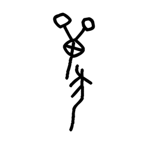

- source_zip_member: `Sub-character Images/sj4e2q73so/cwpk7ek70h/ysx1b0a0d0.png`
- checksum_sha256: see `06_component-visual-index.csv`.
- review_status: `needs_human_visual_review`
- caution: source-marked review image only.

## asset-019414

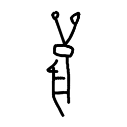

- source_zip_member: `Sub-character Images/sj4e2q73so/cwpk7ek70h/z0mg1u47ph.png`
- checksum_sha256: see `06_component-visual-index.csv`.
- review_status: `needs_human_visual_review`
- caution: source-marked review image only.
