# Component Visual Gallery / 构件图像查看: obs-comp-cand-002047

English:
This page displays OBIMD subcharacter PNG assets extracted into this concrete corpus object directory for human review.

简体中文：
本页展示抽取到当前具体 corpus 对象目录内的 OBIMD subcharacter PNG 资料，供人工复核使用。

Boundary / 边界：dataset image candidate only; not a confirmed component form, component assignment, or decipherment claim.

## asset-019416

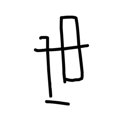

- source_zip_member: `Sub-character Images/4nm99xtfab/4nm99xtfab/0wnnrujl76.png`
- checksum_sha256: `e1f9b9e1271de7815a1b57a2e005f4b86aabee64cd63fa2bc0abad1560e3a348`
- review_status: `needs_human_visual_review`
- caution: OBIMD subcharacter image is a source-marked review asset only; it is not a confirmed component form, component assignment, or decipherment conclusion.

## asset-019417

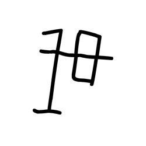

- source_zip_member: `Sub-character Images/4nm99xtfab/4nm99xtfab/36s03xzenp.png`
- checksum_sha256: `1cc10fe86a5b373d9a57b9301ea6ca4af3754330df459792ded45002f33e511c`
- review_status: `needs_human_visual_review`
- caution: OBIMD subcharacter image is a source-marked review asset only; it is not a confirmed component form, component assignment, or decipherment conclusion.

## asset-019418

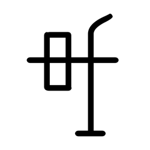

- source_zip_member: `Sub-character Images/4nm99xtfab/4nm99xtfab/4nm99xtfab.png`
- checksum_sha256: `cca2dcfc79f2627ecb347d9c4cb01d9b6479cf8173708f21702b4665ec4b82c8`
- review_status: `needs_human_visual_review`
- caution: OBIMD subcharacter image is a source-marked review asset only; it is not a confirmed component form, component assignment, or decipherment conclusion.

## asset-019419

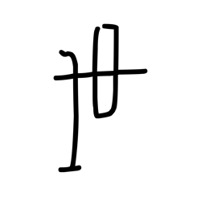

- source_zip_member: `Sub-character Images/4nm99xtfab/4nm99xtfab/51ra75tmn1.png`
- checksum_sha256: `56ec213fed5f73a6f01da31c34e8b20f92da4dd4b351c4fef48772d4b33bfd59`
- review_status: `needs_human_visual_review`
- caution: OBIMD subcharacter image is a source-marked review asset only; it is not a confirmed component form, component assignment, or decipherment conclusion.

## asset-019420

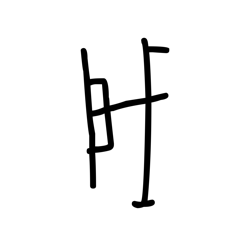

- source_zip_member: `Sub-character Images/4nm99xtfab/4nm99xtfab/6de2q6qr28.png`
- checksum_sha256: `5d14750d323ef0803b639b11244a650b351e0bdd73ed094b3f9a8748b97d3d89`
- review_status: `needs_human_visual_review`
- caution: OBIMD subcharacter image is a source-marked review asset only; it is not a confirmed component form, component assignment, or decipherment conclusion.

## asset-019421

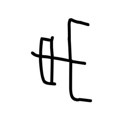

- source_zip_member: `Sub-character Images/4nm99xtfab/4nm99xtfab/9guqq2kcb5.png`
- checksum_sha256: `8516fca32479e585e40c3512324fe2d66088d9788c3643dbf0116c8f77eee32c`
- review_status: `needs_human_visual_review`
- caution: OBIMD subcharacter image is a source-marked review asset only; it is not a confirmed component form, component assignment, or decipherment conclusion.

## asset-019422

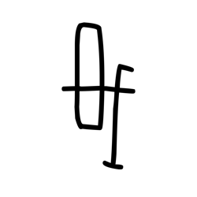

- source_zip_member: `Sub-character Images/4nm99xtfab/4nm99xtfab/9hmeutmj6s.png`
- checksum_sha256: `35aa38e99d65d5baeefb6c9b81a2effb7579e7a05053aee77c90cf96560a7328`
- review_status: `needs_human_visual_review`
- caution: OBIMD subcharacter image is a source-marked review asset only; it is not a confirmed component form, component assignment, or decipherment conclusion.

## asset-019423

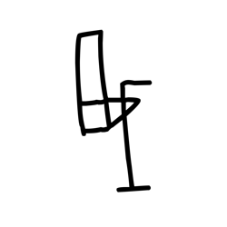

- source_zip_member: `Sub-character Images/4nm99xtfab/4nm99xtfab/a9q9f5bmx5.png`
- checksum_sha256: `0738f3f253ee9ebbdc054435c44ce302b08af0253d412285e94bd9c5ca9535a7`
- review_status: `needs_human_visual_review`
- caution: OBIMD subcharacter image is a source-marked review asset only; it is not a confirmed component form, component assignment, or decipherment conclusion.

## asset-019424

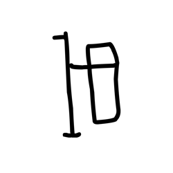

- source_zip_member: `Sub-character Images/4nm99xtfab/4nm99xtfab/ab3k8zqt2i.png`
- checksum_sha256: `2d9ef4c5c227c73acfad83c36b12a0d705a1e9694288d2f52e8a83f4531dc44d`
- review_status: `needs_human_visual_review`
- caution: OBIMD subcharacter image is a source-marked review asset only; it is not a confirmed component form, component assignment, or decipherment conclusion.

## asset-019425

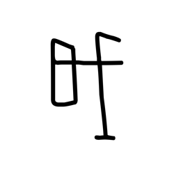

- source_zip_member: `Sub-character Images/4nm99xtfab/4nm99xtfab/alfmwoyb0o.png`
- checksum_sha256: `a12af046fdacab91bbcd5146eba64347c40c1afc8eaf6bbab22f612f6d957fa7`
- review_status: `needs_human_visual_review`
- caution: OBIMD subcharacter image is a source-marked review asset only; it is not a confirmed component form, component assignment, or decipherment conclusion.

## asset-019426

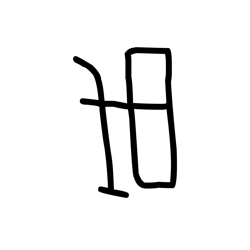

- source_zip_member: `Sub-character Images/4nm99xtfab/4nm99xtfab/dvm1ea3nqk.png`
- checksum_sha256: `ff4cd805c9d817d26830877e0362fea3d2fb70ca1feda81aacd9bc31067544e7`
- review_status: `needs_human_visual_review`
- caution: OBIMD subcharacter image is a source-marked review asset only; it is not a confirmed component form, component assignment, or decipherment conclusion.

## asset-019427

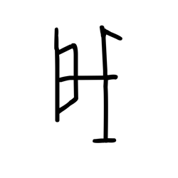

- source_zip_member: `Sub-character Images/4nm99xtfab/4nm99xtfab/mpmlaiwkfz.png`
- checksum_sha256: `6ddb15c0c16033dfd991decb88291fcfd346970f4125dfa43d05bb7f4efebe81`
- review_status: `needs_human_visual_review`
- caution: OBIMD subcharacter image is a source-marked review asset only; it is not a confirmed component form, component assignment, or decipherment conclusion.

## asset-019428

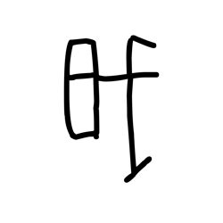

- source_zip_member: `Sub-character Images/4nm99xtfab/4nm99xtfab/p1858my41s.png`
- checksum_sha256: `9d344059d871d0bb4cca7f2fdaa33f7ac53cac42bb2598ab2d14da22ecd60a90`
- review_status: `needs_human_visual_review`
- caution: OBIMD subcharacter image is a source-marked review asset only; it is not a confirmed component form, component assignment, or decipherment conclusion.

## asset-019429

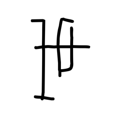

- source_zip_member: `Sub-character Images/4nm99xtfab/4nm99xtfab/pbd3bb947t.png`
- checksum_sha256: `ccd92a61cbf87b47b4862fad241767df18e86d3f01a582fb84b44d90b1874d8f`
- review_status: `needs_human_visual_review`
- caution: OBIMD subcharacter image is a source-marked review asset only; it is not a confirmed component form, component assignment, or decipherment conclusion.

## asset-019430

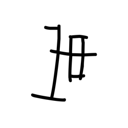

- source_zip_member: `Sub-character Images/4nm99xtfab/4nm99xtfab/pgq1a2a0mq.png`
- checksum_sha256: `b14927945d6bc3c0500617c7d70a0d0a5f2d3154d73ea27b059813000b9bdf33`
- review_status: `needs_human_visual_review`
- caution: OBIMD subcharacter image is a source-marked review asset only; it is not a confirmed component form, component assignment, or decipherment conclusion.

## asset-019431

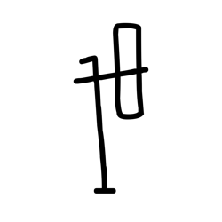

- source_zip_member: `Sub-character Images/4nm99xtfab/4nm99xtfab/sm4ep2tcre.png`
- checksum_sha256: `05ef59094146000a1884c63e86272e8710921d4fc123f2f26fafa4c0fb3bf382`
- review_status: `needs_human_visual_review`
- caution: OBIMD subcharacter image is a source-marked review asset only; it is not a confirmed component form, component assignment, or decipherment conclusion.

## asset-019432

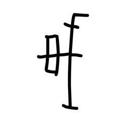

- source_zip_member: `Sub-character Images/4nm99xtfab/4nm99xtfab/u3n2pov59n.png`
- checksum_sha256: `2f0bcc5fe5360b758e6982c04fcd26523e9878237184c969ba77ab2ed4bf05b8`
- review_status: `needs_human_visual_review`
- caution: OBIMD subcharacter image is a source-marked review asset only; it is not a confirmed component form, component assignment, or decipherment conclusion.

## asset-019433

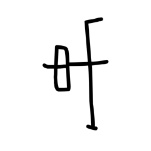

- source_zip_member: `Sub-character Images/4nm99xtfab/4nm99xtfab/uoyhcay3f4.png`
- checksum_sha256: `37dccdac031c1902efb0736a35b900554b62e3a68705c06489f7f7123ff2c175`
- review_status: `needs_human_visual_review`
- caution: OBIMD subcharacter image is a source-marked review asset only; it is not a confirmed component form, component assignment, or decipherment conclusion.

## asset-019434

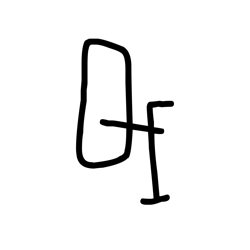

- source_zip_member: `Sub-character Images/4nm99xtfab/4nm99xtfab/wru4iqqmcg.png`
- checksum_sha256: `aabc10e748e07299419dd98fe45f88fef77b32c0b8c8f9472d281e824ff8f8a1`
- review_status: `needs_human_visual_review`
- caution: OBIMD subcharacter image is a source-marked review asset only; it is not a confirmed component form, component assignment, or decipherment conclusion.
