# Component Visual Gallery / 构件图像查看: obs-comp-cand-002085

English:
This page displays OBIMD subcharacter PNG assets extracted into this concrete
corpus object directory for human review.

简体中文：
本页展示抽取到当前具体 corpus 对象目录内的 OBIMD subcharacter PNG 资料，供人工复核使用。

Boundary / 边界：
dataset image candidate only; not a confirmed component form, not a component
assignment, and not a decipherment claim.
- not a confirmed component form
- not a component assignment
- not a decipherment claim

## Concrete Questions To Check / 具体待查问题

- Which local image should be opened first?
- 应先打开哪一张本地构件图像？
- Which source zip member anchors this image?
- 哪一个 source zip member 能定位这张图像？
- Which near-shape or variant comparison is still missing?
- 还缺哪些近形或异体比较？
- Which character or inscription context should be checked next?
- 下一步应核对哪些单字或卜辞上下文？
- What evidence is missing before a component assignment?
- 正式构件归属前还缺哪些证据？

## asset-019472

- source_zip_member: `Sub-character Images/u7v6rlhp81/u7v6rlhp81/01mc8bd0do.png`
- checksum_sha256: see `06_component-visual-index.csv`.
- review_status: `needs_human_visual_review`
- caution: source-marked review image only.

## asset-019473

- source_zip_member: `Sub-character Images/u7v6rlhp81/u7v6rlhp81/04bj2f89la.png`
- checksum_sha256: see `06_component-visual-index.csv`.
- review_status: `needs_human_visual_review`
- caution: source-marked review image only.

## asset-019474

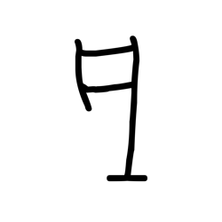

- source_zip_member: `Sub-character Images/u7v6rlhp81/u7v6rlhp81/0finky3m6z.png`
- checksum_sha256: see `06_component-visual-index.csv`.
- review_status: `needs_human_visual_review`
- caution: source-marked review image only.

## asset-019475

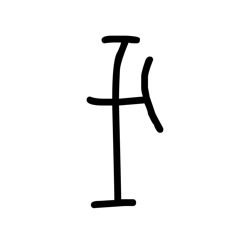

- source_zip_member: `Sub-character Images/u7v6rlhp81/u7v6rlhp81/0td8fu6lw0.png`
- checksum_sha256: see `06_component-visual-index.csv`.
- review_status: `needs_human_visual_review`
- caution: source-marked review image only.

## asset-019476

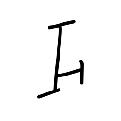

- source_zip_member: `Sub-character Images/u7v6rlhp81/u7v6rlhp81/16qj7kg72s.png`
- checksum_sha256: see `06_component-visual-index.csv`.
- review_status: `needs_human_visual_review`
- caution: source-marked review image only.

## asset-019477

- source_zip_member: `Sub-character Images/u7v6rlhp81/u7v6rlhp81/1a168hlm85.png`
- checksum_sha256: see `06_component-visual-index.csv`.
- review_status: `needs_human_visual_review`
- caution: source-marked review image only.

## asset-019478

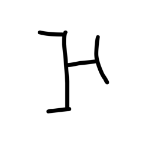

- source_zip_member: `Sub-character Images/u7v6rlhp81/u7v6rlhp81/1mvykzh1zr.png`
- checksum_sha256: see `06_component-visual-index.csv`.
- review_status: `needs_human_visual_review`
- caution: source-marked review image only.

## asset-019479

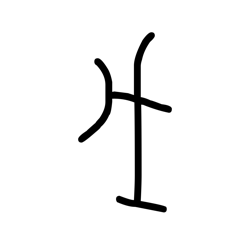

- source_zip_member: `Sub-character Images/u7v6rlhp81/u7v6rlhp81/1nxlgmitds.png`
- checksum_sha256: see `06_component-visual-index.csv`.
- review_status: `needs_human_visual_review`
- caution: source-marked review image only.

## asset-019480

- source_zip_member: `Sub-character Images/u7v6rlhp81/u7v6rlhp81/234pqbn3bm.png`
- checksum_sha256: see `06_component-visual-index.csv`.
- review_status: `needs_human_visual_review`
- caution: source-marked review image only.

## asset-019481

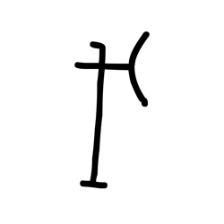

- source_zip_member: `Sub-character Images/u7v6rlhp81/u7v6rlhp81/32oqlilc0z.png`
- checksum_sha256: see `06_component-visual-index.csv`.
- review_status: `needs_human_visual_review`
- caution: source-marked review image only.

## asset-019482

- source_zip_member: `Sub-character Images/u7v6rlhp81/u7v6rlhp81/39cdgd0qcz.png`
- checksum_sha256: see `06_component-visual-index.csv`.
- review_status: `needs_human_visual_review`
- caution: source-marked review image only.

## asset-019483

- source_zip_member: `Sub-character Images/u7v6rlhp81/u7v6rlhp81/3ewo04o8sq.png`
- checksum_sha256: see `06_component-visual-index.csv`.
- review_status: `needs_human_visual_review`
- caution: source-marked review image only.

## asset-019484

- source_zip_member: `Sub-character Images/u7v6rlhp81/u7v6rlhp81/3kbxil6mx5.png`
- checksum_sha256: see `06_component-visual-index.csv`.
- review_status: `needs_human_visual_review`
- caution: source-marked review image only.

## asset-019485

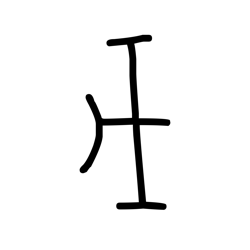

- source_zip_member: `Sub-character Images/u7v6rlhp81/u7v6rlhp81/4dyx3yntnk.png`
- checksum_sha256: see `06_component-visual-index.csv`.
- review_status: `needs_human_visual_review`
- caution: source-marked review image only.

## asset-019486

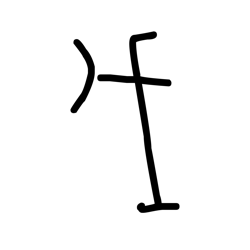

- source_zip_member: `Sub-character Images/u7v6rlhp81/u7v6rlhp81/4j48ini6js.png`
- checksum_sha256: see `06_component-visual-index.csv`.
- review_status: `needs_human_visual_review`
- caution: source-marked review image only.

## asset-019487

- source_zip_member: `Sub-character Images/u7v6rlhp81/u7v6rlhp81/5ue28uoxbr.png`
- checksum_sha256: see `06_component-visual-index.csv`.
- review_status: `needs_human_visual_review`
- caution: source-marked review image only.

## asset-019488

- source_zip_member: `Sub-character Images/u7v6rlhp81/u7v6rlhp81/773tgucgvd.png`
- checksum_sha256: see `06_component-visual-index.csv`.
- review_status: `needs_human_visual_review`
- caution: source-marked review image only.

## asset-019489

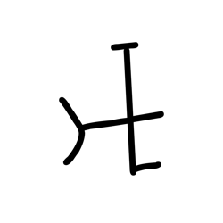

- source_zip_member: `Sub-character Images/u7v6rlhp81/u7v6rlhp81/7g60vd8e3v.png`
- checksum_sha256: see `06_component-visual-index.csv`.
- review_status: `needs_human_visual_review`
- caution: source-marked review image only.

## asset-019490

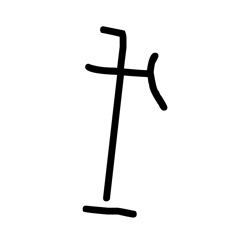

- source_zip_member: `Sub-character Images/u7v6rlhp81/u7v6rlhp81/7gsa8d1g6w.png`
- checksum_sha256: see `06_component-visual-index.csv`.
- review_status: `needs_human_visual_review`
- caution: source-marked review image only.

## asset-019491

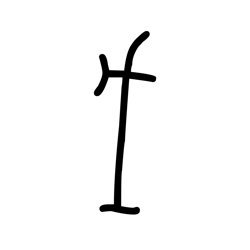

- source_zip_member: `Sub-character Images/u7v6rlhp81/u7v6rlhp81/84djy72bev.png`
- checksum_sha256: see `06_component-visual-index.csv`.
- review_status: `needs_human_visual_review`
- caution: source-marked review image only.

## asset-019492

- source_zip_member: `Sub-character Images/u7v6rlhp81/u7v6rlhp81/86x1opyxin.png`
- checksum_sha256: see `06_component-visual-index.csv`.
- review_status: `needs_human_visual_review`
- caution: source-marked review image only.

## asset-019493

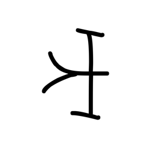

- source_zip_member: `Sub-character Images/u7v6rlhp81/u7v6rlhp81/8jnvzliyd7.png`
- checksum_sha256: see `06_component-visual-index.csv`.
- review_status: `needs_human_visual_review`
- caution: source-marked review image only.

## asset-019494

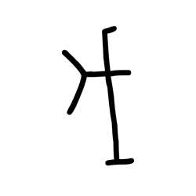

- source_zip_member: `Sub-character Images/u7v6rlhp81/u7v6rlhp81/9s1oke1mtr.png`
- checksum_sha256: see `06_component-visual-index.csv`.
- review_status: `needs_human_visual_review`
- caution: source-marked review image only.

## asset-019495

- source_zip_member: `Sub-character Images/u7v6rlhp81/u7v6rlhp81/ak5jol5mbd.png`
- checksum_sha256: see `06_component-visual-index.csv`.
- review_status: `needs_human_visual_review`
- caution: source-marked review image only.

## asset-019496

- source_zip_member: `Sub-character Images/u7v6rlhp81/u7v6rlhp81/bbrn7uee2o.png`
- checksum_sha256: see `06_component-visual-index.csv`.
- review_status: `needs_human_visual_review`
- caution: source-marked review image only.

## asset-019497

- source_zip_member: `Sub-character Images/u7v6rlhp81/u7v6rlhp81/bfb91ucoeo.png`
- checksum_sha256: see `06_component-visual-index.csv`.
- review_status: `needs_human_visual_review`
- caution: source-marked review image only.

## asset-019498

- source_zip_member: `Sub-character Images/u7v6rlhp81/u7v6rlhp81/bitt4oy1nq.png`
- checksum_sha256: see `06_component-visual-index.csv`.
- review_status: `needs_human_visual_review`
- caution: source-marked review image only.

## asset-019499

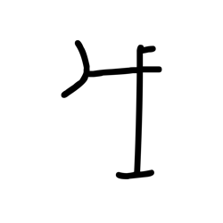

- source_zip_member: `Sub-character Images/u7v6rlhp81/u7v6rlhp81/bqh40hjbla.png`
- checksum_sha256: see `06_component-visual-index.csv`.
- review_status: `needs_human_visual_review`
- caution: source-marked review image only.

## asset-019500

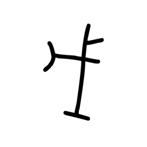

- source_zip_member: `Sub-character Images/u7v6rlhp81/u7v6rlhp81/c2d69cx156.png`
- checksum_sha256: see `06_component-visual-index.csv`.
- review_status: `needs_human_visual_review`
- caution: source-marked review image only.

## asset-019501

- source_zip_member: `Sub-character Images/u7v6rlhp81/u7v6rlhp81/cfo23xtohz.png`
- checksum_sha256: see `06_component-visual-index.csv`.
- review_status: `needs_human_visual_review`
- caution: source-marked review image only.

## asset-019502

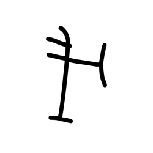

- source_zip_member: `Sub-character Images/u7v6rlhp81/u7v6rlhp81/ddgf7x2uf6.png`
- checksum_sha256: see `06_component-visual-index.csv`.
- review_status: `needs_human_visual_review`
- caution: source-marked review image only.

## asset-019503

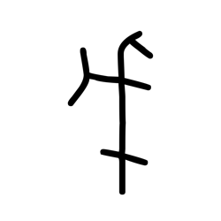

- source_zip_member: `Sub-character Images/u7v6rlhp81/u7v6rlhp81/f6bvv9716g.png`
- checksum_sha256: see `06_component-visual-index.csv`.
- review_status: `needs_human_visual_review`
- caution: source-marked review image only.

## asset-019504

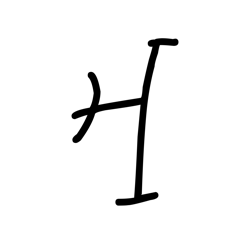

- source_zip_member: `Sub-character Images/u7v6rlhp81/u7v6rlhp81/fdcfup958c.png`
- checksum_sha256: see `06_component-visual-index.csv`.
- review_status: `needs_human_visual_review`
- caution: source-marked review image only.

## asset-019505

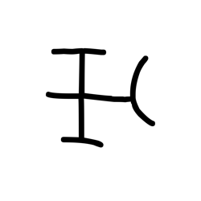

- source_zip_member: `Sub-character Images/u7v6rlhp81/u7v6rlhp81/g4e9p8l9er.png`
- checksum_sha256: see `06_component-visual-index.csv`.
- review_status: `needs_human_visual_review`
- caution: source-marked review image only.

## asset-019506

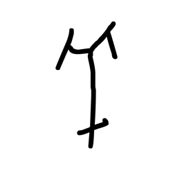

- source_zip_member: `Sub-character Images/u7v6rlhp81/u7v6rlhp81/h5yt19sq3q.png`
- checksum_sha256: see `06_component-visual-index.csv`.
- review_status: `needs_human_visual_review`
- caution: source-marked review image only.

## asset-019507

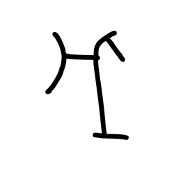

- source_zip_member: `Sub-character Images/u7v6rlhp81/u7v6rlhp81/h6zlqca9gv.png`
- checksum_sha256: see `06_component-visual-index.csv`.
- review_status: `needs_human_visual_review`
- caution: source-marked review image only.

## asset-019508

- source_zip_member: `Sub-character Images/u7v6rlhp81/u7v6rlhp81/h9oyk5sfxc.png`
- checksum_sha256: see `06_component-visual-index.csv`.
- review_status: `needs_human_visual_review`
- caution: source-marked review image only.

## asset-019509

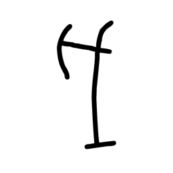

- source_zip_member: `Sub-character Images/u7v6rlhp81/u7v6rlhp81/imea5o4suk.png`
- checksum_sha256: see `06_component-visual-index.csv`.
- review_status: `needs_human_visual_review`
- caution: source-marked review image only.

## asset-019510

- source_zip_member: `Sub-character Images/u7v6rlhp81/u7v6rlhp81/ivvw0t22nz.png`
- checksum_sha256: see `06_component-visual-index.csv`.
- review_status: `needs_human_visual_review`
- caution: source-marked review image only.

## asset-019511

- source_zip_member: `Sub-character Images/u7v6rlhp81/u7v6rlhp81/jju3jkgu59.png`
- checksum_sha256: see `06_component-visual-index.csv`.
- review_status: `needs_human_visual_review`
- caution: source-marked review image only.

## asset-019512

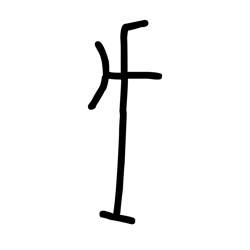

- source_zip_member: `Sub-character Images/u7v6rlhp81/u7v6rlhp81/kx0tm2s6sk.png`
- checksum_sha256: see `06_component-visual-index.csv`.
- review_status: `needs_human_visual_review`
- caution: source-marked review image only.

## asset-019513

- source_zip_member: `Sub-character Images/u7v6rlhp81/u7v6rlhp81/mgi4tqz0lh.png`
- checksum_sha256: see `06_component-visual-index.csv`.
- review_status: `needs_human_visual_review`
- caution: source-marked review image only.

## asset-019514

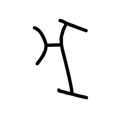

- source_zip_member: `Sub-character Images/u7v6rlhp81/u7v6rlhp81/mi1q33k3z5.png`
- checksum_sha256: see `06_component-visual-index.csv`.
- review_status: `needs_human_visual_review`
- caution: source-marked review image only.

## asset-019515

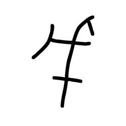

- source_zip_member: `Sub-character Images/u7v6rlhp81/u7v6rlhp81/micgnw053k.png`
- checksum_sha256: see `06_component-visual-index.csv`.
- review_status: `needs_human_visual_review`
- caution: source-marked review image only.

## asset-019516

- source_zip_member: `Sub-character Images/u7v6rlhp81/u7v6rlhp81/mjy8omtxhn.png`
- checksum_sha256: see `06_component-visual-index.csv`.
- review_status: `needs_human_visual_review`
- caution: source-marked review image only.

## asset-019517

- source_zip_member: `Sub-character Images/u7v6rlhp81/u7v6rlhp81/ms7mygc9jc.png`
- checksum_sha256: see `06_component-visual-index.csv`.
- review_status: `needs_human_visual_review`
- caution: source-marked review image only.

## asset-019518

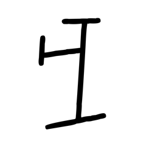

- source_zip_member: `Sub-character Images/u7v6rlhp81/u7v6rlhp81/mse1hba5ys.png`
- checksum_sha256: see `06_component-visual-index.csv`.
- review_status: `needs_human_visual_review`
- caution: source-marked review image only.

## asset-019519

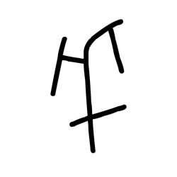

- source_zip_member: `Sub-character Images/u7v6rlhp81/u7v6rlhp81/n2uagaa9kl.png`
- checksum_sha256: see `06_component-visual-index.csv`.
- review_status: `needs_human_visual_review`
- caution: source-marked review image only.

## asset-019520

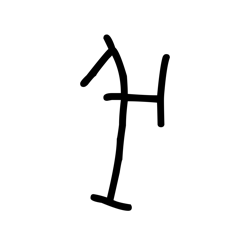

- source_zip_member: `Sub-character Images/u7v6rlhp81/u7v6rlhp81/o96eyte3gr.png`
- checksum_sha256: see `06_component-visual-index.csv`.
- review_status: `needs_human_visual_review`
- caution: source-marked review image only.

## asset-019521

- source_zip_member: `Sub-character Images/u7v6rlhp81/u7v6rlhp81/pjmj4k1spy.png`
- checksum_sha256: see `06_component-visual-index.csv`.
- review_status: `needs_human_visual_review`
- caution: source-marked review image only.

## asset-019522

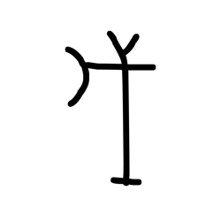

- source_zip_member: `Sub-character Images/u7v6rlhp81/u7v6rlhp81/qa936dxqsw.png`
- checksum_sha256: see `06_component-visual-index.csv`.
- review_status: `needs_human_visual_review`
- caution: source-marked review image only.

## asset-019523

- source_zip_member: `Sub-character Images/u7v6rlhp81/u7v6rlhp81/qjtksksa7r.png`
- checksum_sha256: see `06_component-visual-index.csv`.
- review_status: `needs_human_visual_review`
- caution: source-marked review image only.

## asset-019524

- source_zip_member: `Sub-character Images/u7v6rlhp81/u7v6rlhp81/s9kz74fuap.png`
- checksum_sha256: see `06_component-visual-index.csv`.
- review_status: `needs_human_visual_review`
- caution: source-marked review image only.

## asset-019525

- source_zip_member: `Sub-character Images/u7v6rlhp81/u7v6rlhp81/t797r5w21e.png`
- checksum_sha256: see `06_component-visual-index.csv`.
- review_status: `needs_human_visual_review`
- caution: source-marked review image only.

## asset-019526

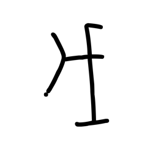

- source_zip_member: `Sub-character Images/u7v6rlhp81/u7v6rlhp81/tmdt6yhody.png`
- checksum_sha256: see `06_component-visual-index.csv`.
- review_status: `needs_human_visual_review`
- caution: source-marked review image only.

## asset-019527

- source_zip_member: `Sub-character Images/u7v6rlhp81/u7v6rlhp81/u7t8soc2ht.png`
- checksum_sha256: see `06_component-visual-index.csv`.
- review_status: `needs_human_visual_review`
- caution: source-marked review image only.

## asset-019528

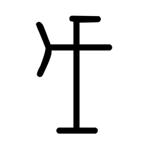

- source_zip_member: `Sub-character Images/u7v6rlhp81/u7v6rlhp81/u7v6rlhp81.png`
- checksum_sha256: see `06_component-visual-index.csv`.
- review_status: `needs_human_visual_review`
- caution: source-marked review image only.

## asset-019529

- source_zip_member: `Sub-character Images/u7v6rlhp81/u7v6rlhp81/ups9nooq5u.png`
- checksum_sha256: see `06_component-visual-index.csv`.
- review_status: `needs_human_visual_review`
- caution: source-marked review image only.

## asset-019530

- source_zip_member: `Sub-character Images/u7v6rlhp81/u7v6rlhp81/vthth910ve.png`
- checksum_sha256: see `06_component-visual-index.csv`.
- review_status: `needs_human_visual_review`
- caution: source-marked review image only.

## asset-019531

- source_zip_member: `Sub-character Images/u7v6rlhp81/u7v6rlhp81/widyx9rtih.png`
- checksum_sha256: see `06_component-visual-index.csv`.
- review_status: `needs_human_visual_review`
- caution: source-marked review image only.
