# Component Visual Gallery / 构件图像查看: obs-comp-cand-002111

English:
This page displays OBIMD subcharacter PNG assets extracted into this concrete
corpus object directory for human review.

简体中文：
本页展示抽取到当前具体 corpus 对象目录内的 OBIMD subcharacter PNG 资料，供人工复核使用。

Boundary / 边界：
dataset image candidate only; not a confirmed component form, not a component
assignment, and not a decipherment claim.
- not a confirmed component form
- not a component assignment
- not a decipherment claim

## Concrete Questions To Check / 具体待查问题

- Open 06_component-visual-index.csv and name the local image row.
- 打开 06_component-visual-index.csv，写明本地图像行。
- Open 09_component-visual-route-index.csv and name the source route row.
- 打开 09_component-visual-route-index.csv，写明来源路线行。
- Open 13_component-context-evidence-dossier.md for character context.
- 打开 13_component-context-evidence-dossier.md，核对单字与卜辞上下文。
- Record the missing image, near-shape, source, or context route.
- 记录缺失的图像、近形、来源或上下文路线。

## asset-019562

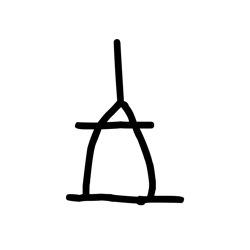

- source_zip_member: `Sub-character Images/hftl4m18q0/hftl4m18q0/0nz29z0nh1.png`
- checksum_sha256: see `06_component-visual-index.csv`.
- review_status: `needs_human_visual_review`
- caution: source-marked review image only.

## asset-019563

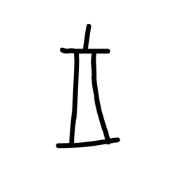

- source_zip_member: `Sub-character Images/hftl4m18q0/hftl4m18q0/14epondtbu.png`
- checksum_sha256: see `06_component-visual-index.csv`.
- review_status: `needs_human_visual_review`
- caution: source-marked review image only.

## asset-019564

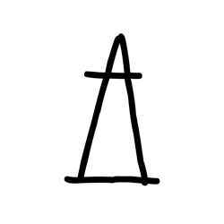

- source_zip_member: `Sub-character Images/hftl4m18q0/hftl4m18q0/2e4hjg1uzf.png`
- checksum_sha256: see `06_component-visual-index.csv`.
- review_status: `needs_human_visual_review`
- caution: source-marked review image only.

## asset-019565

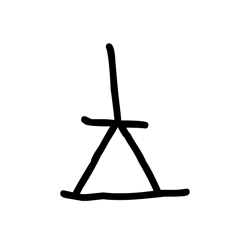

- source_zip_member: `Sub-character Images/hftl4m18q0/hftl4m18q0/39a7c8e1xa.png`
- checksum_sha256: see `06_component-visual-index.csv`.
- review_status: `needs_human_visual_review`
- caution: source-marked review image only.

## asset-019566

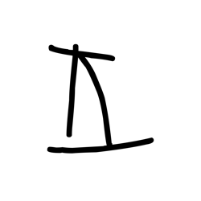

- source_zip_member: `Sub-character Images/hftl4m18q0/hftl4m18q0/3iph6uoll4.png`
- checksum_sha256: see `06_component-visual-index.csv`.
- review_status: `needs_human_visual_review`
- caution: source-marked review image only.

## asset-019567

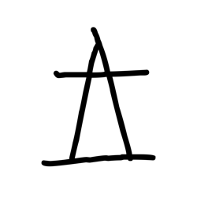

- source_zip_member: `Sub-character Images/hftl4m18q0/hftl4m18q0/4toczskyce.png`
- checksum_sha256: see `06_component-visual-index.csv`.
- review_status: `needs_human_visual_review`
- caution: source-marked review image only.

## asset-019568

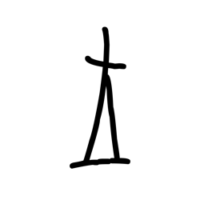

- source_zip_member: `Sub-character Images/hftl4m18q0/hftl4m18q0/4v4w29hvnu.png`
- checksum_sha256: see `06_component-visual-index.csv`.
- review_status: `needs_human_visual_review`
- caution: source-marked review image only.

## asset-019569

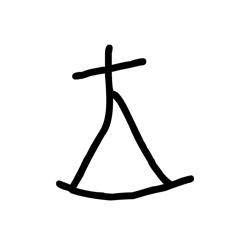

- source_zip_member: `Sub-character Images/hftl4m18q0/hftl4m18q0/56n0lkr7dg.png`
- checksum_sha256: see `06_component-visual-index.csv`.
- review_status: `needs_human_visual_review`
- caution: source-marked review image only.

## asset-019570

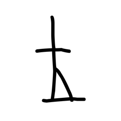

- source_zip_member: `Sub-character Images/hftl4m18q0/hftl4m18q0/5rddunfwfo.png`
- checksum_sha256: see `06_component-visual-index.csv`.
- review_status: `needs_human_visual_review`
- caution: source-marked review image only.

## asset-019571

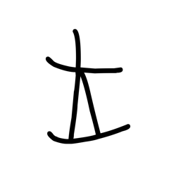

- source_zip_member: `Sub-character Images/hftl4m18q0/hftl4m18q0/64l5yiq6jx.png`
- checksum_sha256: see `06_component-visual-index.csv`.
- review_status: `needs_human_visual_review`
- caution: source-marked review image only.

## asset-019572

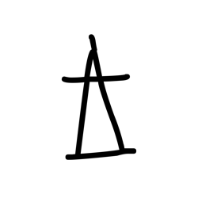

- source_zip_member: `Sub-character Images/hftl4m18q0/hftl4m18q0/68w8127md0.png`
- checksum_sha256: see `06_component-visual-index.csv`.
- review_status: `needs_human_visual_review`
- caution: source-marked review image only.

## asset-019573

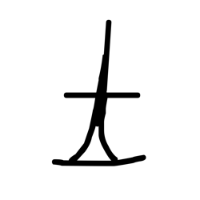

- source_zip_member: `Sub-character Images/hftl4m18q0/hftl4m18q0/6ct2h45fx3.png`
- checksum_sha256: see `06_component-visual-index.csv`.
- review_status: `needs_human_visual_review`
- caution: source-marked review image only.

## asset-019574

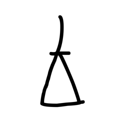

- source_zip_member: `Sub-character Images/hftl4m18q0/hftl4m18q0/6uzvwfll4z.png`
- checksum_sha256: see `06_component-visual-index.csv`.
- review_status: `needs_human_visual_review`
- caution: source-marked review image only.

## asset-019575

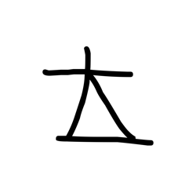

- source_zip_member: `Sub-character Images/hftl4m18q0/hftl4m18q0/6y9haphmpn.png`
- checksum_sha256: see `06_component-visual-index.csv`.
- review_status: `needs_human_visual_review`
- caution: source-marked review image only.

## asset-019576

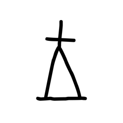

- source_zip_member: `Sub-character Images/hftl4m18q0/hftl4m18q0/7ygcd4fx2c.png`
- checksum_sha256: see `06_component-visual-index.csv`.
- review_status: `needs_human_visual_review`
- caution: source-marked review image only.

## asset-019577

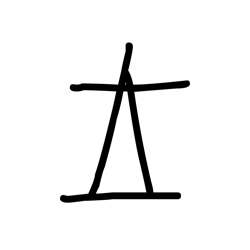

- source_zip_member: `Sub-character Images/hftl4m18q0/hftl4m18q0/8n4lyhmgrr.png`
- checksum_sha256: see `06_component-visual-index.csv`.
- review_status: `needs_human_visual_review`
- caution: source-marked review image only.

## asset-019578

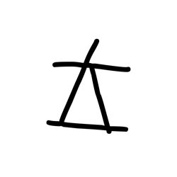

- source_zip_member: `Sub-character Images/hftl4m18q0/hftl4m18q0/9ss9vdlmr9.png`
- checksum_sha256: see `06_component-visual-index.csv`.
- review_status: `needs_human_visual_review`
- caution: source-marked review image only.

## asset-019579

- source_zip_member: `Sub-character Images/hftl4m18q0/hftl4m18q0/abec20fkq0.png`
- checksum_sha256: see `06_component-visual-index.csv`.
- review_status: `needs_human_visual_review`
- caution: source-marked review image only.

## asset-019580

- source_zip_member: `Sub-character Images/hftl4m18q0/hftl4m18q0/b3vy7idxor.png`
- checksum_sha256: see `06_component-visual-index.csv`.
- review_status: `needs_human_visual_review`
- caution: source-marked review image only.

## asset-019581

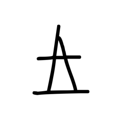

- source_zip_member: `Sub-character Images/hftl4m18q0/hftl4m18q0/ca9c61dhay.png`
- checksum_sha256: see `06_component-visual-index.csv`.
- review_status: `needs_human_visual_review`
- caution: source-marked review image only.

## asset-019582

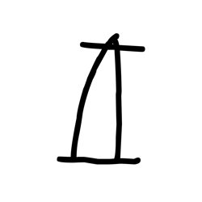

- source_zip_member: `Sub-character Images/hftl4m18q0/hftl4m18q0/cdnudh5ckd.png`
- checksum_sha256: see `06_component-visual-index.csv`.
- review_status: `needs_human_visual_review`
- caution: source-marked review image only.

## asset-019583

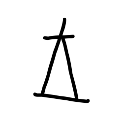

- source_zip_member: `Sub-character Images/hftl4m18q0/hftl4m18q0/d8qr5qxr7b.png`
- checksum_sha256: see `06_component-visual-index.csv`.
- review_status: `needs_human_visual_review`
- caution: source-marked review image only.

## asset-019584

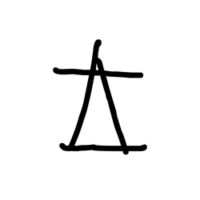

- source_zip_member: `Sub-character Images/hftl4m18q0/hftl4m18q0/dffy47t2ih.png`
- checksum_sha256: see `06_component-visual-index.csv`.
- review_status: `needs_human_visual_review`
- caution: source-marked review image only.

## asset-019585

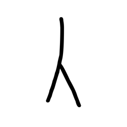

- source_zip_member: `Sub-character Images/hftl4m18q0/hftl4m18q0/entheglc94.png`
- checksum_sha256: see `06_component-visual-index.csv`.
- review_status: `needs_human_visual_review`
- caution: source-marked review image only.

## asset-019586

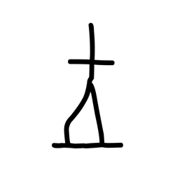

- source_zip_member: `Sub-character Images/hftl4m18q0/hftl4m18q0/fk1mbs0gux.png`
- checksum_sha256: see `06_component-visual-index.csv`.
- review_status: `needs_human_visual_review`
- caution: source-marked review image only.

## asset-019587

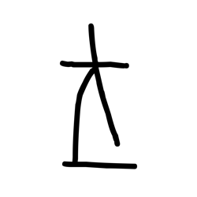

- source_zip_member: `Sub-character Images/hftl4m18q0/hftl4m18q0/g06gge5xis.png`
- checksum_sha256: see `06_component-visual-index.csv`.
- review_status: `needs_human_visual_review`
- caution: source-marked review image only.

## asset-019588

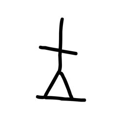

- source_zip_member: `Sub-character Images/hftl4m18q0/hftl4m18q0/g2leuzrpqe.png`
- checksum_sha256: see `06_component-visual-index.csv`.
- review_status: `needs_human_visual_review`
- caution: source-marked review image only.

## asset-019589

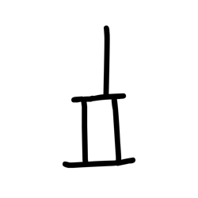

- source_zip_member: `Sub-character Images/hftl4m18q0/hftl4m18q0/gkj81dpn07.png`
- checksum_sha256: see `06_component-visual-index.csv`.
- review_status: `needs_human_visual_review`
- caution: source-marked review image only.

## asset-019590

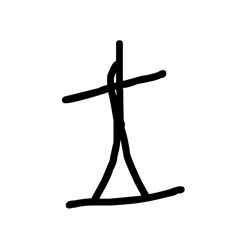

- source_zip_member: `Sub-character Images/hftl4m18q0/hftl4m18q0/hczgkhzlgf.png`
- checksum_sha256: see `06_component-visual-index.csv`.
- review_status: `needs_human_visual_review`
- caution: source-marked review image only.

## asset-019591

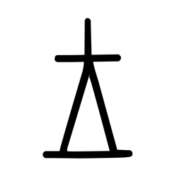

- source_zip_member: `Sub-character Images/hftl4m18q0/hftl4m18q0/hftl4m18q0.png`
- checksum_sha256: see `06_component-visual-index.csv`.
- review_status: `needs_human_visual_review`
- caution: source-marked review image only.

## asset-019592

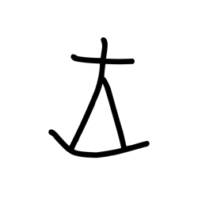

- source_zip_member: `Sub-character Images/hftl4m18q0/hftl4m18q0/jn53s1idiw.png`
- checksum_sha256: see `06_component-visual-index.csv`.
- review_status: `needs_human_visual_review`
- caution: source-marked review image only.

## asset-019593

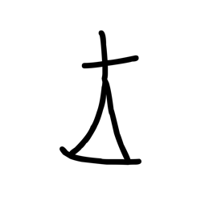

- source_zip_member: `Sub-character Images/hftl4m18q0/hftl4m18q0/ldnrze7cs1.png`
- checksum_sha256: see `06_component-visual-index.csv`.
- review_status: `needs_human_visual_review`
- caution: source-marked review image only.

## asset-019594

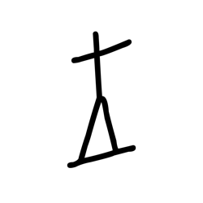

- source_zip_member: `Sub-character Images/hftl4m18q0/hftl4m18q0/lsbv30cg3w.png`
- checksum_sha256: see `06_component-visual-index.csv`.
- review_status: `needs_human_visual_review`
- caution: source-marked review image only.

## asset-019595

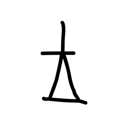

- source_zip_member: `Sub-character Images/hftl4m18q0/hftl4m18q0/m9xx696duh.png`
- checksum_sha256: see `06_component-visual-index.csv`.
- review_status: `needs_human_visual_review`
- caution: source-marked review image only.

## asset-019596

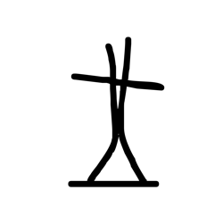

- source_zip_member: `Sub-character Images/hftl4m18q0/hftl4m18q0/md3z8t6hu1.png`
- checksum_sha256: see `06_component-visual-index.csv`.
- review_status: `needs_human_visual_review`
- caution: source-marked review image only.

## asset-019597

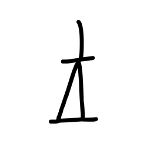

- source_zip_member: `Sub-character Images/hftl4m18q0/hftl4m18q0/nsdd8fbl6l.png`
- checksum_sha256: see `06_component-visual-index.csv`.
- review_status: `needs_human_visual_review`
- caution: source-marked review image only.

## asset-019598

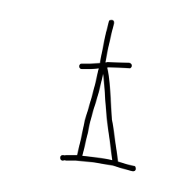

- source_zip_member: `Sub-character Images/hftl4m18q0/hftl4m18q0/o7pzc59m2p.png`
- checksum_sha256: see `06_component-visual-index.csv`.
- review_status: `needs_human_visual_review`
- caution: source-marked review image only.

## asset-019599

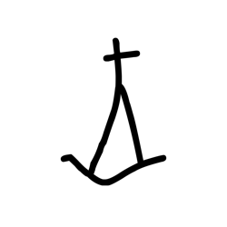

- source_zip_member: `Sub-character Images/hftl4m18q0/hftl4m18q0/obr7tfzy9d.png`
- checksum_sha256: see `06_component-visual-index.csv`.
- review_status: `needs_human_visual_review`
- caution: source-marked review image only.

## asset-019600

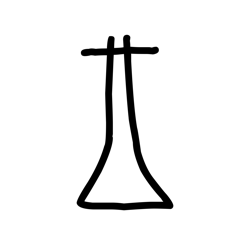

- source_zip_member: `Sub-character Images/hftl4m18q0/hftl4m18q0/p2c7i7onc8.png`
- checksum_sha256: see `06_component-visual-index.csv`.
- review_status: `needs_human_visual_review`
- caution: source-marked review image only.

## asset-019601

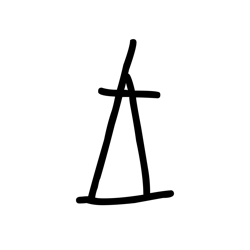

- source_zip_member: `Sub-character Images/hftl4m18q0/hftl4m18q0/rm860ix2dy.png`
- checksum_sha256: see `06_component-visual-index.csv`.
- review_status: `needs_human_visual_review`
- caution: source-marked review image only.

## asset-019602

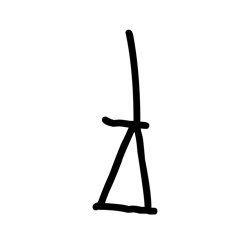

- source_zip_member: `Sub-character Images/hftl4m18q0/hftl4m18q0/t6jfzrtcq4.png`
- checksum_sha256: see `06_component-visual-index.csv`.
- review_status: `needs_human_visual_review`
- caution: source-marked review image only.

## asset-019603

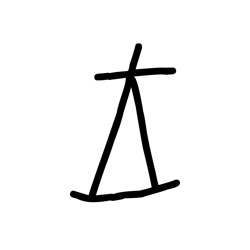

- source_zip_member: `Sub-character Images/hftl4m18q0/hftl4m18q0/u5c7dpzrly.png`
- checksum_sha256: see `06_component-visual-index.csv`.
- review_status: `needs_human_visual_review`
- caution: source-marked review image only.

## asset-019604

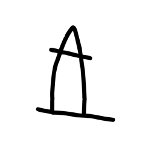

- source_zip_member: `Sub-character Images/hftl4m18q0/hftl4m18q0/vc7dkv0dzu.png`
- checksum_sha256: see `06_component-visual-index.csv`.
- review_status: `needs_human_visual_review`
- caution: source-marked review image only.

## asset-019605

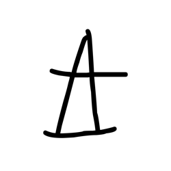

- source_zip_member: `Sub-character Images/hftl4m18q0/hftl4m18q0/xs1ll1fndq.png`
- checksum_sha256: see `06_component-visual-index.csv`.
- review_status: `needs_human_visual_review`
- caution: source-marked review image only.

## asset-019606

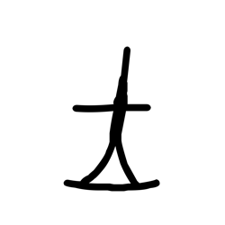

- source_zip_member: `Sub-character Images/hftl4m18q0/hftl4m18q0/ybosz0hihg.png`
- checksum_sha256: see `06_component-visual-index.csv`.
- review_status: `needs_human_visual_review`
- caution: source-marked review image only.

## asset-019607

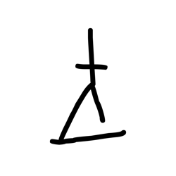

- source_zip_member: `Sub-character Images/hftl4m18q0/hftl4m18q0/z5lduwpflx.png`
- checksum_sha256: see `06_component-visual-index.csv`.
- review_status: `needs_human_visual_review`
- caution: source-marked review image only.

## asset-019608

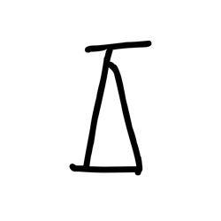

- source_zip_member: `Sub-character Images/hftl4m18q0/hftl4m18q0/z97us1ri0z.png`
- checksum_sha256: see `06_component-visual-index.csv`.
- review_status: `needs_human_visual_review`
- caution: source-marked review image only.

## asset-019609

- source_zip_member: `Sub-character Images/hftl4m18q0/hftl4m18q0/ziclqkeb3p.png`
- checksum_sha256: see `06_component-visual-index.csv`.
- review_status: `needs_human_visual_review`
- caution: source-marked review image only.
