# Component Visual Gallery / 构件图像查看: obs-comp-cand-002117

English:
This page displays OBIMD subcharacter PNG assets extracted into this concrete corpus object directory for human review.

简体中文：
本页展示抽取到当前具体 corpus 对象目录内的 OBIMD subcharacter PNG 资料，供人工复核使用。

Boundary / 边界：dataset image candidate only; not a confirmed component form, component assignment, or decipherment claim.

## asset-019615

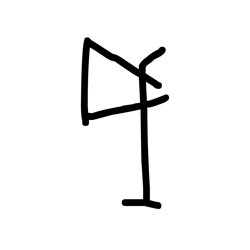

- source_zip_member: `Sub-character Images/7gvythc7mi/7gvythc7mi/05a6mqg8we.png`
- checksum_sha256: `5473fce831f5bb7f9e6bf3a6edc1922974be60a01797828245ce93fc9aff6772`
- review_status: `needs_human_visual_review`
- caution: OBIMD subcharacter image is a source-marked review asset only; it is not a confirmed component form, component assignment, or decipherment conclusion.

## asset-019616

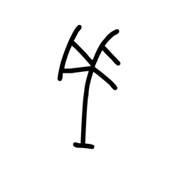

- source_zip_member: `Sub-character Images/7gvythc7mi/7gvythc7mi/1fkiqv0tv2.png`
- checksum_sha256: `f7bb072bf1535dd32b6fbfcb683fc96a3f00e60232de87d26c771466fbca5b68`
- review_status: `needs_human_visual_review`
- caution: OBIMD subcharacter image is a source-marked review asset only; it is not a confirmed component form, component assignment, or decipherment conclusion.

## asset-019617

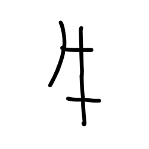

- source_zip_member: `Sub-character Images/7gvythc7mi/7gvythc7mi/2a6d6bhvyk.png`
- checksum_sha256: `1bb3c5f19ab2f2d16136ef956af00e1b9b59aa263049740731e681bfbc8eb2a9`
- review_status: `needs_human_visual_review`
- caution: OBIMD subcharacter image is a source-marked review asset only; it is not a confirmed component form, component assignment, or decipherment conclusion.

## asset-019618

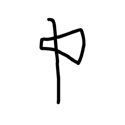

- source_zip_member: `Sub-character Images/7gvythc7mi/7gvythc7mi/328vxqedgc.png`
- checksum_sha256: `8e9c70393dc8ec96fafd2c8b86b841585176278c9f71f53277121ca4645cfafe`
- review_status: `needs_human_visual_review`
- caution: OBIMD subcharacter image is a source-marked review asset only; it is not a confirmed component form, component assignment, or decipherment conclusion.

## asset-019619

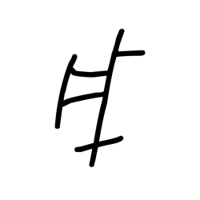

- source_zip_member: `Sub-character Images/7gvythc7mi/7gvythc7mi/3mrom5qc0m.png`
- checksum_sha256: `941f9f0261f41da36526b4ebb22532638b316ea3c2030a807385c8306ba95146`
- review_status: `needs_human_visual_review`
- caution: OBIMD subcharacter image is a source-marked review asset only; it is not a confirmed component form, component assignment, or decipherment conclusion.

## asset-019620

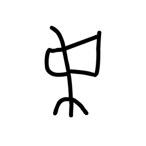

- source_zip_member: `Sub-character Images/7gvythc7mi/7gvythc7mi/3yks2e73zr.png`
- checksum_sha256: `3f7255efafb98b1d9ba72dc3db2e4617276706d416aade9040e8a1a4ef635356`
- review_status: `needs_human_visual_review`
- caution: OBIMD subcharacter image is a source-marked review asset only; it is not a confirmed component form, component assignment, or decipherment conclusion.

## asset-019621

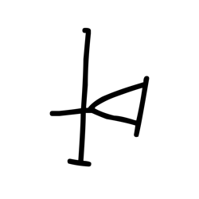

- source_zip_member: `Sub-character Images/7gvythc7mi/7gvythc7mi/4bjj249f7t.png`
- checksum_sha256: `25d23af4c5a49775cc2647174bcef275ba57f09b26d9ac29822988ed237d1366`
- review_status: `needs_human_visual_review`
- caution: OBIMD subcharacter image is a source-marked review asset only; it is not a confirmed component form, component assignment, or decipherment conclusion.

## asset-019622

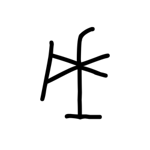

- source_zip_member: `Sub-character Images/7gvythc7mi/7gvythc7mi/5b4phca3bg.png`
- checksum_sha256: `9bca2c4f68aaa8b36b9a80a9e2c94fac61bb29778c8fc2419bf3c22520499c6d`
- review_status: `needs_human_visual_review`
- caution: OBIMD subcharacter image is a source-marked review asset only; it is not a confirmed component form, component assignment, or decipherment conclusion.

## asset-019623

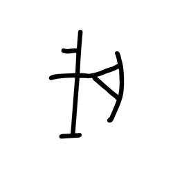

- source_zip_member: `Sub-character Images/7gvythc7mi/7gvythc7mi/5bgzlujwtn.png`
- checksum_sha256: `fe2d8450aa770ae24bb3e3532748c18da0d5f5275cd909bdf07d6a36a3edec51`
- review_status: `needs_human_visual_review`
- caution: OBIMD subcharacter image is a source-marked review asset only; it is not a confirmed component form, component assignment, or decipherment conclusion.

## asset-019624

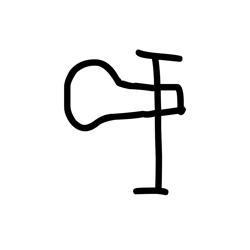

- source_zip_member: `Sub-character Images/7gvythc7mi/7gvythc7mi/5uzgugkxu1.png`
- checksum_sha256: `03331d3a7fe7cc16b99c1b43a4cb21a0250acd0c560262fa66190b3294d6f253`
- review_status: `needs_human_visual_review`
- caution: OBIMD subcharacter image is a source-marked review asset only; it is not a confirmed component form, component assignment, or decipherment conclusion.

## asset-019625

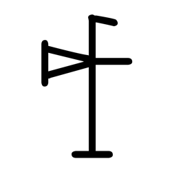

- source_zip_member: `Sub-character Images/7gvythc7mi/7gvythc7mi/7gvythc7mi.png`
- checksum_sha256: `d7f70124d2f4da536a9847979c8a80bdbe1a98834ee246a6ae700af0ffb90802`
- review_status: `needs_human_visual_review`
- caution: OBIMD subcharacter image is a source-marked review asset only; it is not a confirmed component form, component assignment, or decipherment conclusion.

## asset-019626

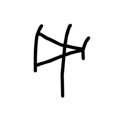

- source_zip_member: `Sub-character Images/7gvythc7mi/7gvythc7mi/9bwauupugx.png`
- checksum_sha256: `34ede2e54e8cffbf399fa41ce5a41a4e9774c8a471169fa016f69bcc00929c24`
- review_status: `needs_human_visual_review`
- caution: OBIMD subcharacter image is a source-marked review asset only; it is not a confirmed component form, component assignment, or decipherment conclusion.

## asset-019627

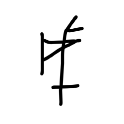

- source_zip_member: `Sub-character Images/7gvythc7mi/7gvythc7mi/9e87hshu3m.png`
- checksum_sha256: `fd8a608ee67277e195277243e9e630c7a42538b8c6b6d976f7051292ca7a3f5f`
- review_status: `needs_human_visual_review`
- caution: OBIMD subcharacter image is a source-marked review asset only; it is not a confirmed component form, component assignment, or decipherment conclusion.

## asset-019628

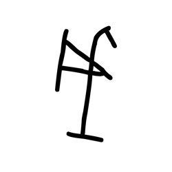

- source_zip_member: `Sub-character Images/7gvythc7mi/7gvythc7mi/9hzppzroxu.png`
- checksum_sha256: `ce67c5958a684682b970913414b74cba14186f71bf648712f527f014fa78fb34`
- review_status: `needs_human_visual_review`
- caution: OBIMD subcharacter image is a source-marked review asset only; it is not a confirmed component form, component assignment, or decipherment conclusion.

## asset-019629

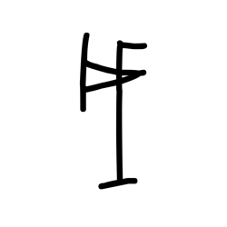

- source_zip_member: `Sub-character Images/7gvythc7mi/7gvythc7mi/9n3exfujpp.png`
- checksum_sha256: `6dfd767c9c84bf5bea0039b2cd1bad93d2f48debd717bdc2cdf81392b5d8acd7`
- review_status: `needs_human_visual_review`
- caution: OBIMD subcharacter image is a source-marked review asset only; it is not a confirmed component form, component assignment, or decipherment conclusion.

## asset-019630

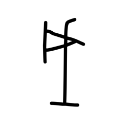

- source_zip_member: `Sub-character Images/7gvythc7mi/7gvythc7mi/9ytrtqjgy9.png`
- checksum_sha256: `d4cdc1ad6ac8b296ca23c40202e19fb0a91a878e8c95e7c6d83733ba4bd14691`
- review_status: `needs_human_visual_review`
- caution: OBIMD subcharacter image is a source-marked review asset only; it is not a confirmed component form, component assignment, or decipherment conclusion.

## asset-019631

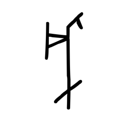

- source_zip_member: `Sub-character Images/7gvythc7mi/7gvythc7mi/9zijuz0znj.png`
- checksum_sha256: `0ae5a06cd3a178af903263fea3575486a30a425656b3b4ab5c81f91dd8855e1c`
- review_status: `needs_human_visual_review`
- caution: OBIMD subcharacter image is a source-marked review asset only; it is not a confirmed component form, component assignment, or decipherment conclusion.

## asset-019632

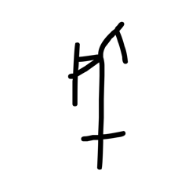

- source_zip_member: `Sub-character Images/7gvythc7mi/7gvythc7mi/anhjffbe0t.png`
- checksum_sha256: `b81c891437d551f948a1430299b66e58b8f1e39b9221389e8ac3266bbed77eb8`
- review_status: `needs_human_visual_review`
- caution: OBIMD subcharacter image is a source-marked review asset only; it is not a confirmed component form, component assignment, or decipherment conclusion.

## asset-019633

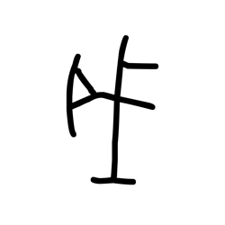

- source_zip_member: `Sub-character Images/7gvythc7mi/7gvythc7mi/bj454gasoe.png`
- checksum_sha256: `e87a9d94b2f78468bbefceeecd3f45541c2c0bf79319f405b06c93f49be55abe`
- review_status: `needs_human_visual_review`
- caution: OBIMD subcharacter image is a source-marked review asset only; it is not a confirmed component form, component assignment, or decipherment conclusion.

## asset-019634

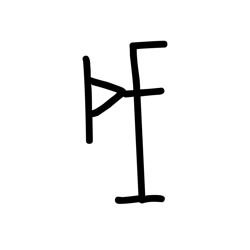

- source_zip_member: `Sub-character Images/7gvythc7mi/7gvythc7mi/bxq836zr1f.png`
- checksum_sha256: `f7feb2f14241c969cd6a6f6bcc9871bbdc6146ba3c6230bb489214a8c5fdea93`
- review_status: `needs_human_visual_review`
- caution: OBIMD subcharacter image is a source-marked review asset only; it is not a confirmed component form, component assignment, or decipherment conclusion.

## asset-019635

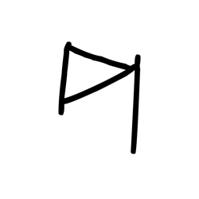

- source_zip_member: `Sub-character Images/7gvythc7mi/7gvythc7mi/bz5f7ep644.png`
- checksum_sha256: `c26f4f0ba55e19158ed57beecf00fda877ed99e8dc0fe0ef921a3e16ada3d10c`
- review_status: `needs_human_visual_review`
- caution: OBIMD subcharacter image is a source-marked review asset only; it is not a confirmed component form, component assignment, or decipherment conclusion.

## asset-019636

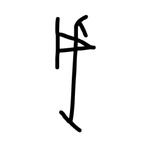

- source_zip_member: `Sub-character Images/7gvythc7mi/7gvythc7mi/c4wlmm8852.png`
- checksum_sha256: `3b246f9970ad53bd22854bd85899037dc33e5f6e8f9654f4245daff8fc816872`
- review_status: `needs_human_visual_review`
- caution: OBIMD subcharacter image is a source-marked review asset only; it is not a confirmed component form, component assignment, or decipherment conclusion.

## asset-019637

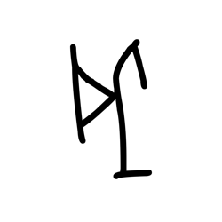

- source_zip_member: `Sub-character Images/7gvythc7mi/7gvythc7mi/dpjtns3e0v.png`
- checksum_sha256: `7601fb0a6e1bd395aa5715badaaa8032604313a4914a4eb8023ddc4083d6be3f`
- review_status: `needs_human_visual_review`
- caution: OBIMD subcharacter image is a source-marked review asset only; it is not a confirmed component form, component assignment, or decipherment conclusion.

## asset-019638

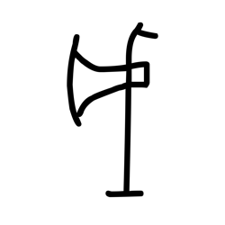

- source_zip_member: `Sub-character Images/7gvythc7mi/7gvythc7mi/e3sh2bwn1x.png`
- checksum_sha256: `a6347ad6ede078e45596a381b357d5c23fd84988f2aeaea7f77f235663e8b700`
- review_status: `needs_human_visual_review`
- caution: OBIMD subcharacter image is a source-marked review asset only; it is not a confirmed component form, component assignment, or decipherment conclusion.

## asset-019639

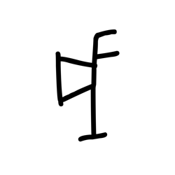

- source_zip_member: `Sub-character Images/7gvythc7mi/7gvythc7mi/eiq7q5vaz1.png`
- checksum_sha256: `cc93096f18af1b645a22346aacdc4dec74998475de49c68aa8ca5ca217ca8c9d`
- review_status: `needs_human_visual_review`
- caution: OBIMD subcharacter image is a source-marked review asset only; it is not a confirmed component form, component assignment, or decipherment conclusion.

## asset-019640

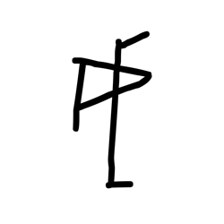

- source_zip_member: `Sub-character Images/7gvythc7mi/7gvythc7mi/gir4dk80r6.png`
- checksum_sha256: `10c847ddafb930d98064476be15701ad5c626f69bcdfc3af37c8591649d7f332`
- review_status: `needs_human_visual_review`
- caution: OBIMD subcharacter image is a source-marked review asset only; it is not a confirmed component form, component assignment, or decipherment conclusion.

## asset-019641

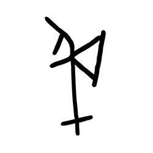

- source_zip_member: `Sub-character Images/7gvythc7mi/7gvythc7mi/hchvo67eh4.png`
- checksum_sha256: `a62b23c1ebc7671799adf9ee9b4fdf35c0b5a36d15172dae031ea56b85241715`
- review_status: `needs_human_visual_review`
- caution: OBIMD subcharacter image is a source-marked review asset only; it is not a confirmed component form, component assignment, or decipherment conclusion.

## asset-019642

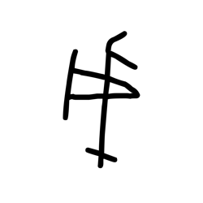

- source_zip_member: `Sub-character Images/7gvythc7mi/7gvythc7mi/hhuhr9io4b.png`
- checksum_sha256: `c5a617a5bed14a74b5dd82f3c621dfa72a1823b7b1877e16f67ce03cd471d2bb`
- review_status: `needs_human_visual_review`
- caution: OBIMD subcharacter image is a source-marked review asset only; it is not a confirmed component form, component assignment, or decipherment conclusion.

## asset-019643

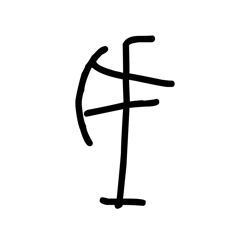

- source_zip_member: `Sub-character Images/7gvythc7mi/7gvythc7mi/hwbpc9b8yt.png`
- checksum_sha256: `df586b1965c7936b314f85ff3cc79e9ee89409eee0c61267cb4f044faf0ec724`
- review_status: `needs_human_visual_review`
- caution: OBIMD subcharacter image is a source-marked review asset only; it is not a confirmed component form, component assignment, or decipherment conclusion.

## asset-019644

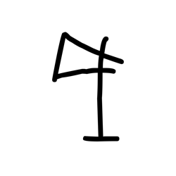

- source_zip_member: `Sub-character Images/7gvythc7mi/7gvythc7mi/iusjvdpnt3.png`
- checksum_sha256: `3f9e658cfd871beb755da40ae873d34edff072fa31813717df54eae953358c2c`
- review_status: `needs_human_visual_review`
- caution: OBIMD subcharacter image is a source-marked review asset only; it is not a confirmed component form, component assignment, or decipherment conclusion.

## asset-019645

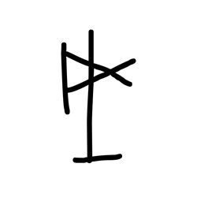

- source_zip_member: `Sub-character Images/7gvythc7mi/7gvythc7mi/j3s6jodp3c.png`
- checksum_sha256: `86631e81a868882f62c0a048e48e2056af8a0779f72195067ea1224b85388eba`
- review_status: `needs_human_visual_review`
- caution: OBIMD subcharacter image is a source-marked review asset only; it is not a confirmed component form, component assignment, or decipherment conclusion.

## asset-019646

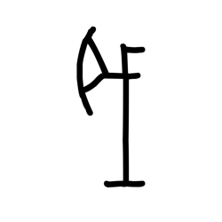

- source_zip_member: `Sub-character Images/7gvythc7mi/7gvythc7mi/jcqsy4ytb1.png`
- checksum_sha256: `aee72c9ece92d5bd0e8b2d4ae2658d29a3fbf0149a6b69d82219cd30006cdbdc`
- review_status: `needs_human_visual_review`
- caution: OBIMD subcharacter image is a source-marked review asset only; it is not a confirmed component form, component assignment, or decipherment conclusion.

## asset-019647

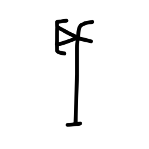

- source_zip_member: `Sub-character Images/7gvythc7mi/7gvythc7mi/jhi9cmpzy8.png`
- checksum_sha256: `2f8284845bf294e5dd6c763f14ebb9aed09546e824b272c88aecac8c0a0c3364`
- review_status: `needs_human_visual_review`
- caution: OBIMD subcharacter image is a source-marked review asset only; it is not a confirmed component form, component assignment, or decipherment conclusion.

## asset-019648

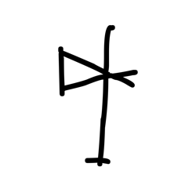

- source_zip_member: `Sub-character Images/7gvythc7mi/7gvythc7mi/jzah0lh40j.png`
- checksum_sha256: `f6dade9dcfa2b2107e1b7ac5dd57d3cfddeaca31f1c2137fddca959f9e8f34b5`
- review_status: `needs_human_visual_review`
- caution: OBIMD subcharacter image is a source-marked review asset only; it is not a confirmed component form, component assignment, or decipherment conclusion.

## asset-019649

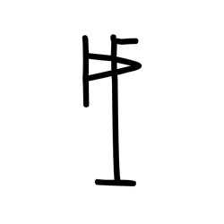

- source_zip_member: `Sub-character Images/7gvythc7mi/7gvythc7mi/k8i8q3jrm7.png`
- checksum_sha256: `911d6a28412d8c3632482a67f083bca59fbd49f6a4d40c880dc3ddbf21bd26ef`
- review_status: `needs_human_visual_review`
- caution: OBIMD subcharacter image is a source-marked review asset only; it is not a confirmed component form, component assignment, or decipherment conclusion.

## asset-019650

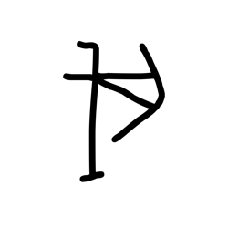

- source_zip_member: `Sub-character Images/7gvythc7mi/7gvythc7mi/kec7lb0hoa.png`
- checksum_sha256: `ce8d625255928494d8ffce5702591cff1a143da42b598046e10dcb76824a18ec`
- review_status: `needs_human_visual_review`
- caution: OBIMD subcharacter image is a source-marked review asset only; it is not a confirmed component form, component assignment, or decipherment conclusion.

## asset-019651

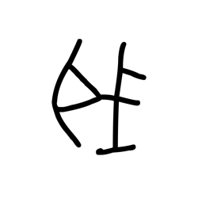

- source_zip_member: `Sub-character Images/7gvythc7mi/7gvythc7mi/kiwwccxcph.png`
- checksum_sha256: `29e24e3d5af055b0f5e9be0fbd11e5e2649723dc3cf98bbc86debf144e4b231c`
- review_status: `needs_human_visual_review`
- caution: OBIMD subcharacter image is a source-marked review asset only; it is not a confirmed component form, component assignment, or decipherment conclusion.

## asset-019652

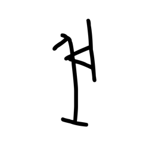

- source_zip_member: `Sub-character Images/7gvythc7mi/7gvythc7mi/kt2f4aqpck.png`
- checksum_sha256: `71f9e38a207d7d9baa3bc266a73d1aba75837dff0d46ee597ebefbc51ac55ac5`
- review_status: `needs_human_visual_review`
- caution: OBIMD subcharacter image is a source-marked review asset only; it is not a confirmed component form, component assignment, or decipherment conclusion.

## asset-019653

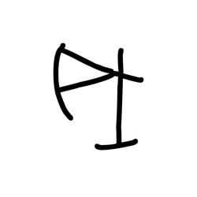

- source_zip_member: `Sub-character Images/7gvythc7mi/7gvythc7mi/lcviu8vir7.png`
- checksum_sha256: `f4d254d4882a60a1f15909172fde562ccc7a4cad6efe24bd3db658ab426e8334`
- review_status: `needs_human_visual_review`
- caution: OBIMD subcharacter image is a source-marked review asset only; it is not a confirmed component form, component assignment, or decipherment conclusion.

## asset-019654

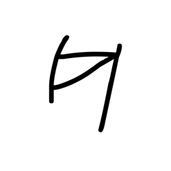

- source_zip_member: `Sub-character Images/7gvythc7mi/7gvythc7mi/li3f1bl96s.png`
- checksum_sha256: `1ac810034f1ea7d256b01829cc756fe3270fb9e9f0f4ab90b2ff27cec8ec5b80`
- review_status: `needs_human_visual_review`
- caution: OBIMD subcharacter image is a source-marked review asset only; it is not a confirmed component form, component assignment, or decipherment conclusion.

## asset-019655

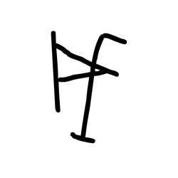

- source_zip_member: `Sub-character Images/7gvythc7mi/7gvythc7mi/ljv5h3ib7l.png`
- checksum_sha256: `388ca76b16a94c1a33ce8b36d5b9a619ed47fa43f6297b34a6d5a811790fa3ad`
- review_status: `needs_human_visual_review`
- caution: OBIMD subcharacter image is a source-marked review asset only; it is not a confirmed component form, component assignment, or decipherment conclusion.

## asset-019656

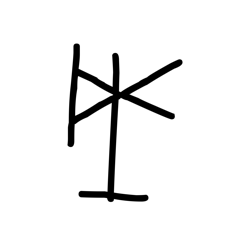

- source_zip_member: `Sub-character Images/7gvythc7mi/7gvythc7mi/n810b7nju0.png`
- checksum_sha256: `62e1933daabd2b286347eb1ebc93eaa83d268942ce8c0ad8dff336490132160f`
- review_status: `needs_human_visual_review`
- caution: OBIMD subcharacter image is a source-marked review asset only; it is not a confirmed component form, component assignment, or decipherment conclusion.

## asset-019657

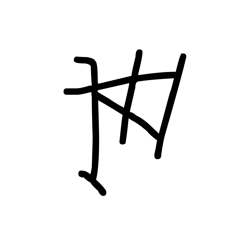

- source_zip_member: `Sub-character Images/7gvythc7mi/7gvythc7mi/nkj7v2cxca.png`
- checksum_sha256: `a457d988d18cd65be5cd0355a9c633654b2630c6e68e11a0ff28d675618342d0`
- review_status: `needs_human_visual_review`
- caution: OBIMD subcharacter image is a source-marked review asset only; it is not a confirmed component form, component assignment, or decipherment conclusion.

## asset-019658

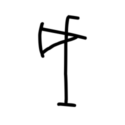

- source_zip_member: `Sub-character Images/7gvythc7mi/7gvythc7mi/pabeherky2.png`
- checksum_sha256: `ba1ea0ce6dac06ba795edbe087d749026496c90d7de0ce2220ca644c805a65d4`
- review_status: `needs_human_visual_review`
- caution: OBIMD subcharacter image is a source-marked review asset only; it is not a confirmed component form, component assignment, or decipherment conclusion.

## asset-019659

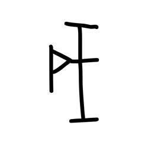

- source_zip_member: `Sub-character Images/7gvythc7mi/7gvythc7mi/pmit27p3xz.png`
- checksum_sha256: `d5d904d8b861b96b4b3f3d259e76aff307ce5a54bf9e3e6e28e03c77f34d9b9d`
- review_status: `needs_human_visual_review`
- caution: OBIMD subcharacter image is a source-marked review asset only; it is not a confirmed component form, component assignment, or decipherment conclusion.

## asset-019660

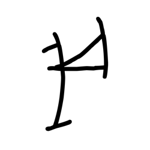

- source_zip_member: `Sub-character Images/7gvythc7mi/7gvythc7mi/q57php6wx9.png`
- checksum_sha256: `c56b535e718a76b870ca5b01861e5ae473254af3b1bde66c62b64b5b2c9afb15`
- review_status: `needs_human_visual_review`
- caution: OBIMD subcharacter image is a source-marked review asset only; it is not a confirmed component form, component assignment, or decipherment conclusion.

## asset-019661

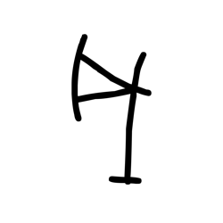

- source_zip_member: `Sub-character Images/7gvythc7mi/7gvythc7mi/r6w7y8sx0a.png`
- checksum_sha256: `fe76cc7c3acacf822a39416da59be23f774020735739190ddafc0ec57f031bde`
- review_status: `needs_human_visual_review`
- caution: OBIMD subcharacter image is a source-marked review asset only; it is not a confirmed component form, component assignment, or decipherment conclusion.

## asset-019662

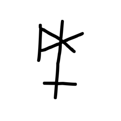

- source_zip_member: `Sub-character Images/7gvythc7mi/7gvythc7mi/rblebs7nts.png`
- checksum_sha256: `72a3cd504ab6e633f50c5397520f12ab4f0ed1b3d6a9ea1cd3098dbd4eae1a84`
- review_status: `needs_human_visual_review`
- caution: OBIMD subcharacter image is a source-marked review asset only; it is not a confirmed component form, component assignment, or decipherment conclusion.

## asset-019663

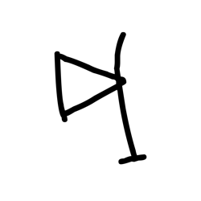

- source_zip_member: `Sub-character Images/7gvythc7mi/7gvythc7mi/sngbxgyu3s.png`
- checksum_sha256: `3b0e5bb77fe2a2298831dca00a1741685d882eb991c359bbea52b1d3bc8ba5a7`
- review_status: `needs_human_visual_review`
- caution: OBIMD subcharacter image is a source-marked review asset only; it is not a confirmed component form, component assignment, or decipherment conclusion.

## asset-019664

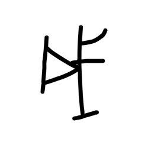

- source_zip_member: `Sub-character Images/7gvythc7mi/7gvythc7mi/trpllkmvkc.png`
- checksum_sha256: `a5720a971e19936355d779bfa0b2f835f55802e2587da3d0b72deb166fcccbf7`
- review_status: `needs_human_visual_review`
- caution: OBIMD subcharacter image is a source-marked review asset only; it is not a confirmed component form, component assignment, or decipherment conclusion.

## asset-019665

- source_zip_member: `Sub-character Images/7gvythc7mi/7gvythc7mi/vkuix92vth.png`
- checksum_sha256: `55505781c19d15b64ac764364a84ce5c79254b7faf955ed27e2b5547f579c8f7`
- review_status: `needs_human_visual_review`
- caution: OBIMD subcharacter image is a source-marked review asset only; it is not a confirmed component form, component assignment, or decipherment conclusion.

## asset-019666

- source_zip_member: `Sub-character Images/7gvythc7mi/7gvythc7mi/vr0cvrwysv.png`
- checksum_sha256: `d72ba8dea106ebf7780c952a0195f9de80a0bd6626fa9e2c6e534eb28b391517`
- review_status: `needs_human_visual_review`
- caution: OBIMD subcharacter image is a source-marked review asset only; it is not a confirmed component form, component assignment, or decipherment conclusion.

## asset-019667

- source_zip_member: `Sub-character Images/7gvythc7mi/7gvythc7mi/vr3lnd6w4s.png`
- checksum_sha256: `6d3006d238dd1d3eeb65f678b65b0fa781cccfa4bfee55503e0152f117095716`
- review_status: `needs_human_visual_review`
- caution: OBIMD subcharacter image is a source-marked review asset only; it is not a confirmed component form, component assignment, or decipherment conclusion.

## asset-019668

- source_zip_member: `Sub-character Images/7gvythc7mi/7gvythc7mi/w6zxpgwe44.png`
- checksum_sha256: `6c93cf6d5b725c6dc7c3be1ce7a65eea316a4fba7f8fda33a5b17f78878f8df3`
- review_status: `needs_human_visual_review`
- caution: OBIMD subcharacter image is a source-marked review asset only; it is not a confirmed component form, component assignment, or decipherment conclusion.

## asset-019669

- source_zip_member: `Sub-character Images/7gvythc7mi/7gvythc7mi/wgfuurmzty.png`
- checksum_sha256: `7d64d08d13b40af6210b24737010767457ff2f7f436d2835bb6a9e766cf7a6e9`
- review_status: `needs_human_visual_review`
- caution: OBIMD subcharacter image is a source-marked review asset only; it is not a confirmed component form, component assignment, or decipherment conclusion.

## asset-019670

- source_zip_member: `Sub-character Images/7gvythc7mi/7gvythc7mi/wjzl6k21rx.png`
- checksum_sha256: `fa56fbd65813610a14ce5f2babaebc4dc31177760ea25cf0d1643f5fbd1eb38e`
- review_status: `needs_human_visual_review`
- caution: OBIMD subcharacter image is a source-marked review asset only; it is not a confirmed component form, component assignment, or decipherment conclusion.

## asset-019671

- source_zip_member: `Sub-character Images/7gvythc7mi/7gvythc7mi/xbenct7u6v.png`
- checksum_sha256: `1bf20edf89047a40b62deee1c6ea2b3a76fbd6311fd837a7efa4d1f191befcf8`
- review_status: `needs_human_visual_review`
- caution: OBIMD subcharacter image is a source-marked review asset only; it is not a confirmed component form, component assignment, or decipherment conclusion.

## asset-019672

- source_zip_member: `Sub-character Images/7gvythc7mi/7gvythc7mi/xom5r7zs47.png`
- checksum_sha256: `6ddb533d4021acf7ed5b3d005e353036cbc02de6c76bc0ccf14456ed90f91223`
- review_status: `needs_human_visual_review`
- caution: OBIMD subcharacter image is a source-marked review asset only; it is not a confirmed component form, component assignment, or decipherment conclusion.

## asset-019673

- source_zip_member: `Sub-character Images/7gvythc7mi/7gvythc7mi/xxwwecvi26.png`
- checksum_sha256: `d9d100ff545fad6d9b98f4c785ab19053cf0f2a59101b2a0fad40edfe138b11d`
- review_status: `needs_human_visual_review`
- caution: OBIMD subcharacter image is a source-marked review asset only; it is not a confirmed component form, component assignment, or decipherment conclusion.

## asset-019674

- source_zip_member: `Sub-character Images/7gvythc7mi/7gvythc7mi/ywpvp8hyh3.png`
- checksum_sha256: `5268a4d2aac5fb70af094c63d90d2a7140978500af521c01cc22afa4342ff3f4`
- review_status: `needs_human_visual_review`
- caution: OBIMD subcharacter image is a source-marked review asset only; it is not a confirmed component form, component assignment, or decipherment conclusion.
