# Component Visual Gallery / 构件图像查看: obs-comp-cand-002139

English:
This page displays OBIMD subcharacter PNG assets extracted into this concrete
corpus object directory for human review.

简体中文：
本页展示抽取到当前具体 corpus 对象目录内的 OBIMD subcharacter PNG 资料，供人工复核使用。

Boundary / 边界：
dataset image candidate only; not a confirmed component form, not a component
assignment, and not a decipherment claim.
- not a confirmed component form
- not a component assignment
- not a decipherment claim

## Concrete Questions To Check / 具体待查问题

- Which local image should be opened first?
- 应先打开哪一张本地构件图像？
- Which source zip member anchors this image?
- 哪一个 source zip member 能定位这张图像？
- Which near-shape or variant comparison is still missing?
- 还缺哪些近形或异体比较？
- Which character or inscription context should be checked next?
- 下一步应核对哪些单字或卜辞上下文？
- What evidence is missing before a component assignment?
- 正式构件归属前还缺哪些证据？

## asset-019696

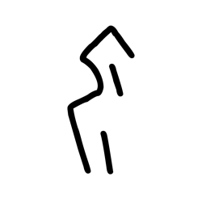

- source_zip_member: `Sub-character Images/6ewkk2w7r1/6ewkk2w7r1/2zrgcypexj.png`
- checksum_sha256: see `06_component-visual-index.csv`.
- review_status: `needs_human_visual_review`
- caution: source-marked review image only.

## asset-019697

- source_zip_member: `Sub-character Images/6ewkk2w7r1/6ewkk2w7r1/3r84ykfxe5.png`
- checksum_sha256: see `06_component-visual-index.csv`.
- review_status: `needs_human_visual_review`
- caution: source-marked review image only.

## asset-019698

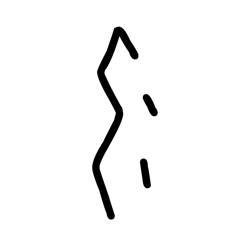

- source_zip_member: `Sub-character Images/6ewkk2w7r1/6ewkk2w7r1/659hlreybe.png`
- checksum_sha256: see `06_component-visual-index.csv`.
- review_status: `needs_human_visual_review`
- caution: source-marked review image only.

## asset-019699

- source_zip_member: `Sub-character Images/6ewkk2w7r1/6ewkk2w7r1/6ewkk2w7r1.png`
- checksum_sha256: see `06_component-visual-index.csv`.
- review_status: `needs_human_visual_review`
- caution: source-marked review image only.

## asset-019700

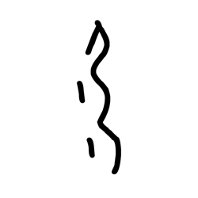

- source_zip_member: `Sub-character Images/6ewkk2w7r1/6ewkk2w7r1/6wq5z6syc5.png`
- checksum_sha256: see `06_component-visual-index.csv`.
- review_status: `needs_human_visual_review`
- caution: source-marked review image only.

## asset-019701

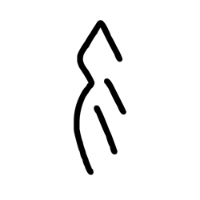

- source_zip_member: `Sub-character Images/6ewkk2w7r1/6ewkk2w7r1/7qryk1lnhm.png`
- checksum_sha256: see `06_component-visual-index.csv`.
- review_status: `needs_human_visual_review`
- caution: source-marked review image only.

## asset-019702

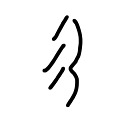

- source_zip_member: `Sub-character Images/6ewkk2w7r1/6ewkk2w7r1/7z06fpit14.png`
- checksum_sha256: see `06_component-visual-index.csv`.
- review_status: `needs_human_visual_review`
- caution: source-marked review image only.

## asset-019703

- source_zip_member: `Sub-character Images/6ewkk2w7r1/6ewkk2w7r1/9gt5uv85wp.png`
- checksum_sha256: see `06_component-visual-index.csv`.
- review_status: `needs_human_visual_review`
- caution: source-marked review image only.

## asset-019704

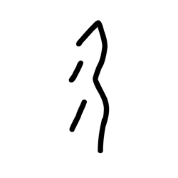

- source_zip_member: `Sub-character Images/6ewkk2w7r1/6ewkk2w7r1/a1h1iqp2o4.png`
- checksum_sha256: see `06_component-visual-index.csv`.
- review_status: `needs_human_visual_review`
- caution: source-marked review image only.

## asset-019705

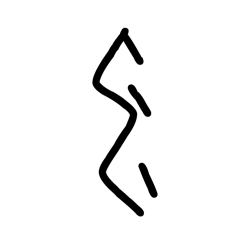

- source_zip_member: `Sub-character Images/6ewkk2w7r1/6ewkk2w7r1/bnx2rkpd73.png`
- checksum_sha256: see `06_component-visual-index.csv`.
- review_status: `needs_human_visual_review`
- caution: source-marked review image only.

## asset-019706

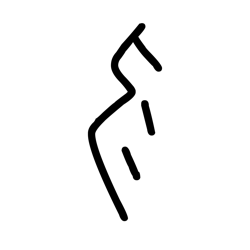

- source_zip_member: `Sub-character Images/6ewkk2w7r1/6ewkk2w7r1/bsuzyz3v78.png`
- checksum_sha256: see `06_component-visual-index.csv`.
- review_status: `needs_human_visual_review`
- caution: source-marked review image only.

## asset-019707

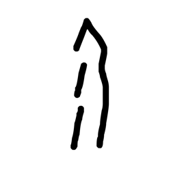

- source_zip_member: `Sub-character Images/6ewkk2w7r1/6ewkk2w7r1/cfhog1cmrg.png`
- checksum_sha256: see `06_component-visual-index.csv`.
- review_status: `needs_human_visual_review`
- caution: source-marked review image only.

## asset-019708

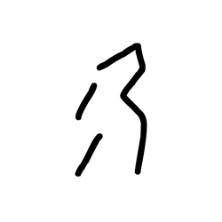

- source_zip_member: `Sub-character Images/6ewkk2w7r1/6ewkk2w7r1/d04qbrkxnc.png`
- checksum_sha256: see `06_component-visual-index.csv`.
- review_status: `needs_human_visual_review`
- caution: source-marked review image only.

## asset-019709

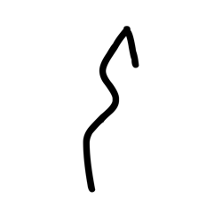

- source_zip_member: `Sub-character Images/6ewkk2w7r1/6ewkk2w7r1/d62t6hfd4c.png`
- checksum_sha256: see `06_component-visual-index.csv`.
- review_status: `needs_human_visual_review`
- caution: source-marked review image only.

## asset-019710

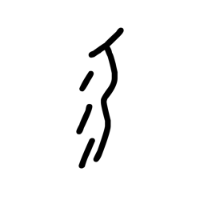

- source_zip_member: `Sub-character Images/6ewkk2w7r1/6ewkk2w7r1/f13mryy9wy.png`
- checksum_sha256: see `06_component-visual-index.csv`.
- review_status: `needs_human_visual_review`
- caution: source-marked review image only.

## asset-019711

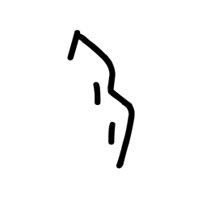

- source_zip_member: `Sub-character Images/6ewkk2w7r1/6ewkk2w7r1/fruj5yz29j.png`
- checksum_sha256: see `06_component-visual-index.csv`.
- review_status: `needs_human_visual_review`
- caution: source-marked review image only.

## asset-019712

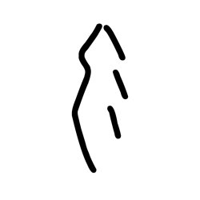

- source_zip_member: `Sub-character Images/6ewkk2w7r1/6ewkk2w7r1/gec6pc4ke6.png`
- checksum_sha256: see `06_component-visual-index.csv`.
- review_status: `needs_human_visual_review`
- caution: source-marked review image only.

## asset-019713

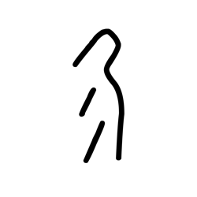

- source_zip_member: `Sub-character Images/6ewkk2w7r1/6ewkk2w7r1/gr005qk1cc.png`
- checksum_sha256: see `06_component-visual-index.csv`.
- review_status: `needs_human_visual_review`
- caution: source-marked review image only.

## asset-019714

- source_zip_member: `Sub-character Images/6ewkk2w7r1/6ewkk2w7r1/hfoevj2x60.png`
- checksum_sha256: see `06_component-visual-index.csv`.
- review_status: `needs_human_visual_review`
- caution: source-marked review image only.

## asset-019715

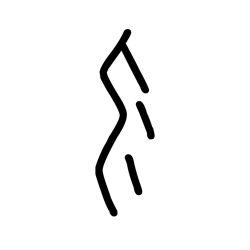

- source_zip_member: `Sub-character Images/6ewkk2w7r1/6ewkk2w7r1/lh6rkcg8ae.png`
- checksum_sha256: see `06_component-visual-index.csv`.
- review_status: `needs_human_visual_review`
- caution: source-marked review image only.

## asset-019716

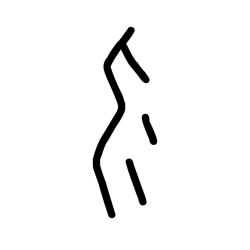

- source_zip_member: `Sub-character Images/6ewkk2w7r1/6ewkk2w7r1/ms4s1uor19.png`
- checksum_sha256: see `06_component-visual-index.csv`.
- review_status: `needs_human_visual_review`
- caution: source-marked review image only.

## asset-019717

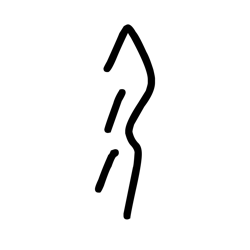

- source_zip_member: `Sub-character Images/6ewkk2w7r1/6ewkk2w7r1/pe3xl7jkhp.png`
- checksum_sha256: see `06_component-visual-index.csv`.
- review_status: `needs_human_visual_review`
- caution: source-marked review image only.

## asset-019718

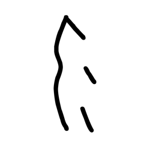

- source_zip_member: `Sub-character Images/6ewkk2w7r1/6ewkk2w7r1/su27ejpadu.png`
- checksum_sha256: see `06_component-visual-index.csv`.
- review_status: `needs_human_visual_review`
- caution: source-marked review image only.

## asset-019719

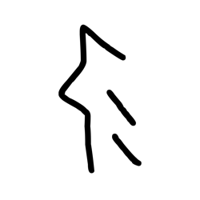

- source_zip_member: `Sub-character Images/6ewkk2w7r1/6ewkk2w7r1/tiii6atby7.png`
- checksum_sha256: see `06_component-visual-index.csv`.
- review_status: `needs_human_visual_review`
- caution: source-marked review image only.

## asset-019720

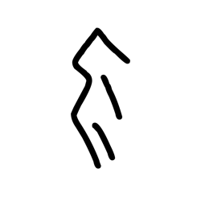

- source_zip_member: `Sub-character Images/6ewkk2w7r1/6ewkk2w7r1/uemq60abzz.png`
- checksum_sha256: see `06_component-visual-index.csv`.
- review_status: `needs_human_visual_review`
- caution: source-marked review image only.

## asset-019721

- source_zip_member: `Sub-character Images/6ewkk2w7r1/6ewkk2w7r1/vhlx1goxgk.png`
- checksum_sha256: see `06_component-visual-index.csv`.
- review_status: `needs_human_visual_review`
- caution: source-marked review image only.

## asset-019722

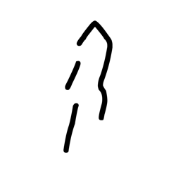

- source_zip_member: `Sub-character Images/6ewkk2w7r1/6ewkk2w7r1/wdr3vuunaa.png`
- checksum_sha256: see `06_component-visual-index.csv`.
- review_status: `needs_human_visual_review`
- caution: source-marked review image only.

## asset-019723

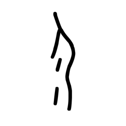

- source_zip_member: `Sub-character Images/6ewkk2w7r1/6ewkk2w7r1/x2pa15pkw8.png`
- checksum_sha256: see `06_component-visual-index.csv`.
- review_status: `needs_human_visual_review`
- caution: source-marked review image only.

## asset-019724

- source_zip_member: `Sub-character Images/6ewkk2w7r1/6ewkk2w7r1/xoczvriljt.png`
- checksum_sha256: see `06_component-visual-index.csv`.
- review_status: `needs_human_visual_review`
- caution: source-marked review image only.

## asset-019725

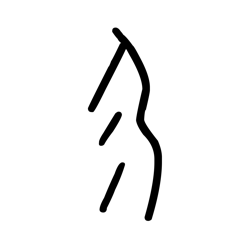

- source_zip_member: `Sub-character Images/6ewkk2w7r1/6ewkk2w7r1/y68trw3vly.png`
- checksum_sha256: see `06_component-visual-index.csv`.
- review_status: `needs_human_visual_review`
- caution: source-marked review image only.

## asset-019726

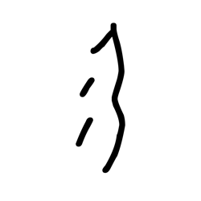

- source_zip_member: `Sub-character Images/6ewkk2w7r1/6ewkk2w7r1/ykifn8x355.png`
- checksum_sha256: see `06_component-visual-index.csv`.
- review_status: `needs_human_visual_review`
- caution: source-marked review image only.

## asset-019727

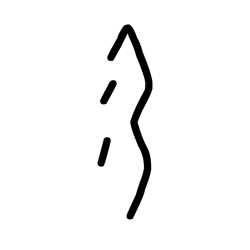

- source_zip_member: `Sub-character Images/6ewkk2w7r1/6ewkk2w7r1/zkzhfk3qb2.png`
- checksum_sha256: see `06_component-visual-index.csv`.
- review_status: `needs_human_visual_review`
- caution: source-marked review image only.
