# Component Visual Gallery / 构件图像查看: obs-comp-cand-002149

English:
This page displays OBIMD subcharacter PNG assets extracted into this concrete corpus object directory for human review.

简体中文：
本页展示抽取到当前具体 corpus 对象目录内的 OBIMD subcharacter PNG 资料，供人工复核使用。

Boundary / 边界：dataset image candidate only; not a confirmed component form, component assignment, or decipherment claim.

## asset-019737

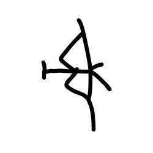

- source_zip_member: `Sub-character Images/k0pxsd02si/u0lilfr8as/0ppqfw5fp9.png`
- checksum_sha256: `a2e69224add11acb18c60a0ec08fefa9ddf5827c445c270a86ea0ba8058efcda`
- review_status: `needs_human_visual_review`
- caution: OBIMD subcharacter image is a source-marked review asset only; it is not a confirmed component form, component assignment, or decipherment conclusion.

## asset-019738

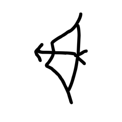

- source_zip_member: `Sub-character Images/k0pxsd02si/u0lilfr8as/3rqqni5uhn.png`
- checksum_sha256: `4896d543e2cee8c7b2800bef54bbe8bb105cec95fb6106b807ab05eff3bb9d7b`
- review_status: `needs_human_visual_review`
- caution: OBIMD subcharacter image is a source-marked review asset only; it is not a confirmed component form, component assignment, or decipherment conclusion.

## asset-019739

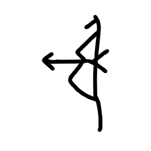

- source_zip_member: `Sub-character Images/k0pxsd02si/u0lilfr8as/4e7siytgnn.png`
- checksum_sha256: `12f3c8965e4c91e43f07ba3b3762621f4accab1b9f27c4fff3f9be0d59364d23`
- review_status: `needs_human_visual_review`
- caution: OBIMD subcharacter image is a source-marked review asset only; it is not a confirmed component form, component assignment, or decipherment conclusion.

## asset-019740

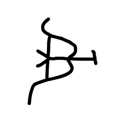

- source_zip_member: `Sub-character Images/k0pxsd02si/u0lilfr8as/4kkwtb6fon.png`
- checksum_sha256: `7633403c2f4972feee68170d87b84e4a6aabc13a9f68783f5115c0859373c47a`
- review_status: `needs_human_visual_review`
- caution: OBIMD subcharacter image is a source-marked review asset only; it is not a confirmed component form, component assignment, or decipherment conclusion.

## asset-019741

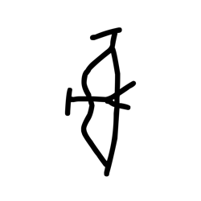

- source_zip_member: `Sub-character Images/k0pxsd02si/u0lilfr8as/5s5eed5t1v.png`
- checksum_sha256: `f36dbfe686199a60204ed231e22c64ffe50b45f2f52f810f6367ec645b674287`
- review_status: `needs_human_visual_review`
- caution: OBIMD subcharacter image is a source-marked review asset only; it is not a confirmed component form, component assignment, or decipherment conclusion.

## asset-019742

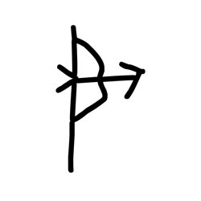

- source_zip_member: `Sub-character Images/k0pxsd02si/u0lilfr8as/7izkxjpdos.png`
- checksum_sha256: `ff704469febc72b1730cef6157c69665251c2f6b590af6a929081e5ef1eca598`
- review_status: `needs_human_visual_review`
- caution: OBIMD subcharacter image is a source-marked review asset only; it is not a confirmed component form, component assignment, or decipherment conclusion.

## asset-019743

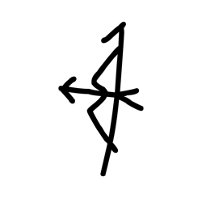

- source_zip_member: `Sub-character Images/k0pxsd02si/u0lilfr8as/7y6dz5popg.png`
- checksum_sha256: `ee4611fb5d3930a876edf7db63a478ef6344bf8a139a197788445c92fd99187b`
- review_status: `needs_human_visual_review`
- caution: OBIMD subcharacter image is a source-marked review asset only; it is not a confirmed component form, component assignment, or decipherment conclusion.

## asset-019744

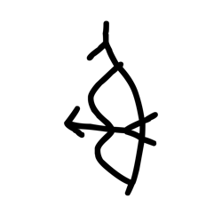

- source_zip_member: `Sub-character Images/k0pxsd02si/u0lilfr8as/8k8iiyajx2.png`
- checksum_sha256: `72d50e1c82dca132b53ceccad4715145836ddd23dfa358cb7f099ce03960f485`
- review_status: `needs_human_visual_review`
- caution: OBIMD subcharacter image is a source-marked review asset only; it is not a confirmed component form, component assignment, or decipherment conclusion.

## asset-019745

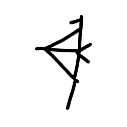

- source_zip_member: `Sub-character Images/k0pxsd02si/u0lilfr8as/9g6zd62ylz.png`
- checksum_sha256: `369aa32cc6afb29ae5b1f5c1d9d0a84935ce645d1db0d55c52b11e33462fcbb3`
- review_status: `needs_human_visual_review`
- caution: OBIMD subcharacter image is a source-marked review asset only; it is not a confirmed component form, component assignment, or decipherment conclusion.

## asset-019746

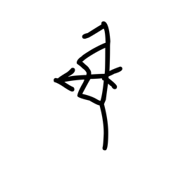

- source_zip_member: `Sub-character Images/k0pxsd02si/u0lilfr8as/a4yxungklj.png`
- checksum_sha256: `1b2a62c560aa2cf08c575724678e9d51ed30a52aa475db8c6697e6cf10f79f98`
- review_status: `needs_human_visual_review`
- caution: OBIMD subcharacter image is a source-marked review asset only; it is not a confirmed component form, component assignment, or decipherment conclusion.

## asset-019747

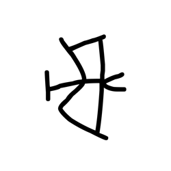

- source_zip_member: `Sub-character Images/k0pxsd02si/u0lilfr8as/a739nrzsm1.png`
- checksum_sha256: `ffd0e2c4a2de1eadb8efece48ac3ffa16db37b8848e42309e1e3c2940e77bb78`
- review_status: `needs_human_visual_review`
- caution: OBIMD subcharacter image is a source-marked review asset only; it is not a confirmed component form, component assignment, or decipherment conclusion.

## asset-019748

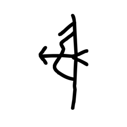

- source_zip_member: `Sub-character Images/k0pxsd02si/u0lilfr8as/ahiy7sj6in.png`
- checksum_sha256: `8701b8f7ff77a9d717ff052250f84be3a270827171ee85f134b59c2a3a97224e`
- review_status: `needs_human_visual_review`
- caution: OBIMD subcharacter image is a source-marked review asset only; it is not a confirmed component form, component assignment, or decipherment conclusion.

## asset-019749

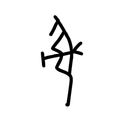

- source_zip_member: `Sub-character Images/k0pxsd02si/u0lilfr8as/bdkgdkzbhf.png`
- checksum_sha256: `1c24f1e71f0cac2f45b6d43adf484445959e28b8e9bae5f4243f820f08d61a4d`
- review_status: `needs_human_visual_review`
- caution: OBIMD subcharacter image is a source-marked review asset only; it is not a confirmed component form, component assignment, or decipherment conclusion.

## asset-019750

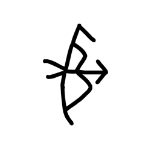

- source_zip_member: `Sub-character Images/k0pxsd02si/u0lilfr8as/bmw931apf5.png`
- checksum_sha256: `1c6499e95a300496e8d3d8f67cd028abce5eef4d316da4d88e2ec222ddfdfff5`
- review_status: `needs_human_visual_review`
- caution: OBIMD subcharacter image is a source-marked review asset only; it is not a confirmed component form, component assignment, or decipherment conclusion.

## asset-019751

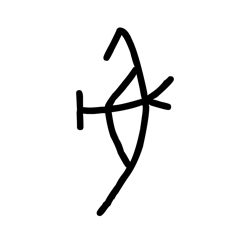

- source_zip_member: `Sub-character Images/k0pxsd02si/u0lilfr8as/dqsqcrmpel.png`
- checksum_sha256: `efd2d8c7fb8a033784b30b23a1a8d217c4fb5c646f770d16b35c24b86a08500d`
- review_status: `needs_human_visual_review`
- caution: OBIMD subcharacter image is a source-marked review asset only; it is not a confirmed component form, component assignment, or decipherment conclusion.

## asset-019752

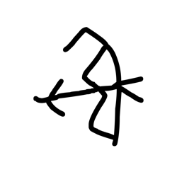

- source_zip_member: `Sub-character Images/k0pxsd02si/u0lilfr8as/ds58zdpqwu.png`
- checksum_sha256: `356c73074e0cef6fde5bee0fdd8f3d218fa0267417d55d2121882ed2052215f3`
- review_status: `needs_human_visual_review`
- caution: OBIMD subcharacter image is a source-marked review asset only; it is not a confirmed component form, component assignment, or decipherment conclusion.

## asset-019753

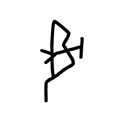

- source_zip_member: `Sub-character Images/k0pxsd02si/u0lilfr8as/e0qlnf0b9x.png`
- checksum_sha256: `09f4e211f3c40eb607e9a967cea102f9470cf88ba868112511efecd401a1ac9b`
- review_status: `needs_human_visual_review`
- caution: OBIMD subcharacter image is a source-marked review asset only; it is not a confirmed component form, component assignment, or decipherment conclusion.

## asset-019754

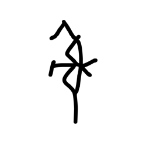

- source_zip_member: `Sub-character Images/k0pxsd02si/u0lilfr8as/ez2x34xyup.png`
- checksum_sha256: `c6c1f4cce9ed1a87f43f7ed1ac3b4ecac2983c321a6164555eba6fef7e844a88`
- review_status: `needs_human_visual_review`
- caution: OBIMD subcharacter image is a source-marked review asset only; it is not a confirmed component form, component assignment, or decipherment conclusion.

## asset-019755

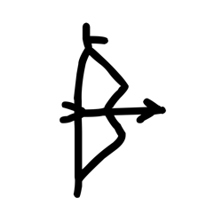

- source_zip_member: `Sub-character Images/k0pxsd02si/u0lilfr8as/fbqh1gdn5j.png`
- checksum_sha256: `ac932300e4e86938861d12bdd0956a312b220fea392d42c464cef96107001bc9`
- review_status: `needs_human_visual_review`
- caution: OBIMD subcharacter image is a source-marked review asset only; it is not a confirmed component form, component assignment, or decipherment conclusion.

## asset-019756

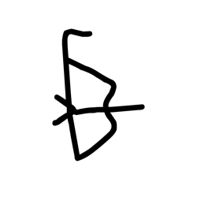

- source_zip_member: `Sub-character Images/k0pxsd02si/u0lilfr8as/fi2143i4l9.png`
- checksum_sha256: `01e506e19bc42306ca3422b2882802756d63d8b72f29bd93a71540f5cc4151d2`
- review_status: `needs_human_visual_review`
- caution: OBIMD subcharacter image is a source-marked review asset only; it is not a confirmed component form, component assignment, or decipherment conclusion.

## asset-019757

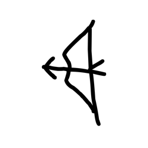

- source_zip_member: `Sub-character Images/k0pxsd02si/u0lilfr8as/gniymcltt8.png`
- checksum_sha256: `db968425782a269315c569081731fbc297d872f0835e0c77063307dc979c979a`
- review_status: `needs_human_visual_review`
- caution: OBIMD subcharacter image is a source-marked review asset only; it is not a confirmed component form, component assignment, or decipherment conclusion.

## asset-019758

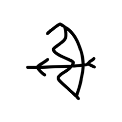

- source_zip_member: `Sub-character Images/k0pxsd02si/u0lilfr8as/hyfar53vll.png`
- checksum_sha256: `d308c3590d0444b1b3555b2c64419d24fec898a2bd5f088f9a2089c96c142124`
- review_status: `needs_human_visual_review`
- caution: OBIMD subcharacter image is a source-marked review asset only; it is not a confirmed component form, component assignment, or decipherment conclusion.

## asset-019759

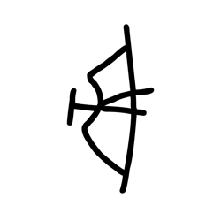

- source_zip_member: `Sub-character Images/k0pxsd02si/u0lilfr8as/j27kua90uv.png`
- checksum_sha256: `7df92255282bf5c6c959093e306068eb2f2545e2a017be34d174e9beb93a0dbf`
- review_status: `needs_human_visual_review`
- caution: OBIMD subcharacter image is a source-marked review asset only; it is not a confirmed component form, component assignment, or decipherment conclusion.

## asset-019760

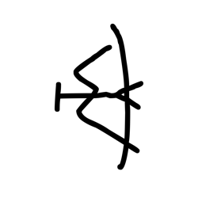

- source_zip_member: `Sub-character Images/k0pxsd02si/u0lilfr8as/j3cqzv95zq.png`
- checksum_sha256: `62b53dbc5d7dc0333c7c08580b42b524df6fb5bbe38bc10ad8deaf3f115d0f0d`
- review_status: `needs_human_visual_review`
- caution: OBIMD subcharacter image is a source-marked review asset only; it is not a confirmed component form, component assignment, or decipherment conclusion.

## asset-019761

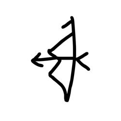

- source_zip_member: `Sub-character Images/k0pxsd02si/u0lilfr8as/jiklihhbj4.png`
- checksum_sha256: `ef5fe495210a049f338fb0b0e990a81351e98e1c96d51d10f0af92603f609d18`
- review_status: `needs_human_visual_review`
- caution: OBIMD subcharacter image is a source-marked review asset only; it is not a confirmed component form, component assignment, or decipherment conclusion.

## asset-019762

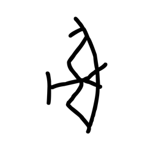

- source_zip_member: `Sub-character Images/k0pxsd02si/u0lilfr8as/l166mmbdeb.png`
- checksum_sha256: `45e846ee399902803b5c99b3a9eb429fe1bc097edf176b79ea9de213a5749a7f`
- review_status: `needs_human_visual_review`
- caution: OBIMD subcharacter image is a source-marked review asset only; it is not a confirmed component form, component assignment, or decipherment conclusion.

## asset-019763

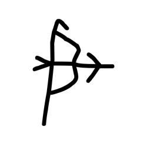

- source_zip_member: `Sub-character Images/k0pxsd02si/u0lilfr8as/l4ci23a1u4.png`
- checksum_sha256: `3ef2b0c724f31ddcd1373aa0027cf99efdc87dc3074017b6ffb9ddae1d8f74e1`
- review_status: `needs_human_visual_review`
- caution: OBIMD subcharacter image is a source-marked review asset only; it is not a confirmed component form, component assignment, or decipherment conclusion.

## asset-019764

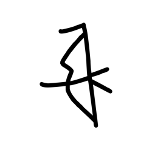

- source_zip_member: `Sub-character Images/k0pxsd02si/u0lilfr8as/l74ezxzdxs.png`
- checksum_sha256: `16a62e9382681ca71249db860a2e5f206c0328a957f1368fe948a2e16e57296e`
- review_status: `needs_human_visual_review`
- caution: OBIMD subcharacter image is a source-marked review asset only; it is not a confirmed component form, component assignment, or decipherment conclusion.

## asset-019765

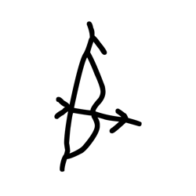

- source_zip_member: `Sub-character Images/k0pxsd02si/u0lilfr8as/l8v9zdovzh.png`
- checksum_sha256: `a5f0d3bbd7a2075f090c0bb7ec8099afa70205d4fbbee7851be4c8c4fce81358`
- review_status: `needs_human_visual_review`
- caution: OBIMD subcharacter image is a source-marked review asset only; it is not a confirmed component form, component assignment, or decipherment conclusion.

## asset-019766

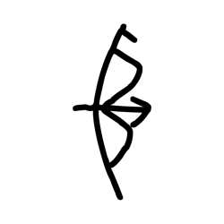

- source_zip_member: `Sub-character Images/k0pxsd02si/u0lilfr8as/lrf20t4dy1.png`
- checksum_sha256: `fee382d9489440e8985784bd8a32f4d40da433cb1b0d5657f9df5aff30663b49`
- review_status: `needs_human_visual_review`
- caution: OBIMD subcharacter image is a source-marked review asset only; it is not a confirmed component form, component assignment, or decipherment conclusion.

## asset-019767

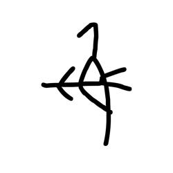

- source_zip_member: `Sub-character Images/k0pxsd02si/u0lilfr8as/lrq4uchh84.png`
- checksum_sha256: `f6f8be650bff65f416620c45b87acba563782fbbe57d6799a3a5db19511fcb19`
- review_status: `needs_human_visual_review`
- caution: OBIMD subcharacter image is a source-marked review asset only; it is not a confirmed component form, component assignment, or decipherment conclusion.

## asset-019768

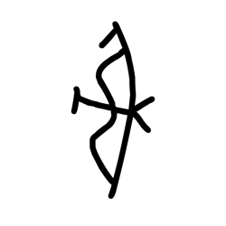

- source_zip_member: `Sub-character Images/k0pxsd02si/u0lilfr8as/mj77cow276.png`
- checksum_sha256: `af05e373c623fc8a953140ab28d161441e518a18288b7fcd787831e7d9fd75b5`
- review_status: `needs_human_visual_review`
- caution: OBIMD subcharacter image is a source-marked review asset only; it is not a confirmed component form, component assignment, or decipherment conclusion.

## asset-019769

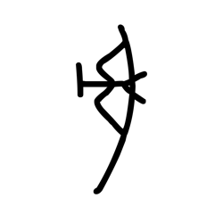

- source_zip_member: `Sub-character Images/k0pxsd02si/u0lilfr8as/o641vqhzhn.png`
- checksum_sha256: `bbd429a3a081cd28985e277a5115337e4515f4591c312317334ea489e42c196f`
- review_status: `needs_human_visual_review`
- caution: OBIMD subcharacter image is a source-marked review asset only; it is not a confirmed component form, component assignment, or decipherment conclusion.

## asset-019770

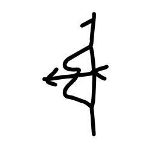

- source_zip_member: `Sub-character Images/k0pxsd02si/u0lilfr8as/odi687raa3.png`
- checksum_sha256: `5ae678ce9ec3c6c3b4087df92311bc5db42f1cf2aac27c963f7fc00b04d02e9a`
- review_status: `needs_human_visual_review`
- caution: OBIMD subcharacter image is a source-marked review asset only; it is not a confirmed component form, component assignment, or decipherment conclusion.

## asset-019771

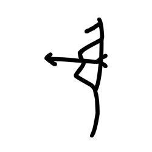

- source_zip_member: `Sub-character Images/k0pxsd02si/u0lilfr8as/olg9ohxy2v.png`
- checksum_sha256: `1b4416fb85b2ca7a94132c3078a832a3c4648792452a3d40f0da241994434a62`
- review_status: `needs_human_visual_review`
- caution: OBIMD subcharacter image is a source-marked review asset only; it is not a confirmed component form, component assignment, or decipherment conclusion.

## asset-019772

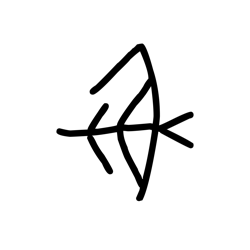

- source_zip_member: `Sub-character Images/k0pxsd02si/u0lilfr8as/rl03rq3y5w.png`
- checksum_sha256: `04fbafe206f457e42f23865503c028639b196d7dee6c2b617c5c1afc2616dcb4`
- review_status: `needs_human_visual_review`
- caution: OBIMD subcharacter image is a source-marked review asset only; it is not a confirmed component form, component assignment, or decipherment conclusion.

## asset-019773

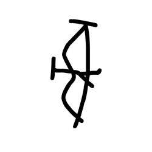

- source_zip_member: `Sub-character Images/k0pxsd02si/u0lilfr8as/shfapq6rd1.png`
- checksum_sha256: `1e973288089a19924b964706840fd49d44df8dae8cfd5f190c216531a7c9b657`
- review_status: `needs_human_visual_review`
- caution: OBIMD subcharacter image is a source-marked review asset only; it is not a confirmed component form, component assignment, or decipherment conclusion.

## asset-019774

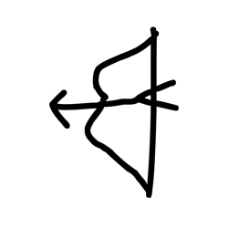

- source_zip_member: `Sub-character Images/k0pxsd02si/u0lilfr8as/toaoukckun.png`
- checksum_sha256: `7653b9f1c05df8a0ac5f837bd7d8678ecc0642fdadff8bf7361c991e3e2f43a8`
- review_status: `needs_human_visual_review`
- caution: OBIMD subcharacter image is a source-marked review asset only; it is not a confirmed component form, component assignment, or decipherment conclusion.

## asset-019775

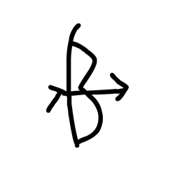

- source_zip_member: `Sub-character Images/k0pxsd02si/u0lilfr8as/tvrc2qq0cw.png`
- checksum_sha256: `768c5dd34d12e606775084025ac3ff6003b0ef42bbd17ff445dc358637262180`
- review_status: `needs_human_visual_review`
- caution: OBIMD subcharacter image is a source-marked review asset only; it is not a confirmed component form, component assignment, or decipherment conclusion.

## asset-019776

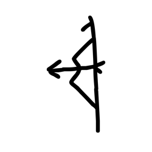

- source_zip_member: `Sub-character Images/k0pxsd02si/u0lilfr8as/u0lilfr8as.png`
- checksum_sha256: `993119715e99fb2915c5e7bbcdef2ea1c68e52a751235212ebe1a2b4048c2824`
- review_status: `needs_human_visual_review`
- caution: OBIMD subcharacter image is a source-marked review asset only; it is not a confirmed component form, component assignment, or decipherment conclusion.

## asset-019777

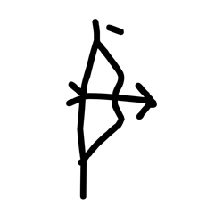

- source_zip_member: `Sub-character Images/k0pxsd02si/u0lilfr8as/u7zsninlzr.png`
- checksum_sha256: `ff92d4b60b4295771c30252d4657dfb898fdec7d2a95db4a16c934ebb07dff74`
- review_status: `needs_human_visual_review`
- caution: OBIMD subcharacter image is a source-marked review asset only; it is not a confirmed component form, component assignment, or decipherment conclusion.

## asset-019778

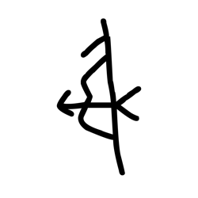

- source_zip_member: `Sub-character Images/k0pxsd02si/u0lilfr8as/upuj8tw4fk.png`
- checksum_sha256: `76aa1c5007ac1ae43be554768b3a0b96fee84b78b14f9a5b706b099a7476c9fa`
- review_status: `needs_human_visual_review`
- caution: OBIMD subcharacter image is a source-marked review asset only; it is not a confirmed component form, component assignment, or decipherment conclusion.

## asset-019779

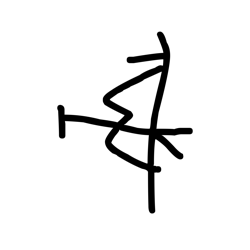

- source_zip_member: `Sub-character Images/k0pxsd02si/u0lilfr8as/uuxn5baa4k.png`
- checksum_sha256: `76ce50bafadce5485659867e07d93d23e90d3104f4c34700507a548708273463`
- review_status: `needs_human_visual_review`
- caution: OBIMD subcharacter image is a source-marked review asset only; it is not a confirmed component form, component assignment, or decipherment conclusion.

## asset-019780

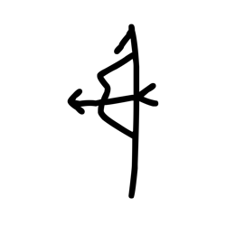

- source_zip_member: `Sub-character Images/k0pxsd02si/u0lilfr8as/uv3qhoje8q.png`
- checksum_sha256: `e6a477e7d6bb48f123ad41539af98814b6b64a98321902accc61fc4a7da301e9`
- review_status: `needs_human_visual_review`
- caution: OBIMD subcharacter image is a source-marked review asset only; it is not a confirmed component form, component assignment, or decipherment conclusion.

## asset-019781

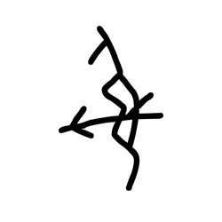

- source_zip_member: `Sub-character Images/k0pxsd02si/u0lilfr8as/v1apj03kfc.png`
- checksum_sha256: `8431e32bae78ba28ff4e1115f468274b793c3bdc1f273413677dbafbfb27c0fd`
- review_status: `needs_human_visual_review`
- caution: OBIMD subcharacter image is a source-marked review asset only; it is not a confirmed component form, component assignment, or decipherment conclusion.

## asset-019782

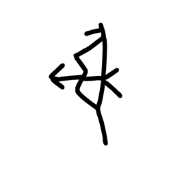

- source_zip_member: `Sub-character Images/k0pxsd02si/u0lilfr8as/v2akvqxaud.png`
- checksum_sha256: `2505985d73f0e0068d07595cb1a3001026c33a94e10d2d42bd3b37b91c84ab29`
- review_status: `needs_human_visual_review`
- caution: OBIMD subcharacter image is a source-marked review asset only; it is not a confirmed component form, component assignment, or decipherment conclusion.

## asset-019783

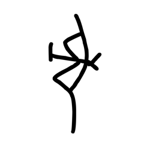

- source_zip_member: `Sub-character Images/k0pxsd02si/u0lilfr8as/w2n0eat5gk.png`
- checksum_sha256: `41ee46311cb9862799d2459e0b4ad2cb210c4b4e0d94f0201a6cd33aa91d0905`
- review_status: `needs_human_visual_review`
- caution: OBIMD subcharacter image is a source-marked review asset only; it is not a confirmed component form, component assignment, or decipherment conclusion.

## asset-019784

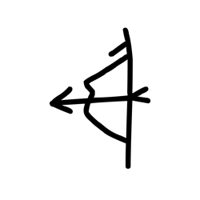

- source_zip_member: `Sub-character Images/k0pxsd02si/u0lilfr8as/wvo9vejgld.png`
- checksum_sha256: `53f017fef7314cb9aa8178b1c9985b5f6269b1f30af38dc2520a03a292145c96`
- review_status: `needs_human_visual_review`
- caution: OBIMD subcharacter image is a source-marked review asset only; it is not a confirmed component form, component assignment, or decipherment conclusion.

## asset-019785

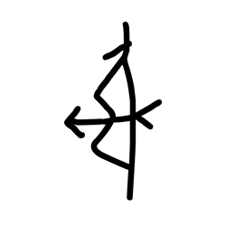

- source_zip_member: `Sub-character Images/k0pxsd02si/u0lilfr8as/xpklajzfyn.png`
- checksum_sha256: `238e3d0e5360ef6c976fa439e07efb6f24475de2963ee05e019d31409063e44c`
- review_status: `needs_human_visual_review`
- caution: OBIMD subcharacter image is a source-marked review asset only; it is not a confirmed component form, component assignment, or decipherment conclusion.

## asset-019786

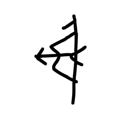

- source_zip_member: `Sub-character Images/k0pxsd02si/u0lilfr8as/xrlxp41rye.png`
- checksum_sha256: `e7883d055ff2cb1b69bfb7f73ed4bf8200c884793eccbe1feccd9ad015c4d254`
- review_status: `needs_human_visual_review`
- caution: OBIMD subcharacter image is a source-marked review asset only; it is not a confirmed component form, component assignment, or decipherment conclusion.

## asset-019787

- source_zip_member: `Sub-character Images/k0pxsd02si/u0lilfr8as/xs425ofkcu.png`
- checksum_sha256: `ef01d70bd7f08cf5f1e2b3b35c886d7c56a2e58d666cc83bded8d3fbe5bbfe0d`
- review_status: `needs_human_visual_review`
- caution: OBIMD subcharacter image is a source-marked review asset only; it is not a confirmed component form, component assignment, or decipherment conclusion.

## asset-019788

- source_zip_member: `Sub-character Images/k0pxsd02si/u0lilfr8as/y1chvd0pu3.png`
- checksum_sha256: `5d29a277d812d95997f586a46e4155bfcbb4dc395241660689c9f56192f4c1d8`
- review_status: `needs_human_visual_review`
- caution: OBIMD subcharacter image is a source-marked review asset only; it is not a confirmed component form, component assignment, or decipherment conclusion.

## asset-019789

- source_zip_member: `Sub-character Images/k0pxsd02si/u0lilfr8as/ynjv2v9wru.png`
- checksum_sha256: `87adcb1ff8f630fadee90eb5bf5623592cf3cd77c64abe6b2ae3e9babecba4c3`
- review_status: `needs_human_visual_review`
- caution: OBIMD subcharacter image is a source-marked review asset only; it is not a confirmed component form, component assignment, or decipherment conclusion.

## asset-019790

- source_zip_member: `Sub-character Images/k0pxsd02si/u0lilfr8as/ztycdoxgii.png`
- checksum_sha256: `4948540cc5cc175fecf2739c24d8f253a14a671041d8239b0e682f3f99b36436`
- review_status: `needs_human_visual_review`
- caution: OBIMD subcharacter image is a source-marked review asset only; it is not a confirmed component form, component assignment, or decipherment conclusion.
