# Component Visual Gallery / 构件图像查看: obs-comp-cand-002159

English:
This page displays OBIMD subcharacter PNG assets extracted into this concrete
corpus object directory for human review.

简体中文：
本页展示抽取到当前具体 corpus 对象目录内的 OBIMD subcharacter PNG 资料，供人工复核使用。

Boundary / 边界：
dataset image candidate only; not a confirmed component form, not a component
assignment, and not a decipherment claim.
- not a confirmed component form
- not a component assignment
- not a decipherment claim

## Concrete Questions To Check / 具体待查问题

- Which local image should be opened first?
- 应先打开哪一张本地构件图像？
- Which source zip member anchors this image?
- 哪一个 source zip member 能定位这张图像？
- Which near-shape or variant comparison is still missing?
- 还缺哪些近形或异体比较？
- Which character or inscription context should be checked next?
- 下一步应核对哪些单字或卜辞上下文？
- What evidence is missing before a component assignment?
- 正式构件归属前还缺哪些证据？

## asset-019800

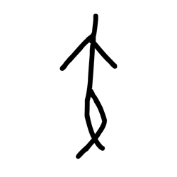

- source_zip_member: `Sub-character Images/u3lh7tekno/u3lh7tekno/0vyliznirb.png`
- checksum_sha256: see `06_component-visual-index.csv`.
- review_status: `needs_human_visual_review`
- caution: source-marked review image only.

## asset-019801

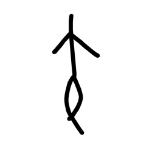

- source_zip_member: `Sub-character Images/u3lh7tekno/u3lh7tekno/12d2aed9fg.png`
- checksum_sha256: see `06_component-visual-index.csv`.
- review_status: `needs_human_visual_review`
- caution: source-marked review image only.

## asset-019802

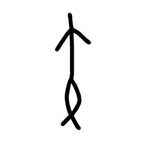

- source_zip_member: `Sub-character Images/u3lh7tekno/u3lh7tekno/1snlqikny7.png`
- checksum_sha256: see `06_component-visual-index.csv`.
- review_status: `needs_human_visual_review`
- caution: source-marked review image only.

## asset-019803

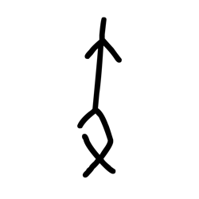

- source_zip_member: `Sub-character Images/u3lh7tekno/u3lh7tekno/1xg73ykhzp.png`
- checksum_sha256: see `06_component-visual-index.csv`.
- review_status: `needs_human_visual_review`
- caution: source-marked review image only.

## asset-019804

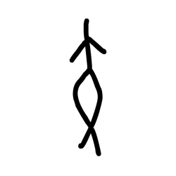

- source_zip_member: `Sub-character Images/u3lh7tekno/u3lh7tekno/3lcr9ckryo.png`
- checksum_sha256: see `06_component-visual-index.csv`.
- review_status: `needs_human_visual_review`
- caution: source-marked review image only.

## asset-019805

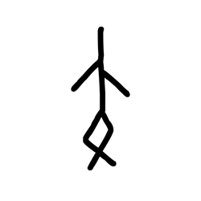

- source_zip_member: `Sub-character Images/u3lh7tekno/u3lh7tekno/6ccslr1n8w.png`
- checksum_sha256: see `06_component-visual-index.csv`.
- review_status: `needs_human_visual_review`
- caution: source-marked review image only.

## asset-019806

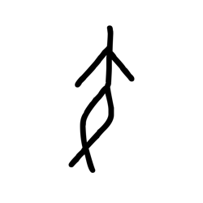

- source_zip_member: `Sub-character Images/u3lh7tekno/u3lh7tekno/79sf2xiipm.png`
- checksum_sha256: see `06_component-visual-index.csv`.
- review_status: `needs_human_visual_review`
- caution: source-marked review image only.

## asset-019807

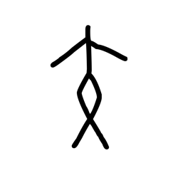

- source_zip_member: `Sub-character Images/u3lh7tekno/u3lh7tekno/7ooh0rnacx.png`
- checksum_sha256: see `06_component-visual-index.csv`.
- review_status: `needs_human_visual_review`
- caution: source-marked review image only.

## asset-019808

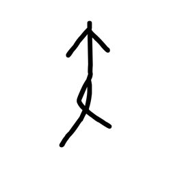

- source_zip_member: `Sub-character Images/u3lh7tekno/u3lh7tekno/835myen40r.png`
- checksum_sha256: see `06_component-visual-index.csv`.
- review_status: `needs_human_visual_review`
- caution: source-marked review image only.

## asset-019809

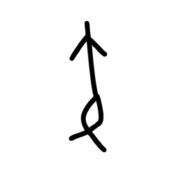

- source_zip_member: `Sub-character Images/u3lh7tekno/u3lh7tekno/84f1vuobqd.png`
- checksum_sha256: see `06_component-visual-index.csv`.
- review_status: `needs_human_visual_review`
- caution: source-marked review image only.

## asset-019810

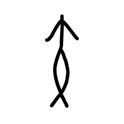

- source_zip_member: `Sub-character Images/u3lh7tekno/u3lh7tekno/8oq5r7pzmy.png`
- checksum_sha256: see `06_component-visual-index.csv`.
- review_status: `needs_human_visual_review`
- caution: source-marked review image only.

## asset-019811

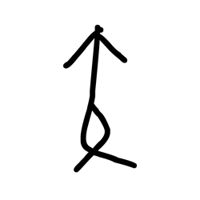

- source_zip_member: `Sub-character Images/u3lh7tekno/u3lh7tekno/adkejuma59.png`
- checksum_sha256: see `06_component-visual-index.csv`.
- review_status: `needs_human_visual_review`
- caution: source-marked review image only.

## asset-019812

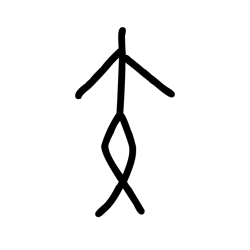

- source_zip_member: `Sub-character Images/u3lh7tekno/u3lh7tekno/aid8scsxy4.png`
- checksum_sha256: see `06_component-visual-index.csv`.
- review_status: `needs_human_visual_review`
- caution: source-marked review image only.

## asset-019813

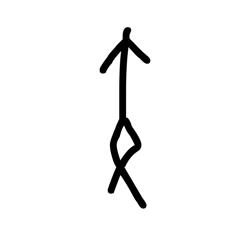

- source_zip_member: `Sub-character Images/u3lh7tekno/u3lh7tekno/c7646pfs3m.png`
- checksum_sha256: see `06_component-visual-index.csv`.
- review_status: `needs_human_visual_review`
- caution: source-marked review image only.

## asset-019814

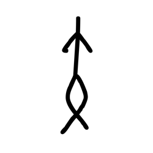

- source_zip_member: `Sub-character Images/u3lh7tekno/u3lh7tekno/ffplsa6i6m.png`
- checksum_sha256: see `06_component-visual-index.csv`.
- review_status: `needs_human_visual_review`
- caution: source-marked review image only.

## asset-019815

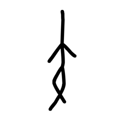

- source_zip_member: `Sub-character Images/u3lh7tekno/u3lh7tekno/g5j2qdnyux.png`
- checksum_sha256: see `06_component-visual-index.csv`.
- review_status: `needs_human_visual_review`
- caution: source-marked review image only.

## asset-019816

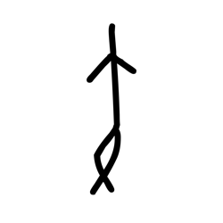

- source_zip_member: `Sub-character Images/u3lh7tekno/u3lh7tekno/gj78r8eqhm.png`
- checksum_sha256: see `06_component-visual-index.csv`.
- review_status: `needs_human_visual_review`
- caution: source-marked review image only.

## asset-019817

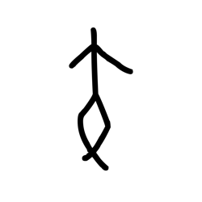

- source_zip_member: `Sub-character Images/u3lh7tekno/u3lh7tekno/iwh17qccxf.png`
- checksum_sha256: see `06_component-visual-index.csv`.
- review_status: `needs_human_visual_review`
- caution: source-marked review image only.

## asset-019818

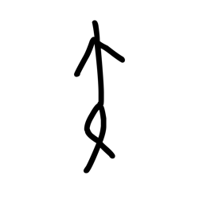

- source_zip_member: `Sub-character Images/u3lh7tekno/u3lh7tekno/kbfwzr3lwh.png`
- checksum_sha256: see `06_component-visual-index.csv`.
- review_status: `needs_human_visual_review`
- caution: source-marked review image only.

## asset-019819

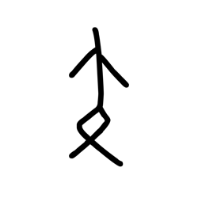

- source_zip_member: `Sub-character Images/u3lh7tekno/u3lh7tekno/n019px6nul.png`
- checksum_sha256: see `06_component-visual-index.csv`.
- review_status: `needs_human_visual_review`
- caution: source-marked review image only.

## asset-019820

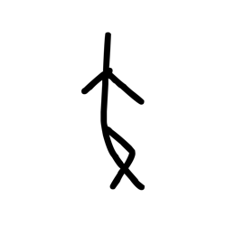

- source_zip_member: `Sub-character Images/u3lh7tekno/u3lh7tekno/nn1f3m8m0g.png`
- checksum_sha256: see `06_component-visual-index.csv`.
- review_status: `needs_human_visual_review`
- caution: source-marked review image only.

## asset-019821

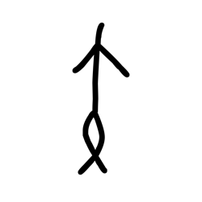

- source_zip_member: `Sub-character Images/u3lh7tekno/u3lh7tekno/pigmul0bk9.png`
- checksum_sha256: see `06_component-visual-index.csv`.
- review_status: `needs_human_visual_review`
- caution: source-marked review image only.

## asset-019822

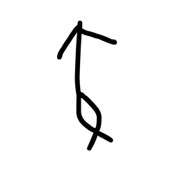

- source_zip_member: `Sub-character Images/u3lh7tekno/u3lh7tekno/sj465oxx0j.png`
- checksum_sha256: see `06_component-visual-index.csv`.
- review_status: `needs_human_visual_review`
- caution: source-marked review image only.

## asset-019823

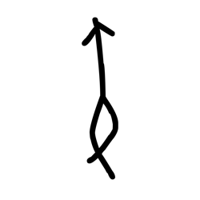

- source_zip_member: `Sub-character Images/u3lh7tekno/u3lh7tekno/tkvvraz74g.png`
- checksum_sha256: see `06_component-visual-index.csv`.
- review_status: `needs_human_visual_review`
- caution: source-marked review image only.

## asset-019824

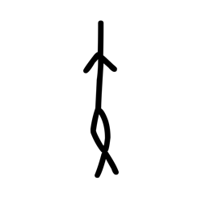

- source_zip_member: `Sub-character Images/u3lh7tekno/u3lh7tekno/tl0ziff870.png`
- checksum_sha256: see `06_component-visual-index.csv`.
- review_status: `needs_human_visual_review`
- caution: source-marked review image only.

## asset-019825

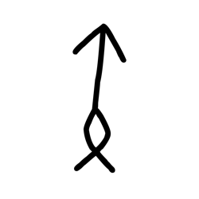

- source_zip_member: `Sub-character Images/u3lh7tekno/u3lh7tekno/u1sbtly5q0.png`
- checksum_sha256: see `06_component-visual-index.csv`.
- review_status: `needs_human_visual_review`
- caution: source-marked review image only.

## asset-019826

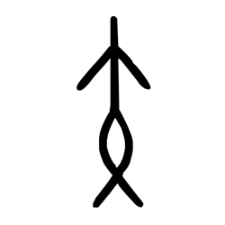

- source_zip_member: `Sub-character Images/u3lh7tekno/u3lh7tekno/u3lh7tekno.png`
- checksum_sha256: see `06_component-visual-index.csv`.
- review_status: `needs_human_visual_review`
- caution: source-marked review image only.

## asset-019827

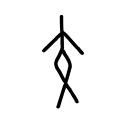

- source_zip_member: `Sub-character Images/u3lh7tekno/u3lh7tekno/v1dablu73a.png`
- checksum_sha256: see `06_component-visual-index.csv`.
- review_status: `needs_human_visual_review`
- caution: source-marked review image only.

## asset-019828

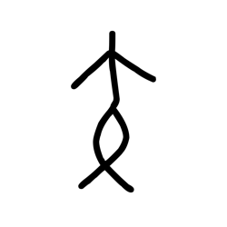

- source_zip_member: `Sub-character Images/u3lh7tekno/u3lh7tekno/yyorludey3.png`
- checksum_sha256: see `06_component-visual-index.csv`.
- review_status: `needs_human_visual_review`
- caution: source-marked review image only.

## asset-019829

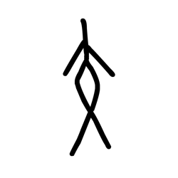

- source_zip_member: `Sub-character Images/u3lh7tekno/u3lh7tekno/z2cz7sjihm.png`
- checksum_sha256: see `06_component-visual-index.csv`.
- review_status: `needs_human_visual_review`
- caution: source-marked review image only.

## asset-019830

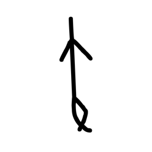

- source_zip_member: `Sub-character Images/u3lh7tekno/u3lh7tekno/z62wxhmmvo.png`
- checksum_sha256: see `06_component-visual-index.csv`.
- review_status: `needs_human_visual_review`
- caution: source-marked review image only.

## asset-019831

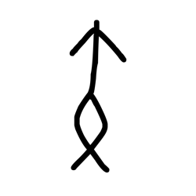

- source_zip_member: `Sub-character Images/u3lh7tekno/u3lh7tekno/z8f3iw2r2x.png`
- checksum_sha256: see `06_component-visual-index.csv`.
- review_status: `needs_human_visual_review`
- caution: source-marked review image only.

## asset-019832

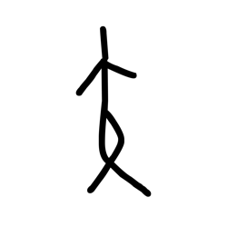

- source_zip_member: `Sub-character Images/u3lh7tekno/u3lh7tekno/zb5oozgmox.png`
- checksum_sha256: see `06_component-visual-index.csv`.
- review_status: `needs_human_visual_review`
- caution: source-marked review image only.
