# Component Visual Gallery / 构件图像查看: obs-comp-cand-002162

English:
This page displays OBIMD subcharacter PNG assets extracted into this concrete
corpus object directory for human review.

简体中文：
本页展示抽取到当前具体 corpus 对象目录内的 OBIMD subcharacter PNG 资料，供人工复核使用。

Boundary / 边界：
dataset image candidate only; not a confirmed component form, not a component
assignment, and not a decipherment claim.
- not a confirmed component form
- not a component assignment
- not a decipherment claim

## Concrete Questions To Check / 具体待查问题

- Open 06_component-visual-index.csv and name the local image row.
- 打开 06_component-visual-index.csv，写明本地图像行。
- Open 09_component-visual-route-index.csv and name the source route row.
- 打开 09_component-visual-route-index.csv，写明来源路线行。
- Open 13_component-context-evidence-dossier.md for character context.
- 打开 13_component-context-evidence-dossier.md，核对单字与卜辞上下文。
- Record the missing image, near-shape, source, or context route.
- 记录缺失的图像、近形、来源或上下文路线。

## asset-019841

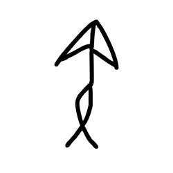

- source_zip_member: `Sub-character Images/u3lh7tekno/nmao0adfh6/06g6jfga5o.png`
- checksum_sha256: see `06_component-visual-index.csv`.
- review_status: `needs_human_visual_review`
- caution: source-marked review image only.

## asset-019842

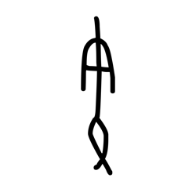

- source_zip_member: `Sub-character Images/u3lh7tekno/nmao0adfh6/24baseaxg3.png`
- checksum_sha256: see `06_component-visual-index.csv`.
- review_status: `needs_human_visual_review`
- caution: source-marked review image only.

## asset-019843

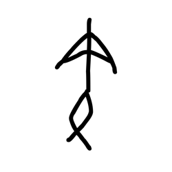

- source_zip_member: `Sub-character Images/u3lh7tekno/nmao0adfh6/32i3h7pc26.png`
- checksum_sha256: see `06_component-visual-index.csv`.
- review_status: `needs_human_visual_review`
- caution: source-marked review image only.

## asset-019844

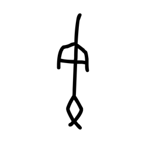

- source_zip_member: `Sub-character Images/u3lh7tekno/nmao0adfh6/3xp6oci4k7.png`
- checksum_sha256: see `06_component-visual-index.csv`.
- review_status: `needs_human_visual_review`
- caution: source-marked review image only.

## asset-019845

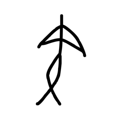

- source_zip_member: `Sub-character Images/u3lh7tekno/nmao0adfh6/5x3ugvqr0e.png`
- checksum_sha256: see `06_component-visual-index.csv`.
- review_status: `needs_human_visual_review`
- caution: source-marked review image only.

## asset-019846

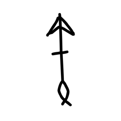

- source_zip_member: `Sub-character Images/u3lh7tekno/nmao0adfh6/6tkr9phn6q.png`
- checksum_sha256: see `06_component-visual-index.csv`.
- review_status: `needs_human_visual_review`
- caution: source-marked review image only.

## asset-019847

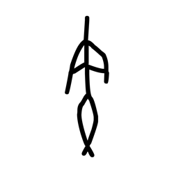

- source_zip_member: `Sub-character Images/u3lh7tekno/nmao0adfh6/a8vjn11ktd.png`
- checksum_sha256: see `06_component-visual-index.csv`.
- review_status: `needs_human_visual_review`
- caution: source-marked review image only.

## asset-019848

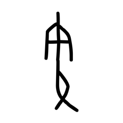

- source_zip_member: `Sub-character Images/u3lh7tekno/nmao0adfh6/alm112qgcz.png`
- checksum_sha256: see `06_component-visual-index.csv`.
- review_status: `needs_human_visual_review`
- caution: source-marked review image only.

## asset-019849

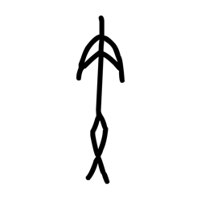

- source_zip_member: `Sub-character Images/u3lh7tekno/nmao0adfh6/bankxb91yo.png`
- checksum_sha256: see `06_component-visual-index.csv`.
- review_status: `needs_human_visual_review`
- caution: source-marked review image only.

## asset-019850

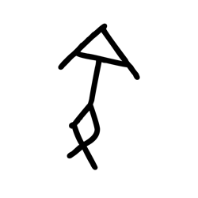

- source_zip_member: `Sub-character Images/u3lh7tekno/nmao0adfh6/fnqohcvhmj.png`
- checksum_sha256: see `06_component-visual-index.csv`.
- review_status: `needs_human_visual_review`
- caution: source-marked review image only.

## asset-019851

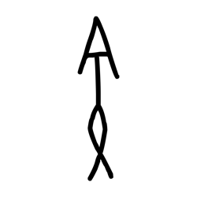

- source_zip_member: `Sub-character Images/u3lh7tekno/nmao0adfh6/k8p94iul8j.png`
- checksum_sha256: see `06_component-visual-index.csv`.
- review_status: `needs_human_visual_review`
- caution: source-marked review image only.

## asset-019852

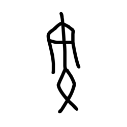

- source_zip_member: `Sub-character Images/u3lh7tekno/nmao0adfh6/lm9e06l1kb.png`
- checksum_sha256: see `06_component-visual-index.csv`.
- review_status: `needs_human_visual_review`
- caution: source-marked review image only.

## asset-019853

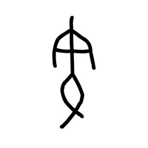

- source_zip_member: `Sub-character Images/u3lh7tekno/nmao0adfh6/mzc1zv0yle.png`
- checksum_sha256: see `06_component-visual-index.csv`.
- review_status: `needs_human_visual_review`
- caution: source-marked review image only.

## asset-019854

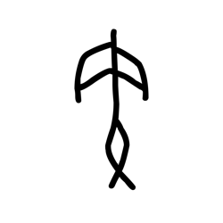

- source_zip_member: `Sub-character Images/u3lh7tekno/nmao0adfh6/nmao0adfh6.png`
- checksum_sha256: see `06_component-visual-index.csv`.
- review_status: `needs_human_visual_review`
- caution: source-marked review image only.

## asset-019855

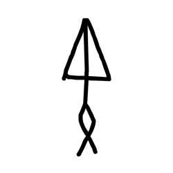

- source_zip_member: `Sub-character Images/u3lh7tekno/nmao0adfh6/okl650pt3y.png`
- checksum_sha256: see `06_component-visual-index.csv`.
- review_status: `needs_human_visual_review`
- caution: source-marked review image only.

## asset-019856

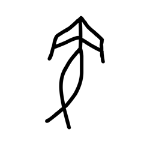

- source_zip_member: `Sub-character Images/u3lh7tekno/nmao0adfh6/skctx9e60t.png`
- checksum_sha256: see `06_component-visual-index.csv`.
- review_status: `needs_human_visual_review`
- caution: source-marked review image only.

## asset-019857

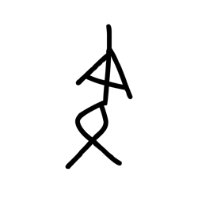

- source_zip_member: `Sub-character Images/u3lh7tekno/nmao0adfh6/tvxkfkcsw6.png`
- checksum_sha256: see `06_component-visual-index.csv`.
- review_status: `needs_human_visual_review`
- caution: source-marked review image only.

## asset-019858

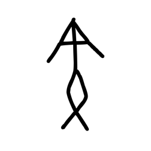

- source_zip_member: `Sub-character Images/u3lh7tekno/nmao0adfh6/w2k918f4ga.png`
- checksum_sha256: see `06_component-visual-index.csv`.
- review_status: `needs_human_visual_review`
- caution: source-marked review image only.

## asset-019859

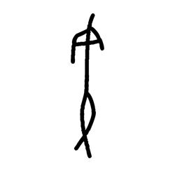

- source_zip_member: `Sub-character Images/u3lh7tekno/nmao0adfh6/w84vspqcpf.png`
- checksum_sha256: see `06_component-visual-index.csv`.
- review_status: `needs_human_visual_review`
- caution: source-marked review image only.

## asset-019860

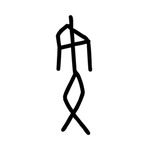

- source_zip_member: `Sub-character Images/u3lh7tekno/nmao0adfh6/xarj1e9lz1.png`
- checksum_sha256: see `06_component-visual-index.csv`.
- review_status: `needs_human_visual_review`
- caution: source-marked review image only.

## asset-019861

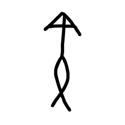

- source_zip_member: `Sub-character Images/u3lh7tekno/nmao0adfh6/xi92y5g2wf.png`
- checksum_sha256: see `06_component-visual-index.csv`.
- review_status: `needs_human_visual_review`
- caution: source-marked review image only.

## asset-019862

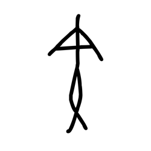

- source_zip_member: `Sub-character Images/u3lh7tekno/nmao0adfh6/y5mwr54373.png`
- checksum_sha256: see `06_component-visual-index.csv`.
- review_status: `needs_human_visual_review`
- caution: source-marked review image only.

## asset-019863

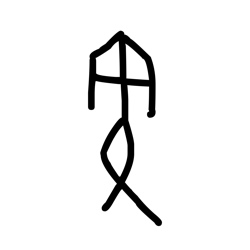

- source_zip_member: `Sub-character Images/u3lh7tekno/nmao0adfh6/zc9ouekgi6.png`
- checksum_sha256: see `06_component-visual-index.csv`.
- review_status: `needs_human_visual_review`
- caution: source-marked review image only.
