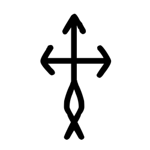

# Component Visual Gallery / 构件图像查看: obs-comp-cand-002185

English:
This page displays OBIMD subcharacter PNG assets extracted into this concrete corpus object directory for human review.

简体中文：
本页展示抽取到当前具体 corpus 对象目录内的 OBIMD subcharacter PNG 资料，供人工复核使用。

Boundary / 边界：dataset image candidate only; not a confirmed component form, component assignment, or decipherment claim.

## asset-019891

- source_zip_member: `Sub-character Images/kyjr61sdkq/kyjr61sdkq/kyjr61sdkq.png`
- checksum_sha256: `ea0e6e5a8e6423c03d68144e286fe8bc45e243a2c8378c6e6854a7146a0f09a8`
- review_status: `needs_human_visual_review`
- caution: OBIMD subcharacter image is a source-marked review asset only; it is not a confirmed component form, component assignment, or decipherment conclusion.
