# Component Visual Gallery / 构件图像查看: obs-comp-cand-002203

English:
This page displays OBIMD subcharacter PNG assets extracted into this concrete
corpus object directory for human review.

简体中文：
本页展示抽取到当前具体 corpus 对象目录内的 OBIMD subcharacter PNG 资料，供人工复核使用。

Boundary / 边界：
dataset image candidate only; not a confirmed component form, not a component
assignment, and not a decipherment claim.
- not a confirmed component form
- not a component assignment
- not a decipherment claim

## Concrete Questions To Check / 具体待查问题

- Which local image should be opened first?
- 应先打开哪一张本地构件图像？
- Which source zip member anchors this image?
- 哪一个 source zip member 能定位这张图像？
- Which near-shape or variant comparison is still missing?
- 还缺哪些近形或异体比较？
- Which character or inscription context should be checked next?
- 下一步应核对哪些单字或卜辞上下文？
- What evidence is missing before a component assignment?
- 正式构件归属前还缺哪些证据？

## asset-019909

- source_zip_member: `Sub-character Images/55qv0winah/55qv0winah/1f25c3nuym.png`
- checksum_sha256: see `06_component-visual-index.csv`.
- review_status: `needs_human_visual_review`
- caution: source-marked review image only.

## asset-019910

- source_zip_member: `Sub-character Images/55qv0winah/55qv0winah/1lo0gyz3vx.png`
- checksum_sha256: see `06_component-visual-index.csv`.
- review_status: `needs_human_visual_review`
- caution: source-marked review image only.

## asset-019911

- source_zip_member: `Sub-character Images/55qv0winah/55qv0winah/1yaicpw6xf.png`
- checksum_sha256: see `06_component-visual-index.csv`.
- review_status: `needs_human_visual_review`
- caution: source-marked review image only.

## asset-019912

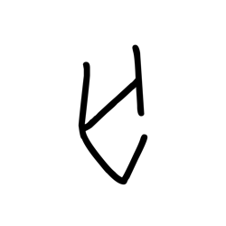

- source_zip_member: `Sub-character Images/55qv0winah/55qv0winah/2uhf6j2ndd.png`
- checksum_sha256: see `06_component-visual-index.csv`.
- review_status: `needs_human_visual_review`
- caution: source-marked review image only.

## asset-019913

- source_zip_member: `Sub-character Images/55qv0winah/55qv0winah/3jounc5ggt.png`
- checksum_sha256: see `06_component-visual-index.csv`.
- review_status: `needs_human_visual_review`
- caution: source-marked review image only.

## asset-019914

- source_zip_member: `Sub-character Images/55qv0winah/55qv0winah/3jwxhlb5kk.png`
- checksum_sha256: see `06_component-visual-index.csv`.
- review_status: `needs_human_visual_review`
- caution: source-marked review image only.

## asset-019915

- source_zip_member: `Sub-character Images/55qv0winah/55qv0winah/4h84veycdh.png`
- checksum_sha256: see `06_component-visual-index.csv`.
- review_status: `needs_human_visual_review`
- caution: source-marked review image only.

## asset-019916

- source_zip_member: `Sub-character Images/55qv0winah/55qv0winah/55qv0winah.png`
- checksum_sha256: see `06_component-visual-index.csv`.
- review_status: `needs_human_visual_review`
- caution: source-marked review image only.

## asset-019917

- source_zip_member: `Sub-character Images/55qv0winah/55qv0winah/599et9jo6y.png`
- checksum_sha256: see `06_component-visual-index.csv`.
- review_status: `needs_human_visual_review`
- caution: source-marked review image only.

## asset-019918

- source_zip_member: `Sub-character Images/55qv0winah/55qv0winah/5a2llq1prm.png`
- checksum_sha256: see `06_component-visual-index.csv`.
- review_status: `needs_human_visual_review`
- caution: source-marked review image only.

## asset-019919

- source_zip_member: `Sub-character Images/55qv0winah/55qv0winah/6xmo88e23f.png`
- checksum_sha256: see `06_component-visual-index.csv`.
- review_status: `needs_human_visual_review`
- caution: source-marked review image only.

## asset-019920

- source_zip_member: `Sub-character Images/55qv0winah/55qv0winah/77zfvavdxo.png`
- checksum_sha256: see `06_component-visual-index.csv`.
- review_status: `needs_human_visual_review`
- caution: source-marked review image only.

## asset-019921

- source_zip_member: `Sub-character Images/55qv0winah/55qv0winah/83fcveforr.png`
- checksum_sha256: see `06_component-visual-index.csv`.
- review_status: `needs_human_visual_review`
- caution: source-marked review image only.

## asset-019922

- source_zip_member: `Sub-character Images/55qv0winah/55qv0winah/89b8k5u0wo.png`
- checksum_sha256: see `06_component-visual-index.csv`.
- review_status: `needs_human_visual_review`
- caution: source-marked review image only.

## asset-019923

- source_zip_member: `Sub-character Images/55qv0winah/55qv0winah/8am50fcbh1.png`
- checksum_sha256: see `06_component-visual-index.csv`.
- review_status: `needs_human_visual_review`
- caution: source-marked review image only.

## asset-019924

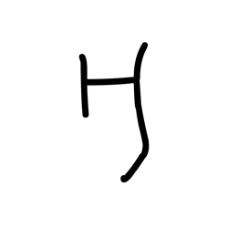

- source_zip_member: `Sub-character Images/55qv0winah/55qv0winah/8doolf1xbt.png`
- checksum_sha256: see `06_component-visual-index.csv`.
- review_status: `needs_human_visual_review`
- caution: source-marked review image only.

## asset-019925

- source_zip_member: `Sub-character Images/55qv0winah/55qv0winah/8nu1iw5cu9.png`
- checksum_sha256: see `06_component-visual-index.csv`.
- review_status: `needs_human_visual_review`
- caution: source-marked review image only.

## asset-019926

- source_zip_member: `Sub-character Images/55qv0winah/55qv0winah/9ahmlo3wzh.png`
- checksum_sha256: see `06_component-visual-index.csv`.
- review_status: `needs_human_visual_review`
- caution: source-marked review image only.

## asset-019927

- source_zip_member: `Sub-character Images/55qv0winah/55qv0winah/9lx7ezvc6o.png`
- checksum_sha256: see `06_component-visual-index.csv`.
- review_status: `needs_human_visual_review`
- caution: source-marked review image only.

## asset-019928

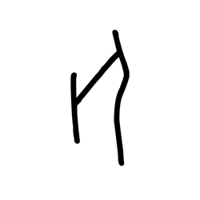

- source_zip_member: `Sub-character Images/55qv0winah/55qv0winah/a3e8enmymt.png`
- checksum_sha256: see `06_component-visual-index.csv`.
- review_status: `needs_human_visual_review`
- caution: source-marked review image only.

## asset-019929

- source_zip_member: `Sub-character Images/55qv0winah/55qv0winah/aby8f8bh4s.png`
- checksum_sha256: see `06_component-visual-index.csv`.
- review_status: `needs_human_visual_review`
- caution: source-marked review image only.

## asset-019930

- source_zip_member: `Sub-character Images/55qv0winah/55qv0winah/arctoitirb.png`
- checksum_sha256: see `06_component-visual-index.csv`.
- review_status: `needs_human_visual_review`
- caution: source-marked review image only.

## asset-019931

- source_zip_member: `Sub-character Images/55qv0winah/55qv0winah/bn6s0be3ti.png`
- checksum_sha256: see `06_component-visual-index.csv`.
- review_status: `needs_human_visual_review`
- caution: source-marked review image only.

## asset-019932

- source_zip_member: `Sub-character Images/55qv0winah/55qv0winah/bvot4m2rpp.png`
- checksum_sha256: see `06_component-visual-index.csv`.
- review_status: `needs_human_visual_review`
- caution: source-marked review image only.

## asset-019933

- source_zip_member: `Sub-character Images/55qv0winah/55qv0winah/c4hfl1thwh.png`
- checksum_sha256: see `06_component-visual-index.csv`.
- review_status: `needs_human_visual_review`
- caution: source-marked review image only.

## asset-019934

- source_zip_member: `Sub-character Images/55qv0winah/55qv0winah/cc4cvx8vq7.png`
- checksum_sha256: see `06_component-visual-index.csv`.
- review_status: `needs_human_visual_review`
- caution: source-marked review image only.

## asset-019935

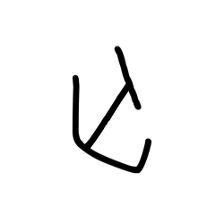

- source_zip_member: `Sub-character Images/55qv0winah/55qv0winah/cjc2mt92cl.png`
- checksum_sha256: see `06_component-visual-index.csv`.
- review_status: `needs_human_visual_review`
- caution: source-marked review image only.

## asset-019936

- source_zip_member: `Sub-character Images/55qv0winah/55qv0winah/d43n8os5ht.png`
- checksum_sha256: see `06_component-visual-index.csv`.
- review_status: `needs_human_visual_review`
- caution: source-marked review image only.

## asset-019937

- source_zip_member: `Sub-character Images/55qv0winah/55qv0winah/dro2vrr945.png`
- checksum_sha256: see `06_component-visual-index.csv`.
- review_status: `needs_human_visual_review`
- caution: source-marked review image only.

## asset-019938

- source_zip_member: `Sub-character Images/55qv0winah/55qv0winah/e87dhv73ph.png`
- checksum_sha256: see `06_component-visual-index.csv`.
- review_status: `needs_human_visual_review`
- caution: source-marked review image only.

## asset-019939

- source_zip_member: `Sub-character Images/55qv0winah/55qv0winah/eteprwo64u.png`
- checksum_sha256: see `06_component-visual-index.csv`.
- review_status: `needs_human_visual_review`
- caution: source-marked review image only.

## asset-019940

- source_zip_member: `Sub-character Images/55qv0winah/55qv0winah/ews3wjkzvt.png`
- checksum_sha256: see `06_component-visual-index.csv`.
- review_status: `needs_human_visual_review`
- caution: source-marked review image only.

## asset-019941

- source_zip_member: `Sub-character Images/55qv0winah/55qv0winah/f3n8j31kk7.png`
- checksum_sha256: see `06_component-visual-index.csv`.
- review_status: `needs_human_visual_review`
- caution: source-marked review image only.

## asset-019942

- source_zip_member: `Sub-character Images/55qv0winah/55qv0winah/gh74r8nzpv.png`
- checksum_sha256: see `06_component-visual-index.csv`.
- review_status: `needs_human_visual_review`
- caution: source-marked review image only.

## asset-019943

- source_zip_member: `Sub-character Images/55qv0winah/55qv0winah/gr10blqpwv.png`
- checksum_sha256: see `06_component-visual-index.csv`.
- review_status: `needs_human_visual_review`
- caution: source-marked review image only.

## asset-019944

- source_zip_member: `Sub-character Images/55qv0winah/55qv0winah/gsbxmcvxso.png`
- checksum_sha256: see `06_component-visual-index.csv`.
- review_status: `needs_human_visual_review`
- caution: source-marked review image only.

## asset-019945

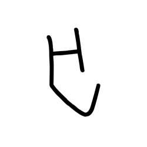

- source_zip_member: `Sub-character Images/55qv0winah/55qv0winah/h19n6ssuk2.png`
- checksum_sha256: see `06_component-visual-index.csv`.
- review_status: `needs_human_visual_review`
- caution: source-marked review image only.

## asset-019946

- source_zip_member: `Sub-character Images/55qv0winah/55qv0winah/h9sjy2kyhh.png`
- checksum_sha256: see `06_component-visual-index.csv`.
- review_status: `needs_human_visual_review`
- caution: source-marked review image only.

## asset-019947

- source_zip_member: `Sub-character Images/55qv0winah/55qv0winah/hvp7tjzlq3.png`
- checksum_sha256: see `06_component-visual-index.csv`.
- review_status: `needs_human_visual_review`
- caution: source-marked review image only.

## asset-019948

- source_zip_member: `Sub-character Images/55qv0winah/55qv0winah/ildv8934ai.png`
- checksum_sha256: see `06_component-visual-index.csv`.
- review_status: `needs_human_visual_review`
- caution: source-marked review image only.

## asset-019949

- source_zip_member: `Sub-character Images/55qv0winah/55qv0winah/iv1zgaqdzi.png`
- checksum_sha256: see `06_component-visual-index.csv`.
- review_status: `needs_human_visual_review`
- caution: source-marked review image only.

## asset-019950

- source_zip_member: `Sub-character Images/55qv0winah/55qv0winah/jf8efni8rw.png`
- checksum_sha256: see `06_component-visual-index.csv`.
- review_status: `needs_human_visual_review`
- caution: source-marked review image only.

## asset-019951

- source_zip_member: `Sub-character Images/55qv0winah/55qv0winah/jggniqh6ak.png`
- checksum_sha256: see `06_component-visual-index.csv`.
- review_status: `needs_human_visual_review`
- caution: source-marked review image only.

## asset-019952

- source_zip_member: `Sub-character Images/55qv0winah/55qv0winah/jv0rky29j1.png`
- checksum_sha256: see `06_component-visual-index.csv`.
- review_status: `needs_human_visual_review`
- caution: source-marked review image only.

## asset-019953

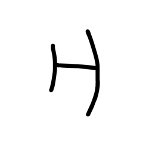

- source_zip_member: `Sub-character Images/55qv0winah/55qv0winah/k8rufiqxd4.png`
- checksum_sha256: see `06_component-visual-index.csv`.
- review_status: `needs_human_visual_review`
- caution: source-marked review image only.

## asset-019954

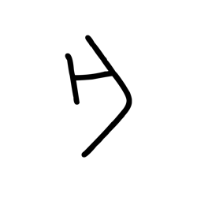

- source_zip_member: `Sub-character Images/55qv0winah/55qv0winah/knriqsfq28.png`
- checksum_sha256: see `06_component-visual-index.csv`.
- review_status: `needs_human_visual_review`
- caution: source-marked review image only.

## asset-019955

- source_zip_member: `Sub-character Images/55qv0winah/55qv0winah/kyv4ntkp7v.png`
- checksum_sha256: see `06_component-visual-index.csv`.
- review_status: `needs_human_visual_review`
- caution: source-marked review image only.

## asset-019956

- source_zip_member: `Sub-character Images/55qv0winah/55qv0winah/l56sy1tx1u.png`
- checksum_sha256: see `06_component-visual-index.csv`.
- review_status: `needs_human_visual_review`
- caution: source-marked review image only.

## asset-019957

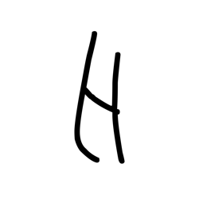

- source_zip_member: `Sub-character Images/55qv0winah/55qv0winah/lgxzgimqkt.png`
- checksum_sha256: see `06_component-visual-index.csv`.
- review_status: `needs_human_visual_review`
- caution: source-marked review image only.

## asset-019958

- source_zip_member: `Sub-character Images/55qv0winah/55qv0winah/m2iv2d7rzz.png`
- checksum_sha256: see `06_component-visual-index.csv`.
- review_status: `needs_human_visual_review`
- caution: source-marked review image only.

## asset-019959

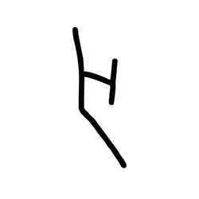

- source_zip_member: `Sub-character Images/55qv0winah/55qv0winah/mtau43na4f.png`
- checksum_sha256: see `06_component-visual-index.csv`.
- review_status: `needs_human_visual_review`
- caution: source-marked review image only.

## asset-019960

- source_zip_member: `Sub-character Images/55qv0winah/55qv0winah/nugfus0o7x.png`
- checksum_sha256: see `06_component-visual-index.csv`.
- review_status: `needs_human_visual_review`
- caution: source-marked review image only.

## asset-019961

- source_zip_member: `Sub-character Images/55qv0winah/55qv0winah/o2cl3znsda.png`
- checksum_sha256: see `06_component-visual-index.csv`.
- review_status: `needs_human_visual_review`
- caution: source-marked review image only.

## asset-019962

- source_zip_member: `Sub-character Images/55qv0winah/55qv0winah/o7xfpw3vyl.png`
- checksum_sha256: see `06_component-visual-index.csv`.
- review_status: `needs_human_visual_review`
- caution: source-marked review image only.

## asset-019963

- source_zip_member: `Sub-character Images/55qv0winah/55qv0winah/of52qccuqo.png`
- checksum_sha256: see `06_component-visual-index.csv`.
- review_status: `needs_human_visual_review`
- caution: source-marked review image only.

## asset-019964

- source_zip_member: `Sub-character Images/55qv0winah/55qv0winah/oqqrwgohsw.png`
- checksum_sha256: see `06_component-visual-index.csv`.
- review_status: `needs_human_visual_review`
- caution: source-marked review image only.

## asset-019965

- source_zip_member: `Sub-character Images/55qv0winah/55qv0winah/ph7b8t3vu8.png`
- checksum_sha256: see `06_component-visual-index.csv`.
- review_status: `needs_human_visual_review`
- caution: source-marked review image only.

## asset-019966

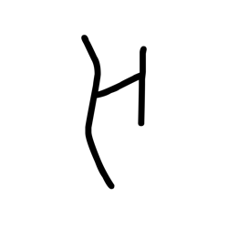

- source_zip_member: `Sub-character Images/55qv0winah/55qv0winah/pxd3qood3o.png`
- checksum_sha256: see `06_component-visual-index.csv`.
- review_status: `needs_human_visual_review`
- caution: source-marked review image only.

## asset-019967

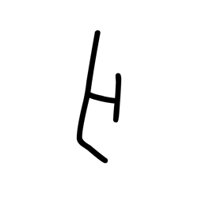

- source_zip_member: `Sub-character Images/55qv0winah/55qv0winah/q2as9ivm7w.png`
- checksum_sha256: see `06_component-visual-index.csv`.
- review_status: `needs_human_visual_review`
- caution: source-marked review image only.

## asset-019968

- source_zip_member: `Sub-character Images/55qv0winah/55qv0winah/qdouu91qgb.png`
- checksum_sha256: see `06_component-visual-index.csv`.
- review_status: `needs_human_visual_review`
- caution: source-marked review image only.

## asset-019969

- source_zip_member: `Sub-character Images/55qv0winah/55qv0winah/qlp2vzb5dl.png`
- checksum_sha256: see `06_component-visual-index.csv`.
- review_status: `needs_human_visual_review`
- caution: source-marked review image only.

## asset-019970

- source_zip_member: `Sub-character Images/55qv0winah/55qv0winah/r8p2di7kb5.png`
- checksum_sha256: see `06_component-visual-index.csv`.
- review_status: `needs_human_visual_review`
- caution: source-marked review image only.

## asset-019971

- source_zip_member: `Sub-character Images/55qv0winah/55qv0winah/rtsaxqmsm8.png`
- checksum_sha256: see `06_component-visual-index.csv`.
- review_status: `needs_human_visual_review`
- caution: source-marked review image only.

## asset-019972

- source_zip_member: `Sub-character Images/55qv0winah/55qv0winah/s331brqcf3.png`
- checksum_sha256: see `06_component-visual-index.csv`.
- review_status: `needs_human_visual_review`
- caution: source-marked review image only.

## asset-019973

- source_zip_member: `Sub-character Images/55qv0winah/55qv0winah/toj77sdk3g.png`
- checksum_sha256: see `06_component-visual-index.csv`.
- review_status: `needs_human_visual_review`
- caution: source-marked review image only.

## asset-019974

- source_zip_member: `Sub-character Images/55qv0winah/55qv0winah/tt8nfsh8m2.png`
- checksum_sha256: see `06_component-visual-index.csv`.
- review_status: `needs_human_visual_review`
- caution: source-marked review image only.

## asset-019975

- source_zip_member: `Sub-character Images/55qv0winah/55qv0winah/tus7qvlup5.png`
- checksum_sha256: see `06_component-visual-index.csv`.
- review_status: `needs_human_visual_review`
- caution: source-marked review image only.

## asset-019976

- source_zip_member: `Sub-character Images/55qv0winah/55qv0winah/uwnk9wolog.png`
- checksum_sha256: see `06_component-visual-index.csv`.
- review_status: `needs_human_visual_review`
- caution: source-marked review image only.

## asset-019977

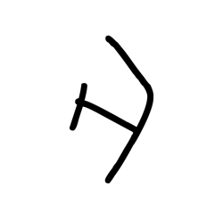

- source_zip_member: `Sub-character Images/55qv0winah/55qv0winah/v2qb4e0kwn.png`
- checksum_sha256: see `06_component-visual-index.csv`.
- review_status: `needs_human_visual_review`
- caution: source-marked review image only.

## asset-019978

- source_zip_member: `Sub-character Images/55qv0winah/55qv0winah/vuvjy11laz.png`
- checksum_sha256: see `06_component-visual-index.csv`.
- review_status: `needs_human_visual_review`
- caution: source-marked review image only.

## asset-019979

- source_zip_member: `Sub-character Images/55qv0winah/55qv0winah/vy6ah6kvaf.png`
- checksum_sha256: see `06_component-visual-index.csv`.
- review_status: `needs_human_visual_review`
- caution: source-marked review image only.

## asset-019980

- source_zip_member: `Sub-character Images/55qv0winah/55qv0winah/x0k6sugdxl.png`
- checksum_sha256: see `06_component-visual-index.csv`.
- review_status: `needs_human_visual_review`
- caution: source-marked review image only.

## asset-019981

- source_zip_member: `Sub-character Images/55qv0winah/55qv0winah/x4j0mkm0fw.png`
- checksum_sha256: see `06_component-visual-index.csv`.
- review_status: `needs_human_visual_review`
- caution: source-marked review image only.

## asset-019982

- source_zip_member: `Sub-character Images/55qv0winah/55qv0winah/xnjgwjjmz3.png`
- checksum_sha256: see `06_component-visual-index.csv`.
- review_status: `needs_human_visual_review`
- caution: source-marked review image only.

## asset-019983

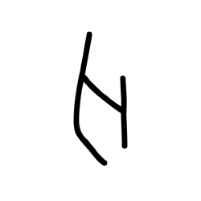

- source_zip_member: `Sub-character Images/55qv0winah/55qv0winah/xsvam3vdms.png`
- checksum_sha256: see `06_component-visual-index.csv`.
- review_status: `needs_human_visual_review`
- caution: source-marked review image only.

## asset-019984

- source_zip_member: `Sub-character Images/55qv0winah/55qv0winah/ykhb1n4clc.png`
- checksum_sha256: see `06_component-visual-index.csv`.
- review_status: `needs_human_visual_review`
- caution: source-marked review image only.

## asset-019985

- source_zip_member: `Sub-character Images/55qv0winah/55qv0winah/yoln4rdi44.png`
- checksum_sha256: see `06_component-visual-index.csv`.
- review_status: `needs_human_visual_review`
- caution: source-marked review image only.

## asset-019986

- source_zip_member: `Sub-character Images/55qv0winah/55qv0winah/ysn4ga9rdz.png`
- checksum_sha256: see `06_component-visual-index.csv`.
- review_status: `needs_human_visual_review`
- caution: source-marked review image only.

## asset-019987

- source_zip_member: `Sub-character Images/55qv0winah/55qv0winah/z9r6k5kt08.png`
- checksum_sha256: see `06_component-visual-index.csv`.
- review_status: `needs_human_visual_review`
- caution: source-marked review image only.
