# Component Visual Gallery / 构件图像查看: obs-comp-cand-002218

English:
This page displays OBIMD subcharacter PNG assets extracted into this concrete corpus object directory for human review.

简体中文：
本页展示抽取到当前具体 corpus 对象目录内的 OBIMD subcharacter PNG 资料，供人工复核使用。

Boundary / 边界：dataset image candidate only; not a confirmed component form, component assignment, or decipherment claim.

## asset-020002

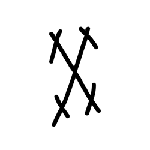

- source_zip_member: `Sub-character Images/h32m5ulkit/h32m5ulkit/2cwkm99jxj.png`
- checksum_sha256: `c1dc7e6c04668f3a207f71abf81ef6a5f85f457d2aa6fa0c986aa532bd6deb2b`
- review_status: `needs_human_visual_review`
- caution: OBIMD subcharacter image is a source-marked review asset only; it is not a confirmed component form, component assignment, or decipherment conclusion.

## asset-020003

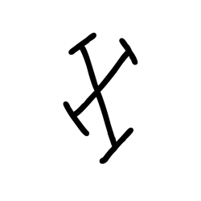

- source_zip_member: `Sub-character Images/h32m5ulkit/h32m5ulkit/2h4fldxcu5.png`
- checksum_sha256: `bad447af9052e7040bee2979aa29a9ac6ab3ad75c70f95d1d9c58febc91efb0b`
- review_status: `needs_human_visual_review`
- caution: OBIMD subcharacter image is a source-marked review asset only; it is not a confirmed component form, component assignment, or decipherment conclusion.

## asset-020004

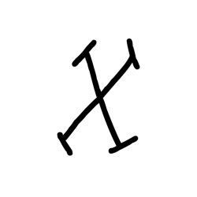

- source_zip_member: `Sub-character Images/h32m5ulkit/h32m5ulkit/3bjeyy4rvw.png`
- checksum_sha256: `8a3184eacca47963c48f85b46976e4ef9374d1aac444be66f53d83dd2f219e8f`
- review_status: `needs_human_visual_review`
- caution: OBIMD subcharacter image is a source-marked review asset only; it is not a confirmed component form, component assignment, or decipherment conclusion.

## asset-020005

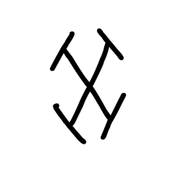

- source_zip_member: `Sub-character Images/h32m5ulkit/h32m5ulkit/4asx5h5lx6.png`
- checksum_sha256: `1060ec78d43a6c16a785546276e0ffe62cf1f54944dc44b843449af3eef99c60`
- review_status: `needs_human_visual_review`
- caution: OBIMD subcharacter image is a source-marked review asset only; it is not a confirmed component form, component assignment, or decipherment conclusion.

## asset-020006

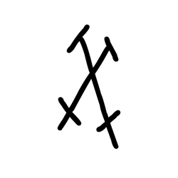

- source_zip_member: `Sub-character Images/h32m5ulkit/h32m5ulkit/63cpktdsi5.png`
- checksum_sha256: `16fa473ca4cefbdb0d28b8d940d0591715274e8669b565e7392af9f48108aa0d`
- review_status: `needs_human_visual_review`
- caution: OBIMD subcharacter image is a source-marked review asset only; it is not a confirmed component form, component assignment, or decipherment conclusion.

## asset-020007

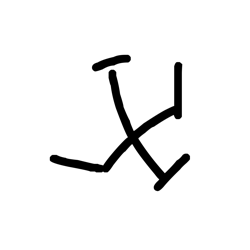

- source_zip_member: `Sub-character Images/h32m5ulkit/h32m5ulkit/7xr0xrv9it.png`
- checksum_sha256: `e798e85d80c8983e263f856c0609b6ed5388443074cd9c9f1df61ad31ce5d100`
- review_status: `needs_human_visual_review`
- caution: OBIMD subcharacter image is a source-marked review asset only; it is not a confirmed component form, component assignment, or decipherment conclusion.

## asset-020008

- source_zip_member: `Sub-character Images/h32m5ulkit/h32m5ulkit/c6vjw3l97i.png`
- checksum_sha256: `5a1db05b2fd9c38bb283c5a7ba51c9e75d4bab7c280ef9f461fad10c9341b152`
- review_status: `needs_human_visual_review`
- caution: OBIMD subcharacter image is a source-marked review asset only; it is not a confirmed component form, component assignment, or decipherment conclusion.

## asset-020009

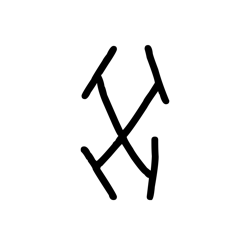

- source_zip_member: `Sub-character Images/h32m5ulkit/h32m5ulkit/chhqm9rvxm.png`
- checksum_sha256: `e4abe747ee16f22c51a3b09e004d12402896699c33bcc5be28beb586263391a5`
- review_status: `needs_human_visual_review`
- caution: OBIMD subcharacter image is a source-marked review asset only; it is not a confirmed component form, component assignment, or decipherment conclusion.

## asset-020010

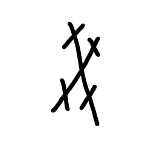

- source_zip_member: `Sub-character Images/h32m5ulkit/h32m5ulkit/cyqxccictb.png`
- checksum_sha256: `b1fb869114ebf559bd658bd3bd0cc448c41f0154b91eeed439c9286395830a2b`
- review_status: `needs_human_visual_review`
- caution: OBIMD subcharacter image is a source-marked review asset only; it is not a confirmed component form, component assignment, or decipherment conclusion.

## asset-020011

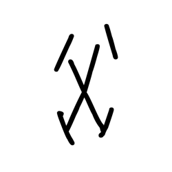

- source_zip_member: `Sub-character Images/h32m5ulkit/h32m5ulkit/d45e0w996m.png`
- checksum_sha256: `77751013c31abd6cb441b872f9aee482597562ce9771757ac5e4857d241d0665`
- review_status: `needs_human_visual_review`
- caution: OBIMD subcharacter image is a source-marked review asset only; it is not a confirmed component form, component assignment, or decipherment conclusion.

## asset-020012

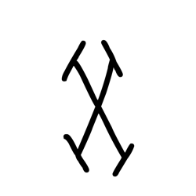

- source_zip_member: `Sub-character Images/h32m5ulkit/h32m5ulkit/exx5lcriy0.png`
- checksum_sha256: `ce7df39bb371dfb3c73b846dc070edcefcea59b8c2a6ecf11f6abd7abe7e298c`
- review_status: `needs_human_visual_review`
- caution: OBIMD subcharacter image is a source-marked review asset only; it is not a confirmed component form, component assignment, or decipherment conclusion.

## asset-020013

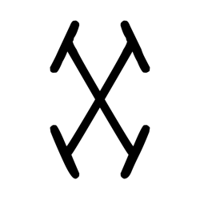

- source_zip_member: `Sub-character Images/h32m5ulkit/h32m5ulkit/h32m5ulkit.png`
- checksum_sha256: `eb14ed13555d4d18fe2462b916cfafe5d51d671ebec78ceb4eadcf98c4faee90`
- review_status: `needs_human_visual_review`
- caution: OBIMD subcharacter image is a source-marked review asset only; it is not a confirmed component form, component assignment, or decipherment conclusion.

## asset-020014

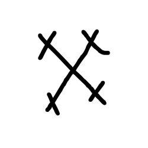

- source_zip_member: `Sub-character Images/h32m5ulkit/h32m5ulkit/ir0u2w2njk.png`
- checksum_sha256: `920de496698ebd68b3b1fa3c6eeb0f786c5d5eb9735bb66766a99b57650c33ed`
- review_status: `needs_human_visual_review`
- caution: OBIMD subcharacter image is a source-marked review asset only; it is not a confirmed component form, component assignment, or decipherment conclusion.

## asset-020015

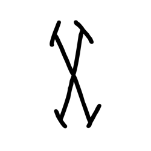

- source_zip_member: `Sub-character Images/h32m5ulkit/h32m5ulkit/jam5x17rjh.png`
- checksum_sha256: `a120709f7d979ae50753d74a3321ab226f14f7ef115f53134b0f82ae957c6784`
- review_status: `needs_human_visual_review`
- caution: OBIMD subcharacter image is a source-marked review asset only; it is not a confirmed component form, component assignment, or decipherment conclusion.

## asset-020016

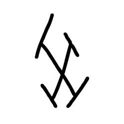

- source_zip_member: `Sub-character Images/h32m5ulkit/h32m5ulkit/jhuulwtrnj.png`
- checksum_sha256: `a4f62b4a37a75b1ad98a245f39e0b4a0510fcbf076b0939b881a220e7e55503c`
- review_status: `needs_human_visual_review`
- caution: OBIMD subcharacter image is a source-marked review asset only; it is not a confirmed component form, component assignment, or decipherment conclusion.

## asset-020017

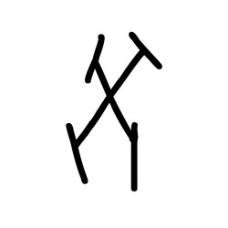

- source_zip_member: `Sub-character Images/h32m5ulkit/h32m5ulkit/k33eb93nsj.png`
- checksum_sha256: `2179c7e3ed48c670949db4ee096c873c4f15dfbf76f240f4b3980f89e418154c`
- review_status: `needs_human_visual_review`
- caution: OBIMD subcharacter image is a source-marked review asset only; it is not a confirmed component form, component assignment, or decipherment conclusion.

## asset-020018

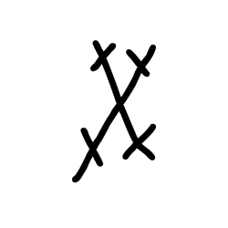

- source_zip_member: `Sub-character Images/h32m5ulkit/h32m5ulkit/me6f83y13u.png`
- checksum_sha256: `6c1b58190c97d47378d9e98b9d9b822e976de8446bbdf79cdb7116a337d3d718`
- review_status: `needs_human_visual_review`
- caution: OBIMD subcharacter image is a source-marked review asset only; it is not a confirmed component form, component assignment, or decipherment conclusion.

## asset-020019

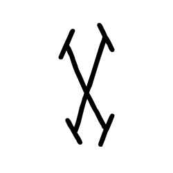

- source_zip_member: `Sub-character Images/h32m5ulkit/h32m5ulkit/mg26pvyf43.png`
- checksum_sha256: `941fc3008a8bf721e82759dce6a18dd9ade1abdb3dda6fc9892661a1ca5fc25c`
- review_status: `needs_human_visual_review`
- caution: OBIMD subcharacter image is a source-marked review asset only; it is not a confirmed component form, component assignment, or decipherment conclusion.

## asset-020020

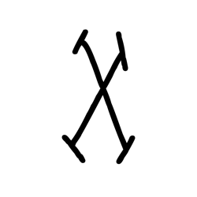

- source_zip_member: `Sub-character Images/h32m5ulkit/h32m5ulkit/o7dq23yyjy.png`
- checksum_sha256: `8555db28fdf3843323648e5229d16376a1d8d717d04ee9ce4294d378a3fc3194`
- review_status: `needs_human_visual_review`
- caution: OBIMD subcharacter image is a source-marked review asset only; it is not a confirmed component form, component assignment, or decipherment conclusion.

## asset-020021

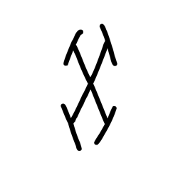

- source_zip_member: `Sub-character Images/h32m5ulkit/h32m5ulkit/r378y4uczy.png`
- checksum_sha256: `cc16eb9b3aeb037f4016263231a45f72534167e7d7fe1226d75e331b303d5dae`
- review_status: `needs_human_visual_review`
- caution: OBIMD subcharacter image is a source-marked review asset only; it is not a confirmed component form, component assignment, or decipherment conclusion.

## asset-020022

- source_zip_member: `Sub-character Images/h32m5ulkit/h32m5ulkit/s06ampjh6x.png`
- checksum_sha256: `20463f1a9ab9d345ed623462df4938c243283d817ee51490d1359b642b825bd8`
- review_status: `needs_human_visual_review`
- caution: OBIMD subcharacter image is a source-marked review asset only; it is not a confirmed component form, component assignment, or decipherment conclusion.

## asset-020023

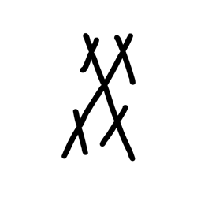

- source_zip_member: `Sub-character Images/h32m5ulkit/h32m5ulkit/tvvhw530rx.png`
- checksum_sha256: `2d16514ed2a2a9edc9156e9876b899eed983dfee21a35879793b04e8c7a237a5`
- review_status: `needs_human_visual_review`
- caution: OBIMD subcharacter image is a source-marked review asset only; it is not a confirmed component form, component assignment, or decipherment conclusion.

## asset-020024

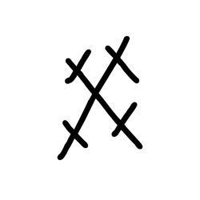

- source_zip_member: `Sub-character Images/h32m5ulkit/h32m5ulkit/vyyql825wh.png`
- checksum_sha256: `752dc3874cd974725ee8367e0b10c137d34bf269fd62aee48d5dbbc480a0adaa`
- review_status: `needs_human_visual_review`
- caution: OBIMD subcharacter image is a source-marked review asset only; it is not a confirmed component form, component assignment, or decipherment conclusion.

## asset-020025

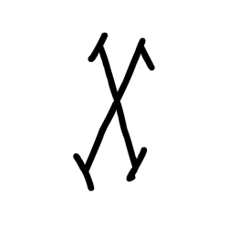

- source_zip_member: `Sub-character Images/h32m5ulkit/h32m5ulkit/xl71xw9uvs.png`
- checksum_sha256: `7b505aa35c7dd36cf23639773ab45f2316b636ba6d609c14c9425a93d55afbf3`
- review_status: `needs_human_visual_review`
- caution: OBIMD subcharacter image is a source-marked review asset only; it is not a confirmed component form, component assignment, or decipherment conclusion.

## asset-020026

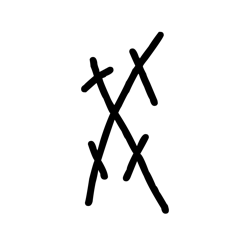

- source_zip_member: `Sub-character Images/h32m5ulkit/h32m5ulkit/xmq2xpxwqe.png`
- checksum_sha256: `7c2f4b27b7a1faee137142d013d0968cd407887490a32921c7ce5cc3af8ac404`
- review_status: `needs_human_visual_review`
- caution: OBIMD subcharacter image is a source-marked review asset only; it is not a confirmed component form, component assignment, or decipherment conclusion.

## asset-020027

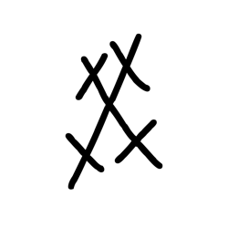

- source_zip_member: `Sub-character Images/h32m5ulkit/h32m5ulkit/ygc9a17ibu.png`
- checksum_sha256: `e0be4a75f962fdd72a700a005fc1d9cdcd6a227729867d6d34bfaa7f4912582c`
- review_status: `needs_human_visual_review`
- caution: OBIMD subcharacter image is a source-marked review asset only; it is not a confirmed component form, component assignment, or decipherment conclusion.

## asset-020028

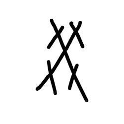

- source_zip_member: `Sub-character Images/h32m5ulkit/h32m5ulkit/yhmkfh4k6f.png`
- checksum_sha256: `f3304180889a4f6d16fa745d465f0a0be24bac771536590785d1132bef39a97c`
- review_status: `needs_human_visual_review`
- caution: OBIMD subcharacter image is a source-marked review asset only; it is not a confirmed component form, component assignment, or decipherment conclusion.

## asset-020029

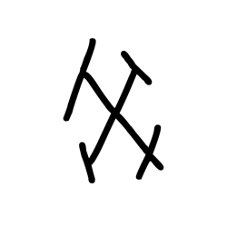

- source_zip_member: `Sub-character Images/h32m5ulkit/h32m5ulkit/zj09nhh6b7.png`
- checksum_sha256: `c403c326951bbdf43d479e9793f35ae1557ca10477ac7039b00aec61220d24b7`
- review_status: `needs_human_visual_review`
- caution: OBIMD subcharacter image is a source-marked review asset only; it is not a confirmed component form, component assignment, or decipherment conclusion.

## asset-020030

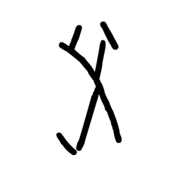

- source_zip_member: `Sub-character Images/h32m5ulkit/h32m5ulkit/zulkrjrg6k.png`
- checksum_sha256: `49f00c995ec2411f647a889397af2fcc229dab3c9f679365ba10229fbe9dce07`
- review_status: `needs_human_visual_review`
- caution: OBIMD subcharacter image is a source-marked review asset only; it is not a confirmed component form, component assignment, or decipherment conclusion.

## asset-020031

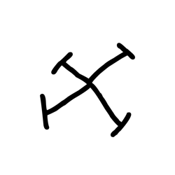

- source_zip_member: `Sub-character Images/h32m5ulkit/h32m5ulkit/zwxgvgo31u.png`
- checksum_sha256: `fd9f114c89775ad0e47998076e4a0cd91977658a1ca72e0e6e9fe46029668829`
- review_status: `needs_human_visual_review`
- caution: OBIMD subcharacter image is a source-marked review asset only; it is not a confirmed component form, component assignment, or decipherment conclusion.
