# Component Visual Gallery / 构件图像查看: obs-comp-cand-002264

English:
This page displays OBIMD subcharacter PNG assets extracted into this concrete
corpus object directory for human review.

简体中文：
本页展示抽取到当前具体 corpus 对象目录内的 OBIMD subcharacter PNG 资料，供人工复核使用。

Boundary / 边界：
dataset image candidate only; not a confirmed component form, not a component
assignment, and not a decipherment claim.
- not a confirmed component form
- not a component assignment
- not a decipherment claim

## Concrete Questions To Check / 具体待查问题

- Open 06_component-visual-index.csv and name the local image row.
- 打开 06_component-visual-index.csv，写明本地图像行。
- Open 09_component-visual-route-index.csv and name the source route row.
- 打开 09_component-visual-route-index.csv，写明来源路线行。
- Open 13_component-context-evidence-dossier.md for character context.
- 打开 13_component-context-evidence-dossier.md，核对单字与卜辞上下文。
- Record the missing image, near-shape, source, or context route.
- 记录缺失的图像、近形、来源或上下文路线。

## asset-020077

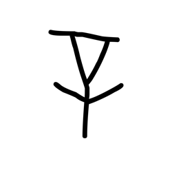

- source_zip_member: `Sub-character Images/m2w1k92a5a/m2w1k92a5a/0soo2chvzb.png`
- checksum_sha256: see `06_component-visual-index.csv`.
- review_status: `needs_human_visual_review`
- caution: source-marked review image only.

## asset-020078

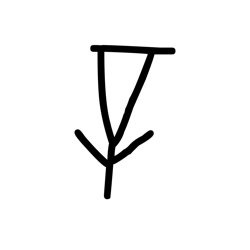

- source_zip_member: `Sub-character Images/m2w1k92a5a/m2w1k92a5a/1kdenf3q2p.png`
- checksum_sha256: see `06_component-visual-index.csv`.
- review_status: `needs_human_visual_review`
- caution: source-marked review image only.

## asset-020079

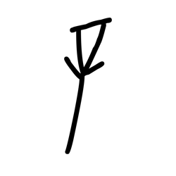

- source_zip_member: `Sub-character Images/m2w1k92a5a/m2w1k92a5a/1ojharrlcj.png`
- checksum_sha256: see `06_component-visual-index.csv`.
- review_status: `needs_human_visual_review`
- caution: source-marked review image only.

## asset-020080

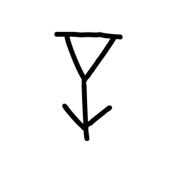

- source_zip_member: `Sub-character Images/m2w1k92a5a/m2w1k92a5a/5pp99np6p4.png`
- checksum_sha256: see `06_component-visual-index.csv`.
- review_status: `needs_human_visual_review`
- caution: source-marked review image only.

## asset-020081

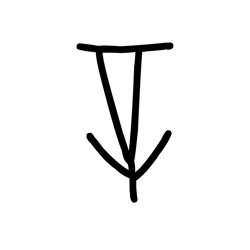

- source_zip_member: `Sub-character Images/m2w1k92a5a/m2w1k92a5a/5qfi4z2126.png`
- checksum_sha256: see `06_component-visual-index.csv`.
- review_status: `needs_human_visual_review`
- caution: source-marked review image only.

## asset-020082

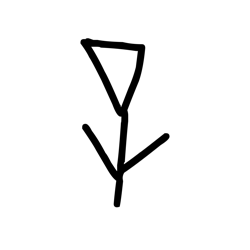

- source_zip_member: `Sub-character Images/m2w1k92a5a/m2w1k92a5a/6yiwixowui.png`
- checksum_sha256: see `06_component-visual-index.csv`.
- review_status: `needs_human_visual_review`
- caution: source-marked review image only.

## asset-020083

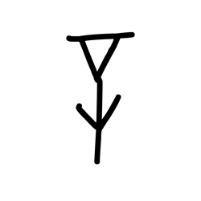

- source_zip_member: `Sub-character Images/m2w1k92a5a/m2w1k92a5a/6zq5369b17.png`
- checksum_sha256: see `06_component-visual-index.csv`.
- review_status: `needs_human_visual_review`
- caution: source-marked review image only.

## asset-020084

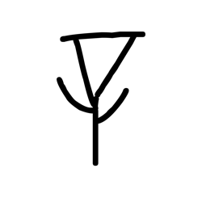

- source_zip_member: `Sub-character Images/m2w1k92a5a/m2w1k92a5a/7be7xph0re.png`
- checksum_sha256: see `06_component-visual-index.csv`.
- review_status: `needs_human_visual_review`
- caution: source-marked review image only.

## asset-020085

- source_zip_member: `Sub-character Images/m2w1k92a5a/m2w1k92a5a/82blajikti.png`
- checksum_sha256: see `06_component-visual-index.csv`.
- review_status: `needs_human_visual_review`
- caution: source-marked review image only.

## asset-020086

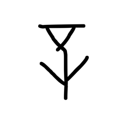

- source_zip_member: `Sub-character Images/m2w1k92a5a/m2w1k92a5a/8frec8gzmg.png`
- checksum_sha256: see `06_component-visual-index.csv`.
- review_status: `needs_human_visual_review`
- caution: source-marked review image only.

## asset-020087

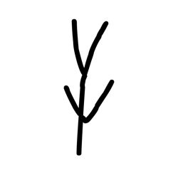

- source_zip_member: `Sub-character Images/m2w1k92a5a/m2w1k92a5a/9kvnl1d9iy.png`
- checksum_sha256: see `06_component-visual-index.csv`.
- review_status: `needs_human_visual_review`
- caution: source-marked review image only.

## asset-020088

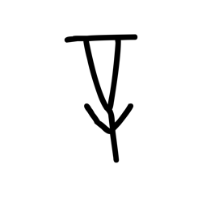

- source_zip_member: `Sub-character Images/m2w1k92a5a/m2w1k92a5a/asu62wkvzt.png`
- checksum_sha256: see `06_component-visual-index.csv`.
- review_status: `needs_human_visual_review`
- caution: source-marked review image only.

## asset-020089

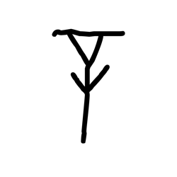

- source_zip_member: `Sub-character Images/m2w1k92a5a/m2w1k92a5a/axe1prz4jn.png`
- checksum_sha256: see `06_component-visual-index.csv`.
- review_status: `needs_human_visual_review`
- caution: source-marked review image only.

## asset-020090

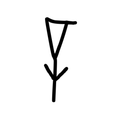

- source_zip_member: `Sub-character Images/m2w1k92a5a/m2w1k92a5a/fla8fdombj.png`
- checksum_sha256: see `06_component-visual-index.csv`.
- review_status: `needs_human_visual_review`
- caution: source-marked review image only.

## asset-020091

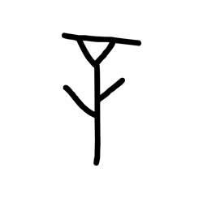

- source_zip_member: `Sub-character Images/m2w1k92a5a/m2w1k92a5a/g8ipszdr47.png`
- checksum_sha256: see `06_component-visual-index.csv`.
- review_status: `needs_human_visual_review`
- caution: source-marked review image only.

## asset-020092

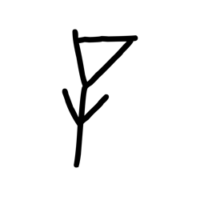

- source_zip_member: `Sub-character Images/m2w1k92a5a/m2w1k92a5a/i8uls1vb60.png`
- checksum_sha256: see `06_component-visual-index.csv`.
- review_status: `needs_human_visual_review`
- caution: source-marked review image only.

## asset-020093

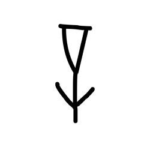

- source_zip_member: `Sub-character Images/m2w1k92a5a/m2w1k92a5a/m15qifzg0k.png`
- checksum_sha256: see `06_component-visual-index.csv`.
- review_status: `needs_human_visual_review`
- caution: source-marked review image only.

## asset-020094

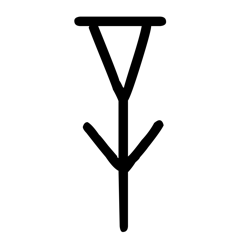

- source_zip_member: `Sub-character Images/m2w1k92a5a/m2w1k92a5a/m2w1k92a5a.png`
- checksum_sha256: see `06_component-visual-index.csv`.
- review_status: `needs_human_visual_review`
- caution: source-marked review image only.

## asset-020095

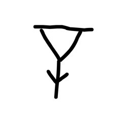

- source_zip_member: `Sub-character Images/m2w1k92a5a/m2w1k92a5a/mo1r6qbxds.png`
- checksum_sha256: see `06_component-visual-index.csv`.
- review_status: `needs_human_visual_review`
- caution: source-marked review image only.

## asset-020096

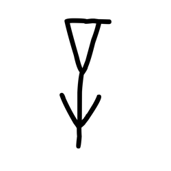

- source_zip_member: `Sub-character Images/m2w1k92a5a/m2w1k92a5a/nry49jymbh.png`
- checksum_sha256: see `06_component-visual-index.csv`.
- review_status: `needs_human_visual_review`
- caution: source-marked review image only.

## asset-020097

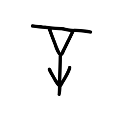

- source_zip_member: `Sub-character Images/m2w1k92a5a/m2w1k92a5a/nsqmykl3vk.png`
- checksum_sha256: see `06_component-visual-index.csv`.
- review_status: `needs_human_visual_review`
- caution: source-marked review image only.

## asset-020098

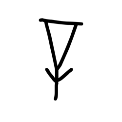

- source_zip_member: `Sub-character Images/m2w1k92a5a/m2w1k92a5a/op0833bupj.png`
- checksum_sha256: see `06_component-visual-index.csv`.
- review_status: `needs_human_visual_review`
- caution: source-marked review image only.

## asset-020099

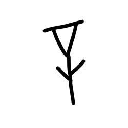

- source_zip_member: `Sub-character Images/m2w1k92a5a/m2w1k92a5a/pd5ofc2lde.png`
- checksum_sha256: see `06_component-visual-index.csv`.
- review_status: `needs_human_visual_review`
- caution: source-marked review image only.

## asset-020100

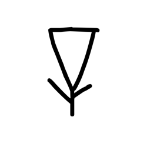

- source_zip_member: `Sub-character Images/m2w1k92a5a/m2w1k92a5a/pfb1nnn5hg.png`
- checksum_sha256: see `06_component-visual-index.csv`.
- review_status: `needs_human_visual_review`
- caution: source-marked review image only.

## asset-020101

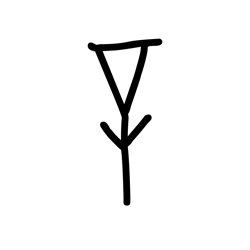

- source_zip_member: `Sub-character Images/m2w1k92a5a/m2w1k92a5a/t96mdkc780.png`
- checksum_sha256: see `06_component-visual-index.csv`.
- review_status: `needs_human_visual_review`
- caution: source-marked review image only.

## asset-020102

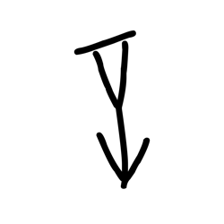

- source_zip_member: `Sub-character Images/m2w1k92a5a/m2w1k92a5a/vt5j65ddo4.png`
- checksum_sha256: see `06_component-visual-index.csv`.
- review_status: `needs_human_visual_review`
- caution: source-marked review image only.

## asset-020103

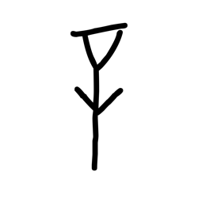

- source_zip_member: `Sub-character Images/m2w1k92a5a/m2w1k92a5a/x1srsmf2rg.png`
- checksum_sha256: see `06_component-visual-index.csv`.
- review_status: `needs_human_visual_review`
- caution: source-marked review image only.

## asset-020104

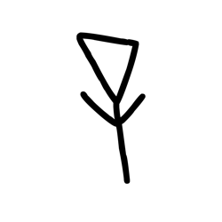

- source_zip_member: `Sub-character Images/m2w1k92a5a/m2w1k92a5a/y1gj3cit1l.png`
- checksum_sha256: see `06_component-visual-index.csv`.
- review_status: `needs_human_visual_review`
- caution: source-marked review image only.

## asset-020105

- source_zip_member: `Sub-character Images/m2w1k92a5a/m2w1k92a5a/zvhgp9fthg.png`
- checksum_sha256: see `06_component-visual-index.csv`.
- review_status: `needs_human_visual_review`
- caution: source-marked review image only.
