# Component Visual Gallery / 构件图像查看: obs-comp-cand-002265

English:
This page displays OBIMD subcharacter PNG assets extracted into this concrete
corpus object directory for human review.

简体中文：
本页展示抽取到当前具体 corpus 对象目录内的 OBIMD subcharacter PNG 资料，供人工复核使用。

Boundary / 边界：
dataset image candidate only; not a confirmed component form, not a component
assignment, and not a decipherment claim.
- not a confirmed component form
- not a component assignment
- not a decipherment claim

## Concrete Questions To Check / 具体待查问题

- Open 06_component-visual-index.csv and name the local image row.
- 打开 06_component-visual-index.csv，写明本地图像行。
- Open 09_component-visual-route-index.csv and name the source route row.
- 打开 09_component-visual-route-index.csv，写明来源路线行。
- Open 13_component-context-evidence-dossier.md for character context.
- 打开 13_component-context-evidence-dossier.md，核对单字与卜辞上下文。
- Record the missing image, near-shape, source, or context route.
- 记录缺失的图像、近形、来源或上下文路线。

## asset-020106

- source_zip_member: `Sub-character Images/m2w1k92a5a/0arw3hwi55/0arw3hwi55.png`
- checksum_sha256: see `06_component-visual-index.csv`.
- review_status: `needs_human_visual_review`
- caution: source-marked review image only.

## asset-020107

- source_zip_member: `Sub-character Images/m2w1k92a5a/0arw3hwi55/1lp4irukaa.png`
- checksum_sha256: see `06_component-visual-index.csv`.
- review_status: `needs_human_visual_review`
- caution: source-marked review image only.

## asset-020108

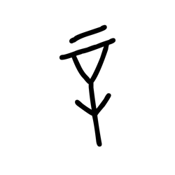

- source_zip_member: `Sub-character Images/m2w1k92a5a/0arw3hwi55/2io0rn3j7z.png`
- checksum_sha256: see `06_component-visual-index.csv`.
- review_status: `needs_human_visual_review`
- caution: source-marked review image only.

## asset-020109

- source_zip_member: `Sub-character Images/m2w1k92a5a/0arw3hwi55/3bmu1cflf3.png`
- checksum_sha256: see `06_component-visual-index.csv`.
- review_status: `needs_human_visual_review`
- caution: source-marked review image only.

## asset-020110

- source_zip_member: `Sub-character Images/m2w1k92a5a/0arw3hwi55/3byqzwu2i6.png`
- checksum_sha256: see `06_component-visual-index.csv`.
- review_status: `needs_human_visual_review`
- caution: source-marked review image only.

## asset-020111

- source_zip_member: `Sub-character Images/m2w1k92a5a/0arw3hwi55/3ed731pzk6.png`
- checksum_sha256: see `06_component-visual-index.csv`.
- review_status: `needs_human_visual_review`
- caution: source-marked review image only.

## asset-020112

- source_zip_member: `Sub-character Images/m2w1k92a5a/0arw3hwi55/55g4xcp1j6.png`
- checksum_sha256: see `06_component-visual-index.csv`.
- review_status: `needs_human_visual_review`
- caution: source-marked review image only.

## asset-020113

- source_zip_member: `Sub-character Images/m2w1k92a5a/0arw3hwi55/7cwmq0xijf.png`
- checksum_sha256: see `06_component-visual-index.csv`.
- review_status: `needs_human_visual_review`
- caution: source-marked review image only.

## asset-020114

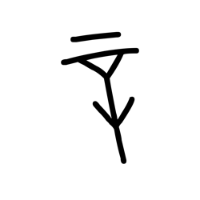

- source_zip_member: `Sub-character Images/m2w1k92a5a/0arw3hwi55/7swq6rxn7h.png`
- checksum_sha256: see `06_component-visual-index.csv`.
- review_status: `needs_human_visual_review`
- caution: source-marked review image only.

## asset-020115

- source_zip_member: `Sub-character Images/m2w1k92a5a/0arw3hwi55/88hz5sf0gd.png`
- checksum_sha256: see `06_component-visual-index.csv`.
- review_status: `needs_human_visual_review`
- caution: source-marked review image only.

## asset-020116

- source_zip_member: `Sub-character Images/m2w1k92a5a/0arw3hwi55/95pwe80ce4.png`
- checksum_sha256: see `06_component-visual-index.csv`.
- review_status: `needs_human_visual_review`
- caution: source-marked review image only.

## asset-020117

- source_zip_member: `Sub-character Images/m2w1k92a5a/0arw3hwi55/9spfhderxt.png`
- checksum_sha256: see `06_component-visual-index.csv`.
- review_status: `needs_human_visual_review`
- caution: source-marked review image only.

## asset-020118

- source_zip_member: `Sub-character Images/m2w1k92a5a/0arw3hwi55/9w9sp4r7gl.png`
- checksum_sha256: see `06_component-visual-index.csv`.
- review_status: `needs_human_visual_review`
- caution: source-marked review image only.

## asset-020119

- source_zip_member: `Sub-character Images/m2w1k92a5a/0arw3hwi55/ahflql9ko1.png`
- checksum_sha256: see `06_component-visual-index.csv`.
- review_status: `needs_human_visual_review`
- caution: source-marked review image only.

## asset-020120

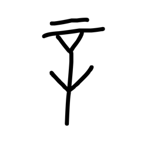

- source_zip_member: `Sub-character Images/m2w1k92a5a/0arw3hwi55/b5v597nmq9.png`
- checksum_sha256: see `06_component-visual-index.csv`.
- review_status: `needs_human_visual_review`
- caution: source-marked review image only.

## asset-020121

- source_zip_member: `Sub-character Images/m2w1k92a5a/0arw3hwi55/b825g5rpik.png`
- checksum_sha256: see `06_component-visual-index.csv`.
- review_status: `needs_human_visual_review`
- caution: source-marked review image only.

## asset-020122

- source_zip_member: `Sub-character Images/m2w1k92a5a/0arw3hwi55/cozjmv371k.png`
- checksum_sha256: see `06_component-visual-index.csv`.
- review_status: `needs_human_visual_review`
- caution: source-marked review image only.

## asset-020123

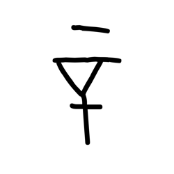

- source_zip_member: `Sub-character Images/m2w1k92a5a/0arw3hwi55/cufirq5jji.png`
- checksum_sha256: see `06_component-visual-index.csv`.
- review_status: `needs_human_visual_review`
- caution: source-marked review image only.

## asset-020124

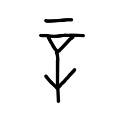

- source_zip_member: `Sub-character Images/m2w1k92a5a/0arw3hwi55/dm2ibujsii.png`
- checksum_sha256: see `06_component-visual-index.csv`.
- review_status: `needs_human_visual_review`
- caution: source-marked review image only.

## asset-020125

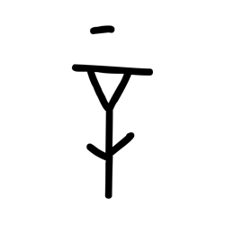

- source_zip_member: `Sub-character Images/m2w1k92a5a/0arw3hwi55/dw9quhuqkg.png`
- checksum_sha256: see `06_component-visual-index.csv`.
- review_status: `needs_human_visual_review`
- caution: source-marked review image only.

## asset-020126

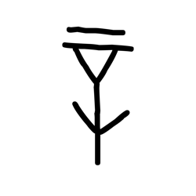

- source_zip_member: `Sub-character Images/m2w1k92a5a/0arw3hwi55/en3c2cmqm6.png`
- checksum_sha256: see `06_component-visual-index.csv`.
- review_status: `needs_human_visual_review`
- caution: source-marked review image only.

## asset-020127

- source_zip_member: `Sub-character Images/m2w1k92a5a/0arw3hwi55/evk6wq92mt.png`
- checksum_sha256: see `06_component-visual-index.csv`.
- review_status: `needs_human_visual_review`
- caution: source-marked review image only.

## asset-020128

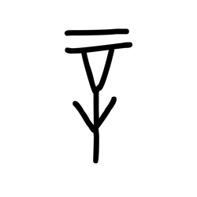

- source_zip_member: `Sub-character Images/m2w1k92a5a/0arw3hwi55/f4mwp00qtm.png`
- checksum_sha256: see `06_component-visual-index.csv`.
- review_status: `needs_human_visual_review`
- caution: source-marked review image only.

## asset-020129

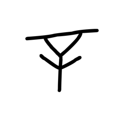

- source_zip_member: `Sub-character Images/m2w1k92a5a/0arw3hwi55/fdxcmxju5o.png`
- checksum_sha256: see `06_component-visual-index.csv`.
- review_status: `needs_human_visual_review`
- caution: source-marked review image only.

## asset-020130

- source_zip_member: `Sub-character Images/m2w1k92a5a/0arw3hwi55/gsl1qpkr7f.png`
- checksum_sha256: see `06_component-visual-index.csv`.
- review_status: `needs_human_visual_review`
- caution: source-marked review image only.

## asset-020131

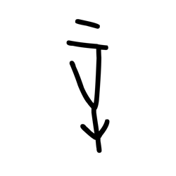

- source_zip_member: `Sub-character Images/m2w1k92a5a/0arw3hwi55/h45r7lxlg3.png`
- checksum_sha256: see `06_component-visual-index.csv`.
- review_status: `needs_human_visual_review`
- caution: source-marked review image only.

## asset-020132

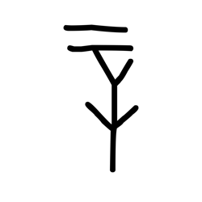

- source_zip_member: `Sub-character Images/m2w1k92a5a/0arw3hwi55/hcpxr8mpe0.png`
- checksum_sha256: see `06_component-visual-index.csv`.
- review_status: `needs_human_visual_review`
- caution: source-marked review image only.

## asset-020133

- source_zip_member: `Sub-character Images/m2w1k92a5a/0arw3hwi55/i6z1amjr6x.png`
- checksum_sha256: see `06_component-visual-index.csv`.
- review_status: `needs_human_visual_review`
- caution: source-marked review image only.

## asset-020134

- source_zip_member: `Sub-character Images/m2w1k92a5a/0arw3hwi55/j27c7np61u.png`
- checksum_sha256: see `06_component-visual-index.csv`.
- review_status: `needs_human_visual_review`
- caution: source-marked review image only.

## asset-020135

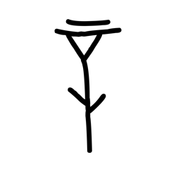

- source_zip_member: `Sub-character Images/m2w1k92a5a/0arw3hwi55/jv92902m45.png`
- checksum_sha256: see `06_component-visual-index.csv`.
- review_status: `needs_human_visual_review`
- caution: source-marked review image only.

## asset-020136

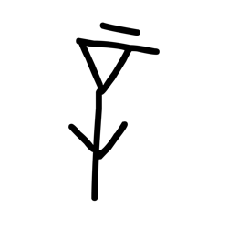

- source_zip_member: `Sub-character Images/m2w1k92a5a/0arw3hwi55/l71c33pbx5.png`
- checksum_sha256: see `06_component-visual-index.csv`.
- review_status: `needs_human_visual_review`
- caution: source-marked review image only.

## asset-020137

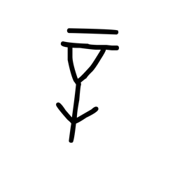

- source_zip_member: `Sub-character Images/m2w1k92a5a/0arw3hwi55/lfgh8n546t.png`
- checksum_sha256: see `06_component-visual-index.csv`.
- review_status: `needs_human_visual_review`
- caution: source-marked review image only.

## asset-020138

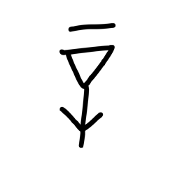

- source_zip_member: `Sub-character Images/m2w1k92a5a/0arw3hwi55/mwxlxkos26.png`
- checksum_sha256: see `06_component-visual-index.csv`.
- review_status: `needs_human_visual_review`
- caution: source-marked review image only.

## asset-020139

- source_zip_member: `Sub-character Images/m2w1k92a5a/0arw3hwi55/n4ibxm31dl.png`
- checksum_sha256: see `06_component-visual-index.csv`.
- review_status: `needs_human_visual_review`
- caution: source-marked review image only.

## asset-020140

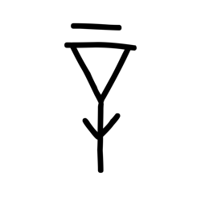

- source_zip_member: `Sub-character Images/m2w1k92a5a/0arw3hwi55/nq1yd8cjqp.png`
- checksum_sha256: see `06_component-visual-index.csv`.
- review_status: `needs_human_visual_review`
- caution: source-marked review image only.

## asset-020141

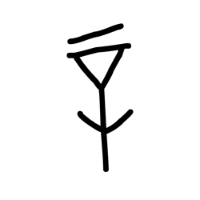

- source_zip_member: `Sub-character Images/m2w1k92a5a/0arw3hwi55/pn81rd7l4u.png`
- checksum_sha256: see `06_component-visual-index.csv`.
- review_status: `needs_human_visual_review`
- caution: source-marked review image only.

## asset-020142

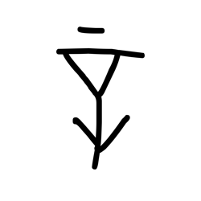

- source_zip_member: `Sub-character Images/m2w1k92a5a/0arw3hwi55/rtsbfzjxgy.png`
- checksum_sha256: see `06_component-visual-index.csv`.
- review_status: `needs_human_visual_review`
- caution: source-marked review image only.

## asset-020143

- source_zip_member: `Sub-character Images/m2w1k92a5a/0arw3hwi55/sffjltgl5c.png`
- checksum_sha256: see `06_component-visual-index.csv`.
- review_status: `needs_human_visual_review`
- caution: source-marked review image only.

## asset-020144

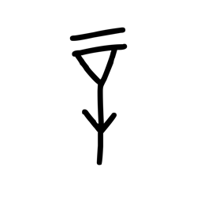

- source_zip_member: `Sub-character Images/m2w1k92a5a/0arw3hwi55/up8ff1ujjc.png`
- checksum_sha256: see `06_component-visual-index.csv`.
- review_status: `needs_human_visual_review`
- caution: source-marked review image only.

## asset-020145

- source_zip_member: `Sub-character Images/m2w1k92a5a/0arw3hwi55/w64b4rj7q8.png`
- checksum_sha256: see `06_component-visual-index.csv`.
- review_status: `needs_human_visual_review`
- caution: source-marked review image only.

## asset-020146

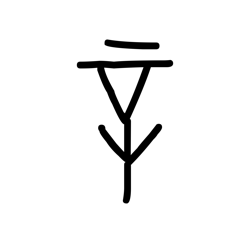

- source_zip_member: `Sub-character Images/m2w1k92a5a/0arw3hwi55/xcem7oqeiw.png`
- checksum_sha256: see `06_component-visual-index.csv`.
- review_status: `needs_human_visual_review`
- caution: source-marked review image only.

## asset-020147

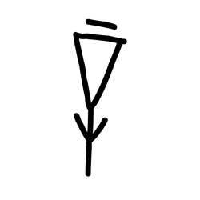

- source_zip_member: `Sub-character Images/m2w1k92a5a/0arw3hwi55/ynacpxwf1q.png`
- checksum_sha256: see `06_component-visual-index.csv`.
- review_status: `needs_human_visual_review`
- caution: source-marked review image only.

## asset-020148

- source_zip_member: `Sub-character Images/m2w1k92a5a/0arw3hwi55/zq0su4kcnr.png`
- checksum_sha256: see `06_component-visual-index.csv`.
- review_status: `needs_human_visual_review`
- caution: source-marked review image only.

## asset-020149

- source_zip_member: `Sub-character Images/m2w1k92a5a/0arw3hwi55/zs369igh01.png`
- checksum_sha256: see `06_component-visual-index.csv`.
- review_status: `needs_human_visual_review`
- caution: source-marked review image only.
