# Component Visual Gallery / 构件图像查看: obs-comp-cand-002288

English:
This page displays OBIMD subcharacter PNG assets extracted into this concrete
corpus object directory for human review.

简体中文：
本页展示抽取到当前具体 corpus 对象目录内的 OBIMD subcharacter PNG 资料，供人工复核使用。

Boundary / 边界：
dataset image candidate only; not a confirmed component form, not a component
assignment, and not a decipherment claim.
- not a confirmed component form
- not a component assignment
- not a decipherment claim

## Concrete Questions To Check / 具体待查问题

- Which local image should be opened first?
- 应先打开哪一张本地构件图像？
- Which source zip member anchors this image?
- 哪一个 source zip member 能定位这张图像？
- Which near-shape or variant comparison is still missing?
- 还缺哪些近形或异体比较？
- Which character or inscription context should be checked next?
- 下一步应核对哪些单字或卜辞上下文？
- What evidence is missing before a component assignment?
- 正式构件归属前还缺哪些证据？

## asset-020172

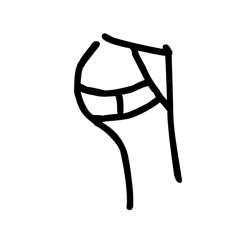

- source_zip_member: `Sub-character Images/4lgdy5a4ta/4lgdy5a4ta/0v7r6lmr02.png`
- checksum_sha256: see `06_component-visual-index.csv`.
- review_status: `needs_human_visual_review`
- caution: source-marked review image only.

## asset-020173

- source_zip_member: `Sub-character Images/4lgdy5a4ta/4lgdy5a4ta/16bg3ozunr.png`
- checksum_sha256: see `06_component-visual-index.csv`.
- review_status: `needs_human_visual_review`
- caution: source-marked review image only.

## asset-020174

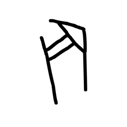

- source_zip_member: `Sub-character Images/4lgdy5a4ta/4lgdy5a4ta/1gc38kkktj.png`
- checksum_sha256: see `06_component-visual-index.csv`.
- review_status: `needs_human_visual_review`
- caution: source-marked review image only.

## asset-020175

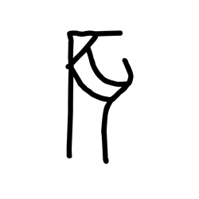

- source_zip_member: `Sub-character Images/4lgdy5a4ta/4lgdy5a4ta/1h88bk309x.png`
- checksum_sha256: see `06_component-visual-index.csv`.
- review_status: `needs_human_visual_review`
- caution: source-marked review image only.

## asset-020176

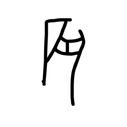

- source_zip_member: `Sub-character Images/4lgdy5a4ta/4lgdy5a4ta/1wdjbinpco.png`
- checksum_sha256: see `06_component-visual-index.csv`.
- review_status: `needs_human_visual_review`
- caution: source-marked review image only.

## asset-020177

- source_zip_member: `Sub-character Images/4lgdy5a4ta/4lgdy5a4ta/2uz00gxjen.png`
- checksum_sha256: see `06_component-visual-index.csv`.
- review_status: `needs_human_visual_review`
- caution: source-marked review image only.

## asset-020178

- source_zip_member: `Sub-character Images/4lgdy5a4ta/4lgdy5a4ta/2ymo6lpuh0.png`
- checksum_sha256: see `06_component-visual-index.csv`.
- review_status: `needs_human_visual_review`
- caution: source-marked review image only.

## asset-020179

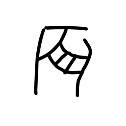

- source_zip_member: `Sub-character Images/4lgdy5a4ta/4lgdy5a4ta/302w0ycplc.png`
- checksum_sha256: see `06_component-visual-index.csv`.
- review_status: `needs_human_visual_review`
- caution: source-marked review image only.

## asset-020180

- source_zip_member: `Sub-character Images/4lgdy5a4ta/4lgdy5a4ta/44at0993oe.png`
- checksum_sha256: see `06_component-visual-index.csv`.
- review_status: `needs_human_visual_review`
- caution: source-marked review image only.

## asset-020181

- source_zip_member: `Sub-character Images/4lgdy5a4ta/4lgdy5a4ta/47wujke6xi.png`
- checksum_sha256: see `06_component-visual-index.csv`.
- review_status: `needs_human_visual_review`
- caution: source-marked review image only.

## asset-020182

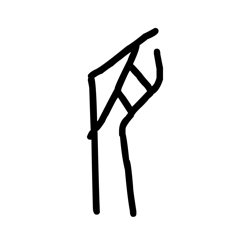

- source_zip_member: `Sub-character Images/4lgdy5a4ta/4lgdy5a4ta/4drplv03fn.png`
- checksum_sha256: see `06_component-visual-index.csv`.
- review_status: `needs_human_visual_review`
- caution: source-marked review image only.

## asset-020183

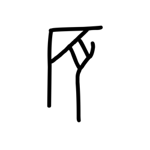

- source_zip_member: `Sub-character Images/4lgdy5a4ta/4lgdy5a4ta/4hddlq9uo1.png`
- checksum_sha256: see `06_component-visual-index.csv`.
- review_status: `needs_human_visual_review`
- caution: source-marked review image only.

## asset-020184

- source_zip_member: `Sub-character Images/4lgdy5a4ta/4lgdy5a4ta/4lgdy5a4ta.png`
- checksum_sha256: see `06_component-visual-index.csv`.
- review_status: `needs_human_visual_review`
- caution: source-marked review image only.

## asset-020185

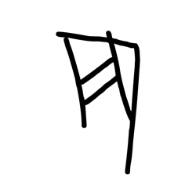

- source_zip_member: `Sub-character Images/4lgdy5a4ta/4lgdy5a4ta/4oebatec08.png`
- checksum_sha256: see `06_component-visual-index.csv`.
- review_status: `needs_human_visual_review`
- caution: source-marked review image only.

## asset-020186

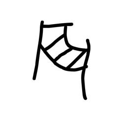

- source_zip_member: `Sub-character Images/4lgdy5a4ta/4lgdy5a4ta/53qa7oxhsy.png`
- checksum_sha256: see `06_component-visual-index.csv`.
- review_status: `needs_human_visual_review`
- caution: source-marked review image only.

## asset-020187

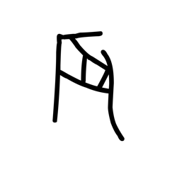

- source_zip_member: `Sub-character Images/4lgdy5a4ta/4lgdy5a4ta/58gxosf39t.png`
- checksum_sha256: see `06_component-visual-index.csv`.
- review_status: `needs_human_visual_review`
- caution: source-marked review image only.

## asset-020188

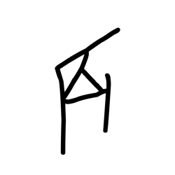

- source_zip_member: `Sub-character Images/4lgdy5a4ta/4lgdy5a4ta/5c6xgd7y0i.png`
- checksum_sha256: see `06_component-visual-index.csv`.
- review_status: `needs_human_visual_review`
- caution: source-marked review image only.

## asset-020189

- source_zip_member: `Sub-character Images/4lgdy5a4ta/4lgdy5a4ta/5ix1p16lmk.png`
- checksum_sha256: see `06_component-visual-index.csv`.
- review_status: `needs_human_visual_review`
- caution: source-marked review image only.

## asset-020190

- source_zip_member: `Sub-character Images/4lgdy5a4ta/4lgdy5a4ta/5j34ziptq6.png`
- checksum_sha256: see `06_component-visual-index.csv`.
- review_status: `needs_human_visual_review`
- caution: source-marked review image only.

## asset-020191

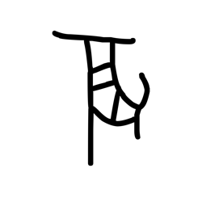

- source_zip_member: `Sub-character Images/4lgdy5a4ta/4lgdy5a4ta/76ttetum7f.png`
- checksum_sha256: see `06_component-visual-index.csv`.
- review_status: `needs_human_visual_review`
- caution: source-marked review image only.

## asset-020192

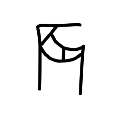

- source_zip_member: `Sub-character Images/4lgdy5a4ta/4lgdy5a4ta/7gixkzezqn.png`
- checksum_sha256: see `06_component-visual-index.csv`.
- review_status: `needs_human_visual_review`
- caution: source-marked review image only.

## asset-020193

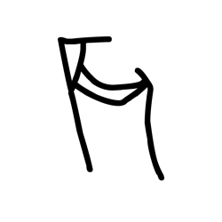

- source_zip_member: `Sub-character Images/4lgdy5a4ta/4lgdy5a4ta/7skhqaucz8.png`
- checksum_sha256: see `06_component-visual-index.csv`.
- review_status: `needs_human_visual_review`
- caution: source-marked review image only.

## asset-020194

- source_zip_member: `Sub-character Images/4lgdy5a4ta/4lgdy5a4ta/838hhht9jc.png`
- checksum_sha256: see `06_component-visual-index.csv`.
- review_status: `needs_human_visual_review`
- caution: source-marked review image only.

## asset-020195

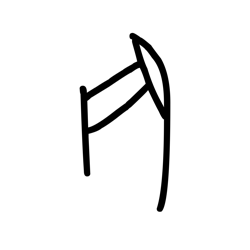

- source_zip_member: `Sub-character Images/4lgdy5a4ta/4lgdy5a4ta/8l2ck4wjk7.png`
- checksum_sha256: see `06_component-visual-index.csv`.
- review_status: `needs_human_visual_review`
- caution: source-marked review image only.

## asset-020196

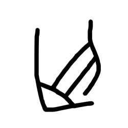

- source_zip_member: `Sub-character Images/4lgdy5a4ta/4lgdy5a4ta/8peuevpt8f.png`
- checksum_sha256: see `06_component-visual-index.csv`.
- review_status: `needs_human_visual_review`
- caution: source-marked review image only.

## asset-020197

- source_zip_member: `Sub-character Images/4lgdy5a4ta/4lgdy5a4ta/8uazb91dki.png`
- checksum_sha256: see `06_component-visual-index.csv`.
- review_status: `needs_human_visual_review`
- caution: source-marked review image only.

## asset-020198

- source_zip_member: `Sub-character Images/4lgdy5a4ta/4lgdy5a4ta/8ynziyh9nw.png`
- checksum_sha256: see `06_component-visual-index.csv`.
- review_status: `needs_human_visual_review`
- caution: source-marked review image only.

## asset-020199

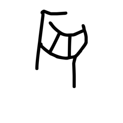

- source_zip_member: `Sub-character Images/4lgdy5a4ta/4lgdy5a4ta/974pcmcgyz.png`
- checksum_sha256: see `06_component-visual-index.csv`.
- review_status: `needs_human_visual_review`
- caution: source-marked review image only.

## asset-020200

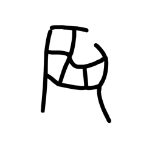

- source_zip_member: `Sub-character Images/4lgdy5a4ta/4lgdy5a4ta/9d2ctz11y5.png`
- checksum_sha256: see `06_component-visual-index.csv`.
- review_status: `needs_human_visual_review`
- caution: source-marked review image only.

## asset-020201

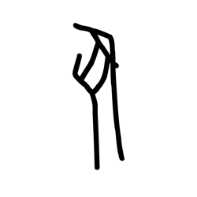

- source_zip_member: `Sub-character Images/4lgdy5a4ta/4lgdy5a4ta/a3mqgkbxc1.png`
- checksum_sha256: see `06_component-visual-index.csv`.
- review_status: `needs_human_visual_review`
- caution: source-marked review image only.

## asset-020202

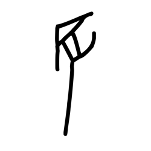

- source_zip_member: `Sub-character Images/4lgdy5a4ta/4lgdy5a4ta/a40spy8o5u.png`
- checksum_sha256: see `06_component-visual-index.csv`.
- review_status: `needs_human_visual_review`
- caution: source-marked review image only.

## asset-020203

- source_zip_member: `Sub-character Images/4lgdy5a4ta/4lgdy5a4ta/a8m05x6z9a.png`
- checksum_sha256: see `06_component-visual-index.csv`.
- review_status: `needs_human_visual_review`
- caution: source-marked review image only.

## asset-020204

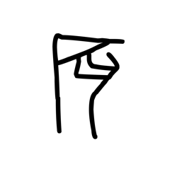

- source_zip_member: `Sub-character Images/4lgdy5a4ta/4lgdy5a4ta/b5sutj31qj.png`
- checksum_sha256: see `06_component-visual-index.csv`.
- review_status: `needs_human_visual_review`
- caution: source-marked review image only.

## asset-020205

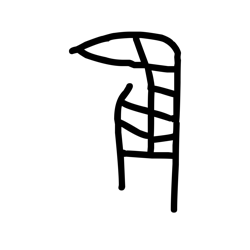

- source_zip_member: `Sub-character Images/4lgdy5a4ta/4lgdy5a4ta/bt6advz93m.png`
- checksum_sha256: see `06_component-visual-index.csv`.
- review_status: `needs_human_visual_review`
- caution: source-marked review image only.

## asset-020206

- source_zip_member: `Sub-character Images/4lgdy5a4ta/4lgdy5a4ta/cmsqp5dk06.png`
- checksum_sha256: see `06_component-visual-index.csv`.
- review_status: `needs_human_visual_review`
- caution: source-marked review image only.

## asset-020207

- source_zip_member: `Sub-character Images/4lgdy5a4ta/4lgdy5a4ta/d0pq7nlzd7.png`
- checksum_sha256: see `06_component-visual-index.csv`.
- review_status: `needs_human_visual_review`
- caution: source-marked review image only.

## asset-020208

- source_zip_member: `Sub-character Images/4lgdy5a4ta/4lgdy5a4ta/d8qar2y8rq.png`
- checksum_sha256: see `06_component-visual-index.csv`.
- review_status: `needs_human_visual_review`
- caution: source-marked review image only.

## asset-020209

- source_zip_member: `Sub-character Images/4lgdy5a4ta/4lgdy5a4ta/ddifgpo9ji.png`
- checksum_sha256: see `06_component-visual-index.csv`.
- review_status: `needs_human_visual_review`
- caution: source-marked review image only.

## asset-020210

- source_zip_member: `Sub-character Images/4lgdy5a4ta/4lgdy5a4ta/di09jrsuyn.png`
- checksum_sha256: see `06_component-visual-index.csv`.
- review_status: `needs_human_visual_review`
- caution: source-marked review image only.

## asset-020211

- source_zip_member: `Sub-character Images/4lgdy5a4ta/4lgdy5a4ta/e3iwl03xq0.png`
- checksum_sha256: see `06_component-visual-index.csv`.
- review_status: `needs_human_visual_review`
- caution: source-marked review image only.

## asset-020212

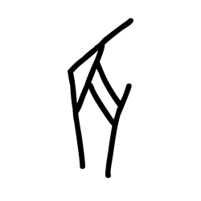

- source_zip_member: `Sub-character Images/4lgdy5a4ta/4lgdy5a4ta/e3nncqnok8.png`
- checksum_sha256: see `06_component-visual-index.csv`.
- review_status: `needs_human_visual_review`
- caution: source-marked review image only.

## asset-020213

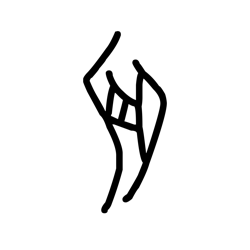

- source_zip_member: `Sub-character Images/4lgdy5a4ta/4lgdy5a4ta/e99lcxlytk.png`
- checksum_sha256: see `06_component-visual-index.csv`.
- review_status: `needs_human_visual_review`
- caution: source-marked review image only.

## asset-020214

- source_zip_member: `Sub-character Images/4lgdy5a4ta/4lgdy5a4ta/fc8ugg6hme.png`
- checksum_sha256: see `06_component-visual-index.csv`.
- review_status: `needs_human_visual_review`
- caution: source-marked review image only.

## asset-020215

- source_zip_member: `Sub-character Images/4lgdy5a4ta/4lgdy5a4ta/feowgib79e.png`
- checksum_sha256: see `06_component-visual-index.csv`.
- review_status: `needs_human_visual_review`
- caution: source-marked review image only.

## asset-020216

- source_zip_member: `Sub-character Images/4lgdy5a4ta/4lgdy5a4ta/fgp40cmdj9.png`
- checksum_sha256: see `06_component-visual-index.csv`.
- review_status: `needs_human_visual_review`
- caution: source-marked review image only.

## asset-020217

- source_zip_member: `Sub-character Images/4lgdy5a4ta/4lgdy5a4ta/fyhpbldb0t.png`
- checksum_sha256: see `06_component-visual-index.csv`.
- review_status: `needs_human_visual_review`
- caution: source-marked review image only.

## asset-020218

- source_zip_member: `Sub-character Images/4lgdy5a4ta/4lgdy5a4ta/g03966t74s.png`
- checksum_sha256: see `06_component-visual-index.csv`.
- review_status: `needs_human_visual_review`
- caution: source-marked review image only.

## asset-020219

- source_zip_member: `Sub-character Images/4lgdy5a4ta/4lgdy5a4ta/g7dvrqzjcq.png`
- checksum_sha256: see `06_component-visual-index.csv`.
- review_status: `needs_human_visual_review`
- caution: source-marked review image only.

## asset-020220

- source_zip_member: `Sub-character Images/4lgdy5a4ta/4lgdy5a4ta/g90r92hzsv.png`
- checksum_sha256: see `06_component-visual-index.csv`.
- review_status: `needs_human_visual_review`
- caution: source-marked review image only.

## asset-020221

- source_zip_member: `Sub-character Images/4lgdy5a4ta/4lgdy5a4ta/gbnvwwa6u8.png`
- checksum_sha256: see `06_component-visual-index.csv`.
- review_status: `needs_human_visual_review`
- caution: source-marked review image only.

## asset-020222

- source_zip_member: `Sub-character Images/4lgdy5a4ta/4lgdy5a4ta/ghb6fklh66.png`
- checksum_sha256: see `06_component-visual-index.csv`.
- review_status: `needs_human_visual_review`
- caution: source-marked review image only.

## asset-020223

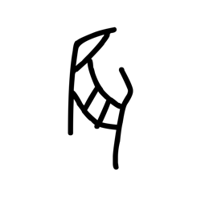

- source_zip_member: `Sub-character Images/4lgdy5a4ta/4lgdy5a4ta/ghw3ik5fuz.png`
- checksum_sha256: see `06_component-visual-index.csv`.
- review_status: `needs_human_visual_review`
- caution: source-marked review image only.

## asset-020224

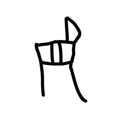

- source_zip_member: `Sub-character Images/4lgdy5a4ta/4lgdy5a4ta/gk04o2y7ml.png`
- checksum_sha256: see `06_component-visual-index.csv`.
- review_status: `needs_human_visual_review`
- caution: source-marked review image only.

## asset-020225

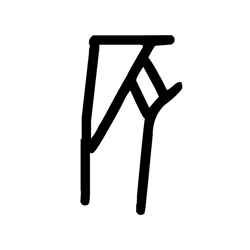

- source_zip_member: `Sub-character Images/4lgdy5a4ta/4lgdy5a4ta/hooowmze7l.png`
- checksum_sha256: see `06_component-visual-index.csv`.
- review_status: `needs_human_visual_review`
- caution: source-marked review image only.

## asset-020226

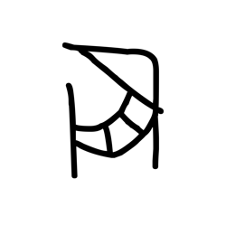

- source_zip_member: `Sub-character Images/4lgdy5a4ta/4lgdy5a4ta/hugojmcbo3.png`
- checksum_sha256: see `06_component-visual-index.csv`.
- review_status: `needs_human_visual_review`
- caution: source-marked review image only.

## asset-020227

- source_zip_member: `Sub-character Images/4lgdy5a4ta/4lgdy5a4ta/hxjbdd4m9q.png`
- checksum_sha256: see `06_component-visual-index.csv`.
- review_status: `needs_human_visual_review`
- caution: source-marked review image only.

## asset-020228

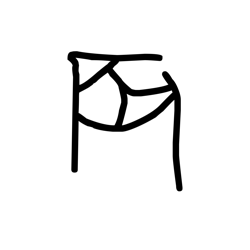

- source_zip_member: `Sub-character Images/4lgdy5a4ta/4lgdy5a4ta/iehkc0xcmd.png`
- checksum_sha256: see `06_component-visual-index.csv`.
- review_status: `needs_human_visual_review`
- caution: source-marked review image only.

## asset-020229

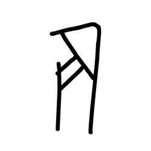

- source_zip_member: `Sub-character Images/4lgdy5a4ta/4lgdy5a4ta/ifs86yenfv.png`
- checksum_sha256: see `06_component-visual-index.csv`.
- review_status: `needs_human_visual_review`
- caution: source-marked review image only.

## asset-020230

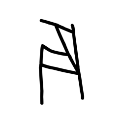

- source_zip_member: `Sub-character Images/4lgdy5a4ta/4lgdy5a4ta/iiudyxel03.png`
- checksum_sha256: see `06_component-visual-index.csv`.
- review_status: `needs_human_visual_review`
- caution: source-marked review image only.

## asset-020231

- source_zip_member: `Sub-character Images/4lgdy5a4ta/4lgdy5a4ta/jcvvqrebix.png`
- checksum_sha256: see `06_component-visual-index.csv`.
- review_status: `needs_human_visual_review`
- caution: source-marked review image only.

## asset-020232

- source_zip_member: `Sub-character Images/4lgdy5a4ta/4lgdy5a4ta/jltsprjoyv.png`
- checksum_sha256: see `06_component-visual-index.csv`.
- review_status: `needs_human_visual_review`
- caution: source-marked review image only.

## asset-020233

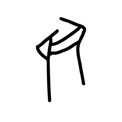

- source_zip_member: `Sub-character Images/4lgdy5a4ta/4lgdy5a4ta/jmfhr6e9ww.png`
- checksum_sha256: see `06_component-visual-index.csv`.
- review_status: `needs_human_visual_review`
- caution: source-marked review image only.

## asset-020234

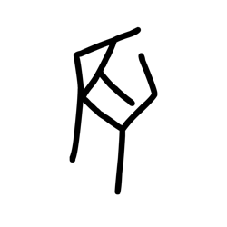

- source_zip_member: `Sub-character Images/4lgdy5a4ta/4lgdy5a4ta/juj2dj1wre.png`
- checksum_sha256: see `06_component-visual-index.csv`.
- review_status: `needs_human_visual_review`
- caution: source-marked review image only.

## asset-020235

- source_zip_member: `Sub-character Images/4lgdy5a4ta/4lgdy5a4ta/kcy1ynd9cq.png`
- checksum_sha256: see `06_component-visual-index.csv`.
- review_status: `needs_human_visual_review`
- caution: source-marked review image only.

## asset-020236

- source_zip_member: `Sub-character Images/4lgdy5a4ta/4lgdy5a4ta/kq8sxom5iu.png`
- checksum_sha256: see `06_component-visual-index.csv`.
- review_status: `needs_human_visual_review`
- caution: source-marked review image only.

## asset-020237

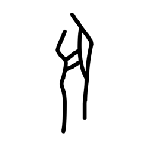

- source_zip_member: `Sub-character Images/4lgdy5a4ta/4lgdy5a4ta/lhryc5sx1v.png`
- checksum_sha256: see `06_component-visual-index.csv`.
- review_status: `needs_human_visual_review`
- caution: source-marked review image only.

## asset-020238

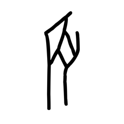

- source_zip_member: `Sub-character Images/4lgdy5a4ta/4lgdy5a4ta/lzmelvzptt.png`
- checksum_sha256: see `06_component-visual-index.csv`.
- review_status: `needs_human_visual_review`
- caution: source-marked review image only.

## asset-020239

- source_zip_member: `Sub-character Images/4lgdy5a4ta/4lgdy5a4ta/m7d2dm16q2.png`
- checksum_sha256: see `06_component-visual-index.csv`.
- review_status: `needs_human_visual_review`
- caution: source-marked review image only.

## asset-020240

- source_zip_member: `Sub-character Images/4lgdy5a4ta/4lgdy5a4ta/niz1up6hj8.png`
- checksum_sha256: see `06_component-visual-index.csv`.
- review_status: `needs_human_visual_review`
- caution: source-marked review image only.

## asset-020241

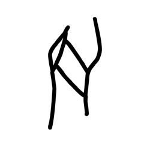

- source_zip_member: `Sub-character Images/4lgdy5a4ta/4lgdy5a4ta/o4swjkpnhl.png`
- checksum_sha256: see `06_component-visual-index.csv`.
- review_status: `needs_human_visual_review`
- caution: source-marked review image only.

## asset-020242

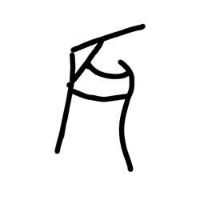

- source_zip_member: `Sub-character Images/4lgdy5a4ta/4lgdy5a4ta/o7oll3fsey.png`
- checksum_sha256: see `06_component-visual-index.csv`.
- review_status: `needs_human_visual_review`
- caution: source-marked review image only.

## asset-020243

- source_zip_member: `Sub-character Images/4lgdy5a4ta/4lgdy5a4ta/orzdw3qlv5.png`
- checksum_sha256: see `06_component-visual-index.csv`.
- review_status: `needs_human_visual_review`
- caution: source-marked review image only.

## asset-020244

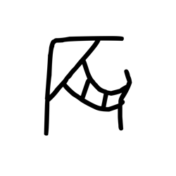

- source_zip_member: `Sub-character Images/4lgdy5a4ta/4lgdy5a4ta/ot76jubom5.png`
- checksum_sha256: see `06_component-visual-index.csv`.
- review_status: `needs_human_visual_review`
- caution: source-marked review image only.

## asset-020245

- source_zip_member: `Sub-character Images/4lgdy5a4ta/4lgdy5a4ta/ox97lb9fbr.png`
- checksum_sha256: see `06_component-visual-index.csv`.
- review_status: `needs_human_visual_review`
- caution: source-marked review image only.

## asset-020246

- source_zip_member: `Sub-character Images/4lgdy5a4ta/4lgdy5a4ta/pz3q0zzykt.png`
- checksum_sha256: see `06_component-visual-index.csv`.
- review_status: `needs_human_visual_review`
- caution: source-marked review image only.

## asset-020247

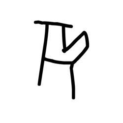

- source_zip_member: `Sub-character Images/4lgdy5a4ta/4lgdy5a4ta/q4b15k3dui.png`
- checksum_sha256: see `06_component-visual-index.csv`.
- review_status: `needs_human_visual_review`
- caution: source-marked review image only.

## asset-020248

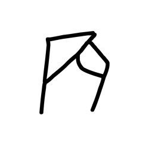

- source_zip_member: `Sub-character Images/4lgdy5a4ta/4lgdy5a4ta/qbee5stnd2.png`
- checksum_sha256: see `06_component-visual-index.csv`.
- review_status: `needs_human_visual_review`
- caution: source-marked review image only.

## asset-020249

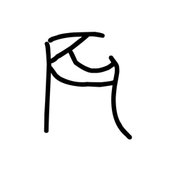

- source_zip_member: `Sub-character Images/4lgdy5a4ta/4lgdy5a4ta/qo0an1yka2.png`
- checksum_sha256: see `06_component-visual-index.csv`.
- review_status: `needs_human_visual_review`
- caution: source-marked review image only.

## asset-020250

- source_zip_member: `Sub-character Images/4lgdy5a4ta/4lgdy5a4ta/qs0g2pspl9.png`
- checksum_sha256: see `06_component-visual-index.csv`.
- review_status: `needs_human_visual_review`
- caution: source-marked review image only.

## asset-020251

- source_zip_member: `Sub-character Images/4lgdy5a4ta/4lgdy5a4ta/r2c2lha5ga.png`
- checksum_sha256: see `06_component-visual-index.csv`.
- review_status: `needs_human_visual_review`
- caution: source-marked review image only.

## asset-020252

- source_zip_member: `Sub-character Images/4lgdy5a4ta/4lgdy5a4ta/r9x8ofmgbp.png`
- checksum_sha256: see `06_component-visual-index.csv`.
- review_status: `needs_human_visual_review`
- caution: source-marked review image only.

## asset-020253

- source_zip_member: `Sub-character Images/4lgdy5a4ta/4lgdy5a4ta/rgbrsv0r63.png`
- checksum_sha256: see `06_component-visual-index.csv`.
- review_status: `needs_human_visual_review`
- caution: source-marked review image only.

## asset-020254

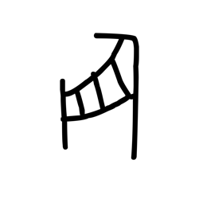

- source_zip_member: `Sub-character Images/4lgdy5a4ta/4lgdy5a4ta/rnupgu5ign.png`
- checksum_sha256: see `06_component-visual-index.csv`.
- review_status: `needs_human_visual_review`
- caution: source-marked review image only.

## asset-020255

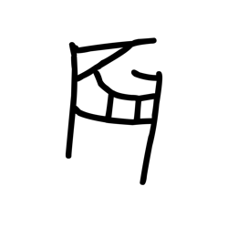

- source_zip_member: `Sub-character Images/4lgdy5a4ta/4lgdy5a4ta/s2z906jlrk.png`
- checksum_sha256: see `06_component-visual-index.csv`.
- review_status: `needs_human_visual_review`
- caution: source-marked review image only.

## asset-020256

- source_zip_member: `Sub-character Images/4lgdy5a4ta/4lgdy5a4ta/s9437tnqx9.png`
- checksum_sha256: see `06_component-visual-index.csv`.
- review_status: `needs_human_visual_review`
- caution: source-marked review image only.

## asset-020257

- source_zip_member: `Sub-character Images/4lgdy5a4ta/4lgdy5a4ta/thk331ihzt.png`
- checksum_sha256: see `06_component-visual-index.csv`.
- review_status: `needs_human_visual_review`
- caution: source-marked review image only.

## asset-020258

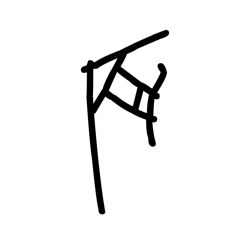

- source_zip_member: `Sub-character Images/4lgdy5a4ta/4lgdy5a4ta/trmk4k04ko.png`
- checksum_sha256: see `06_component-visual-index.csv`.
- review_status: `needs_human_visual_review`
- caution: source-marked review image only.

## asset-020259

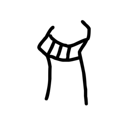

- source_zip_member: `Sub-character Images/4lgdy5a4ta/4lgdy5a4ta/ts606u38hs.png`
- checksum_sha256: see `06_component-visual-index.csv`.
- review_status: `needs_human_visual_review`
- caution: source-marked review image only.

## asset-020260

- source_zip_member: `Sub-character Images/4lgdy5a4ta/4lgdy5a4ta/u0ruyrw00v.png`
- checksum_sha256: see `06_component-visual-index.csv`.
- review_status: `needs_human_visual_review`
- caution: source-marked review image only.

## asset-020261

- source_zip_member: `Sub-character Images/4lgdy5a4ta/4lgdy5a4ta/u5jjgvqv53.png`
- checksum_sha256: see `06_component-visual-index.csv`.
- review_status: `needs_human_visual_review`
- caution: source-marked review image only.

## asset-020262

- source_zip_member: `Sub-character Images/4lgdy5a4ta/4lgdy5a4ta/ugc934n40q.png`
- checksum_sha256: see `06_component-visual-index.csv`.
- review_status: `needs_human_visual_review`
- caution: source-marked review image only.

## asset-020263

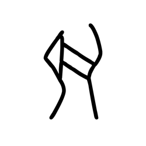

- source_zip_member: `Sub-character Images/4lgdy5a4ta/4lgdy5a4ta/uhxp97zxpn.png`
- checksum_sha256: see `06_component-visual-index.csv`.
- review_status: `needs_human_visual_review`
- caution: source-marked review image only.

## asset-020264

- source_zip_member: `Sub-character Images/4lgdy5a4ta/4lgdy5a4ta/uxki6633tb.png`
- checksum_sha256: see `06_component-visual-index.csv`.
- review_status: `needs_human_visual_review`
- caution: source-marked review image only.

## asset-020265

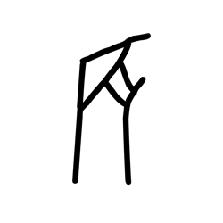

- source_zip_member: `Sub-character Images/4lgdy5a4ta/4lgdy5a4ta/v8l81jlibr.png`
- checksum_sha256: see `06_component-visual-index.csv`.
- review_status: `needs_human_visual_review`
- caution: source-marked review image only.

## asset-020266

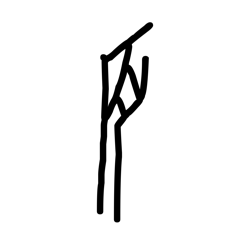

- source_zip_member: `Sub-character Images/4lgdy5a4ta/4lgdy5a4ta/vj1o79h4gv.png`
- checksum_sha256: see `06_component-visual-index.csv`.
- review_status: `needs_human_visual_review`
- caution: source-marked review image only.

## asset-020267

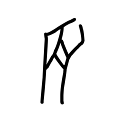

- source_zip_member: `Sub-character Images/4lgdy5a4ta/4lgdy5a4ta/vt811lc3ul.png`
- checksum_sha256: see `06_component-visual-index.csv`.
- review_status: `needs_human_visual_review`
- caution: source-marked review image only.

## asset-020268

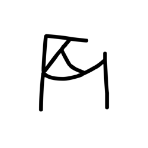

- source_zip_member: `Sub-character Images/4lgdy5a4ta/4lgdy5a4ta/w7mxkgtyyq.png`
- checksum_sha256: see `06_component-visual-index.csv`.
- review_status: `needs_human_visual_review`
- caution: source-marked review image only.

## asset-020269

- source_zip_member: `Sub-character Images/4lgdy5a4ta/4lgdy5a4ta/wb3keibwiu.png`
- checksum_sha256: see `06_component-visual-index.csv`.
- review_status: `needs_human_visual_review`
- caution: source-marked review image only.

## asset-020270

- source_zip_member: `Sub-character Images/4lgdy5a4ta/4lgdy5a4ta/wj01z5hrhc.png`
- checksum_sha256: see `06_component-visual-index.csv`.
- review_status: `needs_human_visual_review`
- caution: source-marked review image only.

## asset-020271

- source_zip_member: `Sub-character Images/4lgdy5a4ta/4lgdy5a4ta/wy8b6y9lpv.png`
- checksum_sha256: see `06_component-visual-index.csv`.
- review_status: `needs_human_visual_review`
- caution: source-marked review image only.

## asset-020272

- source_zip_member: `Sub-character Images/4lgdy5a4ta/4lgdy5a4ta/xqyl52xa52.png`
- checksum_sha256: see `06_component-visual-index.csv`.
- review_status: `needs_human_visual_review`
- caution: source-marked review image only.

## asset-020273

- source_zip_member: `Sub-character Images/4lgdy5a4ta/4lgdy5a4ta/y3qzpu7awa.png`
- checksum_sha256: see `06_component-visual-index.csv`.
- review_status: `needs_human_visual_review`
- caution: source-marked review image only.

## asset-020274

- source_zip_member: `Sub-character Images/4lgdy5a4ta/4lgdy5a4ta/y8bxtcyhwu.png`
- checksum_sha256: see `06_component-visual-index.csv`.
- review_status: `needs_human_visual_review`
- caution: source-marked review image only.

## asset-020275

- source_zip_member: `Sub-character Images/4lgdy5a4ta/4lgdy5a4ta/yd4ykqogla.png`
- checksum_sha256: see `06_component-visual-index.csv`.
- review_status: `needs_human_visual_review`
- caution: source-marked review image only.

## asset-020276

- source_zip_member: `Sub-character Images/4lgdy5a4ta/4lgdy5a4ta/yddzzw8lvw.png`
- checksum_sha256: see `06_component-visual-index.csv`.
- review_status: `needs_human_visual_review`
- caution: source-marked review image only.

## asset-020277

- source_zip_member: `Sub-character Images/4lgdy5a4ta/4lgdy5a4ta/yhf0wk8g9t.png`
- checksum_sha256: see `06_component-visual-index.csv`.
- review_status: `needs_human_visual_review`
- caution: source-marked review image only.

## asset-020278

- source_zip_member: `Sub-character Images/4lgdy5a4ta/4lgdy5a4ta/yjdpwcpgu9.png`
- checksum_sha256: see `06_component-visual-index.csv`.
- review_status: `needs_human_visual_review`
- caution: source-marked review image only.

## asset-020279

- source_zip_member: `Sub-character Images/4lgdy5a4ta/4lgdy5a4ta/yjrp4eyd32.png`
- checksum_sha256: see `06_component-visual-index.csv`.
- review_status: `needs_human_visual_review`
- caution: source-marked review image only.

## asset-020280

- source_zip_member: `Sub-character Images/4lgdy5a4ta/4lgdy5a4ta/ysoewhwd7t.png`
- checksum_sha256: see `06_component-visual-index.csv`.
- review_status: `needs_human_visual_review`
- caution: source-marked review image only.

## asset-020281

- source_zip_member: `Sub-character Images/4lgdy5a4ta/4lgdy5a4ta/yt243i1ldb.png`
- checksum_sha256: see `06_component-visual-index.csv`.
- review_status: `needs_human_visual_review`
- caution: source-marked review image only.

## asset-020282

- source_zip_member: `Sub-character Images/4lgdy5a4ta/4lgdy5a4ta/z9j3iqdbb4.png`
- checksum_sha256: see `06_component-visual-index.csv`.
- review_status: `needs_human_visual_review`
- caution: source-marked review image only.

## asset-020283

- source_zip_member: `Sub-character Images/4lgdy5a4ta/4lgdy5a4ta/za5wj4jq44.png`
- checksum_sha256: see `06_component-visual-index.csv`.
- review_status: `needs_human_visual_review`
- caution: source-marked review image only.

## asset-020284

- source_zip_member: `Sub-character Images/4lgdy5a4ta/4lgdy5a4ta/znzdxgufly.png`
- checksum_sha256: see `06_component-visual-index.csv`.
- review_status: `needs_human_visual_review`
- caution: source-marked review image only.

## asset-020285

- source_zip_member: `Sub-character Images/4lgdy5a4ta/4lgdy5a4ta/zrj5cp1j9s.png`
- checksum_sha256: see `06_component-visual-index.csv`.
- review_status: `needs_human_visual_review`
- caution: source-marked review image only.
