# Component Visual Gallery / 构件图像查看: obs-comp-cand-002294

English:
This page displays OBIMD subcharacter PNG assets extracted into this concrete
corpus object directory for human review.

简体中文：
本页展示抽取到当前具体 corpus 对象目录内的 OBIMD subcharacter PNG 资料，供人工复核使用。

Boundary / 边界：
dataset image candidate only; not a confirmed component form, not a component
assignment, and not a decipherment claim.
- not a confirmed component form
- not a component assignment
- not a decipherment claim

## Concrete Questions To Check / 具体待查问题

- Which local image should be opened first?
- 应先打开哪一张本地构件图像？
- Which source zip member anchors this image?
- 哪一个 source zip member 能定位这张图像？
- Which near-shape or variant comparison is still missing?
- 还缺哪些近形或异体比较？
- Which character or inscription context should be checked next?
- 下一步应核对哪些单字或卜辞上下文？
- What evidence is missing before a component assignment?
- 正式构件归属前还缺哪些证据？

## asset-020291

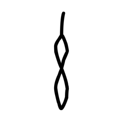

- source_zip_member: `Sub-character Images/89m3dkhxyy/89m3dkhxyy/0bcq5osq41.png`
- checksum_sha256: see `06_component-visual-index.csv`.
- review_status: `needs_human_visual_review`
- caution: source-marked review image only.

## asset-020292

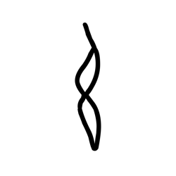

- source_zip_member: `Sub-character Images/89m3dkhxyy/89m3dkhxyy/1mfi7v9vp8.png`
- checksum_sha256: see `06_component-visual-index.csv`.
- review_status: `needs_human_visual_review`
- caution: source-marked review image only.

## asset-020293

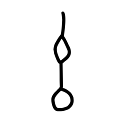

- source_zip_member: `Sub-character Images/89m3dkhxyy/89m3dkhxyy/3hdcomp1h4.png`
- checksum_sha256: see `06_component-visual-index.csv`.
- review_status: `needs_human_visual_review`
- caution: source-marked review image only.

## asset-020294

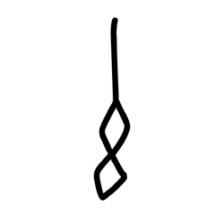

- source_zip_member: `Sub-character Images/89m3dkhxyy/89m3dkhxyy/40m7e8ggch.png`
- checksum_sha256: see `06_component-visual-index.csv`.
- review_status: `needs_human_visual_review`
- caution: source-marked review image only.

## asset-020295

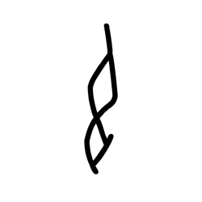

- source_zip_member: `Sub-character Images/89m3dkhxyy/89m3dkhxyy/440xx4yw23.png`
- checksum_sha256: see `06_component-visual-index.csv`.
- review_status: `needs_human_visual_review`
- caution: source-marked review image only.

## asset-020296

- source_zip_member: `Sub-character Images/89m3dkhxyy/89m3dkhxyy/4ge4ag3uci.png`
- checksum_sha256: see `06_component-visual-index.csv`.
- review_status: `needs_human_visual_review`
- caution: source-marked review image only.

## asset-020297

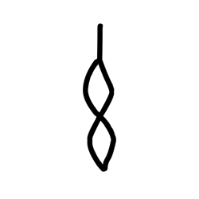

- source_zip_member: `Sub-character Images/89m3dkhxyy/89m3dkhxyy/4hy90286jy.png`
- checksum_sha256: see `06_component-visual-index.csv`.
- review_status: `needs_human_visual_review`
- caution: source-marked review image only.

## asset-020298

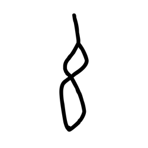

- source_zip_member: `Sub-character Images/89m3dkhxyy/89m3dkhxyy/68d44unrf7.png`
- checksum_sha256: see `06_component-visual-index.csv`.
- review_status: `needs_human_visual_review`
- caution: source-marked review image only.

## asset-020299

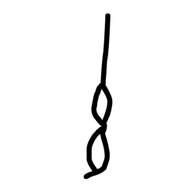

- source_zip_member: `Sub-character Images/89m3dkhxyy/89m3dkhxyy/7k61uow6wv.png`
- checksum_sha256: see `06_component-visual-index.csv`.
- review_status: `needs_human_visual_review`
- caution: source-marked review image only.

## asset-020300

- source_zip_member: `Sub-character Images/89m3dkhxyy/89m3dkhxyy/89m3dkhxyy.png`
- checksum_sha256: see `06_component-visual-index.csv`.
- review_status: `needs_human_visual_review`
- caution: source-marked review image only.

## asset-020301

- source_zip_member: `Sub-character Images/89m3dkhxyy/89m3dkhxyy/9r6ylvs70z.png`
- checksum_sha256: see `06_component-visual-index.csv`.
- review_status: `needs_human_visual_review`
- caution: source-marked review image only.

## asset-020302

- source_zip_member: `Sub-character Images/89m3dkhxyy/89m3dkhxyy/ahaj3csx1f.png`
- checksum_sha256: see `06_component-visual-index.csv`.
- review_status: `needs_human_visual_review`
- caution: source-marked review image only.

## asset-020303

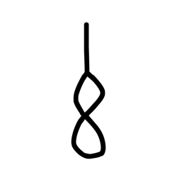

- source_zip_member: `Sub-character Images/89m3dkhxyy/89m3dkhxyy/dehus7fpt2.png`
- checksum_sha256: see `06_component-visual-index.csv`.
- review_status: `needs_human_visual_review`
- caution: source-marked review image only.

## asset-020304

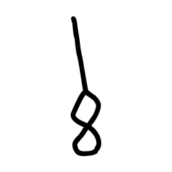

- source_zip_member: `Sub-character Images/89m3dkhxyy/89m3dkhxyy/dpa0ahh0yw.png`
- checksum_sha256: see `06_component-visual-index.csv`.
- review_status: `needs_human_visual_review`
- caution: source-marked review image only.

## asset-020305

- source_zip_member: `Sub-character Images/89m3dkhxyy/89m3dkhxyy/gork8ajnv6.png`
- checksum_sha256: see `06_component-visual-index.csv`.
- review_status: `needs_human_visual_review`
- caution: source-marked review image only.

## asset-020306

- source_zip_member: `Sub-character Images/89m3dkhxyy/89m3dkhxyy/gwc1rjvxfb.png`
- checksum_sha256: see `06_component-visual-index.csv`.
- review_status: `needs_human_visual_review`
- caution: source-marked review image only.

## asset-020307

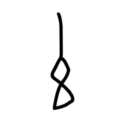

- source_zip_member: `Sub-character Images/89m3dkhxyy/89m3dkhxyy/ivdyffmgzo.png`
- checksum_sha256: see `06_component-visual-index.csv`.
- review_status: `needs_human_visual_review`
- caution: source-marked review image only.

## asset-020308

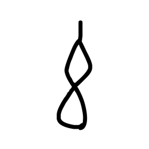

- source_zip_member: `Sub-character Images/89m3dkhxyy/89m3dkhxyy/k947pnrtcd.png`
- checksum_sha256: see `06_component-visual-index.csv`.
- review_status: `needs_human_visual_review`
- caution: source-marked review image only.

## asset-020309

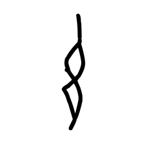

- source_zip_member: `Sub-character Images/89m3dkhxyy/89m3dkhxyy/li0a9vbtk4.png`
- checksum_sha256: see `06_component-visual-index.csv`.
- review_status: `needs_human_visual_review`
- caution: source-marked review image only.

## asset-020310

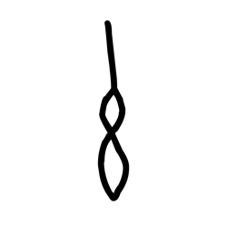

- source_zip_member: `Sub-character Images/89m3dkhxyy/89m3dkhxyy/rvgp45qyrn.png`
- checksum_sha256: see `06_component-visual-index.csv`.
- review_status: `needs_human_visual_review`
- caution: source-marked review image only.

## asset-020311

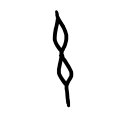

- source_zip_member: `Sub-character Images/89m3dkhxyy/89m3dkhxyy/snn0a51k4f.png`
- checksum_sha256: see `06_component-visual-index.csv`.
- review_status: `needs_human_visual_review`
- caution: source-marked review image only.

## asset-020312

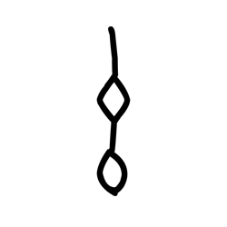

- source_zip_member: `Sub-character Images/89m3dkhxyy/89m3dkhxyy/vwjcovo8rf.png`
- checksum_sha256: see `06_component-visual-index.csv`.
- review_status: `needs_human_visual_review`
- caution: source-marked review image only.

## asset-020313

- source_zip_member: `Sub-character Images/89m3dkhxyy/89m3dkhxyy/x78clzc8bd.png`
- checksum_sha256: see `06_component-visual-index.csv`.
- review_status: `needs_human_visual_review`
- caution: source-marked review image only.
