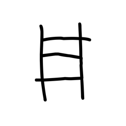
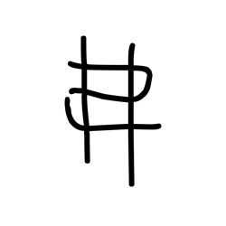
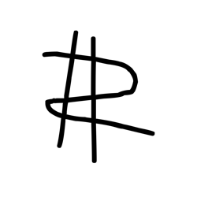

# Component Visual Gallery / 构件图像查看: obs-comp-cand-002341

English:
This page displays OBIMD subcharacter PNG assets extracted into this concrete corpus object directory for human review.

简体中文：
本页展示抽取到当前具体 corpus 对象目录内的 OBIMD subcharacter PNG 资料，供人工复核使用。

Boundary / 边界：dataset image candidate only; not a confirmed component form, component assignment, or decipherment claim.

## asset-020379

- source_zip_member: `Sub-character Images/4jn67lbqhb/4jn67lbqhb/1f2f72z3xt.png`
- checksum_sha256: `e7c5f81ff049d97fa4076aef7ef77efc21cc618d9d6819d88478980de2fcb9a3`
- review_status: `needs_human_visual_review`
- caution: OBIMD subcharacter image is a source-marked review asset only; it is not a confirmed component form, component assignment, or decipherment conclusion.

## asset-020380

- source_zip_member: `Sub-character Images/4jn67lbqhb/4jn67lbqhb/2h0ny3ut7r.png`
- checksum_sha256: `2a8ec1c0f4c92684312cd958e108b01c4274394f9ac8d27b0a00af83a0dd9dc1`
- review_status: `needs_human_visual_review`
- caution: OBIMD subcharacter image is a source-marked review asset only; it is not a confirmed component form, component assignment, or decipherment conclusion.

## asset-020381

- source_zip_member: `Sub-character Images/4jn67lbqhb/4jn67lbqhb/2km5jntv6f.png`
- checksum_sha256: `b69d3e5f2959505934fa9f2cc23388091fc70b960e941b7520b37ce83790841a`
- review_status: `needs_human_visual_review`
- caution: OBIMD subcharacter image is a source-marked review asset only; it is not a confirmed component form, component assignment, or decipherment conclusion.

## asset-020382

- source_zip_member: `Sub-character Images/4jn67lbqhb/4jn67lbqhb/4jn67lbqhb.png`
- checksum_sha256: `b051bb865635d269dcf9d9dccd5bc639a1e60b6406543595343a445eb4e7951a`
- review_status: `needs_human_visual_review`
- caution: OBIMD subcharacter image is a source-marked review asset only; it is not a confirmed component form, component assignment, or decipherment conclusion.

## asset-020383

- source_zip_member: `Sub-character Images/4jn67lbqhb/4jn67lbqhb/5qkor4xs9h.png`
- checksum_sha256: `f04cb968a40dbbbf08a5a1ec4a17d05983e1b5653ca56347d7009088d72dbc8a`
- review_status: `needs_human_visual_review`
- caution: OBIMD subcharacter image is a source-marked review asset only; it is not a confirmed component form, component assignment, or decipherment conclusion.

## asset-020384

- source_zip_member: `Sub-character Images/4jn67lbqhb/4jn67lbqhb/94x3d9zh2r.png`
- checksum_sha256: `014f89e7ebb0b1b94e0641626942fc8ba3fc9dbb28de339db31f40b38e1fe5b0`
- review_status: `needs_human_visual_review`
- caution: OBIMD subcharacter image is a source-marked review asset only; it is not a confirmed component form, component assignment, or decipherment conclusion.

## asset-020385

- source_zip_member: `Sub-character Images/4jn67lbqhb/4jn67lbqhb/9sxo1uy0om.png`
- checksum_sha256: `85b7b3c604eb31bd024dfda8d3cac1964c35eb7b1c061807b60e6e8e5cb60e7a`
- review_status: `needs_human_visual_review`
- caution: OBIMD subcharacter image is a source-marked review asset only; it is not a confirmed component form, component assignment, or decipherment conclusion.

## asset-020386

- source_zip_member: `Sub-character Images/4jn67lbqhb/4jn67lbqhb/aklajo2mzc.png`
- checksum_sha256: `5c5a9a1a98015b3d90a6d4efa5d1454807ca171a841c33e46bf5a6d4ed0d078d`
- review_status: `needs_human_visual_review`
- caution: OBIMD subcharacter image is a source-marked review asset only; it is not a confirmed component form, component assignment, or decipherment conclusion.

## asset-020387

- source_zip_member: `Sub-character Images/4jn67lbqhb/4jn67lbqhb/bps1cyzcx8.png`
- checksum_sha256: `763693d805141cb58b753b51d645239e3059d2cf1afa2bb66039201c534a03d6`
- review_status: `needs_human_visual_review`
- caution: OBIMD subcharacter image is a source-marked review asset only; it is not a confirmed component form, component assignment, or decipherment conclusion.

## asset-020388

- source_zip_member: `Sub-character Images/4jn67lbqhb/4jn67lbqhb/ddqiak9lgs.png`
- checksum_sha256: `32d7163822639be00e25ff7803ab3e0b715e9bfba9d4af6f7745329f27149109`
- review_status: `needs_human_visual_review`
- caution: OBIMD subcharacter image is a source-marked review asset only; it is not a confirmed component form, component assignment, or decipherment conclusion.

## asset-020389

- source_zip_member: `Sub-character Images/4jn67lbqhb/4jn67lbqhb/ez9d1rsqcq.png`
- checksum_sha256: `119ebf8a4a91ab4bafa3b3dfcf9dc517b16f9493df0f74043c4eb5afc2bf8a5d`
- review_status: `needs_human_visual_review`
- caution: OBIMD subcharacter image is a source-marked review asset only; it is not a confirmed component form, component assignment, or decipherment conclusion.

## asset-020390

- source_zip_member: `Sub-character Images/4jn67lbqhb/4jn67lbqhb/ij5xjsdf8o.png`
- checksum_sha256: `6fe16d9d213e0efec5c15ad358cfaeb601af37743fa9e1e3b0413830f5a859b8`
- review_status: `needs_human_visual_review`
- caution: OBIMD subcharacter image is a source-marked review asset only; it is not a confirmed component form, component assignment, or decipherment conclusion.

## asset-020391

- source_zip_member: `Sub-character Images/4jn67lbqhb/4jn67lbqhb/jldj4lf8ht.png`
- checksum_sha256: `e9a7db006f1b239faf44373532f85482b8bb9f59f623c384ee365762622e45e1`
- review_status: `needs_human_visual_review`
- caution: OBIMD subcharacter image is a source-marked review asset only; it is not a confirmed component form, component assignment, or decipherment conclusion.

## asset-020392

- source_zip_member: `Sub-character Images/4jn67lbqhb/4jn67lbqhb/jmtp51j8ge.png`
- checksum_sha256: `75993a6ad50a640b86072a4fe9ae632fbe54c3ce24055c1c3c473c63f735cfbf`
- review_status: `needs_human_visual_review`
- caution: OBIMD subcharacter image is a source-marked review asset only; it is not a confirmed component form, component assignment, or decipherment conclusion.

## asset-020393

- source_zip_member: `Sub-character Images/4jn67lbqhb/4jn67lbqhb/kgfjunqltw.png`
- checksum_sha256: `21b8642ee8e9384c9a5c7097a7534cece9560949290303bd4555726f6b797e1c`
- review_status: `needs_human_visual_review`
- caution: OBIMD subcharacter image is a source-marked review asset only; it is not a confirmed component form, component assignment, or decipherment conclusion.

## asset-020394

- source_zip_member: `Sub-character Images/4jn67lbqhb/4jn67lbqhb/laskbn2l46.png`
- checksum_sha256: `96a342b3983ade02212550386d3e38532a3d2cb7e67e6b1b83760506a5013f4a`
- review_status: `needs_human_visual_review`
- caution: OBIMD subcharacter image is a source-marked review asset only; it is not a confirmed component form, component assignment, or decipherment conclusion.

## asset-020395

- source_zip_member: `Sub-character Images/4jn67lbqhb/4jn67lbqhb/lncp6dl51j.png`
- checksum_sha256: `a386c7c524414c5e67d621a3217375baf14acf702d5c0ffedc6dabbb50f71b56`
- review_status: `needs_human_visual_review`
- caution: OBIMD subcharacter image is a source-marked review asset only; it is not a confirmed component form, component assignment, or decipherment conclusion.

## asset-020396

- source_zip_member: `Sub-character Images/4jn67lbqhb/4jn67lbqhb/ngmowu4p2g.png`
- checksum_sha256: `f93aaee281b9278489c4088279337449c7b1e1e5aaa0d13c81c49a1403ff4d37`
- review_status: `needs_human_visual_review`
- caution: OBIMD subcharacter image is a source-marked review asset only; it is not a confirmed component form, component assignment, or decipherment conclusion.

## asset-020397

- source_zip_member: `Sub-character Images/4jn67lbqhb/4jn67lbqhb/oxbcfbu58f.png`
- checksum_sha256: `af40f86ef76ea074ca1a33efb4f35ecfabf29b059d1d32d327a6d00784f91951`
- review_status: `needs_human_visual_review`
- caution: OBIMD subcharacter image is a source-marked review asset only; it is not a confirmed component form, component assignment, or decipherment conclusion.

## asset-020398

- source_zip_member: `Sub-character Images/4jn67lbqhb/4jn67lbqhb/p37cvso33t.png`
- checksum_sha256: `2dc51a7f1cbafbfe699a795dbb1380f4166419309ac0812d1bbdee0fae569fe0`
- review_status: `needs_human_visual_review`
- caution: OBIMD subcharacter image is a source-marked review asset only; it is not a confirmed component form, component assignment, or decipherment conclusion.

## asset-020399

- source_zip_member: `Sub-character Images/4jn67lbqhb/4jn67lbqhb/qayp3o1iaw.png`
- checksum_sha256: `19be4845d359c3809f2cf997ddd3395f9b55a62c03bf78d800f2163763e44dfe`
- review_status: `needs_human_visual_review`
- caution: OBIMD subcharacter image is a source-marked review asset only; it is not a confirmed component form, component assignment, or decipherment conclusion.

## asset-020400

- source_zip_member: `Sub-character Images/4jn67lbqhb/4jn67lbqhb/qfsvrmuvl6.png`
- checksum_sha256: `5f4eb096ea2072dc7af1ebb018e39203caa612e7d5247e9f2ce453f86b6cc7c0`
- review_status: `needs_human_visual_review`
- caution: OBIMD subcharacter image is a source-marked review asset only; it is not a confirmed component form, component assignment, or decipherment conclusion.

## asset-020401

- source_zip_member: `Sub-character Images/4jn67lbqhb/4jn67lbqhb/qletplon6g.png`
- checksum_sha256: `2fb1f6bc668a77052e11aabe81be6856438c03017aead68868a42c514476d6b7`
- review_status: `needs_human_visual_review`
- caution: OBIMD subcharacter image is a source-marked review asset only; it is not a confirmed component form, component assignment, or decipherment conclusion.

## asset-020402

- source_zip_member: `Sub-character Images/4jn67lbqhb/4jn67lbqhb/r16vrgshh1.png`
- checksum_sha256: `91388e769f01732652f42aa972248006cf417392dfc207b2bc86d3533355b447`
- review_status: `needs_human_visual_review`
- caution: OBIMD subcharacter image is a source-marked review asset only; it is not a confirmed component form, component assignment, or decipherment conclusion.

## asset-020403

- source_zip_member: `Sub-character Images/4jn67lbqhb/4jn67lbqhb/ru975di3ky.png`
- checksum_sha256: `d7dedd9338805af2b9ee5e6821f33949a572e79c62a9d13d66c9983356acb9ab`
- review_status: `needs_human_visual_review`
- caution: OBIMD subcharacter image is a source-marked review asset only; it is not a confirmed component form, component assignment, or decipherment conclusion.

## asset-020404

- source_zip_member: `Sub-character Images/4jn67lbqhb/4jn67lbqhb/t0knaqhkzu.png`
- checksum_sha256: `cadf0e9bf6606dbe20bd86d5591345262e2409ca1c8bb8ce2dc268399f24af44`
- review_status: `needs_human_visual_review`
- caution: OBIMD subcharacter image is a source-marked review asset only; it is not a confirmed component form, component assignment, or decipherment conclusion.

## asset-020405

- source_zip_member: `Sub-character Images/4jn67lbqhb/4jn67lbqhb/t7vanma88b.png`
- checksum_sha256: `600bf8e30a404c2f554097255a45f77a2f61465532c2e4981e52e0196f6b39b5`
- review_status: `needs_human_visual_review`
- caution: OBIMD subcharacter image is a source-marked review asset only; it is not a confirmed component form, component assignment, or decipherment conclusion.

## asset-020406

- source_zip_member: `Sub-character Images/4jn67lbqhb/4jn67lbqhb/ug8fkosf5n.png`
- checksum_sha256: `4681bf44191229832069e460d1b350987e6c16accbfad70377cdd08ceca52df7`
- review_status: `needs_human_visual_review`
- caution: OBIMD subcharacter image is a source-marked review asset only; it is not a confirmed component form, component assignment, or decipherment conclusion.

## asset-020407

- source_zip_member: `Sub-character Images/4jn67lbqhb/4jn67lbqhb/w0mfy6h3ds.png`
- checksum_sha256: `e4570bdcc79a032b05392380995ff50e1e6f1365fa85c9a3236061a0717f18ed`
- review_status: `needs_human_visual_review`
- caution: OBIMD subcharacter image is a source-marked review asset only; it is not a confirmed component form, component assignment, or decipherment conclusion.

## asset-020408

- source_zip_member: `Sub-character Images/4jn67lbqhb/4jn67lbqhb/xsic4mekmn.png`
- checksum_sha256: `77da93b2411171aa81f3707425b1a9e22ee948ae5d4851b806900a663a31bbd9`
- review_status: `needs_human_visual_review`
- caution: OBIMD subcharacter image is a source-marked review asset only; it is not a confirmed component form, component assignment, or decipherment conclusion.

## asset-020409

- source_zip_member: `Sub-character Images/4jn67lbqhb/4jn67lbqhb/yhxqdkvoqo.png`
- checksum_sha256: `bf68e08db84aebb7f1c4b388856c83f91139528522ccb19b8e34d68195946a81`
- review_status: `needs_human_visual_review`
- caution: OBIMD subcharacter image is a source-marked review asset only; it is not a confirmed component form, component assignment, or decipherment conclusion.

## asset-020410

- source_zip_member: `Sub-character Images/4jn67lbqhb/4jn67lbqhb/z43ndqsiya.png`
- checksum_sha256: `56b4e8e5b483bd88f4c2ef5bdf0768a53cc22fae550c6d097f1def22e150270d`
- review_status: `needs_human_visual_review`
- caution: OBIMD subcharacter image is a source-marked review asset only; it is not a confirmed component form, component assignment, or decipherment conclusion.

## asset-020411

- source_zip_member: `Sub-character Images/4jn67lbqhb/4jn67lbqhb/zkz3dp7eok.png`
- checksum_sha256: `44eaf39923aa75d9251448505e1525f1fd6f3b23c6c7d2f111554eecd2631156`
- review_status: `needs_human_visual_review`
- caution: OBIMD subcharacter image is a source-marked review asset only; it is not a confirmed component form, component assignment, or decipherment conclusion.

## asset-020412

- source_zip_member: `Sub-character Images/4jn67lbqhb/4jn67lbqhb/zngtkm9oj0.png`
- checksum_sha256: `697e90fef187c51cbdeb47e01b32f7162b8fac527632a6970874a2404c9bd6e3`
- review_status: `needs_human_visual_review`
- caution: OBIMD subcharacter image is a source-marked review asset only; it is not a confirmed component form, component assignment, or decipherment conclusion.
