# Component Visual Gallery / 构件图像查看: obs-comp-cand-002428

English:
This page displays OBIMD subcharacter PNG assets extracted into this concrete corpus object directory for human review.

简体中文：
本页展示抽取到当前具体 corpus 对象目录内的 OBIMD subcharacter PNG 资料，供人工复核使用。

Boundary / 边界：dataset image candidate only; not a confirmed component form, component assignment, or decipherment claim.

## asset-020499

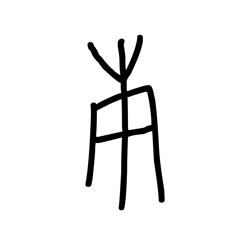

- source_zip_member: `Sub-character Images/7sys4laq6v/7sys4laq6v/04xjxa2vd4.png`
- checksum_sha256: `60889a239505a418a447ffafb7e15c4984ac2dfb7677f93bccbfa18ac84c72af`
- review_status: `needs_human_visual_review`
- caution: OBIMD subcharacter image is a source-marked review asset only; it is not a confirmed component form, component assignment, or decipherment conclusion.

## asset-020500

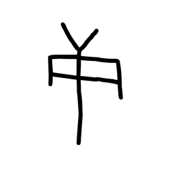

- source_zip_member: `Sub-character Images/7sys4laq6v/7sys4laq6v/06aj4dnzkn.png`
- checksum_sha256: `d27c3b06599d8aaff0adcf335bd9efa0f00992d39bb3dbc8d373198918fdd526`
- review_status: `needs_human_visual_review`
- caution: OBIMD subcharacter image is a source-marked review asset only; it is not a confirmed component form, component assignment, or decipherment conclusion.

## asset-020501

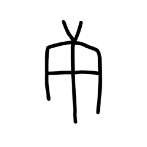

- source_zip_member: `Sub-character Images/7sys4laq6v/7sys4laq6v/255fps9goe.png`
- checksum_sha256: `48a659a55baef4d96cec4cc05f31917e1e99d93d752b06da16c509b10529c312`
- review_status: `needs_human_visual_review`
- caution: OBIMD subcharacter image is a source-marked review asset only; it is not a confirmed component form, component assignment, or decipherment conclusion.

## asset-020502

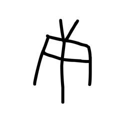

- source_zip_member: `Sub-character Images/7sys4laq6v/7sys4laq6v/32gd6ran5f.png`
- checksum_sha256: `33e02e65fd559483829a50691010ab19d720c93039d86faeebc41f7beecd6246`
- review_status: `needs_human_visual_review`
- caution: OBIMD subcharacter image is a source-marked review asset only; it is not a confirmed component form, component assignment, or decipherment conclusion.

## asset-020503

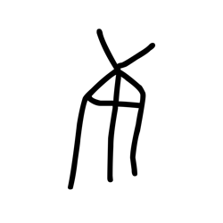

- source_zip_member: `Sub-character Images/7sys4laq6v/7sys4laq6v/36d8b0ttyc.png`
- checksum_sha256: `364df25c3da2f989b696b226a2b8cbe330b6c54efebda963a998cda29a774406`
- review_status: `needs_human_visual_review`
- caution: OBIMD subcharacter image is a source-marked review asset only; it is not a confirmed component form, component assignment, or decipherment conclusion.

## asset-020504

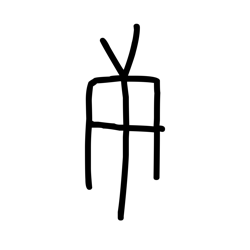

- source_zip_member: `Sub-character Images/7sys4laq6v/7sys4laq6v/3o0cdvr3sp.png`
- checksum_sha256: `570bc09be746257a1a2235826be3eea0e158d656b6be9dabc997b7751f4706b9`
- review_status: `needs_human_visual_review`
- caution: OBIMD subcharacter image is a source-marked review asset only; it is not a confirmed component form, component assignment, or decipherment conclusion.

## asset-020505

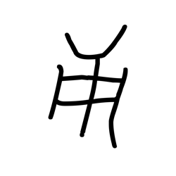

- source_zip_member: `Sub-character Images/7sys4laq6v/7sys4laq6v/3xs9p73brd.png`
- checksum_sha256: `29922cc475197a604b0b1885f3f70365d2e9432644f851af81ffdb9349df7450`
- review_status: `needs_human_visual_review`
- caution: OBIMD subcharacter image is a source-marked review asset only; it is not a confirmed component form, component assignment, or decipherment conclusion.

## asset-020506

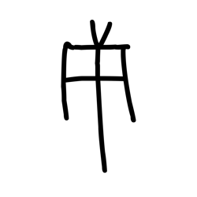

- source_zip_member: `Sub-character Images/7sys4laq6v/7sys4laq6v/3ylo8tir4j.png`
- checksum_sha256: `7444d48bef0d28a7c9b926fb6ab166af59b3d4852ed9b0074837501d9fe3f00b`
- review_status: `needs_human_visual_review`
- caution: OBIMD subcharacter image is a source-marked review asset only; it is not a confirmed component form, component assignment, or decipherment conclusion.

## asset-020507

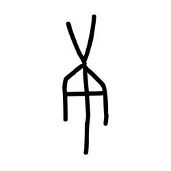

- source_zip_member: `Sub-character Images/7sys4laq6v/7sys4laq6v/489wma37u3.png`
- checksum_sha256: `3268827d7eb756c5df915054f5b3971c6a73d0fade1d5742d5aa7f8390da24eb`
- review_status: `needs_human_visual_review`
- caution: OBIMD subcharacter image is a source-marked review asset only; it is not a confirmed component form, component assignment, or decipherment conclusion.

## asset-020508

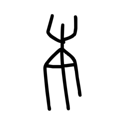

- source_zip_member: `Sub-character Images/7sys4laq6v/7sys4laq6v/49zrkpc0st.png`
- checksum_sha256: `5b66ee00d5098d4ad77ff844481cb4149bfd7c817ff2359b63c17765531093c1`
- review_status: `needs_human_visual_review`
- caution: OBIMD subcharacter image is a source-marked review asset only; it is not a confirmed component form, component assignment, or decipherment conclusion.

## asset-020509

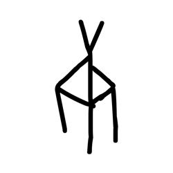

- source_zip_member: `Sub-character Images/7sys4laq6v/7sys4laq6v/5mpr29ns0v.png`
- checksum_sha256: `135f4d59a70b4b9beca0e5ae4b4c97d3c3ac09f94582fa302a2900f01a658c93`
- review_status: `needs_human_visual_review`
- caution: OBIMD subcharacter image is a source-marked review asset only; it is not a confirmed component form, component assignment, or decipherment conclusion.

## asset-020510

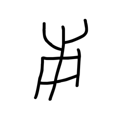

- source_zip_member: `Sub-character Images/7sys4laq6v/7sys4laq6v/68ksven4v3.png`
- checksum_sha256: `77abba042ad2d176c0db78e657a2862180e901ba29808f2cd6da64821b62a6ad`
- review_status: `needs_human_visual_review`
- caution: OBIMD subcharacter image is a source-marked review asset only; it is not a confirmed component form, component assignment, or decipherment conclusion.

## asset-020511

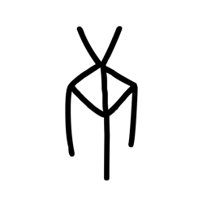

- source_zip_member: `Sub-character Images/7sys4laq6v/7sys4laq6v/6tvtcgc903.png`
- checksum_sha256: `666c7578ce4e88b40a699c992284f70dac76f0ed5ad9c6c189d541ad39604b16`
- review_status: `needs_human_visual_review`
- caution: OBIMD subcharacter image is a source-marked review asset only; it is not a confirmed component form, component assignment, or decipherment conclusion.

## asset-020512

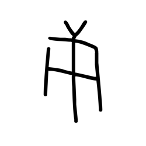

- source_zip_member: `Sub-character Images/7sys4laq6v/7sys4laq6v/773ddwf8mu.png`
- checksum_sha256: `a4ca6dd9647e1cd92b1c9927bb3917bab9c877ad8c6df221852abe265ead072e`
- review_status: `needs_human_visual_review`
- caution: OBIMD subcharacter image is a source-marked review asset only; it is not a confirmed component form, component assignment, or decipherment conclusion.

## asset-020513

- source_zip_member: `Sub-character Images/7sys4laq6v/7sys4laq6v/7sys4laq6v.png`
- checksum_sha256: `4b69c50876538a8062d0057bcba7e502cc283285fb3abe2b44c45de7401a1009`
- review_status: `needs_human_visual_review`
- caution: OBIMD subcharacter image is a source-marked review asset only; it is not a confirmed component form, component assignment, or decipherment conclusion.

## asset-020514

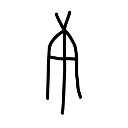

- source_zip_member: `Sub-character Images/7sys4laq6v/7sys4laq6v/869o5rdzqx.png`
- checksum_sha256: `1363a009e218eeedf76a19d0e19a724e78845178e39b451b9513d76a46090363`
- review_status: `needs_human_visual_review`
- caution: OBIMD subcharacter image is a source-marked review asset only; it is not a confirmed component form, component assignment, or decipherment conclusion.

## asset-020515

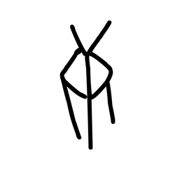

- source_zip_member: `Sub-character Images/7sys4laq6v/7sys4laq6v/9zsb18wppj.png`
- checksum_sha256: `3c2ce6cab2eb81df803dbba03f71a430739893089b97a1b745ad68a754ed4ffa`
- review_status: `needs_human_visual_review`
- caution: OBIMD subcharacter image is a source-marked review asset only; it is not a confirmed component form, component assignment, or decipherment conclusion.

## asset-020516

- source_zip_member: `Sub-character Images/7sys4laq6v/7sys4laq6v/a3qei76wch.png`
- checksum_sha256: `6f1f4c94db25f83902c46a136a0c4b064bc6a71a9ccf2e9e6c0bbe193f77c4ed`
- review_status: `needs_human_visual_review`
- caution: OBIMD subcharacter image is a source-marked review asset only; it is not a confirmed component form, component assignment, or decipherment conclusion.

## asset-020517

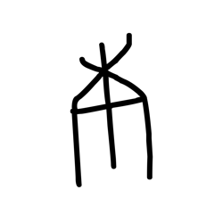

- source_zip_member: `Sub-character Images/7sys4laq6v/7sys4laq6v/ace6mkmgji.png`
- checksum_sha256: `7bc74ca11536731dbb40ca269fc963a82fb8bbbfa7365de8c4e43b79bce8759f`
- review_status: `needs_human_visual_review`
- caution: OBIMD subcharacter image is a source-marked review asset only; it is not a confirmed component form, component assignment, or decipherment conclusion.

## asset-020518

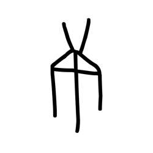

- source_zip_member: `Sub-character Images/7sys4laq6v/7sys4laq6v/al68eahss4.png`
- checksum_sha256: `a69b871f8636aa08ca54d8622b86bf4dd0cab9ae2aadd642214e4db73103581e`
- review_status: `needs_human_visual_review`
- caution: OBIMD subcharacter image is a source-marked review asset only; it is not a confirmed component form, component assignment, or decipherment conclusion.

## asset-020519

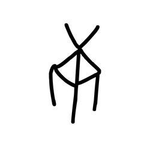

- source_zip_member: `Sub-character Images/7sys4laq6v/7sys4laq6v/bmgezt0m87.png`
- checksum_sha256: `f15ffe11eafb069b1fbfd0cb576dd3766188784fa4010bb7e3ca86123c03fe61`
- review_status: `needs_human_visual_review`
- caution: OBIMD subcharacter image is a source-marked review asset only; it is not a confirmed component form, component assignment, or decipherment conclusion.

## asset-020520

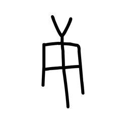

- source_zip_member: `Sub-character Images/7sys4laq6v/7sys4laq6v/bnkurnga9y.png`
- checksum_sha256: `caa36f038db1a2db1c793ad8428bf709043c0b9d3afa0ef311f7d01016c3cefd`
- review_status: `needs_human_visual_review`
- caution: OBIMD subcharacter image is a source-marked review asset only; it is not a confirmed component form, component assignment, or decipherment conclusion.

## asset-020521

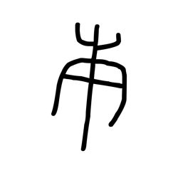

- source_zip_member: `Sub-character Images/7sys4laq6v/7sys4laq6v/bwbqct0tf8.png`
- checksum_sha256: `20136d7c16450cabaaede8aef3f9b81f554d1d00e4d16557eeddb3f8a24fceb6`
- review_status: `needs_human_visual_review`
- caution: OBIMD subcharacter image is a source-marked review asset only; it is not a confirmed component form, component assignment, or decipherment conclusion.

## asset-020522

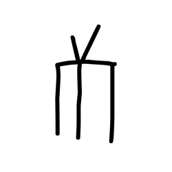

- source_zip_member: `Sub-character Images/7sys4laq6v/7sys4laq6v/c3okipx70i.png`
- checksum_sha256: `3ee475ec7e59218bb4436029d26f4a051fdd38a078d5b935856fc139142bc0f0`
- review_status: `needs_human_visual_review`
- caution: OBIMD subcharacter image is a source-marked review asset only; it is not a confirmed component form, component assignment, or decipherment conclusion.

## asset-020523

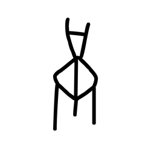

- source_zip_member: `Sub-character Images/7sys4laq6v/7sys4laq6v/cjcisvgvpt.png`
- checksum_sha256: `4138afd9ac1de28792b80b34092ae226734639dea8fcd8aa660ee1944b845544`
- review_status: `needs_human_visual_review`
- caution: OBIMD subcharacter image is a source-marked review asset only; it is not a confirmed component form, component assignment, or decipherment conclusion.

## asset-020524

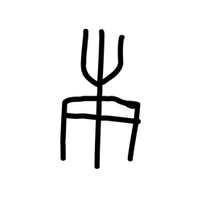

- source_zip_member: `Sub-character Images/7sys4laq6v/7sys4laq6v/czqlp97t4c.png`
- checksum_sha256: `5efac9cc4e9068d2147bba1240d1e6bfbbbf8ad552f506baffb3ab02ac2ab02e`
- review_status: `needs_human_visual_review`
- caution: OBIMD subcharacter image is a source-marked review asset only; it is not a confirmed component form, component assignment, or decipherment conclusion.

## asset-020525

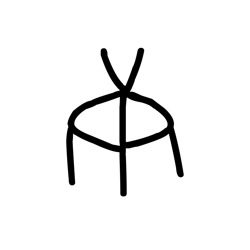

- source_zip_member: `Sub-character Images/7sys4laq6v/7sys4laq6v/d3oe5j5k53.png`
- checksum_sha256: `9cee8cf1fe26f9b73eb2b05eda530661ed683f5eb9ffe07ccff99f3d76995142`
- review_status: `needs_human_visual_review`
- caution: OBIMD subcharacter image is a source-marked review asset only; it is not a confirmed component form, component assignment, or decipherment conclusion.

## asset-020526

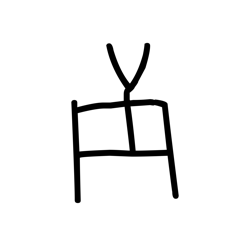

- source_zip_member: `Sub-character Images/7sys4laq6v/7sys4laq6v/didy0r13b3.png`
- checksum_sha256: `ab37c0e769893186b327009f03e91d5d3e5826a1862b9ceeb8c46a25519d363a`
- review_status: `needs_human_visual_review`
- caution: OBIMD subcharacter image is a source-marked review asset only; it is not a confirmed component form, component assignment, or decipherment conclusion.

## asset-020527

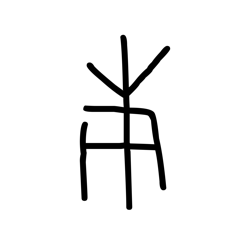

- source_zip_member: `Sub-character Images/7sys4laq6v/7sys4laq6v/edh5qpv74t.png`
- checksum_sha256: `b1bf42457f64a1110df6a7ce877d3c775597706adc5966b15cceb2b0c0b8b3c3`
- review_status: `needs_human_visual_review`
- caution: OBIMD subcharacter image is a source-marked review asset only; it is not a confirmed component form, component assignment, or decipherment conclusion.

## asset-020528

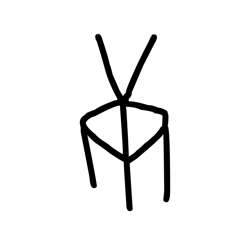

- source_zip_member: `Sub-character Images/7sys4laq6v/7sys4laq6v/g0mkodpyes.png`
- checksum_sha256: `3714e9899654780a5d8bd76551fb32a62f2449598a4d4bde995d1d322da12847`
- review_status: `needs_human_visual_review`
- caution: OBIMD subcharacter image is a source-marked review asset only; it is not a confirmed component form, component assignment, or decipherment conclusion.

## asset-020529

- source_zip_member: `Sub-character Images/7sys4laq6v/7sys4laq6v/g5aepqh3yr.png`
- checksum_sha256: `f74c1057773dab24a152b3b68b0f3972001433c8621a44d0db89296777840893`
- review_status: `needs_human_visual_review`
- caution: OBIMD subcharacter image is a source-marked review asset only; it is not a confirmed component form, component assignment, or decipherment conclusion.

## asset-020530

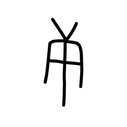

- source_zip_member: `Sub-character Images/7sys4laq6v/7sys4laq6v/h60o6o7spa.png`
- checksum_sha256: `753932f611a67e1072f827481165b3f4b959238849c24debee56f0a864c2b46e`
- review_status: `needs_human_visual_review`
- caution: OBIMD subcharacter image is a source-marked review asset only; it is not a confirmed component form, component assignment, or decipherment conclusion.

## asset-020531

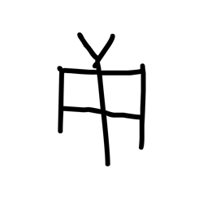

- source_zip_member: `Sub-character Images/7sys4laq6v/7sys4laq6v/hft52t8vm3.png`
- checksum_sha256: `8edc5f9145dc93654463028214649ac780c6210914edbfe09762c876eb5d6631`
- review_status: `needs_human_visual_review`
- caution: OBIMD subcharacter image is a source-marked review asset only; it is not a confirmed component form, component assignment, or decipherment conclusion.

## asset-020532

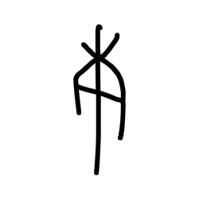

- source_zip_member: `Sub-character Images/7sys4laq6v/7sys4laq6v/i25sh7c1vo.png`
- checksum_sha256: `775a150e68592dd0bc6f7f5d8880bd101923c8083be8fb96dc3fece2d8b88f19`
- review_status: `needs_human_visual_review`
- caution: OBIMD subcharacter image is a source-marked review asset only; it is not a confirmed component form, component assignment, or decipherment conclusion.

## asset-020533

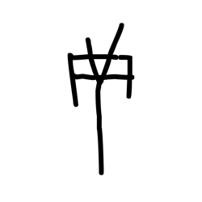

- source_zip_member: `Sub-character Images/7sys4laq6v/7sys4laq6v/i49nxgwrs6.png`
- checksum_sha256: `1773c1ca87c6e18a1bbab4c88a869d0dbb7025dfa7b9bbcb86dc7b34235acb56`
- review_status: `needs_human_visual_review`
- caution: OBIMD subcharacter image is a source-marked review asset only; it is not a confirmed component form, component assignment, or decipherment conclusion.

## asset-020534

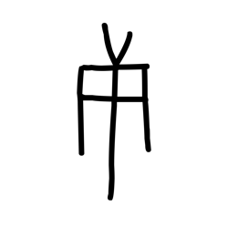

- source_zip_member: `Sub-character Images/7sys4laq6v/7sys4laq6v/iiuxsj5c9s.png`
- checksum_sha256: `073801dd674b98d09c448586392e12488c847798e4431f122232021e03a3bc1d`
- review_status: `needs_human_visual_review`
- caution: OBIMD subcharacter image is a source-marked review asset only; it is not a confirmed component form, component assignment, or decipherment conclusion.

## asset-020535

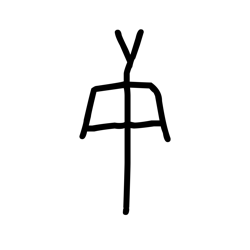

- source_zip_member: `Sub-character Images/7sys4laq6v/7sys4laq6v/jbcv9n76pd.png`
- checksum_sha256: `6437934cf99b9144a1e8f80a35cab20226dcf78555f5f032a31a7603cd08d9c3`
- review_status: `needs_human_visual_review`
- caution: OBIMD subcharacter image is a source-marked review asset only; it is not a confirmed component form, component assignment, or decipherment conclusion.

## asset-020536

- source_zip_member: `Sub-character Images/7sys4laq6v/7sys4laq6v/k5tkowl6by.png`
- checksum_sha256: `36d4fce3dbd361ad0e8caee5d42fa537a90a4f836c0b875ab6aab1cc80a635f6`
- review_status: `needs_human_visual_review`
- caution: OBIMD subcharacter image is a source-marked review asset only; it is not a confirmed component form, component assignment, or decipherment conclusion.

## asset-020537

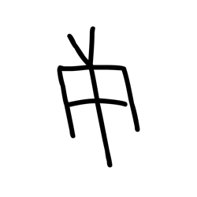

- source_zip_member: `Sub-character Images/7sys4laq6v/7sys4laq6v/luxo2f8uzh.png`
- checksum_sha256: `70bd670a2a2a96ae49caaa2d678b1c61507f9f8b819a888e8724401d3192ebdc`
- review_status: `needs_human_visual_review`
- caution: OBIMD subcharacter image is a source-marked review asset only; it is not a confirmed component form, component assignment, or decipherment conclusion.

## asset-020538

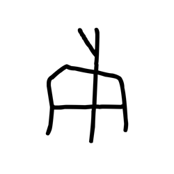

- source_zip_member: `Sub-character Images/7sys4laq6v/7sys4laq6v/mimktf1rk9.png`
- checksum_sha256: `bc265c5f27c84c9a7759f2c5d268bba095c8fd414925fad3cabd0ac1f8824b3a`
- review_status: `needs_human_visual_review`
- caution: OBIMD subcharacter image is a source-marked review asset only; it is not a confirmed component form, component assignment, or decipherment conclusion.

## asset-020539

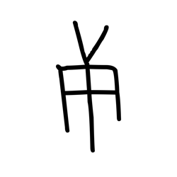

- source_zip_member: `Sub-character Images/7sys4laq6v/7sys4laq6v/mks30uh08p.png`
- checksum_sha256: `e25f320c2397279c03a3560a950e11a4b8f1d2e48dbbd92f3186c2f4641d6be8`
- review_status: `needs_human_visual_review`
- caution: OBIMD subcharacter image is a source-marked review asset only; it is not a confirmed component form, component assignment, or decipherment conclusion.

## asset-020540

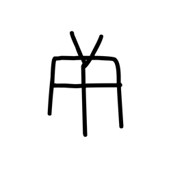

- source_zip_member: `Sub-character Images/7sys4laq6v/7sys4laq6v/p01c5vhfs9.png`
- checksum_sha256: `8ee509de3d4da80a0dcaa6ab66662f15e0c1e6557416d8f48e4deee617fcb0e7`
- review_status: `needs_human_visual_review`
- caution: OBIMD subcharacter image is a source-marked review asset only; it is not a confirmed component form, component assignment, or decipherment conclusion.

## asset-020541

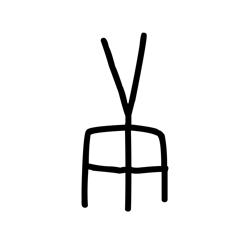

- source_zip_member: `Sub-character Images/7sys4laq6v/7sys4laq6v/rnse44remy.png`
- checksum_sha256: `a3e3a6ac2dea437d18ce77b693925aa46e7d49a6942599a45e911684348b0ad4`
- review_status: `needs_human_visual_review`
- caution: OBIMD subcharacter image is a source-marked review asset only; it is not a confirmed component form, component assignment, or decipherment conclusion.

## asset-020542

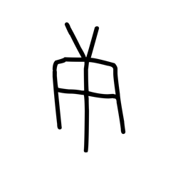

- source_zip_member: `Sub-character Images/7sys4laq6v/7sys4laq6v/s8l9mfto23.png`
- checksum_sha256: `aefcaeb6b6040785325bad139daae1329c83f3adaa50c4842258c75cbfd8cd64`
- review_status: `needs_human_visual_review`
- caution: OBIMD subcharacter image is a source-marked review asset only; it is not a confirmed component form, component assignment, or decipherment conclusion.

## asset-020543

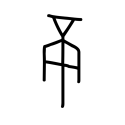

- source_zip_member: `Sub-character Images/7sys4laq6v/7sys4laq6v/sa2ng1ufck.png`
- checksum_sha256: `ba4b29cf68fd9f4d20cefb881684d49e094097399f2f3eb8840bdb9ef25ebf04`
- review_status: `needs_human_visual_review`
- caution: OBIMD subcharacter image is a source-marked review asset only; it is not a confirmed component form, component assignment, or decipherment conclusion.

## asset-020544

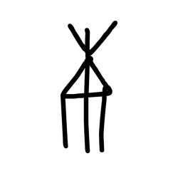

- source_zip_member: `Sub-character Images/7sys4laq6v/7sys4laq6v/st2wmrmkfc.png`
- checksum_sha256: `17761108ff81b7da2d4c9550e3486ba410c00b7f85670f122a041ddbe64c991e`
- review_status: `needs_human_visual_review`
- caution: OBIMD subcharacter image is a source-marked review asset only; it is not a confirmed component form, component assignment, or decipherment conclusion.

## asset-020545

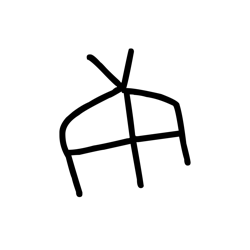

- source_zip_member: `Sub-character Images/7sys4laq6v/7sys4laq6v/ust094fx8j.png`
- checksum_sha256: `aa25d93eee99a4978ae67b5febc94fc23ae6702e581ca42f8940b6b1ce1236a7`
- review_status: `needs_human_visual_review`
- caution: OBIMD subcharacter image is a source-marked review asset only; it is not a confirmed component form, component assignment, or decipherment conclusion.

## asset-020546

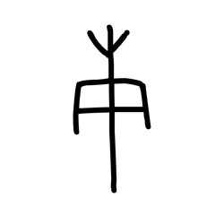

- source_zip_member: `Sub-character Images/7sys4laq6v/7sys4laq6v/v5h8v7prp2.png`
- checksum_sha256: `64cae6e7722b0d0e92bb150b57cc06e7cecee1ce6d8bc4fb501c8df21175fcd7`
- review_status: `needs_human_visual_review`
- caution: OBIMD subcharacter image is a source-marked review asset only; it is not a confirmed component form, component assignment, or decipherment conclusion.

## asset-020547

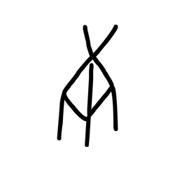

- source_zip_member: `Sub-character Images/7sys4laq6v/7sys4laq6v/w0eujwv1la.png`
- checksum_sha256: `05b65b2bef67d509b9f8366526dc763c1b0714eaa0c299ba9680740f262ef354`
- review_status: `needs_human_visual_review`
- caution: OBIMD subcharacter image is a source-marked review asset only; it is not a confirmed component form, component assignment, or decipherment conclusion.

## asset-020548

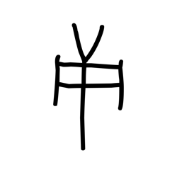

- source_zip_member: `Sub-character Images/7sys4laq6v/7sys4laq6v/w4t1025w5p.png`
- checksum_sha256: `19e88b7a69f89c967d3f64668e0a1a255ce2ebd2187a3cebe56a708ce0c1678f`
- review_status: `needs_human_visual_review`
- caution: OBIMD subcharacter image is a source-marked review asset only; it is not a confirmed component form, component assignment, or decipherment conclusion.

## asset-020549

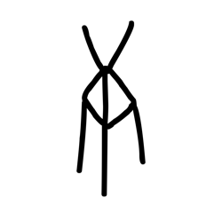

- source_zip_member: `Sub-character Images/7sys4laq6v/7sys4laq6v/wh0oaqukvs.png`
- checksum_sha256: `cb190debca520c5042a12465f15093c3314ff42ddc7e5976ae4028b44d24c450`
- review_status: `needs_human_visual_review`
- caution: OBIMD subcharacter image is a source-marked review asset only; it is not a confirmed component form, component assignment, or decipherment conclusion.

## asset-020550

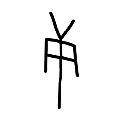

- source_zip_member: `Sub-character Images/7sys4laq6v/7sys4laq6v/zig66touy8.png`
- checksum_sha256: `5ec09379c74b665fddbb1e96a705096db7edc13248fe24c22056c2b96b185b13`
- review_status: `needs_human_visual_review`
- caution: OBIMD subcharacter image is a source-marked review asset only; it is not a confirmed component form, component assignment, or decipherment conclusion.

## asset-020551

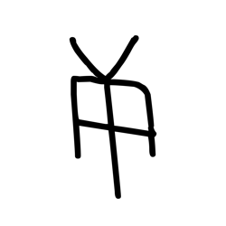

- source_zip_member: `Sub-character Images/7sys4laq6v/7sys4laq6v/zzo3ijuhib.png`
- checksum_sha256: `af8eb70c144cfb82894357d8dd0a68e6d47fd02818db709828a3d1299aff83ba`
- review_status: `needs_human_visual_review`
- caution: OBIMD subcharacter image is a source-marked review asset only; it is not a confirmed component form, component assignment, or decipherment conclusion.
