# Component Visual Gallery / 构件图像查看: obs-comp-cand-002429

English:
This page displays OBIMD subcharacter PNG assets extracted into this concrete
corpus object directory for human review.

简体中文：
本页展示抽取到当前具体 corpus 对象目录内的 OBIMD subcharacter PNG 资料，供人工复核使用。

Boundary / 边界：
dataset image candidate only; not a confirmed component form, not a component
assignment, and not a decipherment claim.
- not a confirmed component form
- not a component assignment
- not a decipherment claim

## Concrete Questions To Check / 具体待查问题

- Open 06_component-visual-index.csv and name the local image row.
- 打开 06_component-visual-index.csv，写明本地图像行。
- Open 09_component-visual-route-index.csv and name the source route row.
- 打开 09_component-visual-route-index.csv，写明来源路线行。
- Open 13_component-context-evidence-dossier.md for character context.
- 打开 13_component-context-evidence-dossier.md，核对单字与卜辞上下文。
- Record the missing image, near-shape, source, or context route.
- 记录缺失的图像、近形、来源或上下文路线。

## asset-020552

- source_zip_member: `Sub-character Images/7sys4laq6v/s1jcilzc8h/1idqm5xae8.png`
- checksum_sha256: see `06_component-visual-index.csv`.
- review_status: `needs_human_visual_review`
- caution: source-marked review image only.

## asset-020553

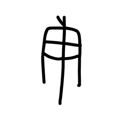

- source_zip_member: `Sub-character Images/7sys4laq6v/s1jcilzc8h/1oj4s44q1q.png`
- checksum_sha256: see `06_component-visual-index.csv`.
- review_status: `needs_human_visual_review`
- caution: source-marked review image only.

## asset-020554

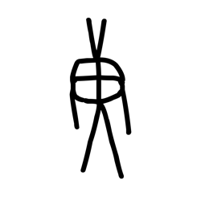

- source_zip_member: `Sub-character Images/7sys4laq6v/s1jcilzc8h/1wyo5bf4lb.png`
- checksum_sha256: see `06_component-visual-index.csv`.
- review_status: `needs_human_visual_review`
- caution: source-marked review image only.

## asset-020555

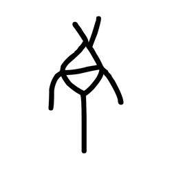

- source_zip_member: `Sub-character Images/7sys4laq6v/s1jcilzc8h/35b3sayccv.png`
- checksum_sha256: see `06_component-visual-index.csv`.
- review_status: `needs_human_visual_review`
- caution: source-marked review image only.

## asset-020556

- source_zip_member: `Sub-character Images/7sys4laq6v/s1jcilzc8h/3iwz8pe03g.png`
- checksum_sha256: see `06_component-visual-index.csv`.
- review_status: `needs_human_visual_review`
- caution: source-marked review image only.

## asset-020557

- source_zip_member: `Sub-character Images/7sys4laq6v/s1jcilzc8h/3mo6lo23mu.png`
- checksum_sha256: see `06_component-visual-index.csv`.
- review_status: `needs_human_visual_review`
- caution: source-marked review image only.

## asset-020558

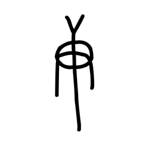

- source_zip_member: `Sub-character Images/7sys4laq6v/s1jcilzc8h/3neravr01e.png`
- checksum_sha256: see `06_component-visual-index.csv`.
- review_status: `needs_human_visual_review`
- caution: source-marked review image only.

## asset-020559

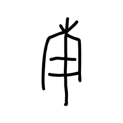

- source_zip_member: `Sub-character Images/7sys4laq6v/s1jcilzc8h/48mmkv8klb.png`
- checksum_sha256: see `06_component-visual-index.csv`.
- review_status: `needs_human_visual_review`
- caution: source-marked review image only.

## asset-020560

- source_zip_member: `Sub-character Images/7sys4laq6v/s1jcilzc8h/4cpzmigfur.png`
- checksum_sha256: see `06_component-visual-index.csv`.
- review_status: `needs_human_visual_review`
- caution: source-marked review image only.

## asset-020561

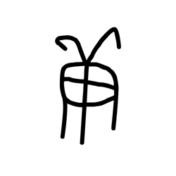

- source_zip_member: `Sub-character Images/7sys4laq6v/s1jcilzc8h/4edlfwksf9.png`
- checksum_sha256: see `06_component-visual-index.csv`.
- review_status: `needs_human_visual_review`
- caution: source-marked review image only.

## asset-020562

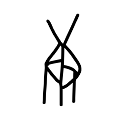

- source_zip_member: `Sub-character Images/7sys4laq6v/s1jcilzc8h/64at3sfcl7.png`
- checksum_sha256: see `06_component-visual-index.csv`.
- review_status: `needs_human_visual_review`
- caution: source-marked review image only.

## asset-020563

- source_zip_member: `Sub-character Images/7sys4laq6v/s1jcilzc8h/6eqtio6ppm.png`
- checksum_sha256: see `06_component-visual-index.csv`.
- review_status: `needs_human_visual_review`
- caution: source-marked review image only.

## asset-020564

- source_zip_member: `Sub-character Images/7sys4laq6v/s1jcilzc8h/6v1493v81l.png`
- checksum_sha256: see `06_component-visual-index.csv`.
- review_status: `needs_human_visual_review`
- caution: source-marked review image only.

## asset-020565

- source_zip_member: `Sub-character Images/7sys4laq6v/s1jcilzc8h/8yg3xhmz12.png`
- checksum_sha256: see `06_component-visual-index.csv`.
- review_status: `needs_human_visual_review`
- caution: source-marked review image only.

## asset-020566

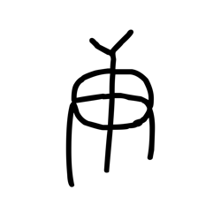

- source_zip_member: `Sub-character Images/7sys4laq6v/s1jcilzc8h/9ifvg1vx88.png`
- checksum_sha256: see `06_component-visual-index.csv`.
- review_status: `needs_human_visual_review`
- caution: source-marked review image only.

## asset-020567

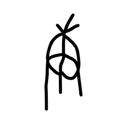

- source_zip_member: `Sub-character Images/7sys4laq6v/s1jcilzc8h/9ztrgqmg0w.png`
- checksum_sha256: see `06_component-visual-index.csv`.
- review_status: `needs_human_visual_review`
- caution: source-marked review image only.

## asset-020568

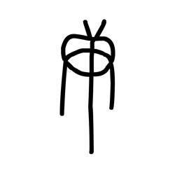

- source_zip_member: `Sub-character Images/7sys4laq6v/s1jcilzc8h/auv9z4bwtg.png`
- checksum_sha256: see `06_component-visual-index.csv`.
- review_status: `needs_human_visual_review`
- caution: source-marked review image only.

## asset-020569

- source_zip_member: `Sub-character Images/7sys4laq6v/s1jcilzc8h/d2tpcvmjh6.png`
- checksum_sha256: see `06_component-visual-index.csv`.
- review_status: `needs_human_visual_review`
- caution: source-marked review image only.

## asset-020570

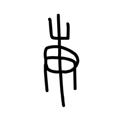

- source_zip_member: `Sub-character Images/7sys4laq6v/s1jcilzc8h/d8u6bowj8p.png`
- checksum_sha256: see `06_component-visual-index.csv`.
- review_status: `needs_human_visual_review`
- caution: source-marked review image only.

## asset-020571

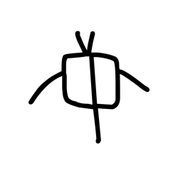

- source_zip_member: `Sub-character Images/7sys4laq6v/s1jcilzc8h/dl4bo3ml9a.png`
- checksum_sha256: see `06_component-visual-index.csv`.
- review_status: `needs_human_visual_review`
- caution: source-marked review image only.

## asset-020572

- source_zip_member: `Sub-character Images/7sys4laq6v/s1jcilzc8h/dnpvj7tm6y.png`
- checksum_sha256: see `06_component-visual-index.csv`.
- review_status: `needs_human_visual_review`
- caution: source-marked review image only.

## asset-020573

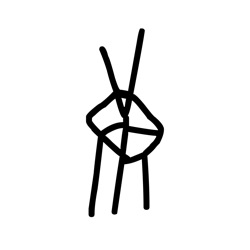

- source_zip_member: `Sub-character Images/7sys4laq6v/s1jcilzc8h/ebzhp6i1at.png`
- checksum_sha256: see `06_component-visual-index.csv`.
- review_status: `needs_human_visual_review`
- caution: source-marked review image only.

## asset-020574

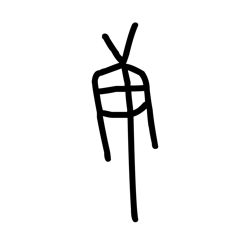

- source_zip_member: `Sub-character Images/7sys4laq6v/s1jcilzc8h/ec7ygtarsr.png`
- checksum_sha256: see `06_component-visual-index.csv`.
- review_status: `needs_human_visual_review`
- caution: source-marked review image only.

## asset-020575

- source_zip_member: `Sub-character Images/7sys4laq6v/s1jcilzc8h/fgya84mn26.png`
- checksum_sha256: see `06_component-visual-index.csv`.
- review_status: `needs_human_visual_review`
- caution: source-marked review image only.

## asset-020576

- source_zip_member: `Sub-character Images/7sys4laq6v/s1jcilzc8h/gfz6056274.png`
- checksum_sha256: see `06_component-visual-index.csv`.
- review_status: `needs_human_visual_review`
- caution: source-marked review image only.

## asset-020577

- source_zip_member: `Sub-character Images/7sys4laq6v/s1jcilzc8h/gs72i1kwuv.png`
- checksum_sha256: see `06_component-visual-index.csv`.
- review_status: `needs_human_visual_review`
- caution: source-marked review image only.

## asset-020578

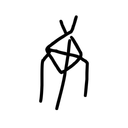

- source_zip_member: `Sub-character Images/7sys4laq6v/s1jcilzc8h/hlzg2dob4g.png`
- checksum_sha256: see `06_component-visual-index.csv`.
- review_status: `needs_human_visual_review`
- caution: source-marked review image only.

## asset-020579

- source_zip_member: `Sub-character Images/7sys4laq6v/s1jcilzc8h/ih2jdb276b.png`
- checksum_sha256: see `06_component-visual-index.csv`.
- review_status: `needs_human_visual_review`
- caution: source-marked review image only.

## asset-020580

- source_zip_member: `Sub-character Images/7sys4laq6v/s1jcilzc8h/jheokfvp2r.png`
- checksum_sha256: see `06_component-visual-index.csv`.
- review_status: `needs_human_visual_review`
- caution: source-marked review image only.

## asset-020581

- source_zip_member: `Sub-character Images/7sys4laq6v/s1jcilzc8h/kbn1jnidxx.png`
- checksum_sha256: see `06_component-visual-index.csv`.
- review_status: `needs_human_visual_review`
- caution: source-marked review image only.

## asset-020582

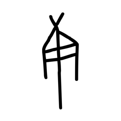

- source_zip_member: `Sub-character Images/7sys4laq6v/s1jcilzc8h/m29y8r7pvl.png`
- checksum_sha256: see `06_component-visual-index.csv`.
- review_status: `needs_human_visual_review`
- caution: source-marked review image only.

## asset-020583

- source_zip_member: `Sub-character Images/7sys4laq6v/s1jcilzc8h/njbmbpvana.png`
- checksum_sha256: see `06_component-visual-index.csv`.
- review_status: `needs_human_visual_review`
- caution: source-marked review image only.

## asset-020584

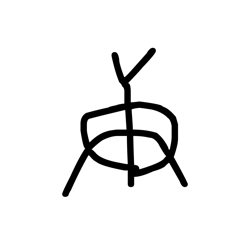

- source_zip_member: `Sub-character Images/7sys4laq6v/s1jcilzc8h/pk8pbpcf23.png`
- checksum_sha256: see `06_component-visual-index.csv`.
- review_status: `needs_human_visual_review`
- caution: source-marked review image only.

## asset-020585

- source_zip_member: `Sub-character Images/7sys4laq6v/s1jcilzc8h/q4jdx4bzyv.png`
- checksum_sha256: see `06_component-visual-index.csv`.
- review_status: `needs_human_visual_review`
- caution: source-marked review image only.

## asset-020586

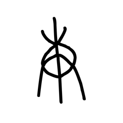

- source_zip_member: `Sub-character Images/7sys4laq6v/s1jcilzc8h/qw3uj7cd2a.png`
- checksum_sha256: see `06_component-visual-index.csv`.
- review_status: `needs_human_visual_review`
- caution: source-marked review image only.

## asset-020587

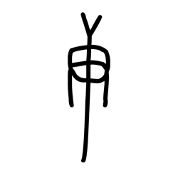

- source_zip_member: `Sub-character Images/7sys4laq6v/s1jcilzc8h/rf4tgm6h0l.png`
- checksum_sha256: see `06_component-visual-index.csv`.
- review_status: `needs_human_visual_review`
- caution: source-marked review image only.

## asset-020588

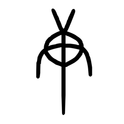

- source_zip_member: `Sub-character Images/7sys4laq6v/s1jcilzc8h/s1jcilzc8h.png`
- checksum_sha256: see `06_component-visual-index.csv`.
- review_status: `needs_human_visual_review`
- caution: source-marked review image only.

## asset-020589

- source_zip_member: `Sub-character Images/7sys4laq6v/s1jcilzc8h/scqwgtojsi.png`
- checksum_sha256: see `06_component-visual-index.csv`.
- review_status: `needs_human_visual_review`
- caution: source-marked review image only.

## asset-020590

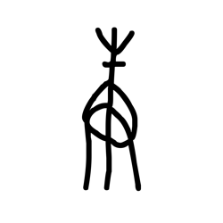

- source_zip_member: `Sub-character Images/7sys4laq6v/s1jcilzc8h/sg0w0jfegu.png`
- checksum_sha256: see `06_component-visual-index.csv`.
- review_status: `needs_human_visual_review`
- caution: source-marked review image only.

## asset-020591

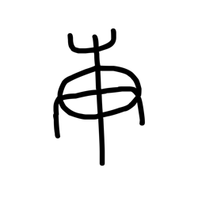

- source_zip_member: `Sub-character Images/7sys4laq6v/s1jcilzc8h/th35dn28wv.png`
- checksum_sha256: see `06_component-visual-index.csv`.
- review_status: `needs_human_visual_review`
- caution: source-marked review image only.

## asset-020592

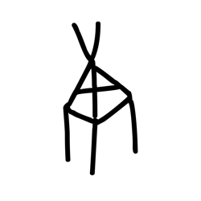

- source_zip_member: `Sub-character Images/7sys4laq6v/s1jcilzc8h/too6o2j2zq.png`
- checksum_sha256: see `06_component-visual-index.csv`.
- review_status: `needs_human_visual_review`
- caution: source-marked review image only.

## asset-020593

- source_zip_member: `Sub-character Images/7sys4laq6v/s1jcilzc8h/tr1q3d65y6.png`
- checksum_sha256: see `06_component-visual-index.csv`.
- review_status: `needs_human_visual_review`
- caution: source-marked review image only.

## asset-020594

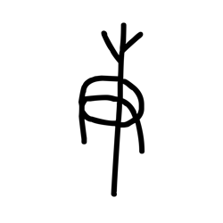

- source_zip_member: `Sub-character Images/7sys4laq6v/s1jcilzc8h/ua9sqir1w5.png`
- checksum_sha256: see `06_component-visual-index.csv`.
- review_status: `needs_human_visual_review`
- caution: source-marked review image only.

## asset-020595

- source_zip_member: `Sub-character Images/7sys4laq6v/s1jcilzc8h/v67rmqh6dn.png`
- checksum_sha256: see `06_component-visual-index.csv`.
- review_status: `needs_human_visual_review`
- caution: source-marked review image only.

## asset-020596

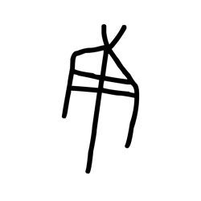

- source_zip_member: `Sub-character Images/7sys4laq6v/s1jcilzc8h/vte60hmeti.png`
- checksum_sha256: see `06_component-visual-index.csv`.
- review_status: `needs_human_visual_review`
- caution: source-marked review image only.

## asset-020597

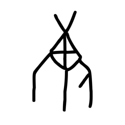

- source_zip_member: `Sub-character Images/7sys4laq6v/s1jcilzc8h/wcto24x4c3.png`
- checksum_sha256: see `06_component-visual-index.csv`.
- review_status: `needs_human_visual_review`
- caution: source-marked review image only.

## asset-020598

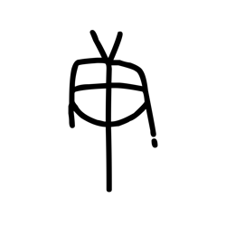

- source_zip_member: `Sub-character Images/7sys4laq6v/s1jcilzc8h/wiirfwu2zb.png`
- checksum_sha256: see `06_component-visual-index.csv`.
- review_status: `needs_human_visual_review`
- caution: source-marked review image only.

## asset-020599

- source_zip_member: `Sub-character Images/7sys4laq6v/s1jcilzc8h/wjpe2jsfre.png`
- checksum_sha256: see `06_component-visual-index.csv`.
- review_status: `needs_human_visual_review`
- caution: source-marked review image only.

## asset-020600

- source_zip_member: `Sub-character Images/7sys4laq6v/s1jcilzc8h/xqrhh8k0it.png`
- checksum_sha256: see `06_component-visual-index.csv`.
- review_status: `needs_human_visual_review`
- caution: source-marked review image only.

## asset-020601

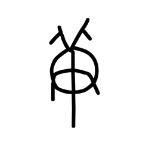

- source_zip_member: `Sub-character Images/7sys4laq6v/s1jcilzc8h/ykc5cvxs2n.png`
- checksum_sha256: see `06_component-visual-index.csv`.
- review_status: `needs_human_visual_review`
- caution: source-marked review image only.
