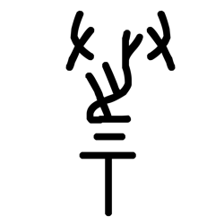

# Component Visual Gallery / 构件图像查看: obs-comp-cand-002463

English:
This page displays OBIMD subcharacter PNG assets extracted into this concrete corpus object directory for human review.

简体中文：
本页展示抽取到当前具体 corpus 对象目录内的 OBIMD subcharacter PNG 资料，供人工复核使用。

Boundary / 边界：dataset image candidate only; not a confirmed component form, component assignment, or decipherment claim.

## asset-020648

- source_zip_member: `Sub-character Images/qw5vx1k0rw/qw5vx1k0rw/qw5vx1k0rw.png`
- checksum_sha256: `1349a2d353dbd01f23ca490c070ab86a8b5fa5ac73a127ec60b3cdb21a53b29f`
- review_status: `needs_human_visual_review`
- caution: OBIMD subcharacter image is a source-marked review asset only; it is not a confirmed component form, component assignment, or decipherment conclusion.
