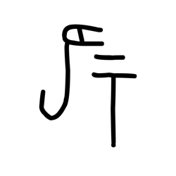
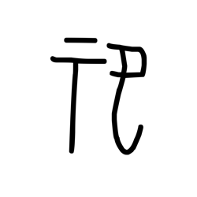

# Component Visual Gallery / 构件图像查看: obs-comp-cand-002480

English:
This page displays OBIMD subcharacter PNG assets extracted into this concrete corpus object directory for human review.

简体中文：
本页展示抽取到当前具体 corpus 对象目录内的 OBIMD subcharacter PNG 资料，供人工复核使用。

Boundary / 边界：dataset image candidate only; not a confirmed component form, component assignment, or decipherment claim.

## asset-020665

- source_zip_member: `Sub-character Images/oqwz3j1hh1/oqwz3j1hh1/86lz6gw7mq.png`
- checksum_sha256: `53bcab82155599aa4c6dccb3826f07400f946432fbf4b68cda843c10801508c7`
- review_status: `needs_human_visual_review`
- caution: OBIMD subcharacter image is a source-marked review asset only; it is not a confirmed component form, component assignment, or decipherment conclusion.

## asset-020666

- source_zip_member: `Sub-character Images/oqwz3j1hh1/oqwz3j1hh1/hzctphxt42.png`
- checksum_sha256: `f6081c9b4dbffba573263b5b8e7e28c58b5fc921134f1d5aa626cf1b08b7778a`
- review_status: `needs_human_visual_review`
- caution: OBIMD subcharacter image is a source-marked review asset only; it is not a confirmed component form, component assignment, or decipherment conclusion.

## asset-020667

- source_zip_member: `Sub-character Images/oqwz3j1hh1/oqwz3j1hh1/oqwz3j1hh1.png`
- checksum_sha256: `fb0a2aa9ead1b3f0c36cbc8fe7718c948e49687f7b6c5dac9f6755799b4ad517`
- review_status: `needs_human_visual_review`
- caution: OBIMD subcharacter image is a source-marked review asset only; it is not a confirmed component form, component assignment, or decipherment conclusion.

## asset-020668

- source_zip_member: `Sub-character Images/oqwz3j1hh1/oqwz3j1hh1/yttaxruyw6.png`
- checksum_sha256: `d2ec2c74782eee7d5205086319bb2584fbceba8bbdd7b272eb86bd699b7ce661`
- review_status: `needs_human_visual_review`
- caution: OBIMD subcharacter image is a source-marked review asset only; it is not a confirmed component form, component assignment, or decipherment conclusion.
